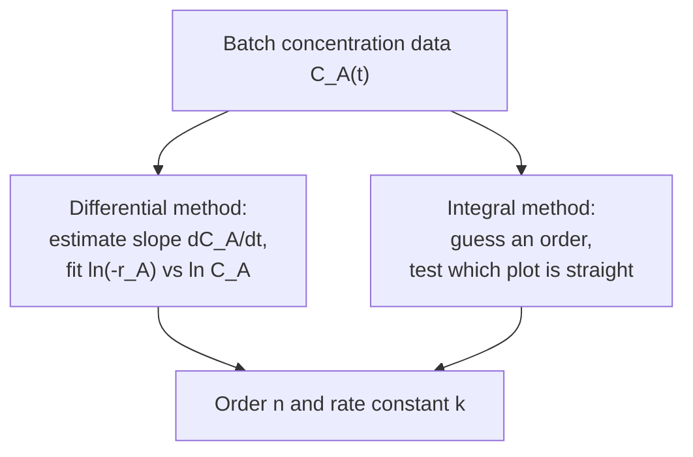

## Video Lecture

<div class="video-container">
  <iframe
    width="560"
    height="315"
    src="https://www.youtube.com/embed/GIrdjPDTjwY"
    title="Chemical Engineering Reaction Engineering Ch.1: Rate Laws and the Arrhenius Equation"
    frameborder="0"
    allow="accelerometer; autoplay; clipboard-write; encrypted-media; gyroscope; picture-in-picture"
    allowfullscreen>
  </iframe>
</div>

> This video covers the same content as the text below. Choose your preferred learning format.

---

# Chapter 1: Rate Laws and the Arrhenius Equation

This chapter opens the reaction-engineering series with the quantity every reactor is sized around — the rate at which molecules change identity — and with the two things an engineer must know about it before drawing a vessel: how the rate depends on concentration, and how violently it depends on temperature.

**How Fast, in What Order, and Why Temperature Rules Everything**

## Learning Objectives

By completing this chapter, you will be able to:

  * ✅ Separate the thermodynamic question (how far) from the kinetic question (how fast), and explain why both are needed
  * ✅ Write the rate definition and a power-law rate law, and state why order is empirical rather than stoichiometric
  * ✅ Apply the integrated zero-, first-, and second-order rate laws for a constant-volume batch reactor
  * ✅ Explain why only the first-order half-life is independent of concentration
  * ✅ Determine reaction order from batch data using the differential and integral methods
  * ✅ Use the Arrhenius equation quantitatively and read $E_a$ from a plot of $\ln k$ against $1/T$

**Reading Time**: 20-25 minutes **Code Examples**: 1 **Exercises**: 3

* * *

## 1.1 Kinetics is the Reactor's Law

[Introduction Chapter 2](../chemical-engineering-introduction/chapter-2.html) sketched the reactor in a single sitting: conversion, selectivity, yield, a power-law rate law, three ideal vessels, and the observation that temperature is the most powerful and most dangerous knob an operator has. That was the map. This series is the territory — the working toolkit a process engineer actually uses to size a reactor, choose its operating point, and decide whether it will stay there.

Everything in reaction engineering rests on a division of labor between two subjects, and confusing them is the most expensive mistake a beginner can make.

| Question | Subject | What it delivers |
|---|---|---|
| **How far?** | Thermodynamics | The equilibrium composition — the ceiling no catalyst can raise |
| **How fast?** | Kinetics | The rate — how much reactor volume and time it takes to approach that ceiling |

The [Chemical Engineering Thermodynamics](../chemical-engineering-thermodynamics/index.html) series handles the first question, and [its Chapter 4](../chemical-engineering-thermodynamics/chapter-4.html) in particular turns Gibbs energy into the equilibrium constant that caps conversion. **Thermodynamics is a permission slip, not a schedule.** A reaction with a hugely favorable equilibrium may still be immeasurably slow — the conversion of diamond to graphite is thermodynamically downhill at room temperature and yet nobody's jewelry is at risk. Conversely, a fast reaction with a poor equilibrium reaches its low ceiling quickly and then stops, however long the reactor is.

The two also **trade against each other**. For an exothermic reaction, raising the temperature multiplies the rate but *lowers* the equilibrium conversion, so the optimum operating temperature is a compromise rather than a maximum — ammonia synthesis being the standard illustration. This chapter builds only the kinetic half of that argument; [Chapter 5](chapter-5.html) brings the two halves together under heat effects.

Around the reactor sits the physics developed by the transport trio: [Fluid Mechanics](../chemical-engineering-fluid-mechanics/chapter-1.html) for how fluid moves through the vessel, [Heat Transfer](../chemical-engineering-heat-transfer/chapter-1.html) for whether the heat of reaction can be removed, and [Mass Transfer](../chemical-engineering-mass-transfer/chapter-1.html) for whether reactants can reach a catalyst surface at all. Reaction engineering is what happens in the middle.

This chapter builds the rate law itself. [Chapter 2](chapter-2.html) puts it into the **ideal reactors** — batch, CSTR, and PFR — and derives their design equations. [Chapter 3](chapter-3.html) treats **multiple reactions and selectivity**, where the rate law becomes a competition. [Chapter 4](chapter-4.html) covers **residence-time distribution**, the tool for real vessels that are neither perfectly mixed nor perfectly plug-flow. [Chapter 5](chapter-5.html) closes with **heat effects, thermal stability, and scale-up**.

## 1.2 Rate, Rate Law, and the Order Trap

The **reaction rate** is defined per unit volume, because a rate quoted for a whole vessel tells you nothing transferable. For a species $A$ in a closed vessel of volume $V$ holding $n_A$ moles,

$$ r_A = \frac{1}{V} \frac{dn_A}{dt} $$

Read $dn_A/dt$ simply as "how fast the number of moles of $A$ is changing." Dividing by $V$ gives an intensive quantity, in mol/(m³·s) or the more common laboratory units of mol/(L·s), that means the same thing in a 1 L flask and a 200 m³ vessel. For a reactant, $n_A$ falls, so $r_A$ is negative; engineers therefore usually work with the **rate of consumption** $-r_A$, a positive number. Rates of different species are linked by stoichiometry — in $A + 2B \rightarrow P$, $B$ disappears twice as fast as $A$ — so quoting a rate without naming its species is a common source of factor-of-two errors.

At constant volume — a liquid-phase batch reactor is the standard case — $n_A/V$ is just the concentration $C_A$, and the definition simplifies to the form used for the rest of this chapter:

$$ -r_A = -\frac{dC_A}{dt} $$

The **rate law** is the algebraic relationship between that rate and the composition. The workhorse form is the **power law**:

$$ -r_A = k \, C_A^{a} \, C_B^{b} $$

with $k$ the **rate constant** (its units depend on the order, as shown below), $a$ the order with respect to $A$, $b$ the order with respect to $B$, and $a + b$ the **overall order**.

Now the caution that every kinetics course repeats, because every kinetics course has to:

> **Reaction order is determined experimentally. It is not read off the stoichiometric coefficients.**

The reaction $A + 2B \rightarrow P$ does *not* imply $-r_A = k C_A C_B^2$. It might be first order in $A$ and zero order in $B$, or order 1.5 overall, or not a power law at all. The balanced equation is an accounting statement about what goes in and what comes out, while the rate is set by the **slowest elementary step** in the actual molecular sequence — and that sequence is invisible in the balanced equation.

This gives the one important exception:

  * An **elementary reaction** is a single molecular event, exactly as written. For these, and only these, order does follow the stoichiometry — a bimolecular elementary step $A + B \rightarrow$ products is first order in each, second order overall.
  * An **overall reaction** is the net result of a mechanism of several elementary steps. Its order must be measured, and it can be fractional, negative in some species, or temperature-dependent.

Because a rate law is only ever valid over the range of conditions where it was fitted, **an order fitted at 300 K and 1 bar carries no guarantee at 500 K and 20 bar**. Extrapolation outside the measured range is one of the standard ways a scaled-up reactor surprises its designers.

The order also fixes the units of $k$, which is a useful consistency check on any number taken from a paper or a data sheet. Since $-r_A$ has units of mol/(L·s) and $C_A$ of mol/L, $k$ must carry whatever is left over:

| Overall order | Rate law | Units of $k$ |
|---|---|---|
| **Zero** | $-r_A = k$ | mol/(L·s) |
| **First** | $-r_A = k C_A$ | s⁻¹ |
| **Second** | $-r_A = k C_A^2$ | L/(mol·s) |

A "rate constant" quoted in s⁻¹ is a first-order constant, whatever the accompanying text says.

## 1.3 Integrated Rate Laws: Constant-Volume Batch

The rate law describes an instant. What an experimenter measures is a concentration history — samples drawn from a batch reactor over minutes or hours. Connecting the two requires integrating the rate law, and for a **constant-volume batch reactor** the three common orders integrate to expressions simple enough to use on paper. The results are quoted here; the integration itself is standard calculus and is not reproduced.

**Zero order.** The rate does not depend on concentration at all:

$$ C_A = C_{A0} - k t $$

Concentration falls in a straight line until the reactant runs out, at which point the model stops applying. This is what a **saturated catalyst surface** looks like: every active site is occupied, so adding more reactant cannot speed anything up. Enzyme reactions at high substrate concentration behave the same way.

**First order.** The rate is proportional to what is left:

$$ \ln\!\frac{C_{A0}}{C_A} = k t \qquad\text{equivalently}\qquad C_A = C_{A0} e^{-kt} $$

This is the workhorse. It describes many decompositions and isomerizations, and it is the default in preliminary design because it gives closed-form reactor sizing — the $\tau$ expressions in [Introduction Chapter 2](../chemical-engineering-introduction/chapter-2.html) all come from this line.

**Second order** (in a single reactant, $2A \rightarrow$ products or $A$ reacting with itself):

$$ \frac{1}{C_A} - \frac{1}{C_{A0}} = k t $$

The rate collapses as concentration falls, so the tail of a second-order reaction is very slow — the practical reason high conversions are expensive.

The sharpest way to tell the three apart is the **half-life**, $t_{1/2}$, the time to consume half the reactant present. Setting $C_A = C_{A0}/2$ in each expression gives:

| Order | Integrated form | Linear plot | Half-life $t_{1/2}$ | Behavior of $t_{1/2}$ |
|---|---|---|---|---|
| **Zero** | $C_A = C_{A0} - kt$ | $C_A$ vs $t$ | $C_{A0} / 2k$ | **Falls** as $C_{A0}$ falls |
| **First** | $\ln(C_{A0}/C_A) = kt$ | $\ln C_A$ vs $t$ | $\ln 2 / k$ | **Constant** — independent of concentration |
| **Second** | $1/C_A - 1/C_{A0} = kt$ | $1/C_A$ vs $t$ | $1/(k C_{A0})$ | **Rises** as $C_{A0}$ falls |

The middle row is the one worth memorizing. For a first-order reaction,

$$ t_{1/2} = \frac{\ln 2}{k} \approx \frac{0.693}{k} $$

and **no concentration appears in it**. Half the material disappears in the same time whether the vessel is nearly full or nearly empty — which is why radioactive decay, a genuinely first-order process, is quoted by half-life at all. For zero and second order the half-life depends on where you start, so quoting a bare "half-life" for those reactions is meaningless without the initial concentration.

This gives a fast diagnostic needing no plotting software: measure successive half-lives from a batch record. Equal means first order. Each one longer than the last means higher order — for second order, exactly twice as long each time. Each one shorter means it is heading toward zero order. Exercise 1 works through both cases.

## 1.4 Finding the Order from Data

Since order cannot be derived, it must be extracted from measurements. Two approaches are standard, and they are complementary rather than competing.



The **differential method** works directly with the rate. Slopes are taken from the concentration-versus-time curve to estimate $-r_A$ at several concentrations, and the power law is then linearized by taking logarithms:

$$ \ln(-r_A) = \ln k + n \ln C_A $$

A plot of $\ln(-r_A)$ against $\ln C_A$ is a straight line whose **slope is the order** and whose intercept is $\ln k$. It assumes no order beforehand and returns fractional orders naturally. The drawback is worth stating plainly: estimating a slope from scattered experimental points amplifies noise, so this method is the more demanding of the two on data quality.

The **integral method** avoids differentiation entirely. Guess an order, plot the corresponding column from the Section 1.3 table, and see which is straight — $C_A$ versus $t$ for zero order, $\ln C_A$ versus $t$ with slope $-k$ for first, $1/C_A$ versus $t$ with slope $+k$ for second. It is robust because integrating already smoothed the data. Its limitations are that it only tests the orders you think to guess, and that curvature is hard to see over a narrow conversion range — **data spanning at least 50–70% conversion** is a common practical recommendation, since all three plots look approximately straight over the first 20%.

A worked linearization makes it concrete. Suppose a batch run gives $C_A$ = 1.00, 0.61, 0.37, 0.22, and 0.14 mol/L at 0, 10, 20, 30, and 40 minutes. The values of $\ln C_A$ are 0.00, −0.49, −0.99, −1.51, and −1.97, falling by very nearly 0.5 every 10 minutes. Constant decrements in $\ln C_A$ per unit time *are* a straight line on that plot, so the reaction is first order with $k \approx 0.5/10 = 0.05$ min⁻¹ and $t_{1/2} = \ln 2 / 0.05 \approx 13.9$ min — consistent with data that fall to about half in roughly 14 minutes. Had these data been second order, it would be $1/C_A$ — 1.00, 1.64, 2.70, 4.55, 7.14 — that grew by equal steps instead, and it plainly does not.

Two practical notes. Real fitting is done by least squares on the linearized form or by nonlinear regression on the rate law itself, not by eye. And a good fit to one integrated form is evidence, not proof: it shows the model is *consistent* with the data over the range measured, which is weaker than knowing the mechanism.

## 1.5 The Arrhenius Equation

Concentration explains part of a reaction's behavior. Temperature explains most of the rest, and it does so through the rate constant $k$, which is constant only with respect to concentration — never with respect to temperature. The relationship is the **Arrhenius equation**:

$$ k = A \exp\!\left(-\frac{E_a}{RT}\right) $$

with $A$ the **pre-exponential factor** (same units as $k$), $E_a$ the **activation energy** in J/mol, $R$ = 8.314 J/(mol·K), and $T$ the **absolute** temperature in kelvin. Using Celsius here is a classic and badly wrong error.

The physical picture is a barrier. Molecules must collide with enough energy to reach a strained, high-energy configuration before rearranging into products; $E_a$ is the height of that barrier, and the exponential term is essentially the fraction of molecules with enough thermal energy to clear it. Because that fraction is exponential in $1/T$, modest temperature changes produce immodest rate changes. A **catalyst** opens a different route over a lower barrier — it changes $E_a$, not the equilibrium, which is why a catalyst can make a reaction fast but never make it go further.

To compare two temperatures, the pre-exponential factor cancels:

$$ \ln\!\frac{k_2}{k_1} = \frac{E_a}{R}\left(\frac{1}{T_1} - \frac{1}{T_2}\right) $$

**Worked example.** A reaction has $E_a$ = 80 kJ/mol. A batch vessel that ran at 300 K is warmed to 310 K. How much faster does it run?

$$ \ln\!\frac{k_2}{k_1} = \frac{80{,}000}{8.314}\left(\frac{1}{300} - \frac{1}{310}\right) \approx 9{,}622 \times 1.075\times10^{-4} \approx 1.035 $$

$$ \frac{k_2}{k_1} \approx e^{1.035} \approx 2.8 $$

A 10 K rise — about 3% in absolute temperature — makes the reaction run roughly **2.8 times faster**.

This is the origin of the familiar shop-floor rule that *the rate roughly doubles for every 10 °C*. Treat it as a rough heuristic with a stated scope rather than a law: it holds reasonably well for **activation energies of roughly 50–60 kJ/mol near ambient temperature**, and it degrades outside that window in both directions. The worked case above, at a perfectly ordinary 80 kJ/mol, gives nearly a *tripling* rather than a doubling; a low-barrier reaction at 40 kJ/mol gives well under a doubling. The rule is a reasonable first guess in the absence of data and a poor substitute for measuring $E_a$.

Measuring $E_a$ is straightforward in principle. Take the logarithm of the Arrhenius equation:

$$ \ln k = \ln A - \frac{E_a}{R}\cdot\frac{1}{T} $$

so a plot of $\ln k$ against $1/T$ — the **Arrhenius plot** — is a straight line of **slope $-E_a/R$** and intercept $\ln A$. Run the reaction at several temperatures, fit $k$ at each by the methods of Section 1.4, and the slope gives the activation energy. The plot is also a diagnostic: a clean straight line supports a single controlling mechanism over that range, whereas a **kink or flattening at high temperature** is the classic signature of the chemistry ceasing to be the slow step. When transport takes over, the apparent activation energy drops sharply, and by how much depends on which transport step is limiting: under external **film** control the apparent activation energy falls to the 10–20 kJ/mol characteristic of diffusion, while under strong **pore** (intraparticle) diffusion the observed rate varies as the square root of $k D_{\text{eff}}$, so the apparent value falls to roughly **half** the intrinsic one — about 40 kJ/mol for an 80 kJ/mol reaction. That is the quantitative version of the observation in [Introduction Chapter 2](../chemical-engineering-introduction/chapter-2.html) that a reactor which stops responding to temperature is usually diffusion-limited, and it is where reaction engineering hands over to [Mass Transfer](../chemical-engineering-mass-transfer/chapter-1.html).

The code below computes the 300 → 310 K factor across a range of activation energies and shows what the same temperature step does to a first-order half-life.

```python
import math

R = 8.314  # J/(mol*K)


def rate_ratio(Ea_kJ, T1, T2):
    """Arrhenius ratio k(T2)/k(T1). Ea in kJ/mol, T in kelvin."""
    Ea = Ea_kJ * 1000.0
    return math.exp(-Ea / R * (1.0 / T2 - 1.0 / T1))


def half_life_first_order(k):
    """First-order half-life [same time unit as 1/k]; independent of concentration."""
    return math.log(2.0) / k


T1, T2 = 300.0, 310.0
print(f"Temperature step: {T1:.0f} K -> {T2:.0f} K   (1/T1 - 1/T2 = {1/T1 - 1/T2:.3e} 1/K)")
print(f"{'Ea [kJ/mol]':>12} {'ln(k2/k1)':>10} {'k2/k1':>8}")
for Ea_kJ in (40, 60, 80, 100):
    ratio = rate_ratio(Ea_kJ, T1, T2)
    print(f"{Ea_kJ:12.0f} {math.log(ratio):10.3f} {ratio:8.2f}")

print()

k0 = 0.05  # 1/min at 300 K, first order, illustrative value
print(f"First-order k at 300 K = {k0:.3f} 1/min  ->  t_half = {half_life_first_order(k0):.1f} min")
for Ea_kJ in (40, 60, 80, 100):
    k_hot = k0 * rate_ratio(Ea_kJ, T1, T2)
    print(f"  Ea = {Ea_kJ:3.0f} kJ/mol: k at 310 K = {k_hot:.3f} 1/min, "
          f"t_half = {half_life_first_order(k_hot):5.1f} min")

# Temperature step: 300 K -> 310 K   (1/T1 - 1/T2 = 1.075e-04 1/K)
#  Ea [kJ/mol]  ln(k2/k1)    k2/k1
#           40      0.517     1.68
#           60      0.776     2.17
#           80      1.035     2.81
#          100      1.293     3.64
#
# First-order k at 300 K = 0.050 1/min  ->  t_half = 13.9 min
#   Ea =  40 kJ/mol: k at 310 K = 0.084 1/min, t_half =   8.3 min
#   Ea =  60 kJ/mol: k at 310 K = 0.109 1/min, t_half =   6.4 min
#   Ea =  80 kJ/mol: k at 310 K = 0.141 1/min, t_half =   4.9 min
#   Ea = 100 kJ/mol: k at 310 K = 0.182 1/min, t_half =   3.8 min
```

The 80 kJ/mol row reproduces the worked example: $\ln(k_2/k_1)$ = 1.035, a factor of 2.81. The 60 kJ/mol row, at 2.17, is where the "doubles per 10 °C" rule of thumb comes from — and the 40 and 100 kJ/mol rows, at 1.68 and 3.64, show how quickly it stops being true. The half-life block says the same thing in the units an operator cares about: the same 10 K step cuts a 13.9 minute half-life to 8.3 minutes at 40 kJ/mol, but to 3.8 minutes at 100 kJ/mol.

Two limits are worth stating. The Arrhenius form is an excellent empirical description over ordinary process temperature ranges but is not exact — a weak temperature dependence in $A$ is often present and is usually absorbed into the fitted parameters. And a fitted $E_a$ from plant or pellet data is an **apparent** activation energy that may describe a mixture of chemistry and transport rather than the chemistry alone, which is exactly the diagnostic use described above.

## 1.6 Chapter Summary

1. **Thermodynamics says how far, kinetics says how fast**, and both are required: a favorable equilibrium can be unreachably slow and a fast reaction can stall at a low ceiling. For exothermic reactions the two pull in opposite directions with temperature, making the operating point a compromise
2. Rate is defined **per unit volume**, $r_A = (1/V)\,dn_A/dt$, so it transfers between a flask and a vessel; at constant volume this reduces to $-r_A = -dC_A/dt$, and rates of different species are linked by stoichiometry
3. The **power-law rate law** $-r_A = k C_A^a C_B^b$ has orders that are **fitted to data, never read from the stoichiometric coefficients** — order follows stoichiometry only for **elementary** reactions, and any fitted rate law is valid only over the conditions where it was measured
4. Constant-volume batch integrates to $C_A = C_{A0} - kt$ (zero order, $C_A$ vs $t$ linear), $\ln(C_{A0}/C_A) = kt$ (first order, $\ln C_A$ vs $t$ linear), and $1/C_A - 1/C_{A0} = kt$ (second order, $1/C_A$ vs $t$ linear)
5. Only the **first-order half-life is independent of concentration**: $t_{1/2} = \ln 2 / k$. Zero-order half-life falls with initial concentration, second-order half-life rises — so successive half-lives are a fast order diagnostic
6. Order is extracted by the **differential method** (slope of $\ln(-r_A)$ vs $\ln C_A$ gives $n$; noisy) or the **integral method** (test which plot is straight; robust, but needs data spanning well past 50% conversion)
7. The **Arrhenius equation** $k = A\exp(-E_a/RT)$ makes rate exponential in $1/T$: at $E_a$ = 80 kJ/mol, warming 300 K to 310 K multiplies the rate by about **2.8**. The "doubles per 10 °C" rule is a hedged heuristic valid near roughly 50–60 kJ/mol at ambient conditions
8. An **Arrhenius plot** of $\ln k$ against $1/T$ has slope $-E_a/R$; a flattening at high temperature, with an apparent $E_a$ dropping toward roughly half the intrinsic value under pore diffusion, or to the 10–20 kJ/mol range under film control, indicates that transport rather than chemistry has become the slow step

**Next chapter**: a rate law describes a point in a fluid, while a reactor is a vessel with a shape, a flow, and a mixing pattern. [Chapter 2](chapter-2.html) turns $-r_A$ into design equations for the **three ideal reactors** — batch, CSTR, and plug flow — and shows why the same chemistry needs very different volumes depending on how the vessel mixes.

## Exercises

1. **Conceptual — successive half-lives**: A batch run starts at $C_{A0}$ = 1.00 mol/L. In run X, the concentration falls to 0.50 mol/L in 20 minutes and to 0.25 mol/L 20 minutes after that. In run Y (same starting concentration), it falls to 0.50 mol/L in 20 minutes but takes a further 40 minutes to reach 0.25 mol/L. (a) Identify the order of each run. (b) Compute $k$ for each, with units. (c) For run Y, predict the time to go from 0.25 to 0.125 mol/L. (d) Why can a bare "half-life" be quoted for run X but not for run Y?
   *Hint*: use the half-life column of the Section 1.3 table; the question is whether $t_{1/2}$ depends on where you start.
   *Answer*: (a) Run X has **constant successive half-lives**, so it is **first order**. Run Y's half-life **doubles** each time the concentration halves, the signature of $t_{1/2} = 1/(kC_{A0})$, so it is **second order**. (b) Run X: $k = \ln 2 / t_{1/2} = 0.693/20 =$ **0.0347 min⁻¹** (first-order units, s⁻¹ or min⁻¹). Run Y: $k = 1/(t_{1/2}C_{A0}) = 1/(20 \times 1.00) =$ **0.05 L/(mol·min)** (second-order units). (c) Starting from 0.25 mol/L, $t_{1/2} = 1/(0.05 \times 0.25) =$ **80 minutes** — double again. The second-order tail is punishing: the first half of the material took 20 minutes, the third halving takes 80 minutes. (d) Run X's half-life is a property of the reaction alone, since $\ln 2/k$ contains no concentration. Run Y's depends on $C_{A0}$, so "the half-life is 20 minutes" is incomplete without adding "starting from 1.00 mol/L" — quoting it bare invites a fourfold error two half-lives later.

2. **Quantitative — activation energy from two temperatures**: A first-order liquid-phase reaction has $k$ = 0.012 s⁻¹ at 300 K and $k$ = 0.034 s⁻¹ at 310 K. (a) Compute $E_a$. (b) Predict $k$ at 320 K. (c) Compute the first-order half-life at each of the three temperatures. (d) Comment on whether the "doubles per 10 °C" rule described this reaction.
   *Hint*: $\ln(k_2/k_1) = (E_a/R)(1/T_1 - 1/T_2)$, and $1/300 - 1/310 \approx 1.075\times10^{-4}$ K⁻¹.
   *Answer*: (a) $k_2/k_1 = 0.034/0.012 = 2.83$, so $\ln(k_2/k_1) = 1.041$. Then $E_a = R \ln(k_2/k_1) / (1/T_1 - 1/T_2) = 8.314 \times 1.041 / 1.075\times10^{-4} \approx$ **80.5 kJ/mol** — essentially the 80 kJ/mol case worked in Section 1.5, as the ratio of about 2.8 already suggested. (b) $1/310 - 1/320 = 1.008\times10^{-4}$ K⁻¹ and $E_a/R \approx 9{,}686$ K, so $\ln(k_3/k_2) = 0.976$ and $k_3 = 0.034 \times e^{0.976} = 0.034 \times 2.65 \approx$ **0.090 s⁻¹**. Note the ratio for the second 10 K step (2.65) is slightly *smaller* than for the first (2.83): the same temperature step buys less at higher temperature, because the effect depends on $1/T$, not $T$. (c) $t_{1/2} = \ln 2/k$ gives **57.8 s** at 300 K, **20.4 s** at 310 K, and **7.7 s** at 320 K. A 20 K rise cut the half-life by a factor of about 7.5. (d) It did not. The observed factor per 10 K is about 2.8, not 2 — the true rate is roughly 40% higher than the doubling rule predicts, because at 80 kJ/mol this reaction sits well above the 50–60 kJ/mol band where the heuristic is reasonable.

3. **Discussion — "it must be second order, the stoichiometry says 2A → P"**: A junior engineer reports that a new reaction is second order, reasoning from its balanced equation $2A \rightarrow P$. Batch data are available at 40, 60, and 80 °C. (a) State what is wrong with the reasoning. (b) Describe how you would establish the true order from the data. (c) The integral method gives a good straight line for first order at 40 and 60 °C, but at 80 °C no simple order fits well and the Arrhenius plot flattens. Give two candidate explanations and one experiment that distinguishes them. (d) What would you refuse to do with the fitted rate law?
   *Answer*: (a) The balanced equation is a **stoichiometric accounting statement**; the order is set by the slowest elementary step of the mechanism, which the balanced equation does not reveal. Order follows stoichiometry only for genuinely **elementary** reactions, and $2A \rightarrow P$ is very often a net result rather than a single bimolecular event. Second order is a hypothesis to be tested, not a deduction. (b) Apply the **integral method** first because it is robust: plot $C_A$, $\ln C_A$, and $1/C_A$ against time at each temperature and see which is straight, insisting on data spanning well past 50% conversion since all three look linear early. Cross-check with **successive half-lives** — constant means first order, doubling means second. If none fits, use the **differential method**, which can return a fractional order at the cost of amplifying noise. (c) Two candidates: (i) the reaction has become **transport-limited** at 80 °C — the chemistry sped up until film or pore diffusion became the slow step, distorting the apparent order and flattening the Arrhenius plot toward roughly half the intrinsic $E_a$ under pore diffusion, or toward 10–20 kJ/mol under film control; or (ii) a **second pathway or change of mechanism** has switched on, so a single power law can no longer describe the data. Distinguishing experiment: repeat the 80 °C run at substantially higher agitation (or, for a solid catalyst, with crushed pellets). If the rate rises and the fit improves, transport was limiting; if the rate is unchanged, the chemistry has changed and the product distribution should be analyzed for a new species. (d) I would refuse to **extrapolate the fitted rate law outside the measured window** — in temperature, concentration, or pressure — and in particular refuse to size an 80 °C reactor from the 40–60 °C first-order fit, where the data already show the model breaking down. A rate law is a correlation with a validity range, and the 80 °C anomaly is the warning that the range has been exceeded.
