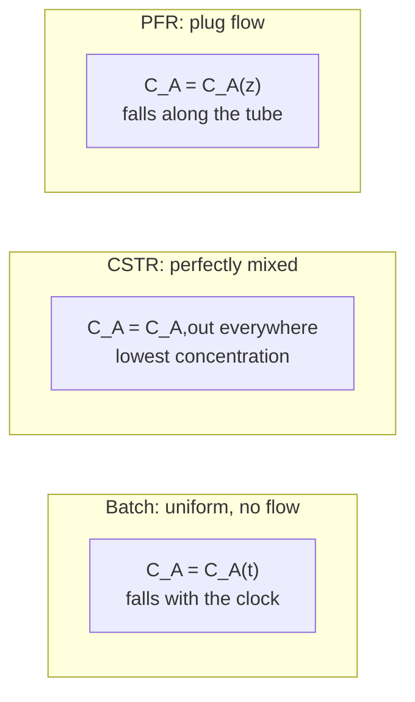

## Video Lecture

<div class="video-container">
  <iframe
    width="560"
    height="315"
    src="https://www.youtube.com/embed/GIrdjPDTjwY?start=855"
    title="Chemical Engineering Reaction Engineering Ch.2: Batch, CSTR, and PFR - The Ideal Reactors"
    frameborder="0"
    allow="accelerometer; autoplay; clipboard-write; encrypted-media; gyroscope; picture-in-picture"
    allowfullscreen>
  </iframe>
</div>

> This video covers the same content as the text below. Choose your preferred learning format.

---

# Chapter 2: Batch, CSTR, and PFR - The Ideal Reactors

[Chapter 1](chapter-1.html) built the rate law — how fast a reaction runs at a given composition and temperature. A rate law is a statement about a point in the fluid. A reactor is a vessel full of such points, and the volume you must buy depends on what composition those points are held at. This chapter connects the two.

**Design Equations, Conversion, and Which Volume Wins**

## Learning Objectives

By completing this chapter, you will be able to:

  * ✅ State the three ideal reactor models — batch, CSTR, and PFR — as promises about flow pattern rather than about chemistry
  * ✅ Define conversion $X$ and space time $\tau = V/v_0$ and use them as the common currency of reactor sizing
  * ✅ Apply the first-order constant-density design equations, $k\tau = \ln[1/(1-X)]$ for the PFR and $k\tau = X/(1-X)$ for the CSTR
  * ✅ Explain structurally why a CSTR needs more volume than a PFR for positive-order kinetics, and quantify the penalty as conversion deepens
  * ✅ Show how CSTRs in series close the gap toward plug flow
  * ✅ Name the situations in which a CSTR is the right choice despite the volume penalty
  * ✅ Read the Damköhler number $Da = k\tau$ as the dimensionless size of a reactor

**Reading Time**: 20-25 minutes **Code Examples**: 1 **Exercises**: 3

* * *

## 2.1 Three Idealizations, Three Promises About Flow

A reactor model is not a model of the chemistry. The chemistry arrived in [Chapter 1](chapter-1.html) as $-r_A = k C_A^n$, the same expression in every vessel. What changes from vessel to vessel is *where in composition space the fluid sits while it reacts*, and that is decided by how the fluid moves. The three classical reactor models are three idealized answers to that question.

The **batch reactor** is a closed vessel: charge it, react, discharge. Nothing enters or leaves during the reaction, so composition is a function of time alone. The idealization is **perfect mixing in space** — at any instant every point in the vessel shares one composition and temperature. Concentration falls as the clock runs, and the rate falls with it, so the reactor visits every composition between the charge and the final state.

The **continuous stirred-tank reactor** (CSTR, also called a mixed-flow or backmix reactor) is a tank with continuous feed, continuous outlet, and an agitator. The idealization is **instantaneous, complete mixing of the feed into the contents**: an entering molecule is immediately dispersed throughout the vessel, so the contents are uniform and — the key consequence — *the outlet stream has exactly the composition of the contents*. At steady state that composition is fixed in time, so the whole vessel sits permanently at the exit composition, which for a reaction consuming reactant is the *lowest* concentration anywhere in the process.

The **plug flow reactor** (PFR) is a tube. Fluid moves along it as a sequence of independent slabs — plugs — each with a flat velocity profile, each perfectly mixed across the cross section, none exchanging material with the plug ahead or behind. The idealization is **no axial mixing**: position along the tube maps one-to-one onto time spent in the reactor, so a plug is a small batch reactor riding down the pipe. Concentration falls with axial position, and the reaction runs across the whole range of compositions rather than at one point.

Two of these are more alike than the naming suggests. Batch and plug flow both traverse the full composition trajectory — one in time, one in space — and for constant density they give the same integral. The CSTR is the odd one out, and every result in this chapter follows from that single structural difference.



Each model is a **promise about flow pattern**, and the promise is kept by fluid mechanics, not by the reaction. A stirred tank delivers CSTR behavior only if the agitator turns over the contents far faster than the reaction consumes them; when it does not, part of the vessel is short-circuited by the feed jet and part is a stagnant pocket, and the tank behaves like neither model. A tube delivers plug flow only if the velocity profile is flat enough and axial dispersion weak enough; in laminar flow the profile is emphatically not flat — fluid on the axis moves at roughly twice the mean velocity while fluid at the wall barely moves — so a laminar tube can be a poor plug flow reactor, while the **turbulent** regime with its flatter core profile is much closer to the ideal. That is the material of our [Fluid Mechanics](../chemical-engineering-fluid-mechanics/index.html) series, where the Reynolds number and these flow regimes are developed. [Chapter 4](chapter-4.html) returns with the diagnostic tool — residence time distribution — that measures how badly a real vessel departs from the promise.

## 2.2 Conversion, Space Time, and the Design Equations

Reactor sizing needs a currency, and it uses two variables.

**Conversion** $X$ is the fraction of the limiting reactant fed that has reacted:

$$ X = \frac{F_{A0} - F_A}{F_{A0}} \qquad \text{(flow systems)}, \qquad X = \frac{N_{A0} - N_A}{N_{A0}} \qquad \text{(batch)} $$

It runs from 0 to 1 and it is the specification the process hands to the reactor designer: "convert 90% of the feed." For **constant density** — a reasonable approximation for most liquid-phase work and for gas-phase reactions with no change in mole number — concentration follows directly, $C_A = C_{A0}(1 - X)$.

**Space time** $\tau$ is the reactor volume divided by the volumetric feed rate:

$$ \tau = \frac{V}{v_0} $$

It has units of time and reads as the time needed to process one reactor volume of feed. For a constant-density system it also equals the mean residence time, which is why it is often loosely called that; when density changes along the reactor the two separate, and $\tau$ — defined on the *inlet* flow — remains the cleaner design variable.

The design equations come from a mole balance on each ideal reactor. For **first-order kinetics at constant density**, $-r_A = kC_A$:

| Reactor | Design equation | Solved for conversion |
|---|---|---|
| **Batch** | $\displaystyle kt = \ln\!\frac{1}{1-X}$ | $X = 1 - e^{-kt}$ |
| **PFR** | $\displaystyle k\tau = \ln\!\frac{1}{1-X}$ | $X = 1 - e^{-k\tau}$ |
| **CSTR** | $\displaystyle k\tau = \frac{X}{1-X}$ | $\displaystyle X = \frac{k\tau}{1+k\tau}$ |

Batch and PFR are the same equation with $t$ and $\tau$ exchanged, which is the formal version of "a plug is a batch reactor riding down the tube." The CSTR is different in kind: a logarithm on one side, a ratio on the other.

The difference is not an algebraic accident. The PFR balance integrates the rate over the falling concentration profile,

$$ \tau = C_{A0}\int_0^X \frac{dX}{-r_A} $$

so every part of the tube contributes at *its own local* rate — high near the inlet where reactant is plentiful, low near the outlet. The CSTR balance is not an integral at all, because nothing varies inside:

$$ \tau = \frac{C_{A0}X}{(-r_A)_{exit}} $$

The entire volume runs at the **exit** rate. Feed entering a CSTR is instantly diluted from $C_{A0}$ down to $C_{A0}(1-X)$ and reacts at that reduced concentration for its whole stay. For any kinetics of **positive order**, where rate rises with concentration, this is the worst place to operate: the CSTR deliberately throws away the fast, high-concentration part of the reaction that the PFR harvests along the first stretch of its tube. That is the structural reason a CSTR needs more volume, and it is worth stating as a rule with its exception attached — for positive-order kinetics the CSTR is larger; for a reaction whose rate *falls* with reactant concentration (negative-order, strongly inhibited systems — and autocatalytic systems over the low-conversion part of their range), running at low concentration is an advantage and the ranking can reverse.

## 2.3 The Volume Penalty, Quantified

Take a first-order reaction at constant density and demand $X = 0.90$.

For the PFR:

$$ k\tau_{PFR} = \ln\!\frac{1}{1-0.90} = \ln 10 \approx 2.30 $$

For the CSTR:

$$ k\tau_{CSTR} = \frac{0.90}{1-0.90} = \frac{0.90}{0.10} = 9 $$

Same reaction, same feed rate, same specification — and since $V = \tau v_0$ with $v_0$ and $k$ common to both, the volume ratio is the ratio of the $k\tau$ values:

$$ \frac{V_{CSTR}}{V_{PFR}} = \frac{9}{2.30} \approx 3.9 $$

The stirred tank must be about four times the volume of the tube. Nothing about the chemistry changed; only the concentration the fluid was held at while reacting.

Now walk the specification up and down, because the penalty is not a constant:

| Conversion $X$ | $k\tau$ PFR $= \ln[1/(1-X)]$ | $k\tau$ CSTR $= X/(1-X)$ | Volume ratio |
|---|---|---|---|
| 0.50 | 0.69 | 1.0 | **≈ 1.4** |
| 0.90 | 2.30 | 9 | **≈ 3.9** |
| 0.99 | 4.61 | 99 | **≈ 21.5** |

Read the last column as the lesson of this chapter. At half conversion the two reactors are nearly interchangeable on volume — a 40% difference is well inside the range that mechanical simplicity or heat-transfer convenience can overturn. By 90% the tank is four times larger. By 99% it is more than twenty times larger, because the CSTR's requirement grows as $X/(1-X)$ — it *diverges* as $X \to 1$ — while the PFR's grows only as a logarithm.

The engineering conclusion: **deep conversion belongs in plug flow.** If a specification demands the last few percent of reactant be consumed, a single stirred tank is the wrong vessel, and the fix is either a tubular reactor or the arrangement of the next section. Two caveats keep this honest. The numbers are exact only for first order at constant density; other orders shift the ratios, though the qualitative ranking holds for any positive order. And volume ratio is not cost ratio — a tube is not always cheaper per cubic meter than a tank, once jacketing, cleaning access, and catalyst loading enter the estimate.

## 2.4 CSTRs in Series: Buying Back the Gap

There is a middle path, and it is one of the most useful facts in reactor design. Put several CSTRs in series, feeding the outlet of each into the next, and the cascade behaves less like a single tank and more like a tube.

The mechanism follows from the structural argument. A single CSTR runs its entire volume at the *final* exit concentration. Two tanks in series each run at their own exit concentration, and the first tank's exit sits at an intermediate composition — higher than the final one, therefore faster. The cascade is a staircase descending the concentration trajectory that the PFR descends smoothly. Add tanks and the staircase gets finer; in the limit of infinitely many infinitesimal tanks it becomes the curve, and the cascade *is* a PFR.

For $N$ equal-volume CSTRs in series with first-order kinetics at constant density, the total $k\tau$ required is

$$ k\tau_{total} = N\left[\left(\frac{1}{1-X}\right)^{1/N} - 1\right] $$

which reduces to $X/(1-X)$ at $N = 1$ and approaches $\ln[1/(1-X)]$ as $N$ grows. At $X = 0.90$:

| $N$ tanks | Total $k\tau$ | Fraction of the single-tank requirement |
|---|---|---|
| 1 | 9.00 | 100% |
| 2 | 4.32 | 48% |
| 3 | 3.46 | 38% |
| 5 | 2.92 | 32% |
| 10 | 2.59 | 29% |
| PFR limit | 2.30 | 26% |

The convergence is **front-loaded**, and that is the practical point. Going from one tank to two removes more than half the total volume; a third removes a good deal of what is left. Two or three equal tanks capture much of the gap between a single CSTR and a PFR — a useful qualitative rule, though where exactly "much of the gap" lands depends on the conversion and the kinetics, so the arithmetic is worth redoing for each case. Beyond that the returns thin out: the tenth tank buys little volume and costs a vessel, an agitator, and a set of nozzles.

This is the **tanks-in-series** idea, and it has a second life. Here it is a design arrangement — real tanks, deliberately cascaded. In [Chapter 4](chapter-4.html) the same formula reappears as a *model*: an imperfectly mixed real vessel is often described by asking how many ideal tanks in series would reproduce its measured residence time distribution, with $N$ a fitted parameter rather than a count of hardware. A large fitted $N$ means near-plug-flow behavior; $N \approx 1$ means a well-mixed tank. Same equation, two readings.

## 2.5 When the CSTR Wins Anyway

Given a four-fold volume penalty at 90% conversion, the CSTR ought to be extinct. It is not — stirred tanks are among the most common reactors in the chemical and pharmaceutical industries, and the reasons have little to do with volume.

**Temperature control.** An exothermic reaction releases heat where it runs. In a PFR the rate is highest at the inlet, so the heat release concentrates there, producing a hot spot exactly where temperature is hardest to manage — and since rate rises steeply with temperature, a hot spot accelerates the very reaction that made it. A CSTR is isothermal by construction: one uniform temperature, one well-mixed vessel to cool, a jacket or coil seeing the same conditions everywhere. It is easier to hold at a setpoint and easier to reason about when the question is whether cooling capacity can keep up with heat generation. That question — thermal stability and runaway — is [Chapter 5](chapter-5.html)'s subject, and it is where the CSTR's uniformity earns most of its keep.

**Handling solids and slurries.** A catalyst suspended as a slurry, a solid reactant that must stay dispersed, a product that precipitates — all need agitation to stay suspended, and all will settle, bridge, or plug in a tube. A stirred vessel is the natural home for a heterogeneous mixture, and it also allows catalyst to be added and withdrawn without shutting the reactor down, which a packed tube does not.

**Selectivity.** The CSTR's supposed defect — running the whole volume at the lowest concentration in the process — becomes an advantage when *low* concentration is what the chemistry wants. If the desired product comes from a reaction of lower order in the reactant than a competing side reaction does, low concentration suppresses the side reaction more than the main one, and the CSTR delivers better selectivity than a PFR at the same conversion. [Chapter 3](chapter-3.html) makes that comparison quantitative; the point here is that "runs at the outlet concentration" is a design *choice* whose sign depends on the reaction network, not a defect.

**Mechanical simplicity for liquids.** A jacketed agitated vessel is standard, robust, inspectable, and cleanable. It handles viscous liquids, turns down over a wide range, can be swung between products in a multiproduct plant, and has essentially no pressure drop. A long tube at the same duty needs pumping power against friction and offers awkward cleaning access.

Reactor choice is a trade, and volume is only one axis of it. What the ratio ladder of Section 2.3 supplies is the *price* of choosing a CSTR — modest at low conversion, severe at high — so the trade can be made with the number in hand rather than by habit.

## 2.6 The Damköhler Number: Dimensionless Reactor Size

The group $k\tau$ has been doing all the work in this chapter, and it deserves a name. For a first-order reaction it is the **Damköhler number**:

$$ Da = k\tau $$

Read it as a ratio of time scales: $\tau$ is the time the fluid spends in the reactor, $1/k$ the characteristic time the reaction needs. So $Da$ asks whether the fluid stays long enough for the chemistry to happen. Equivalently it is the reaction rate at inlet conditions divided by the convective feed rate — consumption against supply.

Its usefulness is that it collapses three design variables — reactor volume, feed rate, and rate constant — into one dimensionless number, so conversion in an ideal reactor depends on $Da$ alone: $X = 1 - e^{-Da}$ for a PFR, $X = Da/(1 + Da)$ for a CSTR. Double the volume or halve the throughput and the reactor does not care which you did.

That collapse gives a quick sanity check. When $Da \ll 1$ the residence time is short compared with the reaction time and conversion is small — $X \approx Da$ for either reactor in that limit, so a bigger reactor buys proportionally more product. When $Da \gg 1$ the reaction has had ample time; the PFR is deep into its exponential tail and the CSTR on the flat part of its curve, so further volume buys progressively less. **Roughly** $Da \approx 1$ marks the boundary — where a reactor stops being obviously too small and starts running into diminishing returns. Treat it as an orientation figure, not a design rule: what counts as "enough" depends on the conversion specified, and where returns become uneconomic depends on the cost of volume against the value of the product.

Two cautions. First, $Da = k\tau$ is the *first-order* form. For order $n$ the group generalizes to $Da = k C_{A0}^{\,n-1}\tau$, so the feed concentration enters for any order but first, and a Damköhler number quoted without its reaction order is ambiguous. Second, other Damköhler numbers exist in the literature — variants comparing reaction time with mixing or diffusion time rather than residence time — so the definition should be stated rather than assumed.

## 2.7 Code Example: The Ratio Ladder and the Cascade

The two central numerical results of this chapter — the volume penalty as conversion deepens, and the approach of a CSTR cascade to plug flow — are a few lines of arithmetic.

```python
import math


def ktau_pfr(X):
    """Dimensionless size k*tau for a PFR (or k*t for a batch reactor),
    first order, constant density."""
    return math.log(1.0 / (1.0 - X))


def ktau_cstr(X):
    """Dimensionless size k*tau for a single CSTR, first order, constant density."""
    return X / (1.0 - X)


def ktau_cstr_series(X, N):
    """Total k*tau for N equal-volume CSTRs in series, first order."""
    return N * ((1.0 / (1.0 - X)) ** (1.0 / N) - 1.0)


# --- The ratio ladder: how the CSTR penalty grows with conversion ---
print(f"{'X':>6} {'PFR k.tau':>10} {'CSTR k.tau':>11} {'V_CSTR/V_PFR':>13}")
for X in (0.50, 0.90, 0.99):
    p, c = ktau_pfr(X), ktau_cstr(X)
    print(f"{X:>6.2f} {p:>10.2f} {c:>11.2f} {c / p:>13.1f}")

# --- The cascade: N equal CSTRs in series at X = 0.90 ---
X = 0.90
print(f"\nX = {X}: PFR limit k.tau = {ktau_pfr(X):.2f}\n")
print(f"{'N tanks':>8} {'total k.tau':>12} {'% of N=1':>10}")
single = ktau_cstr(X)
for N in (1, 2, 3, 5, 10):
    t = ktau_cstr_series(X, N)
    print(f"{N:>8d} {t:>12.2f} {100 * t / single:>9.0f}%")

#      X  PFR k.tau  CSTR k.tau  V_CSTR/V_PFR
#   0.50       0.69        1.00           1.4
#   0.90       2.30        9.00           3.9
#   0.99       4.61       99.00          21.5
#
# X = 0.9: PFR limit k.tau = 2.30
#
#  N tanks  total k.tau   % of N=1
#        1         9.00       100%
#        2         4.32        48%
#        3         3.46        38%
#        5         2.92        32%
#       10         2.59        29%
```

The first block is the ladder: 1.4, then 3.9, then 21.5. The penalty roughly triples between 50% and 90% conversion and multiplies by five again between 90% and 99%, because $X/(1-X)$ diverges while $\ln[1/(1-X)]$ does not.

The second block is the cascade at $X = 0.90$, descending 9.00 → 4.32 → 3.46 → 2.92 → 2.59 toward the plug-flow value of 2.30. The first added tank does most of the work; by $N = 10$ the cascade is within about 13% of the PFR, but the last five tanks bought only a small fraction of that. Note also that $N = 10$ has not *reached* 2.30 and never will at finite $N$ — the PFR is the limit of the sequence, approached but not attained.

## 2.8 Chapter Summary

1. The three ideal reactors are three **flow-pattern promises**: **batch** (uniform in space, composition a function of time), **CSTR** (perfectly mixed, so the outlet equals the contents), **PFR** (plug flow, no axial mixing, so position maps onto time). Whether a real vessel keeps its promise is a fluid mechanics question — see our [Fluid Mechanics](../chemical-engineering-fluid-mechanics/index.html) series for the regimes involved, and [Chapter 4](chapter-4.html) for how to measure the departure
2. **Conversion** $X$ is the fraction of limiting reactant consumed; **space time** $\tau = V/v_0$ is the reactor volume per unit volumetric feed. For constant density, $C_A = C_{A0}(1-X)$
3. First-order constant-density design equations: batch and PFR give $kt = k\tau = \ln[1/(1-X)]$; the CSTR gives $k\tau = X/(1-X)$. Batch and PFR share an equation because a plug is a batch reactor riding down the tube
4. The CSTR runs its **entire volume at the outlet (lowest) concentration**, discarding the fast high-concentration part of the reaction that a PFR harvests near its inlet. For any **positive-order** kinetics this costs volume; for kinetics whose rate falls with reactant concentration (negative-order, strongly inhibited systems — and autocatalytic systems over the low-conversion part of their range), the ranking can reverse
5. At $X = 0.90$, first order: PFR $k\tau = \ln 10 \approx 2.30$, CSTR $k\tau = 9$, volume ratio $\approx 3.9$. The ladder: $X = 0.50 \to \approx 1.4$, $X = 0.90 \to \approx 3.9$, $X = 0.99 \to 99/4.61 \approx 21.5$. The penalty **explodes at high conversion**, so deep conversion belongs in plug flow — or in a cascade
6. **CSTRs in series** approach plug flow: $k\tau_{total} = N[(1/(1-X))^{1/N} - 1]$. At $X = 0.90$ the ladder runs 9.00 → 4.32 → 3.46 → 2.92 → 2.59, toward the PFR's 2.30. Convergence is front-loaded — two or three equal tanks capture much of the gap. The same formula returns in [Chapter 4](chapter-4.html) as the tanks-in-series *model* of a non-ideal vessel, with $N$ fitted rather than counted
7. The CSTR wins anyway when **temperature control** matters (one uniform vessel to cool, no inlet hot spot — [Chapter 5](chapter-5.html)), when **solids or catalyst slurries** must stay suspended, when **low concentration improves selectivity** ([Chapter 3](chapter-3.html)), or for the mechanical simplicity and flexibility of a jacketed agitated vessel in liquid service
8. The **Damköhler number** $Da = k\tau$ (first order; $k C_{A0}^{n-1}\tau$ for order $n$) is the dimensionless size of a reactor — residence time against reaction time. $X = 1 - e^{-Da}$ for a PFR, $X = Da/(1+Da)$ for a CSTR. **Roughly** $Da \approx 1$ separates "too small" from "diminishing returns", as an orientation figure rather than a design rule

**Next chapter**: every reactor so far has run a single reaction, so conversion was the only performance measure. Real feedstock rarely obliges — it reacts down more than one pathway, and the product you want competes with the ones you do not. [Chapter 3](chapter-3.html) takes on **multiple reactions, yield, and selectivity**, where the concentration level a reactor holds — the very thing that decided volume here — decides instead what comes out.

## Exercises

1. **Quantitative — CSTR versus PFR sizing**: A first-order liquid-phase reaction with $k = 0.05\ \text{min}^{-1}$ is fed at $v_0 = 20\ \text{L/min}$ at constant density. The specification is $X = 0.85$. (a) Compute the required space time and volume for a PFR. (b) Compute the same for a single CSTR. (c) Give the volume ratio and place it on the ladder of Section 2.3. (d) The specification is then tightened to $X = 0.95$. Recompute both volumes and comment on which reactor's requirement grew faster.
   *Hint*: $\tau_{PFR} = \ln[1/(1-X)]/k$, $\tau_{CSTR} = X/[k(1-X)]$, and $V = \tau v_0$ in both cases.
   *Answer*: (a) $k\tau = \ln(1/0.15) = \ln 6.67 = 1.897$, so $\tau = 1.897/0.05 =$ **37.9 min** and $V = 37.9 \times 20 \approx$ **759 L**. (b) $k\tau = 0.85/0.15 = 5.667$, so $\tau = 5.667/0.05 =$ **113 min** and $V = 113 \times 20 \approx$ **2270 L**. (c) The ratio is $5.667/1.897 =$ **≈ 3.0**, which sits between the ladder's 1.4 at $X = 0.50$ and 3.9 at $X = 0.90$, as expected for a conversion of 0.85. (d) At $X = 0.95$: PFR $k\tau = \ln 20 = 3.00$, $\tau = 60.0$ min, $V =$ **1200 L**; CSTR $k\tau = 0.95/0.05 = 19.0$, $\tau = 380$ min, $V =$ **7600 L**, a ratio of **≈ 6.3**. Going from 85% to 95% conversion grew the PFR by a factor of 1.6 and the CSTR by a factor of 3.4. The CSTR requirement grows as $X/(1-X)$, which diverges as $X \to 1$, while the PFR's grows only logarithmically — the same divergence that produced the 21.5 at $X = 0.99$.

2. **Quantitative — CSTRs in series**: The same first-order reaction as Exercise 1 ($k = 0.05\ \text{min}^{-1}$, $v_0 = 20\ \text{L/min}$) must reach $X = 0.90$. (a) Compute the total volume for a single CSTR, for 2 equal CSTRs in series, and for 3 equal CSTRs in series. (b) Compare each with the PFR volume for the same duty. (c) What fraction of the single-tank-to-PFR gap does the second tank close, and what does the third add? State the practical conclusion.
   *Hint*: $k\tau_{total} = N[(1/(1-X))^{1/N} - 1]$, and the gap to close is $k\tau_{CSTR} - k\tau_{PFR} = 9.00 - 2.30$.
   *Answer*: (a) $N = 1$: $k\tau = 9.00$, $\tau = 180$ min, $V =$ **3600 L**. $N = 2$: $k\tau = 2(10^{0.5}-1) = 4.32$, $\tau = 86.5$ min, $V =$ **1730 L** total, i.e. two tanks of about 865 L each. $N = 3$: $k\tau = 3(10^{1/3}-1) = 3.46$, $\tau = 69.3$ min, $V \approx$ **1390 L** total, three tanks of about 462 L each. (b) The PFR needs $k\tau = \ln 10 = 2.30$, $\tau = 46.1$ min, $V =$ **921 L**. So the cascade volumes are 3.9×, 1.9×, and 1.5× the PFR volume for $N = 1, 2, 3$. (c) The gap in $k\tau$ terms is $9.00 - 2.30 = 6.70$. The second tank closes $9.00 - 4.32 = 4.68$, or **70%** of the gap. The third adds $4.32 - 3.46 = 0.86$, another **13%**, bringing the cascade to 83% of the way. Practical conclusion: adding one tank is usually excellent value and a second is often worthwhile, after which each additional vessel — with its agitator, nozzles, instrumentation, and control loop — buys a rapidly shrinking volume saving. Where exactly the cutoff falls depends on the relative cost of vessels and volume, but the front-loaded shape of the convergence is general.

3. **Conceptual — the price of operating at the outlet**: (a) Explain, without algebra, why a CSTR requires more volume than a PFR for the same first-order conversion, referring to the concentration each reactor's fluid experiences. (b) Explain why the penalty grows so sharply as $X \to 1$, while the PFR's requirement grows only logarithmically. (c) Name two distinct situations in which you would specify a CSTR despite the penalty, and say what property of the CSTR is doing the work in each.
   *Hint*: for (a), ask what concentration the fluid in each vessel is held at while it reacts. For (b), compare what happens to the *rate* in each reactor as the last few percent of reactant disappear.
   *Answer*: (a) A PFR's fluid traverses the whole concentration range: near the inlet it is at nearly the feed concentration and reacts fast, and only the last stretch of tube runs at the low outlet concentration. A CSTR mixes its feed instantly into the vessel contents, so *every* element of fluid, for its entire stay, reacts at the outlet concentration — the lowest concentration anywhere in the process. Since a first-order rate is proportional to concentration, the CSTR runs its whole volume at the slowest rate the duty involves, and slow rate means more volume for the same throughput. The PFR harvests the fast early reaction that the CSTR throws away. (b) The distinction lives in the last few percent. In a PFR the fast early section still does most of the work no matter how deep the final conversion, so pushing $X$ from 0.90 to 0.99 only adds tube operating at low concentration, and the requirement rises by $\ln 10 \approx 2.30$ — the same increment as every previous factor-of-ten in remaining reactant. In a CSTR the whole vessel drops to the new, lower outlet concentration, so the rate everywhere falls by the factor the specification tightened by: requiring ten times less reactant to survive makes the entire reactor ten times slower, and the volume rises about eleven-fold (99/9 = 11). Formally $X/(1-X)$ diverges as $X \to 1$ while $\ln[1/(1-X)]$ grows only logarithmically — hence 3.9 at $X = 0.90$ and 21.5 at $X = 0.99$. (c) Two examples among several. **A strongly exothermic reaction needing tight temperature control**: the property doing the work is uniformity — one temperature throughout, one well-mixed vessel to cool, and no inlet hot spot of the kind a PFR creates where its rate is highest. **A reaction whose selectivity improves at low reactant concentration**, for instance where an unwanted side reaction is of higher order in the reactant than the desired one: here the property doing the work is precisely the "defect", operation at the outlet concentration, which suppresses the side reaction more than the main one. A slurry catalyst that must stay suspended, or the mechanical simplicity and turndown of a jacketed agitated vessel, would also qualify. In every case the volume penalty is still paid; the ladder of Section 2.3 tells you how large the bill is before you decide the other benefits are worth it.
