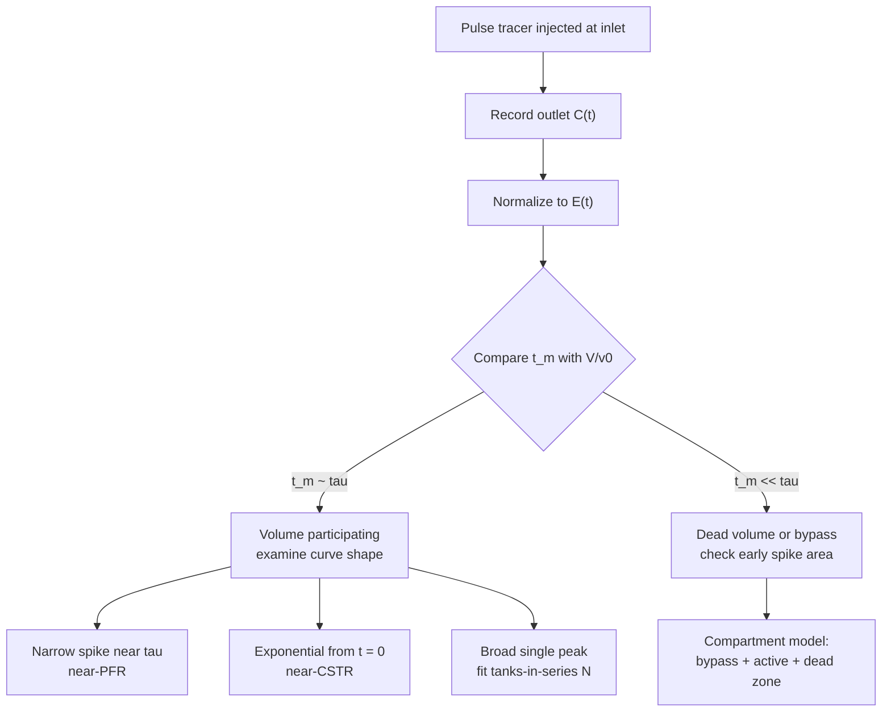

## Video Lecture

<div class="video-container">
  <iframe
    width="560"
    height="315"
    src="https://www.youtube.com/embed/GIrdjPDTjwY?start=2527"
    title="Chemical Engineering Reaction Engineering Ch.4: Residence-Time Distribution and Non-Ideal Flow"
    frameborder="0"
    allow="accelerometer; autoplay; clipboard-write; encrypted-media; gyroscope; picture-in-picture"
    allowfullscreen>
  </iframe>
</div>

> This video covers the same content as the text below. Choose your preferred learning format.

---

# Chapter 4: Residence-Time Distribution and Non-Ideal Flow

Every design equation so far has rested on a statement about how fluid moves through the vessel. That statement is an assumption, and it is measurable. This chapter is about the measurement — and about what to do when it disagrees with the assumption.

**What the Tracer Tells You the Design Equations Assumed**

## Learning Objectives

By completing this chapter, you will be able to:

  * ✅ State the flow assumptions hidden inside the ideal-reactor design equations, and say why they must be verified rather than presumed
  * ✅ Define the residence-time distribution $E(t)$ and describe the pulse and step tracer experiments that measure it
  * ✅ Compare the mean residence time from the curve against $V/v_0$ and diagnose dead volume or bypassing from the mismatch
  * ✅ Recognize the two ideal signatures — the PFR spike and the CSTR exponential $E(t) = (1/\tau)e^{-t/\tau}$ — and interpret $e^{-1} \approx$ 37%
  * ✅ Read bypassing, dead zones, and parallel paths off the shape of a measured curve
  * ✅ Fit the tanks-in-series parameter $N$ from the variance, and connect it to the CSTRs-in-series result of [Chapter 2](chapter-2.html)
  * ✅ Explain why first-order conversion depends on $E(t)$ alone, and name the micromixing bounds that matter for other orders

**Reading Time**: 20-25 minutes **Code Examples**: 1 **Exercises**: 3

* * *

## 4.1 The Gap Between Promise and Pipe

[Chapter 2](chapter-2.html) built the design equations on two clean pictures of flow. The plug-flow reactor moves fluid as a rigid column: no element passes another, nothing mixes along the axis, every molecule spends exactly the space time $\tau = V/v_0$ inside. The continuous stirred-tank reactor takes the opposite extreme: mixing is instantaneous and complete, the contents are uniform, and the outlet stream is a sample of those contents.

Neither picture is a property of the equipment. Both are claims about the flow field inside it, and a real vessel is free to violate them.

A feed nozzle placed near an outlet can send part of the stream more or less straight through — **bypassing**, or **short-circuiting** — so that a fraction of the feed leaves having spent almost no time reacting. Corners behind baffles, the region under an impeller, the low-velocity annulus in an oversized head: all can hold fluid that exchanges with the main flow only slowly, and this **dead volume** is volume the plant paid for and the reaction does not get. In a packed bed, flow can find a low-resistance route through the packing and **channel**, leaving much of the catalyst under-irrigated. In a laminar tube, no defect is needed at all: the velocity profile itself guarantees that centerline fluid arrives long before near-wall fluid.

The practical consequence is that **a reactor falling short of its predicted conversion is not necessarily a kinetics problem**. Distinguishing the two possibilities from outlet composition alone is usually impossible: a low conversion is consistent with a slow reaction in a well-behaved vessel and with a fast reaction in a badly behaved one. What separates them is a measurement of the flow itself, made without touching the chemistry.

## 4.2 The Residence-Time Distribution

Inject something detectable into the feed, watch when it leaves, and the vessel reports its own flow behavior. The **tracer** should be inert, easily measured at the outlet, and close enough to the process fluid in density and viscosity that adding it does not change the flow being measured. Dyes, salts detected by conductivity, and radioactive or fluorescent species are all standard; the requirement is not the chemistry but the conservation — whatever goes in must come out, and must not adsorb, react, or settle on the way.

### The Pulse Experiment

Inject a small quantity of tracer at the inlet as nearly instantaneously as the hardware allows, at $t = 0$, and record the outlet concentration $C(t)$ until it returns to baseline. Different tracer molecules take different paths and arrive at different times, so $C(t)$ traces out the spread of transit times directly. Normalizing by the total tracer that came out gives the **residence-time distribution**

$$ E(t) = \frac{C(t)}{\int_0^{\infty} C(t)\,dt} $$

which by construction satisfies $\int_0^{\infty} E(t)\,dt = 1$. The interpretation is worth stating carefully, because it is the whole chapter: **$E(t)\,dt$ is the fraction of the material now leaving the vessel that spent between $t$ and $t + dt$ inside it.** $E$ is a distribution over the exit stream, not over the contents.

### The Step Experiment

The alternative is to switch the feed at $t = 0$ from tracer-free to a constant tracer concentration $C_0$ and hold it there. The outlet ratio

$$ F(t) = \frac{C(t)}{C_0} $$

is the **cumulative** distribution: the fraction of the exit stream that has been inside for less than $t$. $F$ rises from 0 to 1, and $E$ is its slope, so the two experiments carry the same information.

Which to run is a practical trade. A step is easier to execute — no sharp injection is required, only a clean switch — but recovering $E$ from it means differentiating measured data, which amplifies noise, while reducing a pulse means integrating, which suppresses it. Pulse tests are more common where the injection can be made sharp relative to $\tau$; step tests are preferred where it cannot.

### The First Number: Mean Residence Time

From the curve, the mean residence time is

$$ t_m = \int_0^{\infty} t\,E(t)\,dt $$

and this is where diagnosis begins, before any model is fitted. For a vessel in which all the volume is active and all the feed passes through it, $t_m$ should equal the nominal space time $\tau = V/v_0$. When it does not — and the discrepancy is usually that **$t_m$ comes out smaller** — the vessel is telling you that the fluid is not seeing all the volume you believe it has, either because part of that volume is stagnant or because part of the feed is skipping it. A rough and useful estimate is that the active fraction of the volume is about $t_m/\tau$.

Two cautions belong with that number. First, **tracer recovery** should be checked: if less tracer comes out than went in, the balance has not closed, and the candidates are a slow-draining dead zone still releasing tracer past the end of the measurement window, adsorption on solids or walls, or an instrument problem. Second, the mean is sensitive to the **tail**, because the integrand carries a factor of $t$. Truncating a long tail early biases $t_m$ low and can manufacture apparent dead volume that is not there. Run the test long enough that the tail is genuinely at baseline, and say how long you ran it.

## 4.3 The Two Ideal Signatures

The two idealizations of [Chapter 2](chapter-2.html) have RTD signatures so distinct that a glance at a measured curve places a real vessel between them.

**Plug flow** gives every element the same transit time. Tracer injected as a pulse travels as a pulse and emerges as a pulse: $E(t)$ is a spike located at $t = \tau$ and zero everywhere else. A PFR is a **delay line** — whatever enters, leaves unchanged in shape, one space time later. Nothing arrives early because nothing overtakes; nothing arrives late because nothing lags.

**A perfectly mixed tank** gives the opposite. Because the injected tracer is dispersed through the whole volume immediately, the vessel retains no memory of when any particular element entered, and every element in the tank has the same chance per unit time of being swept out. That memoryless property produces an exponential:

$$ E(t) = \frac{1}{\tau}\,e^{-t/\tau} $$

Two features of this curve deserve emphasis. Its maximum is at $t = 0$: **some fluid leaves essentially the instant it enters**, having reacted for almost no time at all. And the fraction of the exit stream that stayed longer than one full space time is

$$ e^{-1} \approx 37\% $$

so roughly 63% of what leaves the vessel has been inside for less than $\tau$. The "average" residence time of a CSTR is an average over an enormously wide spread, and Section 4.6 will show what that spread costs.

Real vessels land between these, and where they land follows from the flow regime as much as from the geometry. A long tube in turbulent flow is close to plug flow but not exactly there: eddies transport material across the cross-section vigorously, flattening the velocity profile so that most fluid arrives near $\tau$, while the same eddies spread material axially and give the pulse a finite width. The same tube in laminar flow behaves quite differently — the parabolic profile described in [Fluid Mechanics Chapter 3](../chemical-engineering-fluid-mechanics/chapter-3.html) sends centerline fluid through well ahead of the average while near-wall fluid crawls, and radial transport is left to molecular diffusion alone, so $E(t)$ becomes broad and long-tailed without any hardware defect being present. That chapter also gives the stirred-tank Reynolds number, which is the corresponding check on whether a tank is agitated vigorously enough for the CSTR picture to be worth assuming at all.

## 4.4 Reading Pathologies from the Curve

The value of an RTD test is that different failures leave different fingerprints. The table maps the feature you see to the flow behavior it implies and to the hardware that usually causes it.

| Curve feature | What it means | Typical hardware cause |
|---|---|---|
| **Sharp spike arriving far earlier than $\tau$**, ahead of the main body | **Bypassing / short-circuiting** — a fraction of the feed reaches the outlet almost without entering the working volume; the area under the early spike estimates that fraction | Inlet and outlet nozzles too close together; an unbaffled tank in which the feed jet reaches the outlet; a leaking internal seal or partition |
| **Long, slowly decaying tail** still above baseline after several $\tau$ | **Dead or stagnant zones** exchanging with the active flow only slowly — the vessel is still draining tracer long after the bulk has left | Corners behind baffles; the region under an impeller or behind internals; a poorly drained bottom head; accumulated solids or fouling |
| **Two or more distinct peaks** | **Parallel paths of different transit times** — the feed splits and the branches do not remix before the outlet | Parallel tubes or bed sections with unequal resistance; a channel through the packing; a partially plugged pass in a multipass exchanger-reactor |
| **$t_m$ noticeably smaller than $V/v_0$** | **Volume not participating** — the fluid is turning over in less space than the drawing shows | Stagnant volume as above; a liquid level or gas holdup lower than the design value; solids inventory occupying the volume |
| **Single broad peak near $\tau$, no early spike, modest tail** | **Axial dispersion or velocity-profile spread** — not a defect, just a vessel that is less plug-like than assumed | Laminar tube flow; short length-to-diameter ratio; large packing particles relative to the tube; low flow rate |
| **Tracer recovery well below 100%** | **The measurement, not the vessel, may be at fault** — or the tracer is being retained | Adsorption on catalyst or walls; a tracer that is not truly inert; a measurement window ended before the tail; a leak |

Two habits make these readings reliable. Compare the measured curve against the **expected** one for the intended flow pattern, not against a blank page — a broad curve is alarming for a packed bed and unremarkable for a laminar tube. And treat the last row before the others: an unclosed tracer balance can imitate almost any pathology in the list.



## 4.5 The Tanks-in-Series Model

Reading a curve qualitatively is diagnosis; using it in a design equation requires a model. The simplest one that covers the whole range between the two ideals is **tanks in series**: represent the real vessel as $N$ equal ideal CSTRs connected in sequence, with the same total volume and therefore the same total space time $\tau$.

In dimensionless time $\theta = t/\tau$, the model's RTD is

$$ E(\theta) = \frac{N\,(N\theta)^{N-1}\,e^{-N\theta}}{(N-1)!} $$

which is a Gamma-shaped family with one parameter. At $N = 1$ it collapses to the CSTR exponential. As $N$ grows the curve becomes narrower and more symmetric, its maximum moving toward $\theta = 1$, and in the limit $N \to \infty$ it approaches the plug-flow spike. So $N$ interpolates continuously between the two idealizations, and the single number answers the practical question "how mixed is this vessel?"

Fitting $N$ needs no curve-fitting software, because the model ties $N$ directly to the spread of the measured curve. With the variance $\sigma^2 = \int_0^{\infty} (t - t_m)^2 E(t)\,dt$, the model gives

$$ \frac{\sigma^2}{\tau^2} = \frac{1}{N} \qquad \Longrightarrow \qquad N = \frac{\tau^2}{\sigma^2} $$

So the mean of the measured curve gives $\tau$, the variance gives $N$, and the two moments are the whole fit. A **non-integer $N$ is normal** and should not be rounded to something physical-sounding; it is a fitted mixedness parameter, not a count of vessels.

The model's honest limitation follows from having one parameter: $N$ describes **spread and nothing else**. It cannot represent a double peak, and it cannot separate a bypass fraction from a dead zone — both simply inflate the variance and drive the fitted $N$ down. A poor fit is therefore informative rather than embarrassing: it says the vessel's problem is structural, and the right description is a compartment model built from the diagnoses of Section 4.4.

Note that $N$ has appeared before. [Chapter 2](chapter-2.html) asked a design question — what happens to conversion when a given volume is split into $N$ stirred tanks in series — and produced a ladder climbing from CSTR performance toward PFR performance as $N$ rose. Here $N$ arrives from the opposite direction, extracted from a tracer curve measured on equipment that already exists. **The same mathematics serves synthesis and diagnosis**: one direction chooses $N$ and predicts conversion, the other measures mixedness and reports $N$. The next section runs both directions on the same numbers.

## 4.6 Does Mixing History Matter for Conversion?

$E(t)$ says how long each parcel of fluid stayed. It does not say what that parcel was in contact with while it stayed. Two vessels can share an identical RTD and still differ in **micromixing** — the scale at which fluid elements of different ages actually intermingle.

The two extremes bound the possibilities and are worth naming. **Complete segregation** treats the fluid as traveling in packets that never exchange contents with one another; each packet is a small batch reactor that reacts for its own residence time, and the outlet is the flow-weighted average of those batch results. **Maximum mixedness** is the opposite bound, in which fluid elements mix with the others they will eventually leave alongside as early as possible. Real vessels lie between, and for a given $E(t)$ these two calculations bracket the achievable conversion.

The central simplification is this: **for a first-order reaction, conversion depends on $E(t)$ alone and micromixing does not matter at all.** The reason is linearity. A first-order rate is proportional to concentration, so averaging the concentrations of two fluid elements and then reacting gives the same result as reacting them separately and then averaging — the rate law commutes with mixing. The segregation and maximum-mixedness bounds coincide, and the RTD is a complete description for conversion purposes. This is exactly why **first order is the honest test case** for RTD-based prediction, and why the ladder computed below can be quoted without qualification about how the vessel is stirred.

For other orders the bounds separate. For orders above one, segregation typically gives the higher conversion, because keeping high-concentration fluid together favors a rate that rises faster than linearly; for orders below one the ordering generally reverses. The gap is often modest for reactions not far from first order, which is why RTD-based estimates remain useful in practice. It is not modest for fast reactions, for complex networks where **selectivity** rather than conversion is at stake, or where reagents must meet before they can react at all — in those cases the RTD is necessary but not sufficient, and mixing at the small scale must be addressed on its own terms.

### Code: Tanks in Series, Curve and Conversion

The script evaluates the Gamma-form $E(\theta)$ for $N = 1, 2, 5, 20$, reports where each curve peaks, and computes the first-order conversion for $N$ tanks in series,

$$ X = 1 - \frac{1}{\left(1 + k\tau/N\right)^{N}} $$

at a fixed $k\tau = \ln 10 \approx 2.30$ — chosen so that the plug-flow limit $X = 1 - e^{-k\tau}$ lands on exactly 0.90 and the ladder is easy to read.

```python
from math import exp, factorial, log

K_TAU = log(10.0)   # k * tau = 2.30, chosen so the PFR reaches exactly 90% conversion


def e_theta(n, theta):
    """Tanks-in-series RTD in dimensionless time theta = t/tau (Gamma form)."""
    if theta <= 0.0:
        return float(n) if n == 1 else 0.0
    return n * (n * theta) ** (n - 1) * exp(-n * theta) / factorial(n - 1)


def peak_theta(n):
    """Position of the maximum of E(theta): theta = (N-1)/N."""
    return (n - 1) / n


def conversion(n, k_tau):
    """First-order conversion for N equal CSTRs in series, total space time tau."""
    return 1.0 - 1.0 / (1.0 + k_tau / n) ** n


print(f"k*tau = {K_TAU:.2f}   (PFR conversion = 1 - exp(-k*tau) = {1 - exp(-K_TAU):.2f})\n")

print(f"{'N':>4} {'peak theta':>11} {'E at peak':>10} {'E(1.0)':>8} {'X (1st order)':>14}")
for n in (1, 2, 5, 20):
    tp = peak_theta(n)
    print(f"{n:4d} {tp:11.2f} {e_theta(n, tp):10.2f} {e_theta(n, 1.0):8.2f} {conversion(n, K_TAU):14.3f}")
print(f"{'inf':>4} {1.00:11.2f} {'spike':>10} {'spike':>8} {1 - exp(-K_TAU):14.3f}")

ladder = " -> ".join(f"{conversion(n, K_TAU):.2f}" for n in (1, 2, 5, 20))
print(f"\nconversion ladder N = 1, 2, 5, 20: {ladder} -> {1 - exp(-K_TAU):.2f} (PFR)")

# k*tau = 2.30   (PFR conversion = 1 - exp(-k*tau) = 0.90)
#
#    N  peak theta  E at peak   E(1.0)  X (1st order)
#    1        0.00       1.00     0.37          0.697
#    2        0.50       0.74     0.54          0.784
#    5        0.80       0.98     0.88          0.850
#   20        0.95       1.82     1.78          0.887
#  inf        1.00      spike    spike          0.900
#
# conversion ladder N = 1, 2, 5, 20: 0.70 -> 0.78 -> 0.85 -> 0.89 -> 0.90 (PFR)
```

Two things are visible in that output. The **peak of $E(\theta)$ marches from 0 to 1** as $N$ rises — at $N = 1$ the most probable residence time is zero, the memoryless CSTR again, and by $N = 20$ the curve is a narrow hump centered just short of $\theta = 1$. The value $E(1.0) = 0.37$ in the $N = 1$ row is the same $e^{-1} \approx$ 37% met in Section 4.3, arriving here as an ordinate rather than a tail area.

And the conversion ladder — **0.70 / 0.78 / 0.85 / 0.89 → 0.90** — quantifies the whole chapter. The same volume, the same rate constant, and the same mean residence time deliver 70% conversion if the vessel behaves as one well-mixed tank and 90% if it behaves as plug flow. Twenty percentage points ride on the flow pattern alone. Note also how the gains distribute: $N = 1$ to $N = 2$ recovers nearly half the gap to plug flow, while $N = 5$ to $N = 20$ recovers under four points of the remaining five. Baffling a vessel or splitting a single tank into two is often a cheaper route to a conversion target than the extra volume needed to compensate for poor mixing — and it is the RTD test that tells you which you are looking at.

## 4.7 Chapter Summary

1. **The design equations assume a flow pattern.** Plug flow assumes every element spends exactly $\tau$ inside; the CSTR assumes instantaneous complete mixing. Real vessels bypass, channel, and hold dead zones, so a shortfall in conversion may be a flow problem rather than a kinetics problem — and outlet composition alone cannot tell the two apart.
2. **The RTD is measured with a tracer.** $E(t)\,dt$ is the fraction of the exit stream that spent between $t$ and $t + dt$ in the vessel, with $\int_0^{\infty} E\,dt = 1$. A **pulse** test gives $E$ directly; a **step** test gives the cumulative $F(t)$, whose slope is $E$. Steps are easier to run, pulses are easier to reduce.
3. **The first diagnosis is a comparison, not a model**: $t_m = \int t\,E\,dt$ against $\tau = V/v_0$. A measured mean well below the nominal space time indicates dead volume or bypassing, with the active volume fraction roughly $t_m/\tau$. Check tracer recovery and the tail length before believing it.
4. **The two ideal signatures**: PFR is a spike at $\tau$ — a delay line. A perfectly mixed tank is memoryless, giving $E(t) = (1/\tau)e^{-t/\tau}$, whose maximum is at $t = 0$ and for which the fraction of the exit stream that stayed longer than one full space time is $e^{-1} \approx$ **37%**.
5. **Pathologies have fingerprints**: an early spike is bypassing, a long tail is dead zones draining slowly, a double peak is parallel paths, and a broad single peak near $\tau$ is ordinary axial dispersion or a velocity profile — the laminar-versus-turbulent contrast of [Fluid Mechanics Chapter 3](../chemical-engineering-fluid-mechanics/chapter-3.html) is enough to widen a curve with no defect present.
6. **Tanks in series** models the vessel as $N$ equal CSTRs, with $E(\theta) = N(N\theta)^{N-1}e^{-N\theta}/(N-1)!$ and $\sigma^2/\tau^2 = 1/N$, so $N$ follows from two moments of the measured curve. $N = 1$ is a CSTR and $N \to \infty$ approaches a PFR; non-integer values are expected. It describes spread only, so a double peak or a bypass–dead-zone pair needs a compartment model instead. This is the CSTRs-in-series ladder of [Chapter 2](chapter-2.html) read backwards — same mathematics, from measurement rather than design.
7. **For first-order kinetics, $E(t)$ is sufficient**: linearity makes mixing and reacting commute, so micromixing has no effect and the segregation and maximum-mixedness bounds coincide. For other orders those bounds separate — segregation typically favoring orders above one — and for fast reactions or selectivity problems, RTD alone is not enough.
8. **The ladder**: at $k\tau = \ln 10$, first-order conversion runs **0.70 / 0.78 / 0.85 / 0.89 → 0.90** for $N = 1, 2, 5, 20$ and plug flow. Most of the available gain is bought by the first few tanks, which is why improving mixedness is often cheaper than buying volume.

**Next chapter**: this chapter measured what the vessel actually does with the fluid inside it. [Chapter 5](chapter-5.html) closes the series with the constraint that decides whether a design is safe: heat. It works through the adiabatic temperature rise, the generation-versus-removal picture that produces multiple steady states and the stability criterion that says which of them a reactor will hold, the triggers of thermal runaway and the defenses against it, and the surface-to-volume problem that makes scale-up a cooling problem rather than a kinetics one — closing with the digital layer built on top of all of it.

## Exercises

1. **Interpretation — reading a measured curve**: A stirred vessel of $V = 10$ m³ is fed at $v_0 = 2$ m³/min. A pulse tracer test gives the following: tracer is first detected at the outlet within 20 seconds, as a sharp spike carrying about **15%** of the recovered tracer; the main body of the curve peaks near 4 minutes; tracer is still detectable above baseline at 25 minutes; the mean computed from the curve is $t_m = 3.6$ min, and total recovery closes to within 3% of the injected mass. (a) Compute the nominal space time and compare it with $t_m$. (b) Name the pathology behind each of the two anomalous features, and the hardware you would inspect for each. (c) Estimate the non-participating volume from $t_m/\tau$, and state honestly what that estimate does and does not separate. (d) Would you fit a tanks-in-series $N$ to this curve? Justify the answer.
   *Hint*: $\tau = V/v_0$. Treat the early spike and the long tail as independent findings, and ask what a one-parameter model can represent.
   *Answer*: (a) $\tau = 10/2 = $ **5.0 min**, against $t_m = 3.6$ min — the fluid is turning over in about **72%** of the nominal space time, so roughly 28% of the volume is not being used as designed. (b) The **early spike at 20 s**, arriving at about 7% of $\tau$, is **bypassing**: about 15% of the feed reaches the outlet essentially unreacted. Inspect the relative placement of the inlet and outlet nozzles, the baffling, and any internal partition that could be leaking. The **tail past 25 minutes**, five space times out, is a **dead or stagnant zone** draining slowly into the active flow. Inspect corners behind baffles, the region under the impeller, the bottom head, and any accumulated solids. (c) The estimate is $(1 - 0.72) \times 10 = $ **about 2.8 m³** of effectively non-participating volume. What it does *not* do is separate the two mechanisms: bypassing also lowers $t_m$, so part of the 2.8 m³ is an artifact of the 15% that never properly entered the working volume. The spike area quantifies the bypass fraction directly; the dead volume must then be inferred from what remains, not read off the mean. (d) **No** — not as the primary model. Tanks-in-series carries one parameter describing spread, and a distinct early spike plus a long tail would simply inflate the variance and return a low $N$ that hides both mechanisms. The appropriate description is a **compartment model** — a bypass fraction around an active volume, with a slowly exchanging dead zone attached — whose parameters map onto the two repairs the inspection is looking for.

2. **Quantitative — conversion from a measured $N$**: A first-order liquid-phase reaction has $k = 0.4$ min⁻¹ and is to be run in a vessel whose total space time is $\tau = 10$ min. (a) Compute $k\tau$ and the conversion that would be obtained under plug flow and under a single ideal CSTR. (b) A pulse tracer test on the actual vessel gives $t_m = 10$ min and $\sigma^2 = 25$ min². Fit $N$ from the variance. (c) Compute the conversion predicted by the fitted model, and compare it with the two ideal answers. (d) An engineer sized this reactor assuming plug flow. By how many percentage points is the design optimistic, and what would happen if the specification were 95% conversion?
   *Hint*: $X_{PFR} = 1 - e^{-k\tau}$; $X_{CSTR} = 1 - 1/(1 + k\tau)$; $N = \tau^2/\sigma^2$; and for $N$ tanks, $X = 1 - 1/(1 + k\tau/N)^N$.
   *Answer*: (a) $k\tau = 0.4 \times 10 = $ **4.0**. Plug flow gives $X = 1 - e^{-4} = 1 - 0.0183 = $ **0.982**. A single CSTR gives $X = 1 - 1/(1 + 4) = 1 - 0.200 = $ **0.800**. (b) $N = \tau^2/\sigma^2 = 100/25 = $ **4**. The mean matching $\tau$ is reassuring — this vessel does not appear to have dead volume, it is simply less plug-like than a tube. (c) With $N = 4$: $1 + k\tau/N = 1 + 1 = 2$, so $X = 1 - 1/2^4 = 1 - 1/16 = $ **0.938**. That sits between the two ideals and much nearer the plug-flow end — four tanks already recover most of the gap. (d) The plug-flow assumption is optimistic by $0.982 - 0.938 = $ **about 4.4 percentage points**. That sounds small until it is read as unconverted reactant: 6.2% leaving instead of 1.8%, roughly **3.4 times as much**, with the downstream separation and recycle consequences that implies. A 95% specification is met on paper by the plug-flow calculation and **missed** by the real vessel, so the options are more volume, a higher temperature, or better mixedness — and only the tracer test says which problem is being solved.

3. **Conceptual — why a CSTR converts less at the same $k\tau$**: A first-order reaction is run twice at identical temperature, identical rate constant, and identical mean residence time — once in a near-plug-flow tube and once in a well-mixed tank. The tube converts about 90% and the tank about 70%. (a) Explain the difference using $E(t)$, without writing a design equation. (b) The tank also holds fluid for much *longer* than $\tau$ — some of it far longer. Why does that extra time not compensate for the fluid that leaves early? (c) State the general principle this illustrates about any spread in residence time, and say why first order is the right case in which to demonstrate it.
   *Hint*: sketch $1 - e^{-kt}$ against $t$ and ask what happens to the average of that curve when $t$ is spread out around a fixed mean.
   *Answer*: (a) The tube's $E(t)$ is a spike at $\tau$: **every** element gets exactly the design residence time, so every element achieves the batch conversion corresponding to $k\tau$. The tank's $E(t) = (1/\tau)e^{-t/\tau}$ has its maximum at $t = 0$, meaning some fluid leaves almost the moment it enters, having reacted for essentially no time and contributing near-zero conversion to the outlet. About 63% of the exit stream has been inside for less than one space time, and only $e^{-1} \approx$ 37% for longer. The outlet is the flow-weighted average over that entire spread, and it is dragged down by the short-residence fraction. (b) Because conversion **saturates**. The batch curve $1 - e^{-kt}$ rises steeply near $t = 0$ and flattens as it approaches 1, so time taken away from a short-residence element costs a great deal of conversion, while the same time added to a long-residence element that is already at 95% buys almost nothing. The exchange is fundamentally unfair, and no amount of extra residence at the tail end can repay what the early-exiting fluid lost. (c) The principle is that **for a reaction whose conversion is a saturating (concave) function of time, spreading residence times around a fixed mean always lowers the average conversion** — the wider the spread, the larger the penalty, with the perfectly mixed tank as the extreme case and plug flow as the best possible. First order is the right demonstration case because conversion then depends on $E(t)$ and nothing else: micromixing drops out by linearity, so the entire 20-point gap between 0.70 and 0.90 is attributable to the distribution of residence times and to no other cause.
