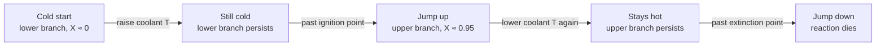

## Video Lecture

<div class="video-container">
  <iframe
    width="560"
    height="315"
    src="https://www.youtube.com/embed/GIrdjPDTjwY?start=3315"
    title="Chemical Engineering Reaction Engineering Ch.5: Heat Effects, Stability, and Scale-Up"
    frameborder="0"
    allow="accelerometer; autoplay; clipboard-write; encrypted-media; gyroscope; picture-in-picture"
    allowfullscreen>
  </iframe>
</div>

> This video covers the same content as the text below. Choose your preferred learning format.

---

# Chapter 5: Heat Effects, Stability, and Scale-Up

Everything so far has been written as though temperature were a number you choose. Rate laws took $T$ as given, the ideal-reactor design equations took $k$ as a constant, and selectivity and residence-time distribution were argued at fixed conditions. That was a teaching convenience, and this chapter withdraws it. Real reactors release or absorb heat, that heat changes the temperature, and the temperature changes the rate — a loop that decides whether the design point you calculated actually exists, whether the reactor will sit at it, and whether the pilot unit's comfortable behavior survives a thousandfold increase in volume.

**The Energy Balance That Decides Whether the Reactor Behaves**

## Learning Objectives

By completing this chapter, you will be able to:

  * ✅ Explain why the exponential temperature dependence of rate makes the energy balance a design constraint rather than an accessory calculation
  * ✅ Compute an adiabatic temperature rise and use it to judge whether a chemistry is inherently forgiving or inherently dangerous
  * ✅ Sketch heat generation and heat removal for a cooled CSTR and locate the steady states as their intersections
  * ✅ State the classical slope criterion for stability and identify which of three steady states is unstable
  * ✅ Name the standard runaway triggers and the defensive design measures that answer each
  * ✅ Explain why surface-to-volume ratio falls on scale-up and what that does to a cooling margin
  * ✅ Describe how reactor temperature and a heat-balance soft sensor serve as early-warning instrumentation

**Reading Time**: 20-25 minutes **Code Examples**: 1 **Exercises**: 3

* * *

## 5.1 Why Heat Is the Reactor's Biggest Risk

Return to the Arrhenius expression from [Chapter 1](chapter-1.html):

$$ k(T) = k_0 \exp\!\left(-\frac{E}{RT}\right) $$

Every other quantity in reactor design responds to its inputs politely. Double the volume of a CSTR and conversion rises, but sub-linearly. Halve the feed rate and residence time doubles, exactly. Temperature is the exception: rate depends on it *exponentially*, and for many liquid-phase organic reactions the familiar rule of thumb captures how violent that dependence is: roughly a doubling per 10 K near ambient for activation energies around 50–60 kJ/mol, and considerably more — nearly a tripling — for the equally common 80 kJ/mol reactions ([Chapter 1](chapter-1.html)).

Now couple that to the energy balance. An exothermic reaction releases heat in proportion to how fast it goes. That heat raises the temperature. The higher temperature raises the rate. The higher rate releases more heat. **The reaction's output feeds its own input**, through an exponential, and the only thing standing in the way is the cooling system.

This is why the energy balance in reaction engineering is not the tidy bookkeeping exercise it was in *Chemical Engineering Thermodynamics*. There it told you what the duty would be. Here it tells you whether a design point **exists at all**, whether the reactor will **stay** at it, and how close to a cliff edge you are operating. A reactor sized on conversion alone is not a design — it is half of one.

Endothermic reactions are, by the same logic, self-limiting: the reaction cools itself, the rate falls, and the process stalls. Stalling is an economic problem, not a safety one. **Nearly all of the drama belongs to exotherms**, which is where the rest of this chapter lives.

## 5.2 The Adiabatic Temperature Rise

The first number to compute for any exothermic chemistry is the temperature the batch would reach with **no cooling at all** and complete conversion. Set the heat released equal to the sensible heat absorbed by the mixture:

$$ \Delta T_{\text{ad}} = \frac{(-\Delta H_{\text{rxn}})\, C_{A0}}{\rho\, c_p} $$

**Worked example.** Take a liquid-phase feed at $C_{A0} = 2$ mol/L $= 2{,}000$ mol/m³, a reaction enthalpy of $\Delta H_{\text{rxn}} = -100$ kJ/mol, and a water-like solvent with $\rho \approx 1{,}000$ kg/m³ and $c_p \approx 4.18$ kJ/(kg·K):

$$ \Delta T_{\text{ad}} = \frac{100{,}000 \times 2{,}000}{1{,}000 \times 4{,}180} \approx 48\ \text{K} $$

About 48 K. Read what that means. If cooling is lost at the moment the reactor is charged, the contents end up roughly 48 K hotter than they started — uncomfortable, but for a vessel starting near ambient in a high-boiling solvent, survivable.

Now notice the structure of the formula. $\Delta T_{\text{ad}}$ is **linear in $C_{A0}$**. The same chemistry run at 4 mol/L gives about 96 K; at 8 mol/L, about 190 K. The reaction enthalpy per mole has not changed at all — only how many moles of it sit in each cubic meter of liquid. The solvent that looked like inert dead volume on the mass balance is doing structural work on the energy balance.

**Therefore dilution is a safety variable, not a waste of reactor capacity.** It is one of the few genuinely cheap levers in process safety: adding solvent lowers the worst-case excursion in direct proportion, at the cost of throughput and downstream separation duty. That trade is exactly the decision $\Delta T_{\text{ad}}$ exists to inform, and it is normally made early, while the chemistry is still negotiable.

Two honest caveats. The calculation assumes the released heat all goes into sensible heat of the liquid — no vaporization, no heat to the vessel wall. And it says nothing about *how fast* the rise happens; a slow exotherm reaching 48 K over eight hours and a fast one reaching it in ninety seconds are different problems with the same $\Delta T_{\text{ad}}$.

## 5.3 The Cooled CSTR: Generation, Removal, and Multiplicity

Now put the exotherm in a cooled CSTR of the kind sized in [Chapter 2](chapter-2.html), with a jacket or coil characterized by the overall coefficient $U$ and area $A$ of *Heat Transfer* [Chapter 1](../chemical-engineering-heat-transfer/chapter-1.html). At steady state, heat generated must equal heat removed. Write each side as a function of reactor temperature.

**Generation.** For a first-order reaction, steady-state conversion in a CSTR of residence time $\tau$ is $X(T) = k(T)\tau/[1 + k(T)\tau]$, so

$$ G(T) = (-\Delta H_{\text{rxn}})\, v_0 C_{A0}\, X(T) $$

Plotted against $T$, this is an **S-shaped curve**. At low temperature $k\tau \ll 1$, conversion is negligible, and $G$ is nearly flat and nearly zero. As temperature rises the Arrhenius factor takes over and $G$ climbs steeply. Then it flattens again — not because the kinetics slow down, but because **the reactant runs out**: once $X \to 1$ there is no more heat available, and $G$ saturates at $(-\Delta H_{\text{rxn}}) v_0 C_{A0}$. Acceleration then depletion: that is the S.

**Removal.** Heat leaves through the cooling surface and with the product stream, which enters cold and leaves hot:

$$ R(T) = UA\,(T - T_c) + v_0 \rho c_p\,(T - T_0) $$

Both terms are **linear** in $T$. So $R(T)$ is a **straight line** of slope $UA + v_0 \rho c_p$ — the cooling surface and the flow sensible-heat term adding directly. Raising $UA$ steepens it; raising the coolant temperature $T_c$ shifts it right.

**A straight line can cut an S-curve in one, two, or three places.** Each intersection is a steady state, and multiplicity is a real, routinely observed property of cooled exothermic CSTRs — not a mathematical curiosity. The two-intersection case is the knife-edge tangency between the other two.

Here is the three-intersection case, computed in Section 5.6 for one set of illustrative parameters:

| Steady state | $T$ (K) | Conversion $X$ | Heat released | Character |
|---|---|---|---|---|
| Lower ("extinguished") | ≈ 300 | ≈ 0.001 | ≈ 0.3 kW | Reaction essentially off; cold and useless |
| Middle | ≈ 359 | ≈ 0.73 | ≈ 293 kW | **Unstable** — cannot be held without control |
| Upper ("ignited") | ≈ 376 | ≈ 0.95 | ≈ 380 kW | Hot, high conversion; the productive branch |

**The stability criterion.** The classical CSTR stability analysis — usually labeled the *van Heerden* argument — asks what happens after a small temperature excursion. Nudge the reactor a little above a crossing. Generation rises along the S-curve; removal rises along the line. If **removal rises faster than generation**, the extra heat is carried away, the excursion decays, and the state is stable. If generation rises faster, the excursion feeds itself and the reactor departs. The condition is therefore

$$ \left.\frac{dR}{dT}\right|_{T_s} > \left.\frac{dG}{dT}\right|_{T_s} \qquad \text{(the classical criterion)} $$

Treat this as a **necessary condition** for stability against small excursions, not a complete guarantee. It is a static, slope-based argument; the full dynamic treatment brings in the reactor's thermal and material time constants and can add oscillatory failure modes the slope test does not see. But it captures the essential physics and it is what practitioners reason with.

Apply it to the table. At the lower state the S-curve is almost flat, so any removal line beats it: **stable**. At the upper state the S-curve has already saturated, so its slope is small again: **stable**. At the middle state the S-curve is at its steepest — that is precisely why the line is able to cross a third time — so generation outruns removal: **unstable**. With three steady states, the middle one is unstable and the outer two are stable. That is the general result, and it is worth committing to memory in exactly that form.

**Ignition, extinction, and hysteresis.** Because the middle branch cannot be held, the reactor's history matters. Warm the coolant slowly from a cold start and the reactor tracks the lower branch — barely reacting — until the coolant passes the point where the removal line stops cutting the S-curve low down. There the lower state vanishes and the reactor **ignites**, jumping to the upper branch. Now cool it back down: it does *not* jump back at the same point. It clings to the upper branch until the upper crossing disappears in turn, then **extinguishes**. The ignition and extinction points are different, and the loop between them is a hysteresis.



Two practical consequences follow. **Start-up is a designed trajectory, not an afterthought** — the path taken to the operating point decides which branch you arrive on. And **the folds are the hazard**. This is the point to state plainly, because it is commonly got wrong: an exothermic CSTR is **not** unstable by construction. Thousands of them run stably and continuously for years. The specific dangers are narrow and identifiable — operating close to the extinction or ignition fold, where a small disturbance flips branches, and losing cooling, which tilts the removal line flat and lets the hot steady state migrate far above its design temperature while the cold branch disappears.

## 5.4 Runaway and Its Triggers

**Thermal runaway** is what happens when heat generation exceeds heat removal and the gap widens instead of closing. The temperature climbs, the Arrhenius factor amplifies the rate, the gap grows further, and the excursion accelerates until something stops it — reactant exhaustion, boiling, the relief system, or the vessel. A handful of triggers account for most incidents.

**Cooling failure.** A lost pump, a closed valve, a fouled jacket, a failed coolant supply. On the picture of Section 5.3, $UA$ collapses toward zero, the removal line goes nearly flat, and every crossing except the highest one can disappear. The reactor then travels toward the adiabatic case — which is why $\Delta T_{\text{ad}}$ is the first number computed and the reason fouling monitoring on a reactor jacket is a safety function, not a maintenance nicety.

**Feed accumulation in semi-batch.** Semi-batch dosing exists to *avoid* runaway: reagent is added slowly so heat is released at a rate the jacket can match. That protection depends on the added reagent reacting promptly. If it does not — because the catalyst was omitted, the temperature is too low, an inhibitor is present — the reagent simply **accumulates**. The operator sees a quiet, cool vessel and reasonably keeps dosing. When the reaction finally initiates, the entire accumulated inventory converts at once, and the effective $\Delta T_{\text{ad}}$ is set by everything in the vessel rather than by the small amount that should have been present. Accumulation converts the safest reactor configuration into the most dangerous one, and the tell-tale is a dosing period with **less** temperature response than expected, not more.

**Scale-up surprises.** The pilot unit ran for months without incident; the plant unit runs hot. Section 5.5 explains why this is structural rather than bad luck.

Defensive design answers each trigger directly:

| Measure | What it defends against | Cost |
|---|---|---|
| **Dilution** | Reduces $\Delta T_{\text{ad}}$ in direct proportion (Section 5.2) | Throughput; downstream separation duty |
| **Semi-batch dosing** | Limits the reagent inventory available to react at once | Cycle time; requires accumulation monitoring to work |
| **Emergency quench or dump** | Kills the reaction after the excursion has begun — cold diluent, inhibitor injection, or dumping to a quench tank | Capital; batch loss; must be tested, not assumed |
| **Increased cooling area** | Steepens the removal line (internal coils, external loop) | Capital; fabrication complexity; cleaning access |

Pressure relief sizing for runaway reactions is a specialized discipline of its own, with its own methodology and calorimetric test requirements, and it is not covered here.

## 5.5 Scale-Up: The Area That Disappears

Here is the geometric fact behind a great many scale-up failures. Heat is generated in the **volume** of a reactor and removed through its **surface**. Under geometric similarity, volume grows as the cube of a linear dimension while surface grows as the square, so

$$ \frac{A}{V} \propto \frac{1}{L} $$

**Worked example.** A process is developed in a 10 L pilot reactor and built at 10 m³ — that is 10,000 L, a **1,000-fold** increase in volume. Since $1{,}000 = 10^3$, the linear scale factor is **10×**, the surface area grows by $10^2 = 100$-fold, and the surface-to-volume ratio falls by about **10-fold**.

Now read that as a cooling duty. Heat generation per unit volume is a property of the chemistry and is unchanged by scale. Cooling capacity per unit volume has fallen by a factor of about ten. **The pilot's cooling margin has quietly disappeared** — not because anything was designed badly, but because it was designed similarly. Comfortable jacket temperatures at pilot scale become impossible ones at plant scale, and the plant unit finds itself operating much closer to the fold of Section 5.3 than the pilot ever did.

The same arithmetic explains why small vessels are so forgiving. A laboratory flask has enormous surface per unit volume and sheds heat to the room; the identical chemistry in a reactor is effectively adiabatic on the same timescale. **A chemistry that "never gave any trouble in the lab" carries almost no information about its behavior in a vessel.**

Mitigations, all qualitative and all trading something away:

  * **Internal coils** add area inside the volume, breaking geometric similarity in the direction you want — at the cost of cleaning access, agitation quality, and multi-product flexibility.
  * **An external recycle loop** pumps reactor contents through a proper heat exchanger and back, so area scales with the exchanger rather than the vessel. The price is a pump, inventory outside the vessel, and a new failure mode if circulation stops.
  * **Semi-batch operation** does not add cooling; it lowers the demand, spreading the same total heat over a longer time so the available area suffices.
  * **Continuous operation** attacks inventory rather than area: the same tonnage is made with far less reacting mass present at any instant, so the worst-case release is smaller.

Three of those four are not heat transfer improvements at all. They are reconfigurations of *when* and *where* the heat appears — usually the more productive direction once geometric similarity has been recognized as the enemy.

## 5.6 The Digital Layer

Reactors are instrumented sparsely compared with what you would like. Composition — the quantity that actually matters — is typically measured by an offline assay with a turnaround measured in tens of minutes to hours, sometimes only once per batch. Temperature, in contrast, is measured continuously, cheaply, and reliably. Since conversion and temperature are coupled through the energy balance, **reactor temperature is usually the fastest composition proxy available**, and it is often the only near-real-time signal a reactor emits.

That makes a temperature trace worth more than a control loop's setpoint error. Two derived signals are worth extracting.

**A heat-balance soft sensor.** Everything on the removal side is instrumented anyway: coolant flow, coolant inlet and outlet temperatures, reactor temperature, feed rate. So the heat actually being released can be **back-computed** from routine measurements:

$$ \dot{Q}_{\text{gen}} \approx \underbrace{\dot{m}_c c_{p,c}(T_{c,\text{out}} - T_{c,\text{in}})}_{\text{removed by coolant}} \;+\; \underbrace{\rho V c_p \frac{dT}{dt}}_{\text{accumulating in the contents}} \;+\; \underbrace{v_0 \rho c_p (T - T_0)}_{\text{carried out with the product}} $$

This is exactly the logic of *Heat Transfer* [Chapter 5](../chemical-engineering-heat-transfer/chapter-5.html), where $U$ was back-computed from four temperatures and two flows and then trended. Here the inferred quantity is the reaction's instantaneous heat release — and since heat release is proportional to rate, $\dot{Q}_{\text{gen}}$ is a **rate meter** built from instruments already in place. In a semi-batch dose it is the direct test for accumulation: if the dose is going in but $\dot{Q}_{\text{gen}}$ is not tracking it, unreacted reagent is piling up. It carries the usual soft-sensor failure modes — a drifting coolant flow meter or a fouled thermowell degrades the inference exactly as a real process change would.

**Early-warning signatures.** Two patterns deserve alarms of their own. **Temperature acceleration** — a positive and growing $d^2T/dt^2$ while cooling is already at maximum — is the runaway signature itself, and it appears before any absolute temperature limit is breached. **Cooling-duty creep** — the coolant valve opening a little further each batch to hold the same reactor temperature — is fouling on the jacket eroding $UA$, which is the removal line slowly going flat. Neither shows up in a high-temperature alarm until far too late, because both are trends rather than levels.

The code below computes the Section 5.3 picture explicitly: it scans temperature, finds where the generation curve and the removal line cross, and applies the slope test at each crossing.

```python
import numpy as np

# ---------------------------------------------------------------------------
# ILLUSTRATIVE PARAMETERS -- chosen for teaching, not measured on any real
# reactor. First-order exothermic reaction A -> B in a cooled CSTR.
# ---------------------------------------------------------------------------
V = 1.0            # reactor volume [m3]
v0 = 1.0e-3        # volumetric feed rate [m3/s]
TAU = V / v0       # mean residence time [s]

C_A0 = 2000.0      # feed concentration [mol/m3]
DH = -200_000.0    # reaction enthalpy [J/mol] (negative = exothermic)
RHO = 1000.0       # density [kg/m3]
CP = 2000.0        # specific heat [J/(kg.K)]

K0 = 4.0e15        # pre-exponential factor [1/s]
E_OVER_R = 15_000.0  # activation temperature E/R [K]

T0 = 300.0         # feed temperature [K]
TC = 300.0         # coolant temperature [K]

DT_AD = (-DH) * C_A0 / (RHO * CP)
FLOW = v0 * RHO * CP          # sensible-heat slope [W/K]
G_MAX = (-DH) * v0 * C_A0     # generation at full conversion [W]


def conversion(T):
    """Steady-state conversion of a first-order reaction in a CSTR."""
    kt = K0 * np.exp(-E_OVER_R / T) * TAU
    return kt / (1.0 + kt)


def generation(T):
    return G_MAX * conversion(T)


def removal(T, UA, Tc=TC):
    return UA * (T - Tc) + FLOW * (T - T0)


def crossings(UA, Tc=TC, T_lo=290.0, T_hi=460.0, n=170_001):
    T = np.linspace(T_lo, T_hi, n)
    f = generation(T) - removal(T, UA, Tc)
    out = []
    for i in np.where(np.sign(f[:-1]) != np.sign(f[1:]))[0]:
        a, b = T[i], T[i + 1]
        for _ in range(80):
            m = 0.5 * (a + b)
            if np.sign(generation(a) - removal(a, UA, Tc)) == np.sign(
                    generation(m) - removal(m, UA, Tc)):
                a = m
            else:
                b = m
        out.append(0.5 * (a + b))
    return out


def slopes(T, UA, h=1e-3):
    dG = (generation(T + h) - generation(T - h)) / (2 * h)
    return dG, UA + FLOW


print(f"adiabatic temperature rise  dT_ad = {DT_AD:.0f} K")
print(f"generation at full conversion      = {G_MAX/1000:.0f} kW")
print(f"flow sensible-heat slope           = {FLOW:.0f} W/K")
print()

for UA, Tc, label in ((12_000.0, 300.0, "heavy cooling, cold jacket"),
                      (3_000.0, 300.0, "modest cooling, cold jacket"),
                      (12_000.0, 355.0, "heavy cooling, tempered jacket")):
    Ts = crossings(UA, Tc)
    print(f"UA = {UA:>7.0f} W/K   Tc = {Tc:.0f} K   removal slope ="
          f" {UA + FLOW:>6.0f} W/K   -> {len(Ts)} steady state(s)   [{label}]")
    for T in Ts:
        dG, dR = slopes(T, UA)
        verdict = "stable" if dR > dG else "UNSTABLE"
        print(f"    T = {T:7.2f} K   X = {conversion(T):5.3f}"
              f"   Q = {generation(T)/1000:6.1f} kW"
              f"   dG/dT = {dG:7.0f}   dR/dT = {dR:6.0f}   {verdict}")
    print()

# adiabatic temperature rise  dT_ad = 200 K
# generation at full conversion      = 400 kW
# flow sensible-heat slope           = 2000 W/K
#
# UA =   12000 W/K   Tc = 300 K   removal slope =  14000 W/K   -> 1 steady state(s)   [heavy cooling, cold jacket]
#     T =  300.02 K   X = 0.001   Q =    0.3 kW   dG/dT =      52   dR/dT =  14000   stable
#
# UA =    3000 W/K   Tc = 300 K   removal slope =   5000 W/K   -> 3 steady state(s)   [modest cooling, cold jacket]
#     T =  300.06 K   X = 0.001   Q =    0.3 kW   dG/dT =      52   dR/dT =   5000   stable
#     T =  358.67 K   X = 0.733   Q =  293.4 kW   dG/dT =    9119   dR/dT =   5000   UNSTABLE
#     T =  375.97 K   X = 0.950   Q =  379.8 kW   dG/dT =    2032   dR/dT =   5000   stable
#
# UA =   12000 W/K   Tc = 355 K   removal slope =  14000 W/K   -> 1 steady state(s)   [heavy cooling, tempered jacket]
#     T =  373.95 K   X = 0.938   Q =  375.3 kW   dG/dT =    2487   dR/dT =  14000   stable
```

Read the three blocks in order. With $UA = 12{,}000$ W/K against a cold jacket, the removal line is steeper than the S-curve can ever be, so there is exactly **one** steady state — and it sits at the feed temperature with 0.1% conversion. Safe and useless: over-cooling does not tame the reaction, it prevents it. Drop to $UA = 3{,}000$ W/K and the line is now shallow enough to cut the S three times: the middle crossing has $dG/dT = 9{,}119$ W/K against $dR/dT = 5{,}000$ W/K and fails the criterion, exactly as Section 5.3 predicts, while both outer states pass it. The third block keeps the large cooling area but raises the coolant to 355 K, which slides the steep removal line to the right until it cuts the S-curve **once**, high up, at 94% conversion with an ample stability margin. That is what a well-posed design looks like: not the smallest jacket that fits, and not the largest, but a removal line placed so that the only crossing is the one you want.

Two caveats keep the model honest. Every parameter above is illustrative, and real values come from calorimetry, not from a plausible-looking pre-exponential factor. And the model is steady-state only: it locates the crossings and tests them against small excursions, but it says nothing about the *path* between branches, which is where start-up trajectories and runaway timescales actually live.

## 5.7 Series Summary

Five chapters, one sentence each. **Chapter 1** built rate laws — order, rate constant, and the Arrhenius temperature dependence that has just come back to dominate this chapter. **Chapter 2** derived the ideal reactors, batch, CSTR, and PFR, and showed how the same kinetics give very different volumes in each. **Chapter 3** turned to multiple reactions, where **selectivity** rather than conversion is the objective and the reactor's job is to favor one pathway over another. **Chapter 4** admitted that real vessels are not ideal, using **residence-time distribution** to diagnose bypassing and dead zones and to bound their consequences. **Chapter 5** added the energy balance, and with it the questions of whether the design point exists, holds, and survives scale-up.

With this series the **classical fundamentals track is complete**. *Chemical Engineering Introduction* laid out the flowsheet and the balance-based way of thinking. *Thermodynamics* supplied the equilibria and property models everything else calls. *Fluid Mechanics*, *Heat Transfer*, and *Mass Transfer and Separation* covered the transport of momentum, energy, and species. And this series covered the step where composition changes on purpose. A plant is those six subjects arranged in a particular order, with pipes.

What sits on top of them is the data-driven layer. Our *Process Informatics Introduction* ([series index](../pi-introduction/index.html)) covers how process data is gathered, cleaned, and modeled, and *Process Monitoring and Control* ([series index](../process-monitoring-control-introduction/index.html)) covers the instrumentation and control that turns those models into something a running plant acts on. The relationship is worth stating exactly: sensors and models let you find the best operating point **beneath** the ceiling that thermodynamics, transport, and kinetics set — they do not raise the ceiling. Knowing where the ceiling is, and why, is what the six classical series were for.

Thank you for learning with us.

## Exercises

1. **Quantitative — the adiabatic temperature rise**: A liquid-phase exotherm is run at $C_{A0} = 1.5$ mol/L in an organic solvent with $\rho \approx 900$ kg/m³ and $c_p \approx 2.1$ kJ/(kg·K). The reaction enthalpy is $\Delta H_{\text{rxn}} = -75$ kJ/mol. (a) Estimate $\Delta T_{\text{ad}}$. (b) The vessel is charged at 300 K and the solvent boils at about 355 K. Comment on the total-cooling-failure case. (c) What feed concentration would hold $\Delta T_{\text{ad}}$ below about 40 K, and what does that cost?
   *Hint*: use $\Delta T_{\text{ad}} = (-\Delta H_{\text{rxn}}) C_{A0} / (\rho c_p)$ with $C_{A0}$ in mol/m³, and note that the result is linear in $C_{A0}$.
   *Answer*: (a) $\Delta T_{\text{ad}} = (75{,}000 \times 1{,}500)/(900 \times 2{,}100) = 1.125\times10^8 / 1.89\times10^6 \approx \mathbf{60\ K}$ (59.5 K before rounding). (b) The available margin to boiling is $355 - 300 = 55$ K, which is **less than $\Delta T_{\text{ad}}$**. On total cooling failure the batch would reach boiling before the reactant is exhausted, so the excursion ends in a **vapor generation and pressurization event**, not merely a hot vessel — a materially different hazard, and the case relief sizing exists to address. Note also that boiling then caps the temperature by absorbing latent heat, which is protective for temperature and dangerous for pressure. (c) Linearity gives $C_{A0} = 1{,}500 \times (40/59.5) \approx 1{,}008$ mol/m³, i.e. **about 1.0 mol/L** — a one-third reduction in charge concentration. The cost is roughly a one-third loss of production per batch at the same cycle time, plus extra solvent to recover downstream. Whether that is the right trade depends on the alternatives (semi-batch dosing, more cooling area), but the calculation is what makes the trade visible.

2. **Conceptual — reading the stability picture**: For a cooled CSTR, the heat generation curve rises from near zero at 300 K, climbs steeply between about 340 K and 370 K, and flattens near 400 kW above about 385 K. A removal line crosses it at three temperatures: 301 K, 359 K, and 376 K. (a) Which crossings are stable and which is not, and by what argument? (b) The reactor is running at 376 K when jacket fouling reduces $UA$ by 30%. Describe what happens to the removal line and to the steady states. (c) Explain why an operator who slowly warms the coolant from a cold start and one who slowly cools it from a hot start can end up at different steady states with identical coolant temperature.
   *Hint*: compare $dR/dT$ (a constant, the line's slope) against $dG/dT$ (the local slope of the S-curve) at each crossing.
   *Answer*: (a) **301 K and 376 K are stable; 359 K is unstable.** At 301 K the S-curve is nearly flat, so $dG/dT$ is tiny and the removal line's slope easily exceeds it — a small upward excursion is removed faster than it is generated and decays. At 376 K the curve has flattened again through reactant depletion, so again $dR/dT > dG/dT$. At 359 K the curve is in its steep region, and $dG/dT$ exceeds the line's slope: a small warm excursion generates more extra heat than it removes and grows. That is the classical criterion, and it is why with three steady states the **middle one is always the unstable one**. (b) Reducing $UA$ by 30% **flattens the removal line** (its slope is $UA + v_0\rho c_p$, so the reduction hits only the $UA$ part) and also lowers it wherever $T > T_c$, so the crossings move **apart**, not together. On the Section 5.6 illustrative parameters, cutting $UA$ from 3,000 to 2,100 W/K moves the middle state from about 359 K down to about 351 K and the operating (upper) state from about 376 K up to about 397 K: the operating point drifts silently to higher temperature while its stability margin $dR/dT - dG/dT$ shrinks. What continued fouling eventually annihilates is the **lower and middle** pair of crossings — the ignition fold — leaving the hot branch as the only steady state available, with the cold, safe branch gone. The hazard is therefore a gradual upward migration of the operating temperature toward material, boiling, or selectivity limits: a slow-motion runaway by branch migration, driven purely by fouling and with no failure event. This is why back-computed $UA$ is a safety trend and not a maintenance metric. (c) Because the middle branch cannot be occupied, the reactor must be on one of the outer branches, and which one depends on **which branch it was already on** — the hysteresis of Section 5.3. Warming from cold, it stays on the lower branch until the lower crossing vanishes at the **ignition** point; cooling from hot, it stays on the upper branch until the upper crossing vanishes at the **extinction** point. These occur at different coolant temperatures, so between them two stable states coexist and history selects. Practically: the start-up procedure is part of the design.

3. **Quantitative — scale-up and the vanishing area**: A process is proven in a 25 L geometrically similar pilot reactor and is to be built at 5 m³. (a) By what factors do volume, linear dimension, and heat transfer area increase, and what happens to surface-to-volume ratio? (b) The pilot removed its heat comfortably with a jacket driving force of about 20 K. What driving force would the plant unit need for the same volumetric heat release, under geometric similarity, and is that realistic? (c) Propose two mitigations and state what each one trades away.
   *Hint*: 5 m³ is 5,000 L; take the cube root of the volume ratio for the linear factor.
   *Answer*: (a) Volume rises by $5{,}000/25 = \mathbf{200\times}$. The linear factor is $200^{1/3} \approx \mathbf{5.85\times}$, so area rises by $200^{2/3} \approx \mathbf{34\times}$. Surface-to-volume therefore falls by about $200/34 \approx \mathbf{5.9\times}$ — call it roughly a six-fold loss of cooling area per unit of reacting volume. (b) Heat release per unit volume is set by the chemistry and is unchanged, so with about one-sixth the specific area the same $Q/V$ needs about **six times the driving force**: roughly $20 \times 5.85 \approx \mathbf{117}$ K. That is **not realistic** — it would demand a coolant well over 100 K below the reaction temperature, which for most aqueous or tempered-water utilities does not exist, and which would in any case freeze or foul the wall film and cause severe wall-temperature effects on selectivity. The honest conclusion is that geometric similarity **fails** here, and the plant reactor cannot simply be a large pilot reactor. (c) Any two of: **internal coils** — adds area independently of the vessel wall, trading cleaning access, agitation quality, and multi-product flexibility; **an external recycle loop through an exchanger** — decouples area from vessel geometry entirely, trading a pump, added inventory outside the vessel, and a new loss-of-circulation failure mode; **semi-batch dosing** — reduces the peak heat demand rather than raising supply, trading cycle time and requiring accumulation monitoring to be safe; **continuous operation** — smaller reacting inventory per unit of product and a better intrinsic surface-to-volume ratio, trading development effort, turndown flexibility, and a very different plant.
