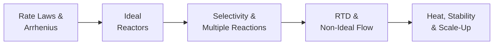

## Video Lecture

  <iframe
    width="560"
    height="315"
    src="https://www.youtube.com/embed/GIrdjPDTjwY"
    title="Chemical Engineering Reaction Engineering - Full Series"
    frameborder="0"
    allow="accelerometer; autoplay; clipboard-write; encrypted-media; gyroscope; picture-in-picture"
    allowfullscreen>
  </iframe>

> The whole series is available as a single video with chapter markers. Each chapter page starts this video at that chapter.

---

# Chemical Engineering Reaction Engineering

**Rate Laws, Ideal Reactors, Selectivity, and the Heat That Tests Them**

The reactor is the one unit that creates value — everything else on the flowsheet moves, heats, or separates what the reactor made. This course is the reaction-engineering deep-dive of our chemical engineering curriculum: it turns the overview of the Introduction series into a working toolkit, from rate laws to the energy balance that decides whether a reactor behaves.

## Series Overview

1. **Rate** — rate laws, reaction order, and the Arrhenius equation
2. **Size** — batch, CSTR, and PFR: design equations and which volume wins
3. **Select** — multiple reactions: making the right product, not just more
4. **Verify** — residence-time distribution: what the tracer tells you
5. **Hold** — heat effects, stability, and scale-up

## Chapters

| Chapter | Title | What You Will Learn |
|---------|-------|---------------------|
| 1 | [Rate Laws and the Arrhenius Equation](chapter-1.html) | Rate laws and order, integrated forms and half-lives, activation energy, the temperature rule of thumb |
| 2 | [Batch, CSTR, and PFR - The Ideal Reactors](chapter-2.html) | Design equations, conversion and space time, the CSTR-vs-PFR volume ladder, CSTRs in series |
| 3 | [Multiple Reactions and Selectivity](chapter-3.html) | Selectivity vs yield, concentration and temperature policies, series reactions and the optimum stopping time |
| 4 | [Residence-Time Distribution and Non-Ideal Flow](chapter-4.html) | Tracer experiments, E(t) signatures, diagnosing bypassing and dead zones, tanks-in-series |
| 5 | [Heat Effects, Stability, and Scale-Up](chapter-5.html) | Adiabatic temperature rise, CSTR multiplicity and the stability criterion, runaway defenses, scale-up |

## Who This Series is For

- **Students** moving from the Introduction series' overview to the quantitative core of reactor design
- **Engineers and researchers** who size reactors, chase selectivity, or troubleshoot temperature excursions
- **Data scientists** working with reactor temperature and flow data who want the physics behind runaway warnings

Recommended preparation: Chemical Engineering Introduction; the Thermodynamics series supplies the equilibrium limits, and the Fluid Mechanics, Heat Transfer, and Mass Transfer series the transport picture around the reactor. Mathematics stays at algebra, with a few integrals and derivatives quoted rather than derived.

## Related Series

Completes the classical-fundamentals track with **Chemical Engineering Introduction**, **Chemical Engineering Thermodynamics**, **Chemical Engineering Fluid Mechanics**, **Chemical Engineering Heat Transfer**, and **Chemical Engineering Mass Transfer and Separation**. Data-driven companions: **Process Informatics Introduction** and **Introduction to Process Monitoring and Control**.
