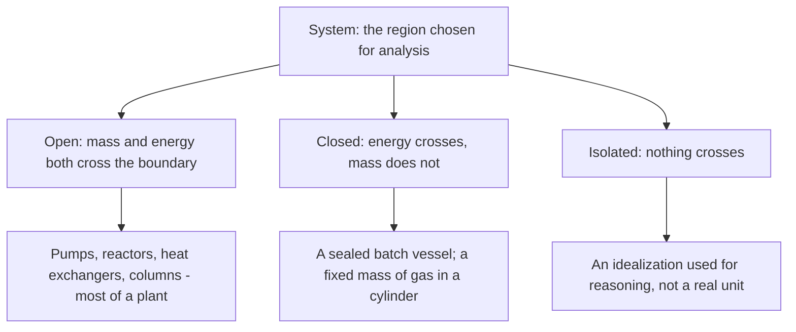
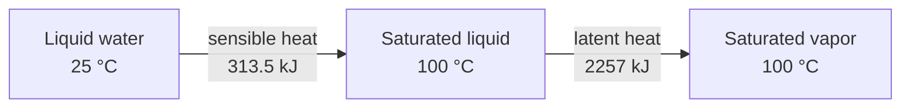

## Video Lecture

<div class="video-container">
  <iframe
    width="560"
    height="315"
    src="https://www.youtube.com/embed/tGOpNey5U9E"
    title="Chemical Engineering Thermodynamics Ch.1: Energy and the First Law"
    frameborder="0"
    allow="accelerometer; autoplay; clipboard-write; encrypted-media; gyroscope; picture-in-picture"
    allowfullscreen>
  </iframe>
</div>

> This video covers the same content as the text below. Choose your preferred learning format.

---

# Chapter 1: Energy and the First Law

This chapter builds the foundation of chemical engineering thermodynamics: what a system is, why state functions make energy bookkeeping tractable, and how the First Law turns into the energy balances that decide what a process costs to run.

**State Functions, Balances, and Why Thermodynamics Runs the Plant**

## Learning Objectives

By completing this chapter, you will be able to:

  * ✅ Explain the three questions thermodynamics answers that kinetics cannot
  * ✅ Define a system, its boundary, and the difference between open, closed, and isolated systems
  * ✅ Distinguish state functions from path functions and explain why the distinction is practically useful
  * ✅ Apply the First Law in its closed-system ($\Delta U = Q - W$) and steady-flow ($\Delta H = Q - W_s$) forms
  * ✅ Separate sensible heat from latent heat and estimate the magnitude of each
  * ✅ Compute a heat-exchanger or reboiler duty from a flow rate and a temperature or phase change

**Reading Time**: 20-25 minutes **Code Examples**: 1 **Exercises**: 3

* * *

## 1.1 Why a Chemical Engineer Needs Thermodynamics

The *Chemical Engineering Introduction* series ended twice at the same wall. Its Chapter 1 wrote balances of the form *accumulation = in − out + generation − consumption* and observed that the **energy** balance usually decides whether a process is worth building — without saying where stream energies come from. Its Chapter 2 warned that no catalyst can push a reactor past **chemical equilibrium** — without saying what sets that limit. Thermodynamics is what lies on the other side of both.

It answers three questions that no rate law can touch:

1. **How much energy does a transformation require or release?** Kinetics tells you how fast a reaction runs; only thermodynamics tells you how much heat you must add or remove while it does.
2. **How far can it go?** Equilibrium is a thermodynamic limit. A better catalyst reaches it sooner; nothing takes you past it.
3. **Which direction is spontaneous?** Whether a process runs by itself or has to be driven — and at what minimum cost — is decided by the Second Law ([Chapter 2](chapter-2.html)).

That is the division of labor worth memorizing: **kinetics governs rate, thermodynamics governs possibility and price.** A design that ignores rates is merely slow; a design that violates thermodynamics cannot be built at all, and no amount of engineering effort will rescue it.

## 1.2 The System and Its State

Every thermodynamic statement begins with a choice: **what are we accounting for?** The region selected is the **system**, everything else the **surroundings**, and the imaginary surface between them the **boundary**. That boundary is chosen by the engineer, not given by nature — draw it around one heat exchanger and you get its duty; draw it around the plant and you get the site utility bill.

Systems are classified by what the boundary lets through:



Continuous process equipment is almost always **open**: material flows in and out while heat and shaft work cross the same boundary. Batch chemistry is the natural home of the **closed** system.

### State Functions and Path Functions

The properties describing a system's condition fall into two categories, and telling them apart is the most useful skill in this chapter.

| | **State functions** | **Path functions** |
|---|---|---|
| **Examples** | Internal energy $U$, enthalpy $H$, temperature $T$, pressure $P$, volume $V$, entropy $S$ | Heat $Q$, work $W$ |
| **Depend on** | The current state only | *How* the system got there |
| **Notation** | Changes written $\Delta U$, $\Delta H$ | Amounts, never "$\Delta Q$" |

A **state function** has a value fixed by the present condition of the system: liquid water at 100 °C and 1 atm has a particular enthalpy whether it was heated from ice or condensed from steam. A **path function** has no such value — you cannot ask how much heat a system "contains," only how much crossed its boundary during a specified process.

Properties also split by size. **Extensive** properties scale with the amount of material (total volume, total enthalpy, mass); **intensive** properties do not (temperature, pressure, density, and any extensive property divided by mass, such as specific enthalpy in kJ/kg). Process data is quoted intensively, then multiplied by a flow rate.

The distinction matters commercially because **a change in a state function can be computed from tables without knowing the path**. To find the energy needed to take water from 25 °C to steam at 200 °C and 10 bar you need only the two end states; the route through the boiler is irrelevant. That single fact is what makes **steam tables** and **process simulators** possible — a simulator does not model the physics inside every pipe, it looks up the inlet state, the outlet state, and subtracts.

## 1.3 The First Law

The First Law of Thermodynamics is conservation of energy with heat and work counted honestly. For a **closed system**:

$$ \Delta U = Q - W $$

The sign convention must be stated explicitly, because textbooks differ. Here, as in most chemical engineering practice: **$Q$ is positive when heat flows *into* the system, and $W$ is positive when work is done *by* the system on the surroundings.** Heat in raises $U$; work out lowers it.

Most plant equipment is not closed, though — it flows. For an **open system at steady state** with one inlet and one outlet, neglecting kinetic- and potential-energy terms (safe at typical process velocities and elevations), the working form is:

$$ \Delta H = Q - W_s $$

per unit mass or mole of material passing through, where $W_s$ is the **shaft work** exchanged with a pump, compressor, or turbine.

The reason enthalpy appears instead of internal energy is that flowing material carries its own pressure-volume energy across the boundary. Enthalpy bundles that in by definition:

$$ H = U + PV $$

so that $H$ becomes the natural energy currency of flow processes. For a heat exchanger, a reboiler, or a condenser — no shaft work at all — the equation collapses to the most-used expression in process engineering: $Q = \Delta H$.

### Worked Example: Heating One Kilogram of Water

Take 1 kg of liquid water at **25 °C** and turn it into saturated steam at **100 °C**, 1 atm. The path splits into two physically distinct steps:



**Step 1 — sensible heat**, warming the liquid, using $c_p \approx 4.18$ kJ/(kg·K) for liquid water:

$$ Q_1 = m\,c_p\,\Delta T = 1 \times 4.18 \times (100 - 25) = 313.5\ \text{kJ} $$

**Step 2 — latent heat**, boiling it at constant temperature, using $\lambda \approx 2257$ kJ/kg at 100 °C and 1 atm:

$$ Q_2 = m\,\lambda = 1 \times 2257 = 2257\ \text{kJ} $$

$$ Q_{\text{total}} = 313.5 + 2257 = 2570.5\ \text{kJ} $$

The vaporization step costs about **7.2 times** as much as heating the liquid through 75 °C — and it happens at constant temperature, so a thermometer reports nothing at all while the great majority of the energy goes in. That ratio is the reason **evaporation and distillation dominate plant energy budgets**: boiling is where the money goes.

```python
CP_WATER = 4.18    # kJ/(kg K), liquid water
LAMBDA_100C = 2257 # kJ/kg, latent heat of vaporization at 100 C, 1 atm
T_BOIL = 100.0     # C

print(f"{'T_feed':>7} {'sensible':>9} {'latent':>8} {'total':>8} {'latent_pct':>11} {'ratio':>7}")
for t_feed in [20, 25, 40, 60, 80]:
    sensible = CP_WATER * (T_BOIL - t_feed)   # kJ/kg
    total = sensible + LAMBDA_100C            # kJ/kg
    print(f"{t_feed:7.0f} {sensible:9.1f} {LAMBDA_100C:8.0f} {total:8.1f} "
          f"{100*LAMBDA_100C/total:11.1f} {LAMBDA_100C/sensible:7.2f}")

#  T_feed  sensible   latent    total  latent_pct   ratio
#      20     334.4     2257   2591.4        87.1    6.75
#      25     313.5     2257   2570.5        87.8    7.20
#      40     250.8     2257   2507.8        90.0    9.00
#      60     167.2     2257   2424.2        93.1   13.50
#      80      83.6     2257   2340.6        96.4   27.00
```

Note what the table says about **feed preheating**: raising the feed from 20 °C to 80 °C removes 250.8 kJ/kg from the boiler's job, but 2257 kJ/kg of it never goes away. Preheat all you like — the phase change is untouched.

## 1.4 Heat Capacity and Sensible vs Latent Heat

**Specific heat capacity** $c_p$ is the energy needed to raise one kilogram of a substance by one kelvin at constant pressure. It is a material property, mildly temperature-dependent; for hand calculations an average value over the range is normally good enough.

| Material class | Typical $c_p$ [kJ/(kg·K)] | Typical latent heat [kJ/kg] |
|---|---|---|
| **Liquid water** | ≈ 4.18 | 2257 (at 100 °C, 1 atm) |
| **Organic liquids** | ≈ 1.5–2.5 | ≈ 300–900 |
| **Gases** | of order 1 | — |

Liquid water is a conspicuous outlier: roughly twice the heat capacity of a typical organic liquid, which is why it is both an excellent coolant and an expensive thing to boil.

The pattern across the table is the practical rule of this chapter:

> **Phase changes are expensive; temperature changes are comparatively cheap.**

Heating an organic liquid through a large 50 K span costs perhaps 75–125 kJ/kg. Boiling it costs several hundred. Whenever an energy estimate looks surprisingly large, the first thing to check is whether something is being vaporized.

## 1.5 Energy Balances in Practice

On a flowsheet, the First Law becomes an arithmetic you can do on the back of an envelope. For a stream of mass flow rate $\dot{m}$:

$$ Q = \dot{m}\,c_p\,\Delta T \quad \text{(no phase change)} \qquad\qquad Q = \dot{m}\,\lambda \quad \text{(phase change)} $$

The result, the **duty**, is the required heat rate in kW or MW. It sizes the exchanger, sets the steam or cooling-water flow, and lands directly on the operating-cost line.

This is why a **distillation column's reboiler and condenser are usually the largest utility consumers on a flowsheet**. A column does not merely warm its feed — it boils a stream at the bottom and condenses it again at the top, repeatedly, because the reflux returned to the column must be vaporized once more on every pass. Multiply a latent heat of hundreds or thousands of kJ/kg by that reflux-amplified internal flow, and the column dwarfs the pumps, the preheaters, and often the reactor itself.

An obvious question follows: the condenser rejects almost as much energy as the reboiler supplies, so why not feed one with the other? Sometimes you can — heat integration and multi-effect evaporation do exactly that. But the limit on how much can be recovered is not a First Law limit. The First Law counts energy and finds it conserved; it never says that heat rejected at 40 °C is worth less than heat supplied at 150 °C. That accounting requires **entropy**.

## 1.6 Chapter Summary

- Thermodynamics answers three questions kinetics cannot: **how much energy**, **how far** (equilibrium), and **which direction** (spontaneity); kinetics governs rate, thermodynamics governs possibility and price
- Analysis starts by drawing a **boundary**: open systems exchange mass and energy, closed ones only energy, isolated ones neither; plant equipment is overwhelmingly open
- **State functions** ($U$, $H$, $T$, $P$, $V$) depend only on the current state; **path functions** ($Q$, $W$) depend on the route — which is why enthalpy changes can be read from steam tables and computed by simulators without modeling the path
- First Law, closed system: $\Delta U = Q - W$, with $Q$ positive **into** the system and $W$ positive **by** the system; steady flow: $\Delta H = Q - W_s$, where $H = U + PV$ makes enthalpy the currency of flow processes
- Heating 1 kg of water from 25 °C to saturated steam at 100 °C takes **313.5 kJ sensible + 2257 kJ latent = 2570.5 kJ**, the latent term being about **7.2×** the sensible one
- **Phase changes are expensive, temperature changes are cheap** — water $c_p \approx 4.18$, organics ≈ 1.5–2.5 kJ/(kg·K), against latent heats of hundreds to thousands of kJ/kg
- Duties follow as $Q = \dot{m} c_p \Delta T$ or $Q = \dot{m}\lambda$; reboilers and condensers therefore dominate flowsheet utility consumption

**Next chapter**: the First Law says energy is conserved, so in principle no energy is ever lost. Yet no plant recovers all of it. **Entropy and the Second Law** ([Chapter 2](chapter-2.html)) explain why energy has quality as well as quantity, and set the real limit on what can be recovered.

## Exercises

1. **Conceptual — state vs. path**: Two engineers take 1 kg of water from 25 °C, 1 atm to saturated steam at 100 °C, 1 atm. Engineer A heats the liquid, then boils it. Engineer B first pressurizes and superheats the water, then throttles and cools it back to the same final state. (a) Do they obtain the same $\Delta H$? (b) Do they require the same $Q$? (c) What does this tell you about tabulating thermodynamic data?
   *Hint*: sort the quantities into state functions and path functions before answering.
   *Answer*: (a) **Yes.** $H$ is a state function, so $\Delta H$ depends only on the initial and final states, which are identical — 2570.5 kJ/kg in both cases. (b) **No.** $Q$ is a path function; B's route involves different work interactions (including shaft work to pressurize), so its heat requirement differs. (c) Only state functions can be tabulated. A steam table lists $H$, $U$, $S$, and $V$ against $T$ and $P$ because those are path-independent; there could never be a table of "the heat contained in steam."

2. **Quantitative — heat duty**: A plant vaporizes **500 kg/h** of water fed at **20 °C** into saturated steam at **100 °C**, 1 atm. Using $c_p = 4.18$ kJ/(kg·K) and $\lambda = 2257$ kJ/kg, compute (a) the sensible and latent duties per kilogram, (b) the total heat rate in kJ/h and GJ/h, (c) the equivalent power in kW.
   *Hint*: work per kilogram first, then multiply by the flow rate; 1 kW = 1 kJ/s, and there are 3600 s in an hour.
   *Answer*: (a) Sensible = 4.18 × (100 − 20) = **334.4 kJ/kg**; latent = **2257 kJ/kg**; total = **2591.4 kJ/kg**. (b) 500 × 2591.4 = **1,295,700 kJ/h ≈ 1.30 GJ/h**. (c) 1,295,700 / 3600 = **≈ 360 kW**. Note that the latent term supplies 2257/2591.4 = **87.1%** of the duty — the phase change, not the 80 K temperature rise, is what the boiler is really paying for.

3. **Discussion — where the energy goes**: A colleague proposes cutting a distillation column's steam bill by installing a large feed preheater that raises the feed from 25 °C to 90 °C. Explain (a) what this saves, (b) why the saving is smaller than they expect, and (c) what the First Law alone cannot tell you about recovering the condenser's heat to run the reboiler.
   *Hint*: split the reboiler's job into sensible and latent parts, then ask what distinguishes 40 °C heat from 150 °C heat.
   *Answer*: (a) It removes the sensible duty of bringing the feed to its bubble point — for water, 4.18 × 65 ≈ **272 kJ/kg** — from the reboiler, provided the preheat comes from a cheap source such as a hot process stream rather than fresh steam. (b) The **latent** heat of the vapor traffic inside the column is untouched, and it is the far larger term (of order 2257 kJ/kg for water, repeated on every reflux pass). Preheating attacks the small part of the bill. (c) The First Law says only that energy is conserved: the condenser rejects nearly as much as the reboiler absorbs, so on paper the recovery looks free. It cannot express the fact that the condenser's heat leaves at a **lower temperature** than the reboiler needs, and so cannot flow there unaided. Quantifying that quality gap — and the minimum work to bridge it, as a heat pump would — requires **entropy** and the Second Law.
