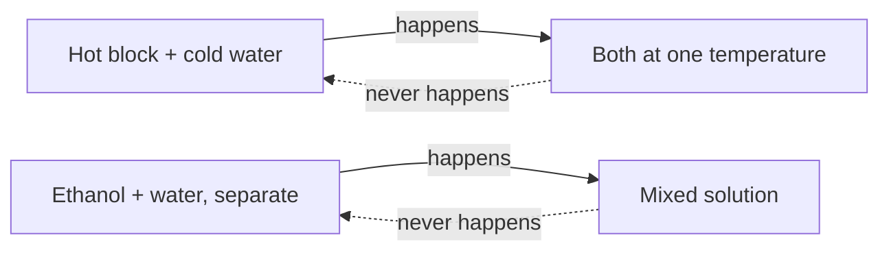
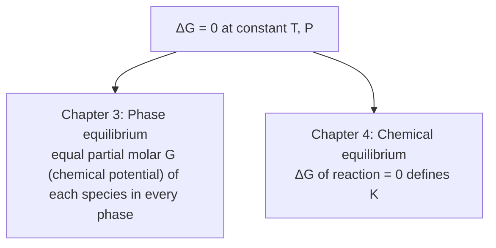

## Video Lecture

<div class="video-container">
  <iframe
    width="560"
    height="315"
    src="https://www.youtube.com/embed/tGOpNey5U9E?start=739"
    title="Chemical Engineering Thermodynamics Ch.2: Entropy and the Second Law"
    frameborder="0"
    allow="accelerometer; autoplay; clipboard-write; encrypted-media; gyroscope; picture-in-picture"
    allowfullscreen>
  </iframe>
</div>

> This video covers the same content as the text below. Choose your preferred learning format.

---

# Chapter 2: Entropy and the Second Law

Chapter 1 gave us a ledger: energy is conserved, and we can count it. This chapter gives us a **compass**. The Second Law tells us which way a process will go on its own, how much work we can possibly extract from heat, and why separating a mixture can never be free.

**Direction, Limits, and the Price of Separation**

## Learning Objectives

By completing this chapter, you will be able to:

  * ✅ Explain why energy conservation alone cannot predict the direction of a process
  * ✅ Define entropy as a state function and state the Second Law as $\Delta S_{universe} \geq 0$
  * ✅ Compute the Carnot efficiency and explain why work is thermodynamically more valuable than heat
  * ✅ Calculate the minimum work of separation for an ideal binary mixture
  * ✅ Compare that minimum with real distillation energy use and interpret the gap
  * ✅ Use Gibbs energy as the criterion for spontaneity and equilibrium at constant T and P

**Reading Time**: 20-25 minutes **Code Examples**: 1 **Exercises**: 3

* * *

## 2.1 The Question the First Law Cannot Answer

Drop a hot steel block into cold water. Heat flows from the block into the water until both reach the same temperature, and energy is conserved. Now imagine the reverse: the water spontaneously cools while the block heats up. Energy would be conserved just as exactly. Nothing in the First Law forbids it — and yet it never happens.

The same asymmetry is everywhere in a plant. Stir ethanol into water and you get a solution; the solution never separates itself back into two layers. A gas leaks from a cylinder into a room, but never crowds back in.



Every one of these processes conserves energy in **both** directions, yet only one direction is ever observed. The First Law is a bookkeeper: it audits quantity but says nothing about direction. Something else is doing the choosing.

That something is the **Second Law of Thermodynamics**, and the quantity it tracks is **entropy**.

## 2.2 Entropy

**Entropy**, symbol $S$, is a state function with units of J/K — like internal energy or enthalpy, it depends only on the current state of a system, not on how the system got there. For a reversible transfer of heat at constant absolute temperature $T$:

$$ \Delta S = \frac{Q_{rev}}{T} $$

The temperature in the denominator carries the physical meaning. The *same* joule of heat produces a *larger* entropy change when it enters a cold body than a hot one. That is why the hot block heats the water and not the reverse: the entropy the block loses at high $T$ is smaller than the entropy the water gains at low $T$, so the transfer increases the total.

Statistically, entropy counts possibilities. A macroscopic state realizable by an enormous number of molecular arrangements (**microstates**) is overwhelmingly more probable than one realizable in only a few ways. Astronomically more arrangements have a gas spread through a vessel than crowded into its left half, so the gas fills the vessel — not because a force pushes it, but because spreading out is what nearly all arrangements look like. Entropy is the logarithm of that count.

The Second Law then says:

$$ \Delta S_{universe} = \Delta S_{system} + \Delta S_{surroundings} \geq 0 $$

The entropy of a system can certainly fall — a refrigerator freezes water every day — but only if the surroundings gain more than the system loses. Equality holds only for a **reversible** process, an idealization run so slowly and so free of friction, unrestrained expansion, finite temperature differences, and mixing that it could be retraced exactly. No real process qualifies. **Every real process generates entropy**, and that generated entropy is destroyed work potential: it is the thermodynamic name for the money a plant loses to irreversibility.

## 2.3 The Carnot Limit

The most consequential result of the Second Law concerns converting heat into work. A heat engine takes heat from a hot reservoir at $T_h$, produces work, and must reject some heat to a cold reservoir at $T_c$. That rejection is not an engineering failure to be designed away — it is what keeps total entropy from decreasing. Requiring $\Delta S_{universe} \geq 0$ gives a hard ceiling on efficiency:

$$ \eta_{max} = 1 - \frac{T_c}{T_h} $$

with both temperatures **absolute**, in kelvin. Take a steam power plant with a boiler at 500 °C and cooling water at 25 °C:

$$ T_h = 773\ \text{K},\quad T_c = 298\ \text{K} \quad\Rightarrow\quad \eta_{max} = 1 - \frac{298}{773} = 0.614 \approx 61.4\% $$

No boiler design, working fluid, or turbine metallurgy can beat 61.4% for those two temperatures. Real steam plants land well below it — typically in the 35–45% range — because real expansion, heat transfer across finite temperature differences, and friction all generate entropy.

The engineering lesson runs deeper than power generation. Heat and work are both measured in joules, but **they are not interchangeable**. Work converts to heat completely and freely; heat converts to work only partially, and the fraction shrinks as the source gets colder:

| | Thermodynamic value | Practical consequence |
|---|---|---|
| **Work** (electricity, shaft power, compression) | High — fully convertible | Expensive; buy as little as possible |
| **High-temperature heat** (fired heater, HP steam) | Moderate | Worth cascading down to lower-temperature duties |
| **Low-temperature heat** (LP steam, warm water) | Low | Nearly worthless for work; still useful for heating |

Two plant realities follow directly. First, **heat integration matters** — pinch analysis (Introduction series, Chapter 4) is a scheme for using each parcel of heat at the highest temperature where it is still useful before letting it fall to cooling water, rather than destroying its work potential in one step. Second, **compressors dominate operating cost wherever they appear**: they consume work, the most expensive form of energy, and no amount of waste heat can substitute for it.

## 2.4 Why Separation Costs Energy

Now apply the same logic to the plant's other great energy consumer. Mixing is spontaneous because it increases entropy — a mixture has vastly more microstates available than the separated components. Since spontaneous mixing raises entropy, **unmixing must lower it**, and by the Second Law that can only be paid for with work from outside.

For an **ideal binary mixture** of mole fraction $x$, the entropy of mixing per mole is $\Delta S_{mix} = -R\,[x \ln x + (1-x)\ln(1-x)]$, and the minimum reversible work to undo it at temperature $T$ is that entropy times $T$ (quoted as the magnitude of the work input; under Chapter 1's sign convention it would carry a negative sign):

$$ w_{min} = -RT\,\big[\,x \ln x + (1-x)\ln(1-x)\,\big] $$

For an equimolar mixture at 298 K, with $R = 8.314$ J/(mol·K):

$$ w_{min} = -(8.314)(298)\,(0.5\ln 0.5 + 0.5\ln 0.5) = (8.314)(298)(0.693) = 1717\ \text{J/mol} \approx 1.72\ \text{kJ/mol} $$

```python
import math

R = 8.314      # J/(mol K)
T = 298.0      # K

def w_min(x, T=T):
    """Minimum reversible work to separate 1 mol of an ideal binary
    mixture of composition x into two pure streams, in J/mol."""
    if x <= 0.0 or x >= 1.0:
        return 0.0
    return -R * T * (x * math.log(x) + (1 - x) * math.log(1 - x))

print(f"{'x_A':>6} {'w_min (J/mol)':>15} {'w_min (kJ/mol)':>16}")
for x in [0.01, 0.05, 0.10, 0.25, 0.50, 0.75, 0.90, 0.99]:
    w = w_min(x)
    print(f"{x:6.2f} {w:15.1f} {w/1000:16.3f}")

w50 = w_min(0.50)
print(f"\nEquimolar mixture at {T:.0f} K: w_min = {w50:.0f} J/mol = {w50/1000:.2f} kJ/mol")

#    x_A   w_min (J/mol)   w_min (kJ/mol)
#   0.01           138.7            0.139
#   0.05           491.8            0.492
#   0.10           805.4            0.805
#   0.25          1393.2            1.393
#   0.50          1717.3            1.717
#   0.75          1393.2            1.393
#   0.90           805.4            0.805
#   0.99           138.7            0.139
#
# Equimolar mixture at 298 K: w_min = 1717 J/mol = 1.72 kJ/mol
```

The curve is symmetric and peaks at $x = 0.5$: a 50/50 mixture is the hardest to separate, while dilute mixtures cost little *per mole of mixture* — though a great deal per mole of the trace component recovered.

Now the comparison that should stay with you. That equimolar separation has a thermodynamic price of about **1.7 kJ per mole of mixture**. Published analyses of industrial separations typically report that real distillation consumes on the order of **10 to 100 times the thermodynamic minimum**, depending on relative volatility, reflux ratio, and the degree of heat integration. Treat it as the standard order-of-magnitude range it is, not a precise figure.

A process running at 10–100× its own theoretical floor is unusual in engineering, and it is why separation is such an active research target. Every major alternative — **heat pumps** and vapor recompression that reuse condenser duty in the reboiler, **dividing-wall columns** (two separations in one shell) that remove a whole column and its remixing losses, **membranes** and adsorption that never boil the mixture at all — attacks part of that gap.

## 2.5 Gibbs Energy: The Engineer's Compass

Tracking $\Delta S_{universe}$ means accounting for the surroundings, which is awkward. Fortunately, chemical engineers almost always work at **constant temperature and pressure**, and for those conditions the Second Law repackages into a property of the system alone: the **Gibbs energy**,

$$ G = H - TS $$

Its power is the criterion it yields. At constant $T$ and $P$:

| Condition | Meaning |
|---|---|
| $\Delta G < 0$ | Process is **spontaneous** in the direction written |
| $\Delta G = 0$ | System is at **equilibrium** — no net change |
| $\Delta G > 0$ | Process is **non-spontaneous**; the reverse direction is spontaneous |

Read the definition as a competition. The $H$ term rewards lowering energy — forming bonds, condensing, ordering. The $-TS$ term rewards raising entropy — breaking bonds, vaporizing, mixing. Temperature is the referee, and raising it strengthens the entropy side, which is why a liquid boils when hot and freezes when cold, and why some reactions run only when heated.

Everything that follows in this series is this one criterion applied twice:



In **Chapter 3**, applying $\Delta G = 0$ across a vapor-liquid boundary gives the condition that each species has the same chemical potential in both phases — the basis of every VLE calculation and column design. In **Chapter 4**, setting the Gibbs energy change of a reaction to zero gives the equilibrium constant $K$ and its temperature dependence, which fixes the maximum conversion no catalyst can exceed.

## 2.6 Chapter Summary

- The First Law audits energy quantity but permits both directions; the **Second Law supplies direction**
- **Entropy** $S$ is a state function; $\Delta S = Q_{rev}/T$ for isothermal reversible heat transfer, and statistically it counts the microstates available to a state
- $\Delta S_{universe} \geq 0$, with equality only for idealized reversible processes — **every real process generates entropy** and destroys work potential
- **Carnot**: $\eta_{max} = 1 - T_c/T_h$ with absolute temperatures; 500 °C/25 °C gives 61.4%, while real steam plants reach roughly 35–45%
- Work is thermodynamically precious and heat is comparatively cheap — hence heat integration, and hence compressors dominating operating cost
- Mixing raises entropy, so **separation must be paid for**: $w_{min} = -RT[x\ln x + (1-x)\ln(1-x)]$, which is **1.72 kJ/mol** for an equimolar mixture at 298 K
- Real distillation typically uses **10–100×** that minimum — the headroom that motivates heat pumps, dividing-wall columns, and membranes
- **Gibbs energy** $G = H - TS$ converts the Second Law into a system-only test: spontaneous when $\Delta G < 0$, at equilibrium when $\Delta G = 0$

**Next chapter**: we apply $\Delta G = 0$ to coexisting phases. Vapor-liquid equilibrium, Raoult's law, activity coefficients, and azeotropes — the thermodynamics that decides whether a distillation column can make the separation at all.

## Exercises

1. **Conceptual — direction and the two laws**: A vendor claims a device that takes in 100 kW of waste heat at 60 °C and delivers 30 kW of shaft work while rejecting 70 kW to cooling water at 25 °C. (a) Does the claim violate the First Law? (b) Does it violate the Second Law? (c) What is the largest work output physically possible from that heat stream?
   *Hint*: Check the energy balance first, then compare the claimed efficiency with the Carnot limit using absolute temperatures.
   *Answer*: (a) **No** — 30 + 70 = 100 kW, so energy is conserved. (b) **Yes**. The claimed efficiency is 30/100 = 30%, but $T_h$ = 333 K and $T_c$ = 298 K give $\eta_{max}$ = 1 − 298/333 = 0.105, i.e. **10.5%**. (c) At most 0.105 × 100 kW ≈ **10.5 kW**, and a real device would deliver appreciably less. This is why low-temperature waste heat is hard to monetize as work — the Carnot factor is small, so the stream is better used for heating.

2. **Quantitative — Carnot efficiency of a geothermal plant**: A geothermal resource supplies heat at 150 °C and the plant rejects heat to the environment at 25 °C. (a) Compute the maximum thermodynamic efficiency. (b) If the plant actually achieves 12%, what fraction of the ideal is that? (c) Comment on why geothermal plants have low efficiency yet can still be economic.
   *Hint*: Convert to kelvin first: 150 °C = 423 K, 25 °C = 298 K. Then $\eta_{max}$ = 1 − $T_c/T_h$.
   *Answer*: (a) $\eta_{max}$ = 1 − 298/423 = 0.2955 ≈ **29.6%**. (b) 12/29.6 = **0.41**, about 41% of the Carnot limit — a normal fraction for a low-temperature binary-cycle plant. (c) Efficiency measures how much of the heat becomes work, but the heat itself is **free and continuously renewed**, so the economics depend on capital cost per kW installed rather than on fuel efficiency. Contrast a fired boiler, where every point of efficiency is fuel purchased.

3. **Quantitative — minimum work of separation**: A stream contains 10 mol% ethanol in water and must be separated into pure components at 298 K. Treating it as an ideal binary mixture, (a) compute $w_{min}$ per mole of mixture, (b) express it per mole of ethanol recovered, and (c) estimate the realistic distillation duty using the 10–100× rule.
   *Hint*: $w_{min}$ = −RT[x ln x + (1−x) ln(1−x)] with x = 0.10, R = 8.314 J/(mol·K), T = 298 K. For (b), divide by 0.10 mol of ethanol per mole of mixture.
   *Answer*: (a) x ln x = 0.10 × ln 0.10 = −0.2303 and (1−x)ln(1−x) = 0.90 × ln 0.90 = −0.0948; the sum is −0.3251, so $w_{min}$ = 8.314 × 298 × 0.3251 = **805 J/mol ≈ 0.81 kJ/mol of mixture**. (b) Per mole of ethanol: 805/0.10 = **8.05 kJ/mol of ethanol** — dilution is expensive, even though the per-mole-of-mixture figure looks small. (c) Real duty ≈ **8–81 kJ per mole of mixture**. Note also that ethanol-water is strongly non-ideal and forms an azeotrope at about 95.6% ethanol by mass, so ordinary distillation cannot reach pure ethanol at all — a limit Chapter 3 explains.
