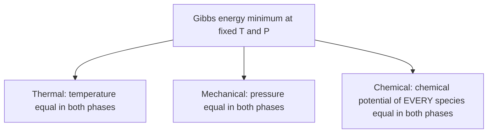

## Video Lecture

<div class="video-container">
  <iframe
    width="560"
    height="315"
    src="https://www.youtube.com/embed/tGOpNey5U9E?start=1412"
    title="Chemical Engineering Thermodynamics Ch.3: Phase Equilibrium"
    frameborder="0"
    allow="accelerometer; autoplay; clipboard-write; encrypted-media; gyroscope; picture-in-picture"
    allowfullscreen>
  </iframe>
</div>

> This video covers the same content as the text below. Choose your preferred learning format.

---

# Chapter 3: Phase Equilibrium

Chapters 1 and 2 built the two laws. This chapter spends them on one question: when a liquid and its vapor sit together in a vessel, what is in each phase? Every distillation column, flash drum, absorber, and condenser is designed from the answer.

**Vapor-Liquid Equilibrium, Raoult's Law, and Azeotropes**

## Learning Objectives

By completing this chapter, you will be able to:

  * ✅ State the phase-equilibrium criterion in terms of temperature, pressure, and chemical potential
  * ✅ Apply the Gibbs phase rule to count degrees of freedom
  * ✅ Explain how vapor pressure varies with temperature and what the Antoine equation correlates
  * ✅ Use Raoult's law to compute bubble pressure and vapor composition for an ideal binary
  * ✅ Calculate relative volatility and connect it to distillation design
  * ✅ Explain activity coefficients and why azeotropes defeat ordinary distillation

**Reading Time**: 20-25 minutes **Code Examples**: 1 **Exercises**: 3

* * *

## 3.1 Equilibrium Between Phases

Chapter 2 ended with the working criterion of equilibrium: at fixed temperature and pressure, a system moves until its **Gibbs energy** is a minimum. Applied to a closed vessel holding a liquid and a vapor, that statement resolves into three equalities that must hold at once.



The first two are intuitive: a hot spot would drive heat flow, a pressure difference would move the interface. The third does the real work. For every species $i$:

$$ \mu_i^{\,L} = \mu_i^{\,V} \qquad\Longleftrightarrow\qquad f_i^{\,L} = f_i^{\,V} $$

where $\mu_i$ is the chemical potential and $f_i$ the **fugacity**, an equivalent restatement engineers prefer because it has units of pressure and reduces to partial pressure for an ideal gas. Fugacity reads as an **escaping tendency**: how hard species $i$ is trying to leave its phase.

Equilibrium is therefore not a state where nothing happens — molecules cross the interface constantly in both directions. It is a state where each species leaves the liquid at exactly the rate it leaves the vapor, so compositions stop changing. Equal escaping tendency matches those rates.

### Counting Degrees of Freedom: The Gibbs Phase Rule

Before computing anything, it pays to know how many variables you may specify. The **Gibbs phase rule** answers:

$$ F = C - \pi + 2 \qquad (\pi = \text{number of phases}) $$

with $C$ the number of species, $\pi$ the number of phases in equilibrium — written $\pi$ rather than $P$ so it cannot be confused with pressure — and $F$ the number of intensive variables (temperature, pressure, compositions) that may be fixed freely. Three worked counts:

| System | C | π | F | Consequence |
|---|---|---|---|---|
| Pure water boiling (liquid + vapor) | 1 | 2 | **1** | Fixing pressure fixes the boiling temperature — nothing else is free |
| Water triple point (solid + liquid + vapor) | 1 | 3 | **0** | Invariant: one unique T and P, which is why it defines a temperature scale |
| Binary vapor-liquid equilibrium | 2 | 2 | **2** | Fix T and P, and both phase compositions follow; or fix P and x, and T and y follow |

The first row explains the pressure cooker: raise P and the boiling T must follow. The third shapes everything below — in a binary at fixed column pressure, exactly **one** further specification (say the liquid composition) fixes both the temperature and the vapor composition. That is what a T-x-y diagram displays.

## 3.2 Pure-Component Vapor Pressure

All of vapor-liquid equilibrium is anchored on one pure-component property: the **saturation vapor pressure** $P_i^{sat}(T)$, the pressure at which pure $i$ boils at temperature $T$. It rises steeply — roughly exponentially — with temperature, because the fraction of molecules energetic enough to escape is governed by a Boltzmann factor, much like the Arrhenius term in kinetics. Water exerts about 0.023 atm at 20 °C, 1 atm at 100 °C, nearly 5 atm at 150 °C. The **normal boiling point** is the temperature at which $P^{sat} = 1$ atm.

The standard engineering correlation is the **Antoine equation**:

$$ \log_{10} P^{sat} = A - \frac{B}{T + C} $$

with $A$, $B$, $C$ fitted per compound. Two cautions matter more than the constants: they hold **only** over the temperature range fitted, and each set carries specific units for $P$ and $T$. Mixing a bar-based set into an atm-based calculation is a classic quiet error.

## 3.3 Raoult's Law and the Ideal Solution

The simplest useful model assumes a molecule cannot tell its neighbors apart — an A-B interaction has the average energy of A-A and B-B. Such an **ideal solution** obeys **Raoult's law**:

$$ y_i \, P = x_i \, P_i^{sat}(T) $$

The partial pressure a species exerts above the mixture is its pure vapor pressure scaled by its liquid mole fraction. Summing over all species (the $y_i$ add to 1) gives the **bubble pressure**, at which the first bubble of vapor appears:

$$ P = \sum_i x_i P_i^{sat}(T) $$

Raoult's law works well for chemically similar species — benzene and toluene, hexane and heptane. It fails badly when polarity or hydrogen bonding differs; ethanol-water is the canonical failure, treated in Section 3.4.

### Relative Volatility

Distillation design compresses the equilibrium relation into one number, the **relative volatility** of the light component 1 over the heavy 2:

$$ \alpha = \frac{y_1/x_1}{y_2/x_2} = \frac{P_1^{sat}}{P_2^{sat}} \quad \text{(ideal solution)} $$

If $\alpha = 1$ the phases have identical composition and distillation is impossible; the larger $\alpha$, the fewer stages needed. For an ideal binary it collapses the equilibrium curve to one expression:

$$ y_1 = \frac{\alpha x_1}{1 + (\alpha - 1) x_1} $$

This is exactly the $\alpha$-parameterized equilibrium curve that the **McCabe–Thiele** construction in Chapter 4 of the companion series, *Chemical Engineering Introduction*, is built on — the staircase drawn there is stepped off against a curve of this form, so it is a picture of the thermodynamics derived here.

Plotting $y_1$ against $x_1$ from that expression gives the **y-x (equilibrium) diagram**: the equilibrium curve, together with the 45° line $y = x$ drawn as the no-separation reference, since a point on that line has vapor and liquid of identical composition. The vertical gap between curve and line is the enrichment one equilibrium stage delivers — the thing distillation exploits, and the thing that vanishes wherever the two touch.

### Worked Example: Benzene(1)-Toluene(2) at 90 °C

Take approximate textbook magnitudes at 90 °C: $P_1^{sat} \approx 1.34$ atm for benzene, $P_2^{sat} \approx 0.54$ atm for toluene. For a liquid with $x_1 = 0.4$ benzene:

$$ P = 0.4 \times 1.34 + 0.6 \times 0.54 = 0.536 + 0.324 = 0.860\ \text{atm} $$

$$ y_1 = \frac{0.536}{0.860} = 0.623 $$

The vapor holds 62.3% benzene against 40% in the liquid — one equilibrium contact has already enriched it substantially. Here $\alpha = 1.34/0.54 = 2.48$ — which rounds to 2.5 — and the McCabe–Thiele construction in Chapter 4 of the Introduction series is built on exactly this kind of equilibrium curve.

```python
# Ideal binary VLE (Raoult's law): benzene(1) - toluene(2) at 90 C
# Approximate textbook vapor pressures at 90 C, in atm.
P1sat, P2sat = 1.34, 0.54
alpha = P1sat / P2sat

print(f"Relative volatility alpha = {alpha:.2f}\n")
print(f"{'x1':>5} {'P (atm)':>9} {'y1':>7} {'y1 - x1':>9}")
for i in range(11):
    x1 = i / 10
    P = x1 * P1sat + (1 - x1) * P2sat   # bubble pressure
    y1 = x1 * P1sat / P                 # vapor composition
    print(f"{x1:5.1f} {P:9.3f} {y1:7.3f} {y1 - x1:9.3f}")

# Relative volatility alpha = 2.48
#
#    x1   P (atm)      y1   y1 - x1
#   0.0     0.540   0.000     0.000
#   0.1     0.620   0.216     0.116
#   0.2     0.700   0.383     0.183
#   0.3     0.780   0.515     0.215
#   0.4     0.860   0.623     0.223
#   0.5     0.940   0.713     0.213
#   0.6     1.020   0.788     0.188
#   0.7     1.100   0.853     0.153
#   0.8     1.180   0.908     0.108
#   0.9     1.260   0.957     0.057
#   1.0     1.340   1.000     0.000
```

Two features matter. The bubble pressure is **linear** in $x_1$ — the signature of an ideal solution. The enrichment $y_1 - x_1$ stays positive between the pure limits but peaks mid-range and collapses toward both ends, which is why the last few percent of purity are the expensive part of a column.

## 3.4 Deviations and Activity Coefficients

Real mixtures are not ideal. The fix is a correction on the liquid side, the **activity coefficient** $\gamma_i$:

$$ y_i \, P = \gamma_i \, x_i \, P_i^{sat}(T) $$

By construction $\gamma_i \to 1$ as the solution becomes ideal, and as species $i$ approaches purity. Its value carries physical meaning:

| Deviation | $\gamma$ | Molecular cause | Consequence |
|---|---|---|---|
| **Positive** | > 1 | Unlike molecules attract each other less than like ones — they "push each other out" | Higher pressure than Raoult predicts; can form a **minimum-boiling azeotrope** |
| **Negative** | < 1 | Unlike molecules attract more strongly (hydrogen bonding, complexes) | Lower pressure than Raoult predicts; can form a maximum-boiling azeotrope |

Ethanol-water is the textbook positive deviation: an ethanol molecule disrupts water's hydrogen-bond network, so both species escape more readily than an ideal model allows and $\gamma > 1$ for both.

### The Azeotrope

When the deviation is strong enough, the enrichment $y_1 - x_1$ falls to zero at some intermediate composition:

$$ y_1 = x_1 \qquad\Longrightarrow\qquad \alpha = 1 $$

This is an **azeotrope**, a hard wall. The vapor leaving a stage matches the liquid on it, so an extra stage accomplishes nothing — no reflux ratio and no column height gets past it. Ethanol-water forms a minimum-boiling azeotrope at 1 atm near **95.6 wt% ethanol** (about 89 mol%), boiling at roughly 78.2 °C, slightly *below* pure ethanol's boiling point. It is the limit flagged in Chapter 1 of the Introduction series, and why ordinary distillation of a fermentation broth stops just short of 96 wt%.

Industry gets past it by changing the thermodynamics, not the column:

- **Pressure-swing distillation** — the azeotropic composition shifts with pressure, so two columns at different pressures step around it.
- **Extractive distillation** — a high-boiling entrainer (an added separating agent) such as ethylene glycol alters the activity coefficients enough to break the azeotrope.
- **Molecular sieves** — 3A zeolite adsorbs water and passes ethanol, sidestepping equilibrium altogether; the standard route to fuel-grade anhydrous ethanol.

## 3.5 T-x-y Diagrams and the Lever Rule

At fixed pressure the phase rule left a binary mixture one free specification, and the **T-x-y diagram** plots the result: temperature against composition, with two curves spanning the two pure boiling points — for benzene-toluene at 1 atm, from benzene's 80.1 °C up to toluene's 110.6 °C.

- The lower **bubble-point curve**: the temperature at which a liquid of composition $x_1$ first boils.
- The upper **dew-point curve**: the temperature at which a vapor of composition $y_1$ first condenses.
- Between them, the **two-phase region** — a mixture landing inside it splits spontaneously into a liquid on the bubble curve and a vapor on the dew curve.

The horizontal line joining that pair at a given temperature is the **tie line**; its ends are the equilibrium compositions, read straight off the graph. How much material sits in each phase follows from a mass balance, the **lever rule**, with overall composition $z_1$:

$$ \frac{n^{V}}{n^{L}} = \frac{z_1 - x_1}{y_1 - z_1} $$

The phase lying *closer* to the overall composition is the more abundant one — the tie line behaves like a balance beam with the feed point as its fulcrum. That single relation is the entire content of a flash-drum calculation.

*(The video version of this chapter shows a rendered T-x-y diagram with its tie line.)*

## 3.6 Chapter Summary

- Phase equilibrium requires **three** equalities across phases: temperature, pressure, and the chemical potential (equivalently the fugacity) of every species — the last being equality of escaping tendencies
- The **Gibbs phase rule** $F = C - \pi + 2$ (with $\pi$ the number of phases) counts what you may specify: 1 for a boiling pure liquid, 0 at a triple point, 2 for binary vapor-liquid equilibrium
- Vapor pressure rises roughly exponentially with temperature, correlated by the **Antoine equation** — valid only within its fitted range and units
- **Raoult's law** $y_i P = x_i P_i^{sat}$ describes ideal solutions of similar species; the bubble pressure is linear in composition
- **Relative volatility** $\alpha = P_1^{sat}/P_2^{sat}$ is the parameter distillation design runs on; benzene-toluene at 90 °C gives $\alpha = 2.48$ (rounding to 2.5), and the McCabe–Thiele construction in Chapter 4 of the Introduction series is built on exactly this kind of equilibrium curve
- **Activity coefficients** $\gamma_i$ correct Raoult's law for real mixtures; positive deviations can produce **azeotropes**, where $y = x$, $\alpha = 1$, and ordinary distillation stops — ethanol-water near 95.6 wt% ethanol being the classic case
- The **T-x-y diagram**, its tie lines, and the **lever rule** turn all of this into a flash calculation readable off a graph

**Next chapter**: the same Gibbs criterion, applied to species that convert into one another rather than merely change phase, gives **chemical equilibrium** — the equilibrium constant, its temperature dependence, and the thermodynamic ceiling on any reactor's conversion.

## Exercises

1. **Conceptual — degrees of freedom**: A binary mixture is in vapor-liquid equilibrium in a column at fixed pressure. (a) How many further variables may you specify independently, and what does that mean practically? (b) For a pure substance, how many phases can coexist at most, and what is special about that state?
   *Hint*: Use F = C − π + 2 (π = number of phases), and remember that fixing the pressure consumes one degree of freedom.
   *Answer*: (a) F = 2 − 2 + 2 = **2**. Fixing the column pressure uses one, leaving **one**: specify the liquid composition x₁ and both the temperature and y₁ are determined — which is why a constant-pressure T-x-y diagram fully describes the equilibrium. (b) F = 1 − π + 2 = 3 − π, so F = 0 at **π = 3** — the triple point, an invariant state at one unique temperature and pressure, which is why water's triple point serves as a fixed point for temperature scales.

2. **Quantitative — bubble point by Raoult's law**: For benzene(1)-toluene(2) at 90 °C with the approximate values P₁sat = 1.34 atm and P₂sat = 0.54 atm, compute the bubble pressure and the vapor composition for x₁ = 0.6. Compare the enrichment with the x₁ = 0.4 case of Section 3.3.
   *Hint*: P = x₁P₁sat + x₂P₂sat, then y₁ = x₁P₁sat / P.
   *Answer*: P = 0.6 × 1.34 + 0.4 × 0.54 = 0.804 + 0.216 = **1.020 atm**; y₁ = 0.804 / 1.020 = **0.788**. The enrichment y₁ − x₁ = 0.188 is smaller than the 0.223 at x₁ = 0.4 even though α = 2.48 is unchanged — enrichment per stage peaks mid-range, which is why the final approach to high purity costs disproportionately many stages. Note also that the bubble pressure now exceeds 1 atm: at 90 °C this mixture boils under atmospheric pressure while the x₁ = 0.4 mixture does not.

3. **Discussion — beating the azeotrope**: A fuel-ethanol plant reaches 95 wt% ethanol overhead, but the specification is 99.5 wt%. An engineer proposes twenty more trays and a higher reflux ratio. Explain why this fails, and give at least two workable alternatives with their mechanisms.
   *Hint*: What is α at 95.6 wt% ethanol, and what does a McCabe–Thiele staircase do where the equilibrium curve meets the 45° line?
   *Answer*: At about 95.6 wt% (roughly 89 mol%) ethanol the mixture azeotropes: y = x and α = 1. The equilibrium curve touches the 45° line, so the staircase steps shrink to nothing — no finite stage count crosses the azeotropic pinch (where the equilibrium curve touches the 45° line), and reflux only moves the operating lines. Extra trays buy capital and energy, nothing else. Alternatives: (1) **molecular sieve dehydration**, where a 3A zeolite bed adsorbs water by size and passes ethanol, bypassing vapor-liquid equilibrium entirely — the standard industrial route; (2) **extractive distillation** with an entrainer such as ethylene glycol, which shifts the activity coefficients so α no longer reaches 1; (3) **pressure-swing distillation**, coupling two columns at different pressures to exploit the movement of the azeotropic composition with pressure.
