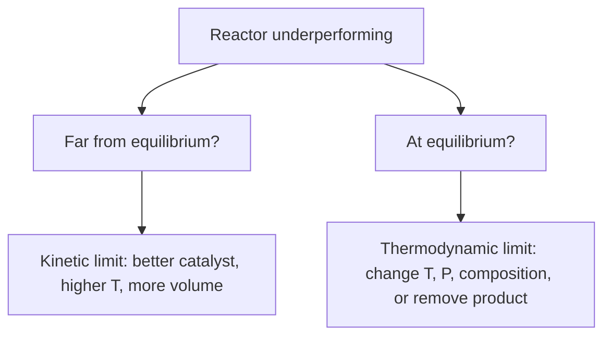

## Video Lecture

<div class="video-container">
  <iframe
    width="560"
    height="315"
    src="https://www.youtube.com/embed/tGOpNey5U9E?start=2150"
    title="Chemical Engineering Thermodynamics Ch.4: Chemical Equilibrium"
    frameborder="0"
    allow="accelerometer; autoplay; clipboard-write; encrypted-media; gyroscope; picture-in-picture"
    allowfullscreen>
  </iframe>
</div>

> This video covers the same content as the text below. Choose your preferred learning format.

---

# Chapter 4: Chemical Equilibrium

Chapter 3 asked how matter distributes itself between phases. This chapter asks the analogous question for reactions: given a feed and a set of conditions, **how far can the reaction go before it stops** — and what can an engineer do about the answer.

**How Far Can a Reaction Go?**

## Learning Objectives

By completing this chapter, you will be able to:

  * ✅ Distinguish the kinetic question ("how fast") from the thermodynamic question ("how far")
  * ✅ Explain why a catalyst can never shift an equilibrium position
  * ✅ Use $\Delta G^\circ = -RT \ln K$ to compute an equilibrium constant and read its sign
  * ✅ Apply the van 't Hoff equation to predict how $K$ moves with temperature
  * ✅ Predict pressure, inert, and composition effects for a gas-phase reaction
  * ✅ Explain the Haber–Bosch compromise and how equilibrium shapes reactor design

**Reading Time**: 20-25 minutes **Code Examples**: 1 **Exercises**: 3

* * *

## 4.1 Two Different Questions

A reaction is described by two independent questions, and confusing them is the most common error in introductory reaction engineering.

**Kinetics asks: how fast?** That is the subject of the companion series *Chemical Engineering Introduction*, Chapter 2 — rate laws, the Arrhenius equation, reactor sizing. Kinetics governs the *path* and the *time* required.

**Thermodynamics asks: how far?** Given unlimited time, what composition does the mixture settle into? This is a property of the initial and final states only. It does not care what route the molecules take, how many intermediates exist, or whether a catalyst is present.

That last point deserves a blunt statement, because it is a classic misconception:

> **A catalyst cannot change the equilibrium composition. It only accelerates the approach to it.**

The reason is structural. A catalyst lowers the activation energy of the forward reaction, but a catalyst is not consumed, so it must lower the reverse activation energy by exactly the same amount. Both rates rise by the same factor and the ratio at which they balance — the equilibrium constant — is unchanged. Thermodynamically, $K$ is fixed by $\Delta G^\circ$, a difference between reactant and product states; the catalyst appears in neither.

The practical consequence: if a reactor is stuck at 30% conversion because equilibrium says 30%, a better catalyst buys nothing. Only temperature, pressure, composition, or removal of product can move that ceiling.



## 4.2 The Equilibrium Constant

At constant temperature and pressure a reacting mixture moves toward minimum Gibbs energy. At that minimum the composition stops changing, and the **standard Gibbs energy of reaction** fixes the equilibrium constant:

$$ \Delta G^\circ = -RT \ln K \qquad \Longleftrightarrow \qquad K = \exp\!\left(\frac{-\Delta G^\circ}{RT}\right) $$

$K$ is a ratio of **activities** of products to reactants, each raised to its stoichiometric coefficient, evaluated at equilibrium. For an ideal gas mixture the activity is the partial pressure divided by the standard pressure (1 bar), so $K$ is built from partial-pressure ratios and is dimensionless. For an ideal solution it is built from mole fractions or concentrations relative to a standard state. Chapter 5 shows how equations of state supply fugacity corrections that replace the word "ideal" here; everything in this chapter assumes ideal-gas behavior.

**Worked mini-example.** A reaction has $\Delta G^\circ = -20$ kJ/mol at 298 K.

$$ K = \exp\!\left(\frac{20000}{8.314 \times 298}\right) = \exp(8.07) \approx 3.2 \times 10^{3} $$

So $K \approx 3200$: at equilibrium, products dominate overwhelmingly. Now note what the exponential does. A shift of only 5.7 kJ/mol in $\Delta G^\circ$ — a rounding error by the standards of chemical intuition — multiplies or divides $K$ by ten at room temperature. **Modest changes in $\Delta G^\circ$ swing $K$ by orders of magnitude.** This is why equilibrium calculations are unforgiving of sloppy thermodynamic data, and why a reaction that "should work" on paper sometimes has an equilibrium constant of $10^{-6}$.

| $\Delta G^\circ$ | $K$ | Equilibrium position |
|---|---|---|
| Strongly negative (≲ −20 kJ/mol) | $K \gg 1$ | Essentially complete |
| Negative | $K > 1$ | Products favored |
| Zero | $K = 1$ | Comparable amounts |
| Positive | $K < 1$ | Reactants favored |
| Strongly positive (≳ +20 kJ/mol) | $K \ll 1$ | Barely proceeds unaided |

One caution: $\Delta G^\circ$ is the *standard-state* value. The actual driving force depends on the real composition, so a reaction with $K < 1$ still proceeds usefully if the products are kept scarce — a point we return to in Exercise 2.

## 4.3 Temperature Dependence: the van 't Hoff Equation

$K$ is fixed at a given temperature, but it is a strong function of temperature. The **van 't Hoff equation** states:

$$ \frac{d(\ln K)}{dT} = \frac{\Delta H^\circ}{R T^{2}} $$

The sign of $\Delta H^\circ$ decides everything, because $R T^2$ is always positive:

- **Exothermic** ($\Delta H^\circ < 0$): $\ln K$ **decreases** as $T$ rises — the attainable conversion falls with temperature.
- **Endothermic** ($\Delta H^\circ > 0$): $\ln K$ **increases** as $T$ rises — heat helps.

This is the thermodynamic root of the statement in *Chemical Engineering Introduction* Chapter 2 that raising the temperature of an exothermic reaction *lowers* its equilibrium conversion. It is not a special case or an empirical oddity; it follows directly from the sign of $\Delta H^\circ$ in the equation above.

If $\Delta H^\circ$ is treated as constant over the temperature range, integrating gives the working form:

$$ \ln\!\frac{K_2}{K_1} = -\frac{\Delta H^\circ}{R}\left(\frac{1}{T_2} - \frac{1}{T_1}\right) $$

The code below applies it to an exothermic reaction of ammonia-synthesis magnitude, $\Delta H^\circ = -92$ kJ/mol.

```python
import math

R = 8.314          # J/(mol K)
dH = -92000.0      # J/mol, exothermic (ammonia-synthesis magnitude)
T_ref = 298.15     # K
K_ref = 5.6e5      # approximate standard-state K at 298 K (p in bar)

def K_vant_hoff(T):
    """Integrated van 't Hoff, constant dH:
       ln(K/K_ref) = -(dH/R) * (1/T - 1/T_ref)"""
    return K_ref * math.exp(-(dH / R) * (1.0 / T - 1.0 / T_ref))

print(f"{'T (K)':>7} {'T (C)':>7} {'K':>12} {'log10 K':>9}")
for T in [300, 400, 500, 600, 700, 800]:
    K = K_vant_hoff(T)
    print(f"{T:7d} {T-273.15:7.0f} {K:12.3e} {math.log10(K):9.2f}")

print(f"\nK(300 K)/K(800 K) = {K_vant_hoff(300)/K_vant_hoff(800):.2e}")

#   T (K)   T (C)            K   log10 K
#     300      27    4.454e+05      5.65
#     400     127    4.405e+01      1.64
#     500     227    1.742e-01     -0.76
#     600     327    4.357e-03     -2.36
#     700     427    3.126e-04     -3.51
#     800     527    4.333e-05     -4.36
#
# K(300 K)/K(800 K) = 1.03e+10
```

Over 300 → 800 K, $K$ collapses by about **ten orders of magnitude**. A reaction that is thermodynamically near-complete at room temperature is thermodynamically hopeless at 800 K. (The constant-$\Delta H^\circ$ assumption makes these values approximate — real $\Delta H^\circ$ drifts with temperature — but the trend and its magnitude are right.)

## 4.4 Pressure and Composition Effects

**Le Chatelier's principle**, qualitatively: a system at equilibrium responds to a disturbance in the direction that partially opposes it. Compress it and it shifts toward fewer molecules; heat it and it shifts in the endothermic direction.

The quantitative version for gases runs through the change in mole number, $\Delta n$ = (moles of gaseous product) − (moles of gaseous reactant). $K$ itself depends only on temperature, but the *mole-fraction* composition that satisfies it depends on total pressure whenever $\Delta n \neq 0$:

- $\Delta n < 0$ (fewer moles of gas on the product side): **higher pressure raises conversion**
- $\Delta n > 0$: higher pressure lowers conversion
- $\Delta n = 0$: pressure has no effect on the equilibrium composition

**Inerts** act in the opposite direction to compression. Adding nitrogen or steam that takes no part in the reaction lowers every partial pressure at fixed total pressure, which shifts a $\Delta n < 0$ reaction backward. This is exactly why recycle loops need a purge: inerts that accumulate dilute the reactor feed and eat into equilibrium conversion as well as rate.

### Case study: ammonia synthesis

$$ \mathrm{N_2} + 3\,\mathrm{H_2} \rightleftharpoons 2\,\mathrm{NH_3}, \qquad \Delta n = 2 - 4 = -2, \qquad \Delta H^\circ \approx -92\ \text{kJ per mol N}_2 $$

Thermodynamics gives an unambiguous prescription: $\Delta n < 0$ says **high pressure**, and $\Delta H^\circ < 0$ says **low temperature**. Kinetics gives the opposite instruction on temperature — the N≡N triple bond is so strong that at low temperature nothing happens at a useful rate, catalyst or not.

The historic resolution is the **Haber–Bosch compromise**: an iron-based catalyst, with typical textbook operating ranges of roughly **400–500 °C** and **150–300 bar**. The temperature is high enough for an acceptable rate and low enough that $K$ has not collapsed entirely; the pressure is then pushed up to claw back what the temperature cost. Even so, single-pass conversion is modest — typically quoted in the **15–20%** range. The remaining 80% or so of unconverted synthesis gas is separated (ammonia is condensed out) and **recycled**, which is precisely the recycle structure introduced in *Chemical Engineering Introduction* Chapter 1: a reactor with unremarkable single-pass conversion delivers near-complete overall conversion because nothing is thrown away except a small purge.

## 4.5 Coupling Equilibrium and Reactor Design

Equilibrium sets the ceiling; kinetics sets how quickly a reactor approaches it. Design consists of managing both at once.

**Adiabatic exothermic beds fight themselves.** With no heat removal, the temperature rises as conversion rises, and rising temperature drives $K$ down — so the bed approaches a moving, falling ceiling. The standard answer is a **multi-bed reactor with interstage cooling**: react until the temperature approaches the equilibrium limit, cool the stream, react again. Each cooling step restores headroom.

**Equilibrium-limited reactions motivate product removal.** If the product is continuously taken out, the mixture can never reach equilibrium and the reaction keeps running — the basis of **reactive distillation** (product boiled off as it forms, standard for esterifications) and **membrane reactors** (hydrogen permeating out of a reforming or dehydrogenation bed).

**Excess reactant is the cheap version of the same idea.** Feeding one reactant in large excess shifts the attainable conversion of the other, at the cost of a bigger separation and recycle duty downstream — the recurring trade in process design.

## 4.6 Chapter Summary

- Kinetics answers **how fast**, thermodynamics answers **how far**; the two limits are independent
- A **catalyst cannot move an equilibrium** — it accelerates forward and reverse reactions equally, and $K$ depends only on $\Delta G^\circ$
- $\Delta G^\circ = -RT \ln K$; $\Delta G^\circ < 0 \Rightarrow K > 1$, and because the relation is exponential, small changes in $\Delta G^\circ$ swing $K$ by orders of magnitude ($\Delta G^\circ = -20$ kJ/mol at 298 K gives $K \approx 3200$)
- **van 't Hoff**, $d(\ln K)/dT = \Delta H^\circ/RT^2$: exothermic reactions lose equilibrium conversion as temperature rises; endothermic reactions gain it
- Pressure shifts gas-phase equilibrium toward the side with **fewer moles** ($\Delta n < 0$); inerts dilute and shift it back
- **Haber–Bosch** is the textbook compromise: thermodynamics wants cold and compressed, kinetics wants hot, so a typical plant runs ~400–500 °C and ~150–300 bar with ~15–20% single-pass conversion and heavy recycle
- Equilibrium shapes hardware: **interstage cooling** for adiabatic exotherms, **reactive distillation** and **membrane reactors** to remove product and outrun the ceiling

**Next chapter**: every equilibrium constant, partial pressure, and mole balance in this chapter assumed **ideal-gas behavior**. At 200 bar — the very condition ammonia synthesis demands — that assumption is simply wrong. Chapter 5 introduces real fluids and the equations of state that supply the fugacity corrections making these calculations trustworthy at industrial pressures.

## Exercises

1. **Conceptual — why a catalyst cannot change equilibrium**: An engineer reports that a new catalyst raised conversion in a packed bed from 45% to 62%, and concludes that the catalyst "shifted the equilibrium." Explain why that conclusion cannot be right, and give the correct explanation for the observation.
   *Hint*: What does $K$ depend on? What does a catalyst do to the forward and reverse rates?
   *Answer*: $K$ is fixed by $\Delta G^\circ$, a difference between the standard states of reactants and products; a catalyst is consumed by neither, so it cannot alter $K$. Mechanistically, lowering the activation barrier speeds the forward and reverse reactions by the **same factor**, leaving the ratio at which they balance unchanged. The correct explanation is that the old reactor was **kinetically limited** — not reaching equilibrium in the available residence time — and the faster catalyst moved the outlet closer to the same, unchanged ceiling. Diagnostic: at true equilibrium, extra residence time or extra catalyst gives no further conversion.

2. **Quantitative — a small equilibrium constant**: A gas-phase reaction has $\Delta G^\circ = +10$ kJ/mol at 298 K. (a) Compute $K$. (b) Is the reaction industrially useless?
   *Hint*: $K = \exp(-\Delta G^\circ / RT)$, with $\Delta G^\circ$ in J/mol and $R = 8.314$ J mol⁻¹ K⁻¹. For (b), think about what the standard state assumes about composition.
   *Answer*: (a) $-10000/(8.314 \times 298) = -4.036$, so $K = \exp(-4.036) \approx \mathbf{0.018}$ — reactants are strongly favored at standard conditions. (b) **No, not useless.** $K$ fixes the equilibrium *ratio*, not an absolute prohibition. Two standard remedies apply: **remove the product** as it forms (reactive distillation, membrane reactor), so the mixture never reaches equilibrium; or **feed one reactant in large excess**, driving the other to higher conversion. Esterifications are the classic case — $K$ of order 1 or below, yet near-complete conversion of the limiting reactant. The cost is downstream: both remedies enlarge the separation and recycle sections.

3. **Discussion — the Haber–Bosch compromise**: Ammonia synthesis is exothermic ($\Delta H^\circ \approx -92$ kJ/mol N₂) with $\Delta n = -2$, yet plants run hot at roughly 400–500 °C. (a) State what pure thermodynamics would prescribe and why it is not followed. (b) Explain how the plant recovers the conversion lost to temperature. (c) Why must the recycle loop carry a purge?
   *Hint*: Use the sign of $\Delta H^\circ$ with van 't Hoff, the sign of $\Delta n$ with Le Chatelier, and recall what inerts do to partial pressures.
   *Answer*: (a) van 't Hoff with $\Delta H^\circ < 0$ says $K$ falls as $T$ rises, so thermodynamics prescribes the **lowest possible temperature**. It is not followed because the N≡N bond makes the rate negligible when cold — even an iron catalyst cannot deliver a useful rate at ambient temperature. Temperature is therefore set by kinetics. (b) Since $\Delta n = -2$, **raising the total pressure** (typically 150–300 bar) shifts the equilibrium composition toward ammonia, partially recovering what the high temperature cost. Single-pass conversion is still only about 15–20%, so ammonia is condensed out and the unconverted N₂ and H₂ are **recycled**, giving high overall conversion from a modest per-pass one. (c) Inerts in the feed (typically argon and methane) neither react nor leave with the liquid ammonia, so the loop is their only home and they accumulate without limit. Because $\Delta n < 0$, they lower the N₂ and H₂ partial pressures and push the equilibrium backward as well as slowing the rate — so a small **purge** holds the inert level steady, at the cost of losing some reactant with it.
