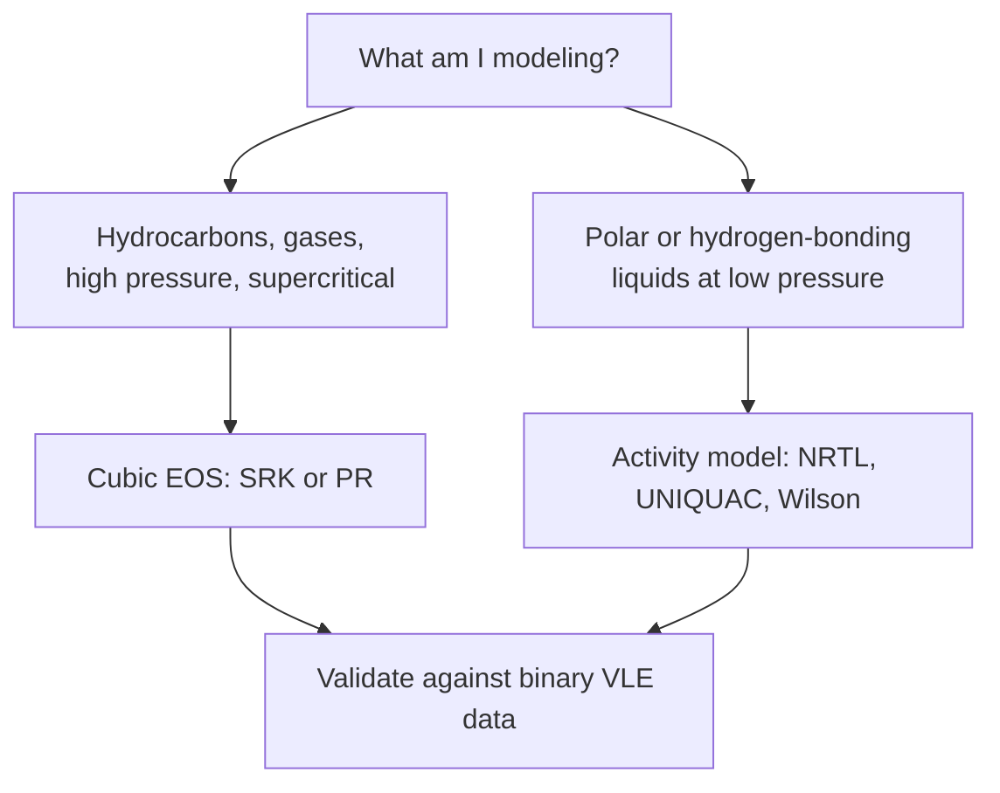

## Video Lecture

<div class="video-container">
  <iframe
    width="560"
    height="315"
    src="https://www.youtube.com/embed/tGOpNey5U9E?start=2925"
    title="Chemical Engineering Thermodynamics Ch.5: Real Fluids and Equations of State"
    frameborder="0"
    allow="accelerometer; autoplay; clipboard-write; encrypted-media; gyroscope; picture-in-picture"
    allowfullscreen>
  </iframe>
</div>

> This video covers the same content as the text below. Choose your preferred learning format.

---

# Chapter 5: Real Fluids and Equations of State

This final chapter replaces the ideal gas law with the equations of state that real process simulators use, and shows why the thermodynamic model buried in a simulator's settings dialog quietly determines whether its answer is worth anything.

**From Ideal Gas to Process Simulator**

## Learning Objectives

By completing this chapter, you will be able to:

  * ✅ Explain when the ideal gas law is adequate and when it fails
  * ✅ Define the compressibility factor Z and interpret values above and below 1
  * ✅ Describe what the van der Waals parameters a and b represent
  * ✅ Name the cubic equations of state used in industry and state the properties they need
  * ✅ Choose between a cubic EOS and an activity-coefficient model for a given system
  * ✅ Explain why every simulator, digital twin, and soft sensor rests on a thermodynamic model

**Reading Time**: 20-25 minutes **Code Examples**: 1 **Exercises**: 3

* * *

## 5.1 Where the Ideal Gas Fails

Every chapter so far has leaned on the ideal gas law:

$$ PV = nRT $$

It rests on two assumptions: molecules occupy no volume, and they exert no forces on one another. Both are excellent approximations when molecules are far apart — **low pressure and high temperature** — which covers a great deal of introductory work and a fair amount of real plant operation.

Both assumptions collapse under exactly the conditions engineers care most about. Near condensation, attractive forces are the entire story; at high pressure, molecules are packed closely enough that their own volume matters. That is not an exotic corner of the operating map. It is the **suction and discharge of every compressor**, the **150–300 bar of an ammonia synthesis loop** (Chapter 4), and essentially all of **natural-gas processing and liquefaction**. Using $PV = nRT$ there does not produce a slightly rough answer; it produces a wrong one.

The standard way to keep score is the **compressibility factor**:

$$ Z = \frac{PV}{nRT} $$

$Z$ is the ratio of the real molar volume to the ideal one, so $Z = 1$ means ideal behavior and any departure measures how badly the ideal gas law is lying. Two regimes matter:

- **$Z < 1$** — attraction dominates. Molecules pull on each other, so the real gas is *more* compact than ideal. This is the common case at moderate pressures.
- **$Z > 1$** — repulsion dominates. At very high pressure the finite size of the molecules themselves resists further compression, and the gas is *less* compact than ideal.

The table below shows methane at 300 K, computed with the code in Section 5.3:

| Pressure | Z | Interpretation |
|---|---|---|
| 1 bar | 0.998 | Effectively ideal |
| 50 bar | 0.924 | Attraction; 8% error if ignored |
| 150 bar | 0.851 | Deepest attraction effect |
| 300 bar | 0.951 | Repulsion pushing back |
| 400 bar | 1.070 | Repulsion dominant, Z > 1 |

An 8% volume error at 50 bar propagates directly into compressor power, vessel sizing, and inventory. The question is no longer whether to correct for non-ideality, but how.

## 5.2 The van der Waals Insight

The first successful answer came from Johannes Diderik van der Waals in his **1873** doctoral thesis, work that later won him the Nobel Prize. His idea was to patch the ideal gas law with one term for each failed assumption:

$$ \left(P + \frac{a}{V_m^2}\right)\left(V_m - b\right) = RT $$

where $V_m$ is molar volume.

| Parameter | Corrects for | Physical meaning |
|---|---|---|
| **a** | Intermolecular attraction | Molecules pull inward, so the pressure the container feels is *lower* than the internal molecular pressure; add $a/V_m^2$ back |
| **b** | Finite molecular volume | Molecules cannot be compressed into zero space; the free volume is $V_m - b$, not $V_m$ |

Both parameters are substance-specific, and both are obtained from the substance's critical point.

What makes this more than a curve fit is what falls out of it. Because the equation is **cubic in volume**, below the critical temperature it can return three real roots for a single pressure — the largest a vapor, the smallest a liquid, the middle one physically unstable. In other words, a single equation written for a gas spontaneously predicts **condensation**, a **liquid phase**, and a **critical point** above which the two phases become indistinguishable. That was a genuine discovery, and it is why van der Waals is the ancestor of everything in this chapter.

It is also not accurate enough to design with. Modern practice keeps the structure — a repulsion term and an attraction term, cubic in volume — and replaces the details.

## 5.3 Cubic Equations of State in Practice

Two descendants dominate industrial process simulation:

- **Soave–Redlich–Kwong (SRK)**, published by Soave in **1972**, modifying the 1949 Redlich–Kwong equation
- **Peng–Robinson (PR)**, published in **1976**

Both remain cubic in volume, which matters practically: a cubic can be solved fast and reliably for millions of flash calculations, and its multiple roots keep the vapor/liquid behavior that van der Waals discovered. Both take exactly three inputs per pure component — the **critical temperature $T_c$**, the **critical pressure $P_c$**, and the **acentric factor $\omega$**, a single number describing how far the molecule departs from spherical. In practice PR is usually preferred for liquid densities near the critical region, SRK has a long tradition in gas processing, and for most hydrocarbon systems the two agree closely.

Behind this sits the **principle of corresponding states**: when compared at the same **reduced conditions**

$$ T_r = \frac{T}{T_c} \qquad P_r = \frac{P}{P_c} $$

different fluids behave remarkably similarly. Methane at $T_r = 1.5$ looks much like nitrogen at $T_r = 1.5$. This is why one equation with three parameters can cover hundreds of compounds, and why the acentric factor exists: it is the correction for molecules that are not simple spheres.

The code below computes $Z$ for methane from the SRK equation by solving the cubic numerically.

```python
import numpy as np

def srk_Z(T, P, Tc, Pc, omega):
    """Compressibility factor Z from the Soave–Redlich–Kwong EOS."""
    Tr, Pr = T / Tc, P / Pc                       # reduced temperature and pressure
    m = 0.480 + 1.574 * omega - 0.176 * omega**2  # Soave's acentric correction
    alpha = (1.0 + m * (1.0 - np.sqrt(Tr)))**2    # temperature dependence of attraction
    A = 0.42748 * alpha * Pr / Tr**2              # dimensionless attraction term
    B = 0.08664 * Pr / Tr                         # dimensionless volume term
    # Cubic in Z:  Z^3 - Z^2 + (A - B - B^2) Z - A*B = 0
    roots = np.roots([1.0, -1.0, A - B - B**2, -A * B])
    real = np.sort(roots[np.abs(roots.imag) < 1e-9].real)
    real = real[real > B]                         # discard unphysical roots
    return real[-1]                               # vapor root = largest real root

# Methane: Tc = 190.6 K, Pc = 45.99 bar, omega = 0.011
Tc, Pc, omega = 190.6, 45.99, 0.011

print(f"{'T (K)':>7} {'P (bar)':>8} {'Tr':>6} {'Pr':>6} {'Z (vapor)':>10}")
for T, P in [(300.0, 1.0), (300.0, 50.0), (300.0, 150.0), (300.0, 300.0), (300.0, 400.0)]:
    print(f"{T:7.1f} {P:8.1f} {T/Tc:6.3f} {P/Pc:6.3f} {srk_Z(T, P, Tc, Pc, omega):10.4f}")

#   T (K)  P (bar)     Tr     Pr  Z (vapor)
#   300.0      1.0  1.574  0.022     0.9983
#   300.0     50.0  1.574  1.087     0.9238
#   300.0    150.0  1.574  3.262     0.8508
#   300.0    300.0  1.574  6.523     0.9511
#   300.0    400.0  1.574  8.698     1.0703
```

At 300 K and 50 bar, SRK gives **Z = 0.924**: methane occupies about 8% less volume than the ideal gas law predicts. The run also reproduces the qualitative arc of Section 5.1 — $Z$ falls as attraction takes hold, bottoms out, then climbs past 1 as repulsion wins.

The same equation of state yields more than a volume. From it one computes each species' **fugacity coefficient** $\phi_i$ — an effective-pressure correction factor, defined so that the fugacity of Chapter 3 is $f_i = \phi_i y_i P$ and $\phi_i \to 1$ as the gas becomes ideal. That is what makes equilibrium calculations survive high pressure. The equilibrium constant of Chapter 4, written there in partial pressures alone, strictly carries a $K_\phi = \prod_i \phi_i^{\nu_i}$ factor alongside it, and in the **150–300 bar ammonia loop** that factor is a real correction rather than a formality — the same conditions where $Z$ departs from 1 by tens of percent. This is how Chapter 4's ideal-gas equilibrium arithmetic stays trustworthy at industrial pressures: not by being exact, but by being corrected with numbers an equation of state supplies.

## 5.4 Beyond Cubics: Choosing a Property Package

Cubic equations of state work well for nonpolar and weakly polar molecules — hydrocarbons, nitrogen, carbon dioxide, hydrogen — across gas and high-pressure conditions. They work badly for **strongly polar and hydrogen-bonding liquids**, where the interactions are specific and directional rather than an averaged attraction. Water, alcohols, and organic acids are exactly the cases a single parameter $a$ cannot represent.

For those liquid mixtures, engineers use **activity-coefficient models** instead — **NRTL**, **UNIQUAC**, and **Wilson** are the standard names, with **UNIFAC** available when no data exists and parameters must be estimated from molecular groups. These models describe deviations from ideal-solution behavior in the liquid phase and are what reproduce an azeotrope such as ethanol-water, which no cubic EOS will get right on its own.



This choice — the **property package** — is the first thing a simulator asks for and the most consequential thing most users click past. It deserves the attention because **a wrong property package is the classic silent killer of simulation accuracy**. The simulation does not crash. It converges, produces a full heat and material balance, and reports column profiles to four decimal places that are simply wrong. Model an ethanol-water column with a cubic EOS and the azeotrope may vanish, at which point the simulator will cheerfully tell you a modest number of trays can produce pure ethanol — a design that cannot exist.

The practical guidance is short. Polar liquids at low pressure: an activity-coefficient model. Hydrocarbons, light gases, or anything at high pressure: a cubic EOS. When in doubt, or when money depends on the answer, **check the model against measured binary vapor-liquid equilibrium data** for the key pair in your system before trusting any downstream result. Regressing binary interaction parameters against real data is routine professional practice, not an advanced technique.

## 5.5 Thermodynamics as the Foundation of the Digital Plant

Everything in the modern digital layer sits on top of this chapter. A **flowsheet simulator** is, structurally, three things: mass and energy balances, unit-operation models, and a thermodynamic package supplying every enthalpy, entropy, density, and equilibrium constant those models request. The balances are exact and the unit models are approximations — but the thermodynamics is where the physical truth enters, and it is the deepest and least visible layer.

The same is true one level up. A **digital twin** (see Chapter 5 of our *Chemical Engineering Introduction* series) is a simulation kept synchronized with the operating plant; it inherits its property package wholesale. A **soft sensor** that predicts a density, a dew point, or a composition is predicting a thermodynamic quantity, and whatever definition of that quantity it was trained against becomes its definition of truth.

This has a sharp consequence for machine learning. **An ML surrogate trained on simulator output inherits the simulator's thermodynamics — its accuracy and its errors alike.** The surrogate cannot distinguish a systematic property-package error from physics; it learns the error faithfully, then reproduces it fast, smoothly, and with no warning attached. A surrogate that matches its training simulator to 0.1% is not accurate to 0.1%; it is *consistent* to 0.1% with a model whose own accuracy is a separate question nobody asked.

Which is the closing point of this series. Thermodynamic literacy is not about memorizing equations of state — a simulator solves those better than you will. It is about knowing that at 200 bar the ideal gas law is not merely imprecise, that an azeotrope is a real physical constraint rather than a numerical artifact, and that a converged simulation is a statement about a model, not about a plant. **Thermodynamic literacy is what lets an engineer distrust a simulation for the right reasons.**

## 5.6 Series Summary

Chapter 1 established **energy accounting**: the First Law, enthalpy, and the fact that energy is conserved but never free. Chapter 2 added **direction and limits** through entropy and the Second Law — why heat flows one way, why no engine reaches 100%, and why every real process destroys some capacity to do work. Chapter 3 applied both to **phase equilibrium**, the basis of distillation, absorption, and every separation in a plant. Chapter 4 extended the same equilibrium logic to **reacting systems**, showing how $\Delta G$ sets the ceiling no catalyst can raise. Chapter 5 discarded the ideal gas and arrived at the **real-fluid models** that industrial simulation actually runs on.

Taken together these five chapters describe what is possible before anyone asks what is practical — which is why thermodynamics comes first in a chemical engineering education and stays useful for the whole career that follows.

Where to go next: revisit our *Chemical Engineering Introduction* series — its unit operations, reactors, and design decisions should now read differently with the thermodynamics in place — and continue to *Process Informatics Introduction* for the data layer built on top of these models and *Introduction to Bayesian Optimization* for making decisions when each experiment is expensive.

Thank you for learning with us.

## Exercises

1. **Conceptual — when is the ideal gas law acceptable?**: A colleague uses $PV = nRT$ for (a) air in a ventilation duct at 1 bar and 25 °C, (b) steam at 40 bar in a boiler drum, and (c) hydrogen at 200 bar feeding an ammonia loop. Which uses are defensible, and what single pair of numbers would you check in each case?
   *Hint*: think in reduced conditions — how far is each fluid from its own critical point, and is it near condensation?
   *Answer*: **(a) is fine.** Air at ambient conditions is far above its critical temperature and at very low reduced pressure, so $Z \approx 1.00$ and the ideal gas law is accurate to a fraction of a percent. **(b) is not defensible.** Steam at 40 bar in a boiler drum is saturated — it sits *on* the condensation line, where attractive forces dominate and $Z$ departs substantially from 1; water is also strongly hydrogen-bonded. Use steam tables or a proper property model. **(c) is not defensible either**, not because hydrogen is polar (it is not), but because 200 bar is a high enough pressure that molecular volume matters; hydrogen characteristically shows $Z > 1$ there, so the ideal gas law *underestimates* the volume. The pair to check in every case is the reduced conditions $T_r = T/T_c$ and $P_r = P/P_c$: comfortably above $T_r \approx 2$ and below $P_r \approx 0.1$, ideal is usually safe.

2. **Quantitative — compute Z from PVT data**: A gas is measured at **300 K** and **50 bar**, and 1 mol occupies **0.46 L**. Take $R = 0.08314$ L·bar·mol⁻¹·K⁻¹. Compute (a) the ideal molar volume, (b) $Z$, and (c) state which molecular effect dominates.
   *Hint*: $Z = PV/(nRT)$; compute $RT$ first, in L·bar/mol.
   *Answer*: $RT = 0.08314 \times 300 = 24.94$ L·bar/mol. (a) Ideal molar volume $= RT/P = 24.94/50 = \mathbf{0.499\ L/mol}$. (b) $Z = PV/(RT) = (50 \times 0.46)/24.94 = 23.0/24.94 = \mathbf{0.922}$. (c) $Z < 1$, so the real gas is **more compact than ideal** and **attraction dominates** — the normal situation at moderate pressure. Note how close this is to the SRK result for methane in Section 5.3 ($Z = 0.924$ at the same conditions): the equation of state is reproducing measured behavior, which is exactly what it is for.

3. **Discussion — property package selection**: You must set up two simulations: (a) an **ethanol-water distillation column** at 1 atm, and (b) a **natural-gas compressor train** taking mostly methane from 10 to 100 bar. Choose a property model for each, justify it, and name one failure mode you would guard against in each case.
   *Hint*: ask whether the difficult behavior lives in the liquid phase or in a highly compressed gas phase.
   *Answer*: **(a) Ethanol-water: an activity-coefficient model — NRTL or UNIQUAC.** The pressure is low, so gas-phase non-ideality is negligible; the entire difficulty is in the **liquid**, where hydrogen bonding produces strong deviations from ideal-solution behavior and a **minimum-boiling azeotrope at 95.6% ethanol by weight**. A cubic EOS averages those specific interactions away and can miss the azeotrope entirely, yielding a column design that promises pure ethanol from a tray count that cannot achieve it. Guard against it by **regressing the binary interaction parameters against measured ethanol-water VLE data** and confirming the model reproduces the azeotropic composition and temperature before designing anything. **(b) Natural-gas compressor train: a cubic EOS — SRK or PR.** Methane is nonpolar, so a cubic handles it well, and 100 bar is precisely where the ideal gas law fails: as Section 5.3 shows, $Z \approx 0.92$ at 50 bar, so ignoring compressibility misstates volumetric flow and compressor power by several percent per stage. The failure mode to guard against is **heavier components**: real natural gas carries ethane, propane, CO₂, and water, and the risk is **retrograde condensation** (condensation on pressure drop) **or hydrate formation** (ice-like water-gas solids) at intermediate conditions. Model the actual multicomponent mixture rather than pure methane, and check the phase envelope (the two-phase region's boundary) along the compression path so no stage is unknowingly operating with liquid present.
