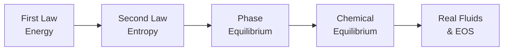

## Video Lecture

  <iframe
    width="560"
    height="315"
    src="https://www.youtube.com/embed/tGOpNey5U9E"
    title="Chemical Engineering Thermodynamics - Full Series"
    frameborder="0"
    allow="accelerometer; autoplay; clipboard-write; encrypted-media; gyroscope; picture-in-picture"
    allowfullscreen>
  </iframe>

> The whole series is available as a single video with chapter markers. Each chapter page starts this video at that chapter.

---

# Chemical Engineering Thermodynamics

**Energy, Equilibrium, and the Limits of Every Process**

Rate laws tell you how fast; thermodynamics tells you how far — and how much it will cost in energy. This course builds the thermodynamic toolkit beneath our Chemical Engineering Introduction series: the laws that set every process's energy bill, the equilibria that cap every separation and reaction, and the property models that every process simulator quietly relies on.

## Series Overview

1. **Account** — the First Law turns energy conservation into the plant's bookkeeping
2. **Limit** — the Second Law sets direction, the Carnot ceiling, and the minimum price of separation
3. **Coexist** — vapor-liquid equilibrium, Raoult's law, and the azeotropes that stop distillation
4. **React** — Gibbs energy and the equilibrium constant decide how far reactions go
5. **Compute** — real-fluid equations of state connect all of it to the simulator

## Chapters

| Chapter | Title | What You Will Learn |
|---------|-------|---------------------|
| 1 | [Energy and the First Law](chapter-1.html) | State functions, enthalpy, sensible vs latent heat, energy balances in flowsheets |
| 2 | [Entropy and the Second Law](chapter-2.html) | Direction of processes, the Carnot limit, minimum work of separation, Gibbs energy |
| 3 | [Phase Equilibrium](chapter-3.html) | Vapor pressure, Raoult's law, relative volatility, activity coefficients, azeotropes |
| 4 | [Chemical Equilibrium](chapter-4.html) | The equilibrium constant, van 't Hoff behavior, Le Chatelier, the Haber–Bosch compromise |
| 5 | [Real Fluids and Equations of State](chapter-5.html) | Compressibility, van der Waals, SRK and Peng–Robinson, choosing a property package |

## Who This Series is For

- **Students** who met unit operations and reactors in our Chemical Engineering Introduction and want the theory that governs them
- **Engineers and researchers** who use process simulators and want to understand — and distrust intelligently — the property models inside
- **Data scientists** building surrogates or soft sensors on top of simulation data, who need to know where that data's accuracy comes from

Recommended preparation: our Chemical Engineering Introduction series. Mathematics stays at algebra, logarithms, and exponentials; the few calculus expressions are explained in words.

## Related Series

This course deepens the **Chemical Engineering Introduction** series and supports the data-driven series that build on simulation: **Process Informatics Introduction**, **Digital Twin Construction Introduction**, and **Introduction to Bayesian Optimization**.
