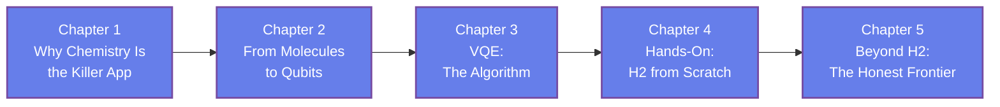

[AI Terakoya Top](<../../index.html>)›[Quantum Computing Dojo](<../index.html>)›[Quantum Chemistry with Quantum Computers](<index.html>)

🌐 EN | [🇯🇵 JP](<../../../jp/QC/quantum-chemistry-computing/index.html>) | Last sync: 2026-08-17

[← Back to Quantum Computing Dojo](<../index.html>)

## 🎯 Series Overview

The [Introduction to Quantum Computing](<../quantum-computing-introduction/index.html>) series ended with a claim it did not have room to justify: that chemistry is the most natural application of a quantum computer, and that the variational quantum eigensolver is how the near-term version of it works. This series is that justification, worked out in full. It is the third series of the Quantum Computing Dojo — a direct sequel to the introductory series, and a complement to [Quantum Computing Hardware](<../quantum-computing-hardware/index.html>), which asks the same questions one layer down, about the machines themselves.

The route runs from Feynman's argument to a running calculation. We build the electronic structure problem, put it into second-quantized form, map fermions onto qubits, assemble a variational algorithm around the resulting Pauli Hamiltonian, and then compute the potential energy curve of the hydrogen molecule from scratch — integrals, mapping, ansatz, optimizer, and all — in plain **NumPy**. There is no quantum chemistry package and no quantum SDK anywhere in the series. Every object you use, you build, which means every object you use, you can inspect.

This series is written for the **materials and chemistry-adjacent** reader: someone who works with DFT results, machine-learned potentials, or experimental materials data, and wants to know what the quantum computing conversation actually amounts to for their field. **No prior quantum chemistry background is assumed.** Second quantization, occupation number states, orbitals, and the electronic Hamiltonian are all built up from the beginning.

The final chapter is deliberately unsentimental. Having built H₂, we look at what grows when the molecule grows — qubits, Hamiltonian terms, circuit depth, and above all the measurement budget — and state the honest criterion for quantum advantage in chemistry. The overlap region between "classically hard" and "quantum-tractable today" is still empty. The aim of this series is that you finish it able to tell when it stops being empty.

### Learning Path

### 📋 Learning Objectives

  * Explain why electronic structure is the most natural application of quantum computation, and where classical methods actually struggle
  * Write the electronic Hamiltonian in second-quantized form and map it onto qubits with the Jordan–Wigner transformation
  * Describe the variational quantum eigensolver end to end — ansatz, measurement of Pauli terms, classical optimization, and the variational bound that protects the result
  * Build a complete H₂ ground-state calculation and potential energy curve in NumPy, with no quantum chemistry package involved
  * Judge claims of quantum advantage in chemistry against qubit count, active space, shot budget, and the classical baseline

### 📖 Prerequisites

The [Introduction to Quantum Computing](<../quantum-computing-introduction/index.html>) series is the intended starting point. Its **Chapter 2** (qubits, superposition, entanglement, and the Pauli operators) and **Chapter 5** (NISQ constraints and the variational quantum eigensolver) are the two you will lean on most directly — this series picks up exactly where that chapter's toy VQE left off. If you already know what a qubit, a parametrized circuit, and an expectation value are, you can begin here.

Basic **linear algebra** is assumed at the same level as the introductory series: vectors, matrices, eigenvalues and eigenvectors, complex numbers, and the tensor product. Familiarity with **Python and NumPy** is needed for the hands-on work in Chapters 4 and 5, which is written to be read line by line and is fully explained.

**No prior quantum chemistry is required.** Orbitals, occupation numbers, second quantization, creation and annihilation operators, and the molecular Hamiltonian are introduced from scratch as they become necessary. If you have taken an undergraduate quantum mechanics course you will recognize some of the machinery, but nothing here depends on that.

Chapter 1

Why Chemistry Is the Killer App

Understand Feynman's argument that quantum systems should be simulated with quantum machines, and why electronic structure is the application that follows from it. See where classical methods genuinely succeed, where strong correlation defeats them, and what "chemical accuracy" means as an engineering target rather than a slogan.

Feynman's Argument Electronic Structure Strong Correlation Chemical Accuracy Classical Baselines

⏱️ 20-25 minutes

[Read Chapter 1 →](<chapter-1.html>)

Chapter 2

From Molecules to Qubits

Learn the translation layer. Build the electronic Hamiltonian in second-quantized form with creation and annihilation operators, understand why fermionic antisymmetry is the obstacle, and see how the Jordan–Wigner transformation turns fermionic operators into Pauli strings that a quantum circuit can handle.

Second Quantization Fock Space Fermionic Operators Jordan–Wigner Pauli Hamiltonian

⏱️ 25-30 minutes

[Read Chapter 2 →](<chapter-2.html>)

Chapter 3

VQE: The Algorithm

Learn the variational quantum eigensolver as a complete algorithm rather than a slogan. See how the variational principle guarantees an upper bound, how an ansatz defines the reachable state family, how a Pauli sum is measured term by term, and how the classical optimizer closes the hybrid loop.

Variational Principle Ansatz Design Pauli Measurement Hybrid Loop Parameter-Shift Rule

⏱️ 25-30 minutes

[Read Chapter 3 →](<chapter-3.html>)

Chapter 4

Hands-On: H2 from Scratch

Build the whole calculation yourself. Assemble the H₂ Hamiltonian, map it to four qubits, reduce it using symmetry, construct an ansatz, run the optimization, and trace the potential energy curve — checking every step against exact diagonalization, in NumPy alone.

H₂ Hamiltonian Qubit Mapping Symmetry Reduction Potential Energy Curve Exact Diagonalization

💻 NumPy hands-on ⏱️ 30-35 minutes

[Read Chapter 4 →](<chapter-4.html>)

Chapter 5

Beyond H2: The Honest Frontier

Learn what breaks when the molecule grows. Compute the fourth-power growth of the Hamiltonian and the inverse-square shot budget that chemical accuracy demands, meet barren plateaus and the reductions that fight back, and apply the honest criterion for quantum advantage — the one whose overlap region is still empty.

Scaling Measurement Cost Barren Plateaus Active Spaces Quantum Phase Estimation Honest Criterion

💻 NumPy hands-on ⏱️ 25-30 minutes

[Read Chapter 5 →](<chapter-5.html>)

## 📚 Recommended Learning Paths

### Pattern 1: Beginner - Full Tour (5 days)

  * Day 1: Chapter 1 (Why chemistry, and where classical methods struggle)
  * Day 2: Chapter 2 (Second quantization and the qubit mapping)
  * Day 3: Chapter 3 (VQE as an algorithm)
  * Day 4: Chapter 4 (Build H₂ end to end)
  * Day 5: Chapter 5 (Scaling, limits, and the honest frontier) + Review

### Pattern 2: Intermediate - Fast Track (3 days)

  * Day 1: Chapters 1-2 (Motivation and the translation layer)
  * Day 2: Chapters 3-4 (The algorithm, then the working calculation)
  * Day 3: Chapter 5 (Scaling and honest assessment) + All exercises

### Pattern 3: Practitioner - Straight to the Code (1 day)

  * Skim Chapter 2 for the second-quantized Hamiltonian and the Jordan–Wigner rules
  * Read Chapter 3 carefully (the loop you are about to implement)
  * Work through Chapter 4 with the code running beside you
  * Read Chapter 5 in full before quoting any result to anyone

## 🎯 Overall Learning Outcomes

Upon completing this series, you will achieve:

### Knowledge Level

  * ✅ Explain why electronic structure suits a quantum computer, and which molecules classical methods handle badly
  * ✅ Write the molecular Hamiltonian in second-quantized form and state what each term means
  * ✅ Describe the Jordan–Wigner mapping and why fermionic antisymmetry requires it
  * ✅ Explain every stage of the VQE loop and what the variational principle does and does not guarantee

### Practical Skills

  * ✅ Build a qubit Hamiltonian and a variational ansatz in NumPy without a quantum SDK
  * ✅ Run a full VQE optimization and validate it against exact diagonalization
  * ✅ Compute a potential energy curve and identify the equilibrium bond length from it
  * ✅ Estimate the shot budget and Hamiltonian-term count for a target accuracy and basis size

### Application Ability

  * ✅ Assess whether a molecular problem is a plausible candidate for quantum simulation
  * ✅ Interpret an active space as a modelling decision rather than a technical detail
  * ✅ Evaluate a published quantum chemistry result against its classical baseline
  * ✅ Connect quantum simulation to materials informatics workflows as a data-quality question

## 🛠️ Technologies and Tools Used

### Main Libraries

  * **numpy**
  * **matplotlib**

### Development Environment

  * **Python** : 3.8 or higher
  * **Jupyter Notebook** : Interactive development and visualization
  * **IDE** : VSCode, PyCharm, or similar

### Recommended Tools

  * Google Colab (cloud-based, no setup required)
  * Anaconda Distribution (complete environment)
  * Git (version control for exercises)

## 🚀 Next Steps

### Deep Dive Learning

For more advanced study in this field:

  * Electronic Structure Theory and Coupled-Cluster Methods
  * Fermion-to-Qubit Mappings Beyond Jordan–Wigner
  * Quantum Phase Estimation and Fault-Tolerant Chemistry Algorithms

### Related Series

Expand your knowledge with related topics:

  * [Introduction to Quantum Computing](<../quantum-computing-introduction/index.html>) (the prerequisite series)
  * [Quantum Computing Hardware](<../quantum-computing-hardware/index.html>) (the machines these algorithms run on)
  * Materials Informatics series (data-driven materials discovery)

### Practical Projects

Apply your skills to hands-on projects:

  * Extend the Chapter 4 code to a second small molecule and compare with exact diagonalization
  * Build a shot-budget calculator for a given Hamiltonian and target accuracy
  * A critical review of one published quantum chemistry result using the Chapter 5 criterion

### ⚠️ Disclaimer

  * This content is provided for educational and informational purposes only and does not constitute professional advice.
  * All content and code examples are provided "AS IS" without warranty of any kind, either express or implied, including but not limited to warranties of accuracy, reliability, completeness, or fitness for a particular purpose.
  * The use of external links, data, tools, and libraries is at your own discretion and risk. The authors and contributors are not responsible for their availability, functionality, or suitability.
  * In no event shall the content creator or contributors be liable for any direct, indirect, incidental, special, exemplary, or consequential damages arising from the use of this content, to the maximum extent permitted by law.
  * Accuracy of information is not guaranteed. Content may contain errors or become outdated.
  * Content is licensed under Creative Commons BY 4.0 unless otherwise specified. Please refer to the license for usage terms.
