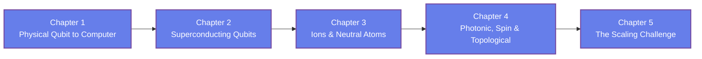

[AI Terakoya Top](<../../index.html>)›[Quantum Computing Dojo](<../index.html>)›[Quantum Computing Hardware](<index.html>)

🌐 EN | [🇯🇵 JP](<../../../jp/QC/quantum-computing-hardware/index.html>) | Last sync: 2026-08-16

[← Back to Quantum Computing Dojo](<../index.html>)

## 🎯 Series Overview

The [Introduction to Quantum Computing](<../quantum-computing-introduction/index.html>) series treated the qubit as mathematics: a normalized complex vector, acted on by unitary matrices. That abstraction is exactly right for learning algorithms, and exactly wrong for understanding why quantum computers are hard to build. This series opens the box. It asks what a physical system must actually provide before it can be called a qubit, how six different families of hardware try to provide it, and why every one of them runs into a wall somewhere.

We work through the platforms in turn — superconducting circuits, trapped ions, neutral atoms, photons, semiconductor spins, and the topological proposal — always with the same three questions: what is the qubit made of, how is it controlled and measured, and what breaks first when you try to build more of them. The final chapter steps back to the system level, where the real contest is being decided: error-correction overhead, control wiring and heat budgets, modular architectures, and how to read a benchmark without being misled by it.

This series is **qualitative by design**. You will not find device specifications, qubit counts, or vendor roadmaps here, because those numbers change faster than any written text can track and are stale before they are read. Principles do not go stale. The trade-off between gate speed and coherence, the reason a threshold exists at all, the thermodynamics of getting signals into a refrigerator — these will still be true when today's record-holders are museum pieces. Chapter 5 includes a short **NumPy** hands-on that makes the error-correction threshold concrete; no quantum computing SDK is required.

Above all, this series aims to leave you **calibrated**. When the next hardware announcement appears, you should be able to say which layer it improved, at what cost to the others, and what the number quoted in the headline does and does not mean.

### Learning Path

### 📋 Learning Objectives

  * State what a physical system must provide to serve as a qubit, and describe the full stack from that system up to a programmable machine
  * Explain how superconducting circuits create an addressable two-level system, and why they demand millikelvin temperatures and microwave control
  * Compare trapped ions and neutral atoms, and explain how connectivity, gate speed, and array reconfigurability trade against each other
  * Describe photonic, semiconductor-spin, and topological approaches, including what each buys and what each still has to prove
  * Analyse scaling as a systems problem — error-correction overhead, control wiring, modularity — and read hardware benchmarks critically

### 📖 Prerequisites

The [Introduction to Quantum Computing](<../quantum-computing-introduction/index.html>) series is the intended starting point, and its Chapter 2 (qubits, superposition, entanglement) and Chapter 5 (NISQ, noise, and error correction) are the two you will lean on most. If you already know what a qubit, a two-qubit gate, and decoherence are, you can begin here directly.

Basic linear algebra — vectors, matrices, eigenvalues, complex numbers — is assumed at the same level as the introductory series. Familiarity with Python and NumPy is needed only for the hands-on section in Chapter 5, which is short and fully explained.

No solid-state physics, quantum optics, or electrical engineering background is required. The physics of each platform is introduced as it becomes necessary, and always with the goal of explaining an engineering trade-off rather than deriving a result.

Chapter 1

From Physical Qubit to Quantum Computer

Understand what turns a piece of physics into a qubit: an isolated two-level system that can be initialized, controlled, entangled, and measured, while staying coherent long enough to be useful. Learn the DiVincenzo criteria as a checklist, see why isolation and controllability pull in opposite directions, and map the full stack from physical system to programmable machine.

Two-Level Systems DiVincenzo Criteria Coherence Control & Readout Hardware Stack

⏱️ 20-25 minutes

[Read Chapter 1 →](<chapter-1.html>)

Chapter 2

Superconducting Qubits

Learn how a superconducting circuit becomes an artificial atom: the Josephson junction supplies the nonlinearity that makes two levels addressable, microwave pulses drive the gates, and a readout resonator reports the state. Understand the transmon's design compromise, why the whole assembly lives in a dilution refrigerator, and where crosstalk and fabrication uniformity bite.

Josephson Junction Transmon Microwave Control Dispersive Readout Dilution Refrigeration

⏱️ 20-25 minutes

[Read Chapter 2 →](<chapter-2.html>)

Chapter 3

Trapped Ions and Neutral Atoms

Learn the atomic platforms, where nature supplies identical qubits for free. See how electromagnetic traps and laser cooling hold ions in place, how shared motional modes give all-to-all connectivity, and how optical tweezers and Rydberg interactions build reconfigurable neutral-atom arrays. Understand why superb fidelity comes packaged with slow gates.

Ion Traps Laser Cooling Motional Modes Optical Tweezers Rydberg Interaction

⏱️ 20-25 minutes

[Read Chapter 3 →](<chapter-3.html>)

Chapter 4

Photonic, Spin, and Topological Platforms

Learn three approaches that take very different bets. Photonic quantum computing sends qubits down waveguides at room temperature but struggles to make them interact. Semiconductor spin qubits are tiny and borrow the transistor industry's toolkit. Topological qubits aim to protect information in the hardware itself — an elegant idea that must first be demonstrated.

Photonic Qubits Measurement-Based Computing Spin Qubits Quantum Dots Topological Protection

⏱️ 20-25 minutes

[Read Chapter 4 →](<chapter-4.html>)

Chapter 5

The Scaling Challenge

Learn why more qubits alone is not progress. Work through the arithmetic of error correction — logical qubits, syndrome measurement, and the threshold — and see in NumPy why logical error falls exponentially with code distance while cost grows only polynomially. Then meet the practical limits: control wiring and heat budgets, calibration, modular architectures, and how to read a benchmark honestly.

Error Correction Threshold Surface Code Control Electronics Modularity Benchmarking

💻 NumPy hands-on ⏱️ 20-25 minutes

[Read Chapter 5 →](<chapter-5.html>)

## 📚 Recommended Learning Paths

### Pattern 1: Beginner - Full Tour (5 days)

  * Day 1: Chapter 1 (What a qubit must provide)
  * Day 2: Chapter 2 (Superconducting circuits)
  * Day 3: Chapter 3 (Ions and neutral atoms)
  * Day 4: Chapter 4 (Photonic, spin, topological)
  * Day 5: Chapter 5 (Scaling) + Review

### Pattern 2: Intermediate - Fast Track (3 days)

  * Day 1: Chapters 1-2 (Requirements and the leading solid-state platform)
  * Day 2: Chapters 3-4 (The remaining platform families)
  * Day 3: Chapter 5 (Scaling and benchmarking) + All exercises

### Pattern 3: Topic-Focused - For Readers Who Want the Big Picture (1 day)

  * Read Chapter 1 carefully (the requirements are the frame for everything else)
  * Skim Chapters 2-4 for the trade-off tables
  * Read Chapter 5 in full (error correction, wiring, modularity, benchmarks)
  * Return to individual platform chapters when a specific technology comes up

## 🎯 Overall Learning Outcomes

Upon completing this series, you will achieve:

### Knowledge Level

  * ✅ Explain what physical properties a system needs before it can serve as a qubit
  * ✅ Describe how each major platform encodes, controls, and reads out quantum information
  * ✅ Relate coherence, gate speed, and connectivity as a single set of trade-offs rather than separate specs
  * ✅ Explain the error-correction threshold and why overhead dominates the field's timeline

### Practical Skills

  * ✅ Compute threshold behaviour and error-correction overhead with a simple NumPy model
  * ✅ Identify which hardware constraint limits a given algorithm
  * ✅ Interpret randomized benchmarking and holistic metrics for what they do and do not measure
  * ✅ Follow hardware papers and technical talks without a solid-state physics background

### Application Ability

  * ✅ Judge which platform suits a given computational task and why
  * ✅ Evaluate hardware announcements against the questions that actually matter
  * ✅ Distinguish physical from logical qubits in any published claim
  * ✅ Anticipate which engineering layer is likely to limit the next generation of devices

## 🛠️ Technologies and Tools Used

### Main Libraries

  * **numpy**
  * **matplotlib**

### Development Environment

  * **Python** : 3.8 or higher
  * **Jupyter Notebook** : Interactive development and visualization
  * **IDE** : VSCode, PyCharm, or similar

### Recommended Tools

  * Google Colab (cloud-based, no setup required)
  * Anaconda Distribution (complete environment)
  * Git (version control for exercises)

## 🚀 Next Steps

### Deep Dive Learning

For more advanced study in this field:

  * Quantum Error Correction and Fault-Tolerant Architectures
  * Superconducting Circuit Quantum Electrodynamics
  * Quantum Networking and Repeaters

### Related Series

Expand your knowledge with related topics:

  * [Introduction to Quantum Computing](<../quantum-computing-introduction/index.html>) (the prerequisite series)
  * Introduction to Quantum Mechanics (Fundamentals of Mathematics Dojo)
  * Materials Informatics series (data-driven materials discovery)

### Practical Projects

Apply your skills to hands-on projects:

  * A threshold-scaling calculator for error-correction overhead
  * A platform comparison table built from primary literature
  * A critical review of one hardware announcement using the Chapter 5 checklist

### ⚠️ Disclaimer

  * This content is provided for educational and informational purposes only and does not constitute professional advice.
  * All content and code examples are provided "AS IS" without warranty of any kind, either express or implied, including but not limited to warranties of accuracy, reliability, completeness, or fitness for a particular purpose.
  * The use of external links, data, tools, and libraries is at your own discretion and risk. The authors and contributors are not responsible for their availability, functionality, or suitability.
  * In no event shall the content creator or contributors be liable for any direct, indirect, incidental, special, exemplary, or consequential damages arising from the use of this content, to the maximum extent permitted by law.
  * Accuracy of information is not guaranteed. Content may contain errors or become outdated.
  * Content is licensed under Creative Commons BY 4.0 unless otherwise specified. Please refer to the license for usage terms.
