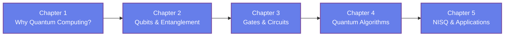

[AI Terakoya Top](<../../index.html>)›[Quantum Computing Dojo](<../index.html>)›[Introduction to Quantum Computing](<index.html>)

🌐 EN | [🇯🇵 JP](<../../../jp/QC/quantum-computing-introduction/index.html>) | Last sync: 2026-08-16

[← Back to Quantum Computing Dojo](<../index.html>)

## 🎯 Series Overview

Quantum computing has moved from a theoretical curiosity to a field with working hardware, real algorithms, and a great deal of hype surrounding both. This series is written for learners coming from materials science, chemistry, and machine learning who want to understand what quantum computers actually do — and what they do not yet do — without first completing a physics degree.

We build the subject from the ground up. Starting from why classical computers struggle with certain problems, we introduce the qubit, superposition, and entanglement as concrete linear algebra rather than as slogans. We then assemble gates into circuits, walk through the landmark algorithms, and finish in the noisy hardware of today, where variational methods such as VQE connect quantum computing to the electronic structure problems at the heart of materials research. Every chapter pairs the theory with **NumPy** code you can run immediately: a state vector is just a complex array, and a gate is just a matrix multiplication. No quantum computing SDK is required.

Above all, this series aims to leave you **calibrated**. You will be able to read a quantum computing announcement and tell which claims are established, which are plausible, and which are marketing.

### Learning Path

### 📋 Learning Objectives

  * Explain why certain problems are hard for classical computers, and what kind of structure a quantum computer can exploit
  * Represent qubits, superposition, and entanglement as vectors and matrices, and compute measurement probabilities from them
  * Build quantum circuits from elementary gates and simulate them from scratch with NumPy
  * Describe how the landmark quantum algorithms achieve their speedups, and state honestly where those speedups do and do not apply
  * Assess NISQ-era hardware and variational algorithms, and connect quantum simulation to problems in chemistry and materials science

### 📖 Prerequisites

Basic linear algebra is the one real requirement: vectors, matrices, matrix multiplication, eigenvalues, and complex numbers. Familiarity with Python and NumPy is needed for the hands-on sections, though every code example is short and fully explained.

No prior quantum mechanics is assumed — the physics is introduced as it becomes necessary. If you would like deeper background on the underlying physics, the [Introduction to Quantum Mechanics](<../../FM/quantum-mechanics/index.html>) series in the Fundamentals of Mathematics Dojo is an excellent optional companion, but this series is self-contained without it.

Chapter 1

Why Quantum Computing?

Understand the motivation behind the field: which problems resist classical computers, what the exponential scaling of quantum states means, and where the honest boundaries of quantum advantage lie. Learn the history from Feynman's proposal to today's devices, and set expectations that survive contact with the literature.

Motivation Computational Complexity Exponential Scaling History Quantum Advantage

💻 NumPy hands-on ⏱️ 20-25 minutes

[Read Chapter 1 →](<chapter-1.html>)

Chapter 2

Qubits, Superposition, and Entanglement

Learn the qubit as a normalized two-component complex vector, the Bloch sphere picture, and the Born rule for measurement. Understand what makes entanglement different from classical correlation through Bell states, and implement multi-qubit states with the tensor product in NumPy.

Qubits Superposition Bloch Sphere Measurement Entanglement Bell States

💻 NumPy hands-on ⏱️ 20-25 minutes

[Read Chapter 2 →](<chapter-2.html>)

Chapter 3

Quantum Gates and Circuits

Learn quantum gates as unitary matrices: the Pauli gates, Hadamard, phase and rotation gates, and the two-qubit CNOT. Understand why reversibility and unitarity are required, read and write circuit diagrams, and build a small circuit simulator from scratch with matrix multiplication.

Unitary Operators Pauli Gates Hadamard CNOT Circuit Diagrams Universality

💻 NumPy hands-on ⏱️ 20-25 minutes

[Read Chapter 3 →](<chapter-3.html>)

Chapter 4

Quantum Algorithms

Learn how interference turns quantum parallelism into an answer. Work through the Deutsch-Jozsa algorithm as the clearest illustration, the amplitude amplification behind Grover's search, and the role of the quantum Fourier transform in Shor's factoring algorithm — with a clear statement of which speedups are proven and which are conditional.

Deutsch-Jozsa Grover Search Amplitude Amplification Quantum Fourier Transform Shor's Algorithm

💻 NumPy hands-on ⏱️ 20-25 minutes

[Read Chapter 4 →](<chapter-4.html>)

Chapter 5

NISQ Era and Applications to Chemistry and Materials

Learn what today's noisy hardware can actually do. Compare superconducting, trapped-ion, photonic, and neutral-atom platforms, understand decoherence and the idea of quantum error correction, and implement a hybrid variational eigensolver (VQE) in NumPy that converges to the exact ground-state energy. Connect quantum simulation to electronic structure and materials informatics.

NISQ Hardware Modalities Error Correction VQE QAOA Quantum Chemistry

💻 NumPy hands-on ⏱️ 20-25 minutes

[Read Chapter 5 →](<chapter-5.html>)

## 📚 Recommended Learning Paths

### Pattern 1: Beginner - Theory and Practice Balanced (5 days)

  * Day 1: Chapter 1 (Motivation and context)
  * Day 2: Chapter 2 (Qubits and entanglement)
  * Day 3: Chapter 3 (Gates and circuits)
  * Day 4: Chapter 4 (Algorithms)
  * Day 5: Chapter 5 (NISQ and applications) + Review

### Pattern 2: Intermediate - Fast Track (3 days)

  * Day 1: Chapters 1-2 (Motivation, qubits, entanglement)
  * Day 2: Chapters 3-4 (Circuits and algorithms)
  * Day 3: Chapter 5 (NISQ and applications) + All exercises

### Pattern 3: Topic-Focused - For Materials and Chemistry Readers (1 day)

  * Skim Chapter 1 for context
  * Read Chapter 2 carefully (the state vector is the key object)
  * Read Chapter 5 in full (VQE, hardware reality, applications)
  * Return to Chapters 3-4 when you need the algorithmic details

## 🎯 Overall Learning Outcomes

Upon completing this series, you will achieve:

### Knowledge Level

  * ✅ Describe qubits, superposition, entanglement, and measurement in precise linear-algebra terms
  * ✅ Explain how quantum algorithms use interference, and where their advantages come from
  * ✅ Distinguish physical qubits from logical qubits, and noise from error correction
  * ✅ Connect quantum simulation to the electronic structure problems of chemistry and materials

### Practical Skills

  * ✅ Simulate quantum states and circuits from scratch with NumPy
  * ✅ Implement a hybrid quantum-classical variational loop
  * ✅ Verify quantum results against exact diagonalization
  * ✅ Read and reason about quantum circuit diagrams

### Application Ability

  * ✅ Judge whether a given problem is a plausible quantum computing target
  * ✅ Evaluate quantum computing claims against classical baselines
  * ✅ Relate variational quantum methods to optimization workflows in materials informatics
  * ✅ Choose sensible next steps for deeper study or for using quantum SDKs

## 🛠️ Technologies and Tools Used

### Main Libraries

  * **numpy**
  * **matplotlib**

### Development Environment

  * **Python** : 3.8 or higher
  * **Jupyter Notebook** : Interactive development and visualization
  * **IDE** : VSCode, PyCharm, or similar

### Recommended Tools

  * Google Colab (cloud-based, no setup required)
  * Anaconda Distribution (complete environment)
  * Git (version control for exercises)

## 🚀 Next Steps

### Deep Dive Learning

For more advanced study in this field:

  * Quantum Error Correction
  * Quantum Information Theory
  * Quantum Machine Learning

### Related Series

Expand your knowledge with related topics:

  * Introduction to Quantum Mechanics (Fundamentals of Mathematics Dojo)
  * Materials Informatics series (data-driven materials discovery)

### Practical Projects

Apply your skills to hands-on projects:

  * A NumPy quantum circuit simulator
  * Grover search on a small database
  * VQE potential energy curve for a two-level model

### ⚠️ Disclaimer

  * This content is provided for educational and informational purposes only and does not constitute professional advice.
  * All content and code examples are provided "AS IS" without warranty of any kind, either express or implied, including but not limited to warranties of accuracy, reliability, completeness, or fitness for a particular purpose.
  * The use of external links, data, tools, and libraries is at your own discretion and risk. The authors and contributors are not responsible for their availability, functionality, or suitability.
  * In no event shall the content creator or contributors be liable for any direct, indirect, incidental, special, exemplary, or consequential damages arising from the use of this content, to the maximum extent permitted by law.
  * Accuracy of information is not guaranteed. Content may contain errors or become outdated.
  * Content is licensed under Creative Commons BY 4.0 unless otherwise specified. Please refer to the license for usage terms.
