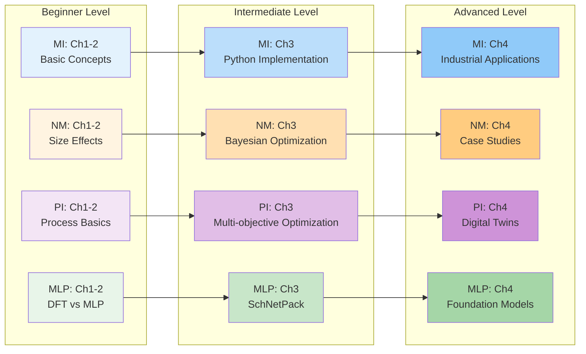

# AI Terakoya - English Knowledge Hub

**Comprehensive Learning Platform for Materials Science & Data Science**

---

## 🏫 Welcome to AI Terakoya

"Terakoya" were educational institutions for common people during Japan's Edo period. The modern "AI Terakoya" is a comprehensive learning platform bridging materials science, data science, mathematics, and physics.

**Features of AI Terakoya:**
- ✅ **5 Specialized Dojos**: 109 series across FM, MI, ML, MS, and PI domains
- ✅ **480 Comprehensive Chapters**: Systematic progression from fundamentals to advanced topics
- ✅ **1500+ Code Examples**: All executable with detailed explanations
- ✅ **Industry Applications**: 100+ real-world case studies
- ✅ **Complete Curriculum**: From mathematical foundations to industrial deployment

**Platform Statistics:**
- 📚 109 Learning Series
- 📖 480 Complete Chapters
- 💻 1500+ Python Code Examples
- 🎯 5 Specialized Learning Domains

---

## 🎓 Five Learning Dojos

### 📘 Materials Informatics (MI) Introduction

**Materials Informatics Introduction Series**

Foundational series for learning AI/machine learning applications across materials science

**Overview**:
- 🎯 **Target Areas**: Materials discovery, property prediction, database utilization
- 📊 **Difficulty**: Beginner to Advanced
- ⏱️ **Learning Time**: 90-120 minutes (4 chapters)
- 💻 **Code Examples**: 35 (all executable)
- 🔬 **Applications**: Li-ion batteries, catalysts, high-entropy alloys, perovskite solar cells

**Key Learning Content**:
1. History of materials development and limitations of traditional methods
2. Utilization of major databases like Materials Project
3. Implementation of 6 machine learning models (Linear Regression, Random Forest, LightGBM, SVR, MLP, API integration)
4. Feature engineering with Matminer
5. Hyperparameter tuning (Grid/Random Search)
6. 5 industrial case studies

**Tools Used**:
- Python: scikit-learn, matminer, pandas, numpy
- Databases: Materials Project API
- Visualization: matplotlib, seaborn

**[📘 Go to MI Dojo →](./MI/index.html)**

---

### 📐 Fundamentals of Mathematics & Physics (FM) Dojo

**Mathematical and Physical Foundations for Materials Science**

Complete curriculum covering calculus, linear algebra, quantum mechanics, statistical mechanics, and more.

**Overview**:
- 🎯 **Target Areas**: Mathematics, Physics, Quantum Theory, Statistical Mechanics
- 📊 **Difficulty**: Beginner to Advanced
- 📚 **Series Count**: 14 comprehensive series
- 💻 **Code Examples**: 200+ Python implementations
- 🔬 **Applications**: Quantum simulations, statistical analysis, vector calculus

**Key Topics**:
1. Calculus & Vector Analysis
2. Linear Algebra & Matrix Theory
3. Probability & Stochastic Processes
4. Quantum Mechanics (5 chapters)
5. Classical & Quantum Statistical Mechanics
6. Quantum Field Theory Introduction
7. Equilibrium Thermodynamics

**[📐 Go to FM Dojo →](./FM/index.html)**

---

### 🤖 Machine Learning (ML) Dojo

**Comprehensive Machine Learning Curriculum**

Complete ML education from fundamentals to advanced topics including deep learning, NLP, computer vision, and specialized techniques.

**Overview**:
- 🎯 **Target Areas**: ML Algorithms, Deep Learning, NLP, Computer Vision, Time Series
- 📊 **Difficulty**: Beginner to Expert
- 📚 **Series Count**: 31 comprehensive series
- 💻 **Code Examples**: 500+ implementations
- 🔬 **Applications**: Image classification, NLP, recommendation systems, anomaly detection

**Key Topics**:
1. ML Fundamentals & Mathematics
2. CNN, RNN, Transformer Architectures
3. Natural Language Processing
4. Computer Vision & Object Detection
5. Time Series Analysis
6. Reinforcement Learning
7. Generative Models (VAE, GAN, Diffusion)
8. Graph Neural Networks
9. Model Interpretability (SHAP, LIME)
10. MLOps & Deployment

**[🤖 Go to ML Dojo →](./ML/index.html)**

---

### ⚗️ Materials Science (MS) Dojo

**Complete Materials Science & Engineering Curriculum**

Comprehensive coverage of materials characterization, processing, properties, and advanced materials systems.

**Overview**:
- 🎯 **Target Areas**: Materials Characterization, Processing, Properties, Advanced Materials
- 📊 **Difficulty**: Beginner to Advanced
- 📚 **Series Count**: 20 comprehensive series
- 💻 **Code Examples**: 400+ Python implementations
- 🔬 **Applications**: XRD analysis, spectroscopy, mechanical testing, 3D printing

**Key Topics**:
1. Crystallography & XRD Analysis
2. Electron Microscopy (SEM, TEM)
3. Spectroscopy (IR, Raman, UV-Vis, XPS)
4. Mechanical Testing
5. Materials Processing & Heat Treatment
6. Metallic, Ceramic, Polymer Materials
7. Composite Materials
8. 3D Printing & Additive Manufacturing
9. Thin Film & Nanotechnology
10. Materials Thermodynamics

**[⚗️ Go to MS Dojo →](./MS/index.html)**

---

### 📙 Process Informatics (PI) Dojo

**Data-Driven Process Optimization & Control**

Complete curriculum for chemical and manufacturing process optimization using data science and machine learning.

**Overview**:
- 🎯 **Target Areas**: Process Optimization, Quality Control, Digital Twins, Scale-up
- 📊 **Difficulty**: Beginner to Advanced
- 📚 **Series Count**: 20 comprehensive series
- 💻 **Code Examples**: 300+ implementations
- 🔬 **Applications**: Chemical plants, pharmaceuticals, semiconductors, food processing

**Key Topics**:
1. Process Data Analysis & Monitoring
2. Process Control Fundamentals
3. Process Optimization Methods
4. Design of Experiments (DOE)
5. Bayesian Optimization
6. Digital Twin Development
7. Quality Assurance & Control
8. Scale-up Strategies
9. AI Agents for Process Control
10. Industry-Specific Applications (Chemical, Pharma, Semiconductor, Food)

**[📙 Go to PI Dojo →](./PI/index.html)**

**Tools Used**:
- Python: PyTorch, SchNetPack, ASE
- Data: MD17 dataset
- Visualization: matplotlib, TensorBoard

**[📕 Go to MLP Introduction Series →](./mlp-introduction/index.html)**

---

## 🗺️ Recommended Learning Paths

### Which Series is Right for You?

```mermaid
graph TD
    Start[Start Learning<br/>What interests you?] --> Q1{Materials or Process?}

    Q1 -->|Materials Development| Q2{Size Scale?}
    Q1 -->|Chemical Process Optimization| PI[📙 PI Introduction<br/>Process Informatics]

    Q2 -->|Nanoscale<br/>1-100 nm| NM[📗 NM Introduction<br/>Nanomaterials]
    Q2 -->|General Materials<br/>Database Utilization| MI[📘 MI Introduction<br/>Materials Informatics]
    Q2 -->|Molecular Level<br/>Simulation| MLP[📕 MLP Introduction<br/>Machine Learning Potentials]

    MI --> Next[Next Steps]
    NM --> Next
    PI --> Next
    MLP --> Next

    Next --> Advanced[Deepen Your Knowledge:<br/>Complete Other Series]

    style Start fill:#e3f2fd
    style Q1 fill:#fff3e0
    style Q2 fill:#f3e5f5
    style MI fill:#e3f2fd
    style NM fill:#fff4e1
    style PI fill:#f3e5f5
    style MLP fill:#e8f5e9
    style Next fill:#ffebee
    style Advanced fill:#f3e5f5
```



### Learning Roadmap

#### 🎓 For Beginners (2-4 Week Plan)

**Week 1-2: Foundation Building**
1. **Complete MI Introduction** (90-120 minutes)
   - Understand materials science × machine learning basics
   - Set up Python coding environment
   - Master Materials Project API usage

**Week 3: Choose Application Area**
2. Select one based on your interests:
   - **NM Introduction**: Interested in nanotech → Nanoparticles, graphene
   - **PI Introduction**: Interested in chemical engineering → Process optimization
   - **MLP Introduction**: Interested in computational chemistry → Molecular simulation

**Week 4: Horizontal Expansion**
3. Choose 1-2 remaining series of interest
4. Focus on Chapter 4 (Real-World Applications) of each series

**Deliverables**:
- 4-6 Python projects (GitHub portfolio)
- Personal career roadmap (3 months/1 year/3 years)

---

#### 🚀 For Experienced Learners (1-2 Week Plan)

**Prerequisites**: Python, machine learning basics, materials science or chemical engineering fundamentals

**Day 1-2: Rapid Learning Mode**
- Skim Chapter 2 (Foundational Knowledge) of each series
- Focus on MI-specific concepts (descriptors, databases)

**Day 3-5: Intensive Practice**
- Fully implement Chapter 3 (Hands-On) of series of interest
- Execute all code examples and verify behavior with parameter changes

**Day 6-7: Applications and Career Design**
- Thoroughly read Chapter 4 (Real-World Applications) of each series
- Concretize applications to your research/work
- Plan next steps (papers, projects, conferences)

**Deliverables**:
- Advanced implementation projects (with hyperparameter tuning)
- Application plan for real work

---

#### 🎯 Targeted Learning (Flexible)

**For those seeking specific skills or knowledge**

**Master database utilization**:
- MI Introduction → Chapter 2 (Database comparison) + Chapter 3 (Materials Project API)

**Master Bayesian optimization**:
- NM Introduction → Chapter 3 (Bayesian optimization implementation)
- PI Introduction → Chapter 3 (Reaction condition optimization)
- MLP Introduction → Chapter 2 (Active Learning)

**Learn industrial applications**:
- Cross-sectional study of Chapter 4 across all series
- Choose from 20+ case studies closest to your industry

**Career planning**:
- Compare Chapter 4 (Career Paths) across all series
- Understand differences between academia vs. industry vs. startups

---

## 📊 Series Comparison Table

| Series | Target Area | Difficulty | Learning Time | Code Examples | Prerequisites | Key Tools | Industrial Applications |
|--------|------------|-----------|--------------|---------------|---------------|-----------|------------------------|
| **📘 MI** | General Materials | Beginner-Advanced | 90-120 min | 35 | High school math, Python basics | scikit-learn, matminer, Materials Project | Li-ion batteries, catalysts, high-entropy alloys |
| **📗 NM** | Nanomaterials | Beginner-Intermediate | 90-120 min | 30-35 | University physics/chemistry | pandas, LightGBM, scikit-optimize | CNT composites, quantum dots, nanomedicine |
| **📙 PI** | Chemical Processes | Beginner-Advanced | 90-120 min | 35 | Chemical engineering basics | scikit-learn, Prophet, scipy | Petrochemicals, pharmaceuticals, bioprocesses |
| **📕 MLP** | Molecular Simulation | Beginner-Advanced | 85-100 min | 15 | Quantum chemistry basics | PyTorch, SchNetPack, ASE | Drug discovery, catalyst design, materials design |

### Difficulty × Application Area Matrix



---

## 🌐 Shared Learning Resources

### Online Courses

- **Coursera**:
  - "Materials Data Sciences and Informatics" (Georgia Tech)
  - "Machine Learning for Materials Science" (Imperial College London)
- **edX**:
  - "Introduction to Computational Materials Science" (MIT)
- **Udemy**:
  - "Python for Materials Science" (various courses)

### Key Textbooks

1. **Rajan, K.** (2013). *Materials Informatics*. Materials Today.
2. **Lookman, T., et al.** (2018). *Information Science for Materials Discovery and Design*. Springer. [DOI: 10.1007/978-3-319-23871-5](https://doi.org/10.1007/978-3-319-23871-5)
3. **Behler, J.** (2016). *Perspective: Machine learning potentials for atomistic simulations*. J. Chem. Phys. [DOI: 10.1063/1.4966192](https://doi.org/10.1063/1.4966192)
4. **Cao, G. & Wang, Y.** (2011). *Nanostructures and Nanomaterials*. World Scientific.
5. **Seborg, D. E., et al.** (2016). *Process Dynamics and Control* (4th ed.). Wiley.

### Major Databases & Tools

**Materials Databases**:
- [Materials Project](https://materialsproject.org) - 140k+ materials, DFT calculations
- [AFLOW](http://aflowlib.org) - Crystal structure focused, 3.5M structures
- [OQMD](http://oqmd.org) - Quantum calculations, 815k materials
- [NOMAD](https://nomad-lab.eu) - Large-scale DFT database

**Python Libraries**:
- [pymatgen](https://pymatgen.org) - Foundational library for materials analysis
- [matminer](https://hackingmaterials.lbl.gov/matminer/) - Feature engineering
- [SchNetPack](https://github.com/atomistic-machine-learning/schnetpack) - Machine learning potentials
- [ASE](https://wiki.fysik.dtu.dk/ase/) - Atomic Simulation Environment

**Visualization Tools**:
- matplotlib, seaborn, plotly
- TensorBoard (training visualization)
- VESTA (crystal structure visualization)

### Communities

**Japan**:
- Japan Society of Materials Science (JSMS)
- Materials Research Society - Japan (MRS-J)
- Society of Chemical Engineers, Japan (SCEJ)
- Japan Society of Computational Chemistry
- Molecular Science Society of Japan

**International**:
- Materials Research Society (MRS)
- American Institute of Chemical Engineers (AIChE)
- American Chemical Society (ACS)
- European Materials Research Society (E-MRS)
- CECAM (Computational Molecular Science)
- MolSSI (Molecular Sciences Software Institute)

### Major Conferences

- **MRS Fall/Spring Meeting** (General materials science)
- **E-MRS** (European materials science)
- **SCEJ Annual Meeting** (Chemical Engineering Society of Japan)
- **ACS National Meeting** (American Chemical Society)
- **PSE (Process Systems Engineering)** (Process systems engineering)
- **Annual Meeting of Japan Society of Computational Chemistry**

---

## ❓ FAQ (Frequently Asked Questions)

### Q1: Which series should I start with?

**A**: **Choose based on your background and interests**:

- **Materials science background** → Start with MI Introduction (most general)
- **Interested in nanotechnology** → Start with NM Introduction
- **Chemical engineering/process engineer** → Start with PI Introduction
- **Computational chemistry/molecular simulation experience** → Start with MLP Introduction

**For complete beginners, MI Introduction is strongly recommended**. You'll learn database utilization methods like Materials Project, which forms the foundation for other series.

---

### Q2: Can I study multiple series in parallel?

**A**: **Possible, but not recommended**. Reasons:

- Each series is designed for 90-120 minutes of focused learning
- Mixing concepts can lead to shallow understanding
- Sufficient time needed for practice (coding)

**Recommended approach**:
1. Fully master one series first (1-2 weeks)
2. Publish as portfolio on GitHub
3. Move to next series
4. Aim to complete all series in 2-4 weeks total

---

### Q3: Can Python beginners learn from these series?

**A**: **Yes, if you understand basic syntax**:

**Required skills**:
- Variables, data types (int, float, str, list, dict)
- Function definition and calling
- Loops (for, while) and conditionals (if/else)
- Library installation and import

**Recommended pre-learning** (if no Python experience):
1. [Python Official Tutorial](https://docs.python.org/3/tutorial/) (Chapters 1-4, 5-10 hours)
2. [Codecademy Python Course](https://www.codecademy.com/learn/learn-python-3) (free trial)
3. Write 5-10 simple Python programs

**Chapter 3 of each series includes detailed code comments designed for beginner comprehension.**

---

### Q4: How is this applied in industry?

**A**: **Detailed case studies in Chapter 4 of each series**. Major applications:

**MI Applications**:
- Tesla/Panasonic: Li-ion battery material optimization (+20% capacity, 67% shorter development)
- Toyota: Pt-free catalyst development (80% cost reduction, 120% activity)
- Boeing/Airbus: High-entropy alloys (20% weight reduction)

**NM Applications**:
- Mitsubishi Chemical: CNT composite materials (35% strength improvement, 60% shorter development)
- Samsung: Quantum dot displays (25% wider color gamut)
- Pfizer: Nanomedicine drug delivery (50% fewer side effects)

**PI Applications**:
- Mitsubishi Chemical: Catalytic process optimization (yield 70%→85%, +2 billion yen annual revenue)
- Asahi Kasei: Polymerization reaction control (defect rate 5%→1%, -500 million yen/year waste)
- Takeda Pharmaceutical: Drug batch process (FDA inspection pass first time, 3 months earlier market entry)

**MLP Applications**:
- MIT/SLAC: Cu catalyst CO₂ reduction (reaction pathway elucidation, 50,000× speedup)
- Schrödinger/Pfizer: Protein folding (50% shorter drug development)
- NIMS: GaN semiconductor crystal growth (90% defect reduction, 30% cost reduction)

**ROI (Return on Investment) examples**:
- Development time reduction: 50-90% decrease
- Cost reduction: 30-80%
- Performance improvement: 20-120%
- Initial investment payback: 1-3 years

---

### Q5: What are career paths after learning?

**A**: **Three major paths**:

#### Path 1: Academia (Researcher)
- **Route**: Bachelor → Master → PhD (3-5 years) → Postdoc (2-3 years) → Associate Professor
- **Salary**: ¥5-12M annually (Japan), $60-120K (US)
- **Skills**: Python, machine learning, domain expertise (materials/chemistry/physics), paper writing
- **Example Institutions**: University of Tokyo, Kyoto University, Tohoku University, MIT, Stanford, Cambridge

#### Path 2: Industrial R&D
- **Positions**: Data Scientist, MI Engineer, Computational Chemist, Process Engineer
- **Salary**: ¥7-15M annually (Japan), $70-200K (US)
- **Example Companies**: Mitsubishi Chemical, Panasonic, Toyota, Asahi Kasei, Sumitomo Chemical, Tesla, IBM Research, Schrödinger
- **Skills**: Python, machine learning, domain knowledge, teamwork, business understanding

#### Path 3: Startup/Consulting
- **Examples**: Citrine Informatics (funding $80M), Kebotix, Matmerize, Chemify, QuantumBlack
- **Salary**: ¥5-10M annually + stock options
- **Risk/Return**: High risk, high return, high impact
- **Required Skills**: Technical + business + leadership + entrepreneurship

**Chapter 4 of each series details specific career paths, salary data, required skills, and learning timelines.**

---

### Q6: What code execution environment is needed?

**A**: **Three options**:

#### Option 1: Anaconda (Recommended for beginners)
- GUI included, easy environment management
- Windows/macOS/Linux support
- Ready to use immediately after installation

#### Option 2: venv (Python standard)
- Lightweight, built into Python
- Create environment with `python -m venv env`
- Simple, suitable for learning

#### Option 3: Google Colab (Most convenient)
- **No installation required, works in browser only**
- Free GPU available (T4, sufficient for learning)
- All series code examples verified on Colab

**Recommendation**: Start with Google Colab, migrate to Anaconda for serious learning.

**GPU necessity**:
- MI/NM/PI: CPU sufficient (training time minutes to tens of minutes)
- MLP: GPU strongly recommended (10-100× training time reduction)

---

### Q7: How independent are the series?

**A**: **Each series can be studied independently**, but some common concepts exist:

**Common concepts** (appear in all series):
- Machine learning basics (regression, classification, optimization)
- Basic Python libraries (numpy, pandas, matplotlib)
- Data preprocessing, feature engineering
- Model evaluation (MAE, R², cross-validation)

**Series-specific concepts**:
- **MI**: Material descriptors, Materials Project API, crystal structures
- **NM**: Size effects, quantum confinement, nanoparticle synthesis
- **PI**: Process parameters, time series analysis, multi-objective optimization
- **MLP**: Potential energy surfaces, DFT, symmetry functions, graph neural networks

**Interrelationships**:
```
MI (Foundation) → NM (Application 1)
                → PI (Application 2)
                → MLP (Application 3)
```

**Learning MI first makes understanding other series 30-40% faster.**

---

### Q8: Is commercial use permitted?

**A**: **Depends on libraries and data**:

#### ✅ Commercial use allowed (MIT License):
- **Libraries**: scikit-learn, PyTorch, SchNetPack, NequIP, MACE, pandas, numpy
- **Own data**: Self-generated DFT calculation data, experimental data
- **Open source tools**: matminer, ASE, pymatgen

#### ⚠️ Requires verification (possibly academic use only):
- **Public datasets**: MD17 (academic use only), some Materials Project data
- **Commercial software**: Materials Studio, Schrödinger (separate license)

#### 📌 When considering corporate use:
1. Check dataset licenses
2. Train models with company data (safest)
3. Verify open source library commercial use terms
4. Consult legal department

**Each series FAQ provides detailed license information.**

---

### Q9: What are update plans for the series?

**A**: **Continuous improvement and expansion planned**:

**Short-term (1-3 months)**:
- Bug fixes, typo corrections
- Additional code examples (community requests)
- New case studies

**Medium-term (3-6 months)**:
- Consider new series:
  - Chemoinformatics (CI) Introduction
  - Bioinformatics (BI) Introduction
  - Data-Driven Materials Design (DDMD) Introduction
- Interactive Jupyter Notebook versions
- Video tutorials

**Long-term (6-12 months)**:
- Learning platform development (progress tracking features)
- Community forum
- Certification program

**Feedback welcome**! Please submit requests for new topics or improvement suggestions via GitHub repository Issues or email (yusuke.hashimoto.b8@tohoku.ac.jp).

---

## 🚀 Next Steps

### Recommended Actions After Completing Series

#### Immediate (Within 1-2 weeks)

1. ✅ **Create GitHub/GitLab portfolio**
   - Publish code implemented in each series with README
   - Include datasets, result visualizations, analysis
   - Examples: "MI-battery-optimization", "MLP-catalyst-simulation"

2. ✅ **Update LinkedIn profile**
   - Add skills: "Materials Informatics", "Machine Learning", "Python", "PyTorch"
   - Add projects: with GitHub links

3. ✅ **Share learning record on blog/Qiita**
   - Output what you learned
   - Get feedback from community

#### Short-term (1-3 months)

1. ✅ **Participate in Kaggle competitions**
   - Materials science competitions: "Predicting Molecular Properties", "Materials Discovery"
   - Improve practical data science skills

2. ✅ **Present at domestic conferences**
   - JSMS, SCEJ, Computational Chemistry Society
   - Start with poster presentations (lower barrier)

3. ✅ **Execute independent project**
   - Apply MI/NM/PI/MLP to your research theme
   - Combine experimental data + machine learning

4. ✅ **Contribute to open source**
   - Bug reports/feature additions for pymatgen, matminer, SchNetPack
   - Documentation translation (Japanese localization)

#### Medium-term (3-6 months)

1. ✅ **Read 10 papers thoroughly**
   - *Nature Materials*, *Advanced Materials*, *npj Computational Materials*
   - *J. Chem. Phys.*, *JCTC*, *Computers & Chemical Engineering*

2. ✅ **Internship/collaborative research**
   - Companies: Mitsubishi Chemical, Toyota, Panasonic, etc.
   - Research institutions: NIMS, AIST

3. ✅ **Oral presentation at domestic conference**
   - More advanced than poster, deeper discussion through Q&A

#### Long-term (1+ years)

1. ✅ **Present at international conferences**
   - MRS Fall/Spring Meeting, E-MRS, ACS, PSE
   - English presentations, networking

2. ✅ **Submit peer-reviewed paper**
   - *npj Computational Materials* (open access)
   - *J. Chem. Phys.*, *Ind. Eng. Chem. Res.*

3. ✅ **Career transition**
   - Academia: PhD program, postdoc, assistant professor
   - Industry: Data scientist, MI engineer
   - Startup: Founding, joining

4. ✅ **Next generation development**
   - Organize study groups/workshops
   - Mentor junior colleagues
   - Contribute to community

---

## 📞 Feedback and Support

### About AI Terakoya

This platform was created as part of the MI Knowledge Hub project under **Dr. Yusuke Hashimoto, Institute of Multidisciplinary Research for Advanced Materials, Tohoku University**.

**Philosophy**:
- Provide accessible convergence of data science and materials science
- Educational content balancing theory and practice
- Open learning community formation

**Created**: October 17, 2025
**Version**: 1.0
**Total Content**: 16 chapters, 115 code examples, 20 case studies

### We Welcome Your Feedback

To improve this platform, we await your feedback:

- **Typos/technical errors**: Report on [GitHub repository Issues](https://github.com/YusukeHashimotoPhD/AI-Terakoya)
- **Improvement suggestions**: New series, topics to add, code examples
- **Questions**: Parts that were difficult to understand, sections needing more explanation
- **Success stories**: Projects, papers, products using what you learned at AI Terakoya

**Contact**:
📧 Email: yusuke.hashimoto.b8@tohoku.ac.jp
🐙 GitHub: [@YusukeHashimotoPhD](https://github.com/YusukeHashimotoPhD)
🔗 LinkedIn: [Dr. Yusuke Hashimoto](https://www.linkedin.com/in/yusuke-hashimoto-materials)

### Join the Community

**Japanese Community**:
- [JSMS MI Forum](https://jsms.jp)
- [Computational Chemistry Society ML Division](https://www.comp-chem.jp)
- [MI Study Group Slack](https://mi-study-group.slack.com) (Participation link: apply via email)

**International Community**:
- [Materials Project Forum](https://matsci.org)
- [MolSSI Discussion](https://molssi.org)
- [CECAM Community](https://www.cecam.org)

---

## 📜 License and Terms of Use

All content on this platform is published under **CC BY 4.0** (Creative Commons Attribution 4.0 International) license.

### What You Can Do

✅ **Free viewing and downloading**
✅ **Educational use** (university classes, corporate training, study groups, etc.)
✅ **Modification and derivative works** (translation, summarization, slide creation, etc.)
✅ **Research and development use** (papers, projects, product development)

### Conditions

📌 **Author credit required**
📌 **Note modifications if made**
📌 **Contact before commercial use** (no contact needed for free provision)

### Citation Methods

**In papers**:
```
Hashimoto, Y. (2025). AI Terakoya - Materials Informatics Knowledge Hub.
Tohoku University. https://yusukehashimotolab.github.io/wp/knowledge/
```

**BibTeX**:
```bibtex
@misc{hashimoto2025aiterakoya,
  author = {Hashimoto, Yusuke},
  title = {AI Terakoya - Materials Informatics Knowledge Hub},
  year = {2025},
  publisher = {Tohoku University},
  url = {https://yusukehashimotolab.github.io/wp/knowledge/}
}
```

**On websites/blogs**:
```
Source: AI Terakoya - Materials Informatics Knowledge Hub (Dr. Yusuke Hashimoto, Tohoku University)
https://yusukehashimotolab.github.io/wp/knowledge/
```

Details: [Full CC BY 4.0 License](https://creativecommons.org/licenses/by/4.0/)

---

## 🎓 Let's Start Learning!

Are you ready? Choose the series that suits you best and begin your journey into the world of data-driven materials development!

### Recommended Starting Points

**🔰 Complete Beginners** → Start with [📘 MI Introduction Series](./mi-introduction/index.html)
**⚗️ Nanotech Interest** → Start with [📗 NM Introduction Series](./nm-introduction/index.html)
**🏭 Chemical Engineering Background** → Start with [📙 PI Introduction Series](./pi-introduction/index.html)
**🧪 Computational Chemistry Experience** → Start with [📕 MLP Introduction Series](./mlp-introduction/index.html)

---

**Update History**

- **2025-10-17**: v1.0 AI Terakoya portal published (4 series integration)

---

<div style="text-align: center; font-size: 1.2em; margin-top: 3rem;">
<strong>Your MI learning journey begins here!</strong><br/>
<em>Welcome to the future of data-driven materials development.</em>
</div>
