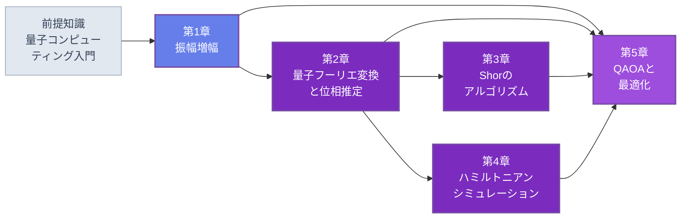

🌐 JP | [🇬🇧 EN](<../../../en/FM/quantum-algorithms-intermediate/index.html>) | Last sync: 2026-08-13

[AI寺子屋トップ](<../../index.html>)›[基礎数理道場](<../index.html>)›[量子アルゴリズム（中級）](<index.html>)

[← 基礎数理道場トップ](<../index.html>)

## 🎯 シリーズ概要

本シリーズは[量子コンピューティング入門](<../quantum-computing-introduction/index.html>)の続編です。あちらのコースは、1量子ビットから分子の基底状態の変分計算までを最短の誠実な経路でたどり、そして何を省いたかを明言していました。Groverのアルゴリズム、量子フーリエ変換、位相推定、Shorのアルゴリズム、現代的なハミルトニアンシミュレーション手法、QAOA — これらはすべて、書かれることのなかった目次の項目名として登場しただけでした。本コースがそれを書きます。

貫く問いは副題に掲げたとおりです。量子アルゴリズムは通常、高速化の一覧として提示されますが、その一覧は誤解を招きます。高速化が同じ種類のものではないからです。Groverの二次高速化は証明可能かつ最適であり、同時に、定数倍・クロック速度・エラー訂正のオーバーヘッドで丸ごと食われてしまう程度に小さいものでもあります。Shorの高速化は超多項式的であり、そして非常に特殊な代数的構造をもつ1つの問題にのみ適用されます。qubitizationを伴う位相推定は、材料研究者が実際に抱えている問題 — 多体ハミルトニアンの固有値 — において証明可能な優位を与えます。QAOAには証明された優位が一切ありません。これらを同一の一覧の5項目として並べることが、通俗的な解説の中心的な不誠実さであり、本コースはそれを犯しません。すなわち、**この5章に登場するすべての高速化は、それが必要とする仮定とともに述べられ、その仮定は検証されます。**

第2の約束は、**すべてが実行される**ことです。入門コースは99行のNumPyで状態ベクトルシミュレータを作りました。本コースのすべてのアルゴリズムはその同じシミュレータ上に実装されます。10量子ビットのGroverから、15と21のエンドツーエンドの因数分解まで。SDKもハードウェアバックエンドもなく、再現して分解できない結果は1つもありません。実行するには大きすぎるもの — 産業的に意味のあるハミルトニアンのリソース見積り — については、引用するのではなく式から計算します。

### 学習パス

第1章は自己完結しており、最初に読んでも最後に読んでも構いません。最初に置いたのは、そこで導入するオラクルモデルと誠実な会計が、以降のすべての章で使われるからです。第2章が構造上の要です。第3章はその位相推定の実装なしには読めず、第4章のブロック符号化も同じ制御ユニタリの機構の上に建てられます。第5章は4章すべてを前提とします。最後の節がこの分野全体の地図だからです。

### 📋 学習目標

本シリーズを修了すると、以下のことができるようになります。

  * オラクル（クエリ）モデルを厳密に述べ、オラクルに基づく高速化の主張について、そのオラクルが何で組み立てられ、それにいくら掛かるかを言える
  * Groverのアルゴリズムを2次元部分空間の回転として導き、最適反復数を計算し、任意の状態準備のまわりの振幅増幅へ一般化できる
  * 量子フーリエ変換を $O(n^2)$ ゲートで構成し、その出力振幅が読み出せない理由を説明し、教科書的な位相推定と反復的位相推定の両方を実装できる
  * Shorのアルゴリズムをエンドツーエンドで実装し — 位数発見、連分数による後処理、古典的な還元 — フーリエ変換ではなくモジュラー指数演算が費用の本体である理由を説明できる
  * Trotter分解、ブロック符号化、qubitization、qDRIFTを説明し、それぞれが達成するクエリ計算量を述べられる
  * 組合せ最適化問題をIsing模型として定式化し、QAOAを走らせ、同予算で古典ヒューリスティクスと比較できる
  * 出会った任意の量子アルゴリズムについて、それが主張する高速化が3種類のどれか、比較の基準が何か、どの仮定が効いているかを言える

### 📖 前提知識

**必須。** [量子コンピューティング入門](<../quantum-computing-introduction/index.html>)、または同等の習熟。状態ベクトルとユニタリゲート、ビッグエンディアンの量子ビット規約、同コース第2章の99行の状態ベクトルシミュレータ、同第3章の変分量子固有値ソルバー。本コースは各章が使うシミュレータの関数を再掲しますが、導出はしません。

**必須。** 線形代数 — 固有値と固有ベクトル、テンソル積、ユニタリ行列とエルミート行列 — と、モジュラー演算に不自由しない程度の初等整数論。第3章は連分数を含め、必要な整数論をゼロから展開します。

**必須。** Python 3.8以降とNumPy、SciPy、Matplotlib。本シリーズに量子SDKもハードウェアバックエンドも一切登場しません。

**推奨。** [量子ハードウェア入門](<../quantum-hardware-introduction/index.html>)。第1章と第4章のリソース見積りで用いるゲート時間や誤り率の物理的な意味を知るために。[量子機械学習入門](<../../MI/quantum-machine-learning-introduction/index.html>)。同じ評価規律を別の分野に適用した例として。

* * *

## 📚 章構成

### 第1章：振幅増幅とGroverのアルゴリズム

オラクルモデルを誠実に述べます。位相オラクルとは何であり何でないか、そしてそれを回路として書き下してゲートを数えると会計がどうなるか。Groverのアルゴリズムを2つの鏡映の積として導きます。それは、マークされた状態とされていない状態が張る2次元平面内の $2\theta$ 回転であり、正確な最適反復数 $\lfloor \pi/(4\arcsin\sqrt{M/N}) \rfloor$ と、それより長く回したときの過回転が従います。一般形 — 任意の状態準備 $A$ のまわりの振幅増幅 — は、他のあらゆる場所でサブルーチンとして現れる版です。最後に誠実な評価を置きます。定数倍・クロック速度・不完全な並列化・エラー訂正オーバーヘッドが二次高速化を食う4つの別々の経路、構造なし探索がデータベース検索ではない理由、そして後者にQRAM問題が何をするか。

**主要トピック** ：位相オラクル · クエリモデル · 回路としてのオラクル · 2つの鏡映 · 最適反復数 · 過回転 · 振幅増幅 · 厳密増幅 · 二次高速化の会計 · QRAM · 解数未知の場合

💻 コード例7個 ⏱️ 45-50分 📊 中級

[第1章を読む →](<chapter-1.html>)

### 第2章：量子フーリエ変換と位相推定

QFTを $O(n^2)$ ゲートの回路として構成し、古典FFTとの決定的な違いを述べます。変換は読み出せない振幅に対して施されるため、QFTはデータ処理ルーチンでは決してなく、常に周期を測定可能なビット列に変換する段です。その上に位相推定を建てます。制御ユニタリ、逆変換、そして補助ビット数と達成可能な精度・成功確率の厳密な関係。補助1量子ビットの反復版は、近い将来の装置が実際に走らせうる形です。最後に位相推定が何のためにあるかを述べます。それは固有値アルゴリズムであり、材料研究者が気にする固有値問題は電子構造です。すなわち入門コースの変分法のFTQC時代の後継です。

**主要トピック** ：QFT回路 · 制御位相回転 · $O(n^2)$ ゲート数 · 読み出せない振幅 · 位相推定 · 精度と補助ビット数 · 反復的QPE · 電子構造の固有値推定

💻 コード例7個 ⏱️ 45-50分 📊 中級

[第2章を読む →](<chapter-2.html>)

### 第3章：Shorのアルゴリズム

まず古典的な還元から。因数分解は位数発見に還元され、その還元はノートパソコンで走る初等整数論です。量子部分はモジュラー乗算に対する位相推定の1回の適用であり、そして誠実な観察が続きます。費用のほぼすべてが住んでいるのは、フーリエ変換ではなくモジュラー指数演算の回路です。続いて完全な実装。シミュレータ上で15と21をエンドツーエンドに因数分解し、測定された確率分布、測定された分数を周期に変える連分数の後処理、そしてこのアルゴリズムを確率的にしている失敗様式を示します。最後に、暗号への意味を、年号ではなくリソース数のスケーリングから論じます。そして、まだどの機械も走らせられないにもかかわらず、格子暗号への移行が超多項式的高速化への合理的な応答である理由を述べます。

**主要トピック** ：因数分解から位数発見へ · モジュラー指数演算の費用 · 連分数 · 15と21のエンドツーエンド因数分解 · 失敗様式と繰り返し · リソースのスケーリング · 耐量子暗号

💻 コード例7個 ⏱️ 45-50分 📊 中級

[第3章を読む →](<chapter-3.html>)

### 第4章：ハミルトニアンシミュレーションの現代的手法

入門コースのTrotter分解を再訪し、その誤差スケーリングを明示し、限界を定量化します。続いてそれに取って代わった手法群。ユニタリの線形結合、ブロック符号化、qubitizationを、引用で済ませずに明示的な行列と回路の水準まで展開し、それらが達成する最適クエリ計算量を示します。qDRIFTによるランダム化コンパイルと、ランダムな順序が系統的な順序に勝る場面。最後に、実際に行われている作法でのリソース見積りの算術 — Tゲート数と論理量子ビット数 — と、最適化や機械学習ではなく物質・分子の電子構造が、誤り耐性機械が擁護可能な優位をもつ応用である理由を述べます。

**主要トピック** ：Trotter誤差のスケーリング · ユニタリの線形結合 · ブロック符号化 · qubitizationと量子ウォーク · 最適クエリ計算量 · qDRIFT · T数と論理量子ビット数 · 本命応用としての電子構造

💻 コード例7個 ⏱️ 45-50分 📊 上級

[第4章を読む →](<chapter-4.html>)

### 第5章：QAOAと最適化

組合せ最適化をIsing模型として書きます。MaxCut、スピングラス、そしてこの定式化が磁性材料を見たことのある人には馴染み深い理由。QAOAの構造 — コスト層とミキサー層を交互に重ね、深さを増すにつれて近づいていく断熱極限。小さなグラフ上での深さ1から3までの完全な実装と、パラメータ地形の描画。続いて評価を、量子機械学習コースが自らの主題に適用したのと同じ規律で行います。QAOA対貪欲法、対焼きなまし法、対Goemans-Williamson緩和を同予算で比較し、結論を率直に述べます。最終節はシリーズを締め、証明可能な高速化が実際にどこに住んでいるか — Grover型、Shor型、位相推定型 — と、それぞれが背負う前提条件の地図を示します。

**主要トピック** ：Ising定式化 · MaxCut · コスト層とミキサー層 · 断熱極限 · パラメータ地形 · 同予算での古典ベースライン · 近似比 · 証明可能な高速化の地図

💻 コード例8個 ⏱️ 45-50分 📊 上級

[第5章を読む →](<chapter-5.html>)

* * *

## 🔤 記法と規約

すべて[量子コンピューティング入門](<../quantum-computing-introduction/index.html>)から引き継ぎ、変更しません。どちらのコースのどの章のコードも互いに組み合わせて使えます。

| 記号 | 意味 |
| --- | --- |
| $\lvert q_0 q_1 \cdots q_{n-1}\rangle$ | ビッグエンディアン：量子ビット0が最左かつ最上位ビット。Qiskitの規約とは逆 |
| $N = 2^n$ | 探索空間またはレジスタの大きさ |
| $M$ | マークされた文字列の数。$\theta = \arcsin\sqrt{M/N}$ |
| $O$、$D$ | 位相オラクルと拡散演算子。$G = DO$ がGroverの1反復 |
| $A$ | 状態準備ユニタリ。振幅増幅は $Q = (2A\lvert 0\rangle\langle 0\rvert A^{\dagger} - I)\,O$ を用いる |
| $\mathrm{QFT}_n$ | $n$ 量子ビットの量子フーリエ変換（第2章） |
| $\varphi$ | 推定すべき位相。$U\lvert u\rangle = e^{2\pi i \varphi}\lvert u\rangle$（第2〜4章） |
| $r$ | $a$ の $N$ を法とする乗法的位数（第3章） |
| $\lVert H \rVert_1$ | ハミルトニアン係数の絶対値の和。自然な費用パラメータ（第4章） |
| $p$ | QAOAの深さ（第5章） |
| $X, Y, Z, H$, CNOT | ゲート記号。入門コースと同一 |

**クエリ数とゲート数。** 本コースでは、主張がオラクルモデルについてのものであるときは*クエリ*で計算量を述べ、機械についてのものであるときは*ゲート*で述べます。両者はオラクルの費用ぶんだけ異なり、第1章がその違いを強調するのは、量子高速化についての混乱のほとんどがまさにそこに住んでいるからです。

**換算単位。** ハミルトニアンが登場する場合は $\hbar = 1$ とします。

* * *

## 🔍 本シリーズの範囲

**アルゴリズム動物園の網羅ではありません。** 5章で6つのアルゴリズムを扱い、それぞれを実行でき分解できるところまで展開します。40のアルゴリズム名に1段落ずつ付けた目録は、書くのは短くて読むのは無益です。有用な技能は、はじめて出会ったアルゴリズムについて、それが少数の機構のどれを使っているかを見抜けることです。

**速度自慢ではありません。** すべての高速化を仮定とともに述べます。それは、Groverの二次的優位が本物であり証明可能に最適であること、*かつ*、それが定数倍で壊される程度に小さいことの両方を述べることを意味します。どちらか一方を省くことが歪曲だからです。同様に、QAOAには現状で古典ヒューリスティクスに対する証明された優位がないこと、そして電子構造に対する位相推定にはそれがあることを述べます。

**ハードウェアの講座ではありません。** ゲート時間・誤り率・エラー訂正オーバーヘッドは、リソース見積りのパラメータとしてのみ、しかも仕様ではなく数桁にわたるスイープとして登場します。それらがどこから来るかは[量子ハードウェア入門](<../quantum-hardware-introduction/index.html>)を読んでください。

**暗号の講座ではありません。** 第3章はShorのアルゴリズムがRSAに何を意味するか、そして耐量子暗号が存在する理由を、リソース数のスケーリングから扱います。暗号方式そのものは扱いません。

**フレームワークのドキュメントではありません。** 入門コースと同じく、すべてNumPyです。読み終えたとき量子SDKが何を計算しているかが分かっているはずで、それがSDKを使うための唯一の持続的な方法です。

## 📚 推奨学習パス

### パターン1：完全パス（6〜7日）

  * 1日目：第1章 1.1〜1.4節 — オラクルモデルと誠実な会計
  * 2日目：第1章 1.5節 — Grover実装を走らせ、成功確率曲線を自分で再現する
  * 3日目：第2章 — QFTと位相推定、両方の変種
  * 4日目：第3章 — Shorのアルゴリズム、15と21のエンドツーエンド因数分解
  * 5日目：第4章 4.1〜4.3節 — Trotter、ブロック符号化、qubitization
  * 6日目：第4章 4.4〜4.5節と第5章 5.1〜5.3節 — リソース見積り、続いてQAOA
  * 7日目：第5章 5.4〜5.5節と演習 — 古典ベースライン、そして高速化の地図

### パターン2：誤り耐性電子構造パス（2日）

  * 第2章を全部 — 位相推定こそがアルゴリズムです
  * 第4章を全部 — ブロック符号化、qubitization、リソースの算術
  * 5.5節 — これが他のすべてに対してどこに位置するか

### パターン3：懐疑派パス（半日）

  * 1.4節 — 二次高速化が実際にどれだけの価値をもつか
  * 3.4節 — 超多項式的高速化が意味すること、しないこと
  * 5.4節と5.5節 — 同予算比較と、地図

## 🎯 全体の学習成果

### 知識レベル

  * ✅ オラクルモデルを述べ、与えられた応用でそれが隠している仮定を特定できる
  * ✅ Grover、QFT、位相推定、Shor、qubitization、QAOAを、それぞれが使う機構の観点で説明できる
  * ✅ 3種類の量子高速化を区別し、それぞれの前提条件を述べられる
  * ✅ 量子フーリエ変換の振幅が読み出せない理由と、それが何を排除するかを説明できる

### 実践スキル

  * ✅ Groverと一般の振幅増幅を実装し、最適反復数を数値的に検証できる
  * ✅ QFT、教科書的位相推定、反復的位相推定を実装し、その精度を測定できる
  * ✅ 合成数を状態ベクトルシミュレータ上でエンドツーエンドに因数分解できる（古典的後処理を含む）
  * ✅ 小さなハミルトニアンのブロック符号化を構成・検証し、TrotterとqDRIFTの誤差を比較できる
  * ✅ QAOAを古典ヒューリスティクスと同予算で走らせ、比較を誠実に報告できる

### 応用力

  * ✅ 量子アルゴリズムの論文を読み、高速化の主張、比較の基準、効いている仮定を特定できる
  * ✅ 量子アルゴリズムのクエリ計算量から桁のリソース見積りを作れる
  * ✅ 自分の仕事の計算問題について、これらの機構のいずれかが適用できるかを判断できる

## 🛠️ 使用技術・ツール

### 主要ライブラリ

  * **numpy** — 状態ベクトルシミュレータと、その上に建つすべてのアルゴリズム
  * **scipy** — QAOAの古典最適化器、固有値問題、古典ベースライン
  * **matplotlib** — 成功確率曲線、測定分布、パラメータ地形

### 開発環境

  * **Python** ：3.8以降
  * **Jupyter Notebook** ：推奨。各章は、後のコード例が前の定義を再利用するセッションとして書かれています
  * Google Colabですべてのコード例が走ります。GPUも量子バックエンドも不要です

## 🚀 次のステップ

### 深掘り学習

  * 量子信号処理と量子特異値変換 — 第4章の手法群を統一する枠組み
  * 誤り耐性コンパイル：マジック状態蒸留と、T数がどこから来るか
  * 量子線形方程式アルゴリズムと、それが役に立つかを決める入出力の仮定
  * 下界：adversary法と、構造なし探索の $\Omega(\sqrt{N})$ が破れない理由

### 関連シリーズ

  * [量子コンピューティング入門](<../quantum-computing-introduction/index.html>) — 前提コースであり、シミュレータの出所
  * [量子ハードウェア入門](<../quantum-hardware-introduction/index.html>) — ゲート時間と誤り率がどこから来るか
  * [量子機械学習入門](<../../MI/quantum-machine-learning-introduction/index.html>) — 同じ評価規律を学習に適用した例
  * [量子センシング入門](<../../MS/quantum-sensing-introduction/index.html>) — 計算機ではなく計測器としての量子系
  * [量子力学入門](<../quantum-mechanics/index.html>) — これらすべての下にある物理

### 実践プロジェクト

  * 第1章のコードをノイズありオラクルのGroverに拡張し、最適反復数がどう動くかを測定する
  * 第2章の位相推定で量子カウンティングを実装し、第1章の当て推量を取り除く
  * シミュレータ上で33または35を因数分解し、モジュラー指数演算が実際に要した量子ビット数とゲート数を数える
  * 4サイトHubbardハミルトニアンのブロック符号化を作り、位相推定を走らせたときのT数を見積る
  * 自分の仕事の実際の最適化問題をIsing模型に落とし、第5章の比較を走らせる

### ⚠️ 免責事項

  * 本コンテンツは教育・研究・情報提供のみを目的としており、専門的な助言(法律・会計・技術的保証など)を提供するものではありません。
  * 本コンテンツおよび付随するCode examplesは「現状有姿(AS IS)」で提供され、明示または黙示を問わず、商品性、特定目的適合性、権利非侵害、正確性・完全性、動作・安全性等いかなる保証もしません。
  * 外部リンク、第三者が提供するデータ・ツール・ライブラリ等の内容・可用性・安全性について、作成者および東北大学は一切の責任を負いません。
  * 本コンテンツの利用・実行・解釈により直接的・間接的・付随的・特別・結果的・懲罰的損害が生じた場合でも、適用法で許容される最大限の範囲で、作成者および東北大学は責任を負いません。
  * 本コンテンツの内容は、予告なく変更・更新・提供停止されることがあります。
  * 本コンテンツの著作権・ライセンスは明記された条件(例: CC BY 4.0)に従います。当該ライセンスは通常、無保証条項を含みます。
