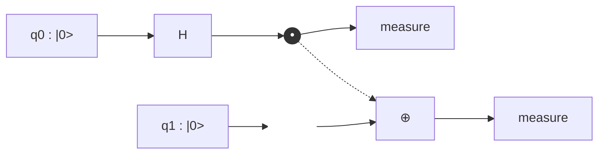

🌐 JP | [🇬🇧 EN](<../../../en/FM/quantum-computing-introduction/chapter-2.html>) | Last sync: 2026-08-12

[基礎数理道場](<../index.html>) > [量子コンピューティング入門](<index.html>) > 第2章

第1章では「状態」を扱いました。\\(2^n\\) 次元空間のベクトル、その確率、そして測定統計です。しかし変化しない状態は何も計算しません。本章はそこに「動詞」を与えます。すなわち状態をヒルベルト空間の中で動かす**ゲート**であり、しかもごく少数のゲートだけであらゆる場所に到達できることを示します。その途上でミニシミュレータを完成させます。2.3節を読み終えた時点で、99行のコード — 任意のユニタリ行列を任意の量子ビットに作用させる関数 — が手元に残り、本シリーズの以降の全章はこのコードをそのまま使い続けます。

本章の記述は意図的に圧縮してあります。ゲートの恒等式は量子コンピューティングの語彙にすぎず、内容そのものではありません。真の目的地は第3章、同じシミュレータで分子の基底状態エネルギーを計算する場面です。ただし本章の2つの考え方は単なる語彙ではありません。第1は、**エンタングルメントは数値を伴う資源である**という点です。ここで導入するエンタングルメントエントロピーは、量子物質がテンソルネットワーク法で古典的にシミュレートできるかどうかを決める、まさにその量です。第2は、**連続的な操作の空間が離散的なゲート集合から到達可能である**という点で、これがデジタル量子計算機を建設できる理由そのものです。

## 学習目標

本章を修了すると、以下のことができるようになります：

  * 量子ゲートがユニタリでなければならない理由を説明し、Schrödinger方程式からゲート行列 \\(U = \exp(-iHt/\hbar)\\) を導出できる
  * 標準的な1量子ビットゲート X, Y, Z, H, S, T と回転ゲート \\(R_x(\theta)\\), \\(R_y(\theta)\\), \\(R_z(\theta)\\) を書き下し、それぞれをBloch球の回転として解釈できる
  * CNOT・CZ・SWAP・一般の制御ユニタリ \\(U\\) を構成し、1量子ビットゲートによる共役変換で相互に変換できる
  * テンソルreshape法によって `apply_gate` を実装し、\\(2^n \times 2^n\\) 行列を一切構成せずに \\(k\\) 量子ビットゲートを \\(n\\) 量子ビットレジスタの任意の位置に作用させられる
  * 4つのBell状態とGHZ状態を生成し、縮約密度行列とvon Neumannエントロピーによってエンタングルメントを定量化できる
  * Bell状態に対してCHSH量が \\(2\sqrt{2}\\) に達し、いかなる古典的上限も超えることを数値的に示せる
  * 任意の1量子ビットユニタリを3つの回転に分解し、\\(\lbrace H, T \rbrace\\) が普遍的である一方 \\(\lbrace H, S \rbrace\\) がそうでない意味を説明できる
  * Pauli指数関数 \\(\exp(-i\theta P)\\) をCNOTと1個の \\(R_z\\) にコンパイルできる — 第3章のあらゆる変分アルゴリズムが依拠する、唯一のコンパイル技法である

* * *

## 2.1 ユニタリ発展：ゲートはどこから来るのか

### Schrödinger方程式から行列へ

量子コンピュータは新しい物理ではありません。制御された量子系の通常の時間発展を、私たちが「ゲート」と呼ぶことに決めた単位に切り分けたものです。ハミルトニアン \\(H\\) のもとでの状態 \\(\lvert \psi(t) \rangle\\) の時間依存Schrödinger方程式から出発します：

\\[ i\hbar \frac{d}{dt} \lvert \psi(t) \rangle = H \lvert \psi(t) \rangle \\]

区間 \\([0, t]\\) で \\(H\\) が時間に依存しなければ、解は行列指数関数になります：

\\[ \lvert \psi(t) \rangle = U(t) \lvert \psi(0) \rangle, \qquad U(t) = \exp\left(-\frac{i H t}{\hbar}\right) \\]

この行列 \\(U\\) が量子ゲートです。実験室で「Xゲートをかける」とは、超伝導量子ビットにマイクロ波パルスを照射し、その振幅と時間を \\(\exp(-iHt/\hbar)\\) が数パーセント以下の誤差でX行列に一致するよう校正することを意味します。私たちのシミュレータでは、\\(2 \times 2\\) 配列を掛けることを意味します。両者は同じ内容を異なる抽象度で述べたものであり、物理的な描像を忘れないことには実益があります。第5章で扱うゲート誤差は、校正のずれた \\(Ht\\) 以上のものでは決してありません。

### なぜゲートはユニタリでなければならないのか

\\(H\\) がエルミート（\\(H^\dagger = H\\)）であるため、指数関数は**ユニタリ**になります：

\\[ U^\dagger U = \exp\left(+\frac{i H^\dagger t}{\hbar}\right)\exp\left(-\frac{i H t}{\hbar}\right) = I \\]

ユニタリ性には、以後のすべてを規定する2つの帰結があります。

**確率が保存される。** \\(\lvert \psi \rangle\\) が規格化されていれば \\(U \lvert \psi \rangle\\) も規格化されています。\\(\langle \psi \rvert U^\dagger U \lvert \psi \rangle = \langle \psi \rvert \psi \rangle = 1\\) だからです。振幅を「失う」ゲートを書く方法は存在しません。損失やデコヒーレンスはゲートではなく、より大きな系への結合であり、これがまさに第5章でのモデル化の方針になります。

**すべてのゲートは可逆である。** \\(U^{-1} = U^\dagger\\) が常に存在するので、任意の量子回路は各ゲートの共役を逆順に作用させることで巻き戻せます。これは古典論理との明確な決別です。古典の2入力ANDゲートは情報を破壊します。出力が0だと知っても入力は決まりません。可逆計算機は出力1ビットのANDゲートを持てず、そのためANDの量子版は入力を保持する3量子ビットのToffoliゲート（2.5節）になります。

性質 | 古典論理 | 量子ゲート
---|---|---
可逆性 | AND, OR, NANDは不可逆 | すべて可逆、\\(U^{-1} = U^\dagger\\)
ファンアウト | 配線は自由に複製できる | ノークローニング定理により禁止
状態空間 | \\(2^n\\) 個の離散ビット列 | \\(\mathbb{C}^{2^n}\\) 内の重ね合わせの連続体
普遍集合 | \\(\lbrace\\) NAND \\(\rbrace\\) 単独 | \\(\lbrace H, T, \mathrm{CNOT} \rbrace\\)、しかも近似的に
誤差モデル | ビット反転、離散的 | 振幅と位相の連続的なずれ
合成 | ブール関数表 | 行列の積

### 大域位相は物理的でない

全体に \\(e^{i\alpha}\\) の因子だけ異なる2つの状態は、あらゆる測定に対して同一の予測を与えます。この因子は \\(\lvert \langle x \rvert \psi \rangle \rvert^2\\) でも、任意の期待値 \\(\langle \psi \rvert A \lvert \psi \rangle\\) でも打ち消されるからです。したがって状態空間は実際には射影空間であり、大域位相だけ異なるゲートは物理的に同じゲートです。この事実は繰り返し現れます。\\(R_z(\pi) = -iZ\\)、\\(R_x(\pi) = -iX\\)。マイナス符号は見えません。

**一方、相対位相はすべてを決めます。** \\(\alpha \lvert 0 \rangle + \beta \lvert 1 \rangle\\) において、\\(\alpha\\) に対する \\(\beta\\) の位相は、計算基底以外のあらゆる測定の結果を左右します。相対位相を変えるだけのゲート — 以下に述べる \\(S\\) と \\(T\\) — が量子アルゴリズムの主役であるのは、干渉こそが量子コンピュータが古典コンピュータを上回る唯一の機構だからです。

### ゲートの合成と回路深さ

回路はユニタリ行列の積です。ゲート \\(U_1, U_2, \ldots, U_L\\) をこの順に作用させるとき、全体の操作は

\\[ U_{\text{total}} = U_L \cdots U_2 U_1 \\]

順序が反転していることに注意してください。最初に作用するゲートが最も右に立つのは、それが最初に状態に触れるからです。回路のコストを表す量は2つあります。

  * **ゲート数**：基本操作の個数。実機で蓄積する誤差を決めます。
  * **回路深さ**：層の数。互いに素な量子ビットに作用するゲートは同じ層を共有します。実時間の長さ、すなわちコヒーレンス時間 \\(T_2\\) のどれだけを消費するかを決めます。

2.6節ではGHZ状態について両者を計算します。同じ状態が深さ \\(n\\) でも深さ \\(\lceil \log_2 n \rceil\\) でも到達可能です。

* * *

## 2.2 1量子ビットゲート

### Pauliゲート

3つのPauli行列は、回転の生成子であり、量子ビットの観測量であり、同時にそれ自体がゲートでもあります：

\\[ X = \begin{pmatrix} 0 & 1 \\\\ 1 & 0 \end{pmatrix}, \qquad Y = \begin{pmatrix} 0 & -i \\\\ i & 0 \end{pmatrix}, \qquad Z = \begin{pmatrix} 1 & 0 \\\\ 0 & -1 \end{pmatrix} \\]

基底状態への作用は記憶する価値があります。

  * \\(X \lvert 0 \rangle = \lvert 1 \rangle\\)、\\(X \lvert 1 \rangle = \lvert 0 \rangle\\) — **ビット反転**、量子版のNOTゲート。
  * \\(Z \lvert 0 \rangle = \lvert 0 \rangle\\)、\\(Z \lvert 1 \rangle = -\lvert 1 \rangle\\) — **位相反転**。計算基底では見えないが、他のどの基底でも見える。
  * \\(Y = iXZ\\) — 位相を除いて両方を同時に行う。

いずれも2乗すると恒等演算子になり（\\(X^2 = Y^2 = Z^2 = I\\)）、自分自身が逆演算です。互いに反交換し（\\(XY = -YX = iZ\\) とその巡回置換）、これがスピン成分間の不確定性関係の背後にある代数的事実です。

### Hadamardゲート

\\[ H = \frac{1}{\sqrt{2}}\begin{pmatrix} 1 & 1 \\\\ 1 & -1 \end{pmatrix} \\]

Hadamardゲートは基底状態から重ね合わせを作ります：

\\[ H \lvert 0 \rangle = \frac{\lvert 0 \rangle + \lvert 1 \rangle}{\sqrt{2}} \equiv \lvert + \rangle, \qquad H \lvert 1 \rangle = \frac{\lvert 0 \rangle - \lvert 1 \rangle}{\sqrt{2}} \equiv \lvert - \rangle \\]

そして自分自身が逆演算です（\\(H^2 = I\\)）。より本質的な役割は**基底変換**であり、\\(Z\\) 軸を \\(X\\) 軸に写します：

\\[ H Z H = X, \qquad H X H = Z \\]

これは \\(Z\\) しか測定できない実機で \\(\langle X \rangle\\) を測る方法そのものです。\\(H\\) をかけてから計算基底で測る。「このPauli演算子を測定せよ」というあらゆる命令は、基底変換と \\(Z\\) 測定に還元されます。第3章では分子のエネルギーがこうした3つの測定設定から組み上げられます。

### 位相ゲート：SとT

\\[ S = \begin{pmatrix} 1 & 0 \\\\ 0 & i \end{pmatrix}, \qquad T = \begin{pmatrix} 1 & 0 \\\\ 0 & e^{i\pi/4} \end{pmatrix} \\]

それぞれ1/4回転と1/8回転の位相ゲートで、\\(S^2 = Z\\)、\\(T^2 = S\\) を満たします。計算基底の測定確率には何もせず、その後の干渉にはすべてを及ぼします。\\(T\\) ゲートは誤り耐性量子計算において特別な地位を占めます。シミュレーションでは安価なゲートであり、実機では高価なゲートなのです。\\(\lbrace H, S, \mathrm{CNOT} \rbrace\\) だけで組まれたゲート — **Cliffordゲート** — は古典的に効率よくシミュレートできます（Gottesman-Knillの定理）。したがって \\(T\\) ゲートを含まない回路は、ノートパソコンでできないことを何もしていません。回路のT数は量子リソース見積りの標準的な通貨であり、2.5節でその理由を見ます。

### 回転ゲート

\\(P^2 = I\\) を満たす任意のPauli演算子 \\(P\\) について、指数関数は簡単な形に閉じます：

\\[ \exp(-i\theta P) = \cos(\theta)\, I - i \sin(\theta)\, P \\]

慣習的な1量子ビット回転は半角を用い、\\(\theta = 2\pi\\) がBloch球の1回転に対応します：

\\[ R_x(\theta) = \exp\left(-\frac{i\theta X}{2}\right) = \begin{pmatrix} \cos\frac{\theta}{2} & -i\sin\frac{\theta}{2} \\\\ -i\sin\frac{\theta}{2} & \cos\frac{\theta}{2} \end{pmatrix} \\]

\\[ R_y(\theta) = \begin{pmatrix} \cos\frac{\theta}{2} & -\sin\frac{\theta}{2} \\\\ \sin\frac{\theta}{2} & \cos\frac{\theta}{2} \end{pmatrix}, \qquad R_z(\theta) = \begin{pmatrix} e^{-i\theta/2} & 0 \\\\ 0 & e^{i\theta/2} \end{pmatrix} \\]

\\(R_y\\) は実行列であり、実振幅上の変分ansatzにおける自然なつまみになります。\\(R_z\\) は対角行列であり、一部のハードウェアでは無償です（物理パルスではなくマイクロ波の参照位相のシフトとして実装されます）。

ゲート | 行列 | Bloch球での作用 | \\(\lvert 0 \rangle\\) への効果
---|---|---|---
\\(X\\) | \\(\begin{pmatrix} 0 & 1 \\\\ 1 & 0 \end{pmatrix}\\) | \\(x\\) 軸まわり \\(\pi\\) | \\(\lvert 1 \rangle\\)
\\(Y\\) | \\(\begin{pmatrix} 0 & -i \\\\ i & 0 \end{pmatrix}\\) | \\(y\\) 軸まわり \\(\pi\\) | \\(i\lvert 1 \rangle\\)
\\(Z\\) | \\(\begin{pmatrix} 1 & 0 \\\\ 0 & -1 \end{pmatrix}\\) | \\(z\\) 軸まわり \\(\pi\\) | \\(\lvert 0 \rangle\\)
\\(H\\) | \\(\tfrac{1}{\sqrt{2}}\begin{pmatrix} 1 & 1 \\\\ 1 & -1 \end{pmatrix}\\) | \\((x+z)/\sqrt{2}\\) まわり \\(\pi\\) | \\(\lvert + \rangle\\)
\\(S\\) | \\(\begin{pmatrix} 1 & 0 \\\\ 0 & i \end{pmatrix}\\) | \\(z\\) 軸まわり \\(\pi/2\\) | \\(\lvert 0 \rangle\\)
\\(T\\) | \\(\begin{pmatrix} 1 & 0 \\\\ 0 & e^{i\pi/4} \end{pmatrix}\\) | \\(z\\) 軸まわり \\(\pi/4\\) | \\(\lvert 0 \rangle\\)
\\(R_x(\theta)\\) | \\(\cos\tfrac{\theta}{2} I - i \sin\tfrac{\theta}{2} X\\) | \\(x\\) 軸まわり \\(\theta\\) | \\(\cos\tfrac{\theta}{2}\lvert 0 \rangle - i\sin\tfrac{\theta}{2}\lvert 1 \rangle\\)
\\(R_y(\theta)\\) | \\(\cos\tfrac{\theta}{2} I - i \sin\tfrac{\theta}{2} Y\\) | \\(y\\) 軸まわり \\(\theta\\) | \\(\cos\tfrac{\theta}{2}\lvert 0 \rangle + \sin\tfrac{\theta}{2}\lvert 1 \rangle\\)
\\(R_z(\theta)\\) | \\(\cos\tfrac{\theta}{2} I - i \sin\tfrac{\theta}{2} Z\\) | \\(z\\) 軸まわり \\(\theta\\) | \\(e^{-i\theta/2}\lvert 0 \rangle\\)

最初のコード例はこれらすべてを構成し、恒等式を数値的に検証します。出力は仕様書として読んでください。上の表のあらゆる主張が計算機精度で確認されています。

Code Example 1: 1量子ビットゲートの動物園

```python
import numpy as np

I2 = np.eye(2, dtype=complex)
X = np.array([[0, 1], [1, 0]], dtype=complex)
Y = np.array([[0, -1j], [1j, 0]], dtype=complex)
Z = np.array([[1, 0], [0, -1]], dtype=complex)
H = np.array([[1, 1], [1, -1]], dtype=complex) / np.sqrt(2)
S = np.array([[1, 0], [0, 1j]], dtype=complex)
T = np.array([[1, 0], [0, np.exp(1j * np.pi / 4)]], dtype=complex)

def rx(theta):
    c, s = np.cos(theta / 2), np.sin(theta / 2)
    return np.array([[c, -1j * s], [-1j * s, c]], dtype=complex)

def ry(theta):
    c, s = np.cos(theta / 2), np.sin(theta / 2)
    return np.array([[c, -s], [s, c]], dtype=complex)

def rz(theta):
    e = np.exp(-1j * theta / 2)
    return np.array([[e, 0], [0, np.conj(e)]], dtype=complex)

GATES = {'I': I2, 'X': X, 'Y': Y, 'Z': Z, 'H': H, 'S': S, 'T': T}

print("Unitarity check  (max |U^dag U - I|)")
print("-" * 46)
for name, U in GATES.items():
    err = np.max(np.abs(U.conj().T @ U - I2))
    det = np.linalg.det(U)
    print(f"  {name}: error = {err:.2e},  det = {det.real:+.3f}{det.imag:+.3f}i")

print("\nAction on the computational basis")
print("-" * 46)
ket0, ket1 = np.array([1, 0], dtype=complex), np.array([0, 1], dtype=complex)
for name, U in GATES.items():
    a, b = U @ ket0, U @ ket1
    print(f"  {name}|0> = [{a[0]:+.3f} {a[1]:+.3f}]   {name}|1> = [{b[0]:+.3f} {b[1]:+.3f}]")

print("\nGate algebra")
print("-" * 46)
ident = [("H@H == I", H @ H, I2),
         ("S@S == Z", S @ S, Z),
         ("T@T == S", T @ T, S),
         ("H@Z@H == X", H @ Z @ H, X),
         ("H@X@H == Z", H @ X @ H, Z),
         ("X@Y == i Z", X @ Y, 1j * Z),
         ("Rx(pi) == -i X", rx(np.pi), -1j * X),
         ("Ry(pi) == -i Y", ry(np.pi), -1j * Y),
         ("Rz(pi/2) == e^{-i pi/4} S", rz(np.pi / 2), np.exp(-1j * np.pi / 4) * S)]
for label, A, B in ident:
    print(f"  {label:28s} {'OK' if np.allclose(A, B) else 'FAIL'}   (max diff {np.max(np.abs(A - B)):.1e})")

print("\nEigenvalues and rotation axes")
print("-" * 46)
for name in ['X', 'Y', 'Z', 'H']:
    w, v = np.linalg.eigh(GATES[name])
    print(f"  {name}: eigenvalues = {np.round(w.real, 3)}")

print("\nRotation gates: Ry(theta) applied to |0>")
print("-" * 46)
print(f"  {'theta/pi':>9} {'amp(0)':>9} {'amp(1)':>9} {'P(0)':>7} {'P(1)':>7} {'<Z>':>8}")
for f in [0.0, 0.25, 0.5, 2/3, 1.0, 1.5]:
    psi = ry(f * np.pi) @ ket0
    p = np.abs(psi) ** 2
    print(f"  {f:9.3f} {psi[0].real:9.4f} {psi[1].real:9.4f} {p[0]:7.4f} {p[1]:7.4f} {p[0]-p[1]:8.4f}")

theta = 0.9
print("\nGlobal vs relative phase")
print("-" * 46)
psi_a = rz(theta) @ (H @ ket0)
psi_b = np.exp(1j * 0.31) * psi_a
print(f"  probabilities equal?      {np.allclose(np.abs(psi_a)**2, np.abs(psi_b)**2)}")
print(f"  <X> for psi_a = {np.vdot(psi_a, X @ psi_a).real:+.4f},  for psi_b = {np.vdot(psi_b, X @ psi_b).real:+.4f}")
psi_c = H @ (rz(theta) @ ket0)
print(f"  Rz then H vs H then Rz identical? {np.allclose(psi_a, psi_c)}  -> gates do not commute")
```

```text
Unitarity check  (max |U^dag U - I|)
----------------------------------------------
  I: error = 0.00e+00,  det = +1.000+0.000i
  X: error = 0.00e+00,  det = -1.000+0.000i
  Y: error = 0.00e+00,  det = -1.000+0.000i
  Z: error = 0.00e+00,  det = -1.000+0.000i
  H: error = 2.22e-16,  det = -1.000+0.000i
  S: error = 0.00e+00,  det = +0.000+1.000i
  T: error = 0.00e+00,  det = +0.707+0.707i

Action on the computational basis
----------------------------------------------
  I|0> = [+1.000+0.000j +0.000+0.000j]   I|1> = [+0.000+0.000j +1.000+0.000j]
  X|0> = [+0.000+0.000j +1.000+0.000j]   X|1> = [+1.000+0.000j +0.000+0.000j]
  Y|0> = [+0.000+0.000j +0.000+1.000j]   Y|1> = [+0.000-1.000j +0.000+0.000j]
  Z|0> = [+1.000+0.000j +0.000+0.000j]   Z|1> = [+0.000+0.000j -1.000+0.000j]
  H|0> = [+0.707+0.000j +0.707+0.000j]   H|1> = [+0.707+0.000j -0.707+0.000j]
  S|0> = [+1.000+0.000j +0.000+0.000j]   S|1> = [+0.000+0.000j +0.000+1.000j]
  T|0> = [+1.000+0.000j +0.000+0.000j]   T|1> = [+0.000+0.000j +0.707+0.707j]

Gate algebra
----------------------------------------------
  H@H == I                     OK   (max diff 2.2e-16)
  S@S == Z                     OK   (max diff 0.0e+00)
  T@T == S                     OK   (max diff 2.2e-16)
  H@Z@H == X                   OK   (max diff 2.2e-16)
  H@X@H == Z                   OK   (max diff 2.2e-16)
  X@Y == i Z                   OK   (max diff 0.0e+00)
  Rx(pi) == -i X               OK   (max diff 6.1e-17)
  Ry(pi) == -i Y               OK   (max diff 6.1e-17)
  Rz(pi/2) == e^{-i pi/4} S    OK   (max diff 1.6e-16)

Eigenvalues and rotation axes
----------------------------------------------
  X: eigenvalues = [-1.  1.]
  Y: eigenvalues = [-1.  1.]
  Z: eigenvalues = [-1.  1.]
  H: eigenvalues = [-1.  1.]

Rotation gates: Ry(theta) applied to |0>
----------------------------------------------
   theta/pi    amp(0)    amp(1)    P(0)    P(1)      <Z>
      0.000    1.0000    0.0000  1.0000  0.0000   1.0000
      0.250    0.9239    0.3827  0.8536  0.1464   0.7071
      0.500    0.7071    0.7071  0.5000  0.5000   0.0000
      0.667    0.5000    0.8660  0.2500  0.7500  -0.5000
      1.000    0.0000    1.0000  0.0000  1.0000  -1.0000
      1.500   -0.7071    0.7071  0.5000  0.5000  -0.0000

Global vs relative phase
----------------------------------------------
  probabilities equal?      True
  <X> for psi_a = +0.6216,  for psi_b = +0.6216
  Rz then H vs H then Rz identical? False  -> gates do not commute
```

**着目点。** すべてのゲートが \\(\lvert \det U \rvert = 1\\) を満たし、エルミートな4つのゲートは固有値 \\(\pm 1\\) をもちます。これがゲートでありながら観測量でもある理由です。\\(R_y(\theta)\\) の表では振幅が連続的に回り、\\(\langle Z \rangle = \cos\theta\\) が \\(+1\\) から \\(-1\\) へ掃引されます。スイッチではなくつまみなのです。そして最後のブロックが決定的な区別を示します。状態全体に \\(e^{0.31i}\\) を掛けても観測量は何も変わりませんが、\\(H\\) と \\(R_z\\) の順序を入れ替えると状態はまるごと変わります。非可換性は管理すべき厄介事ではなく、回路の順序が情報を担う理由そのものです。

* * *

## 2.3 2量子ビットゲートとテンソルreshape法

### 添字の規約（ここで一度だけ宣言する）

本シリーズは一貫して**ビッグエンディアン**順序を用います。量子ビット0はケットの左端の記号であり、振幅添字の最上位ビットです。\\(n\\) 量子ビットレジスタでは

\\[ \lvert q_0 q_1 \cdots q_{n-1} \rangle \; \longleftrightarrow \; \text{添字 } k = \sum_{i=0}^{n-1} q_i \, 2^{\,n-1-i} \\]

したがって2量子ビットでは \\(\lvert 00 \rangle, \lvert 01 \rangle, \lvert 10 \rangle, \lvert 11 \rangle\\) が添字 0, 1, 2, 3 を占めます。文献によって規約は異なり、Qiskit系の文献の多くはリトルエンディアン（量子ビット0が*右端*）です。規約の不一致は、量子シミュレーションのコードが黙って誤った結果を出す最大の原因です。本シリーズの数値を論文と比較するときは、まず順序を確認してください。

### CNOT、CZ、SWAP

制御NOTは、制御ビットが \\(\lvert 1 \rangle\\) のときに限り標的ビットを反転します。量子ビット0を制御、1を標的とすると、ビッグエンディアン基底で

\\[ \mathrm{CNOT} = \begin{pmatrix} 1 & 0 & 0 & 0 \\\\ 0 & 1 & 0 & 0 \\\\ 0 & 0 & 0 & 1 \\\\ 0 & 0 & 1 & 0 \end{pmatrix}, \qquad \begin{aligned} \mathrm{CNOT} \lvert 00 \rangle &= \lvert 00 \rangle \\\\ \mathrm{CNOT} \lvert 01 \rangle &= \lvert 01 \rangle \\\\ \mathrm{CNOT} \lvert 10 \rangle &= \lvert 11 \rangle \\\\ \mathrm{CNOT} \lvert 11 \rangle &= \lvert 10 \rangle \end{aligned} \\]

制御Zは対角行列 \\(\mathrm{CZ} = \mathrm{diag}(1, 1, 1, -1)\\) であり、標的側のHadamardで両者は結ばれます：

\\[ \mathrm{CZ} = (I \otimes H)\, \mathrm{CNOT}\, (I \otimes H) \\]

CNOTと違い、CZは2つの量子ビットについて明らかに**対称**です。どちらを制御と呼ぶかは問題になりません。この対称性は物理的な意味をもちます。多くのハードウェアの固有の2量子ビット相互作用はCZ型であり、Hadamardはコンパイラが挿入してくれるからです。

SWAPは2つの量子ビットを交換し、3つのCNOTに分解されます：

\\[ \mathrm{SWAP} = \mathrm{CNOT}\_{0 \to 1} \, \mathrm{CNOT}\_{1 \to 0} \, \mathrm{CNOT}\_{0 \to 1} \\]

これは好奇心の対象にとどまりません。量子ビットが1次元に並んだ装置では、離れた2量子ビットをエンタングルさせるにはSWAPの連鎖が必要で、その代償 — 1ホップあたり2量子ビットゲート3個 — は第5章で論じる実務上の厳しい制約のひとつです。

### 一般の制御ユニタリ

任意の1量子ビットゲート \\(U\\) に対し、その制御版はブロック対角行列です：

\\[ C(U) = \begin{pmatrix} I & 0 \\\\ 0 & U \end{pmatrix} = \lvert 0 \rangle\langle 0 \rvert \otimes I + \lvert 1 \rangle\langle 1 \rvert \otimes U \\]

したがってCNOTは \\(C(X)\\)、CZは \\(C(Z)\\) です。制御回転は2つのCNOTと2つの半角回転から構成できます。例えば

\\[ C(R_z(\theta)) = \mathrm{CNOT}\, \left[I \otimes R_z(-\theta/2)\right] \mathrm{CNOT} \left[I \otimes R_z(\theta/2)\right] \\]

（Code Example 6で数値的に検証します）。こうした構成の背後にある一般的な事実は、任意の2量子ビットユニタリが高々3個のCNOTと少数の1量子ビットゲートで書けることです。CNOT数が回路の難しさの正直な尺度になるのは、実機の2量子ビットゲート誤差が1量子ビット誤差より1桁大きいのが典型だからです。

### Kronecker積の問題点

\\(n\\) 量子ビットレジスタの量子ビット \\(t\\) にゲート \\(U\\) を作用させる教科書的な表式は、他のすべての枠に恒等行列を並べたKronecker積です：

\\[ U^{(t)} = I \otimes \cdots \otimes I \otimes \underbrace{U}\_{\text{枠 } t} \otimes I \otimes \cdots \otimes I \\]

これは正しく、そして使えません。この行列は \\(2^n \times 2^n = 4^n\\) 個の要素をもち、そのほぼすべてがゼロです。\\(n = 20\\) では17テラバイトを要する一方、状態ベクトル自体は17メガバイトで足ります。これを構成した時点で状態ベクトル法の意義は失われます。

### テンソルreshape法

解決策は、状態を長さ \\(2^n\\) のベクトルと思うのをやめ、各次元が2の \\(n\\) 本の添字をもつテンソルと考えることです：

\\[ \psi_{q_0 q_1 \cdots q_{n-1}}, \qquad \text{形状 } \underbrace{(2, 2, \ldots, 2)}\_{n} \\]

ビッグエンディアン規約のおかげで、`state.reshape([2] * n)` がまさにこれを与え、軸 \\(i\\) が量子ビット \\(i\\) に対応します。余計な帳簿は不要です。\\(k\\) 量子ビットゲートを量子ビット \\(t_1, \ldots, t_k\\) に作用させる手順は4段階です：

  1. 状態を \\(n\\) 添字テンソルに **reshape** する。
  2. `np.moveaxis` で標的の軸を先頭に **移動** する。
  3. \\(2^k \times 2^{n-k}\\) 行列に **平坦化** し、左から \\(U\\) を掛ける。これは単一の密行列積であり、BLASが全速で実行します。
  4. 軸を **元に戻し**、ベクトルに平坦化する。

コストは演算 \\(O(2^k \cdot 2^n)\\)、メモリ \\(O(2^n)\\) です。ゲートサイズを固定すれば状態サイズに線形で、標的量子ビットがどれだけ離れているかには依存しません。これがあらゆる本格的な状態ベクトルシミュレータの中核であり、8行に収まります。

Code Example 2: ミニシミュレータの完成形

```python
"""Minimal state-vector simulator (big-endian: qubit 0 = leftmost = most significant).

Save this file as qcsim.py; every later example does `from qcsim import *`.
"""
import numpy as np

# ---- 1量子ビットゲート --------------------------------------------------
I2 = np.eye(2, dtype=complex)
X = np.array([[0, 1], [1, 0]], dtype=complex)
Y = np.array([[0, -1j], [1j, 0]], dtype=complex)
Z = np.array([[1, 0], [0, -1]], dtype=complex)
H = np.array([[1, 1], [1, -1]], dtype=complex) / np.sqrt(2)
S = np.array([[1, 0], [0, 1j]], dtype=complex)
T = np.array([[1, 0], [0, np.exp(1j * np.pi / 4)]], dtype=complex)


def rx(theta):
    c, s = np.cos(theta / 2), np.sin(theta / 2)
    return np.array([[c, -1j * s], [-1j * s, c]], dtype=complex)


def ry(theta):
    c, s = np.cos(theta / 2), np.sin(theta / 2)
    return np.array([[c, -s], [s, c]], dtype=complex)


def rz(theta):
    e = np.exp(-1j * theta / 2)
    return np.array([[e, 0], [0, np.conj(e)]], dtype=complex)


# ---- 状態 ---------------------------------------------------------------
def ket(bits: str) -> np.ndarray:
    """'01' -> 4次元の基底状態 |01>（ビッグエンディアン）"""
    n = len(bits)
    psi = np.zeros(2 ** n, dtype=complex)
    psi[int(bits, 2)] = 1.0
    return psi


def apply_gate(state, U, targets, n):
    """n量子ビット状態の targets に 2^k x 2^k ユニタリ U を作用させる"""
    k = len(targets)
    psi = state.reshape([2] * n)          # 1. n添字テンソルとして見る
    psi = np.moveaxis(psi, targets, range(k))   # 2. 標的軸を先頭へ
    rest = psi.shape[k:]
    psi = psi.reshape(2 ** k, -1)         # 3. 平坦化して行列積
    psi = U @ psi
    psi = psi.reshape(list((2,) * k) + list(rest))
    psi = np.moveaxis(psi, range(k), targets)   # 4. 軸を元に戻す
    return psi.reshape(-1)


CNOT4 = np.array([[1, 0, 0, 0],
                  [0, 1, 0, 0],
                  [0, 0, 0, 1],
                  [0, 0, 1, 0]], dtype=complex)


def cnot(state, control, target, n):
    """任意の量子ビット対・任意の向きのCNOT"""
    return apply_gate(state, CNOT4, [control, target], n)


def probs(state):
    """Born則による全 2^n 通りの確率"""
    return np.abs(state) ** 2


def sample(state, shots, seed=None):
    """測定のシミュレーション: {ビット列: 回数}"""
    n = int(np.log2(state.size))
    rng = np.random.default_rng(seed)
    idx = rng.choice(state.size, size=shots, p=probs(state))
    out = {}
    for i in idx:
        b = format(i, f'0{n}b')
        out[b] = out.get(b, 0) + 1
    return dict(sorted(out.items()))


PAULI = {'I': I2, 'X': X, 'Y': Y, 'Z': Z}


def expval(state, pauli, coeff_map=None):
    """'ZZ' や 'XI' のようなPauli文字列（1量子ビット1文字）の期待値。

    coeff_map を与えると結果に coeff_map[pauli] を掛けるので、ハミルトニアン
    全体が1行で書ける:  sum(expval(psi, p, terms) for p in terms)
    """
    n = len(pauli)
    phi = state.copy()
    for q, ch in enumerate(pauli):
        if ch != 'I':
            phi = apply_gate(phi, PAULI[ch], [q], n)
    val = np.vdot(state, phi).real
    if coeff_map is not None:
        val *= coeff_map.get(pauli, 1.0)
    return val
```

これがシミュレータの全体です。99行、9個の関数、NumPy以外の依存はゼロ。これで第3章の分子基底状態計算、第4章のHubbard模型、第5章のノイズモデルまで走り抜けます。信用する前に、テストしましょう。

Code Example 3: シミュレータの検証

```python
import numpy as np
from qcsim import *
from functools import reduce

def kron_all(mats):
    return reduce(np.kron, mats)

print("Big-endian index convention")
print("-" * 60)
for bits in ['0', '1', '01', '10', '011', '110']:
    print(f"  ket('{bits}') -> index {int(np.argmax(np.abs(ket(bits))))}"
          f"  of dimension {2**len(bits)}")

print("\napply_gate vs explicit Kronecker product")
print("-" * 60)
rng = np.random.default_rng(0)
n = 4
psi = rng.normal(size=2**n) + 1j * rng.normal(size=2**n)
psi /= np.linalg.norm(psi)
for t in range(n):
    ref = kron_all([T if i == t else I2 for i in range(n)]) @ psi
    err = np.max(np.abs(apply_gate(psi, T, [t], n) - ref))
    print(f"  T on qubit {t}: max deviation = {err:.2e}")

print("\nCNOT truth table (n = 2, control 0 -> target 1)")
print("-" * 60)
for bits in ['00', '01', '10', '11']:
    out = cnot(ket(bits), 0, 1, 2)
    print(f"  |{bits}> -> |{format(int(np.argmax(np.abs(out))), '02b')}>")

print("\nCNOT with control 1 -> target 0 (no qubit reordering needed)")
print("-" * 60)
for bits in ['00', '01', '10', '11']:
    out = cnot(ket(bits), 1, 0, 2)
    print(f"  |{bits}> -> |{format(int(np.argmax(np.abs(out))), '02b')}>")

print("\nGate applied to distant qubits of a 5-qubit register")
print("-" * 60)
n = 5
psi = ket('00000')
psi = apply_gate(psi, H, [0], n)
psi = cnot(psi, 0, 4, n)
nz = {format(i, '05b'): float(psi[i].real) for i in range(2**n) if abs(psi[i]) > 1e-12}
print("  H(0) then CNOT(0->4):", {k: round(float(v), 4) for k, v in nz.items()})

print("\nexpval against explicit Pauli matrices")
print("-" * 60)
psi = ket('00')
psi = apply_gate(psi, H, [0], 2)
psi = cnot(psi, 0, 1, 2)
for p in ['ZZ', 'XX', 'YY', 'ZI', 'IZ', 'XI']:
    direct = np.vdot(psi, kron_all([PAULI[c] for c in p]) @ psi).real
    print(f"  <{p}> = {expval(psi, p):+.6f}   (matrix product: {direct:+.6f})")

print("\nHamiltonian expectation with coeff_map")
print("-" * 60)
Hd = {'ZI': 0.5, 'IZ': -0.25, 'XX': 0.75}
E = sum(expval(psi, p, Hd) for p in Hd)
Hmat = sum(c * kron_all([PAULI[ch] for ch in p]) for p, c in Hd.items())
print(f"  sum of weighted terms = {E:+.6f}")
print(f"  <psi|H|psi> directly   = {np.vdot(psi, Hmat @ psi).real:+.6f}")

print("\nNormalisation and sampling")
print("-" * 60)
print(f"  sum of probs = {probs(psi).sum():.12f}")
print(f"  sample(2000 shots) = {sample(psi, 2000, seed=42)}")
```

```text
Big-endian index convention
------------------------------------------------------------
  ket('0') -> index 0  of dimension 2
  ket('1') -> index 1  of dimension 2
  ket('01') -> index 1  of dimension 4
  ket('10') -> index 2  of dimension 4
  ket('011') -> index 3  of dimension 8
  ket('110') -> index 6  of dimension 8

apply_gate vs explicit Kronecker product
------------------------------------------------------------
  T on qubit 0: max deviation = 0.00e+00
  T on qubit 1: max deviation = 0.00e+00
  T on qubit 2: max deviation = 0.00e+00
  T on qubit 3: max deviation = 0.00e+00

CNOT truth table (n = 2, control 0 -> target 1)
------------------------------------------------------------
  |00> -> |00>
  |01> -> |01>
  |10> -> |11>
  |11> -> |10>

CNOT with control 1 -> target 0 (no qubit reordering needed)
------------------------------------------------------------
  |00> -> |00>
  |01> -> |11>
  |10> -> |10>
  |11> -> |01>

Gate applied to distant qubits of a 5-qubit register
------------------------------------------------------------
  H(0) then CNOT(0->4): {'00000': 0.7071, '10001': 0.7071}

expval against explicit Pauli matrices
------------------------------------------------------------
  <ZZ> = +1.000000   (matrix product: +1.000000)
  <XX> = +1.000000   (matrix product: +1.000000)
  <YY> = -1.000000   (matrix product: -1.000000)
  <ZI> = +0.000000   (matrix product: +0.000000)
  <IZ> = +0.000000   (matrix product: +0.000000)
  <XI> = +0.000000   (matrix product: +0.000000)

Hamiltonian expectation with coeff_map
------------------------------------------------------------
  sum of weighted terms = +0.750000
  <psi|H|psi> directly   = +0.750000

Normalisation and sampling
------------------------------------------------------------
  sum of probs = 1.000000000000
  sample(2000 shots) = {'00': 1008, '11': 992}
```

**着目点。** Kronecker積の参照値とのずれは「小さい」のではなく、ちょうどゼロです。reshape経路は同じ浮動小数点演算を異なる順序で（これらのゲートについては振幅ごとに同じ順序で）実行しているためです。CNOTの真理値表は両方向とも場合分けのコードなしに正しく出ます。`moveaxis` が並べ替えを担っているからです。そして5量子ビットの `CNOT(0 -> 4)` は \\((\lvert 00000 \rangle + \lvert 10001 \rangle)/\sqrt{2}\\) を生み、量子ビット間の「距離」がシミュレータには何のコストももたらさないことを示します（実機には大きなコストをもたらし、それが第5章の問題です）。

* * *

## 2.4 エンタングルメント

### Bell状態

2つのHadamardと1つのCNOTが、物理学で最も研究された状態を作ります：

\\[ \lvert \Phi^{+} \rangle = \mathrm{CNOT}\_{0\to1} (H \otimes I) \lvert 00 \rangle = \frac{\lvert 00 \rangle + \lvert 11 \rangle}{\sqrt{2}} \\]

他の3つと合わせた4つの**Bell状態**

\\[ \lvert \Phi^{\pm} \rangle = \frac{\lvert 00 \rangle \pm \lvert 11 \rangle}{\sqrt{2}}, \qquad \lvert \Psi^{\pm} \rangle = \frac{\lvert 01 \rangle \pm \lvert 10 \rangle}{\sqrt{2}} \\]

は2量子ビット空間の正規直交基底をなし、どれも積 \\(\lvert a \rangle \otimes \lvert b \rangle\\) の形に書けません。これがエンタングルメントの定義です。**純粋状態は、因数分解できないときエンタングルしている。**

物理的な内容は「局所的な原因をもたない相関」です。\\(\lvert \Phi^{+} \rangle\\) では各量子ビット単独は完全にランダムで、\\(\langle Z_0 \rangle = \langle Z_1 \rangle = 0\\)、両方の結果が等確率です。それでも両者は完全に相関し、\\(\langle Z_0 Z_1 \rangle = 1\\) です。量子ビット0の測定はどれも量子ビット1を確実に予測しますが、個々の量子ビットは何の情報も担っていません。

Code Example 4: Bell状態、相関、CHSH上限

```python
import numpy as np
from qcsim import *

def bell(kind):
    """|00> から4つのBell状態のいずれかを生成する"""
    psi = ket('00')
    if kind in ('Psi+', 'Psi-'):
        psi = apply_gate(psi, X, [1], 2)
    if kind in ('Phi-', 'Psi-'):
        psi = apply_gate(psi, X, [0], 2)
    psi = apply_gate(psi, H, [0], 2)
    psi = cnot(psi, 0, 1, 2)
    return psi

labels = ['Phi+', 'Phi-', 'Psi+', 'Psi-']
print("The four Bell states (amplitudes in the order |00> |01> |10> |11>)")
print("-" * 70)
for k in labels:
    psi = bell(k)
    print(f"  {k:5s}: {np.round(psi.real, 4)}")

print("\nTwo-qubit correlations")
print("-" * 70)
print(f"  {'state':6s} {'<ZI>':>8} {'<IZ>':>8} {'<ZZ>':>8} {'<XX>':>8} {'<YY>':>8}")
for k in labels:
    psi = bell(k)
    print(f"  {k:6s} {expval(psi,'ZI'):8.4f} {expval(psi,'IZ'):8.4f} "
          f"{expval(psi,'ZZ'):8.4f} {expval(psi,'XX'):8.4f} {expval(psi,'YY'):8.4f}")

print("\nProduct state for comparison: |+> (x) |+>")
print("-" * 70)
prod = apply_gate(apply_gate(ket('00'), H, [0], 2), H, [1], 2)
print(f"  amplitudes: {np.round(prod.real, 4)}")
print(f"  <ZI> = {expval(prod,'ZI'):+.4f}, <IZ> = {expval(prod,'IZ'):+.4f}, "
      f"<ZZ> = {expval(prod,'ZZ'):+.4f}")
print(f"  <ZZ> - <ZI><IZ> = {expval(prod,'ZZ') - expval(prod,'ZI')*expval(prod,'IZ'):+.4f}"
      "   (zero: statistically independent)")
psi = bell('Phi+')
print(f"  Bell Phi+: <ZZ> - <ZI><IZ> = "
      f"{expval(psi,'ZZ') - expval(psi,'ZI')*expval(psi,'IZ'):+.4f}"
      "   (one: perfectly correlated)")

print("\nMeasurement statistics, 4000 shots")
print("-" * 70)
print(f"  Phi+  : {sample(bell('Phi+'), 4000, seed=1)}")
print(f"  Psi+  : {sample(bell('Psi+'), 4000, seed=1)}")
print(f"  |+>|+>: {sample(prod, 4000, seed=1)}")

print("\nCHSH combination S = <A0B0> + <A0B1> + <A1B0> - <A1B1>")
print("-" * 70)
def rotated_zz(psi, angle_a, angle_b):
    """各量子ビットの測定軸を x-z 面内で回した後の <Z Z>"""
    phi = apply_gate(psi, ry(-angle_a), [0], 2)
    phi = apply_gate(phi, ry(-angle_b), [1], 2)
    return expval(phi, 'ZZ')

psi = bell('Phi+')
a0, a1 = 0.0, np.pi / 2
b0, b1 = np.pi / 4, -np.pi / 4
S = (rotated_zz(psi, a0, b0) + rotated_zz(psi, a0, b1)
     + rotated_zz(psi, a1, b0) - rotated_zz(psi, a1, b1))
print(f"  S(Bell state)    = {S:+.6f}   (Tsirelson bound 2*sqrt(2) = {2*np.sqrt(2):.6f})")
S_prod = (rotated_zz(prod, a0, b0) + rotated_zz(prod, a0, b1)
          + rotated_zz(prod, a1, b0) - rotated_zz(prod, a1, b1))
print(f"  S(product state) = {S_prod:+.6f}   (classical bound 2)")
```

```text
The four Bell states (amplitudes in the order |00> |01> |10> |11>)
----------------------------------------------------------------------
  Phi+ : [0.7071 0.     0.     0.7071]
  Phi- : [ 0.7071  0.      0.     -0.7071]
  Psi+ : [0.     0.7071 0.7071 0.    ]
  Psi- : [ 0.      0.7071 -0.7071  0.    ]

Two-qubit correlations
----------------------------------------------------------------------
  state      <ZI>     <IZ>     <ZZ>     <XX>     <YY>
  Phi+     0.0000   0.0000   1.0000   1.0000  -1.0000
  Phi-     0.0000   0.0000   1.0000  -1.0000   1.0000
  Psi+     0.0000   0.0000  -1.0000   1.0000   1.0000
  Psi-     0.0000   0.0000  -1.0000  -1.0000  -1.0000

Product state for comparison: |+> (x) |+>
----------------------------------------------------------------------
  amplitudes: [0.5 0.5 0.5 0.5]
  <ZI> = +0.0000, <IZ> = +0.0000, <ZZ> = +0.0000
  <ZZ> - <ZI><IZ> = +0.0000   (zero: statistically independent)
  Bell Phi+: <ZZ> - <ZI><IZ> = +1.0000   (one: perfectly correlated)

Measurement statistics, 4000 shots
----------------------------------------------------------------------
  Phi+  : {'00': 2015, '11': 1985}
  Psi+  : {'01': 2015, '10': 1985}
  |+>|+>: {'00': 1011, '01': 1004, '10': 981, '11': 1004}

CHSH combination S = <A0B0> + <A0B1> + <A1B0> - <A1B1>
----------------------------------------------------------------------
  S(Bell state)    = +2.828427   (Tsirelson bound 2*sqrt(2) = 2.828427)
  S(product state) = +1.414214   (classical bound 2)
```

**着目点。** 4つのBell状態を区別するのは1量子ビット統計ではありません（すべて同一でランダムです）。区別するのは2量子ビット相関の*符号*です。だからこそBell測定は、局所的には何の情報も担わない対から2ビットの情報を取り出せます。

最後のブロックは強調に値します。4つの相関測定から作るCHSH量 \\(S\\) は、各量子ビットが全観測量について測定前から値を持っているような理論（局所隠れ変数理論）では2を超えられません。私たちのシミュレータは量子力学が許す最大値 \\(2\sqrt{2} = 2.828\\) を返します。計算のどこにも近似はありません。2からの超過は線形代数の直接的帰結であり、実験室では数十標準偏差の精度で確認されています。積状態はといえば \\(\sqrt{2}\\) にしか届きません。

### エンタングルメントの定量化：縮約密度行列

「エンタングルしているか否か」では粗すぎます。*どれだけ*という洗練された問いに答えるのが**縮約密度行列**です。2部分系 \\(AB\\) の純粋状態が与えられたとき、\\(B\\) をトレースアウトします：

\\[ \rho_A = \mathrm{Tr}\_B \lvert \psi \rangle\langle \psi \rvert \\]

\\(\lvert \psi \rangle\\) が因数分解できるなら \\(\rho_A\\) は純粋状態で \\(\mathrm{Tr}(\rho_A^2) = 1\\)、エンタングルしているなら混合状態になります。標準的な尺度は \\(\rho_A\\) の**von Neumannエントロピー**（単位はビット）です：

\\[ S(\rho_A) = -\mathrm{Tr}\left(\rho_A \log_2 \rho_A\right) = -\sum_j \lambda_j \log_2 \lambda_j \\]

ここで \\(\lambda_j\\) は \\(\rho_A\\) の固有値です。1量子ビットを残りに対してトレースする場合、\\(S = 0\\) は積状態、\\(S = 1\\) ビットは最大エンタングルを意味します。

計算上、部分トレースもまたreshapeです。残す量子ビットを行、トレースする量子ビットを列とする行列 \\(M\\) で状態を書けば \\(\rho_A = M M^\dagger\\)。実装はこれで終わりです。

**材料科学の研究者が気にすべき理由。** この数値は飾りではありません。行列積状態 — 1次元量子磁性体に対して最も成功した数値手法DMRGの背後にある表現 — で量子状態を表す古典的コストは、最悪の切断面でのエンタングルメントエントロピーに対して指数関数的に増大します。ギャップのある局所ハミルトニアンの基底状態は**面積則**に従い、\\(S\\) は2つの半系の体積ではなく境界の大きさに比例します。まさにこれがDMRGが1次元鎖で成功し、2次元で苦しむ理由であり、古典シミュレーションに抵抗する系が強くエンタングルした系 — フラストレート磁性体、ドープしたHubbard模型、臨界点 — である理由です。第4章でどの材料問題が量子コンピュータに値するかを問うとき、答えを与える量はエンタングルメントエントロピーです。

Code Example 5: エンタングルメントを測る

```python
import numpy as np
from qcsim import *

def reduced_density_matrix(state, keep, n):
    """部分トレース: keep の量子ビットを残し、他をトレースアウトする"""
    psi = state.reshape([2] * n)
    keep = list(keep)
    rest = [q for q in range(n) if q not in keep]
    psi = np.moveaxis(psi, keep + rest, range(n))
    M = psi.reshape(2 ** len(keep), 2 ** len(rest))
    return M @ M.conj().T

def entanglement_entropy(state, keep, n):
    """縮約状態のvon Neumannエントロピー（ビット単位）"""
    w = np.linalg.eigvalsh(reduced_density_matrix(state, keep, n)).real
    w = w[w > 1e-12]
    return float(max(0.0, -np.sum(w * np.log2(w))))

print("Product state |+> (x) |0>")
print("-" * 58)
prod = apply_gate(ket('00'), H, [0], 2)
rho = reduced_density_matrix(prod, [0], 2)
print("  rho_0 =", np.round(rho.real, 4).tolist())
print(f"  purity Tr(rho^2) = {np.trace(rho @ rho).real:.4f}")
print(f"  entropy S = {entanglement_entropy(prod, [0], 2):.4f} bit")

print("\nBell state (|00> + |11>)/sqrt(2)")
print("-" * 58)
bell = cnot(apply_gate(ket('00'), H, [0], 2), 0, 1, 2)
rho = reduced_density_matrix(bell, [0], 2)
print("  rho_0 =", np.round(rho.real, 4).tolist())
print(f"  purity Tr(rho^2) = {np.trace(rho @ rho).real:.4f}")
print(f"  entropy S = {entanglement_entropy(bell, [0], 2):.4f} bit  (maximal for one qubit)")

print("\nTuning the entanglement: Ry(theta) on qubit 0, then CNOT(0->1)")
print("-" * 58)
print(f"  {'theta/pi':>9} {'amp|00>':>9} {'amp|11>':>9} {'S (bits)':>10} {'<ZZ>':>8}")
for f in [0.0, 0.1, 0.25, 0.4, 0.5, 0.75, 1.0]:
    psi = cnot(apply_gate(ket('00'), ry(f * np.pi), [0], 2), 0, 1, 2)
    S = entanglement_entropy(psi, [0], 2)
    print(f"  {f:9.2f} {psi[0].real:9.4f} {psi[3].real:9.4f} {S:10.4f} {expval(psi,'ZZ'):8.4f}")

print("\nThree-qubit states: where does the entanglement live?")
print("-" * 58)
ghz = ket('000')
ghz = apply_gate(ghz, H, [0], 3)
ghz = cnot(ghz, 0, 1, 3)
ghz = cnot(ghz, 1, 2, 3)
w = (ket('100') + ket('010') + ket('001')) / np.sqrt(3)
sep = apply_gate(apply_gate(ket('000'), H, [0], 3), H, [2], 3)
for name, st in [('GHZ', ghz), ('W', w), ('|+>|0>|+>', sep)]:
    s1 = entanglement_entropy(st, [0], 3)
    s2 = entanglement_entropy(st, [0, 1], 3)
    print(f"  {name:10s} S(qubit0 | rest) = {s1:.4f},  S(qubits01 | qubit2) = {s2:.4f}")

print("\nEntropy of a random state vs number of traced-out qubits (n = 10)")
print("-" * 58)
rng = np.random.default_rng(3)
n = 10
psi = rng.normal(size=2**n) + 1j * rng.normal(size=2**n)
psi /= np.linalg.norm(psi)
for k in [1, 2, 3, 4, 5]:
    S = entanglement_entropy(psi, list(range(k)), n)
    print(f"  keep {k} qubit(s): S = {S:6.4f} bits   (maximum possible {k})")
```

```text
Product state |+> (x) |0>
----------------------------------------------------------
  rho_0 = [[0.5, 0.5], [0.5, 0.5]]
  purity Tr(rho^2) = 1.0000
  entropy S = 0.0000 bit

Bell state (|00> + |11>)/sqrt(2)
----------------------------------------------------------
  rho_0 = [[0.5, 0.0], [0.0, 0.5]]
  purity Tr(rho^2) = 0.5000
  entropy S = 1.0000 bit  (maximal for one qubit)

Tuning the entanglement: Ry(theta) on qubit 0, then CNOT(0->1)
----------------------------------------------------------
   theta/pi   amp|00>   amp|11>   S (bits)     <ZZ>
       0.00    1.0000    0.0000     0.0000   1.0000
       0.10    0.9877    0.1564     0.1659   1.0000
       0.25    0.9239    0.3827     0.6009   1.0000
       0.40    0.8090    0.5878     0.9300   1.0000
       0.50    0.7071    0.7071     1.0000   1.0000
       0.75    0.3827    0.9239     0.6009   1.0000
       1.00    0.0000    1.0000     0.0000   1.0000

Three-qubit states: where does the entanglement live?
----------------------------------------------------------
  GHZ        S(qubit0 | rest) = 1.0000,  S(qubits01 | qubit2) = 1.0000
  W          S(qubit0 | rest) = 0.9183,  S(qubits01 | qubit2) = 0.9183
  |+>|0>|+>  S(qubit0 | rest) = 0.0000,  S(qubits01 | qubit2) = 0.0000

Entropy of a random state vs number of traced-out qubits (n = 10)
----------------------------------------------------------
  keep 1 qubit(s): S = 0.9966 bits   (maximum possible 1)
  keep 2 qubit(s): S = 1.9897 bits   (maximum possible 2)
  keep 3 qubit(s): S = 2.9574 bits   (maximum possible 3)
  keep 4 qubit(s): S = 3.8417 bits   (maximum possible 4)
  keep 5 qubit(s): S = 4.2961 bits   (maximum possible 5)
```

**着目点。** この出力には3つの教訓が隠れています。

第1に、積状態の \\(\rho_0\\) は \\(\lvert + \rangle\langle + \rvert\\) — 非対角のコヒーレンスをもつ純粋状態 — であるのに対し、Bell状態では \\(I/2\\)、すなわち最大混合状態でコヒーレンスが消えています。手の届かない相手とのエンタングルメント*は*、片側から見ればデコヒーレンスそのものです。この同一視が第5章のノイズモデルの全内容です。

第2に、つまみの表では \\(S\\) が0から1まで変わる間、\\(\langle Z_0 Z_1 \rangle = 1\\) が一定です。強い相関はエンタングルメントを意味しません。最大エンタングルになるのは \\(\theta = \pi/2\\) のみで、\\(\theta = 0\\) と \\(\theta = \pi\\) は完全な古典相関をもつ積状態です。

第3に、ランダムな10量子ビット状態はあらゆる切断面でほぼ最大エンタングルです。残す量子ビット数 \\(k\\) に対して \\(S \approx k\\) ビットとなり、\\(k\\) が \\(n/2\\) に近づくと有限次元補正（Pageの結果、\\(S \approx k - 2^{2k-n-1}/\ln 2\\)）が効いてきます。ヒルベルト空間の典型的な状態はテンソルネットワーク法には無益であり、計算対象としても無益です。化学や材料で私たちが相手にする状態はスペクトルの底近くの特別な状態であり、そのエンタングルメントは典型値よりはるかに小さい。この隔たりこそ、実用的な量子アルゴリズムのすべてが住む場所です。

* * *

## 2.5 量子回路と普遍ゲート集合

### 回路図の読み方

回路図は行列積の絵です。ワイヤは量子ビット、時間は左から右へ流れ、箱は1量子ビットゲート、黒丸と箱を結ぶ縦線は制御操作を表します。Bell状態の回路は



誰でも一度は引っかかるので、2つの規約を明示しておきます。図と式では**順序が反転**します。回路の「HしてCNOT」は行列 \\(\mathrm{CNOT}\,(H \otimes I)\\) です。そして互いに素な量子ビット上の**ゲートの縦の積み重ねはテンソル積**であり、何量子ビットにまたがっていても深さは1層です。

### 「普遍」とは何を意味するか

ゲート集合が**普遍的**であるとは、任意の量子ビット数の任意のユニタリを、その集合から取った有限個のゲートの回路で任意精度に近似できることをいいます。2つの逃げ道に注意してください。厳密な再現ではなく*近似*であり、回路の長さについては何の約束もありません。

この分野全体を整理する事実は3つです。

  1. **任意の1量子ビットユニタリは3つの回転である。** 任意の \\(2 \times 2\\) ユニタリ \\(U\\) に対し \\(U = e^{i\alpha} R_z(\beta) R_y(\gamma) R_z(\delta)\\) となる角度が存在します（ZYZ分解、Euler分解）。実パラメータ3個と位相1個で、\\(U(2)\\) の次元にちょうど一致します。
  2. **1量子ビットゲートとCNOTで普遍的である。** 任意の \\(n\\) 量子ビットユニタリは2量子ビットブロックに分解でき、任意の2量子ビットユニタリは高々3個のCNOTと少数の1量子ビットゲートで済みます。
  3. **離散集合で十分である。** \\(\lbrace H, T \rbrace\\) は \\(SU(2)\\) の稠密な部分群を生成します。到達可能な操作があらゆる回転に任意に近づくのです。Solovay-Kitaevの定理がこれを定量化し、精度 \\(\varepsilon\\) のコストは \\(O(\log^c(1/\varepsilon))\\) ゲート（\\(c\\) は構成法により2〜4程度）となります。

第3点が*デジタル*量子コンピュータを可能にします。完璧に校正された連続無限のゲートが必要なら、連続パラメータをデジタル化できないため誤り訂正は絶望的です。実際には離散的なゲート集合を訂正し、深さの多重対数的なオーバーヘッドを払います。

\\(\lbrace H, S \rbrace\\) との対比が最も鮮明にこれを示します。この2つは1量子ビット**Clifford群**を生成し、それは*有限*群 — 大域位相を除いてちょうど24元 — です。どれだけ深さを重ねても任意の回転には到達できず、Gottesman-Knillの定理によりCliffordのみの回路は多項式時間で古典シミュレート可能です。\\(T\\) ゲートが、古典シミュレーションと量子計算とを分ける全差分なのです。

代表的な普遍集合 | 構成要素 | 主な用途
---|---|---
Clifford + T | \\(H\\), \\(S\\), CNOT, \\(T\\) | 誤り耐性コンパイル、リソース見積り
回転 + CNOT | \\(R_x\\), \\(R_y\\), \\(R_z\\), CNOT | NISQ実機、変分回路
\\(\lbrace H, T \rbrace\\) + CNOT | 最小の離散集合 | 理論、Solovay-Kitaevの証明
Toffoli + \\(H\\) | CCX, \\(H\\) | 可逆算術、オラクル構成

Code Example 6: 元を取る回路恒等式

```python
import numpy as np
from qcsim import *
from functools import reduce

def unitary_of(circuit, n):
    """操作のリストで与えた回路の 2^n x 2^n 行列を構成する"""
    cols = []
    for i in range(2 ** n):
        psi = np.zeros(2 ** n, dtype=complex)
        psi[i] = 1.0
        for op in circuit:
            if op[0] == 'U':
                psi = apply_gate(psi, op[1], op[2], n)
            else:
                psi = cnot(psi, op[1], op[2], n)
        cols.append(psi)
    return np.column_stack(cols)

CZ = np.diag([1, 1, 1, -1]).astype(complex)
SWAP = np.array([[1, 0, 0, 0], [0, 0, 1, 0], [0, 1, 0, 0], [0, 0, 0, 1]], dtype=complex)

print("CNOT and CZ are the same gate in a different basis")
print("-" * 68)
lhs = unitary_of([('U', H, [1]), ('C', 0, 1), ('U', H, [1])], 2)
print(f"  (I(x)H) CNOT (I(x)H) == CZ : {np.allclose(lhs, CZ)}")
print(f"  CZ symmetric in its two qubits : "
      f"{np.allclose(CZ, unitary_of([('U', H, [0]), ('C', 1, 0), ('U', H, [0])], 2))}")

print("\nSWAP from three CNOTs")
print("-" * 68)
swap3 = unitary_of([('C', 0, 1), ('C', 1, 0), ('C', 0, 1)], 2)
print(f"  CNOT(0,1) CNOT(1,0) CNOT(0,1) == SWAP : {np.allclose(swap3, SWAP)}")
for bits in ['00', '01', '10', '11']:
    out = swap3 @ ket(bits)
    print(f"    |{bits}> -> |{format(int(np.argmax(np.abs(out))), '02b')}>")

print("\nControlled-U from a controlled phase and single-qubit gates")
print("-" * 68)
def controlled(U):
    """ブロック対角の 4x4 行列: 量子ビット0が |1> のときのみ量子ビット1にUを作用"""
    C = np.eye(4, dtype=complex)
    C[2:, 2:] = U
    return C
print(f"  controlled(X) == CNOT : {np.allclose(controlled(X), CNOT4)}")
print(f"  controlled(Z) == CZ   : {np.allclose(controlled(Z), CZ)}")
theta = 0.7
crz = unitary_of([('U', rz(theta / 2), [1]), ('C', 0, 1),
                  ('U', rz(-theta / 2), [1]), ('C', 0, 1)], 2)
print(f"  two CNOTs + two Rz == controlled-Rz({theta}) : "
      f"{np.allclose(crz, controlled(rz(theta)))}")

print("\nThe Pauli-exponential identity used by every variational ansatz")
print("-" * 68)
for theta in [0.3, 1.0, 2.4]:
    ZZ = np.kron(Z, Z)
    exact = np.cos(theta) * np.eye(4) - 1j * np.sin(theta) * ZZ   # exp(-i theta ZZ)
    circ = unitary_of([('C', 0, 1), ('U', rz(2 * theta), [1]), ('C', 0, 1)], 2)
    print(f"  theta = {theta:4.1f}: CNOT Rz(2 theta) CNOT == exp(-i theta Z(x)Z) : "
          f"{np.allclose(circ, exact)}  (max diff {np.max(np.abs(circ - exact)):.1e})")

print("\nBasis change turns Z into X or Y: exp(-i theta X(x)Y)")
print("-" * 68)
theta = 0.6
XY = np.kron(X, Y)
exact = np.cos(theta) * np.eye(4) - 1j * np.sin(theta) * XY
Sdg = S.conj().T
circ = unitary_of([('U', H, [0]), ('U', H @ Sdg, [1]),
                   ('C', 0, 1), ('U', rz(2 * theta), [1]), ('C', 0, 1),
                   ('U', S @ H, [1]), ('U', H, [0])], 2)
print(f"  compiled circuit == exp(-i theta X(x)Y) : {np.allclose(circ, exact)}"
      f"  (max diff {np.max(np.abs(circ - exact)):.1e})")

print("\nToffoli (CCX) from Clifford + T gates")
print("-" * 68)
Tdg = T.conj().T
toffoli = [('U', H, [2]),
           ('C', 1, 2), ('U', Tdg, [2]), ('C', 0, 2), ('U', T, [2]),
           ('C', 1, 2), ('U', Tdg, [2]), ('C', 0, 2), ('U', T, [2]),
           ('U', H, [2]),
           ('U', Tdg, [1]), ('C', 0, 1), ('U', Tdg, [1]), ('C', 0, 1),
           ('U', S, [1]), ('U', T, [0])]
M = unitary_of(toffoli, 3)
CCX = np.eye(8, dtype=complex)
CCX[[6, 7]] = CCX[[7, 6]]
print(f"  16 elementary gates == CCX : {np.allclose(M, CCX)}"
      f"  (max diff {np.max(np.abs(M - CCX)):.1e})")
print("  gate count: 6 CNOTs, 7 T/T-dagger, 2 H, 1 S")
for bits in ['000', '010', '100', '110', '111']:
    out = M @ ket(bits)
    print(f"    |{bits}> -> |{format(int(np.argmax(np.abs(out))), '03b')}>")
```

```text
CNOT and CZ are the same gate in a different basis
--------------------------------------------------------------------
  (I(x)H) CNOT (I(x)H) == CZ : True
  CZ symmetric in its two qubits : True

SWAP from three CNOTs
--------------------------------------------------------------------
  CNOT(0,1) CNOT(1,0) CNOT(0,1) == SWAP : True
    |00> -> |00>
    |01> -> |10>
    |10> -> |01>
    |11> -> |11>

Controlled-U from a controlled phase and single-qubit gates
--------------------------------------------------------------------
  controlled(X) == CNOT : True
  controlled(Z) == CZ   : True
  two CNOTs + two Rz == controlled-Rz(0.7) : True

The Pauli-exponential identity used by every variational ansatz
--------------------------------------------------------------------
  theta =  0.3: CNOT Rz(2 theta) CNOT == exp(-i theta Z(x)Z) : True  (max diff 0.0e+00)
  theta =  1.0: CNOT Rz(2 theta) CNOT == exp(-i theta Z(x)Z) : True  (max diff 0.0e+00)
  theta =  2.4: CNOT Rz(2 theta) CNOT == exp(-i theta Z(x)Z) : True  (max diff 0.0e+00)

Basis change turns Z into X or Y: exp(-i theta X(x)Y)
--------------------------------------------------------------------
  compiled circuit == exp(-i theta X(x)Y) : True  (max diff 3.3e-16)

Toffoli (CCX) from Clifford + T gates
--------------------------------------------------------------------
  16 elementary gates == CCX : True  (max diff 2.8e-16)
  gate count: 6 CNOTs, 7 T/T-dagger, 2 H, 1 S
    |000> -> |000>
    |010> -> |010>
    |100> -> |100>
    |110> -> |111>
    |111> -> |110>
```

**記憶すべき唯一の恒等式。** Pauli指数関数のブロックをもう一度見てください：

\\[ \exp(-i\theta\, Z \otimes Z) = \mathrm{CNOT}\_{0\to1} \left[I \otimes R_z(2\theta)\right] \mathrm{CNOT}\_{0\to1} \\]

そして \\(Z\\) を \\(X\\) や \\(Y\\) に変える基底変換で共役をとった一般形：

\\[ \exp(-i\theta\, X \otimes Y) = W^\dagger \exp(-i\theta\, Z \otimes Z)\, W, \qquad W = H \otimes (H S^\dagger) \\]

Pauli文字列の和で書かれた任意のハミルトニアン — 第4章のJordan-Wigner変換を経れば、実質的にあらゆるハミルトニアン — はこの方法で回路になります。パリティを計算するCNOTのはしご、位相を与える1個の \\(R_z\\)、それをほどくはしご。これが第3章の変分ansatzの作り方であり、第4章のTrotter化時間発展の作り方でもあります。ここでの6行の数値検証が、後の多くの混乱を防ぎます。

**Toffoliについて。** 可逆版のANDゲートはCNOT 6個とTゲート 7個を要します。この高価さは体に入れておく価値があります。古典プロセッサで最も安価な演算である1個のANDが、誤り耐性量子コンピュータでは7回のマジック状態蒸留に相当するのです。量子回路の内部で古典算術を速くすることに由来する高速化の主張は、ほぼ確実に高速化ではありません。

Code Example 7: 分解と普遍性

```python
import numpy as np
from qcsim import *

def zyz_decompose(U):
    """2x2ユニタリを U = e^{i alpha} Rz(beta) Ry(gamma) Rz(delta) の形に書く"""
    alpha = np.angle(np.linalg.det(U)) / 2
    V = U * np.exp(-1j * alpha)                     # det V = 1、すなわち V は SU(2)
    gamma = 2 * np.arctan2(abs(V[1, 0]), abs(V[0, 0]))
    if abs(V[0, 0]) > 1e-12 and abs(V[1, 0]) > 1e-12:
        beta = -np.angle(V[0, 0]) + np.angle(V[1, 0])
        delta = -np.angle(V[0, 0]) - np.angle(V[1, 0])
    elif abs(V[1, 0]) <= 1e-12:
        beta, delta = -2 * np.angle(V[0, 0]), 0.0
    else:
        beta, delta = 2 * np.angle(V[1, 0]), 0.0
    return alpha, beta, gamma, delta

def rebuild(a, b, g, d):
    return np.exp(1j * a) * rz(b) @ ry(g) @ rz(d)

rng = np.random.default_rng(7)
print("ZYZ (Euler) decomposition of random single-qubit unitaries")
print("-" * 68)
print(f"  {'trial':>5} {'alpha':>8} {'beta':>8} {'gamma':>8} {'delta':>8} {'max error':>11}")
for trial in range(5):
    A = rng.normal(size=(2, 2)) + 1j * rng.normal(size=(2, 2))
    Q, R = np.linalg.qr(A)
    U = Q * np.exp(-1j * np.angle(np.diag(R)))      # ランダムユニタリ
    a, b, g, d = zyz_decompose(U)
    print(f"  {trial:5d} {a:8.4f} {b:8.4f} {g:8.4f} {d:8.4f} "
          f"{np.max(np.abs(rebuild(a, b, g, d) - U)):11.2e}")

print("\nThe named gates as three rotations")
print("-" * 68)
for name, U in [('X', X), ('Y', Y), ('Z', Z), ('H', H), ('S', S), ('T', T)]:
    a, b, g, d = zyz_decompose(U)
    print(f"  {name}: beta = {b:+.4f}, gamma = {g:+.4f}, delta = {d:+.4f}, "
          f"error = {np.max(np.abs(rebuild(a, b, g, d) - U)):.1e}")

def canonical(U):
    """大域位相を除いた代表元。丸めるとハッシュ可能になる"""
    idx = np.argmax(np.abs(U) > 1e-9)
    z = U.flat[int(idx)]
    V = U * np.conj(z) / abs(z)
    return tuple(np.round(V.flatten(), 6) + 0.0)

def op_distance(A, B):
    """大域位相を無視する演算子距離"""
    return np.sqrt(max(0.0, 2 - abs(np.trace(A.conj().T @ B))))

target = ry(0.3) @ rz(1.1)          # 任意に選んだ回転

print("\nBreadth-first search over words in {H, S}: a finite group")
print("-" * 68)
seen = {canonical(np.eye(2, dtype=complex)): np.eye(2, dtype=complex)}
frontier = list(seen.values())
for length in range(1, 9):
    new = []
    for M in frontier:
        for G in (H, S):
            W = G @ M
            key = canonical(W)
            if key not in seen:
                seen[key] = W
                new.append(W)
    frontier = new
    best = min(op_distance(M, target) for M in seen.values())
    print(f"  length <= {length}: {len(seen):5d} distinct operations, "
          f"best distance to target = {best:.5f}")
    if not new:
        print("  -> the group has closed: no new operations appear")
        break

print("\nBreadth-first search over words in {H, T}: dense in SU(2)")
print("-" * 68)
seen = {canonical(np.eye(2, dtype=complex)): np.eye(2, dtype=complex)}
frontier = list(seen.values())
best_so_far = op_distance(np.eye(2, dtype=complex), target)
for length in range(1, 25):
    new = []
    for M in frontier:
        for G in (H, T):
            W = G @ M
            key = canonical(W)
            if key not in seen:
                seen[key] = W
                new.append(W)
    frontier = new
    if new:
        best_so_far = min(best_so_far, min(op_distance(M, target) for M in new))
    if length % 4 == 0:
        print(f"  length <= {length:2d}: {len(seen):7d} distinct operations, "
              f"best distance to target = {best_so_far:.5f}")
print("  -> the error keeps shrinking: no continuum of gates is needed, only depth")
```

```text
ZYZ (Euler) decomposition of random single-qubit unitaries
--------------------------------------------------------------------
  trial    alpha     beta    gamma    delta   max error
      0   0.0916   4.4937   1.1060  -1.1744    1.57e-16
      1   0.5087  -2.9903   1.5453  -1.8537    2.24e-16
      2   0.2673  -0.3523   1.5729   5.2895    1.67e-16
      3  -1.5378  -2.2953   3.0303  -0.1803    1.57e-16
      4  -0.4231   2.6054   1.7817   2.7651    2.48e-16

The named gates as three rotations
--------------------------------------------------------------------
  X: beta = -3.1416, gamma = +3.1416, delta = +0.0000, error = 1.2e-16
  Y: beta = +0.0000, gamma = +3.1416, delta = +0.0000, error = 1.2e-16
  Z: beta = +3.1416, gamma = +0.0000, delta = +0.0000, error = 1.2e-16
  H: beta = +0.0000, gamma = +1.5708, delta = +3.1416, error = 1.4e-16
  S: beta = +1.5708, gamma = +0.0000, delta = +0.0000, error = 2.6e-16
  T: beta = +0.7854, gamma = +0.0000, delta = +0.0000, error = 1.2e-16

Breadth-first search over words in {H, S}: a finite group
--------------------------------------------------------------------
  length <= 1:     3 distinct operations, best distance to target = 0.27748
  length <= 2:     6 distinct operations, best distance to target = 0.27748
  length <= 3:    11 distinct operations, best distance to target = 0.27748
  length <= 4:    16 distinct operations, best distance to target = 0.27748
  length <= 5:    21 distinct operations, best distance to target = 0.27748
  length <= 6:    24 distinct operations, best distance to target = 0.27748
  length <= 7:    24 distinct operations, best distance to target = 0.27748
  -> the group has closed: no new operations appear

Breadth-first search over words in {H, T}: dense in SU(2)
--------------------------------------------------------------------
  length <=  4:      19 distinct operations, best distance to target = 0.21650
  length <=  8:     128 distinct operations, best distance to target = 0.21650
  length <= 12:     494 distinct operations, best distance to target = 0.14115
  length <= 16:    1525 distinct operations, best distance to target = 0.13884
  length <= 20:    4428 distinct operations, best distance to target = 0.04014
  length <= 24:   12629 distinct operations, best distance to target = 0.03632
  -> the error keeps shrinking: no continuum of gates is needed, only depth
```

**着目点。** ZYZ分解はどのランダムユニタリも \\(10^{-16}\\) の精度で再現します。3つの回転角が1量子ビットゲート空間を本当に汲み尽くしているのです。続く2つの探索は普遍性の主張を具体的な数値にします。\\(\lbrace H, S \rbrace\\) の語はちょうど **24** 個の異なる操作で新しいものを生み出さなくなり — 大域位相を除いた1量子ビットClifford群の位数です — 目標回転への最良近似は永久に0.277で止まります。\\(\lbrace H, T \rbrace\\) の語は増え続け、誤差は長さ24までに0.217から0.036へ下がり続けます。

収束は遅く不規則ですが、それが正直な描像です。総当たり探索はコンパイル手法としては最悪であり、Solovay-Kitaevアルゴリズムが存在するのは、まさにここで示した指数的探索の代わりに \\(O(\log^c(1/\varepsilon))\\) ゲートで精度 \\(\varepsilon\\) を達成するためです。それでも定性的な主張はこの10行で決着します。1個のゲートを加えるだけで、有限群が稠密な群に変わるのです。

* * *

## 2.6 完成したシミュレータ：API、スケーリング、限界

### あなたが手に入れたAPI

関数 | シグネチャ | 役割
---|---|---
`ket` | `ket(bits: str) -> np.ndarray` | ビット列からの基底状態（ビッグエンディアン）
`rx`, `ry`, `rz` | `rx(theta) -> 2x2` | 回転ゲートの行列
`apply_gate` | `apply_gate(state, U, targets, n)` | \\(k\\) 量子ビットユニタリを任意の \\(k\\) 量子ビットに作用
`cnot` | `cnot(state, control, target, n)` | 任意の対・任意の向きのCNOT
`probs` | `probs(state) -> np.ndarray` | Born則の確率
`sample` | `sample(state, shots, seed=None) -> dict` | 測定回数のシミュレーション
`expval` | `expval(state, pauli, coeff_map=None)` | **1本**のPauli文字列の期待値。`coeff_map` を与えたときは `coeff_map[pauli]` 倍される

`expval` が何をして何をしないかに注意してください。評価するのは**1本**の Pauli 文字列だけです。`{pauli: 係数}` の辞書で与えたハミルトニアン全体は関数の外側で、`E = sum(expval(psi, p, terms) for p in terms)` という1行の定型句で評価します。省略可能な `coeff_map` 引数が辞書全体の和ではなく `coeff_map[pauli]` 倍を返す設計になっているのはこのためです。これらのシグネチャは本シリーズの残り全体で固定です。第3・4・5章では各章単体で実行できるように同じ実装を再掲しますが、コードは1文字も違いません。この上に作ったものは動き続けます。

### 深さとゲート数を測る

GHZ状態 \\((\lvert 0\cdots0 \rangle + \lvert 1\cdots1 \rangle)/\sqrt{2}\\) はBell状態の \\(n\\) 量子ビット版で、同じゲート数のまま深さが大きく異なる2通りの作り方があります。CNOTの連鎖（深さ \\(n\\)）と、すでにエンタングルした量子ビットが次の制御になる倍々のパターン（深さ \\(\lceil \log_2 n \rceil\\)）です。1層ごとにコヒーレンス時間を消費する実機では、この差が状態が生き残るかどうかを決めます。

Code Example 8: GHZ状態と厳密計算のコスト

```python
import numpy as np
from qcsim import *

def ghz_linear(n):
    """CNOTの連鎖によるGHZ状態: 回路深さは n に比例して増える"""
    psi = ket('0' * n)
    psi = apply_gate(psi, H, [0], n)
    for q in range(n - 1):
        psi = cnot(psi, q, q + 1, n)
    return psi

def ghz_log(n):
    """倍々パターンによる同じ状態: 深さは log2(n) で増える"""
    psi = ket('0' * n)
    psi = apply_gate(psi, H, [0], n)
    reach = 1
    depth = 0
    while reach < n:
        for q in range(min(reach, n - reach)):
            psi = cnot(psi, q, q + reach, n)
        reach *= 2
        depth += 1
    return psi, depth

print("GHZ states: two circuits, one state")
print("-" * 72)
print(f"  {'n':>3} {'dim':>7} {'depth(chain)':>13} {'depth(doubling)':>16} {'states agree':>14}")
for n in range(2, 9):
    a = ghz_linear(n)
    b, d = ghz_log(n)
    agree = np.allclose(a, b)
    print(f"  {n:3d} {2**n:7d} {n:13d} {d:16d} {str(agree):>14}")

n = 5
psi = ghz_linear(n)
print(f"\nGHZ(n = {n}) amplitudes that are not zero")
print("-" * 72)
for i in np.nonzero(np.abs(psi) > 1e-12)[0]:
    print(f"  |{format(i, f'0{n}b')}> : {psi[i].real:+.6f}")

print("\nCorrelations in GHZ(5)")
print("-" * 72)
for p in ['ZIIII', 'ZZIII', 'ZZZZI', 'ZZZZZ', 'XXXXX', 'XIIII']:
    print(f"  <{p}> = {expval(psi, p):+.6f}")
print("  single-qubit observables are unbiased, but the parity of any even number")
print("  of Z measurements is fixed at +1, and <X^n> = +1 for n odd.")

print("\nSampling GHZ(5), 4000 shots")
print("-" * 72)
print(f"  {sample(psi, 4000, seed=5)}")

print("\nThe cost of exact simulation")
print("-" * 72)
print(f"  {'qubits':>7} {'amplitudes':>15} {'complex128 memory':>20}")
for n in [10, 20, 30, 40, 50, 60]:
    nbytes = 16 * 2.0 ** n
    for unit, scale in [('EB', 1e18), ('PB', 1e15), ('TB', 1e12), ('GB', 1e9), ('MB', 1e6), ('kB', 1e3)]:
        if nbytes >= scale:
            mem = f"{nbytes/scale:.1f} {unit}"
            break
    print(f"  {n:7d} {2**n:15d} {mem:>20}")
print("  50 qubits already exceeds every classical machine ever built:")
print("  this is the resource that a quantum processor offers for free.")
```

```text
GHZ states: two circuits, one state
------------------------------------------------------------------------
    n     dim  depth(chain)  depth(doubling)   states agree
    2       4             2                1           True
    3       8             3                2           True
    4      16             4                2           True
    5      32             5                3           True
    6      64             6                3           True
    7     128             7                3           True
    8     256             8                3           True

GHZ(n = 5) amplitudes that are not zero
------------------------------------------------------------------------
  |00000> : +0.707107
  |11111> : +0.707107

Correlations in GHZ(5)
------------------------------------------------------------------------
  <ZIIII> = +0.000000
  <ZZIII> = +1.000000
  <ZZZZI> = +1.000000
  <ZZZZZ> = +0.000000
  <XXXXX> = +1.000000
  <XIIII> = +0.000000
  single-qubit observables are unbiased, but the parity of any even number
  of Z measurements is fixed at +1, and <X^n> = +1 for n odd.

Sampling GHZ(5), 4000 shots
------------------------------------------------------------------------
  {'00000': 2033, '11111': 1967}

The cost of exact simulation
------------------------------------------------------------------------
   qubits      amplitudes    complex128 memory
       10            1024              16.4 kB
       20         1048576              16.8 MB
       30      1073741824              17.2 GB
       40   1099511627776              17.6 TB
       50 1125899906842624              18.0 PB
       60 1152921504606846976              18.4 EB
  50 qubits already exceeds every classical machine ever built:
  this is the resource that a quantum processor offers for free.
```

**着目点。** どちらの回路もCNOTをちょうど \\(n-1\\) 個使いますが、倍々パターンは3層で済むところを連鎖は8層要します。状態はビット単位で同一です。深さの最適化は実機では無償で得られる精度であり、コンパイラが最初に行う仕事です。

相関のブロックはGHZの特徴を示します。局所的には何もなく、大域的にはすべてがある。\\(\langle Z_0 \rangle = 0\\) であり、\\(\langle Z_0 Z_1 Z_2 Z_3 Z_4 \rangle = 0\\) でもあります（奇数 \\(n\\) では寄与する2つの配置のパリティが逆になるため）。一方で*偶数*個の量子ビットのパリティは \\(+1\\) に固定され、\\(\langle X^{\otimes 5} \rangle = +1\\) です。多量子ビットのパリティ演算子は誤り訂正符号が測定するスタビライザーそのものであり、GHZ型の状態が第5章に登場する理由です。

最後の表がこの分野全体の存在理由です。量子ビットを1個加えるごとに厳密シミュレーションのメモリが倍になります。私たちのシミュレータはワークステーションで30量子ビット程度までが限界で、それ以上は不可能です。60量子ビットの状態ベクトルは18エクサバイトを要します。それでも自然は60電子の分子を苦もなく扱います。量子コンピューティングとは、その能力を借りようとする試みです。

**正直な留保。** 指数の壁は実在しますが、それが全体像ではなく、一般向けの記述ではしばしば誇張されます。テンソルネットワークは数百量子ビットの弱くエンタングルした状態を扱え、数千量子ビットのClifford回路は多項式時間でシミュレートでき、浅い回路には50量子ビットをはるかに超える専用手法があります。正しい主張はもっと狭いものです。すなわち*典型的で、深くエンタングルし、非Clifford*な状態が古典シミュレーションに抵抗する、というものです。第5章では「量子優位性」の主張が実際に何を確立しているのかを検討する際に、この点に戻ります。

* * *

## 演習

シミュレータを手元に置いて取り組んでください。各問の後に解答があります。

#### 演習1: Bloch球上の基底変換

(a) 行列の積によって \\(HZH = X\\) を確認し、それがBloch球の回転として何を意味するか説明してください。(b) \\(G Z G^\dagger = Y\\) となる1量子ビットゲート \\(G\\) を求め、それを使って \\(Z\\) しか測れない装置が \\(\langle Y \rangle\\) を測定できる仕組みを説明してください。

<details><summary>解答</summary>
<p>(a) 直接計算で \(HZH = X\) が得られます（Code Example 1 が \(2.2 \times 10^{-16}\) の精度で確認しています）。幾何学的には \(H\) は軸 \((x+z)/\sqrt{2}\) まわりの \(\pi\) 回転であり、Bloch球の \(x\) 軸と \(z\) 軸を入れ替え \(y\) を反転します。したがって観測量を \(H\) で共役変換すると \(Z\) が \(X\) に読み替えられます。</p>
<p>(b) \(x\) 軸まわりの \(-\pi/2\) 回転は \(z\) を \(y\) に運びます。すなわち \(G = R_x(-\pi/2)\) が \(G Z G^\dagger = Y\) を満たします。\(G = SH\) でも同じことができます。\(\langle Y \rangle\) を測るには、状態に逆回転をかけてから \(Z\) を測ります。\(V = H S^\dagger\) とすると \(V^\dagger Z V = Y\) なので \(\langle \psi \rvert Y \lvert \psi \rangle = \langle V\psi \rvert Z \lvert V\psi \rangle\) です。これは Code Example 6 に現れる <code>H @ Sdg</code> ゲートそのものであり、第3章のあらゆるエネルギー測定で使われます。</p>
<p>数値確認: <code>rx(-np.pi/2) @ Z @ rx(-np.pi/2).conj().T</code> は <code>[[0, -1j], [1j, 0]]</code>、すなわち \(Y\) を返します。</p>
</details>

#### 演習2: HadamardによるCNOTの反転

CNOTを*両方*の量子ビットのHadamardで挟むと、制御と標的の役割が入れ替わることを示してください：

\\[ (H \otimes H)\, \mathrm{CNOT}\_{0 \to 1}\, (H \otimes H) = \mathrm{CNOT}\_{1 \to 0} \\]

これがCNOTが非対称であるという主張と矛盾しないのはなぜでしょうか。

<details><summary>解答</summary>
<p>\(\mathrm{CNOT}_{0\to1} = (I \otimes H)\,\mathrm{CZ}\,(I \otimes H)\) と \(H^2 = I\) を用いると、左辺は \((H \otimes I)\,\mathrm{CZ}\,(H \otimes I)\) となり、同じ恒等式を他方の量子ビットに適用して \(\mathrm{CNOT}_{1\to0}\) になります。本質的な入力はCZが対称である<em>こと</em>です。</p>
<p>矛盾はありません。CNOTは計算基底では非対称ですが、「制御」と「標的」は基底に依存するラベルであって物理的性質ではありません。\(X\) 基底では役割が単に入れ替わります。Code Example 6 の <code>unitary_of</code> ヘルパーで確認できます:</p>
<p><code>lhs = unitary_of([('U',H,[0]),('U',H,[1]),('C',0,1),('U',H,[0]),('U',H,[1])], 2)</code><br/>
<code>rhs = unitary_of([('C',1,0)], 2)</code><br/>
<code>np.allclose(lhs, rhs)  # True</code></p>
</details>

#### 演習3: エンタングルメントはどれだけか

\\(a, b\\) を実数、\\(a^2 + b^2 = 1\\) として \\(\lvert \psi \rangle = a \lvert 00 \rangle + b \lvert 11 \rangle\\) について、(a) \\(\rho_0\\) とそのエントロピーを解析的に求めてください。(b) エンタングルメントを最大にする \\(a\\) を求めてください。(c) \\((\lvert 00 \rangle + \lvert 01 \rangle)/\sqrt{2}\\)がエンタングルしているか判定してください。

<details><summary>解答</summary>
<p>(a) 量子ビット1をトレースアウトすると \(\rho_0 = \mathrm{diag}(a^2, b^2)\) なので \(S = -a^2 \log_2 a^2 - b^2 \log_2 b^2\)、すなわち \(a^2\) の2値エントロピーです。</p>
<p>(b) \(S\) は \(a^2 = b^2 = 1/2\)、つまり \(a = 1/\sqrt{2}\) で最大となり \(S = 1\) ビットです。数値でも確認できます。\(a = 0.9\) では \(S = 0.701471\) で公式と厳密に一致し、\(a = 1/\sqrt{2}\) では \(S = 1.000000\) です。</p>
<p>(c) エンタングルしていません。因数分解すると \((\lvert 00 \rangle + \lvert 01 \rangle)/\sqrt{2} = \lvert 0 \rangle \otimes (\lvert 0 \rangle + \lvert 1 \rangle)/\sqrt{2} = \lvert 0 \rangle \lvert + \rangle\) です。数値的なエントロピーは \(3 \times 10^{-16}\)、つまりゼロです。2つの基底状態の重ね合わせは<em>自動的に</em>エンタングルするわけではありません。重要なのは係数行列 \(C_{ij}\) の階数が1かどうかです。</p>
</details>

#### 演習4: 制御回転をコンパイルする

CNOTと1量子ビット回転のみを用いて制御 \\(R_y(\theta)\\) ゲート

\\[ C(R_y(\theta)) = \lvert 0 \rangle\langle 0 \rvert \otimes I + \lvert 1 \rangle\langle 1 \rvert \otimes R_y(\theta) \\]

を構成し、\\(\theta = 0.7\\) で数値的に検証してください。CNOTは何個必要で、なぜ1個ではできないのでしょうか。

<details><summary>解答</summary>
<p>標準的な構成は、制御が \(\lvert 0 \rangle\) のとき打ち消し合い \(\lvert 1 \rangle\) のとき足し合わさるように回転を半分ずつに分けます:</p>
<p><code>circ = [('U', ry(theta/2), [1]), ('C', 0, 1), ('U', ry(-theta/2), [1]), ('C', 0, 1)]</code></p>
<p>制御が \(\lvert 0 \rangle\) のとき2つのCNOTは働かず、標的は \(R_y(-\theta/2) R_y(\theta/2) = I\) を見ます。制御が \(\lvert 1 \rangle\) のときは \(X R_y(-\theta/2) X R_y(\theta/2) = R_y(\theta/2) R_y(\theta/2) = R_y(\theta)\) となります（\(X R_y(\phi) X = R_y(-\phi)\) を用いました）。数値的に <code>np.allclose(circ_matrix, controlled(ry(0.7)))</code> は <code>True</code>、最大偏差は \(1.1 \times 10^{-16}\) です。</p>
<p>CNOT 2個は必要です。制御回転は1個のCNOTと1量子ビットゲートの積では書けません。そのエンタングル能力（形式的には局所不変量）が単一のCNOTと異なるからです。任意の制御1量子ビットユニタリには2個で十分であり、完全に任意の2量子ビットゲートには3個で十分です。</p>
</details>

#### 演習5: 大きなレジスタの中の3量子ビットゲート

Toffoliゲートは \\(8 \times 8\\) 行列です。これを `apply_gate` でランダムな5量子ビット状態の量子ビット0、2、4に作用させ、ビットレベルの論理と一致することを確認してください。この演習は `apply_gate` について何を確立しますか。

<details><summary>解答</summary>
<p>ビッグエンディアン順序で \(\lvert 110 \rangle \leftrightarrow \lvert 111 \rangle\) に対応する行6と行7を入れ替えた単位行列として <code>CCX</code> を作り、<code>apply_gate(psi, CCX, [0, 2, 4], 5)</code> を呼びます。参照値は32個の基底添字を巡回し、ビット0とビット2がともに立っているときにビット4を反転するループです。両者は計算機精度で一致します。</p>
<p>確立されること: <code>apply_gate</code> は \(k &gt; 2\) でも、隣接せず順序も入れ替わった標的でも、コードを変えずに正しく動く。\(2^k \times 2^{n-k}\) のreshapeは \(k\) が何であっても構わないのです。これは第4章で、フェルミオンレジスタの散在した量子ビットに4量子ビットPauli指数関数を作用させるTrotterステップで効いてきます。</p>
<p>ひとつ注意: 標的リストの<em>順序</em>は仕様の一部です。<code>[0, 2, 4]</code> は <code>CCX</code> の第1添字が量子ビット0、第2が量子ビット2、第3が量子ビット4に対応することを意味します。<code>[4, 2, 0]</code> を渡すと別の — たいていは意図しない — ゲートになります。</p>
</details>

* * *

## まとめ

### 要点

**1. 時間発展がユニタリだからゲートもユニタリである**

  * Schrödinger方程式から \\(U = \exp(-iHt/\hbar)\\)、\\(H\\) のエルミート性が \\(U^\dagger U = I\\) を強制する。
  * ユニタリ性は確率保存と可逆性を意味する。不可逆な古典ゲートに直接の量子版はない。
  * 大域位相は観測不能。相対位相が干渉のすべてを担う。

**2. 少数のゲートの語彙で足りる**

  * Pauli \\(X\\), \\(Y\\), \\(Z\\)（ビット反転と位相反転）、\\(H\\)（基底変換）、\\(S\\)・\\(T\\)（位相）、\\(R_x\\), \\(R_y\\), \\(R_z\\)（連続回転）。
  * CNOT・CZ・SWAPは1量子ビットの共役変換で相互変換可能。CZは対称、CNOTは非対称 — ただし計算基底においてのみ。
  * 制御1量子ビット回転はCNOT 2個、任意の2量子ビットゲートは3個。

**3. テンソルreshape法がシミュレーションを実用にする**

  * \\(I \otimes \cdots \otimes U \otimes \cdots \otimes I\\) を作ってはならない。\\(4^n\\) 要素を要する。
  * \\(n\\) 添字テンソルにreshape、標的軸を `moveaxis` で先頭へ、\\(2^k \times 2^{n-k}\\) の密行列積1回、軸を戻す。
  * 時間 \\(O(2^k 2^n)\\)、メモリ \\(O(2^n)\\)。どの量子ビットを標的にするかに依存しない。

**4. エンタングルメントは性質ではなく量である**

  * 純粋状態は因数分解できないときエンタングルしており、その量は縮約密度行列のvon Neumannエントロピー。
  * Bell状態は \\(S = 1\\) ビットで、CHSHではTsirelson上限 \\(2\sqrt{2}\\) に到達し、いかなる古典モデルも超える。
  * 強い相関はエンタングルメントと同じではない。\\(\langle Z_0 Z_1 \rangle = 1\\) は \\(S = 0\\) と両立する。
  * エンタングルメントエントロピーは、量子物質をテンソルネットワーク法で古典シミュレートできるかを決める量。

**5. 離散ゲート集合で十分である**

  * 任意の1量子ビットユニタリは \\(e^{i\alpha}R_z(\beta)R_y(\gamma)R_z(\delta)\\)。1量子ビットゲートとCNOTで普遍。
  * \\(\lbrace H, S \rbrace\\) が生成するのはちょうど24個の操作 — 有限群であり、古典シミュレート可能（Gottesman-Knill）。
  * \\(\lbrace H, T \rbrace\\) は \\(SU(2)\\) で稠密。Solovay-Kitaevは精度 \\(\varepsilon\\) を \\(O(\log^c(1/\varepsilon))\\) ゲートで達成。
  * 誤り耐性のコストの正直な通貨はゲート数ではなくT数。Toffoli 1個でTゲート7個。

**6. 記憶すべきコンパイル恒等式**

  * 任意のPauli文字列 \\(P\\) に対する \\(\exp(-i\theta P)\\) は、CNOTのはしご、1個の \\(R_z(2\theta)\\)、逆はしごになる。\\(X\\) と \\(Y\\) の因子には基底変換を伴う。
  * この単一の構成が第3章のあらゆる変分ansatzと第4章のあらゆるTrotterステップを生成する。

**実務上の含意**

  * エンディアンは一度決めて全docstringに明記すること。不一致は量子シミュレーションのコードで最も多いバグである。
  * ゲート数だけでなく深さを最適化すること。層はコヒーレンス時間を消費する。
  * シミュレータは小さな \\(n\\) で明示的なKronecker積と照合してから、大きな \\(n\\) で信用すること。
  * 量子回路内部の古典算術に由来する高速化の主張は疑うこと。Toffoliは高価である。

### 次章へ

これで変分量子アルゴリズムの材料はすべて揃いました。状態、ゲート、回路、そして任意のPauli文字列の期待値を計算する方法です。第3章はこれらを組み上げて**変分量子固有値ソルバー（VQE）**を作ります。近未来の量子化学を支配しているアルゴリズムです。パラメータ化回路を作り、水素分子の電子ハミルトニアンを6個のPauli文字列の和として表し、古典最適化器にパラメータを動かさせてエネルギーを最小まで下げます。そして答えを、同じハミルトニアンの厳密対角化と、公表されているSTO-3G参照値の双方と照合します。2.5節のコンパイル恒等式がansatzを回路に変え、`expval` が回路をエネルギーに変えるのです。

[← 第1章: 量子ビットと重ね合わせ](<chapter-1.html>) [第3章: 変分量子固有値ソルバー →](<chapter-3.html>)

### 免責事項

  * 本コンテンツは教育・研究・情報提供のみを目的としており、専門的な助言(法律・会計・技術的保証など)を提供するものではありません。
  * 本コンテンツおよび付随するCode examplesは「現状有姿(AS IS)」で提供され、明示または黙示を問わず、商品性、特定目的適合性、権利非侵害、正確性・完全性、動作・安全性等いかなる保証もしません。
  * 外部リンク、第三者が提供するデータ・ツール・ライブラリ等の内容・可用性・安全性について、作成者および東北大学は一切の責任を負いません。
  * 本コンテンツの利用・実行・解釈により直接的・間接的・付随的・特別・結果的・懲罰的損害が生じた場合でも、適用法で許容される最大限の範囲で、作成者および東北大学は責任を負いません。
  * 本コンテンツの内容は、予告なく変更・更新・提供停止されることがあります。
  * 本コンテンツの著作権・ライセンスは明記された条件(例: CC BY 4.0)に従います。当該ライセンスは通常、無保証条項を含みます。
