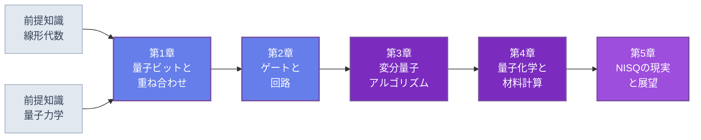

🌐 JP | [🇬🇧 EN](<../../../en/FM/quantum-computing-introduction/index.html>) | Last sync: 2026-08-12

[AI寺子屋トップ](<../../index.html>)›[基礎数理道場](<../index.html>)›[量子コンピューティング入門](<index.html>)

[← 基礎数理道場トップ](<../index.html>)

## 🎯 シリーズ概要

本シリーズは、計算機科学の専門家ではなく**材料科学・化学の研究者**を読者として想定しています。出発点は、すでに皆さんが抱えている問題です。強相関物質の電子構造は、軌道数に対して次元が指数関数的に増大する波動関数で記述され、古典計算機をどれだけ増強してもこのスケーリング自体は変わりません。量子コンピュータはまさにその種の対象をそのまま保持する装置であり、だからこそ物質の量子シミュレーションは — 暗号解読でも機械学習でもなく — 物理的な動機が最も明確な応用なのです。

全5章では、1量子ビットから分子の基底状態の変分計算までを最短の誠実な経路でたどり、そのうえでより難しい問いに向き合います。すなわち、現実に存在するノイズの多い装置で何ができ、何ができないのかという問いです。実装は**NumPyのみ**を用い、100行に満たないコードが状態ベクトルシミュレータの役割を果たします。したがって、いかなる結果も「信じるしかないフレームワーク」に依存しません。Qiskit・PennyLane・Cirqは第5章でエコシステムの地図として紹介するにとどめ、それらが何を計算しているのかを理解した後に触れる構成にしています。

叙述の温度は意図的に低く保っています。量子コンピューティングは確かな物理的根拠をもつ一方で、デモンストレーションと実用の間に大きな隔たりがある研究分野です。材料研究者にとって有益なのは、見出しに並ぶ主張の一覧よりも、その隔たりがどこにあるかを知ることです。

### 学習パス

第1章と第2章で形式論とシミュレータを構築します。第3章と第4章は本シリーズが存在する理由そのもの、すなわち変分アルゴリズムと電子構造問題です。第5章は現実性の検証であり、読み飛ばしてよい章ではありません。

### 📋 学習目標

本シリーズを修了すると、以下のことができるようになります。

  * 量子状態を規格化された複素ベクトルとして記述し、Born則から測定確率を計算し、\\(n\\) 量子ビットの状態空間が次元 \\(2^n\\) をもつ理由 — full CIを制限するのと同じ指数の壁 — を説明できる
  * NumPyでゼロから状態ベクトルシミュレータ（状態準備、1・2量子ビットゲート、サンプリング、Pauli期待値）を実装し、本シリーズの主張をすべて数値的に検証できる
  * パラメータ化回路を構成し、Pauli分解したハミルトニアンの期待値を測定し、古典最適化器と組み合わせて変分量子固有値ソルバー（VQE）を一通り動かせる
  * 第二量子化とJordan-Wigner変換によって電子構造問題を量子ビットに写像し、得られた量子ビットハミルトニアンを厳密対角化と比較できる
  * 材料科学に関する量子コンピューティングの主張を、報道発表の算術ではなく物理的な根拠 — デコヒーレンス時間、回路深さ、測定コスト、誤り訂正のオーバーヘッド — に基づいて評価できる

### 📖 前提知識

**必須。** 固有値問題、エルミート行列とユニタリ行列、Kronecker積の水準の線形代数：[線形代数とテンソル解析](<../linear-algebra-tensor/index.html>)を参照してください。状態ベクトル、演算子、測定、変分原理の水準の量子力学：[量子力学入門](<../quantum-mechanics/index.html>)を参照してください。第3章はそちらで扱う変分法を前提とし、第4章は[場の量子論入門](<../quantum-field-theory-introduction/index.html>)で導入される第二量子化を前提とします。

**必須。** Python 3.8以降とNumPy。第3章では `scipy.optimize` を使用し、いくつかの章でMatplotlibによる作図を行います。それ以外は不要です。量子SDKのインストールは一切必要ありません。

**不要。** 量子コンピューティング、量子情報理論、計算複雑性理論の予備知識。回路図、ゲート集合、エンタングルメントの尺度は、最初に必要となる箇所で導入します。

* * *

## 📚 章構成

### 第1章：量子ビットと重ね合わせ

電子構造問題が指数関数的に困難である理由と、量子ビットレジスタがまさにその困難の源である対象を保持する仕組み。状態ベクトルとディラック記法、規格化、大域位相と相対位相の違い、Bloch球、測定とBorn則、収縮、そして多量子ビットレジスタのテンソル積構造を扱います。最後にミニシミュレータの最初の3関数 — `ket`、`probs`、`sample` — をNumPyで実装します。

**主要トピック** ：状態ベクトル · ディラック記法 · 重ね合わせ · Bloch球 · Born則 · テンソル積 · 指数的スケーリング

💻 コード例8個 ⏱️ 30-35分 📊 初級

[第1章を読む →](<chapter-1.html>)

### 第2章：量子ゲートと回路

Schrödinger方程式の離散版としてのユニタリ発展と、すべてのゲートが可逆である理由。1量子ビットゲート X, Y, Z, H, S, T と回転ゲート \\(R_x, R_y, R_z\\)、2量子ビットゲート CNOT・CZ、および一般の制御ユニタリ。Bell状態と、回路上のエンタングルメントが量子物質の多体もつれとどう接続するか。回路記法、普遍ゲート集合、そしてテンソルreshape方式の `apply_gate`、`cnot`、`expval` によるミニシミュレータの完成。

**主要トピック** ：ユニタリ発展 · Pauliゲートとクリフォードゲート · 回転ゲート · CNOT · エンタングルメント · 普遍ゲート集合 · 回路シミュレーション

💻 コード例8個 ⏱️ 35-40分 📊 中級

[第2章を読む →](<chapter-2.html>)

### 第3章：変分量子固有値ソルバー（VQE）

化学分野における近未来の期待の大半を担うアルゴリズムです。現在のハードウェアで位相推定ではなく変分法を選ぶ理由、パラメータ化回路とansatzの設計（hardware-efficient層から化学的動機に基づく形式まで）、観測量のPauli分解とその期待値測定、勾配フリー法とparameter-shift則による古典最適化ループを扱います。H₂分子の2量子ビット縮約ハミルトニアンについて完全なVQEを実装し、結合長を変えたエネルギー曲線を厳密対角化と比較します。最後に本質的な2つの限界、barren plateauと測定コストを論じます。

**主要トピック** ：変分原理 · ansatz設計 · Pauli分解 · parameter-shift則 · H₂ポテンシャル曲線 · barren plateau

💻 コード例9個 ⏱️ 40-45分 📊 上級

[第3章を読む →](<chapter-3.html>)

### 第4章：量子化学・材料計算への応用

応用の中心となる章です。電子構造問題のスケーリングと、密度汎関数理論が力を失う領域＝強相関系。第二量子化とフェルミオン演算子、実装を伴うJordan-Wigner変換、デジタル量子シミュレーションとアナログ量子シミュレーションの違い。同じ問題の耐故障型と近未来型の顔としての量子位相推定（QPE）とVQEの対比。材料科学におけるターゲット問題 — スピン模型、Hubbard模型、FeMocoのような触媒、電池材料 — について、どれが本当に有望かを評価します。小規模Hubbard模型と横磁場Ising鎖の量子ビットハミルトニアンを構成し、厳密対角化とVQEを比較します。

**主要トピック** ：full CIのスケーリング · 第二量子化 · Jordan-Wigner変換 · QPEとVQE · Hubbard模型 · 横磁場Ising模型 · 強相関物質

💻 コード例6個 ⏱️ 40-45分 📊 上級

[第4章を読む →](<chapter-4.html>)

### 第5章：NISQの現実と展望

ノイズの物理：\\(T_1\\)・\\(T_2\\) 時間を伴うデコヒーレンス、ゲートエラー、そしてそれらを記述するのに必要な最小限の密度行列形式。軌跡法による脱分極チャネルのシミュレーションで、回路深さに対する忠実度の減衰を示します。zero-noise extrapolationのような誤り緩和と、表面符号による誤り訂正 — オーバーヘッドは約束ではなく桁数として提示します。ノイズの多い装置が材料研究に対してできること・できないことの現実的な評価、「量子優位性」の発表の読み方、そして物理原理から判断するための基準。最後にソフトウェアエコシステム、参考文献、学習ロードマップをまとめます。

**主要トピック** ：T₁/T₂デコヒーレンス · 密度行列 · 脱分極チャネル · zero-noise extrapolation · 表面符号 · 現実的評価 · Qiskit / PennyLane / Cirq

💻 コード例5個 ⏱️ 40-45分 📊 上級

[第5章を読む →](<chapter-5.html>)

* * *

## 🔤 本シリーズで用いる記法

本シリーズでは第1章で記法を一度固定し、以後変更しません。どの章のコードも他の章のコードと組み合わせて実行できます。

| 記号 | 意味 |
| --- | --- |
| \\(\lvert 0\rangle, \lvert 1\rangle\\) | 1量子ビットの計算基底状態 |
| \\(\lvert\psi\rangle = \alpha\lvert 0\rangle + \beta\lvert 1\rangle\\) | 一般の量子ビット状態（\\(\lvert\alpha\rvert^2 + \lvert\beta\rvert^2 = 1\\)） |
| \\(\lvert q_0 q_1 \ldots q_{n-1}\rangle\\) | \\(n\\) 量子ビットレジスタの基底状態 |
| X, Y, Z | Pauliゲート |
| H, S, T | Hadamardゲート、位相ゲート、\\(\pi/8\\) ゲート |
| \\(R_x(\theta), R_y(\theta), R_z(\theta)\\) | Bloch軸まわりの1量子ビット回転 |
| CNOT, CZ | 制御NOTゲート、制御Zゲート |
| \\(H = c_0\,II + c_1\,ZI + \cdots\\) | Pauli文字列の線形結合としてのハミルトニアン |

**量子ビットの順序。** 量子ビット0を**左端**かつ**最上位**ビットとします。したがって基底状態 \\(\lvert q_0 q_1 \ldots q_{n-1}\rangle\\) は状態ベクトルの \\(\sum_i q_i 2^{\,n-1-i}\\) 番目の成分に対応します。これはQiskitが採用していない側の規約であり、2つの規約を混ぜることは量子計算のコードで最も多い「静かなバグ」の原因です。第1章ではこの規約を明示し、コードで検証します。

### ミニシミュレータ

本シリーズ全体は1つの小さなモジュールの上で動きます。第1章と第2章で組み立て、以後は変更せずに再利用します。

| 関数 | 導入章 | 役割 |
| --- | --- | --- |
| `ket(bits)` | 第1章 | ビット列から基底状態を作る（例：`ket('01')`） |
| `probs(state)` | 第1章 | Born則の確率 \\(\lvert\text{amp}\rvert^2\\) |
| `sample(state, shots, seed=None)` | 第1章 | 測定サンプリング（カウント辞書を返す） |
| `I2, X, Y, Z, H, S, T` | 第2章 | \\(2\times2\\) のゲート行列 |
| `rx/ry/rz(theta)` | 第2章 | 回転ゲートの行列 |
| `apply_gate(state, U, targets, n)` | 第2章 | テンソルreshapeによるゲート作用 |
| `cnot(state, control, target, n)` | 第2章 | 2量子ビットのエンタングリングゲート |
| `expval(state, pauli, coeff_map=None)` | 第2章 | **1本**のPauli文字列の期待値。`coeff_map` があれば `coeff_map[pauli]` 倍。ハミルトニアン全体は `sum(expval(psi, p, terms) for p in terms)` |

各章は必要な実装を再掲するため、どの章も単独で実行できます。

* * *

## 🔍 本シリーズの範囲

**本シリーズは物理の講座です。** すべてのアルゴリズムを状態・演算子・測定に関する主張として提示し、すべての主張を自作のシミュレータ上で数値的に検証します。

**量子アルゴリズムの網羅的なサーベイではありません。** ShorのアルゴリズムとGroverのアルゴリズムは補足的に触れるだけです。材料研究者がこのハードウェアに目を向ける理由は、そのどちらでもないからです。

**ハードウェアの講座ではありません。** 超伝導量子ビット、イオントラップ、中性原子には、エラー特性が議論に関わる箇所で言及するにとどめます。

**宣伝ではありません。** 誠実な答えが「まだできない、そしてその物理的な理由はこうである」となる場合には、そのように書きます。

## 📚 推奨学習パス

### パターン1：完全習得コース（6〜8日）

  * 1日目：第1章 — 量子ビット、重ね合わせ、測定。コード例8個をすべて実行
  * 2日目：第2章 — ゲートと回路。シミュレータを完成させて保存
  * 3日目：第3章 3.1〜3.4 — 変分法のレシピ
  * 4日目：第3章 3.5〜3.6 — H₂曲線を端から端まで
  * 5日目：第4章 4.1〜4.4 — フェルミオンから量子ビットへ
  * 6日目：第4章 4.5〜4.6 — 材料科学のモデルハミルトニアン
  * 7日目：第5章 — ノイズ、誤り緩和、現実的な展望
  * 8日目：演習と、自分自身の問題への適用を1つ

### パターン2：物理の素養がある人向け速習コース（3日）

  * 1日目：第1〜2章（形式論は流し読み、コードはすべて実行）
  * 2日目：第3章を通読 — ここがアルゴリズムの核心
  * 3日目：第4〜5章（4.5節と5.4節を重点的に）

### パターン3：意思決定者向けコース（半日）

  * 1.1節 — そもそもなぜこの問題が難しいのか
  * 3.1節と3.6節 — VQEが約束するものと、それを制限するもの
  * 4.5節と5.3〜5.5節 — どの材料問題が現実的なターゲットで、その到達コストはどれほどか

## 🎯 総合的な学習成果

### 知識レベル

  * ✅ 重ね合わせ、エンタングルメント、測定を比喩に頼らず演算子の言葉で説明できる
  * ✅ 古典的な厳密対角化と対応する量子ビットレジスタの資源スケーリングを述べられる
  * ✅ VQEをハイブリッドアルゴリズムとして記述し、そのコストの各要素を指摘できる
  * ✅ フェルミオンの反対称性が量子ビットへの写像後にどう保たれるかを説明できる

### 実践スキル

  * ✅ 空のファイルからNumPyで状態ベクトルシミュレータを実装できる
  * ✅ Pauli文字列ハミルトニアンを構成し、その期待値を評価できる
  * ✅ ショットノイズの影響を含めて変分最適化ループを実行・デバッグできる
  * ✅ 小規模系では常に厳密対角化と照合して量子計算の結果を検証できる

### 応用力

  * ✅ 自分の研究課題のうち、どれが量子シミュレーションの候補でどれがそうでないかを判別できる
  * ✅ 提案された計算に必要な量子ビット数、回路深さ、ショット予算を見積もれる
  * ✅ 材料科学における量子コンピューティングの論文・発表を読み、その実際の主張を特定できる

## 🛠️ 使用技術・ツール

### 主要ライブラリ

  * **numpy** — 本シリーズのすべてのシミュレータ
  * **scipy** — 第3章の古典最適化器、疎ハミルトニアンの厳密対角化
  * **matplotlib** — ポテンシャル曲線、Bloch球、忠実度の減衰

### 第5章でのみ参照

  * **Qiskit** 、**PennyLane** 、**Cirq** — エコシステムとして紹介するのみで、本文を追うのに必須ではありません

### 開発環境

  * **Python** ：3.8以上
  * **Jupyter Notebook** ：コード例は短く探索的なものが多いため推奨します
  * Google Colabで全コード例が動作します。GPUも量子バックエンドも不要です

## 🚀 次のステップ

### さらに深く学ぶ

  * 量子誤り訂正と耐故障アーキテクチャ
  * テンソルネットワーク法（DMRG、PEPS） — 量子計算のあらゆる主張が超えねばならない古典側の競合相手
  * 量子モンテカルロ法と符号問題

### 関連シリーズ

  * [量子力学入門](<../quantum-mechanics/index.html>) — 変分原理、摂動論
  * [場の量子論入門](<../quantum-field-theory-introduction/index.html>) — 第二量子化、生成消滅演算子
  * [線形代数とテンソル解析](<../linear-algebra-tensor/index.html>) — 固有値問題、Kronecker積、テンソル縮約

### 実践プロジェクト

  * ミニシミュレータを密度行列と任意のノイズチャネルに拡張する
  * 公開されている2量子ビットまたは4量子ビットのVQE結果を再現し、そのショット予算を定量化する
  * 自身の研究に現れる格子模型の量子ビットハミルトニアンを構成し、厳密対角化する

### 免責事項

  * 本コンテンツは教育・研究・情報提供のみを目的としており、専門的な助言(法律・会計・技術的保証など)を提供するものではありません。
  * 本コンテンツおよび付随するCode examplesは「現状有姿(AS IS)」で提供され、明示または黙示を問わず、商品性、特定目的適合性、権利非侵害、正確性・完全性、動作・安全性等いかなる保証もしません。
  * 外部リンク、第三者が提供するデータ・ツール・ライブラリ等の内容・可用性・安全性について、作成者および東北大学は一切の責任を負いません。
  * 本コンテンツの利用・実行・解釈により直接的・間接的・付随的・特別・結果的・懲罰的損害が生じた場合でも、適用法で許容される最大限の範囲で、作成者および東北大学は責任を負いません。
  * 本コンテンツの内容は、予告なく変更・更新・提供停止されることがあります。
  * 本コンテンツの著作権・ライセンスは明記された条件(例: CC BY 4.0)に従います。当該ライセンスは通常、無保証条項を含みます。
