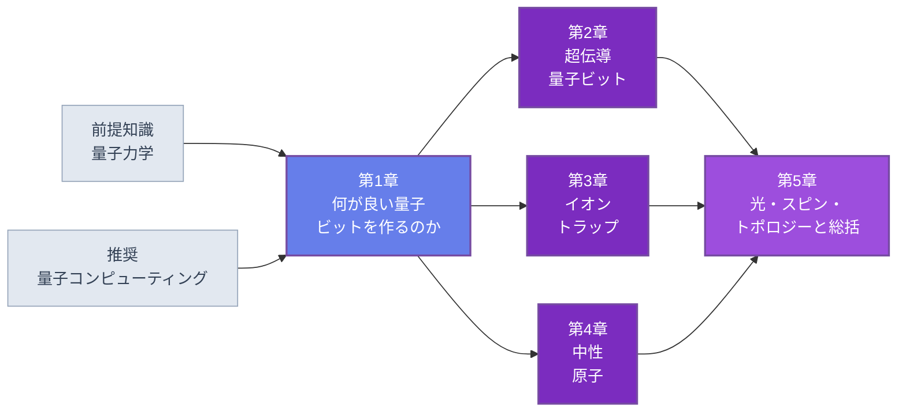

🌐 JP | [🇬🇧 EN](<../../../en/FM/quantum-hardware-introduction/index.html>) | Last sync: 2026-08-13

[AI寺子屋トップ](<../../index.html>)›[基礎数理道場](<../index.html>)›[量子ハードウェア入門](<index.html>)

[← 基礎数理道場トップ](<../index.html>)

## 🎯 シリーズ概要

本シリーズは[量子コンピューティング入門](<../quantum-computing-introduction/index.html>)の対をなす巻です。あちらのコースは自らがハードウェアの講座ではないと明言しています。超伝導量子ビット、イオントラップ、中性原子はそこでは誤差特性が関係する箇所にのみ登場し、デコヒーレンスはノイズモデルのパラメータとして入ってきます。本コースはまさにその空白を埋めます。アルゴリズム編が「量子コンピュータは何を計算しうるか」を問うのに対し、本コースは「量子コンピュータは何でできていなければならないか」、そして「なぜどの候補も材料科学者が見覚えのある何かに律速されるのか」を問います。

貫く視点は副題に掲げたとおりで、各章でそれを擁護します。すなわち**量子ハードウェアは材料の問題である**ということです。超伝導量子ビットのコヒーレンスは、数ナノメートルのアモルファス表面酸化膜中の2準位欠陥が決めます。シリコン中スピン量子ビットのコヒーレンスは、残留 $^{29}\mathrm{Si}$ 濃度と酸化膜界面のトラップが決めます。イオントラップを制限する運動加熱は、電極表面の電場ノイズから来ます。トポロジカルな提案は半導体-超伝導界面の品質で立つか倒れるかが決まります。いずれの場合も素子の性能指標 — $T_1$、$T_2^\ast$、Q値 — は材料分野の量にそのまま翻訳できます。損失角、界面トラップ密度、同位体純度、表面参加率です。

全5章で1方式ずつを扱い、その前に、比較の言語を固定する第1章を置きます。叙述は宣伝的ではなく意図して物理的です。「材料がまだ十分でない、そしてそれはこの材料だ」が誠実な答えであるときはそう述べます。想定読者にとってそれは興味深い答えです。仕事がどこにあるかを教えてくれるからです。

### 学習パス

第1章は省略できません。$T_1$、$T_2$、$T_2^\ast$、6本の比較軸、そして他の4章が再説せずに用いる単位の約束を定義します。第2章・第3章・第4章は互いに独立で、どの順に読んでも、1章だけ読んでも構いません。第5章は残る方式をまとめたうえで第1章の軸に沿ってすべてを比較しますから、最後に読んでください。

### 📋 学習目標

本シリーズを修了すると、以下のことができるようになります。

  * DiVincenzo基準を挙げ、それぞれについてどの素子・材料の物理的性質が制約となるかを述べられる
  * $T_1$、$T_2$、$T_2^\ast$ を厳密に定義し、$T_2 \le 2T_1$ の限界を導き、それぞれが環境ノイズスペクトルのどの部分を測っているかを説明できる
  * 各主要方式の機構をハミルトニアンから説明できる。トランズモンのジョセフソン非線形性、イオン鎖の共有運動モード、中性原子配列のRydberg封鎖、二重量子ドットの交換相互作用
  * トランズモンの非調和性を数値対角化で導き、Paulトラップの Mathieu 安定図を計算し、Rydberg封鎖のダイナミクスをシミュレートし、交換結合した二重ドットを対角化する。すなわち各機構を受け入れるのではなく数値的に検証できる
  * 任意の方式について、現在コヒーレンスを制限している材料チャネルを特定し、その診断を確定させる測定を挙げられる
  * ハードウェアに関する主張を、引用された装置スペックではなく物理的な根拠 — エネルギースケール、スケーリング則、接続性、ノイズスペクトル — に基づいて読める

### 📖 前提知識

**必須。** 2準位系、調和振動子、時間依存摂動論、回転波近似の水準の量子力学：[量子力学入門](<../quantum-mechanics/index.html>)を参照してください。第2章は量子化したLC回路、第3章は Mathieu 方程式とサイドバンド遷移、第4章はACシュタルクシフトを用います。

**推奨。** [量子コンピューティング入門](<../quantum-computing-introduction/index.html>)。本シリーズはそちらで確立した量子ビットの順序、ゲート記号、状態ベクトルの規約を用い、第5章はそちらの誤り訂正の記述を参照します。2つを併せて読むことが想定された体験ですが、物理面では本コースは自己完結しています。

**必須。** Python 3.8以降とNumPy、SciPy、Matplotlib。すべてのコード例は素のNumPyまたはSciPyであり、量子SDKもハードウェアバックエンドもシリーズ中に一切登場しません。

**あると有用（必須ではない）。** 第2章のための固体物理 — [超伝導入門](<../../MS/superconductivity-introduction/index.html>)が、第2章で1節に要約するCooper対形成とジョセフソン物理を扱っています — と、第5章のスピン量子ビットの節のための[スピントロニクス入門](<../../MS/spintronics-introduction/index.html>)。

* * *

## 📚 章構成

### 第1章：何が良い量子ビットを作るのか

良い量子ビットが同時に相反する2つのものでなければならない理由と、自然の方式と人工の方式がその矛盾をどう別々に解消しているか。DiVincenzo基準とその各項目の物理的内容。6本の比較軸 — コヒーレンス、ゲート忠実度と速度、接続性、再現性と歩留まり、動作温度、スケーラビリティ — を挙げ、いずれか1本で順位づけすると勝者が変わることを定量的に示します。デコヒーレンスの共通言語：$T_1$、$T_2$、$T_2^\ast$、ノイズパワースペクトル密度、2準位揺動子による $1/f$ ノイズ、そしてフィルター関数。最後に、Rabi振動、自由誘導減衰、Ramsey縞、Hahnエコー、CPMG動的デカップリングを第一原理から再現するBloch方程式の実験室を構築します。

**主要トピック** ：DiVincenzo基準 · 比較の軸 · $T_1$ / $T_2$ / $T_2^\ast$ · ノイズパワースペクトル密度 · $1/f$ ノイズとTLS · Bloch方程式 · Ramsey測定とエコー · CPMGスケーリング

💻 コード例7個 ⏱️ 40-45分 📊 中級

[第1章を読む →](<chapter-1.html>)

### 第2章：超伝導量子ビット

超伝導とジョセフソン効果を、Cooper対形成から2つのジョセフソン関係式まで。LC回路の量子化と、人工原子がそもそも非線形素子を必要とする理由。トランズモン：コサインポテンシャル、非調和性、そして $E_J/E_C$ を大きくするにつれて非調和性を電荷ノイズ不感性と引き換える構造。マイクロ波パルスによる制御と分散読み出し、そしてそれに必要な最小限の回路QED。2量子ビットゲートの機構 — 容量結合、チューナブルカプラ、cross-resonance。最後にデコヒーレンスの材料科学：表面および界面酸化膜中の2準位系、誘電損失の参加率解析、非平衡準粒子、基板の選択。

**主要トピック** ：ジョセフソン関係式 · 回路の量子化 · トランズモン · 非調和性 · $E_J/E_C$ と電荷分散 · 分散読み出し · チューナブルカプラ · cross-resonance と周波数衝突 · TLSと参加率 · 準粒子

💻 コード例7個 ⏱️ 45-50分 📊 上級

[第2章を読む →](<chapter-2.html>)

### 第3章：イオントラップ

Paulトラップの物理：Mathieu方程式、擬ポテンシャル、そして安定領域。量子ビットの担い手 — 超微細準位と光学遷移の対比、そしてクロック遷移が特別である理由。レーザー冷却とサイドバンド分光を、Doppler冷却から単一運動モードの分解サイドバンド冷却まで。共有フォノンモードに基づくゲート機構を、Cirac-Zoller方式からそれに取って代わったMølmer-Sørensenゲートまで。全結合性とその代償：ゲート速度、モードの混雑、イオン数に対するスケーリング。最後に工学・材料上の課題 — トラップ表面に由来する異常加熱、真空、そして光学系の複雑さ。

**主要トピック** ：Mathieu方程式 · 擬ポテンシャル · 安定領域 · 超微細量子ビットと光学量子ビット · サイドバンド冷却 · Mølmer-Sørensenゲート · 全結合性 · 異常加熱

💻 コード例7個 ⏱️ 45-50分 📊 上級

[第3章を読む →](<chapter-3.html>)

### 第4章：中性原子

レーザー冷却を散乱力から光モラセス、磁気光学トラップまで。光ツイーザーと原子配列：双極子力、再配置、そしてそこから従う任意のジオメトリ。Rydberg状態と封鎖効果を、相互作用の $n^{11}$ スケーリング、封鎖半径、$C_6$ 係数とともに。ゲートと、この方式を特徴づける2つの動作様式 — デジタルゲートと、Isingハミルトニアンを直接実装するアナログ量子シミュレーション。最後に誠実な評価：中規模レジスタへの自然なスケーリングと、それに対する原子損失、ゲート忠実度の物理的限界、そして破壊的な読み出し。

**主要トピック** ：光モラセスとMOT · 双極子力 · 光ツイーザー · Rydberg封鎖 · $C_6$ と封鎖半径 · デジタル動作とアナログ動作 · 原子損失 · 破壊的読み出し

💻 コード例6個 ⏱️ 40-45分 📊 上級

[第4章を読む →](<chapter-4.html>)

### 第5章：光・半導体スピン・トポロジカル、そして総括

残る方式群と、それに続く比較。光量子計算：単一光子、光を相互作用させることの困難さ、そして測定型の方式とガウシアンボソンサンプリングが実際にどこに位置するのか。半導体スピン量子ビット：量子ドット、交換相互作用、そしてシリコンの同位体精製 — 材料の議論が方式の見通しを決める、本シリーズで最も明快な事例です。トポロジカル量子計算：非可換エニオンとMajoranaモード、保護が本質的である理由とそれが覆わないもの（準粒子ポイズニング）、そして原理実証と実用の距離についての率直な記述。続くスコアカードは第1章の軸に沿って全方式を比較します。数値の記録ではなく物理的制約によって比較し、まだ勝者はいないことを明言します。最後に、これらすべてが材料研究者にとって何を意味するかを述べます。

**主要トピック** ：線形光学とKLM · 測定型量子計算 · 量子ドットスピン量子ビット · 交換相互作用 · $^{28}\mathrm{Si}$ 精製 · Majoranaモード · 非可換統計 · 準粒子ポイズニング · 方式間スコアカード

💻 コード例6個 ⏱️ 45-50分 📊 上級

[第5章を読む →](<chapter-5.html>)

* * *

## 🔤 記法と単位

規約は第1章で固定し、以後変更しません。どの章の数式やコードも他の章と組み合わせて使えます。

| 記号 | 意味 |
| --- | --- |
| $\hbar = 1$ | ハミルトニアンは換算単位で書く。物理的なエネルギーでは $\hbar$ を明示的に復元する |
| $\omega_q$、$\omega_d$ | 量子ビットと駆動の角周波数（rad/s）。引用時は $\omega/2\pi$ を Hz で |
| $\Omega$ | Rabi周波数（角）。$\pi$ パルスは $\pi/\Omega$ を要する |
| $\Delta = \omega_q - \omega_d$ | 離調（角） |
| $T_1$ | エネルギー緩和時間（縦） |
| $T_2$ | エコー後のコヒーレンス時間。$1/T_2 = 1/(2T_1) + 1/T_\varphi$ |
| $T_2^\ast$ | エコーなしのコヒーレンス時間。静的な不均一性を含む |
| $S(f)$ | 片側ノイズパワースペクトル密度。$\langle\delta\omega^2\rangle = \int_0^\infty S\,df$ |
| $E_J$、$E_C$ | 超伝導回路のジョセフソンエネルギーと充電エネルギー（第2章） |
| $\eta$ | 捕獲イオンのLamb-Dickeパラメータ（第3章） |
| $C_6$、$R_b$ | Rydberg相互作用係数と封鎖半径（第4章） |
| $J$ | 二重量子ドットの交換結合（第5章） |
| $X, Y, Z, H$、CNOT | ゲート記号。姉妹コースと同一 |

**エネルギー単位。** 超伝導回路は GHz、イオントラップと中性原子は MHz、スピンは MHz またはテスラで表します。第1章で換算を一度示し — 1 GHz は 4.14 $\mu$eV に、そして 48 mK に対応します — 以降の各章はその分野の文献が用いる単位に従います。

**量子ビットの順序。** 量子ビット0が左端かつ最上位ビットであり、[量子コンピューティング入門](<../quantum-computing-introduction/index.html>)と完全に同一です。これはQiskitの規約とは逆です。

* * *

## 🔍 本シリーズの範囲

**本シリーズは**物理と材料の講座です。各方式をハミルトニアンから提示し、各機構を小規模で数値的に検証し、各コヒーレンス限界を物理的な起源まで辿ります。

**性能レコード表ではありません。** 量子ビット数、忠実度の記録、引用された装置スペックは全5章のどこにも登場しません。そうした数値は読まれる前に古くなり、しかも説明の力をもちません。スケーリング則、選択則、参加率の議論は真であり続けます。

**ベンダー比較ではありません。** 企業のロードマップ、製品名、どこが先行しているかの評価は扱いません。方式を比較する箇所では物理的制約で比較し、第5章はまだ勝者がいないことを明言します。

**アルゴリズムの講座ではありません。** これらの装置が何を計算するのか、そしてなぜ材料研究者がそもそも関心をもつべきなのかは[量子コンピューティング入門](<../quantum-computing-introduction/index.html>)をお読みください。本コースはその対の片方です。

**宣伝ではありません。** 「まだできない、そして改善されるべき材料はこれだ」が誠実な答えであるときは、それが返ってくる答えです。

## 📚 推奨学習パス

### パターン1：完全習得コース（6-7日）

  * 1日目：第1章 1.1-1.5節 — 基準、軸、デコヒーレンスの言語
  * 2日目：第1章 1.6節 — その5つのコード例を実行し（コード例1〜2は1.1節と1.3節にあります）、Ramsey/エコーの分離を自分で再現する
  * 3日目：第2章 — 超伝導量子ビット。TLSと参加率の節で締める
  * 4日目：第3章 — イオントラップ
  * 5日目：第4章 — 中性原子
  * 6日目：第5章 5.1-5.3節 — 光、スピン、トポロジー
  * 7日目：第5章 5.4-5.5節と演習 — スコアカードと、それが自分の研究に何を意味するか

### パターン2：1方式を深く（1日）

  * 第1章 1.2-1.4節 — 他を読むのに足る言語
  * 関心のある方式の章を、コードまで含めて通読
  * 第5章 5.4節 — その方式が他と比べてどこに位置するか

### パターン3：材料研究者コース（半日）

  * 1.5節 — 本コースの立場と、各方式を制限しているものの表
  * 2.6節 — 誘電損失、TLS、参加率解析。本シリーズで最も踏み込んだ材料の議論
  * 3.6節 — トラップ表面に由来する異常加熱
  * 5.2節と5.5節 — 同位体精製と、材料科学が貢献しうる余地

## 🎯 総合学習成果

### 知識レベル

  * ✅ DiVincenzo基準と6本の比較軸を挙げ、軸が物理的に結合している理由を説明できる
  * ✅ 各主要方式の動作原理をハミルトニアンから説明できる
  * ✅ $T_1$、$T_2$、$T_2^\ast$ を定義し、それぞれが環境のどの周波数域を探っているかを言える
  * ✅ 各方式で支配的な、材料に律速されたデコヒーレンスチャネルを挙げられる

### 実践スキル

  * ✅ Bloch方程式を積分し、Rabi・Ramsey・エコー・CPMGの測定を数値的に再現できる
  * ✅ トランズモンのハミルトニアンを電荷基底で対角化し、非調和性と電荷分散を取り出せる
  * ✅ Mathieu安定図、Rydberg封鎖の時間発展、交換結合した2スピンのスペクトルを計算できる
  * ✅ エネルギースケール、動作温度、ゲート予算を第一原理から見積もれる

### 応用力

  * ✅ ハードウェアの論文を読み、装置スペックとは切り離してその物理的主張を特定できる
  * ✅ 一組のコヒーレンス測定から、どのノイズ帯域したがってどの欠陥集団が変化したかを診断できる
  * ✅ 自分の材料分野の専門性が本分野の現在の律速要因と交わる場所を見つけられる

## 🛠️ 使用技術・ツール

### 主要ライブラリ

  * **numpy** — 本シリーズのすべてのシミュレーション
  * **scipy** — Bloch方程式のODE積分、固有値問題、Mathieu方程式のための特殊関数
  * **matplotlib** — コヒーレンス曲線、安定図、ポテンシャル形状

### 開発環境

  * **Python** : 3.8以上
  * **Jupyter Notebook** : 推奨。ほとんどの例が短く探索的なため
  * Google Colabですべての例が動作します。GPU、量子バックエンド、実験装置はいずれも不要です

## 🚀 次のステップ

### 発展学習

  * 回路量子電磁力学。分散読み出しとパラメトリック増幅を本格的に扱う水準で
  * ミリケルビンにおけるアモルファス誘電体のマイクロ波損失。結果と同じくらい測定技術を
  * 量子誤り訂正と耐故障アーキテクチャ。そして符号の選択が方式の提供する接続性にどう依存するか
  * トラップ電極と浅い欠陥中心の表面科学

### 関連シリーズ

  * [量子コンピューティング入門](<../quantum-computing-introduction/index.html>) — この対のアルゴリズム側
  * [量子機械学習入門](<../../MI/quantum-machine-learning-introduction/index.html>) — MI側での応用と、古典ベースラインに勝てるかの誠実な検証
  * [量子力学入門](<../quantum-mechanics/index.html>) — 2準位系、調和振動子、摂動論
  * [超伝導入門](<../../MS/superconductivity-introduction/index.html>) — Cooper対形成とジョセフソン効果を本格的に
  * [スピントロニクス入門](<../../MS/spintronics-introduction/index.html>) — スピン輸送、交換相互作用、磁性材料

### 実践プロジェクト

  * 第1章の道具箱を2量子ビットに拡張し、相関ノイズ下での2量子ビットゲートをシミュレートする
  * 公表された $T_1$ または $Q_i$ のデータを取り、参加率モデルで表面損失角を抽出する
  * 模擬データに対してCPMGノイズ分光を実装し、3桁にわたって $S(f)$ を復元する
  * 選んだ方式について、仮想的な1000量子ビット機の冷却および制御チャネルの予算を見積もる

### ⚠️ 免責事項

  * 本コンテンツは教育・研究・情報提供のみを目的としており、専門的な助言(法律・会計・技術的保証など)を提供するものではありません。
  * 本コンテンツおよび付随するCode examplesは「現状有姿(AS IS)」で提供され、明示または黙示を問わず、商品性、特定目的適合性、権利非侵害、正確性・完全性、動作・安全性等いかなる保証もしません。
  * 外部リンク、第三者が提供するデータ・ツール・ライブラリ等の内容・可用性・安全性について、作成者および東北大学は一切の責任を負いません。
  * 本コンテンツの利用・実行・解釈により直接的・間接的・付随的・特別・結果的・懲罰的損害が生じた場合でも、適用法で許容される最大限の範囲で、作成者および東北大学は責任を負いません。
  * 本コンテンツの内容は、予告なく変更・更新・提供停止されることがあります。
  * 本コンテンツの著作権・ライセンスは明記された条件(例: CC BY 4.0)に従います。当該ライセンスは通常、無保証条項を含みます。
