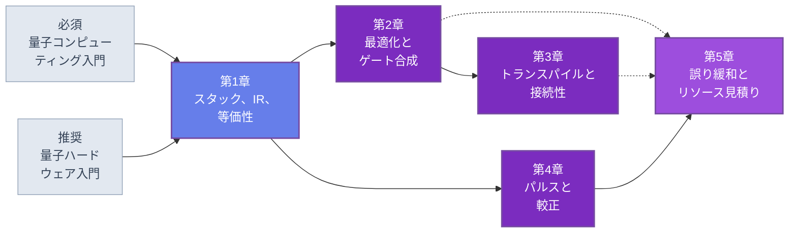

🌐 JP | [🇬🇧 EN](<../../../en/FM/quantum-software-stack-introduction/index.html>) | Last sync: 2026-08-13

[AI寺子屋トップ](<../../index.html>)›[基礎数理道場](<../index.html>)›[量子ソフトウェアスタック入門](<index.html>)

[← 基礎数理道場トップ](<../index.html>)

## 🎯 シリーズ概要

**これはSDKのチュートリアルではありません。SDKが何をしているかについての講座です。**

この区別が本シリーズの存在理由なので、正確に述べておく価値があります。数学として書かれた量子アルゴリズムと、整形されたマイクロ波あるいはレーザーパルスを受け取る機械の間には、6層のソフトウェアがあります。回路表現、最適化器、配置とルーティングの段、ゲート合成の段、較正ループを伴うパルスコンパイラ、そして測定結果の後処理器です。第1章の表が7層になっているのは、アルゴリズムそのものを第1層に数えているからです。現存するどの量子フレームワークもこれらの層を実装しています。そのどれもこれらを説明しません。ドキュメントはどの関数を呼ぶかを教えるために存在しており、その関数が何を解かなければならなかったかを教えるためには存在していないからです。

そこで本コースは、スタック全体のミニチュアをNumPyで、何もないところから作ります。第1章で回路の中間表現と、以降のすべての書き換えを守るユニタリ等価性チェッカ。第2章でピープホール最適化器と、1量子ビットおよび2量子ビットのゲート合成。第3章で接続性グラフ、レイアウト、SWAPルータ。第4章でRabi・Ramsey・DRAG較正を伴う3準位パルスシミュレータ。第5章で読み出し誤りの補正、ゼロノイズ外挿、確率的誤差キャンセル、そしてリソース見積り器。何も呼び出しません。すべて書き、走らせ、測ります。

見返りは、フレームワークの代わりにここのコードを使うべきだということではありません。使うべきではなく、第1章の最後の節はそれを明言します。見返りは、フレームワークのAPIは毎年変わり、その層は変わらないということです。トランスパイル後の回路を読んで*これは合成ではなくルーティングのせいで膨れた*と言えるようになり、基底ゲート集合を見てそのコンパイラがどの合成問題を解かなければならなかったかが分かり、1行も書く前にアルゴリズムの費用を見積れるようになれば、どのフレームワークのドキュメントも謎ではなく参照資料になります。本コースはその状態に到達させるために設計されています。

第2の約束は検証の規律であり、これが本シリーズの技術的な背骨です。コンパイラパスは回路の意味を保つときに正しく、量子回路にとって「同じ意味」には厳密で、しかも*検査可能な*定義があります。大域位相を除いて同じユニタリであることです。この5章のすべてのパスにはその検査が付いており、レジスタが小さいところでは全数、そうでないところではランダム状態で走ります。第1章がチェッカを作り、第2章はランダム生成した書き換え600件 — 200本の回路を3通りの最適化パイプラインに通したもの — の検証と、無操作の対照パイプライン200回の検証にそれを使い、第5章は緩和の回路に使います。これがまた、ハードウェアなしで本コースが誠実でいられる仕組みでもあります。主張は数値的に検査されるか、母数的な見積りとして提示されるかのどちらかであり、引用されることはありません。

### 学習パス

第1章は任意選択ではありません。他の4章が再説明せずに使う回路表現、量子ビット規約、等価性チェッカを固定します。そこから先はシリーズが分岐します。第2章と第3章がコンパイラの道で、ルーティングが合成の出力を消費するので順に読むのが最善です。第4章は第1章にしか依存しないので、関心がコンパイルではなく制御にある方は第1章の直後に読めます。第5章はすべての後に読むのが最善ですが、その依存はデータの流れではなく概念的なものです。他の層が直せないものに値札を付ける章であり、第2章のようにゲート数を読み、第3章のようにルーティングのオーバーヘッドを読み、第4章が測るように物理誤り率を読めることを前提とします。リソース見積り器そのものは自己完結しており、入力はハミルトニアンの1-ノルム、目標精度、ウォークのコスト、物理誤り率、論理量子ビット数だけで、前の章のコードからは何も取り込みません。上図の破線がこの種の依存を表しています。

### 📋 学習目標

本シリーズを修了すると、以下のことができるようになります。

  * アルゴリズムと制御波形の間にある層を挙げ、各層が何を消費して何を生産するかを述べ、各層がハードウェアのどの情報を必要とするかを正確に言える
  * 回路の中間表現と、それに伴う指標 — 深さ、ゲート数、2量子ビットゲート数 — を実装し、層の境界を固定するのがゲート集合の選択であることを説明できる
  * 大域位相除去付きのユニタリ等価性によってコンパイラパスが意味を保つことを検証し、制御ブロックの内側では大域位相を捨ててはいけない理由を説明できる
  * ピープホール最適化器を書き、任意の1量子ビットユニタリをEuler角で分解し、一般の2量子ビットユニタリが要求するCNOT数を述べられる
  * $T$ ゲートが高価なゲートである理由と、誤り訂正が入ったときに費用モデルがどう変わるかを説明できる
  * 接続性グラフを表現し、初期レイアウトを選び、SWAPゲートを挿入して回路をそこに載せ、全結合・格子・heavy-hexの各幾何でのオーバーヘッドを測れる
  * 3準位系をシミュレートし、矩形パルスからのリークを観測し、DRAGでそれを抑え、意図的にずらした母数を回復するRabi・Ramsey・DRAG係数の較正ループを走らせられる
  * 読み出し誤りの補正、ゼロノイズ外挿、確率的誤差キャンセルを実装し、それぞれが要求するサンプリング費用を測れる
  * 論理から物理へのリソース見積り — アルゴリズムの $T$ 数から符号距離、物理量子ビット数、実行時間まで — を、読んだ数値ではなく走らせられる関数として作れる

### 📖 前提知識

**必須。** [量子コンピューティング入門](<../quantum-computing-introduction/index.html>)、あるいは同等の習熟。状態ベクトルとユニタリゲート、ビッグエンディアンの量子ビット規約、同コース第2章の99行の状態ベクトルシミュレータ、そして第5章のノイズチャネルと誤り訂正の扱いです。本コースの各章は必要なシミュレータ関数を再掲しますが、物理を再導出することはありません。

**必須。** 線形代数。ユニタリ行列とエルミート行列、テンソル積、固有値分解、行列ノルム。第2章の合成の議論と第4章の3準位ダイナミクスはどちらも、行列積だけでなく固有値を必要とします。

**必須。** Python 3.8以降とNumPy、SciPy、Matplotlib。本シリーズには量子SDKもハードウェアバックエンドもどこにもありません。それが本シリーズの要点です。

**推奨。** [量子ハードウェア入門](<../quantum-hardware-introduction/index.html>)。第3章は接続性グラフをプラットフォームの物理の帰結として説明し — イオントラップは全結合、超伝導回路は疎 — 第4章は同コース第2章の共鳴駆動の物理を制御の言葉で再訪します。どちらの章もこれなしで読めますし、あるとかなり面白くなります。

**あると便利。** [量子アルゴリズム（中級）](<../quantum-algorithms-intermediate/index.html>)。このスタックがコンパイルを求められる回路のため、そして第5章が整合を保つリソース見積りの規約のためです。

* * *

## 📚 章構成

### 第1章: アルゴリズムからパルスまでのスタック

そもそもなぜ層があるのか、そして境界はどこにあるべきか。判定基準は各パスの入力がどれだけ生鮮であるかであり、それが7つの層を、慣例的に描かれるちょうどその順序に並べます。次に本コースの回路の中間表現 — ゲートタプル、ビッグエンディアンのワイヤ、`run_circuit`、`circuit_depth`、`gate_counts` — を固定し、層の境界を作るのはデータ構造についての何かではなくゲート集合の選択であることを論じます。コンパイルは意味を保つ書き換えとして定義され、使われている3つの正しさの関係（大域位相を除いて厳密、量子ビットの置換を除いて厳密、$\varepsilon$ の範囲で近似）と、そのうち第1のものを検査するユニタリ等価性チェッカを扱います。商用フレームワークがこれらの層を何と呼んでいるかの地図で締めくくります。今後数版に耐えるだけ一般的な言い方で述べ、そして残りの章がスタブを置き換えていく4段のコンパイラパイプラインを提示します。

**主要トピック** : 7つの層 · 生鮮度という層分けの基準 · データとしての回路IR · 層の境界としてのゲート集合 · 深さとその単位時間の仮定 · 3つの正しさの関係 · Hilbert-Schmidt重なりによる大域位相除去 · 制御ブロックの内側では大域位相が大域的でない理由 · 状態等価性とユニタリ等価性 · SDKの層の対応

💻 7個のCode Examples ⏱️ 45-50分 📊 中級

[第1章を読む →](<chapter-1.html>)

### 第2章: 回路最適化とゲート合成

ピープホール最適化器を構成する書き換え規則。隣接ゲートの融合、逆ゲートの相殺、そして2つのゲートを交換してよいかを決める交換規則です。任意の $U(2)$ を3回転に変えるEuler分解による1量子ビット合成を実装し、第1章のチェッカで検証します。2量子ビット合成では、概念としてのKAK分解、明示的な2CXと3CXの構成、そして終わったと言えるタイミングを教えてくれるCNOT数の下界を扱います。次にClifford$+T$と、$T$ ゲートが高価である理由。これはハードウェアについてではなく誤り訂正についての主張であり、第5章のリソース計算につながります。最後に測定です。ランダム回路上でピープホール最適化器を走らせて深さとゲート数の削減を記録し、すべての書き換えについてユニタリ等価性を検証します。

**主要トピック** : ゲートの融合と相殺 · 交換規則 · 回路恒等式 · EulerおよびZYZ分解 · KAK分解 · 2CXと3CXの構成 · CNOT数の下界 · Clifford$+T$ · $T$ 数 · 最適化器の全数等価性検証

💻 7個のCode Examples ⏱️ 45-50分 📊 上級

[第2章を読む →](<chapter-2.html>)

### 第3章: トランスパイル — 接続性への写像

物理の帰結としての接続性グラフ。共有ボゾンモードがすべての量子ビットを結合するところでは全結合、結合が容量的で周波数が衝突してはならないところでは2次元格子やheavy-hexグラフになります。配置問題 — プログラムの各量子ビットがどの物理量子ビットから始まるかを選ぶこと — を、なぜNP困難なのか、それでもなぜヒューリスティクスで足りるのかの誠実な説明とともに扱います。SWAP挿入によるルーティングと、現代のルータが使う前向き・後向きヒューリスティクスの背後にある原理。そして費用の測定です。接続性と回路構造の関数としてのSWAPオーバーヘッドを、合成ベンチマークの考え方とともに、ベンダーの数値なしで扱います。実装で締めくくります。グラフ表現、最近傍ルータ、3つの幾何に載せたGHZとQFT回路のSWAP数の比較、そして量子ビットの置換を含めたルーティング後の等価性検証です。

**主要トピック** : 結合グラフ · 全結合・格子・heavy-hex · 初期レイアウトの選択 · NP困難性とヒューリスティクスで足りる理由 · SWAP挿入 · 先読みルーティングのヒューリスティクス · 接続性に対するSWAPオーバーヘッド · 置換を除いた等価性

💻 7個のCode Examples ⏱️ 45-50分 📊 上級

[第3章を読む →](<chapter-3.html>)

### 第4章: パルスと較正

ゲートの下にあるもの。回転は共鳴駆動であり、ハードウェアコースの第2章の物理が制御の問題として再登場します。矩形パルスからガウシアン、DRAGへのパルス整形を、整形を必要にしているもの — 弱非調和系の計算部分空間からのリーク — から動機づけます。この層の特徴である較正ループ。Rabi振幅の較正、Ramsey干渉による周波数の較正、DRAG係数の較正であり、これらを合わせるとソフトウェアが自分の機械に対して実験を行っていることになります。ランダマイズドベンチマーキングと、それがゲート忠実度を状態準備・測定の誤りから分離できる理由。3準位パルスシミュレータで締めくくります。矩形パルスの下でリークを測ってDRAGで抑え、あらかじめ意図的にずらした母数を較正ループが回復し、シミュレートしたランダマイズドベンチマーキングから取り出したゲート誤りが設定値と一致することを見ます。

**主要トピック** : 共鳴駆動と回転座標系 · リークと非調和性 · ガウシアンとDRAGのパルス整形 · Rabi振幅較正 · Ramsey周波数較正 · DRAG係数較正 · ランダマイズドベンチマーキング · SPAM誤差とゲート誤差の分離

💻 9個のCode Examples ⏱️ 50-55分 📊 上級

[第4章を読む →](<chapter-4.html>)

### 第5章: ソフトウェアとしての誤り緩和とリソース見積り

誤り緩和を、実際にそうであるもの — 測定結果を後処理するソフトウェアの層 — として扱います。混同行列による読み出し誤りの補正を、逆行列と制約付き最小二乗の両方で行い、後者が好まれる理由を述べます。ゲート折り返しによるゼロノイズ外挿を実装し、分散の費用を主張ではなく測定で示します。確率的誤差キャンセルとその擬確率の構成を、指数的なサンプリング費用を数値で示しながら扱います。ある手法の誠実な説明には、それが機能しなくなる点が含まれるからです。次にこのアプローチ全体の境界です。緩和の費用は指数的に増え、訂正の費用は多項式的に増える。そこがソフトウェアの工夫が尽き、誤り訂正が始まる場所です。続いてリソース見積りのパイプラインを、アルゴリズムの $T$ 数から符号距離、物理量子ビット数を経て実行時間に至る関数として実装します。6コースからなる量子シリーズの地図と、その章がどう相互参照しているかで締めくくります。

**主要トピック** : 混同行列と読み出し補正 · 制約付き最小二乗 · ゲート折り返しによるゼロノイズ外挿 · 緩和の分散費用 · 擬確率とPEC · 指数的なサンプリング費用 · 緩和と訂正 · $T$ 数から符号距離、物理量子ビット数へ · 実行時間の見積り · シリーズの地図

💻 8個のCode Examples ⏱️ 45-50分 📊 上級

[第5章を読む →](<chapter-5.html>)

* * *

## 🔤 記法と規約

2つの規約を[量子コンピューティング入門](<../quantum-computing-introduction/index.html>)から引き継ぎ一切変えません。3つ目は本コースで新しく、本シリーズの技術的な契約です。

| 記号 | 意味 |
| --- | --- |
| $\lvert q_0 q_1 \cdots q_{n-1}\rangle$ | ビッグエンディアン。量子ビット0が最左かつ最上位。SDKの文献の多くが使う規約の逆 |
| $\hbar = 1$ | ハミルトニアンが現れるところ、すなわち第4章では簡約単位系 |
| $C = [g_1, \ldots, g_L]$ | 回路はゲートタプルのリストで、左から右へ作用させる |
| $U(C)$ | 回路の $2^n \times 2^n$ 行列、$U_{g_L}\cdots U_{g_1}$ |
| $e^{i\varphi}$ | 大域位相。すべての等価性検査で割り出される |
| $\mathrm{depth}(C)$ | 量子ビットの排他性による貪欲な詰め込みでの層数 |
| $\varepsilon$ | 近似合成の誤差、作用素ノルムで測る |
| $d$ | 符号距離（第5章）。他の場所での $\lVert \cdot \rVert$ は作用素ノルム |
| $X, Y, Z, H, S, T$, CNOT | ゲート記号。入門コースと同一 |

**回路IR。** 第1章で固定し、5章すべてが変えずに使います。

| ゲートタプル | 意味 |
| --- | --- |
| `("h", q)`, `("x", q)`, `("z", q)`, `("s", q)`, `("t", q)` | 固定1量子ビットゲート |
| `("rx", theta, q)`, `("ry", theta, q)`, `("rz", theta, q)` | 回転。角度はラジアン、$R_a(\theta) = e^{-i\theta A/2}$ |
| `("cx", control, target)`, `("cz", q1, q2)` | 2量子ビットゲート |

これに3つの関数 — `run_circuit(circ, n)`、`circuit_depth(circ, n)`、`gate_counts(circ)` — が付き、各章は使うものを逐語で再掲します。

**仕様ではなく母数。** ゲートの所要時間・誤り率・コヒーレンス時間は、全体を通して数桁にわたってスイープされる無次元の母数として現れます。スケーリングと定数倍を露わにするためにあり、装置仕様・測定値ではなく、特定の機械についての予測でもありません。

* * *

## 🔍 本シリーズは何であり、何ではないか

**SDKのチュートリアルではありません。** この5章のどこでもフレームワークをインストールせず、importせず、版を固定しません。1.4節が層をどのフレームワークにもある部品に対応させますが、一般的な名前を使い、それが本シリーズがAPIドキュメントに最も近づく地点です。意図的にそうしています。APIは変わり、層は変わらないからです。

**SDKの代替ではなく、SDKへの橋です。** 本番のフレームワークはハードウェアへのアクセス、実機に対して開発されたパス、対応バックエンドごとに保守された機械の記述を与えます。どれも代替できません。与えないのはパスが何をしたかの知識であり、本コースが供給するのはその半分です。

**ハードウェアの講座ではありません。** 量子ビット、コヒーレンス、ゲート機構の物理は[量子ハードウェア入門](<../quantum-hardware-introduction/index.html>)に属します。第4章は制御の問題が要求する分だけ、すなわち3準位系、駆動、リークのチャネルだけを使います。

**アルゴリズムの講座ではありません。** ここでコンパイルされる回路は小さく一般的なものです。面白い回路を生むアルゴリズムについては[量子アルゴリズム（中級）](<../quantum-algorithms-intermediate/index.html>)を読んでください。

**誤り緩和について宣伝的ではありません。** 第5章はゼロノイズ外挿と確率的誤差キャンセルを実装し、そのうえで費用を測ります。費用が指数的であるところでは数値を付けてそう述べ、ソフトウェアの工夫がどこで尽きるかを明言します。

**すべてが走り、すべてが検査されています。** すべてのコード例は表示された出力を得るために実行されました。すべての書き換えパスにはユニタリ等価性の検査が付き、レジスタが全数検査に大きすぎる場合は、代替手段とその限界を飛ばさずに述べます。

## 📚 推奨学習パス

### パターン1: 完全習得（6〜7日）

  * 1日目: 第1章 1.1〜1.4節 — 層、IR、そしてコンパイルの意味
  * 2日目: 第1章 1.5節 — IRとチェッカを作り、自分でパイプラインを走らせる
  * 3日目: 第2章 — 書き換え規則、EulerとKAK合成、$T$ 数の計数
  * 4日目: 第3章 — 接続性、レイアウト、ルーティング、SWAPオーバーヘッド
  * 5日目: 第4章 — パルス、リーク、DRAG、較正ループ
  * 6日目: 第5章 5.1〜5.4節 — 読み出し補正、ZNE、PEC、そしてその限界
  * 7日目: 第5章 5.5〜5.6節と演習 — リソース見積りと、シリーズの地図

### パターン2: コンパイラの道（2〜3日）

  * 第1章を全部 — IRと等価性チェッカが道具です
  * 第2章を全部 — トランスパイラのコードのほとんどはここに住んでいます
  * 第3章を全部 — そして結果を費用として見るために3.4節

### パターン3: 制御の道（1〜2日）

  * 第1章 1.1〜1.2節 — パルスの層を位置づけるのに足るだけのスタック
  * 第4章を全部。較正ループは走らせ、意図的に壊してみる
  * 第5章 5.1〜5.2節 — 同じ層の測定側

### パターン4: 懐疑派の道（半日）

  * 1.3節 — 書き換えが正しいとはどういうことか、そしてどう検査するか
  * 5.3節と5.4節 — 緩和の指数的な費用と、それが尽きる場所
  * 5.5節 — 自分で走らせられるリソース見積りと、可視化された仮定

## 🎯 全体的な学習成果

### 知識レベル

  * ✅ 量子ソフトウェアスタックの層を挙げ、各層が要求するハードウェア情報を述べられる
  * ✅ 層の境界を定義するのがデータ構造ではなくゲート集合である理由を説明できる
  * ✅ コンパイラパスの3つの正しさの関係を述べ、どの層がどれを使うかを言える
  * ✅ $T$ ゲートが高価な理由、緩和の費用が指数的に増える理由、訂正がそうでない理由を説明できる

### 実践スキル

  * ✅ 深さとゲート数の指標を伴う回路IRと、大域位相除去付きのユニタリ等価性チェッカを実装できる
  * ✅ 任意の1量子ビットユニタリのEuler分解を含む書き換えパスを書き、検証できる
  * ✅ 回路を接続性グラフに載せ、そのオーバーヘッドを測れる
  * ✅ 3準位系上の整形パルスをシミュレートし、ずらした母数を回復する較正ループを走らせられる
  * ✅ 読み出し補正、ZNE、PECを実装し、それぞれのサンプリング費用を測れる

### 応用力

  * ✅ トランスパイル後の回路を読み、その大きさの責任がどの層にあるかを同定できる
  * ✅ 述べられた誤りモデルに適したコンパイルの目的関数 — 深さ、2量子ビット数、$T$ 数 — を選べる
  * ✅ アルゴリズムが必要とするリソースをゲート数から見積り、仮定を書き下せる
  * ✅ 任意の量子フレームワークのドキュメントを開き、その各部分を層に割り当てられる

## 🛠️ 使用技術・ツール

### 主要ライブラリ

  * **numpy** — 状態ベクトルシミュレータ、回路IR、その上のすべてのパス
  * **scipy** — パルスシミュレータのODE積分、固有値問題、読み出し補正と外挿の最小二乗
  * **matplotlib** — 深さとゲート数の比較、パルス包絡線、較正曲線、外挿のプロット

### 開発環境

  * **Python** : 3.8以上
  * **Jupyter Notebook** : 推奨。各章は、後のコード例が前の定義を再利用する1つのセッションとして書かれています
  * Google Colabですべてのコード例が走ります。GPUも量子バックエンドも実験室も不要です

## 🚀 次のステップ

### さらに深く学ぶ

  * ZX計算などのグラフィカルな書き換え体系。現代の最適化器がピープホール規則の代わりに使っているもの
  * 誤り耐性のコンパイル。格子手術、マジック状態蒸留、そして $T$ 数が物理的な面積になる場所
  * 最適制御 — GRAPE、CRAB、微分不要法 — による、解析的な形では到達できないパルス
  * 大規模での検証。決定図と、シミュレート可能な範囲を超えた等価性検査
  * パルスレベルおよびハードウェアを意識したコンパイル。本コースの層を意図的に統合する領域

### 関連シリーズ

  * [量子コンピューティング入門](<../quantum-computing-introduction/index.html>) — 前提であり、シミュレータの出所
  * [量子アルゴリズム（中級）](<../quantum-algorithms-intermediate/index.html>) — このスタックがコンパイルする回路を生むアルゴリズム
  * [量子ハードウェア入門](<../quantum-hardware-introduction/index.html>) — 接続性グラフとパルスの物理の出所
  * [量子機械学習入門](<../../MI/quantum-machine-learning-introduction/index.html>) — 同じ評価の規律を学習に適用したもの
  * [量子センシング入門](<../../MS/quantum-sensing-introduction/index.html>) — 同じ制御と較正の考え方を、計算ではなく測定に使ったもの

### 実践プロジェクト

  * 第1章のIRを回路途中の測定と古典制御で拡張し、そのとき `circuit_depth` が何を意味すべきかを決める
  * 第2章の最適化器に可換性を意識した打ち消しパスを加え、第3章のルーティング後の回路で削減量を測り直す
  * 先読みルータを実装し、同じ3つの接続性グラフ上で最近傍ルータと比較する
  * 第4章のパルスシミュレータをノイズのある信号で較正し、回復された母数がどう劣化するかを測る
  * 自分の仕事の回路をパイプライン全体に通し、すべての仮定を書き下したリソース見積りを作る

### ⚠️ 免責事項

  * 本コンテンツは教育・研究・情報提供のみを目的としており、専門的な助言(法律・会計・技術的保証など)を提供するものではありません。
  * 本コンテンツおよび付随するCode examplesは「現状有姿(AS IS)」で提供され、明示または黙示を問わず、商品性、特定目的適合性、権利非侵害、正確性・完全性、動作・安全性等いかなる保証もしません。
  * 外部リンク、第三者が提供するデータ・ツール・ライブラリ等の内容・可用性・安全性について、作成者および東北大学は一切の責任を負いません。
  * 本コンテンツの利用・実行・解釈により直接的・間接的・付随的・特別・結果的・懲罰的損害が生じた場合でも、適用法で許容される最大限の範囲で、作成者および東北大学は責任を負いません。
  * 本コンテンツの内容は、予告なく変更・更新・提供停止されることがあります。
  * 本コンテンツの著作権・ライセンスは明記された条件(例: CC BY 4.0)に従います。当該ライセンスは通常、無保証条項を含みます。
