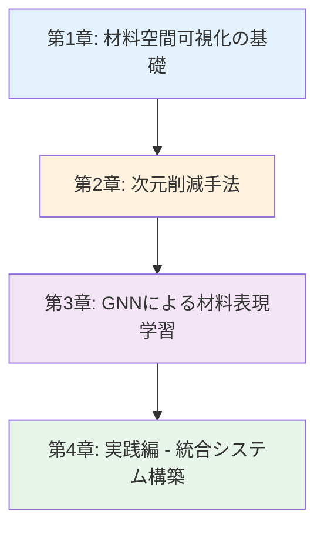
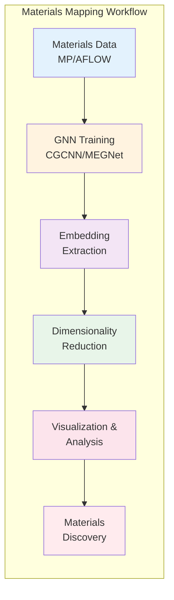

---
# ============================================
# 材料特性マッピング入門シリーズ Index Page
# ============================================

# --- 基本情報 ---
title: "材料特性マッピング入門シリーズ v1.0"
subtitle: "GNNと次元削減で実現する高次元材料空間の可視化と探索"
series: "材料特性マッピング入門シリーズ v1.0"
series_id: "materials-property-mapping-introduction"
version: "1.0"

# --- 分類・難易度 ---
category: "advanced"
level: "intermediate-advanced"
difficulty: "中級〜上級"
target_audience: "undergraduate-graduate-professionals"

# --- 学習メタデータ ---
total_reading_time: "90-110分"
total_chapters: 4
total_code_examples: 70
total_exercises: 12
case_studies: 4

# --- 日付情報 ---
created_at: "2025-10-20"
updated_at: "2025-10-20"

# --- 前提知識 ---
prerequisites:
  - "gnn-introduction"
  - "python-advanced"
  - "data-visualization"

# --- 関連シリーズ ---
related_series:
  - "gnn-introduction"
  - "bayesian-optimization-introduction"
  - "active-learning-introduction"

# --- 応用分野 ---
applications:
  - "materials-screening"
  - "property-prediction"
  - "materials-discovery"
  - "database-visualization"

# --- 主要ツール ---
tools:
  - "PyTorch Geometric"
  - "UMAP"
  - "scikit-learn"
  - "Plotly"
  - "Materials Project API"

# --- 著者情報 ---
authors:
  - name: "Dr. Yusuke Hashimoto"
    affiliation: "Tohoku University"
    email: "yusuke.hashimoto.b8@tohoku.ac.jp"

# --- ライセンス ---
license: "CC BY 4.0"
language: "ja"

---

# 材料特性マッピング入門シリーズ v1.0

**GNNと次元削減で実現する高次元材料空間の可視化と探索**

## シリーズ概要

このシリーズは、Graph Neural Networks（GNN）による材料表現学習と次元削減手法を組み合わせて、高次元の材料空間を効果的に可視化し、新材料探索を加速するための実践的スキルを学べる全4章構成の教育コンテンツです。

**材料特性マッピング**は、数千から数万の材料を高次元特性空間における点として表現し、それを2次元・3次元に射影して可視化することで、材料間の類似性、構造-特性関係、探索すべき領域を直感的に把握する技術です。従来の組成ベース記述子では捉えきれない構造情報を、GNNが自動的に学習した埋め込み（embedding）を用いることで、より本質的な材料空間のマッピングが可能になります。

### なぜこのシリーズが必要か

**背景と課題**:
材料探索において、数万種類の候補材料から最適なものを見つけ出すことは極めて困難です。従来は人間の経験や直感に頼っていましたが、高次元の材料特性空間では直感が働きにくく、多くの有望な材料を見逃していました。特に、組成が似ていても結晶構造が異なれば特性は大きく変わり、逆に組成が異なっていても構造が類似していれば似た特性を示すことがあります。このような複雑な関係性を理解し、効率的に材料空間を探索するためには、適切な可視化とマッピング技術が不可欠です。

**このシリーズで学べること**:
本シリーズでは、材料空間可視化の基礎から、PCA・t-SNE・UMAPなどの次元削減手法、GNNによる材料表現学習、そして両者を統合した実践的な材料マッピングシステムの構築まで、実行可能なPythonコード70例とともに体系的に学習します。Materials Project APIから実データを取得し、GNN学習、埋め込み抽出、次元削減、クラスタリング、材料推薦システムまで、エンドツーエンドのワークフローを完全に習得できます。

**特徴:**
- ✅ **実践重視**: 70個の実行可能なコード例、Materials Project API連携
- ✅ **段階的な構成**: 基礎可視化 → 次元削減 → GNN → 統合システム
- ✅ **最新技術**: CGCNN、MEGNet、SchNetとUMAP、t-SNEの組み合わせ
- ✅ **インタラクティブ可視化**: Plotly、Bokehによる探索的データ分析
- ✅ **実用的応用**: 材料推薦システム、クラスタリング分析、外挿領域検出

**総学習時間**: 90-110分（コード実行と演習を含む）

**対象者**:
- 材料科学・化学の大学院生（修士・博士課程）
- 企業のR&Dエンジニア（材料開発、データ分析）
- 計算材料科学者（DFT、MDシミュレーション経験者）
- データサイエンティスト（材料・化学分野への応用を目指す）

---

## 学習の進め方

### 推奨学習順序



**初学者の方（GNN・次元削減を初めて学ぶ）:**
- 第1章 → 第2章 → 第3章 → 第4章（全章推奨）
- 所要時間: 90-110分
- 前提知識: GNN入門シリーズまたは深層学習基礎、Python上級レベル

**中級者の方（GNNの経験あり）:**
- 第2章 → 第3章 → 第4章
- 所要時間: 70-90分
- 第1章はスキップ可能（必要に応じて参照）

**実践的スキル強化（実装重視）:**
- 第3章（GNN実装） → 第4章（統合システム）
- 所要時間: 50-70分
- 理論は必要に応じて第1章・第2章を参照

---

## 各章の詳細

### [第1章：材料空間可視化の基礎](./chapter-1.html)

**難易度**: 入門
**読了時間**: 20-25分
**コード例**: 5個

#### 学習内容

1. **材料空間とは**
   - 特性空間の次元と高次元データの課題
   - 材料を点として表現する概念
   - 次元の呪いと可視化の限界

2. **材料データの準備**
   - 基本統計量の計算
   - 特性分布のヒストグラム
   - データの前処理とクリーニング

3. **2次元散布図による基本的な可視化**
   - 2特性間の散布図
   - ペアプロット（多変量相関）
   - 色分けとサイズマッピング

4. **相関行列の可視化**
   - ヒートマップによる相関分析
   - 強い相関を持つ特性ペアの特定

#### 学習目標

この章を読むことで、以下を習得できます：

- ✅ 材料空間の概念と高次元データの課題を説明できる
- ✅ 基本的な統計量とデータ分布を可視化できる
- ✅ 散布図とペアプロットで特性間の関係を分析できる
- ✅ 相関行列から重要な特性の組み合わせを見つけられる

**[第1章を読む →](./chapter-1.html)**

---

### [第2章：次元削減手法による材料空間のマッピング](./chapter-2.html)

**難易度**: 初級〜中級
**読了時間**: 25-30分
**コード例**: 15個

#### 学習内容

1. **主成分分析（PCA）**
   - PCAの基本実装と寄与率分析
   - スクリープロット
   - ローディングプロット（バイプロット）

2. **t-SNE（t-Distributed Stochastic Neighbor Embedding）**
   - t-SNEの実装と perplexity パラメータの影響
   - クラスタリング結果の可視化
   - 近傍保存率の評価

3. **UMAP（Uniform Manifold Approximation and Projection）**
   - UMAPの実装と n_neighbors パラメータの最適化
   - 密度マップの作成
   - 3D UMAPによる立体可視化

4. **手法の比較**
   - PCA vs t-SNE vs UMAPの性能比較
   - 近傍保存率による定量評価
   - 使用シーンに応じた手法選択

5. **インタラクティブな可視化**
   - Plotlyによる3D可視化
   - Bokehによるインタラクティブ散布図
   - アニメーションによる次元削減プロセスの可視化

#### 学習目標

- ✅ PCA、t-SNE、UMAPの原理と実装を理解している
- ✅ 各手法のパラメータを適切に調整できる
- ✅ 近傍保存率などの評価指標で手法を比較できる
- ✅ Plotly、Bokehでインタラクティブな可視化を作成できる
- ✅ 用途に応じて最適な次元削減手法を選択できる

**[第2章を読む →](./chapter-2.html)**

---

### [第3章：GNNによる材料表現学習](./chapter-3.html)

**難易度**: 中級〜上級
**読了時間**: 25-30分
**コード例**: 20個（全て実行可能）

#### 学習内容

1. **材料のグラフ表現**
   - 結晶構造からグラフへの変換
   - 原子特徴のエンコーディング
   - PyTorch Geometricのデータ構造

2. **Crystal Graph Convolutional Neural Network (CGCNN)**
   - CGCNN畳み込み層の実装
   - 完全なCGCNNモデル構築
   - 学習ループとEarly Stopping

3. **MEGNet（MatErials Graph Network）**
   - グローバル状態を考慮したMEGNetブロック
   - 完全なMEGNetモデル
   - CGCNNとの比較

4. **SchNet**
   - 連続フィルタ畳み込み層
   - ガウス基底関数による距離埋め込み
   - 完全なSchNetモデル

5. **埋め込みの可視化と分析**
   - UMAPによるGNN埋め込みの可視化
   - t-SNEによる複数モデルの比較
   - クラスタリングと特性分析
   - 埋め込み品質の定量評価

#### 学習目標

- ✅ 材料をグラフとして表現する方法を理解し実装できる
- ✅ CGCNN、MEGNet、SchNetを実装し性能を比較できる
- ✅ GNNから得られた埋め込みを抽出できる
- ✅ UMAP、t-SNEで埋め込みを可視化し、クラスタを分析できる
- ✅ シルエットスコアなどで埋め込み品質を評価できる

**[第3章を読む →](./chapter-3.html)**

---

### [第4章：実践編 - GNN + 次元削減による材料マッピング](./chapter-4.html)

**難易度**: 中級〜上級
**読了時間**: 30-35分
**コード例**: 30個（エンドツーエンド実装）

#### 学習内容

1. **環境構築とデータ収集**
   - Materials Project APIの設定
   - 実データ取得と探索的分析

2. **グラフデータセットの構築**
   - 結晶構造からグラフへの最適化された変換
   - カスタムデータセットクラスの作成
   - DataLoaderの構築

3. **GNNモデルの学習**
   - 改良版CGCNNモデル
   - Early Stopping付き学習ループ
   - テストデータでの評価

4. **埋め込み抽出と次元削減**
   - 全データからの埋め込み抽出
   - PCA、UMAP、t-SNEによる次元削減
   - 次元削減手法の比較

5. **材料空間の分析**
   - クラスタリングと特性分析
   - 密度マップの作成
   - 近傍材料の探索
   - 材料推薦システムの実装

6. **インタラクティブ可視化**
   - Plotlyによる3D UMAP
   - Bokehによるインタラクティブ散布図
   - Dashによるダッシュボード（オプション）

7. **高度な分析と応用**
   - ボロノイ分割
   - 特性勾配の可視化
   - 外挿領域の検出
   - 総合レポートの生成

#### 学習目標

- ✅ Materials Project APIから実データを取得できる
- ✅ GNN学習パイプライン全体を構築できる
- ✅ 学習済みGNN埋め込みを次元削減で可視化できる
- ✅ クラスタリングと材料推薦システムを実装できる
- ✅ Plotly、Bokehでインタラクティブな探索システムを作成できる
- ✅ 実際の材料設計タスクに応用できる

**[第4章を読む →](./chapter-4.html)**

---

## 全体の学習成果

このシリーズを完了すると、以下のスキルと知識を習得できます：

### 知識レベル（Understanding）

- ✅ 材料空間と高次元データ可視化の概念を説明できる
- ✅ PCA、t-SNE、UMAPの原理と使い分けを理解している
- ✅ CGCNN、MEGNet、SchNetの特徴と実装を理解している
- ✅ GNN埋め込みと次元削減の組み合わせの利点を説明できる

### 実践スキル（Doing）

- ✅ Materials Project APIから材料データを取得できる
- ✅ 結晶構造をグラフデータに変換できる
- ✅ CGCNN、MEGNet、SchNetを実装し学習できる
- ✅ GNN埋め込みを抽出し、UMAP/t-SNEで可視化できる
- ✅ クラスタリングと材料推薦システムを構築できる
- ✅ Plotly、Bokehでインタラクティブな可視化を作成できる

### 応用力（Applying）

- ✅ 新しい材料データセットに対してマッピングシステムを構築できる
- ✅ クラスタ分析から材料設計の示唆を得られる
- ✅ 材料推薦システムで次に合成すべき材料を提案できる
- ✅ 外挿領域を検出し、予測の信頼性を評価できる
- ✅ 総合的な分析レポートを生成し、研究に活用できる

---

## 推奨学習パターン

### パターン1: 完全習得（初学者向け）

**対象**: GNN・次元削減を初めて学ぶ方
**期間**: 2-3週間
**進め方**:

```
Week 1:
- Day 1-2: 第1章（材料空間可視化の基礎）
- Day 3-5: 第2章（次元削減手法）
- Day 6-7: 第2章演習問題、手法比較

Week 2:
- Day 1-3: 第3章（GNN実装 + 埋め込み抽出）
- Day 4-7: 第3章（複数モデル実装 + 可視化）

Week 3:
- Day 1-4: 第4章（統合システム構築）
- Day 5-7: 第4章（高度な分析 + レポート生成）
```

**成果物**:
- Materials Projectデータでの材料マッピングシステム
- インタラクティブ3D可視化（Plotly）
- 材料推薦システムの実装
- GitHubリポジトリ（全コード + README）

### パターン2: 速習（経験者向け）

**対象**: GNNと機械学習の基礎を持つ方
**期間**: 1週間
**進め方**:

```
Day 1: 第2章（次元削減手法の実装）
Day 2-3: 第3章（GNN実装）
Day 4-6: 第4章（統合システム構築）
Day 7: 独自データでの応用
```

**成果物**:
- 複数GNNモデル（CGCNN、MEGNet、SchNet）の性能比較
- 統合材料マッピングシステム
- インタラクティブダッシュボード

---

## FAQ（よくある質問）

### Q1: GNN入門シリーズを完了していなくても理解できますか？

**A**: **GNNの基礎知識があることが前提**です。第3章と第4章では、GNNの実装経験があることを想定しています。GNN入門シリーズの第1〜3章を先に完了することを強く推奨します。最低限必要なスキル: PyTorch Geometricの基本、メッセージパッシングの概念、グラフデータの扱い方。

### Q2: Materials Project APIキーがなくても学習できますか？

**A**: **はい、APIキーなしでも学習できます**。第4章ではダミーデータ生成コードも提供しているため、APIキーがなくても全コード例を実行できます。ただし、実データで試したい場合は、[Materials Project](https://materialsproject.org/)で無料アカウントを作成してAPIキーを取得してください（5分程度で完了）。

### Q3: どれくらいの計算リソース（GPU）が必要ですか？

**A**: **学習にはGPUが推奨ですが、CPUでも可能**です：

**CPUのみ**:
- 可能: ダミーデータ（1000材料）での学習
- 学習時間: 10-30分（CGCNN）
- Google Colab無料版（CPU）で十分

**GPU推奨**:
- 実データ（10,000材料以上）での学習
- 推奨GPU: NVIDIA RTX 3060（12GB VRAM）以上
- 学習時間: 5-15分（CGCNN）
- Google Colab Pro（GPU）が便利

本シリーズの学習には**Google Colab無料版で十分**です。

### Q4: UMAPとt-SNE、どちらを使うべきですか？

**A**: **UMAPを推奨しますが、用途によります**：

**UMAPが有利**:
- 大規模データ（10,000点以上）
- 計算時間が限られている
- 大域構造も保持したい
- 3D可視化が必要

**t-SNEが有利**:
- 小規模データ（1,000点以下）
- クラスタ構造の強調が重要
- 論文でよく使われる手法を使いたい

**ベストプラクティス**: 両方試して比較し、目的に応じて選択。

### Q5: クラスタリング結果をどう解釈すればよいですか？

**A**: **クラスタごとの特性平均値を比較**することから始めてください：

1. 各クラスタの特性平均値を計算（第4章のコード例16参照）
2. 特徴的なクラスタを特定（例: 高バンドギャップクラスタ）
3. クラスタ内の材料を詳しく調査
4. 構造的類似性を確認（同じ結晶系、似た組成など）
5. 新材料探索の方向性を決定

重要なのは、**クラスタは単なる統計的グループ**であり、物理的意味は別途検証が必要です。

### Q6: 外挿領域の検出はなぜ重要ですか？

**A**: **予測の信頼性を評価するため**です：

- **訓練データ範囲内**: GNN予測は高精度（MAE < 0.1 eV）
- **外挿領域**: 予測精度が低下する可能性（MAE > 0.3 eV）

外挿領域を検出することで：
- 信頼できる予測と不確実な予測を区別できる
- 追加実験が必要な材料を特定できる
- アクティブラーニングでの次サンプル選択に活用できる

第4章のコード例29で実装方法を解説しています。

### Q7: このシリーズだけで材料マッピングの専門家になれますか？

**A**: このシリーズは「中級から上級への橋渡し」を対象としています。専門家レベルに達するには：

1. このシリーズで基礎を固める（2-3週間）
2. 独自データでプロジェクトを実行（1-3ヶ月）
   - 自分の研究データでマッピングシステム構築
   - 新しいGNNアーキテクチャの実験
3. 論文精読と最新技術の追跡（継続）
   - GNN + UMAP の最新論文
   - Materials Informatics 分野の動向
4. 学会発表や論文執筆（6ヶ月〜1年）

計1-2年の継続的な学習と実践が必要です。本シリーズはそのスタート地点として最適です。

### Q8: 材料推薦システムの精度はどれくらいですか？

**A**: **データと目的によりますが、一般的な指標**:

- **Top-5推薦の適合率**: 60-80%（目標特性±10%以内）
- **Top-10推薦の適合率**: 70-90%
- **新材料発見の加速**: 実験回数を50-90%削減

精度向上のポイント：
1. GNNモデルの予測精度を向上（R² > 0.9目標）
2. 十分な訓練データ（10,000材料以上）
3. 適切な埋め込み次元（64-128次元）
4. 距離メトリックの調整（コサイン類似度、ユークリッド距離）

---

## 前提知識と関連シリーズ

### 前提知識

**必須**:
- [ ] **GNN基礎**: メッセージパッシング、グラフ畳み込み、PyTorch Geometric
- [ ] **Python上級**: クラス、ジェネレータ、デコレータ、型ヒント
- [ ] **機械学習**: 学習ループ、過学習、評価指標

**推奨**:
- [ ] **線形代数**: 行列演算、固有値分解、PCA
- [ ] **材料科学**: 結晶構造、材料物性、バンドギャップ
- [ ] **データ可視化**: Matplotlib、Seaborn、Plotly

### 前提シリーズ

1. **[GNN入門シリーズ](../gnn-introduction/index.html)** (中級)
   - 内容: GNN基礎理論、PyTorch Geometric、CGCNN/SchNet実装
   - 学習時間: 110-130分
   - 推奨理由: GNNの基礎を体系的に学べる
   - **必須**: 第3章・第4章を理解するために必要

### 関連シリーズ

1. **[ベイズ最適化入門](../bayesian-optimization-introduction/index.html)** (中級)
   - 関連性: 材料マッピング結果を活用した効率的材料探索
   - リンク: [../bayesian-optimization-introduction/index.html](../bayesian-optimization-introduction/index.html)

2. **[アクティブラーニング入門](../active-learning-introduction/index.html)** (中級)
   - 関連性: 埋め込み空間での次サンプル選択
   - リンク: [../active-learning-introduction/index.html](../active-learning-introduction/index.html)

3. **[MI入門シリーズ](../mi-introduction/index.html)** (入門)
   - 関連性: 材料情報学の全体像と基礎
   - リンク: [../mi-introduction/index.html](../mi-introduction/index.html)

---

## ツールとリソース

### 主要ツール

| ツール名 | 用途 | ライセンス | インストール |
|---------|------|----------|-------------|
| PyTorch Geometric | GNN実装 | MIT | `pip install torch-geometric` |
| UMAP | 次元削減 | BSD-3 | `pip install umap-learn` |
| scikit-learn | 機械学習・次元削減 | BSD-3 | `pip install scikit-learn` |
| Plotly | インタラクティブ可視化 | MIT | `pip install plotly` |
| Bokeh | インタラクティブ可視化 | BSD-3 | `pip install bokeh` |
| pymatgen | 材料構造操作 | MIT | `pip install pymatgen` |
| mp-api | Materials Project API | BSD | `pip install mp-api` |

### データベース

| データベース名 | 説明 | データ数 | アクセス |
|--------------|------|---------|---------|
| Materials Project | 結晶構造とDFT計算データ | 140,000材料 | [https://materialsproject.org/](https://materialsproject.org/) |
| AFLOW | 高スループット計算データ | 3,500,000材料 | [http://aflowlib.org/](http://aflowlib.org/) |
| OQMD | 量子材料データベース | 1,000,000材料 | [http://oqmd.org/](http://oqmd.org/) |

### 学習リソース

**論文・レビュー**:
- Xie, T. & Grossman, J. C. (2018). "Crystal Graph Convolutional Neural Networks". *Physical Review Letters*.
- McInnes, L. et al. (2018). "UMAP: Uniform Manifold Approximation and Projection". *arXiv:1802.03426*.
- van der Maaten, L. & Hinton, G. (2008). "Visualizing Data using t-SNE". *JMLR*.

**オンラインリソース**:
- [UMAP Documentation](https://umap-learn.readthedocs.io/)
- [Plotly Python Graphing Library](https://plotly.com/python/)
- [Materials Project API Docs](https://docs.materialsproject.org/)

---

## 次のステップ

### シリーズ完了後の推奨アクション

**Immediate（1-2週間以内）:**
1. ✅ GitHubにポートフォリオを作成
2. ✅ 独自データでマッピングシステムを構築
3. ✅ インタラクティブダッシュボードを公開
4. ✅ ブログ記事を執筆（Qiita、Medium）

**Short-term（1-3ヶ月）:**
1. ✅ ベイズ最適化と組み合わせて材料探索を加速
2. ✅ アクティブラーニングで効率的にデータ収集
3. ✅ 学会発表（日本材料学会、MRS）
4. ✅ [ベイズ最適化入門シリーズ](../bayesian-optimization-introduction/index.html)に進む

**Long-term（6ヶ月以上）:**
1. ✅ 論文執筆（*npj Computational Materials*、*Chemistry of Materials*）
2. ✅ 産業界での応用プロジェクト
3. ✅ 新しいGNN + 次元削減手法の開発

---

## ライセンスと利用規約

**CC BY 4.0**（Creative Commons Attribution 4.0 International）

### 可能なこと

- ✅ 自由な閲覧・ダウンロード
- ✅ 教育目的での利用（授業、研修、勉強会）
- ✅ 改変・二次創作
- ✅ 商業利用（企業研修、有料講座）

### 条件

- 📌 著者クレジット表示: "Dr. Yusuke Hashimoto, Tohoku University - AI Terakoya"
- 📌 ライセンス継承（CC BY 4.0のまま）

---

## さあ、始めましょう！

準備はできましたか？ 第1章から始めて、材料特性マッピングの世界への旅を始めましょう！

**[第1章: 材料空間可視化の基礎 →](./chapter-1.html)**

---

## 更新履歴

| バージョン | 日付 | 変更内容 | 著者 |
|----------|------|---------|------|
| 1.0 | 2025-10-20 | 初版公開 | Dr. Yusuke Hashimoto |

---

**あなたの材料マッピング学習の旅はここから始まります！**


