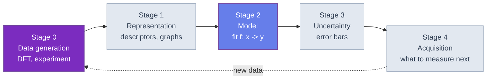

🌐 JP | [🇬🇧 EN](<../../../en/MI/quantum-machine-learning-introduction/chapter-1.html>) | Last sync: 2026-08-13

[マテリアルズ・インフォマティクス道場](<../index.html>) > [量子機械学習入門](<index.html>) > 第1章

量子機械学習は量子技術の中で最も過大に売られている分野であり、だからこそ丁寧なコースに値します。その過大な売り込みは、たいてい不誠実ではありません。個々には妥当な主張の連鎖 — $n$量子ビットの量子状態は $2^n$ 個の振幅をもつ、量子回路はデータ点間の内積を誘導する、その内積は古典的には計算困難である — から生じており、これを一列に並べると、量子コンピュータはより優れた学習器であるはずだという議論のように聞こえます。しかしそれは議論ではありません。この連鎖と結論のあいだの隙間こそ、本章が扱う場所です。

本コースが想定する読者は、組成記述子の表に回帰モデルを載せる方法をすでに知っており、難しいのは当てはめではなくデータであることもすでに知っており、そして「量子コンピューティングはそれを変えるのか」と少なくとも一度は問われた経験をもっています。本章の仕事は、その問いに答えられるだけの精度を与えることです。それには4つのことが必要です。「量子機械学習」という語が指す4つの別々の主題を切り分ける分類、賛成側と反対側の誠実な提示、実際の材料情報学パイプラインのどこに量子プロセッサが接続しうるかの地図、そして残りの章が — たとえそう望んだとしても — ごまかせないだけの厳しさをもつ評価プロトコルです。

章の最後に、本コース全体が走るための道具立てを置きます。姉妹コースから再掲するミニ状態ベクトルシミュレータ、全実験が使う合成材料データセット、超えるべき数値を固定する古典リッジ回帰のベースライン、そして — すでに第1章のうちに — 2つの誠実な疑義を予告する2つの結果です。そのうちの1つは、線形ベースラインを本当に上回る量子特徴写像であり、同時にそれが電卓でも再現できる理由で上回っていることの実演です。この結果が、本コースの縮図そのものです。

## 学習目標

本章を修了すると、以下のことができるようになります。

  * 任意のQML提案を4象限の分類 — *データ*が古典か量子か、*処理*が古典か量子か — に位置づけ、主張の妥当性を決めるのはアルゴリズムではなく象限であると説明できる
  * QMLを支持する論拠（指数的な状態空間、暗黙の特徴写像、data re-uploadingの普遍性）と、それに対する4つの標準的な反論（入力問題、出力問題、dequantization、集中）を述べ、本コースの各章がそのどれを扱うのかを言える
  * 記述子から物性へ至る材料パイプラインの5段階を同定し、各段階について候補となる量子の役割と現時点での誠実な評定を挙げられる
  * 同一予算の評価プロトコル — 固定分割、パラメータ数の一致、モデル選択は訓練データのみ、自明なベースライン、ノイズ床、報告するすべての差に対する対応のある不確かさ、そして明示的なショットコスト — を適用できる
  * リッジ回帰の閉形式解から本コースの古典ベースラインを再導出し、共有の合成データセット上でそのテストRMSEを再現できる
  * 積状態の量子特徴写像が閉形式で厳密に再現できること、および hardware-efficient な量子カーネルがレジスタの成長とともにコントラストを失うことを数値的に実証できる

### 規約と基本ルール

以下の6つの規約を本章で固定し、以降は再掲せずに用います。

**量子ビットの順序とシミュレータ。** 量子ビット0は最左・最上位ビットであり、[量子コンピューティング入門](<../../FM/quantum-computing-introduction/index.html>)と完全に同一です。同コース第2章のシミュレータをCode Example 1に無変更で再掲し、そのAPI — `ket`、`apply_gate`、`cnot`、`probs`、`sample`、`expval` — が本コースで使う唯一の量子インタフェースです。この5章のどこにもSDKもベンダーのバックエンドも実機もありません。

**データセットは1つ。** 第1章から第5章までのすべての実験は、Code Example 2の合成データセット上で走ります。60行、$[0,1]$ に収まる4つの組成風記述子、そして形成エネルギー風の目標変数が1つです。シードを固定して生成するので、本コースで印字されるすべての数値はどの計算機でも再現できます。同時にこれは*合成*データであり、したがってここでのどの結果も実材料データについての証拠ではありません。証拠となるのは*手法*についてであり、手法のコースとはそういうものです。

**分割は1つ。** 訓練集合＝先頭40行、テスト集合＝末尾20行。分割は決定的で、二度と引き直しません。したがってどの章の数値もどの章の数値と直接比較できます。

**角度の引数は $\pi$ 単位。** 符号化の角度は $x_j \in [0,1]$ に対して $\pi x_j$ と書きますので、記述子は $0$ から $\pi$ までの回転を掃引します。これは第2章が代替案の費用を見積もるときに用いる規約です。

**評価指標。** 回帰の良さはテスト行上の二乗平均平方根誤差で報告し、決定係数 $R^2$ を併記します。2つのモデル間の差はすべて、1.4節が述べる理由により対応のあるブートストラップ区間つきで報告します。

**分類の記法。** CQ のような2文字の表記は*古典データ・量子処理*を意味します。1文字目がデータ、2文字目が処理です。文献はこの順序について一貫していませんので、論文を読むときは必ず確認してください。

* * *

## 1.1 4つの象限 — 1つの主題ではない

「量子機械学習」は少なくとも4つの別個の研究プログラムを指す名前であり、これについての混乱した議論はほとんどすべて、そのうち2つを混ぜたことから生じます。最も働きの大きい切り分けは2×2の表です。*データ*は古典か量子か、そして*処理*は古典か量子か。

| | 古典処理 | 量子処理 |
| --- | --- | --- |
| **古典データ** | **CC** — 通常の機械学習。今日の材料情報学が行っていることすべて。 | **CQ** — 記述子表に対する量子カーネル、変分量子モデル、量子ニューラルネットワーク。**本コース。** |
| **量子データ** | **QC** — 量子シミュレーションや量子実験が生んだデータに対する古典ML。DFTで訓練した機械学習ポテンシャル、古典学習器で後処理する classical shadows。 | **QQ** — 測定を挟まずに量子センサや量子シミュレーションが量子プロセッサへ入力される構成。理論は最強、データはまだ存在しない。 |

各象限にはそれぞれ一文を割く価値があります。見通しがまったく似ていないからです。

**CCが現職であり、そして非常に強い。** 量子的手法が超えるべきベースラインは藁人形ではありません。組成記述子への勾配ブースティングやカーネル法、構造へのグラフニューラルネットワークは成熟していて安価で、数十年の工学に支えられています。その現職が実際にどのようなものかは[マテリアルズ・インフォマティクス入門](<../mi-introduction/index.html>)と[組成ベース特徴量入門](<../composition-features-introduction/index.html>)をご覧ください。本コースのどこにも、それらを使うことへの反対論はありません。

**CQが誇大宣伝の象限であり、本コースが扱うのはここです。** 古典ディスク上に数値の表があり、量子プロセッサにそこから学ばせたい。これが量子カーネル法（第3章）と変分量子回路（第4章）の象限です。同時に、1.2節の4つの反論がもっとも強く噛む象限でもあります。古典データを量子状態に入れることと実数を1つ取り出すことは、まさに量子コンピュータが下手な2つの操作だからです。

**QCは量子技術がすでに材料科学を変えた場所であり、通常はQMLと呼ばれません。** 密度汎関数計算のデータで訓練された機械学習ポテンシャルは、量子力学的計算だけが生み出せたデータから学ぶ古典モデルです。これが[機械学習ポテンシャル（MLP）入門](<../mlp-introduction/index.html>)の背後にあるパターンであり、量子コンピュータを1台も含まない*量子データ*の成功譚であることに注意する価値があります。その自然な拡張 — DFTを変分量子固有値ソルバの量子計算エネルギーで置き換える — は[量子コンピューティング入門](<../../FM/quantum-computing-introduction/index.html>)の第3章・第4章に属し、材料研究に対する量子側の貢献として現在もっとも信頼できる候補と言えるでしょう。

**QQは定理が最も強く、データが最も少ない。** 既知でもっとも鋭い分離 — 量子学習器が任意の古典学習器より指数的に少ないサンプル数で済むことが証明できる設定 — はここに住んでおり、その成立にはデータ自身が量子状態であって古典的な記録へ測定されないことが必要です。第5章がここへ戻ります。「では量子機械学習に*何か*本当に量子的なものはあるのか」への誠実な答えだからです。あります。ただしそれは売られているものではありません。

### アルゴリズムより象限が重要な理由

ここから直ちに2つの観察が従います。数式に入る前に述べておく価値があります。

第一に、ある象限で証明された量子*優位性*は他の象限について何も言いません。量子データに対するサンプル複雑度の分離は記述子表へ移りません。分離の機構が「データが最初から古典ではなかった」ことそのものだからです。逆に、古典データの読み込みに関する否定的結果はQQ象限について何も言いません。論文はしばしばQQで何かを証明し、CQの応用でそれを動機づけます。

第二に、*ボトルネック*が象限ごとに違います。CQではボトルネックはインタフェース — 入る符号化と出る測定 — です。QCではボトルネックはそもそもデータを生成することで、これは量子シミュレーションの問題であって学習の問題ではありません。学習アルゴリズムの改良が効くのは学習がボトルネックである象限だけであり、CQではふつうそうではありません。

* * *

## 1.2 賛成の論拠と、4つの標準的な反論

### 賛成の論拠

4つの議論が繰り返し現れ、それぞれ言える範囲では正しいものです。

**状態空間が指数的に大きい。** $n$量子ビットのレジスタは $2^n$ 個の複素振幅で記述される状態をもちます。30量子ビットで、すでにどの材料データベースの行数よりも多くの振幅を運びます。もしモデルの表現力がそれが計算する空間の次元に追随するのなら、これで話は終わりです。

**符号化は特徴写像を誘導し、特徴写像には内積がある。** データ行 $x$ から回路が準備する状態を $x \mapsto |\phi(x)\rangle$ と書きます。すると

$$ k(x, x') = \left| \langle \phi(x) | \phi(x') \rangle \right|^2 $$

は半正定値カーネルですから、カーネル理論の道具立てがすべて直ちに使えます。表現定理、カーネルリッジ回帰、サポートベクターマシン。この観察こそが、QMLを回路ヒューリスティクスの寄せ集めから理論をもつ何かへ変えたものであり、第3章がこれをきちんと展開します。特徴空間は $2^n$ 次元のそれであって、書き下されることはありません。評価されるのはカーネルだけで、古典的なカーネルトリックとまったく同じです。

**再アップロードすれば1量子ビットでも普遍近似器になる。** 1つの量子ビットにデータ依存の回転と学習可能な回転を交互に施すと、入力についてのフーリエ級数が実現され、到達できる周波数の個数は再アップロードの回数とともに増えます。表現力は量子ビット数に縛られません。第2章がこれを定量化します。

**これらのモデルの一部は古典的にシミュレートしにくい。** 十分に深いランダム回路の出力からのサンプリングは古典的に困難と信じられています。古典計算機が*シミュレートすら*できないモデル族は、古典モデルにできないことができるはずだ、という気がします。

### 4つの標準的な反論

上の4つの議論には、それぞれ具体的な答えがあります。しかもそれは修辞ではありません。

**1. 入力問題。** 指数は計算が始まる前に使い果たされます。$d$個の記述子をもつ $N$行のデータを使うには、$Nd$個の古典的な数値を何かが読まなければならず、その読み込みは後に何が起きようと $\Omega(Nd)$ の仕事です。さらに悪いことに、$2^n$個の振幅を実際に活用する符号化方式 — $2^n$個の数値を1つの状態に詰め込む amplitude encoding — は、深さが一般に $n$ について指数的な状態準備回路を必要とします。安価な符号化（basis、angle）は特徴1つあたり量子ビット1つを使うので、そもそも指数的空間に触れません。第2章はまるごとこのトレードオフの話です。それがCQ象限の真のボトルネックであり、しかもほとんど常に読み飛ばされているからです。

**2. 出力問題。** 量子モデルが報告するものはすべて $\pm 1$ の測定結果の平均です。$S$ショット後のその平均の標準誤差は高々 $1/\sqrt{S}$ ですので、小数第3位は100万ショットの費用がかかります。しかも1つの数値あたりです。Code Example 4がこれを価格表にします。ここから2つの帰結があります。それを測った実験のショットノイズより小さい優位性の主張は優位性ではありません。そして真に $2^n$ 次元の答えを読み出すには $O(2^n)$ 回の測定が必要で、これは第1の議論が訴えていた資源をちょうど打ち消します。

**3. Dequantization。** 2018年のEwin Tangによる推薦システムの結果を起点として、量子線形代数における幾つかの有名な指数的高速化が不公平な比較の産物であったことが一連の論文で示されました。量子アルゴリズムには特別なデータ構造（効率的な状態準備）が与えられていたのに、古典アルゴリズムにはその対応物（同じデータへの sample-and-query アクセス）が与えられていなかったのです。対応するアクセスを与えれば、次元への依存が多重対数の古典アルゴリズムも存在し、指数的分離は蒸発して大きな多項式の分離が残ります。同じパターンはその後いくつかの量子カーネル構成についても見つかっており、それらには効率的な古典サロゲートが存在します。第5章がこれを全面的に扱います。本章のCode Example 5はその縮小版の実例であり、その縮小版は当惑するほどきれいです。

**4. 集中。** 表現力の高い特徴写像は自己破壊的です。$|\phi(x)\rangle$ が状態空間を十分に探索するなら、異なる2つの入力はほぼ直交する状態を与えるので、$x \ne y$ のすべての対で $k(x,y) \to 0$ となります。カーネル行列は単位行列へ収束し、あらゆる点がそれ自身の孤島となり、汎化のもとになるものが何も残りません。変分の設定における同じ現象が barren plateau 問題 — 勾配が量子ビット数について指数的に消える — であり、[量子コンピューティング入門](<../../FM/quantum-computing-introduction/index.html>)の第3章が扱い、本コースの第4章がその機械学習版として再訪します。Code Example 6は本コース自身のデータセット上で集中の兆しを測ります。

これらより語られることが少なく、しかしおそらく最も重要な5つ目の反論があります。

**5. シミュレートしにくいことは、学習が上手いことと同じではない。** 汎化は仮説クラスの*バイアス*がデータの構造に合っていることから生じるのであって、仮説クラスが大きいことからは生じません。古典計算機がシミュレートできないモデル族は、その関数が異例であるような族です。異例であることが*形成エネルギーに適している*ことを意味する理由はどこにもありません。no free lunch の枠組みが正しい見方です。合致する事前分布を伴わない表現力は何も買いません。第4章の過学習実験がこの点を数値で示します。

| 主張 | 実際に確立されていること | 主張が成り立つために真でなければならないこと |
| --- | --- | --- |
| 「$2^n$次元の特徴空間」 | ヒルベルト空間の次元がそうであること | 準備や読み出しで $2^n$ を払わずにそこへアクセスできること |
| 「量子カーネルは古典的に困難」 | 特定の構成されたカーネルについては真 | その困難さが手元のデータセットでの有用性と一致すること |
| 「線形代数の指数的高速化」 | 状態準備の仮定の下で成立 | 古典アルゴリズムに対応するアクセスが与えられないこと — 実際には与えられる |
| 「量子ビットが多いほど表現力が高い」 | 関数クラスについては真 | 表現力が汎化を改善すること、集中で破壊しないこと |
| 「1量子ビットで普遍近似」 | 再アップロードが十分あれば真 | 普遍性がサンプル効率を含意すること — 含意しない |

この表には意図的に欠けている行が1つあり、これだけ懐疑的なコースは反対側の最強の結果を脚注ではなく本文で述べる義務があります。CQ象限に厳密な量子優位性は**存在します**。Liu、Arunachalam、Temme は離散対数に基づく分類問題を構成し、標準的な暗号学的仮定の下でどんな古典学習器も多項式時間では解けない一方、量子カーネルが高い精度を達成することを示しました。これは*古典データと量子処理*についての定理であり、この象限に分離が存在しうるかという問いに決着をつけます — 存在します。しかしそれは移植できません。困難さは群論的であり、特徴写像はその困難さを定義するもの自体であって、生成エネルギーが離散対数の構造をもつことを示唆するものは何もありません。著者たちもそんな主張はしていません。したがってCQの正確な要約は「分離は存在しない」ではなく「分離をもつように作られた問題については分離が存在し、材料情報学の問題がその種のものであることは知られていない」です。本コースの否定的結果は後半の節についてのものです。

### 本コースの結論を、あらかじめ述べる

引っ張るべきサスペンスはありません。CQ象限について、本コースは材料情報学の形をした問題での量子優位性の証拠を見つけません。第3章と第4章は否定的な結果を肯定的な結果と同じ詳しさで報告します。見つかるのは、量子モデルの*カーネル的な見方*は本当に見通しをよくすること、真の研究課題は符号化の段階にあること、そしてQC象限とQQ象限 — 量子データ — こそ材料研究者が量子技術が実際に効いてくると期待すべき場所であることです。第5章がその議論を組み立てます。

* * *

## 1.3 材料パイプラインのどこに量子が入りうるか

優位性についての抽象的な議論より、すでに存在するパイプラインのどこに量子プロセッサを接続しうるかを問うほうが有益です。記述子から物性へのワークフローは5段階です。



| 段階 | 候補となる量子の役割 | それに必要なもの | 誠実な評定 |
| --- | --- | --- | --- |
| 0. データ生成 | DFTが信頼できない系について、DFTの代わりに量子シミュレーションでエネルギーやスペクトルを計算する | 誤り耐性、あるいは十分な誤り緩和。資源見積もりは姉妹コースにある | **最も強い論拠。** 量子データ・古典学習、すなわちQC象限。本コースの主題ではなく、本コースの疑義の対象でもない |
| 1. 表現 | 記述子ベクトルを置き換える、あるいは補う量子特徴写像 | 誘導される内積が対象物性の物理と合う符号化 | 未解決であり、CQで最も興味深い未解決問題。第2章 |
| 2. モデル | 量子カーネルリッジ回帰、回帰器としての変分量子回路 | 集中しないカーネル、barren plateau のない訓練可能な回路 | 同一予算では優位性は示されていない。第3章・第4章 |
| 3. 不確かさ | 量子カーネルのガウス過程 | 段階2に必要なものすべてに加え、較正された事後分布 | 古典的なカーネル的見方が既に与えるものを超えるものはない |
| 4. 獲得 | 離散候補集合上の量子最適化 | 組合せ最適化における優位性。これは別の文献群 | 範囲外。古典側の現状は[ベイズ最適化・アクティブラーニング入門](<../bayesian-optimization-introduction/index.html>)を参照 |

この表について明示しておくべき点が3つあります。本コースがこの構成になっている理由だからです。

**最も価値が高い段階は段階0であり、そこには機械学習は一切必要ない。** 強相関系に対して正確なエネルギーを与える量子コンピュータは、データを生成することで材料科学に貢献します。そのデータを消費する学習器は普通の古典モデルで構いません。これは残念な結論ではなく、本当に難しいものへ努力を振り向け直すことです。

**段階1に研究課題があり、それは物理の問題である。** 量子特徴写像が有用なのは、それが誘導する内積が材料について何か真のこと — 対称性、局所性の構造、スペクトル — を反映しているときだけです。コンパイルしやすいから符号化を選ぶのは、事前分布をランダムに選ぶことです。第2章はまるごとこの話に費やされ、1.5節の例5は符号化を便利さで選んだときに何が起きるかを示します。モデルは動き、そしてまったく古典的な理由で動きます。

**段階2と段階3にマーケティングがある。** そしてそこは古典の現職が最も強く最も安い段階でもあり、優位性を探す場所としてはまさに間違っています。

* * *

## 1.4 評価プロトコル

本節は本コースの憲法です。第2章から第5章のすべての実験がこれに従い、読者が検算できるようにここに規則を書き下します。

動機は不快ですが単純です。文献における「データセット上の量子優位性」の報告はほとんどすべて、以下の欠陥を少なくとも1つ、多くは複数もっています。これらの欠陥は不正ではありません。片方に勝ってほしいと思っている人が比較を組んだときに起きることです。

### 7つの規則

**R1. 分割は1つ、事前に固定する。** 先頭40行で訓練し、末尾20行でテストします。分割を引き直さない、複数分割の最良を報告しない、テスト行が何にも影響しないようにします。

**R2. パラメータ数を一致させる。** 学習パラメータ $p$ 個の量子モデルは、同じ $p$ 個をもつ古典モデルと比較します。弱くなるように選ばれた古典モデルとは比較しません。量子モデルが24パラメータなら、古典側の対戦相手も約24パラメータのネットワークか特徴展開です。

**R3. データを一致させる。** 同じ40行の訓練データを同じ順序で使い、片側だけに追加の特徴設計を行いません。

**R4. モデル選択はテスト集合に決して触れない。** ハイパーパラメータ — リッジの罰則、カーネル幅、回路の深さ、学習率 — は訓練行のみで選びます。どの推定量が選ぶかは何をフィットしているかで変わるので、各章で論じ直すのではなくここで一度だけ規約を述べます。本章では40訓練行に対する **leave-one-out** 交差検証（1回の再フィットが $5\times5$ の解法なので40回でもコストはゼロです）、第2章以降は同じ40行に対する **5分割** 交差検証（再フィットがカーネルの解法になるため）、そして第4章の反復訓練モデルには訓練行を固定した **30/10 分割**（学習率と停止ステップは1回のフィットではなく曲線に対して選ばなければならないため）を使います。決して変わらないのは規則の方です。テスト行の助けを借りて選ばれた数値はテスト数値ではありません。

**R5. 自明なベースラインとノイズ床を報告する。** すべての結果は2つの数値に挟まれますが、どちらがどちら側かには注意が必要です。挟まれるのは*誤差*だからです。**上側**は訓練平均を予測する誤差、本データセットではRMSEで $0.5242$ であり、これを十分下回らないモデルは何もしていません。**下側**は既約なノイズ $0.0507$ で、これは*完全な*モデル — 生成関数を厳密に復元してもなお、見えないノイズの分だけ外すモデル — のテストRMSEです。したがって $0.52$ のモデルは何も学んでおらず、$0.05$ のモデルは学べるものをすべて学んでおり、$0.05$ を*下回る*モデルは発見ではなく漏れを抱えています。本コースのすべての結果はこの2つの数値と並べて示されます。

**R6. すべての差に区間をつけ、その区間は対応のあるものにする。** 20行で計算されたテストRMSEは確率変数です。本データセットでのその95%ブートストラップ区間の幅は約 $0.085$ で、文献で主張される量子的改善のほとんどより大きいのです。2つのモデル間の差は*同じ*行を両モデルで再標本化して評価しなければなりません。対応をとることで、分散の最大の源であるテスト行の引き当てが消えるからです。Code Example 4がこれを実装し、説得力があるように見えた古典側の改善をその場で葬ります。

**R7. ショットを数える。** 厳密な状態ベクトルの期待値から得た量子的数値は、装置についての主張ではなく数学的モデルについての主張です。したがって本コースのすべての量子的結果は、指定した精度で何ショットに相当するかも報告します。閉形式の古典モデルに並ぶために $10^9$ ショットを要する手法は、それに並んだことになりません。

### 「勝利」がどのようなものでなければならないか

規則を組み合わせると、反証可能な目標が得られます。量子モデルが本コースの問題で優位性を示したと言えるのは、同一予算の最良の古典モデルに対する対応のあるブートストラップ区間が完全にゼロより下にあり、訓練データが多くなく、パラメータが多くなく、そしてショット予算が明示され非現実的でない場合に限られます。そしてその場合に限られます。第2章から第5章のどれもこれを達成せず、各章がそう述べます。

### よくある失敗の型に名前をつける

| 失敗 | 論文での見え方 | 破っている規則 |
| --- | --- | --- |
| 弱いベースライン | 量子カーネルSVMを線形回帰と比較する | R2 |
| ベースラインの調整不足 | 古典側のハイパーパラメータは既定値、量子側だけ掃引 | R2, R4 |
| テスト集合での選択 | 「最も汎化した回路深さを選んだ」 | R4 |
| 分割の買い物 | 「好都合な訓練/テスト分割での結果」 | R1 |
| 不確かさの欠如 | テスト20点でRMSEを有効数字4桁で提示 | R6 |
| 極小データ | 20サンプル・8特徴で優位性を主張 | R6 |
| ショットの無視 | 厳密な期待値を実機の結果として提示 | R7 |
| 事後的なデータセット選択 | 9個のうち量子が勝った1個のデータセット | R1, R6 |

古典的なモデル評価の文献はこれらをすべて通過済みであり、その結論は無修正で移せます。古典側の扱いは[モデル評価入門](<../../ML/model-evaluation-introduction/index.html>)をご覧ください。量子ハードウェアが新しい統計学を作ることはありません。

* * *

## 1.5 道具立て — シミュレータ、データセット、ベースライン、プロトコル

以下の6つの例が本コースの実働機材です。1つのセッションで順に走り、例 $N$ は例 $1$ から $N-1$ が定義した名前を前提とします。例1から例3が共有の土台を作り、例4が1.4節を実行可能にし、例5と例6が最初の2つの誠実な結果です。

### Code Example 1: ミニシミュレータの再掲

シミュレータは[量子コンピューティング入門](<../../FM/quantum-computing-introduction/index.html>)第2章から逐語再掲しますので、本コースは第2の規約を発明することなく自己完結します。148行、NumPyのみ、ビッグエンディアン順序で、シミュレータ本体が104行、自己検査が44行です。自己検査は、以降の全体が依拠する3つの性質を確認します。`apply_gate` が明示的なKronecker積と一致すること、$|0\rangle$ に $R_Y(\theta)$ を作用させた後 $\langle Z \rangle = \cos\theta$ と $\langle X \rangle = \sin\theta$ が成り立つこと、そして `sample` がシードから再現できることです。

```python
"""第1章 例1: ミニ状態ベクトルシミュレータの全文再掲。

『量子コンピューティング入門』第2章で構築したシミュレータと同一です。
ビッグエンディアン（量子ビット0が最左・最上位）、依存はNumPyのみ。
本コースの以降の例はすべて、同一セッションでこのブロックの続きとして動きます。
"""
import numpy as np

# ---- 1量子ビットゲート --------------------------------------------------
I2 = np.eye(2, dtype=complex)
X = np.array([[0, 1], [1, 0]], dtype=complex)
Y = np.array([[0, -1j], [1j, 0]], dtype=complex)
Z = np.array([[1, 0], [0, -1]], dtype=complex)
H = np.array([[1, 1], [1, -1]], dtype=complex) / np.sqrt(2)
S = np.array([[1, 0], [0, 1j]], dtype=complex)
T = np.array([[1, 0], [0, np.exp(1j * np.pi / 4)]], dtype=complex)


def rx(theta):
    c, s = np.cos(theta / 2), np.sin(theta / 2)
    return np.array([[c, -1j * s], [-1j * s, c]], dtype=complex)


def ry(theta):
    c, s = np.cos(theta / 2), np.sin(theta / 2)
    return np.array([[c, -s], [s, c]], dtype=complex)


def rz(theta):
    e = np.exp(-1j * theta / 2)
    return np.array([[e, 0], [0, np.conj(e)]], dtype=complex)


# ---- 状態 ---------------------------------------------------------------
def ket(bits: str) -> np.ndarray:
    """'01' -> 4次元の基底状態 |01>（ビッグエンディアン）"""
    n = len(bits)
    psi = np.zeros(2 ** n, dtype=complex)
    psi[int(bits, 2)] = 1.0
    return psi


def apply_gate(state, U, targets, n):
    """n量子ビット状態の targets に 2^k x 2^k ユニタリ U を作用させる"""
    k = len(targets)
    psi = state.reshape([2] * n)          # 1. n添字テンソルとして見る
    psi = np.moveaxis(psi, targets, range(k))   # 2. 標的軸を先頭へ
    rest = psi.shape[k:]
    psi = psi.reshape(2 ** k, -1)         # 3. 平坦化して行列積
    psi = U @ psi
    psi = psi.reshape(list((2,) * k) + list(rest))
    psi = np.moveaxis(psi, range(k), targets)   # 4. 軸を元に戻す
    return psi.reshape(-1)


CNOT4 = np.array([[1, 0, 0, 0],
                  [0, 1, 0, 0],
                  [0, 0, 0, 1],
                  [0, 0, 1, 0]], dtype=complex)


def cnot(state, control, target, n):
    """任意の量子ビット対・任意の向きのCNOT"""
    return apply_gate(state, CNOT4, [control, target], n)


def probs(state):
    """Born則による全 2^n 通りの確率"""
    return np.abs(state) ** 2


def sample(state, shots, seed=None):
    """測定のシミュレーション: {ビット列: 回数}"""
    n = int(np.log2(state.size))
    rng = np.random.default_rng(seed)
    idx = rng.choice(state.size, size=shots, p=probs(state))
    out = {}
    for i in idx:
        b = format(i, f'0{n}b')
        out[b] = out.get(b, 0) + 1
    return dict(sorted(out.items()))


PAULI = {'I': I2, 'X': X, 'Y': Y, 'Z': Z}


def expval(state, pauli, coeff_map=None):
    """'ZZ' や 'XI' のようなPauli文字列（1量子ビット1文字）の期待値。

    coeff_map を与えると結果に coeff_map[pauli] を掛けるので、ハミルトニアン
    全体が1行で書ける:  sum(expval(psi, p, terms) for p in terms)
    """
    n = len(pauli)
    phi = state.copy()
    for q, ch in enumerate(pauli):
        if ch != 'I':
            phi = apply_gate(phi, PAULI[ch], [q], n)
    val = np.vdot(state, phi).real
    if coeff_map is not None:
        val *= coeff_map.get(pauli, 1.0)
    return val


# ---- 自己検査: 本コースが依拠する契約 -----------------------------------
from functools import reduce


def kron_all(mats):
    return reduce(np.kron, mats)


print("ビッグエンディアンの添字規約")
for bits in ['0', '1', '0100', '1000']:
    print(f"  ket('{bits}') -> 次元 {2**len(bits)} の添字"
          f" {int(np.argmax(np.abs(ket(bits))))}")

print("\napply_gate と明示的なKronecker積の比較（n = 4）")
rng = np.random.default_rng(0)
n = 4
psi = rng.normal(size=2**n) + 1j * rng.normal(size=2**n)
psi /= np.linalg.norm(psi)
for t in range(n):
    ref = kron_all([ry(0.7) if i == t else I2 for i in range(n)]) @ psi
    print(f"  量子ビット {t} への RY(0.7): 最大偏差 ="
          f" {np.max(np.abs(apply_gate(psi, ry(0.7), [t], n) - ref)):.2e}")

print("\n既知の状態での期待値")
# RY(theta)|0> = cos(theta/2)|0> + sin(theta/2)|1> なので <Z> = cos(theta)、
# <X> = sin(theta)。この等式が角度符号化のすべてであり、1.5節が測るものです。
for theta in [0.0, 0.5, np.pi / 3, np.pi]:
    phi = apply_gate(ket('0'), ry(theta), [0], 1)
    print(f"  theta = {theta:7.4f}   <Z> = {expval(phi, 'Z'):+.6f}"
          f" (cos = {np.cos(theta):+.6f})"
          f"   <X> = {expval(phi, 'X'):+.6f} (sin = {np.sin(theta):+.6f})")

print("\n規格化・サンプリング・係数マップ")
psi2 = apply_gate(apply_gate(ket('00'), ry(0.6), [0], 2), ry(np.pi / 4), [1], 2)
psi2 = cnot(psi2, 0, 1, 2)
print(f"  確率の総和                  = {probs(psi2).sum():.12f}")
print(f"  sample(psi2, 8, seed=0)     = {sample(psi2, 8, seed=0)}")
print(f"  sample(psi2, 8, seed=0)     = {sample(psi2, 8, seed=0)}   (同一)")
terms = {'ZI': 0.5, 'IZ': -0.25, 'XX': 0.75}
print(f"  <ZI>, <IZ>, <XX>            = "
      + ", ".join(f"{expval(psi2, p):+.6f}" for p in terms))
print(f"  sum_p coeff[p] <p>          = "
      f"{sum(expval(psi2, p, terms) for p in terms):+.6f}")
```

```text
ビッグエンディアンの添字規約
  ket('0') -> 次元 2 の添字 0
  ket('1') -> 次元 2 の添字 1
  ket('0100') -> 次元 16 の添字 4
  ket('1000') -> 次元 16 の添字 8

apply_gate と明示的なKronecker積の比較（n = 4）
  量子ビット 0 への RY(0.7): 最大偏差 = 0.00e+00
  量子ビット 1 への RY(0.7): 最大偏差 = 1.39e-17
  量子ビット 2 への RY(0.7): 最大偏差 = 3.47e-18
  量子ビット 3 への RY(0.7): 最大偏差 = 1.39e-17

既知の状態での期待値
  theta =  0.0000   <Z> = +1.000000 (cos = +1.000000)   <X> = +0.000000 (sin = +0.000000)
  theta =  0.5000   <Z> = +0.877583 (cos = +0.877583)   <X> = +0.479426 (sin = +0.479426)
  theta =  1.0472   <Z> = +0.500000 (cos = +0.500000)   <X> = +0.866025 (sin = +0.866025)
  theta =  3.1416   <Z> = -1.000000 (cos = -1.000000)   <X> = +0.000000 (sin = +0.000000)

規格化・サンプリング・係数マップ
  確率の総和                  = 1.000000000000
  sample(psi2, 8, seed=0)     = {'00': 6, '01': 1, '10': 1}
  sample(psi2, 8, seed=0)     = {'00': 6, '01': 1, '10': 1}   (同一)
  <ZI>, <IZ>, <XX>            = +0.825336, +0.583600, +0.564642
  sum_p coeff[p] <p>          = +0.690250
```

**注目すべき点。** 中央のブロックが、1.5節以降を組み立てる等式です。$|0\rangle$ に $R_Y(\theta)$ を作用させると $\cos(\theta/2)|0\rangle + \sin(\theta/2)|1\rangle$ となり、そのPauli期待値はちょうど $\langle Z \rangle = \cos\theta$、$\langle X \rangle = \sin\theta$ です。したがって角度符号化は記述子を三角関数の特徴の対に変えるだけであり、それ以上ではありません。この事実は例5では不都合であり、第5章では決定的になります。

最後のブロックはハミルトニアンの規約です。`expval` は1回の呼び出しでちょうど1つのPauli文字列を取り、項の重み付き和は呼び出し側が関数の外で組み立てます。これは意図的です。シミュレータの契約を小さく保ちますし、ショットコストが可視になります。和の各項は実験室では別々の測定だからです。

### Code Example 2: 合成材料データセット

本コースのすべての実験がこのデータセットを、この関数で、このシードで生成して使います。記述子の名前は例示です。この構成の要点は実際の化学についての主張ではなく問題の*形*にあります。有界な記述子4つ、真に非加法的な項を1つもつ滑らかな目標変数、そして少量のノイズです。

```python
"""第1章 例2: 合成材料データセット。
Code Example 1 の続き（同一セッション）。"""


def make_materials_dataset(n=60, seed=7):
    """組成記述子から形成エネルギー風の物性値への合成回帰データ。
    記述子は [0,1] の4次元。滑らかな非線形ターゲット＋弱いノイズ。決定的。"""
    rng = np.random.default_rng(seed)
    X = rng.uniform(0.0, 1.0, (n, 4))
    y = (np.sin(np.pi * X[:, 0]) * np.cos(np.pi * X[:, 1])
         + 0.5 * X[:, 2]**2 - 0.3 * X[:, 3]
         + 0.05 * rng.standard_normal(n))
    return X, y


X, y = make_materials_dataset()
N_TRAIN = 40                      # 訓練 = 先頭40行、テスト = 末尾20行
Xtr, ytr = X[:N_TRAIN], y[:N_TRAIN]
Xte, yte = X[N_TRAIN:], y[N_TRAIN:]

print(f"データセット: X {X.shape}, y {y.shape}")
print(f"分割        : 訓練 = 第0..{N_TRAIN-1}行 ({len(ytr)}件),"
      f" テスト = 第{N_TRAIN}..{len(y)-1}行 ({len(yte)}件)")

names = ["x0 (site-A fraction)", "x1 (site-B fraction)",
         "x2 (mean radius)", "x3 (electronegativity spread)"]
print(f"\n{'descriptor':<32}{'min':>9}{'mean':>9}{'max':>9}{'std':>9}")
print("-" * 68)
for j, nm in enumerate(names):
    c = X[:, j]
    print(f"{nm:<32}{c.min():>9.4f}{c.mean():>9.4f}{c.max():>9.4f}{c.std():>9.4f}")
print(f"{'y (formation-energy-like)':<32}{y.min():>9.4f}{y.mean():>9.4f}"
      f"{y.max():>9.4f}{y.std():>9.4f}")

print(f"\n先頭5行")
print(f"{'row':>4}{'x0':>9}{'x1':>9}{'x2':>9}{'x3':>9}{'y':>10}")
print("-" * 50)
for i in range(5):
    print(f"{i:>4}" + "".join(f"{v:>9.4f}" for v in X[i]) + f"{y[i]:>10.4f}")

# ノイズ床。ノイズ項を除いた目標値を再生成すると、あらゆるテスト誤差の
# 既約成分が分離できます。このデータでは量子・古典を問わず、どのモデルも
# これを下回ることはできません。
y_clean = (np.sin(np.pi * X[:, 0]) * np.cos(np.pi * X[:, 1])
           + 0.5 * X[:, 2]**2 - 0.3 * X[:, 3])
noise = y - y_clean
print(f"\nノイズ項: 全60行での標準偏差 = {noise.std():.6f}")
print(f"          テスト20行でのRMS  = "
      f"{np.sqrt(np.mean(noise[N_TRAIN:]**2)):.6f}   <- 記憶すべき床")
print(f"ノイズが説明する y の分散の割合 = "
      f"{noise.var() / y.var() * 100:.2f} %")

# 報告されるどんな数値も、まずこの2つの自明な基準点を越えていなければなりません。
print(f"\nテスト集合上の自明なベースライン")
print(f"  訓練平均を予測する場合: RMSE = "
      f"{np.sqrt(np.mean((yte - ytr.mean())**2)):.6f}")
print(f"  ゼロを予測する場合    : RMSE = {np.sqrt(np.mean(yte**2)):.6f}")
```

```text
データセット: X (60, 4), y (60,)
分割        : 訓練 = 第0..39行 (40件), テスト = 第40..59行 (20件)

descriptor                            min     mean      max      std
--------------------------------------------------------------------
x0 (site-A fraction)               0.0118   0.5355   0.9955   0.3088
x1 (site-B fraction)               0.0037   0.5231   0.9614   0.2865
x2 (mean radius)                   0.0052   0.4766   0.9787   0.2762
x3 (electronegativity spread)      0.0202   0.5063   0.9890   0.2945
y (formation-energy-like)         -1.2198  -0.0336   1.2142   0.5446

先頭5行
 row       x0       x1       x2       x3         y
--------------------------------------------------
   0   0.6251   0.8972   0.7757   0.2252   -0.6472
   1   0.3002   0.8736   0.0053   0.8212   -0.9934
   2   0.7971   0.4679   0.3030   0.2784   -0.0502
   3   0.2549   0.4451   0.5045   0.5535    0.0615
   4   0.9955   0.7927   0.6222   0.9890   -0.0772

ノイズ項: 全60行での標準偏差 = 0.051343
          テスト20行でのRMS  = 0.050656   <- 記憶すべき床
ノイズが説明する y の分散の割合 = 0.89 %

テスト集合上の自明なベースライン
  訓練平均を予測する場合: RMSE = 0.524164
  ゼロを予測する場合    : RMSE = 0.503541
```

**注目すべき点。** この出力の3つの数値を繰り返し使います。テスト行でのノイズ床は $0.0507$ です。これは生成関数を完璧に学習したモデルのRMSEであり、これを下回るテストRMSEは技量ではなく漏れの兆候です。訓練平均のベースラインは $0.5242$ で、これは何も学習していないモデルのRMSEです。そしてノイズは $y$ の分散のわずか $0.89\%$ しか説明しません。つまりこのデータセットは*構造*に支配されています。モデルが関数を表現する能力の公平な試験であり、ノイズに耐える能力については意図的に易しい試験です。

目標変数の主要項 $\sin(\pi x_0)\cos(\pi x_1)$ が興味深いところです。記述子について加法的ではないので線形モデルでは表現できず、多項式でもないので2次展開は近似するだけです。この項は意図して選ばれています。角度符号化した量子回路が厳密に表現でき、線形モデルがまったく表現できない最も単純な関数であり、例5はその事実を利用したときに何が起きるかです。

### Code Example 3: 古典ベースライン（閉形式）

4つの生記述子へのリッジ回帰を、線形系1つで解きます。パラメータ5個、反復なし、NumPy以外のライブラリなし、ハイパーパラメータの選択は訓練行のみの leave-one-out 交差検証です。これが以降のすべての章が比較対象として報告する数値です。

```python
"""第1章 例3: 古典ベースライン（閉形式）。
Code Example 1、2 の続き（同一セッション）。"""
import matplotlib.pyplot as plt


def rmse(a, b):
    return float(np.sqrt(np.mean((np.asarray(a) - np.asarray(b))**2)))


def r2(y_true, y_pred):
    y_true = np.asarray(y_true)
    ss_res = np.sum((y_true - np.asarray(y_pred))**2)
    ss_tot = np.sum((y_true - y_true.mean())**2)
    return float(1.0 - ss_res / ss_tot)


def ridge_fit(Phi, y, lam):
    """切片を罰則しないリッジ回帰の閉形式解: w = (A^T A + lam P)^-1 A^T y。

    A は先頭に1の列を加えた設計行列、P は切片位置のみ0の単位行列なので、
    オフセットが0へ縮められることはありません。np.linalg.solve 1回だけ、
    反復なし、NumPy以外のライブラリなしです。
    """
    A = np.hstack([np.ones((Phi.shape[0], 1)), Phi])
    P = np.diag([0.0] + [1.0] * Phi.shape[1])
    return np.linalg.solve(A.T @ A + lam * P, A.T @ y)


def ridge_predict(Phi, w):
    return np.hstack([np.ones((Phi.shape[0], 1)), Phi]) @ w


def loo_rmse(Phi, y, lam):
    """1行を除いて再適合する leave-one-out 交差検証誤差。

    訓練集合は40行なので、5x5の線形系を40回解く costはゼロに近い。
    モデル選択がテスト集合に触れることは決してありません。これが本コース
    全体を通じて守られる掟です。
    """
    errs = []
    for i in range(len(y)):
        keep = np.arange(len(y)) != i
        w = ridge_fit(Phi[keep], y[keep], lam)
        errs.append(y[i] - ridge_predict(Phi[i:i+1], w)[0])
    return float(np.sqrt(np.mean(np.square(errs))))


lambdas = np.logspace(-6, 2, 17)
print("4つの生記述子への線形リッジ回帰: パラメータ5個（4 + 切片）")
print(f"\n{'lambda':>12}{'LOO RMSE':>12}{'train RMSE':>12}{'test RMSE':>12}"
      f"{'test R^2':>11}")
print("-" * 59)
rows = []
for lam in lambdas:
    w = ridge_fit(Xtr, ytr, lam)
    row = (lam, loo_rmse(Xtr, ytr, lam), rmse(ytr, ridge_predict(Xtr, w)),
           rmse(yte, ridge_predict(Xte, w)), r2(yte, ridge_predict(Xte, w)))
    rows.append(row)
    if lam in (lambdas[0], lambdas[4], lambdas[8], lambdas[12], lambdas[16]):
        print(f"{row[0]:>12.2e}{row[1]:>12.6f}{row[2]:>12.6f}{row[3]:>12.6f}"
              f"{row[4]:>11.4f}")

best = min(rows, key=lambda r: r[1])
lam_star = best[0]
w_star = ridge_fit(Xtr, ytr, lam_star)
print(f"\n訓練行のみのLOOで選択: lambda* = {lam_star:.3e}")
print(f"  train RMSE = {rmse(ytr, ridge_predict(Xtr, w_star)):.6f}")
print(f"  test  RMSE = {rmse(yte, ridge_predict(Xte, w_star)):.6f}"
      f"   <- 超えるべき数値")
print(f"  test  R^2  = {r2(yte, ridge_predict(Xte, w_star)):.4f}")
print(f"  ノイズ床   = {np.sqrt(np.mean(noise[N_TRAIN:]**2)):.6f}")

print(f"\n当てはめられた係数")
labels = ["intercept", "x0", "x1", "x2", "x3"]
for nm, v in zip(labels, w_star):
    print(f"  {nm:<10}{v:+.6f}")

# 線形モデルが取りこぼす部分と、その理由。目標値の主要項は
# sin(pi x0) cos(pi x1) であり、x0 = 1/2 について偶、x1 = 1/2 について奇です。
# 単一の線形係数でこれを表現することはできません。
print(f"\n線形モデルには見えない部分")
print(f"  線形当てはめのテストRMSE            : "
      f"{rmse(yte, ridge_predict(Xte, w_star)):.6f}")
print(f"  ノイズ抜きの y に対するテストRMSE   : "
      f"{rmse(y_clean[N_TRAIN:], ridge_predict(Xte, w_star)):.6f}")
print(f"  すなわち誤差はノイズではなく構造が支配的:"
      f" 床の {rmse(y_clean[N_TRAIN:], ridge_predict(Xte, w_star)) / np.sqrt(np.mean(noise[N_TRAIN:]**2)):.1f}倍")

fig, ax = plt.subplots(1, 2, figsize=(11, 4))
ax[0].semilogx([r[0] for r in rows], [r[1] for r in rows], "o-",
               label="leave-one-out (train)")
ax[0].semilogx([r[0] for r in rows], [r[3] for r in rows], "s--",
               label="test")
ax[0].axvline(lam_star, color="k", lw=1, ls=":")
ax[0].set_xlabel("ridge penalty $\\lambda$"); ax[0].set_ylabel("RMSE")
ax[0].set_title("Model selection uses LOO, never the test set")
ax[0].legend(fontsize=8)

ax[1].plot(yte, ridge_predict(Xte, w_star), "o", color="tab:purple")
lims = [min(yte) - 0.2, max(yte) + 0.2]
ax[1].plot(lims, lims, "k-", lw=1)
ax[1].set_xlabel("true y (test)"); ax[1].set_ylabel("predicted y")
ax[1].set_title("Linear ridge: the baseline every chapter reports against")
plt.tight_layout()
plt.show()
```

```text
4つの生記述子への線形リッジ回帰: パラメータ5個（4 + 切片）

      lambda    LOO RMSE  train RMSE   test RMSE   test R^2
-----------------------------------------------------------
    1.00e-06    0.267818    0.228322    0.215685     0.8123
    1.00e-04    0.267816    0.228322    0.215683     0.8123
    1.00e-02    0.267626    0.228328    0.215500     0.8126
    1.00e+00    0.285458    0.255193    0.243393     0.7609
    1.00e+02    0.556769    0.540949    0.510434    -0.0514

訓練行のみのLOOで選択: lambda* = 1.000e-01
  train RMSE = 0.228810
  test  RMSE = 0.214636   <- 超えるべき数値
  test  R^2  = 0.8141
  ノイズ床   = 0.050656

当てはめられた係数
  intercept +0.641944
  x0        +0.045693
  x1        -1.552014
  x2        +0.508459
  x3        -0.293696

線形モデルには見えない部分
  線形当てはめのテストRMSE            : 0.214636
  ノイズ抜きの y に対するテストRMSE   : 0.206426
  すなわち誤差はノイズではなく構造が支配的: 床の 4.1倍
```

**注目すべき点。** 超えるべき数値はテストRMSE $0.2146$、$R^2 = 0.814$ です。これがどれほど立派かに一度立ち止まる価値があります。パラメータ5個をマイクロ秒で当てはめて、主要項をまったく表現できない目標変数の分散の81%を説明しているのです。線形モデルは滑らかな低次元問題では強く、線形モデルにしか勝てないQML論文は高いハードルを越えたことになりません。

係数の表は当てはめがどうやってそれを達成したかを示し、その答えは示唆的です。$x_0$ の係数は $+0.046$ — 実質ゼロ — です。$\sin(\pi x_0)$ は $x_0 = 1/2$ について対称なので $[0,1]$ 上に線形成分をもたないからです。$x_1$ の係数は $-1.55$ で、明示的な $x_3$ 項が示唆する $-0.3$ よりはるかに大きい。$\cos(\pi x_1)$ は単調*である*ため、当てはめが $x_1$ を積の項全体の代理として使っているのです。モデルは非線形関数の、線形で得られる最良の影を見つけています。

最後のブロックが誤差の2つの源を分離します。*ノイズ抜き*の目標に対して測ると当てはめの誤差は $0.2064$ で、ノイズ床の $4.1$ 倍です。したがってベースラインの誤差は統計的ではなく構造的です。取り残された本物の信号があり、正しい帰納バイアスをもつモデルならそれを取れるはずです。第3章と第4章は量子モデルでそれを取ろうとし、例5は三角関数4行でその大半を取ります。

### Code Example 4: プロトコルを実行可能にする

1.4節をコードにしたものです。第1のブロックは本コースが比較するモデル族の値付け、第2のブロックは量子的数値1つのショット価格、第3のブロックは対応のあるブートストラップを — 改善に見えて改善ではない誠実な古典側の増強、2次特徴 — に適用した実演です。

第2のブロックの細部を先に注意しておきます。これを誤ると文献の量子コスト見積りがどれも一定倍だけ膨らむからです。測定される数値1つのショット数は $S = v/\varepsilon^2$ であり、$1/\varepsilon^2$ ではありません。$v$ は*1ショット*の分散です。Pauli期待値なら1ショットは $\pm 1$ を返すので $v \le 1$ で、慣れ親しんだ $1/\varepsilon^2$ が正しくなります。忠実度カーネルの1成分なら1ショットが返すのは*ビット* — 反転テストが全ゼロ文字列に落ちたか否か — なので $v = k(1-k)$ であり、例6が本コースの特徴写像について測る非対角平均 $k = 0.153$ を入れると $v = 0.130$、つまり8分の1の安さです。第2章と第3章は一貫して二項形を使っており、この表もそれに揃えました。

```python
"""第1章 例4: 同一予算プロトコルを実行可能な形にする。
Code Example 1、2、3 の続き（同一セッション）。"""

# n_par  : 訓練対象の実数の個数
# n_eval : 訓練に要するモデル評価回数。parameter-shift勾配は
#          1パラメータ・1ステップあたり2回の評価として数える
# v      : 推定される量の1ショットの分散。ショットを必要としない古典族では
#          None。Pauli期待値は ±1 の平均なので v <= 1。忠実度カーネルの1成分は
#          反転テストの全ゼロ計数 — p = k のBernoulli変数 — なので v = k(1-k)
#          であり、例6が本コースの特徴写像について非対角平均 k = 0.153 を測る。
K_BAR = 0.153
families = [
    # name,                        n_par, n_eval,               v
    ("linear ridge",                   5, 1,                     None),
    ("quadratic-feature ridge",       15, 1,                     None),
    ("RBF kernel ridge",              40, 820 + 800,             None),
    ("quantum kernel ridge",          40, 820 + 800,             K_BAR * (1 - K_BAR)),
    ("VQC, 4 qubits x 3 layers",      24, 2 * 24 * 200,          1.0),
    ("MLP 4-4-1, matched size",       25, 200,                   None),
]

print("訓練40行における同規模のモデル族")
hdr = (f"{'family':<28}{'params':>8}{'evals':>10}{'evals/param':>13}"
       f"{'shot variance v':>17}")
print(hdr)
print("-" * len(hdr))
for name, npar, nev, v in families:
    print(f"{name:<28}{npar:>8d}{nev:>10d}{nev/npar:>13.1f}"
          f"{('none' if v is None else f'{v:.3f}'):>17}")

print("\n本コース以降の掟: 量子モデルの比較相手は、同一パラメータ数・同一の")
print("40行で訓練され・その行のみでの同一の交差検証で選択され（R4）・同一の")
print("テスト20行で報告される古典モデルに限ります。それ以外は比較として数えません。")

# 量子モデルが報告する数値はすべて独立な S ショットの平均なので、その標準誤差は
# sqrt(v / S) であり S = v / eps^2 となる。量ごとに変わるのは v だけで、
# Pauli期待値なら v <= 1、カーネル成分なら v = k(1-k) である。
print(f"\n標準誤差 eps で測定値1つを得るショット数:  S = v / eps^2")
print(f"{'eps':>10}{'v = 1 (Pauli)':>16}{'v = 0.130 (kernel)':>21}"
      f"{'v = 1 at 10 kHz':>18}")
print("-" * 65)
for eps in [1e-1, 1e-2, 1e-3, 1e-4]:
    print(f"{eps:>10.0e}{1.0 / eps**2:>16,.0f}"
          f"{K_BAR * (1 - K_BAR) / eps**2:>21,.0f}"
          f"{1.0 / eps**2 / 1e4:>15.4g} s")

print(f"\n各量子モデル族を1評価あたり eps = 1e-3 で訓練する総ショット数")
for name, npar, nev, v in families:
    if v is not None:
        S = v / 1e-6
        print(f"  {name:<28}{nev:>8d} evals x {S:.2e} shots = {nev * S:.2e} shots"
              f"  (10 kHz で {nev * S / 1e4 / 3600:.1f} 時間)")


def bootstrap_rmse_ci(y_true, y_pred, B=10000, seed=0, alpha=0.05):
    """テスト行を再標本化して得るテストRMSEのパーセンタイル・ブートストラップ信頼区間"""
    rng = np.random.default_rng(seed)
    y_true, y_pred = np.asarray(y_true), np.asarray(y_pred)
    m = len(y_true)
    stats = np.empty(B)
    for b in range(B):
        idx = rng.integers(0, m, m)
        stats[b] = np.sqrt(np.mean((y_true[idx] - y_pred[idx])**2))
    return (float(np.quantile(stats, alpha / 2)),
            float(np.quantile(stats, 1 - alpha / 2)))


def paired_bootstrap_diff(y_true, pred_a, pred_b, B=10000, seed=0, alpha=0.05):
    """両側で同じ再標本行を使う RMSE(a) - RMSE(b) の信頼区間。

    対応をとることで「どの行がテスト集合に入ったか」由来の分散が消えます。
    20点上での2モデル比較を実際よりはるかに決定的に見せるのは、この分散です。
    """
    rng = np.random.default_rng(seed)
    y_true = np.asarray(y_true)
    pred_a, pred_b = np.asarray(pred_a), np.asarray(pred_b)
    m = len(y_true)
    d = np.empty(B)
    for b in range(B):
        idx = rng.integers(0, m, m)
        d[b] = (np.sqrt(np.mean((y_true[idx] - pred_a[idx])**2))
                - np.sqrt(np.mean((y_true[idx] - pred_b[idx])**2)))
    return (float(d.mean()), float(np.quantile(d, alpha / 2)),
            float(np.quantile(d, 1 - alpha / 2)))


def quadratic_features(Z):
    """[x_j] に続けて i <= j のすべての積 x_i x_j: 4 + 10 = 14列"""
    cols = [Z]
    d = Z.shape[1]
    cols += [(Z[:, i] * Z[:, j])[:, None] for i in range(d) for j in range(i, d)]
    return np.hstack(cols)


pred_lin = ridge_predict(Xte, w_star)
lo, hi = bootstrap_rmse_ci(yte, pred_lin)
print(f"\nベースラインは点ではなく区間である")
print(f"  線形リッジのテストRMSE = {rmse(yte, pred_lin):.6f}"
      f"   95%信頼区間 [{lo:.6f}, {hi:.6f}]")
print(f"  テスト20行でのその区間幅 = {hi - lo:.6f}")

Qtr, Qte = quadratic_features(Xtr), quadratic_features(Xte)
rows_q = [(lam, loo_rmse(Qtr, ytr, lam)) for lam in lambdas]
lam_q = min(rows_q, key=lambda r: r[1])[0]
w_q = ridge_fit(Qtr, ytr, lam_q)
pred_q = ridge_predict(Qte, w_q)
print(f"\n公平な古典側の増強: パラメータ5個ではなく15個")
print(f"  2次特徴リッジ, lambda* = {lam_q:.3e}")
print(f"  train RMSE = {rmse(ytr, ridge_predict(Qtr, w_q)):.6f}")
print(f"  test  RMSE = {rmse(yte, pred_q):.6f}   R^2 = {r2(yte, pred_q):.4f}")

mean_d, lo_d, hi_d = paired_bootstrap_diff(yte, pred_lin, pred_q)
verdict = "有意" if lo_d > 0.0 else "95%水準で有意ではない"
print(f"\n対応のあるブートストラップ, RMSE(linear) - RMSE(quadratic)")
print(f"  平均差 = {mean_d:+.6f}   95%信頼区間"
      f" [{lo_d:+.6f}, {hi_d:+.6f}]  ->  {verdict}")
print(f"  このテスト集合が分離できる最小の差はRMSEで"
      f" {(hi_d - lo_d) / 2:.3f} 程度")
```

```text
訓練40行における同規模のモデル族
family                        params     evals  evals/param  shot variance v
----------------------------------------------------------------------------
linear ridge                       5         1          0.2             none
quadratic-feature ridge           15         1          0.1             none
RBF kernel ridge                  40      1620         40.5             none
quantum kernel ridge              40      1620         40.5            0.130
VQC, 4 qubits x 3 layers          24      9600        400.0            1.000
MLP 4-4-1, matched size           25       200          8.0             none

本コース以降の掟: 量子モデルの比較相手は、同一パラメータ数・同一の
40行で訓練され・その行のみでの同一の交差検証で選択され（R4）・同一の
テスト20行で報告される古典モデルに限ります。それ以外は比較として数えません。

標準誤差 eps で測定値1つを得るショット数:  S = v / eps^2
       eps   v = 1 (Pauli)   v = 0.130 (kernel)   v = 1 at 10 kHz
-----------------------------------------------------------------
     1e-01             100                   13           0.01 s
     1e-02          10,000                1,296              1 s
     1e-03       1,000,000              129,591            100 s
     1e-04     100,000,000           12,959,100          1e+04 s

各量子モデル族を1評価あたり eps = 1e-3 で訓練する総ショット数
  quantum kernel ridge            1620 evals x 1.30e+05 shots = 2.10e+08 shots  (10 kHz で 5.8 時間)
  VQC, 4 qubits x 3 layers        9600 evals x 1.00e+06 shots = 9.60e+09 shots  (10 kHz で 266.7 時間)

ベースラインは点ではなく区間である
  線形リッジのテストRMSE = 0.214636   95%信頼区間 [0.169509, 0.254653]
  テスト20行でのその区間幅 = 0.085145

公平な古典側の増強: パラメータ5個ではなく15個
  2次特徴リッジ, lambda* = 1.000e+00
  train RMSE = 0.232948
  test  RMSE = 0.212956   R^2 = 0.8170

対応のあるブートストラップ, RMSE(linear) - RMSE(quadratic)
  平均差 = +0.002133   95%信頼区間 [-0.036421, +0.045125]  ->  95%水準で有意ではない
  このテスト集合が分離できる最小の差はRMSEで 0.041 程度
```

**注目すべき点。** 第1の表がR2とR7が要求する予算の会計です。最後の列に注意してください。2つの量子的な族はショットを必要とし、その評価回数は小数第3位の精度で $2.1 \times 10^8$ と $9.6 \times 10^9$ ショットに換算されます。寛大に見て10 kHzの繰り返し率で5.8時間と267時間です。閉形式の解法がマイクロ秒で終える回帰問題に対して、です。2つのうちカーネル法の方が46分の1で安く、その一部は評価回数が少ないこと、もう一部はカーネル成分が有界な観測量ではなくビットであるためにショット分散が $k(1-k) = 0.130$ と小さいことによります。どちらの比較も修辞的な装飾ではありません。ともにR7そのものであり、第4章が精度と並べて実時間コストを報告する理由です。

第3のブロックが内面化すべきものです。2次特徴のリッジは線形モデルの $0.2146$ に対しテストRMSE $0.2130$ に達します。そう書けばこれは改善であり、論文では改善として報告されるでしょう。対応のあるブートストラップによれば差は $+0.0021$、95%区間は $[-0.036, +0.045]$ です。区間は大きな余裕をもってゼロを跨いでいますので、正しい結論は「このテスト集合では2つのモデルを区別できない」です。ここで20行のテスト集合が分離できる最小の差はRMSEで約 $0.04$ — ベースライン誤差のおよそ20% — です。このサイズのデータセットで、これより小さい改善の主張は、何桁で提示されていようとノイズです。

これは小データQMLベンチマークについての一般的教訓として述べる価値があります。材料データセットはしばしば数十から数百行であり、これは比較の分解能を主張される効果量と同じ桁に置きます。解決策は桁数を増やすことではなく対応のある区間であり、それを正直に報告することはしばしば「何も示されなかった」と報告することを意味します。

### Code Example 5: 最初の量子特徴写像 — そしてそれに何の価値があるのか

いよいよ量子モデルです。4つの記述子はそれぞれ自分の量子ビットに $R_Y(\pi x_j)$ 回転で載せられ、得られた状態を1体および2体のすべてのPauli基底で測定します。それらの期待値が特徴ベクトルとなり、例4のプロトコルにきっちり従ってリッジ回帰を走らせます。その後、同じ特徴を量子状態をどこにも使わず閉形式で2度目に計算し、両者を比較します。

```python
"""第1章 例5: 最初の量子特徴写像 — そしてそれに何の価値があるのか。
Code Example 1、2、3、4 の続き（同一セッション）。"""
from itertools import combinations, product

NQ = 4                              # 記述子1つに量子ビット1つ


def encode_angles(x):
    """|phi(x)> = (prod_j RY(pi x_j)) |0000>、記述子1つを量子ビット1つへ。

    これが角度符号化です。第2章が費用を見積もる3方式のうち最も安く、
    状態準備サブルーチンなし・深さ1・特徴1つあたり量子ビット1つで済みます。
    """
    psi = ket('0' * NQ)
    for j, xj in enumerate(x):
        psi = apply_gate(psi, ry(np.pi * float(xj)), [j], NQ)
    return psi


def pauli_string(pos_ops):
    """{位置: 文字} -> 全幅のPauli文字列。例: {0:'X',1:'Z'} -> 'XZII'"""
    return "".join(pos_ops.get(q, 'I') for q in range(NQ))


ONE_BODY = [pauli_string({q: A}) for A in "ZX" for q in range(NQ)]
TWO_BODY = [pauli_string({i: A, j: B})
            for i, j in combinations(range(NQ), 2)
            for A, B in product("ZX", repeat=2)]
print(f"1体オブザーバブル（{len(ONE_BODY)}個）: {' '.join(ONE_BODY)}")
print(f"2体オブザーバブル（{len(TWO_BODY)}個）: {' '.join(TWO_BODY[:8])} ...")


def quantum_features(Zmat, strings):
    """各行の符号化状態上で、列挙したPauli文字列すべてを測定する"""
    F = np.empty((len(Zmat), len(strings)))
    for i, x in enumerate(Zmat):
        psi = encode_angles(x)
        for k, s in enumerate(strings):
            F[i, k] = expval(psi, s)
    return F


def classical_features(Zmat, strings):
    """同じ数値を、量子状態をどこにも使わず閉形式で求める。

    符号化状態は積状態なので、あらゆるPauli期待値は因子化します。
    <Z_j> = cos(pi x_j)、<X_j> = sin(pi x_j) であり、2体項は単にその積です。
    特徴1つあたり乗算4回で済みます。
    """
    fn = {'Z': np.cos, 'X': np.sin}
    out = np.empty((len(Zmat), len(strings)))
    for k, s in enumerate(strings):
        col = np.ones(len(Zmat))
        for q, ch in enumerate(s):
            if ch != 'I':
                col = col * fn[ch](np.pi * Zmat[:, q])
        out[:, k] = col
    return out


preds = {}
for tag, strings in [("1体のみ", ONE_BODY),
                     ("1体と2体", ONE_BODY + TWO_BODY)]:
    Ftr_q = quantum_features(Xtr, strings)
    Fte_q = quantum_features(Xte, strings)
    Ftr_c = classical_features(Xtr, strings)
    Fte_c = classical_features(Xte, strings)
    dev = max(np.max(np.abs(Ftr_q - Ftr_c)), np.max(np.abs(Fte_q - Fte_c)))

    lam_f = min(((lam, loo_rmse(Ftr_q, ytr, lam)) for lam in lambdas),
                key=lambda r: r[1])[0]
    w_f = ridge_fit(Ftr_q, ytr, lam_f)
    pq = ridge_predict(Fte_q, w_f)
    w_c = ridge_fit(Ftr_c, ytr, lam_f)
    pc = ridge_predict(Fte_c, w_c)

    print(f"\n{tag}: 特徴 {len(strings)}個, パラメータ {len(strings)+1}個")
    print(f"  lambda*（LOO）          = {lam_f:.3e}")
    print(f"  train RMSE              = "
          f"{rmse(ytr, ridge_predict(Ftr_q, w_f)):.6f}")
    print(f"  test  RMSE（測定した特徴）= {rmse(yte, pq):.6f}")
    print(f"  test  RMSE（計算した特徴）= {rmse(yte, pc):.6f}")
    print(f"  test  R^2               = {r2(yte, pq):.4f}")
    print(f"  max |測定 - 計算| 特徴値  = {dev:.2e}")
    print(f"  max |予測値の差|         = {np.max(np.abs(pq - pc)):.2e}")
    preds[tag] = pq

# この改善は例4のプロトコルを生き延びるか？
mean_d, lo_d, hi_d = paired_bootstrap_diff(yte, pred_lin, preds["1体と2体"])
verdict = "有意" if lo_d > 0.0 else "95%水準で有意ではない"
print(f"\n対応のあるブートストラップ, RMSE(線形リッジ) - RMSE(量子特徴32個)")
print(f"  平均差 = {mean_d:+.6f}   95%信頼区間"
      f" [{lo_d:+.6f}, {hi_d:+.6f}]  ->  {verdict}")

# 仕事の大半をこなす1つのオブザーバブルと、それが重要な理由。
XZ = pauli_string({0: 'X', 1: 'Z'})
fq = quantum_features(X, [XZ])[:, 0]
fc = np.sin(np.pi * X[:, 0]) * np.cos(np.pi * X[:, 1])
print(f"\n仕事の大半は1つのオブザーバブルが担う: <{XZ}>")
print(f"  <{XZ}> と sin(pi x0) cos(pi x1) の最大偏差 = "
      f"{np.max(np.abs(fq - fc)):.2e}")
print(f"  <{XZ}> とノイズ抜き目標値の相関 = "
      f"{np.corrcoef(fq, y_clean)[0, 1]:.6f}")
print(f"  つまりこれは生成式の主要項そのものを厳密に再現している")

# この節の正直な会計。
print(f"\n全60行に対する1体・2体特徴32個のコスト")
print(f"  状態ベクトル: 60状態 x 期待値32個 = 厳密な数値 {60*32}個")
print(f"  実機で eps = 1e-3 の場合: {60*32} x 1e6 = {60*32*1e6:.2e} ショット")
print(f"  閉形式の場合: 数値{60*32}個。各々が pi*x_j の sin か cos 単独"
      f"（特徴8個）")
print(f"                または そのような因子2つの積（特徴24個）")
```

```text
1体オブザーバブル（8個）: ZIII IZII IIZI IIIZ XIII IXII IIXI IIIX
2体オブザーバブル（24個）: ZZII ZXII XZII XXII ZIZI ZIXI XIZI XIXI ...

1体のみ: 特徴 8個, パラメータ 9個
  lambda*（LOO）          = 1.000e+00
  train RMSE              = 0.222696
  test  RMSE（測定した特徴）= 0.236936
  test  RMSE（計算した特徴）= 0.236936
  test  R^2               = 0.7734
  max |測定 - 計算| 特徴値  = 4.44e-16
  max |予測値の差|         = 4.44e-16

1体と2体: 特徴 32個, パラメータ 33個
  lambda*（LOO）          = 1.000e-02
  train RMSE              = 0.014971
  test  RMSE（測定した特徴）= 0.126719
  test  RMSE（計算した特徴）= 0.126719
  test  R^2               = 0.9352
  max |測定 - 計算| 特徴値  = 5.00e-16
  max |予測値の差|         = 2.15e-14

対応のあるブートストラップ, RMSE(線形リッジ) - RMSE(量子特徴32個)
  平均差 = +0.087318   95%信頼区間 [+0.032419, +0.142067]  ->  有意

仕事の大半は1つのオブザーバブルが担う: <XZII>
  <XZII> と sin(pi x0) cos(pi x1) の最大偏差 = 3.33e-16
  <XZII> とノイズ抜き目標値の相関 = 0.953150
  つまりこれは生成式の主要項そのものを厳密に再現している

全60行に対する1体・2体特徴32個のコスト
  状態ベクトル: 60状態 x 期待値32個 = 厳密な数値 1920個
  実機で eps = 1e-3 の場合: 1920 x 1e6 = 1.92e+09 ショット
  閉形式の場合: 数値1920個。各々が pi*x_j の sin か cos 単独（特徴8個）
                または そのような因子2つの積（特徴24個）
```

**注目すべき点。** 2つのブロックを順に読んでください。話が2度反転します。

第1の反転。特徴32個の量子モデルは*良い*のです。テストRMSEはベースラインの $0.2146$ から $0.1267$ へ下がり、$R^2$ は $0.814$ から $0.935$ へ上がり、そして — 例4の2次特徴の増強とは違って — 対応のあるブートストラップ区間は $[+0.032, +0.142]$ で完全にゼロより上です。R1、R3、R5、R6、R7の下ではこれは有意な改善であり、これについて論文が書けます。しかし1つの規則が欠けており、それが肝心なものです。ベースラインの5パラメータに対する33パラメータは同一予算ではないので、この比較はR2を満たしていません。演習3は同じブートストラップの反対側に34パラメータの古典モデルを置いて欠けた腕を補い、さらに次の次の段落がR2が本当に求める腕 — その予算での*最良*の古典モデル — を出します。それに対しては量子モデルはまったく勝ちません。

第2の反転。その特徴は最初から量子的ではありませんでした。符号化状態は積状態なので、あらゆるPauli期待値は因子化し、結果を担うオブザーバブルは
$$ \langle X_0 Z_1 \rangle = \sin(\pi x_0)\cos(\pi x_1) $$
であり、これは生成関数の主要項そのものです。測定値と閉形式の値は $3\times10^{-16}$ で一致し、古典的に計算した特徴で訓練したモデルは測定した特徴で訓練したモデルと $2\times10^{-14}$ まで同一の予測をします。量子コンピュータの貢献の全体は、数値1920個 — 各々が $\sin(\pi x_j)$ または $\cos(\pi x_j)$ 単独（1体の特徴8個）か、そのような因子2つの積（2体の特徴24個） — を評価したことだけでした。実機で小数第3位の精度ならその費用は $1.9\times10^9$ ショット、ノートPCなら1920回の掛け算です。

ここから3つの教訓が出てきます。本コースがその上に建っている教訓です。

**量子モデルが古典ベースラインに勝つことは量子優位性の証拠ではない。** 量子モデルの特徴写像がたまたまデータに合っていたという証拠です。その特徴写像に量子コンピュータが必要だったかは別の問いであり、そしてそれがほとんど問われない問いです。

**積状態の符号化は常に古典的にシミュレートできる。** エンタングルするゲートがなければ $\langle \phi(x) | P | \phi(x)\rangle$ は1量子ビットの因子に分解し、$O(n)$ の算術で済みます。独立な回転1層から作られる「量子特徴写像」はすべてこのクラスに属します。第2章はここから抜け出すために何を加える必要があるかを示し、第5章は抜け出すのが見た目より難しい理由を示します。効率的な古典サロゲートはエンタングルメントの追加を生き延びうるのです。

**誠実な比較は、同じ特徴を使う古典モデルに対して行う。** 生記述子上の線形モデルに対してではありません。三角関数の特徴が卓上に出た後では、量子的な実装が寄与するのは遅延だけです。そしてこれが dequantization の機構であり、可能な限り最小の例です。

1体の行が有用な対照実験です。$\langle Z_j\rangle$ と $\langle X_j\rangle$ しか使えないと、モデルは積 $\sin(\pi x_0)\cos(\pi x_1)$ を*作れず*、テストRMSE $0.2369$ は生記述子のベースラインよりわずかに悪くなります。したがって特徴32個の行の改善は具体的に2体項から来た、つまり基底に正しい交差項があったことから来たのです。これは関数クラスについての主張であって量子力学についての主張ではありません。その行の訓練/テストのギャップにも注意してください。40点に33パラメータを当てはめて、訓練RMSE $0.0150$ に対しテストRMSE $0.1267$ です。モデルは勝ちながらもかなり過学習しており、これが第4章の主題です。

### Code Example 6: 集中問題の予告

第2の誠実な疑義を測ります。hardware-efficient な特徴写像 — 角度符号化にCNOTリングを続け、2回繰り返す — を2量子ビットから12量子ビットまでのレジスタで評価します。同じ4つの記述子がレジスタの成長とともに再アップロードされます。着目する量は非対角のカーネル値 $k(x,x') = |\langle \phi(x)|\phi(x')\rangle|^2$ の広がりです。広がりのないカーネルは情報を運びません。

```python
"""第1章 例6: 集中問題の予告。
Code Example 1、2、3、4、5 の続き（同一セッション）。"""

N_LAYERS = 2                        # 符号化の繰り返し回数（第3章と同じ）


def encode_entangled(x, n, n_layers=N_LAYERS):
    """CNOTリングを伴う角度符号化を n量子ビット上で n_layers 回繰り返す。

    記述子 q mod 4 を量子ビット q に載せるので、レジスタが大きくなっても
    同じ4つの数値が再アップロードされます。これが標準的な「hardware-efficient」
    特徴写像であり、第3章がそのカーネルを研究する対象です。
    """
    psi = ket('0' * n)
    for _ in range(n_layers):
        for q in range(n):
            psi = apply_gate(psi, ry(np.pi * float(x[q % 4])), [q], n)
        for q in range(n):
            psi = cnot(psi, q, (q + 1) % n, n)
    return psi


def quantum_kernel_matrix(Zmat, n):
    """全行対に対する k(x, x') = |<phi(x)|phi(x')>|^2"""
    Phi = np.array([encode_entangled(x, n) for x in Zmat])
    return np.abs(Phi.conj() @ Phi.T)**2


off = ~np.eye(len(X), dtype=bool)
print("hardware-efficient特徴写像の量子カーネル、60行・2層")
print("成分あたりショット数は eps = std(k)/10 での値（第3章の規約）。1成分は")
print("Bernoulli計数なので S = k(1-k)/eps^2 = 100 k(1-k)/std^2 となる")
hdr = (f"{'qubits':>7}{'dim':>7}{'mean k':>11}{'std k':>11}{'max k':>9}"
       f"{'std/mean':>10}{'shots/entry':>14}")
print(hdr)
print("-" * len(hdr))


def shots_per_entry(kbar, sd, margin=10.0):
    """eps = sd/margin での S = k(1-k)/eps^2。1成分は有界な観測量ではなくビット"""
    return kbar * (1.0 - kbar) * margin**2 / sd**2


stats = []
for n in [2, 4, 6, 8, 10, 12]:
    K = quantum_kernel_matrix(X, n)
    v = K[off]
    stats.append((n, v.mean(), v.std()))
    print(f"{n:>7d}{2**n:>7d}{v.mean():>11.6f}{v.std():>11.6f}{v.max():>9.4f}"
          f"{v.std()/v.mean():>10.4f}{shots_per_entry(v.mean(), v.std()):>14.3e}")

# 減衰はどれくらい速く、どこへ行き着くのか。
ns = np.array([s[0] for s in stats], dtype=float)
mn = np.array([s[1] for s in stats])
sd = np.array([s[2] for s in stats])
slope, intercept = np.polyfit(ns, np.log2(sd), 1)
slope_m, intercept_m = np.polyfit(ns, np.log2(mn), 1)
print(f"\nlog2(std) は量子ビット数の1次関数: 傾き = {slope:.4f} / 量子ビット")
print(f"  すなわち量子ビットを1つ増やすごとに広がりは {2**(-slope):.2f} 分の1になる")
print(f"  log2(mean k) の傾きは {slope_m:.4f} なので、ショットコスト k(1-k)/eps^2 は")
print(f"  2^({slope_m:.4f} - 2*{slope:.4f})n = {2**(slope_m - 2*slope):.3f}^n でしか増えない")
for n_extra in [20, 30, 50]:
    pred = 2.0**(intercept + slope * n_extra)
    kb = 2.0**(intercept_m + slope_m * n_extra)
    print(f"  n = {n_extra:>2d} への外挿: std = {pred:.3e}, mean = {kb:.3e},"
          f" ショット数 ~ {shots_per_entry(kb, pred):.2e}")

print(f"\nテスト行はいつ「近傍」を失うのか")
print(f"{'qubits':>7}{'||K - I||_F / ||I||_F':>24}{'test rows with':>16}"
      f"{'largest k to':>15}")
print(f"{'':>7}{'':>24}{'max k < 0.1':>16}{'any train row':>15}")
print("-" * 62)
for n in [2, 4, 6, 8, 10, 12]:
    K = quantum_kernel_matrix(X, n)
    Kx = K[N_TRAIN:, :N_TRAIN]                 # テスト行 vs 訓練行
    best = Kx.max(axis=1)
    rel = (np.linalg.norm(K - np.eye(len(X)), 'fro')
           / np.linalg.norm(np.eye(len(X)), 'fro'))
    print(f"{n:>7d}{rel:>24.6f}{int(np.sum(best < 0.1)):>16d}"
          f"{best.max():>15.6f}")

print(f"\n第3章が精密化する留保: ここでの減衰は一般の特徴写像の 2^-n より")
print(f"はるかに緩やかです。この写像は量子ビットをいくつ与えられても独立な")
print(f"数値を4つしか再アップロードしないからです。集中を駆動するのは")
print(f"レジスタの大きさではなく符号化の表現力です。")

fig, ax = plt.subplots(1, 2, figsize=(11, 4))
ax[0].semilogy(ns, sd, "o-", color="tab:purple", label="measured std of $k$")
ax[0].semilogy(ns, 2.0**(intercept + slope * ns), "k--", lw=1,
               label=f"$2^{{{slope:.2f}n}}$ fit")
ax[0].set_xlabel("number of qubits $n$")
ax[0].set_ylabel("std of off-diagonal $k(x,x')$")
ax[0].set_title("Exponential concentration of a quantum kernel")
ax[0].legend(fontsize=8)

im = ax[1].imshow(quantum_kernel_matrix(X, 12), cmap="viridis")
ax[1].set_title("Kernel matrix at $n=12$: diagonal and nothing else")
fig.colorbar(im, ax=ax[1])
plt.tight_layout()
plt.show()
```

```text
hardware-efficient特徴写像の量子カーネル、60行・2層
成分あたりショット数は eps = std(k)/10 での値（第3章の規約）。1成分は
Bernoulli計数なので S = k(1-k)/eps^2 = 100 k(1-k)/std^2 となる
 qubits    dim     mean k      std k    max k  std/mean   shots/entry
---------------------------------------------------------------------
      2      4   0.359838   0.309325   0.9982    0.8596     2.407e+02
      4     16   0.153000   0.191101   0.9780    1.2490     3.549e+02
      6     64   0.077986   0.137245   0.8805    1.7599     3.817e+02
      8    256   0.044784   0.105990   0.8580    2.3667     3.808e+02
     10   1024   0.029538   0.085575   0.7734    2.8972     3.914e+02
     12   4096   0.021315   0.072502   0.7596    3.4014     3.969e+02

log2(std) は量子ビット数の1次関数: 傾き = -0.2045 / 量子ビット
  すなわち量子ビットを1つ増やすごとに広がりは 1.15 分の1になる
  log2(mean k) の傾きは -0.4044 なので、ショットコスト k(1-k)/eps^2 は
  2^(-0.4044 - 2*-0.2045)n = 1.003^n でしか増えない
  n = 20 への外挿: std = 2.094e-02, mean = 1.840e-03, ショット数 ~ 4.19e+02
  n = 30 への外挿: std = 5.073e-03, mean = 1.115e-04, ショット数 ~ 4.33e+02
  n = 50 への外挿: std = 2.979e-04, mean = 4.101e-07, ショット数 ~ 4.62e+02

テスト行はいつ「近傍」を失うのか
 qubits   ||K - I||_F / ||I||_F  test rows with   largest k to
                                    max k < 0.1  any train row
--------------------------------------------------------------
      2                3.644826               0       0.996462
      4                1.880371               0       0.977952
      6                1.212502               0       0.880540
      8                0.883812               1       0.857991
     10                0.695366               1       0.773427
     12                0.580464               4       0.759562

第3章が精密化する留保: ここでの減衰は一般の特徴写像の 2^-n より
はるかに緩やかです。この写像は量子ビットをいくつ与えられても独立な
数値を4つしか再アップロードしないからです。集中を駆動するのは
レジスタの大きさではなく符号化の表現力です。
```

**注目すべき点。** 非対角カーネル値の平均は2量子ビットの $0.360$ から12量子ビットの $0.021$ へ落ち、標準偏差もそれに伴って $0.309$ から $0.073$ へ落ちます。比 $\mathrm{std}/\mathrm{mean}$ は*上がり*ますが、これは正しく理解する価値があります。分布は密なかたまりになっているのではなく、細い裾をもつゼロ近傍のスパイクになりつつあるのです。Frobeniusの列が幾何を明白にします。2量子ビットではカーネル行列は単位行列と似ても似つかず $\|K - I\|_F / \|I\|_F = 3.64$ ですが、12量子ビットでは $0.58$ でなお下がりつつあり、テスト20行のうち4行はすでに類似度 $0.1$ を超える訓練行をもちません。その4行は学習不能です。近傍のない点でのカーネル回帰は事前分布を返します。

ショットの列が運用面での言明ですが、素朴な版が教訓的な形で誤っているため、注意して読む必要があります。このGram行列の1成分は反転テストで全ゼロ結果を数えて推定されるので、$p = k$ の**Bernoulli**変数であり、1ショットの分散は $k(1-k)$ です — 分散1の有界な観測量ではありません。したがって広がりの10分の1で構造を分離するのに必要なショット数は $100\,k(1-k)/\mathrm{std}^2$ であり、12量子ビットで1成分あたり約 $4\times10^2$、当てはめた減衰の上では50量子ビットでもなお約 $4.6\times10^2$ です。横ばいです。理由はその直前に印字される2つの傾きにあります。平均は $2^{-0.40n}$ で落ち、広がりの $2^{-0.20n}$ の2倍速いので、分子は分母とほぼ同じ速さで縮むのです。代わりに $1/\mathrm{std}^2$ を引用すると — この表の以前の版がそうしていました — 50量子ビットで $1.1\times10^7$ ショットとなり、コストを4桁過大評価します。スケーリング論が実際以上に決定的に見えてしまう類の算術上の誤りであり、本コースは自分に不利な側と同じ厳しさで自分に有利な側の誤りも捕まえる義務があります。

とはいえ、ショットコストが決して爆発しないという話ではありません。爆発するのはまさに、特徴写像が表現力豊かで $k$ と $\mathrm{std}(k)$ が*ともに* $2^{-n}$ で落ちるHaar領域です。そのとき $k(1-k)/\mathrm{std}^2 \sim 2^{n}$ になります。この写像は下の第一の留保の理由でその領域にありません。第3章はその領域にある写像を構築し、指数を測り、$2^n$ を見つけます。

誠実な留保を2つ。第一に、ここでの減衰は一般の特徴写像の $2^{-n}$ よりはるかに緩やかです。当てはめた傾きは1量子ビットあたり $-0.20$、すなわち $2$ ではなく $1.15$ 分の1です。まさにこの写像が量子ビットをいくつ与えられても独立な数値を4つしか再アップロードしないからです。集中を駆動するのはレジスタの大きさではなく符号化の表現力であり、ここでは入力が低次元であることが表現力を制限しています。第3章は表現力が実際に増える写像でこれをきちんと扱います。第二に、$2 \le n \le 12$ で当てはめたものを $n = 50$ まで外挿するのは、1.4節が警告するまさにその類の操作です。この外挿は機構を示すために含めたのであって数値を主張するためではなく、誠実な版は当てはめた直線ではなくスケーリング論です。

* * *

## 演習

#### 演習1: 主張を象限に振り分ける

以下のそれぞれをCC、CQ、QC、QQに分類してください。1文字目がデータ、2文字目が処理という規約を用います。次に、それぞれについて1.2節の反論のうち最も関係の深いものを1つ挙げてください。

  1. 形成エネルギーを予測するため、DFT構造最適化済みの構造10万件で訓練されたグラフニューラルネットワーク。
  2. 材料データベースからダウンロードしたMagpie組成記述子で訓練された量子カーネルのサポートベクターマシン。
  3. 変分量子固有値ソルバが50個の候補組成について基底状態エネルギーを計算し、その後そのエネルギーを組成の関数としてガウス過程に当てはめる。
  4. 量子センサが磁場プロファイルを符号化した状態を準備し、その状態が磁場を一度も測定せずにコヒーレントにプロセッサへ渡され、試料が分類される。
  5. 超伝導プロセッサからのランダム回路サンプリングのデータを用いて、同じ回路の出力分布を予測する古典モデルを訓練する。

<details>
<summary>解答</summary>

<p><strong>1. QC。</strong> データは量子力学（DFT計算）だけが生み出せたもので、学習器は完全に古典です。関係が深い反論は4つのどれでもありません。この象限には入力問題も出力問題もなく、まさにそれが上手くいく理由です。拘束条件はデータ生成の費用です。</p>

<p><strong>2. CQ。</strong> 古典ディスク上の古典記述子、量子処理。最も関係が深いのは<em>入力問題</em>です。符号化の段階が指数を使い果たす場所であり、安価な符号化では使い果たす指数がそもそもありません。レジスタが大きくなれば集中が次に近い候補です。</p>

<p><strong>3. QC。</strong> これは罠です。量子コンピュータの存在はこれをCQにしません。量子装置が生成しているのは<em>データ</em>（エネルギー）であり、学習器は古典のガウス過程です。ここでも拘束条件はデータ生成の費用と精度であり、それは姉妹コースの主題です。</p>

<p><strong>4. QQ。</strong> 量子データ、量子処理、間に測定なし。証明可能なサンプル複雑度の分離が住む場所であり、4つの反論はどれも通常の形では当てはまりません。符号化の段階もデータの古典的読み出しもないからです。拘束条件はセンサとプロセッサがコヒーレントに接続されていなければならないことで、これはハードウェアの問題です。<a href="../../FM/quantum-hardware-introduction/index.html">量子ハードウェア入門</a>を参照してください。</p>

<p><strong>5. QC。</strong> サンプルは古典的なビット列ですが、量子過程だけが生んだデータであり、学習器は古典です。関係が深い反論は<em>5</em>です。シミュレートしにくいことは有用であることと同じではありません。ランダム回路の出力分布を模倣する学習はベンチマークであって応用ではありません。</p>

<p>持ち帰るべきパターンは、5つのうち3つがQCであることです。この象限こそ量子技術がすでに材料科学に貢献している場所であり、そしてそれは「量子機械学習」が通常指すものではありません。</p>

</details>

#### 演習2: 誠実な主張のショット予算

ある論文が、40パラメータの変分量子回帰器が60行のデータセットでテストRMSE $0.198$ に達し、線形リッジの $0.215$ を上回った、と報告し、回路は各1000ショットで評価したと述べています。

  1. 訓練には parameter-shift 勾配で300ステップを用いたとします。回路評価は何回、総ショット数はいくつですか。
  2. 1000ショットのとき、1つの期待値の標準誤差はいくらですか。報告されたRMSEの改善 $0.017$ と比べてください。
  3. Code Example 4のテスト20行での対応のある分解能 約 $0.04$ RMSE を用いると、報告された改善はそもそも分離可能ですか。
  4. この主張を検証可能にするために追加すべき実験を1つだけ挙げてください。

<details>
<summary>解答</summary>

<p><strong>1.</strong> parameter-shift は1パラメータ・1ステップあたり2回の評価を要しますので、勾配に \(2 \times 40 \times 300 = 24{,}000\) 回、損失自体に300回、合計で約 \(2.4 \times 10^4\) 回です。各1000ショットなら \(2.4 \times 10^7\) ショット。10 kHzの繰り返し率で純粋なサンプリング時間が40分 — 単独で見れば安価ですが、比較対象の閉形式の解法のおよそ \(10^{10}\) 倍のコストです。</p>

<p><strong>2.</strong> Pauli期待値は \(\pm 1\) の平均ですから標準誤差は高々 \(1/\sqrt{1000} = 0.032\) です。主張されたRMSEの改善は0.017、すなわちモデル評価1回あたりのノイズの半分程度です。モデル自身の予測が、報告されている効果よりノイジーなのです。</p>

<p><strong>3.</strong> いいえ。この種のデータでテスト20行の対応のある分解能はRMSEで 0.04 の程度であり、主張された効果は 0.017 でその半分未満です。対応のある区間なしにこの数値は解釈不能であり、区間をつければほぼ確実にゼロを跨ぐでしょう。R6とR7の両方が破られています。</p>

<p><strong>4.</strong> 両モデルについて同じ再標本化テスト行で計算した差の対応のあるブートストラップ区間を報告することです。それ以上は不要です。著者がすでに持っているデータ上での5行の計算であり、反証不能な主張を検証可能なものへ変えます。有用な第二段は、パイプライン全体を複数のショット数で繰り返し、報告された精度がショットノイズの偶然の助けによる産物でないことを示すことです。</p>

</details>

#### 演習3: 退屈な方法でベースラインに勝つ

同一セッションを Code Example 5 から続けて、古典側の特徴集合に3次項を加えます。$i \le j \le k$ のすべての単項式 $x_i x_j x_k$ を加え、特徴は $4 + 10 + 20 = 34$ 個になります。

  1. leave-one-out で選択して3次特徴のリッジを当てはめ、テストRMSEを報告してください。パラメータ5個の線形ベースラインと比べてください。
  2. 特徴32個の量子モデルと対応のあるブートストラップで比較してください。どちらが勝ち、その差は分離可能ですか。
  3. 2の結果は量子優位性を確立しますか。しないなら、R2は何を言うように強められなければなりませんか。

<details>
<summary>解答</summary>

<p><strong>1.</strong> 3次展開は \(\lambda^\ast = 10^{-4}\) でテストRMSE 0.2442、\(R^2 = 0.759\) に達します。パラメータ5個の線形ベースラインの 0.2146 より<em>悪い</em>のです。訓練40行に対して特徴34個は多すぎますし、leave-one-out での選択でも救えません。役に立たない3次単項式20個を抑えつつ役に立つ線形項を保つ単一の罰則が存在しないからです。古典側のパラメータを盲目的に増やすとモデルは悪くなる。これは一度見ておく価値があります。</p>

<p><strong>2.</strong> RMSE(3次) から RMSE(量子特徴) を引いた対応のあるブートストラップは平均 \(+0.110\)、95%区間 \([+0.013, +0.217]\) で完全にゼロより上です。量子特徴写像が勝ち、その差は95%水準で分離可能です。</p>

<p><strong>3.</strong> いいえ。そしてそれがこの演習の要点です。この比較はR2をその文字どおりの形では満たしています — 量子側33パラメータ対古典側34パラメータ — が、それでも何も証明しません。古典側の対戦相手の選び方が悪かったからです。例5は、*同じ*三角関数基底を与えた古典モデルが量子モデルの予測を \(2\times10^{-14}\) まで再現することをすでに示しています。したがって正しい結論は、勝利は基底に属しハードウェアには属さない、というものです。</p>

<p>ゆえにR2は「その予算で作れる<em>最良の</em>古典モデルに対する同一予算での比較」と読まれなければならず、「そのサイズの何らかの古典モデルに対して」ではありません。この言い換えは実質的な仕事をします。ここで最強の同一予算の古典モデルは三角関数のそれであり、それに対して量子モデルはいかなる差でも勝ちません — 厳密に引き分けます。パラメータの一致だけを要求するプロトコルは満たすのが容易で、ごまかすのも容易です。</p>

```python
"""演習3。Code Example 1、2、3、4、5 の続き（同一セッション）。"""
from itertools import combinations_with_replacement


def poly_features(Z, degree):
    cols = []
    for deg in range(1, degree + 1):
        for combo in combinations_with_replacement(range(Z.shape[1]), deg):
            col = np.ones(len(Z))
            for j in combo:
                col = col * Z[:, j]
            cols.append(col[:, None])
    return np.hstack(cols)


Ctr, Cte = poly_features(Xtr, 3), poly_features(Xte, 3)
lam_c = min(((lam, loo_rmse(Ctr, ytr, lam)) for lam in lambdas),
            key=lambda r: r[1])[0]
w_c3 = ridge_fit(Ctr, ytr, lam_c)
p_c3 = ridge_predict(Cte, w_c3)
print(f"3次特徴: {Ctr.shape[1]}列, lambda* = {lam_c:.3e}")
print(f"  test RMSE = {rmse(yte, p_c3):.6f}   R^2 = {r2(yte, p_c3):.4f}")
print("  vs 量子特徴32個: %s"
      % str(paired_bootstrap_diff(yte, p_c3, preds["1体と2体"])))
# 3次特徴: 34列, lambda* = 1.000e-04
#   test RMSE = 0.244150   R^2 = 0.7594
#   vs 量子特徴32個: (0.10976763726, 0.01253429057, 0.21694093466)
```

</details>

#### 演習4: 3体オブザーバブルの dequantization

例5は1体と2体のPauliオブザーバブルを使いました。同じ角度符号化状態 $|\phi(x)\rangle = \bigotimes_j R_Y(\pi x_j)|0\rangle$ 上の3体オブザーバブル $\langle X_0 Z_1 X_2 \rangle$ を考えます。

  1. $\langle X_0 Z_1 X_2 \rangle$ を $x_0, x_1, x_2$ の関数として閉形式で書き下してください。
  2. 全60行について `expval` と数値的に照合してください。
  3. 一般化してください。積状態の符号化に対して任意の $k$ 体Pauli期待値を評価する古典的コストはいくらで、実機でのショットコストとどう比べられますか。
  4. この議論が破れるためには、特徴写像のどの性質が変わらなければなりませんか。

<details>
<summary>解答</summary>

<p><strong>1.</strong> 状態は積なので期待値は1量子ビットの因子に分解し、\(\langle Z\rangle_j = \cos(\pi x_j)\)、\(\langle X\rangle_j = \sin(\pi x_j)\) です。したがって</p>

<p>\[ \langle X_0 Z_1 X_2 \rangle = \sin(\pi x_0)\,\cos(\pi x_1)\,\sin(\pi x_2) \]</p>

<p><strong>2.</strong> 全60行での最大偏差は \(2.2 \times 10^{-16}\)、すなわち浮動小数点の一致です。</p>

<p><strong>3.</strong> 積状態では \(k\)体Pauli期待値は三角関数因子 \(k\) 個の積であり、厳密に \(O(k)\) 回の算術演算です。実機では同じ数値が \(\pm 1\) の平均であり \(O(1/\epsilon^2)\) ショットの費用がかかります。\(\epsilon = 10^{-3}\) で \(10^6\) であり、どれだけ工学を積んでも \(1/\epsilon^2\) は変わりません。両者の比が、この設定における「dequantization」という語の内容のすべてです。</p>

<p><strong>4.</strong> 符号化におけるエンタングルメントです。1で使った因子化が成り立つのは \(|\phi(x)\rangle\) が積状態だからで、Code Example 6のように量子ビットをエンタングルさせる写像は因子化せず、同程度に自明な閉形式をもちません。これは量子特徴写像が非自明であるための必要条件であり、第5章はそれが十分条件でない理由を説明します。多くのエンタングルする写像にも効率的な古典サロゲートが存在し、そのサロゲートは厳密なシミュレーションである必要はありません。モデルの汎化に一致するだけの精度があれば足ります。</p>

```python
"""演習4。Code Example 1、2、3、4、5 の続き（同一セッション）。"""
s3 = pauli_string({0: 'X', 1: 'Z', 2: 'X'})
meas = quantum_features(X, [s3])[:, 0]
closed = (np.sin(np.pi * X[:, 0]) * np.cos(np.pi * X[:, 1])
          * np.sin(np.pi * X[:, 2]))
print(f"オブザーバブル {s3}: max |測定 - 閉形式| = "
      f"{np.max(np.abs(meas - closed)):.2e}")
# オブザーバブル XZXI: max |測定 - 閉形式| = 2.22e-16
```

</details>

#### 演習5: 主張を読む

ある要旨の一部にこうあります。

> 「材料物性予測のための量子カーネルを提案する。厳選した45件のペロブスカイトにおいて平均絶対誤差 0.0312 eV/atom を得て、ランダムフォレストのベースライン（0.0389 eV/atom）を20%上回った。カーネル要素は27量子ビットの装置で4000ショットで評価した。ハイパーパラメータはテスト誤差を最小化するように選択した。」

1.4節の規則への違反をすべて指摘し、それぞれについて著者が代わりに報告すべきものを述べてください。その後、この結果への信頼をもっとも高める追加実験を1つ挙げてください。

<details>
<summary>解答</summary>

<p><strong>R4、テスト集合での選択。</strong>「ハイパーパラメータはテスト誤差を最小化するように選択した」は、報告された数値を訓練数値にしてしまいます。修正は訓練分割上での交差検証であり、テスト集合に触れるのはちょうど1回だけです。</p>

<p><strong>R6、不確かさの欠如。</strong> 45サンプル（うちテストはおそらく10から15件）でMAEを有効数字4桁。差についての対応のあるブートストラップ区間は必須であり、このサンプルサイズならほぼ確実にゼロを含むでしょう。「20%」は、各々の区間が両者の差より広い2つの数値の比です。</p>

<p><strong>R2、ベースラインの強度。</strong> ランダムフォレストは妥当な対戦相手ですがその調整が記述されておらず、パラメータ数を一致させた比較もありません。修正は、古典ベースラインのハイパーパラメータ探索を量子モデルと同じ土台で報告し、それぞれのパラメータ数を述べることです。</p>

<p><strong>R5、床の欠如。</strong> 自明なベースライン（訓練平均を予測）もデータ自身のノイズの見積もりも与えられていません。それらなしに 0.0312 eV/atom は解釈不能です。DFTの形成エネルギーは汎関数由来の誤差を 0.05 eV/atom の程度で持ちますので、報告された誤差はラベルの精度を下回っている可能性が十分にあります。</p>

<p><strong>R7は部分的に満たされ、部分的に満たされていない。</strong> ショット数が述べられているのは良いことです。しかし4000ショットは各カーネル要素に \(1/\sqrt{4000} = 0.016\) の標準誤差を与え、論文は結果がそのノイズを生き延びることを示していません。修正はショット数の掃引です。精度が1000から100,000ショットで平坦なら主張はカーネルについてのものであり、動くなら主張はノイズについてのものです。</p>

<p><strong>R1、データセットの選択。</strong>「厳選した45件のペロブスカイト」は、その厳選が何を除いたのか、他にいくつの集合が試されたのかという問いを招きます。修正は公開データセット上の事前登録された分割か、少なくとも選択手続きの明示です。</p>

<p><strong>追加すべき実験を1つ。</strong> 量子カーネルの古典サロゲートです。同じGram行列を任意の効率的な古典近似 — ランダム特徴展開、あるいは符号化が許すなら明示的な積状態評価 — で計算し、同一のパイプラインをそれで再実行します。サロゲートが一致すれば量子装置は何も寄与しておらず、本章の例5はその結果を予期すべき理由です。この1つの対照実験は、どれだけ追加調整を重ねるよりも情報量が多く、第5章はこれが標準的な作法になるべきだと論じます。</p>

</details>

* * *

## まとめ

### 要点

**1\. 4つの象限、そしてそれは1つの主題ではない**

  * *データ*（古典か量子か）と*処理*（古典か量子か）で分類します。CCは通常のML、CQが「QML」が通常意味するもの、QCは量子生成データへの古典学習、QQは完全にコヒーレント。
  * ある象限で証明された優位性は他のどの象限にも移りません。優位性の機構が象限そのものだからです。
  * 材料情報学にはすでに量子の成功譚があり、それはQCです。量子力学的計算で訓練された機械学習ポテンシャルです。

**2\. QMLを支持する論拠は、合成されない4つの正しい主張である**

  * $2^n$次元の状態空間、暗黙のカーネル、data re-uploading による普遍性、シミュレーションの古典的困難性は、それぞれ真です。
  * そのどれも、量子モデルが記述子データ40行からより良く汎化するとは言いません。そしてそれが実際の問いです。

**3\. 4つの標準的な反論、そして最も重要なもう1つ**

  * 入力問題: 古典データの符号化は少なくとも $\Omega(Nd)$ かかり、指数的空間へ届く符号化は指数的な深さを要します。
  * 出力問題: すべての答えは測定平均であり標準誤差は $1/\sqrt{S}$。小数3桁は数値1つあたり $10^6$ ショットです。
  * Dequantization: 量子線形代数の指数的高速化はデータアクセス仮定の不平等の産物であり、いくつかの量子カーネルには効率的な古典サロゲートが存在します。
  * 集中: 表現力の高い特徴写像は非対角で $k(x,x') \to 0$ を招き、カーネル行列は単位行列になります。
  * そして最も重要なこととして、シミュレーションの古典的困難性は良い帰納バイアスではありません。合致する事前分布を伴わない表現力は何も買いません。

**4\. 材料パイプラインにおいて、信頼できる量子の貢献は上流にある**

  * 段階0、量子シミュレーションによるデータ生成が最も強い論拠であり、そこには量子的な学習は一切必要ありません。
  * 段階1、符号化に真の未解決研究課題があり、それはどの内積が物性に合うかという物理の問いです。
  * 段階2と3、モデルと不確かさにマーケティングがあり、そこは古典の現職が最も強く最も安い場所です。

**5\. プロトコルは1つ、規則は7つ、そして交渉の余地はない**

  * 固定分割、パラメータ数の一致、データの一致、訓練行のみのLOOによる選択、自明なベースライン（$0.5242$）とノイズ床（$0.0507$）の報告、すべての差への対応のあるブートストラップ区間、明示的なショットコスト。
  * テスト20行での対応のある比較の分解能はRMSEで約 $0.04$、ベースライン誤差の20%です。主張される量子的改善のほとんどは、それを生んだ実験の分解能より小さいのです。
  * 古典ベースラインはパラメータ5個と線形解法1回から得られるテストRMSE $0.2146$、$R^2 = 0.814$ です。

**6\. 第1章はすでに2つの誠実な疑義を測っている**

  * 角度符号化の特徴32個の量子写像はテストRMSE $0.1267$ に達し、対応のあるブートストラップでベースラインに対し*有意*に改善します。そして記述子のsinとcos、およびその2つずつの積を古典的に評価するだけで $2\times10^{-14}$ まで再現されます。これが dequantization の縮図です。
  * hardware-efficient なカーネルはレジスタの成長とともにコントラストを失います。非対角の広がりは2量子ビットの $0.309$ から12量子ビットの $0.073$ へ落ち、テスト20行のうち4行はすでに類似度 $0.1$ を超える近傍をもちません。
  * どちらの効果も一般の場合よりここでは穏やかであり、どちらも第3章と第4章がきちんと扱います。

**実践的な含意**

  * QMLの主張を読む前に、象限、両側のパラメータ数、テスト集合の大きさ、区間が報告されているかを探してください。4つの問いでたいてい決着します。
  * QMLの実験を走らせる前に、古典ベースラインとその不確かさを先に書き下してください。ベースラインの区間が期待する効果より広いなら、その実験は設計上その問いに答えられません。
  * 量子特徴写像が勝ったら、直ちにその特徴を古典的に計算してみてください。できるなら、勝利はハードウェアではなく特徴写像に属します。

第2章は本章が繰り延べた問いを取り上げます。古典データはそもそもどうやって量子状態に入るのか。basis、angle、amplitude の符号化を量子ビット数・深さ・状態準備の困難さで見積もり、符号化を誘導内積つきの特徴写像として捉え直し、data re-uploading が1つの量子ビットを普遍近似器にすることを示し、角度符号化モデルの周波数スペクトルをフーリエ解析で取り出します。これにより「どの符号化を使うべきか」は便宜の問題から、モデルがそもそもどの関数を表現できるかという主張へ変わります。

[← シリーズトップ](<index.html>) [第2章: データ符号化 →](<chapter-2.html>)

### 免責事項

  * 本コンテンツは教育・研究・情報提供のみを目的としており、専門的な助言(法律・会計・技術的保証など)を提供するものではありません。
  * 本コンテンツおよび付随するCode examplesは「現状有姿(AS IS)」で提供され、明示または黙示を問わず、商品性、特定目的適合性、権利非侵害、正確性・完全性、動作・安全性等いかなる保証もしません。
  * 本コースのデータセットはすべて合成であり、モデル比較はすべて例示です。示される数値は方法論を実演するものであって、実材料データについての証拠でも、いかなる量子装置の性能についての証拠でもありません。
  * 外部リンク、第三者が提供するデータ・ツール・ライブラリ等の内容・可用性・安全性について、作成者および東北大学は一切の責任を負いません。
  * 本コンテンツの利用・実行・解釈により直接的・間接的・付随的・特別・結果的・懲罰的損害が生じた場合でも、適用法で許容される最大限の範囲で、作成者および東北大学は責任を負いません。
  * 本コンテンツの内容は、予告なく変更・更新・提供停止されることがあります。
  * 本コンテンツの著作権・ライセンスは明記された条件(例: CC BY 4.0)に従います。当該ライセンスは通常、無保証条項を含みます。
