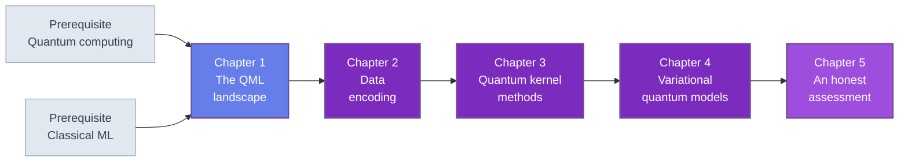

🌐 JP | [🇬🇧 EN](<../../../en/MI/quantum-machine-learning-introduction/index.html>) | Last sync: 2026-08-13

[AI寺子屋トップ](<../../index.html>)›[マテリアルズ・インフォマティクス道場](<../index.html>)›[量子機械学習入門](<index.html>)

[← マテリアルズ・インフォマティクス道場トップ](<../index.html>)

## 🎯 シリーズ概要

あなたはすでに材料データにモデルを当てはめています。そして誰かがすでに「量子コンピューティングはそれを変えるのか」と尋ねてきたはずです。本シリーズはその答えを、断言ではなく計算して示すものです。

量子機械学習は量子技術の中で最も過大に売られている分野であり、その過大な売り込みはたいてい不誠実ではありません。個々には正しい主張の連鎖から生じているのですが、その連鎖は人々が引き出す結論へは合成されないのです。$n$量子ビットのレジスタは $2^n$ 個の振幅を運ぶ。量子回路はデータ点間の内積を誘導する。その内積は古典的には計算困難でありうる。すべて真です。しかしそのどれも、量子モデルが組成記述子40行からより良く汎化するとは言いません。そしてそれが材料研究者が実際にもつ問いです。

そこで本コースは計算をします。すべての実験はシードを固定した1つの合成材料データセット、1つの固定した訓練/テスト分割、そして後続の章がごまかせないだけ厳しい1つの評価プロトコルの上で走ります。パラメータ数の一致、ハイパーパラメータは訓練データのみで選択、すべての結果に自明なベースラインとノイズ床を併記、本コースが主張するすべての差に対応のあるブートストラップ区間 — 各章がそれぞれ自分の分を印字します — そして実機が測らなければならなかったものすべてに明示的なショットコスト。このプロトコルの下で、ここに登場する量子モデルは勝つものもあり負けるものもあります。そして第1章にすでに最も示唆的な事例が入っています。古典ベースラインを*有意に*上回る量子特徴写像が、その後ノートPC上で記述子のsinとcos、およびその2つずつの積を評価するだけで小数14桁まで再現されてしまうのです。

この結果がこの分野全体の形です。興味深い問いは「量子は速いのか」ではなく、「符号化は物理について実際に何を仮定しているのか」「表現力の高いカーネルはなぜ自らの汎化能力を破壊するのか」「材料ワークフローのどこに量子プロセッサはそもそも接続しうるのか」であることが分かります。最後の問いへの誠実な答えは機械学習より上流にあり、第5章がそれを擁護します。

本コースはマテリアルズ・インフォマティクス道場に置かれる最初の量子コースであり、その配置自体が要点です。すでに信頼している古典ベースラインに照らして量子的主張を判断する人々のために書かれています。

### 学習パス

各章は厳密に逐次的です。第1章がシミュレータ・データセット・分割・古典ベースライン・評価プロトコルを固定し、以降の章はすべてそのセッションの続きとして動きます。第2章の符号化が第3章のカーネルの材料であり、第4章の変分モデルは第2章の特徴写像を再利用し、第5章が4章分の証拠を集めます。順序を変えて読むことは可能ですが、コードは動きません。

### 📋 学習目標

本シリーズを修了すると、以下のことができるようになります。

  * 任意のQML提案を4象限の分類 — *データ*が古典か量子か、*処理*が古典か量子か — に位置づけ、主張の妥当性を決めるのが象限であると説明できる
  * basis・angle・amplitude の各符号化を量子ビット数、回路深さ、状態準備の困難さで見積もり、この分野の真のボトルネックがモデルではなく符号化であると説明できる
  * 量子カーネル $k(x,x') = \lvert\langle\phi(x)\rvert\phi(x')\rangle\rvert^2$ を導出し、inversion test で推定し、カーネルリッジ回帰をNumPyだけで閉形式に解ける
  * 指数的集中を数値的に実証し、なぜ表現力の高い特徴写像が学習器としては劣るのかを説明できる
  * parameter-shift 勾配で変分量子回帰器を構築・訓練し、同一パラメータ数の古典ネットワークと公平に比較できる
  * dequantization と古典サロゲートを、ある量子モデルの量子性が本質的か付随的かを言えるだけの深さで説明できる
  * 第1章の7規則プロトコルで量子優位性の主張を読み、どの規則が破られているかを指摘できる

### 📖 前提知識

**必須。** [量子コンピューティング入門](<../../FM/quantum-computing-introduction/index.html>)の第1章から第3章の水準。量子ビットと状態ベクトル、標準ゲート集合、ミニ状態ベクトルシミュレータ、変分回路と barren plateau 問題です。同コース第2章のシミュレータは本コース第1章に逐語再掲され、そのAPIとビッグエンディアンの量子ビット順序が全編で無変更で使われます。

**必須。** 回帰・正則化・交差検証・過学習の水準での古典的な教師あり学習。材料側からの自然な入口は[マテリアルズ・インフォマティクス入門](<../mi-introduction/index.html>)であり、本コースが強く依拠する評価の機械については[モデル評価入門](<../../ML/model-evaluation-introduction/index.html>)が扱います。組成記述子に馴染みがあると合成データセットが抽象的に感じられなくなります — [組成ベース特徴量入門](<../composition-features-introduction/index.html>)をご覧ください。

**必須。** Python 3.8以降とNumPy、SciPy、Matplotlib。それだけです。この5章のどこにも量子SDK、ベンダーアカウント、実機アクセスはありません。

**推奨。** [量子ハードウェア入門](<../../FM/quantum-hardware-introduction/index.html>)。コスト見積もりで引用するショットレートやエラー率が実際にどこから来るのかが分かります。第5章はQQ象限が物理的に何を要求するかを論じる際にこれを参照します。

**あると有用（必須ではない）。** 第1章が描くパイプラインの獲得段階については[ベイズ最適化・アクティブラーニング入門](<../bayesian-optimization-introduction/index.html>)、量子技術がすでに材料科学を変えた象限の実例としては[機械学習ポテンシャル（MLP）入門](<../mlp-introduction/index.html>)。

* * *

## 📚 章構成

### 第1章: QMLの見取り図

何が主張されており、その主張が成り立つには何が真でなければならないのか。4象限の分類 — 古典/量子データ × 古典/量子処理 — と、材料情報学がすでに、誰もQMLと呼ばない象限に量子の成功譚をもっている理由。QMLを支持する論拠（指数的な状態空間、暗黙の特徴写像、data re-uploading による普遍性）を4つの標準的な反論（入力問題、出力問題、dequantization、集中）と、そして最も重要な5つ目 — シミュレーションの古典的困難性は良い帰納バイアスではない — に対置します。記述子から物性へのパイプラインのどこに量子プロセッサが接続しうるかの段階別の地図。そして以降の全章を律する7規則の評価プロトコルと共有の道具立て。ミニシミュレータの再掲、合成材料データセット、超えるべき数値を固定する閉形式リッジのベースライン、そして dequantization と集中の両方の最初の測定です。

**主要トピック** : 4象限の分類 · 入力問題と出力問題 · dequantization · カーネル集中 · 帰納バイアス · 同一予算プロトコル · 対応のあるブートストラップ · ショット会計 · 閉形式リッジのベースライン

💻 コード例6個 ⏱️ 40-45分 📊 中級

[第1章を読む →](<chapter-1.html>)

### 第2章: データ符号化 — QMLの本当のボトルネック

古典的な数値がどうやって量子状態に入るのか、そして各経路の費用。basis・angle・amplitude 符号化を量子ビット数・回路深さ・状態準備の困難さで比較し、指数的空間に届く符号化こそ準備する余裕がないものだという不都合な結論に至ります。符号化を、誘導内積をもつ特徴写像 $x \mapsto \lvert\phi(x)\rangle$ として捉え直すこと。これが第3章のカーネル的見方を可能にします。data re-uploading と、十分な再アップロードを伴う1量子ビットが普遍近似器である理由。そして下流のすべてを決める部分。符号化がモデルの周波数スペクトルを固定し、したがってそもそもどの関数を表現できるかを決めます。3種の符号化の実装、誘導カーネル行列の可視化、角度符号化モデルのフーリエスペクトルの数値抽出で締めます。

**主要トピック** : basis / angle / amplitude 符号化 · 状態準備コスト · 特徴写像と誘導内積 · data re-uploading · 普遍近似 · バンド幅と周波数スペクトル · 量子モデルのフーリエ解析

💻 コード例6個 ⏱️ 45-50分 📊 中級

[第2章を読む →](<chapter-2.html>)

### 第3章: 量子カーネル法

QMLの中で理論的に最も満足のいく一角であり、悪い知らせが最も明確な一角でもあります。カーネルトリックの復習、続いて量子カーネル $k(x,x') = \lvert\langle\phi(x)\rvert\phi(x')\rangle\rvert^2$ とその SWAPテストおよび inversion test による推定、そしてそれぞれのショットコスト。カーネルリッジ回帰をNumPyで閉形式に解きます — scikit-learn は使いません — のでパイプライン全体が見えます。続いて指数的集中。レジスタが大きくなると表現力の高い特徴写像はすべての非対角カーネル要素をゼロへ追い込み、Gram行列は単位行列となり、学習がそもそも可能でなくなります。これは断言ではなく数値で実演します。共有データセット上で量子カーネルリッジ回帰をRBFカーネルリッジ回帰と同一プロトコルで対決させ、量子側が勝つか否かにかかわらず結果を報告し、射影カーネルを含む緩和策の概観で締めます。

**主要トピック** : カーネルトリック · 量子カーネル · SWAPテストと inversion test · Gram要素あたりのショットコスト · 閉形式カーネルリッジ · 指数的集中 · Gram行列の条件数 · 射影カーネル

💻 コード例7個 ⏱️ 45-50分 📊 上級

[第3章を読む →](<chapter-3.html>)

### 第4章: 変分量子回路によるML

もう一方の主要な branch。勾配降下で訓練するパラメータ化回路です。変分量子回路の解剖 — 符号化層、変分層、測定 — と、姉妹コースの変分固有値ソルバとの厳密な対応。parameter-shift 勾配の導出と実装、訓練ループとそのショットコストの明示。barren plateau を機械学習の形で再訪します。深さ、大域測定、エンタングルメントがそれぞれどう損失地形を平坦化するのか、そしてそれが実際に訓練するつもりのモデルにとって何を意味するのか。続いて汎化。パラメータ $p$ 個の量子モデルを、同じデータ・同じ予算でパラメータ $p$ 個の古典ネットワークと比較します。これは文献がほとんど行わない比較です。訓練したVQC回帰器と同規模のNumPy製MLPを、学習曲線を並べて締めます。

**主要トピック** : VQCの構造 · 符号化層と変分層 · parameter-shift ルール · 訓練ループとショット予算 · QMLにおける barren plateau · 大域測定 vs 局所測定 · 過学習と同一予算比較 · 学習曲線

💻 コード例7個 ⏱️ 45-50分 📊 上級

[第4章を読む →](<chapter-4.html>)

### 第5章: 誠実な評価と展望

前4章の証拠が導く先。dequantization と古典サロゲート。量子モデルの量子性が荷重を担っているのか装飾なのかを見分ける方法と、サロゲートが優位性の主張を崩すのに厳密なシミュレーションである必要がない理由。量子優位性の論文の読み方 — ベンチマーク衛生、データ規模、ベースラインの強度、cherry-picking、そして欠けていたら関心を打ち切るべき具体的な対照実験。続いて本物の肯定的結果。*量子*データなら状況は違い、証明可能なサンプル複雑度の分離が存在します。量子学習器を扱うよりずっと前に量子センサや量子シミュレーションの出力を扱うことになる材料研究者にとって、それが何を意味するのか。いま学ぶ価値のあるもの — カーネル的見方、符号化の問い、評価の規律 — についての実践的指針とシリーズ総括で締めます。

**主要トピック** : dequantization · 量子カーネルの古典サロゲート · ベンチマーク衛生 · cherry-picking と選択的報告 · 量子データとサンプル複雑度の分離 · いま学ぶべきこと · シリーズ総括

💻 コード例6個 ⏱️ 45-50分 📊 上級

[第5章を読む →](<chapter-5.html>)

* * *

## 🔤 記法と共有規約

第1章で固定し、無変更で用います。どの章のコードもどの章のコードと一緒に動くようにするためです。

| 記号 | 意味 |
| --- | --- |
| $x \in [0,1]^4$ | 合成データセットの1行。4つの組成風記述子 |
| $y$ | 目標変数。形成エネルギー風のスカラー |
| $\lvert\phi(x)\rangle$ | 符号化回路がデータ行から準備する状態 |
| $k(x,x')$ | 量子カーネル $\lvert\langle\phi(x)\rvert\phi(x')\rangle\rvert^2$ |
| $\lambda$ | リッジの罰則。常に訓練行のみで選択する。第1章はleave-one-out、第2章以降は5分割、第4章の反復訓練は30/10の検証分割 |
| $S$ | 測定ショット数。期待値の標準誤差は高々 $1/\sqrt{S}$ |
| $p$ | 学習パラメータ数。比較の両側で一致させるべき量 |
| CC, CQ, QC, QQ | 象限のラベル。1文字目がデータ、2文字目が処理 |
| $X, Y, Z, H$, CNOT | ゲート記号。[量子コンピューティング入門](<../../FM/quantum-computing-introduction/index.html>)と同一 |

**量子ビットの順序。** 量子ビット0が最左・最上位ビットであり、姉妹コースと完全に同一です。Qiskitの規約とは逆です。

**データセットと分割。** 第1章のCode Example 2でシードを固定して生成する60行の合成データセット1つ。訓練集合＝先頭40行、テスト集合＝末尾20行。二度と引き直しません。

**基準となる数値。** 古典ベースラインはテストRMSE $0.2146$、$R^2 = 0.814$。ノイズ床は $0.0507$、訓練平均を予測すると $0.5242$。本シリーズのすべての結果はこの3つの数値に対して引用されます。

* * *

## 🔍 本シリーズの範囲と非範囲

**本シリーズは**すべての数値をゼロから再現する手法のコースです。すべてのコード例は素のNumPyかSciPyであり、本文中のすべての出力はその上のコードが生成したものであり、すべての比較は第1章のプロトコルに従います。

**SDKチュートリアルではありません。** Qiskitも PennyLane も Cirq もベンダーアカウントもクラウドバックエンドもありません。姉妹コースのミニシミュレータが唯一の量子インタフェースです。これにより物理が見えたままになり、あなたが読む頃にはAPIが変わっているであろうフレームワークの背後に隠れません。

**ベンチマーク勝利宣言ではありません。** 本コースは量子優位性を主張せず、それが不可能だとも主張しません。明示したプロトコルの下で自身の実験が見つけたものを報告します。量子モデルが負けた実験も含め、そして量子モデルが完全に古典的な理由で勝った実験も含めて。

**実材料データについての証拠ではありません。** データセットは設計上合成です。すべての数値が再現可能であり、どの結果も非公開データに依存しないためです。ここでの結論は手法とその評価の仕方についてであって、実在のどの物性についての達成可能な精度についてでもありません。

**ハードウェアのコースではありません。** 装置の数値、量子ビット数、ベンダーのロードマップはどこにも出てきません。ショット予算を引用するときはそれを算術として — 期待値1つあたり $1/\epsilon^2$ ショットとして — 引用しており、装置スペックとしてではありません。それらのレートの背後にある物理は[量子ハードウェア入門](<../../FM/quantum-hardware-introduction/index.html>)をお読みください。

## 📚 推奨学習パス

### パターン1: 完全習得コース（5-6日）

  * 1日目: 第1章 1.1-1.4節 — 分類、反論、パイプラインの地図、プロトコル
  * 2日目: 第1章 1.5節 — 6つの例をすべて走らせ、読み進む前に自分でベースラインの数値を再現する
  * 3日目: 第2章 — 符号化、特徴写像、再アップロード、周波数スペクトル
  * 4日目: 第3章 — 量子カーネルと集中問題
  * 5日目: 第4章 — 変分モデルと同一予算比較
  * 6日目: 第5章と演習 — dequantization、ベンチマーク衛生、そしてそれへの対処

### パターン2: 懐疑派のコース（半日）

  * 第1章 1.2節と1.4節 — 反論とプロトコル
  * 第1章 Code Example 5 — 可能な限り最小の例における dequantization
  * 第3章 3.6節 — 実演される集中
  * 第5章 5.1節から5.3節 — サロゲートと主張の読み方

### パターン3: 符号化のコース（1日）

  * 第1章 1.5節 — 道具立てとベースライン
  * 第2章を全文、コードつきで — 未解決の研究課題はここにあります
  * 第3章 3.1節と3.2節 — 符号化が誘導するもの
  * 第5章 5.6節 — この分野で働くつもりならいま学ぶべきこと

## 🎯 全体の学習成果

### 知識レベル

  * ✅ 4象限の分類と、各象限に固有のボトルネックを述べられる
  * ✅ 入力問題・出力問題・dequantization・集中を説明し、どの章がどれを扱うか言える
  * ✅ 量子カーネルを定義し、集中が表現力から従う理由を説明できる
  * ✅ シミュレーションの古典的困難性がより良い汎化を含意しない理由を説明できる

### 実践スキル

  * ✅ 素の状態ベクトルシミュレータで basis・angle・amplitude 符号化を実装できる
  * ✅ 量子カーネル行列を構築し、カーネルリッジ回帰を閉形式で解き、集中したGram行列を診断できる
  * ✅ parameter-shift 勾配を導出・実装し、変分回路を訓練できる
  * ✅ 交差検証による選択と、差に対する対応のあるブートストラップ区間を伴う同一予算比較を実行できる
  * ✅ 任意の量子的結果を、指定精度でのショットコストに変換できる

### 応用力

  * ✅ QML論文を読み、その象限・ベースライン・テスト集合の大きさ・欠けている区間を突き止められる
  * ✅ 与えられた量子モデルについて、効率的な古典サロゲートが存在しそうかを判断できる
  * ✅ 自分の材料ワークフローのどこに量子技術が貢献しうるか、どこにしえないかを同定できる
  * ✅ 否定的な結果が肯定的な結果と同じだけ情報をもつような実験を設計できる

## 🛠️ 使用する技術・ツール

### 主要ライブラリ

  * **numpy** — 状態ベクトルシミュレータ、すべての線形解法、すべてのカーネル行列
  * **scipy** — 折々の最適化と特殊関数
  * **matplotlib** — カーネル行列、学習曲線、集中のスケーリング

### 開発環境

  * **Python** : 3.8以上
  * **Jupyter Notebook** : 推奨。各章は1つの連続したセッションとして書かれています
  * Google Colabですべての例が動きます。GPUも量子バックエンドもアカウントも不要です

## 🚀 次のステップ

### 深化学習

  * 量子カーネル理論: 汎化限界、geometric difference、量子カーネルが近似困難であることが証明できる条件
  * 古典サロゲートとランダム化線形代数 — dequantization の結果の背後にある機械
  * 材料のための量子シミュレーション: QC象限の応用。姉妹コースの変分固有値ソルバの章から始めてください
  * 量子データからの学習: shadow tomography、classical shadows、証明可能なサンプル複雑度の分離

### 関連シリーズ

  * [量子コンピューティング入門](<../../FM/quantum-computing-introduction/index.html>) — 必須の前提であり、本コースのシミュレータの出典
  * [量子ハードウェア入門](<../../FM/quantum-hardware-introduction/index.html>) — ショットレートやエラー率が物理的にどこから来るのか
  * [マテリアルズ・インフォマティクス入門](<../mi-introduction/index.html>) — 本コースが照らし合わせる古典の現職
  * [モデル評価入門](<../../ML/model-evaluation-introduction/index.html>) — 無修正で移せる古典的な評価の規律
  * [機械学習ポテンシャル（MLP）入門](<../mlp-introduction/index.html>) — 量子技術がすでに貢献している象限

### 実践プロジェクト

  * プロトコルを保ったままデータだけ差し替えて、本コース全体を自分のデータセットで再実行する
  * 第3章の量子カーネルの古典サロゲートを実装し、量子側の結果をどれだけ追随するか見る
  * お気に入りの符号化の周波数スペクトルを測り、実際に当てはめる必要がある関数と照合する
  * 公開されたQMLベンチマークを取り、欠けている対応のある区間を加え、報告された優位性が生き延びるか確かめる

### ⚠️ 免責事項

  * 本コンテンツは教育・研究・情報提供のみを目的としており、専門的な助言(法律・会計・技術的保証など)を提供するものではありません。
  * 本コンテンツおよび付随するCode examplesは「現状有姿(AS IS)」で提供され、明示または黙示を問わず、商品性、特定目的適合性、権利非侵害、正確性・完全性、動作・安全性等いかなる保証もしません。
  * 本コースのデータセットはすべて合成であり、モデル比較はすべて例示です。示される数値は方法論を実演するものであって、実材料データについての証拠でも、いかなる量子装置の性能についての証拠でもありません。
  * 外部リンク、第三者が提供するデータ・ツール・ライブラリ等の内容・可用性・安全性について、作成者および東北大学は一切の責任を負いません。
  * 本コンテンツの利用・実行・解釈により直接的・間接的・付随的・特別・結果的・懲罰的損害が生じた場合でも、適用法で許容される最大限の範囲で、作成者および東北大学は責任を負いません。
  * 本コンテンツの内容は、予告なく変更・更新・提供停止されることがあります。
  * 本コンテンツの著作権・ライセンスは明記された条件(例: CC BY 4.0)に従います。当該ライセンスは通常、無保証条項を含みます。
