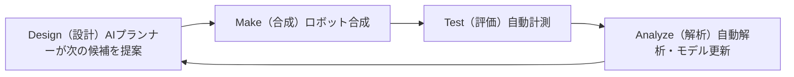

# 第1章: Self-Driving Lab とは何か

本章では Self-Driving Lab（SDL、自律実験室）を定義し、単なる自動化と区別される閉ループ実験サイクルを説明した上で、代表的なシステムを通じて分野の歴史をたどります。

**閉ループで回る自律実験**

## 学習目標

本章を修了すると、以下ができるようになります:

  * ✅ Self-Driving Lab を定義し、従来の実験自動化と区別できる
  * ✅ 閉じた DMTA（Design–Make–Test–Analyze）サイクルを説明できる
  * ✅ 実験室の自律性レベルを説明できる
  * ✅ 代表的な SDL システムを 3 つ挙げ、それぞれが実証したことを述べられる
  * ✅ 材料探索がなぜ自律実験を必要とするかを説明できる

**読了時間**: 20-25分 **コード例**: 2 **演習**: 3

* * *

## 1.1 問題: 材料開発は遅すぎる

新しい材料 — 電池電解質、太陽電池吸収層、触媒 — の開発には、最初の着想から実用化まで従来 **10〜20 年**かかってきました。ボトルネックはアイデアの不足ではなく、人間が運営する実験室の**実験スループット**です:

- 1 候補の合成・評価サイクルに通常数日かかる
- 研究者が実験できるのは勤務時間内だけ
- 結果は手作業で解析され、次の実験は経験と勘で選ばれる
- 知見は実験ノート、学位論文、卒業していく学生の頭の中に閉じ込められる

一方、探索空間は天文学的に広大です。4 成分系の合金や電解質配合を各成分 10 水準で刻むだけでも数千の候補組成が生じ、現実的な分子設計空間は 10^60 候補を超えます。全数実験は不可能であり、**残された道は、1 回 1 回の実験を最大限に活かし、実験を 24 時間回し続けることだけ**です。

**マテリアルズ・ゲノム・イニシアティブ**（米国、2011 年）は、まず計算とデータベースでこの問題に取り組みました。Mission Innovation の 2018 年 *Materials Acceleration Platform*（MAP）レポートはさらに踏み込み、AI・ロボティクス・計算を統合した自律探索プラットフォームとしての実験室を提唱しました。Self-Driving Lab はこの構想の具体的な実現形です。

## 1.2 定義: 実験室が「自律走行」するとは

> **Self-Driving Lab（SDL）とは、AI プランナーが実験を選び、ロボットがそれを実行し、自動計測装置が生成物を評価し、その結果がプランナーにフィードバックされる — 人間を介さずにループが閉じる実験室である。**

本質は**ループ**という言葉にあります。3 つの機能が接続されていなければなりません:

| 要素 | 役割 | 代表的な技術 |
|---|---|---|
| **頭脳** | 次の実験を決める | ベイズ最適化、能動学習 |
| **身体** | 試料を作り、測る | 分注ロボット、ロボットアーム、自動炉、インライン分光器 |
| **神経系** | 試料・データ・指令を運ぶ | オーケストレーションソフト、実験情報管理システム、パーサ |

### 自動化 ≠ 自律化

*自動化された（automated）*実験室と*自律的な（autonomous）*実験室はしばしば混同されます:

- **自動化（ハイスループット）実験室**: **事前に決められた**実験リストを高速に実行する。96 ウェルプレートの中身は実行前に人間が決めている。スクリーニングは速いが適応的ではない。
- **自律実験室（SDL）**: それまでの測定結果すべてに基づいて**自分で**次の実験を選ぶ。実験リストは事前には存在しない。

ハイスループットスクリーニングは、見込みのない領域も含めて探索空間に予算を一様に費やします。SDL はモデルの不確かさが大きい場所、または予測性能が高い場所に予算を集中させます。SDL が、グリッド探索なら数千回かかるところを**数十回の実験**で最適解に到達したと頻繁に報告されるのはこのためです。

### 実験室の自律性レベル

自動運転になぞらえて、実験室の自律性は次のようなレベルで語られます:

| レベル | 内容 | 人間の役割 |
|---|---|---|
| 0 | 手作業の実験 | すべて |
| 1 | 個別装置の自動化 | 計画・試料搬送・解析 |
| 2 | 自動化ワークフロー（固定レシピ列） | キャンペーン計画 |
| 3 | 固定ワークフローの閉ループ最適化 | 目的関数と探索空間の定義 |
| 4 | 閉ループ + 仮説やワークフローの自動適応 | 監督 |
| 5 | 完全自律の科学的発見 | 科学目標の設定 |

現在のほぼすべての SDL は**レベル 3** で動いています。ワークフロー（例:「混合し、焼成し、伝導度を測る」）は人間が固定し、機械はその中で自律的に最適化を行います。レベル 4〜5 は研究のフロンティアです。

## 1.3 閉じた DMTA サイクル

創薬や材料化学では、探索を **DMTA サイクル**（Design–Make–Test–Analyze、設計・合成・評価・解析）として記述します。従来の実験室では 1 周に数日から数週間かかり、その大半は人と装置の間の受け渡しに費やされます。SDL はこのサイクルを数時間〜数分で閉じます:



最小の閉ループを擬似コードにすると構造が具体的になります:

```python
# 最小の閉ループ SDL の骨格
model = SurrogateModel()                 # 例: ガウス過程
data = initial_experiments(n=5)          # 少数のランダム/空間充填の初期点

while not stopping_criterion(data):
    model.fit(data)
    x_next = acquisition_argmax(model)   # Design  （頭脳）
    sample = robot.synthesize(x_next)    # Make    （身体）
    y = instruments.measure(sample)      # Test    （身体）
    data.append((x_next, y))             # Analyze （神経系）

best = data.argmax()
```

どんなに高度な SDL も、このループの精緻化にすぎません。より良い代理モデル、並列バッチ、多目的化、より有能なロボット、より豊かな計測 — 以降の章でそれぞれを詳しく見ていきます。

### ループを閉じると何が得られるか

- **速度**: 実験室が 24 時間 365 日稼働し、サイクルタイムが日単位から時間単位に短縮される
- **データ効率**: 各実験が最も情報量の多いものとして選ばれ、グリッド探索やランダム探索に比べ実験数が典型的に 10〜100 分の 1 になる
- **再現性**: ロボットは毎回同一の手順を実行し、すべての操作が記録される
- **完全なデータ取得**: 人間がめったに公表しない失敗実験も記録され、モデルに活用される

## 1.4 代表的システムでたどる歴史

### ロボット科学者: Adam と Eve（2004〜2015）

最初期の「ロボット科学者」は **Ross King のグループ**から生まれました。**Adam**（2009 年）は酵母の機能ゲノミクスに関する仮説を自律的に生成し、それを検証する実験を設計・実行しました — 独立した科学的発見を成し遂げたと評された最初の機械です。後継機 **Eve** は同じアプローチを創薬初期スクリーニングに適用し、マラリアの標的に活性を持つ化合物を同定しました。仮説 → 実験 → 解析 → 繰り返し、という人間を介さないテンプレートを確立したのがこの 2 台です。

### Ada: 材料版 SDL（2018〜）

カナダの Curtis Berlinguette、Jason Hein、Alán Aspuru-Guzik のグループが構築した **Ada** は、**薄膜材料**を対象とする最初期のモジュール型 Self-Driving Lab の一つです。Ada は薄膜を合成し、光学・電子物性を測定し、ベイズ最適化でプロセス条件を調整しました — 太陽電池用の有機正孔輸送層などを対象に、実材料プロセスの閉ループ最適化を実証しました。

### 移動型ロボット化学者（2020）

リバプール大学の Andrew Cooper のグループは別のアプローチを取りました。専用統合プラットフォームを作る代わりに、**移動ロボット**に人間用の化学実験室をそのまま使わせたのです。ロボットはステーション間を移動してバイアルを扱い、装置を操作し、水素発生用光触媒のより良い配合を 10 次元空間で探索しました。**8 日間で 688 実験**を自律実行し、初期配合の約 **6 倍活性**の光触媒ブレンドを発見しました（Burger et al., *Nature* 2020）。自律化は普通の実験室に後付けできる — ロボットが人間と同じ装置を使う — ことを示した成果です。

### A-Lab: 自律固相合成（2023）

ローレンス・バークレー国立研究所の **A-Lab**（Gerbrand Ceder のグループ）は、無機材料探索で最も難しいステップ、すなわち**予測された化合物を実際に作ること**に挑みました。Materials Project と Google DeepMind の GNoME 予測から候補化合物を受け取り、固相合成の条件を自律的に計画し、ロボットによる粉末秤量と電気炉で実行し、自動 X 線回折解析で生成物を同定します。最初の報告では 17 日間で新規化合物 58 種の合成を試み、41 種の合成成功を主張しました（Szymanski et al., *Nature* 2023）。

この主張は大きな検証を呼びました。Robert Palgrave や Leslie Schoop らの固体化学者は、生成物のいくつかは誤同定されていたか、既知相だったと論じました。この論争は第 4 章で詳しく扱いますが、それ自体が重要な教訓となりました: **自律的なキャラクタリゼーションと相同定は、自律合成と同じくらい本質的**であり、SDL の成果を検証するコミュニティ標準はまだ形成途上です。

### 今日のエコシステム

SDL は現在、有機合成（Cronin の Chemputer、IBM の RoboRXN）、光電変換薄膜、ナノ粒子、配合設計、電極触媒、電池材料へと広がっています。トロント大学の **Acceleration Consortium**、米国の MGI エコシステム、日本では NIMS の **NIMO** オーケストレーションパッケージや NIMS-OS など、国内外のプログラムが共有プラットフォームを構築中です。総説文献（Häse, Roch & Aspuru-Guzik、Stach ら、Abolhasani & Kumacheva, *Nature Synthesis* 2023 など）は、SDL を Materials Acceleration Platform 構想の実行エンジンと位置づけています。

## 1.5 SDL を作る価値があるのはいつか

SDL が威力を発揮するのは次の 3 条件が揃うときです:

1. **実験が高価または遅い** — 1 データ点に何時間もの装置時間と実費がかかり、データ効率が効く
2. **明確に定義された測定可能な目的関数** — 伝導度、収率、効率、活性。ループには最適化すべき数値が必要
3. **自動化可能な単位操作** — ロボットが実際に実行できる合成・計測ステップ

逆に、目的が曖昧な場合（「面白い新しい化学」）、合成が自動化に馴染まない職人技を要する場合、1 実験が安すぎて力任せのスクリーニングで十分な場合には、SDL は不向きです。目安として、**SDL は*再利用可能な*実験能力への投資**です — プラットフォームは 1 回のキャンペーンではなく、多数のキャンペーンを通じて元を取ります。

```python
# 概算: 閉ループはいつスクリーニングに勝つか
grid_experiments   = 10**4      # 4 パラメータの全数グリッド
sdl_experiments    = 60         # 典型的な閉ループキャンペーン
cost_per_exp_hours = 6

print("Grid:", grid_experiments * cost_per_exp_hours / 24 / 365, "years")
print("SDL :", sdl_experiments  * cost_per_exp_hours / 24, "days")
# Grid: 約 6.8 年   SDL: 約 15 日
```

## 1.6 本章のまとめ

- 材料探索はスループット律速であり、探索空間は全数実験には広すぎる
- SDL は Design–Make–Test–Analyze のループを閉じる: AI プランナー（頭脳）、ロボット実行（身体）、オーケストレーションとデータ基盤（神経系）
- 自律化は自動化とは異なる: SDL は自分で次の実験を選ぶ
- 代表的システム — Adam/Eve、Ada、移動型ロボット化学者、A-Lab — が、仮説生成、薄膜最適化、後付け自律化、自律固相合成を順に実証してきた
- A-Lab 論争は、検証とキャラクタリゼーションの標準もエンジニアリング課題の一部であることを示した
- SDL が報われるのは、実験が高価で、目的が測定可能で、操作が自動化可能なとき

**次章**: 頭脳 — ベイズ最適化と能動学習はどのように次の実験を決めるのか。

## 演習問題

1. **概念**: 次の各項目が*自動化*か*自律化*か、理由とともに述べよ: (a) 固定レシピファイルから 96 ウェルプレートを調製する分注ロボット、(b) 今日の XRD 結果から明日の合成計画を毎晩立て直すシステム、(c) 温度プログラム付き電気炉。
2. **定量**: グリッド探索は 5,000 実験 × 4 時間を要する。閉ループは 80 実験で同じ最適解に達するが、1 実験あたり 15 分の計画オーバーヘッドが加わる。(a) 装置 1 台、(b) 並列 8 台のそれぞれで、両アプローチの実時間を計算せよ。
3. **議論**: 移動型ロボット化学者は人間用実験室を再利用し、A-Lab は専用設計だった。SDL プロジェクトを始める大学の研究室にとって、それぞれの戦略の利点と欠点を 2 つずつ挙げよ。
