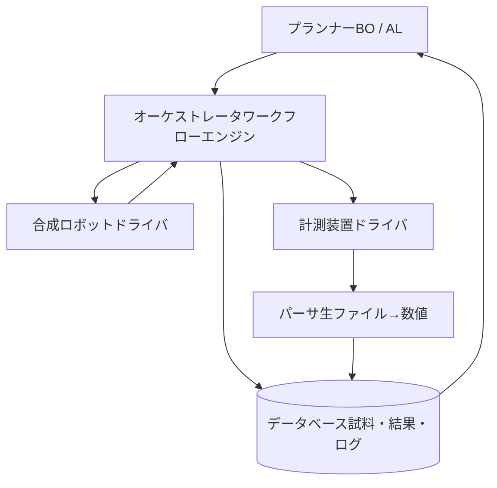

# 第3章: 身体 — 自動化とオーケストレーション

本章では SDL の物理的・ソフトウェア的インフラを概観します: 合成ロボット、自動計測、試料搬送、オーケストレーションソフトウェア、そしてループを閉じるデータパイプラインです。

**ロボット・計測装置・それらを束ねるソフトウェア**

## 学習目標

本章を修了すると、以下ができるようになります:

  * ✅ 主要なロボット合成方式（分注、粉体、フロー、移動ロボット）を説明できる
  * ✅ どの計測手法が自動化しやすいか、その理由とともに説明できる
  * ✅ オーケストレーションソフトウェアの役割と代表的パッケージを挙げられる
  * ✅ 自動データパースと、それが大きなエンジニアリングコストである理由を説明できる
  * ✅ 与えられた材料課題に対する SDL の全体構成を描ける

**読了時間**: 20-25分 **コード例**: 3 **演習**: 3

* * *

## 3.1 合成ハードウェア: 4 つの方式

### 分注（リキッドハンドリング）

バイオ分野から受け継いだ、最も成熟した自動化方式です。分注ロボット（Opentrons、Hamilton、Tecan）がマイクロリットル単位の液体をウェルプレートに分配します。**溶液プロセス材料** — ナノ粒子合成、ペロブスカイト前駆体インク、ポリマー配合、電解液ブレンド — に最適です。エントリーレベルのオープンソース分注機は数十万円程度で入手でき、溶液系 SDL が最も一般的な出発点になっているのはこのためです。

### 粉体ハンドリングと固相合成

固相化学 — 粉末の秤量、粉砕、ペレット成形、炉での焼成 — の自動化は、はるかに長い間困難でした。粉体は付着し、凝集し、流動性が変動するからです。**A-Lab** がその旗艦的実証です: るつぼへのロボット粉末秤量、ロボットアームによる箱型炉への搬送、生成物の自動回収と粉砕。商用の粉体秤量ステーション（例: Chemspeed）は現在、電池・触媒 SDL で使われています。

### フロー化学

フロー系では試薬が温度制御されたリアクターを連続的に流れます。滞留時間・化学量論・温度が**連続的に調整可能なつまみ**になり、インライン分析が生成物をリアルタイムに測定します。フロー SDL（IBM の RoboRXN や多くのナノ粒子プラットフォーム）は 1 条件あたり数分という最速のサイクルタイムと優れた再現性を提供します。代償は、ポンプ輸送に耐える化学に限られることです。

### 移動ロボット

リバプールの移動型ロボット化学者(第 1 章)は後付け戦略を示しました: 車輪付きの自走ロボットアームが、**人間用の実験室で人間用の装置**を使います。モジュール性は最大 — 新しい装置は、ロボットにボタンの場所を教えれば追加できます — ですが、ロボットがステーション間を 1 試料ずつ歩いて運ぶため、スループットには限界があります。

| 方式 | 得意分野 | サイクルタイム | 成熟度 |
|---|---|---|---|
| 分注 | 溶液・配合 | 分〜時間 | 高 |
| 粉体・固相 | セラミックス・電池材料 | 時間〜日 | 中（A-Lab 世代） |
| フロー化学 | 有機物・ナノ粒子 | 分 | 高 |
| 移動ロボット | 既存実験室の後付け | 時間 | 発展中 |

## 3.2 自動計測

「Test」ステップは、人間がスペクトルを読まなくても、プランナーが最適化できる数値を自動で生み出さなければなりません。

**自動化しやすい:**

- **UV-Vis / フォトルミネッセンス** — インラインのファイバー分光器。ナノ粒子・ペロブスカイト SDL の標準装備
- **XRD** — 自動試料交換は日常的。難しいのは*自動解釈*（相同定）で、A-Lab の中核的貢献の一つ（データベースと照合する ML 支援パターンマッチング）
- **電気化学** — ポテンショスタットは本質的にコンピュータ制御。伝導度・インピーダンス・安定窓の測定は自然に統合できる
- **光学顕微鏡 + コンピュータビジョン** — 膜質スコアリング、液滴検出、結晶化モニタリング
- **フロー中の NMR / HPLC / MS** — 有機合成 SDL での収率定量として成熟

**自動化しにくい（現時点）:** TEM（手作業のグリッド準備と専門家による解釈）、XPS（超高真空への試料搬送）、そして解釈自体が研究課題であるような測定全般。実務的な設計原則: **ロボットが数分で測定できる目的関数を選ぶ**こと。遅く専門家依存の測定は、最終的な勝者候補のオフライン検証に回します。

## 3.3 オーケストレーションソフトウェア

分注機に分注を指示し、炉の完了を待ち、測定を起動し、パース済みの結果をプランナーに渡す — この「何か」が**オーケストレータ**です。SDL 構築で最も地味で、最も工数を食う部分です。



代表的パッケージ:

| パッケージ | 出自 | 備考 |
|---|---|---|
| **ChemOS** | Aspuru-Guzik グループ | 初期の汎用 SDL オペレーティングシステム |
| **Bluesky** | NSLS-II / APS | 放射光ビームライン級の実験オーケストレーション。広く再利用されている |
| **HELAO** | Caltech/HTE コミュニティ | 非同期分散ラボ自動化 |
| **NIMO** | NIMS | プランナー非依存のオーケストレーション。[NIMO シリーズ](../nimo-introduction/index.html)参照 |
| **NIMS-OS** | NIMS | AI とロボットを統合した自律実験運用 |

装置**ドライバ**は慢性的な急所です。実験装置の多くは GUI 専用のベンダーソフトしか持たないため、SDL 構築者はシリアルコマンド、ベンダー API、時には GUI 自動化のラッパーを書くことになります。標準化の取り組み — 装置通信の **SiLA 2**、分析データの **AnIML** — はプラグアンドプレイ化を目指していますが、カバレッジはまだ部分的です（第 5 章）。

```python
# オーケストレーションコードの実際（簡略化）
def run_experiment(x):
    plate = liquid_handler.prepare(composition=x)        # ドライバ 1
    film  = spin_coater.coat(plate, speed=x["rpm"])      # ドライバ 2
    annealer.bake(film, temp=x["T"], minutes=x["t"])     # ドライバ 3
    raw   = spectrometer.measure(film)                   # ドライバ 4
    y     = parse_spectrum(raw)                          # パーサ
    db.log(x, y, raw_path=raw.path)                      # 来歴記録
    return y
```

## 3.4 データパイプライン

ループを閉じるには、**装置の生出力をプランナーの入力に**人手ゼロで変換する必要があります:

1. **パース**: ベンダー独自バイナリ → 数値（ピーク位置、伝導度、収率）。壊れやすく、フォーマット変更が静かにループを破壊する。
2. **品質管理**: 自動サニティチェック — 分注は成功したか? スペクトルは飽和していないか? 失敗実験は「悪い材料」として静かに記録されるのではなく、*検出*されなければならない。試料のコンピュータビジョン検査（空のウェル? 割れた膜?）は標準になりつつある。
3. **来歴（プロベナンス）**: すべての試料に、組成・プロセス履歴・生ファイル・導出値を結びつける ID を付与する。これが SDL データセットを FAIR（見つけられる・アクセスできる・相互運用できる・再利用できる）にし、公表可能にする。
4. **保存**: CSV のフォルダではなく本物のデータベース（SQL/NoSQL）。プランナーは毎サイクルこれに問い合わせる。

各チームが一貫して報告するのは、**統合とパースが総構築工数の半分以上を消費する**ことです — ロボットよりも多く、ML プランナーよりはるかに多い。予算計画はそれを前提に。

## 3.5 統合する: リファレンスアーキテクチャ

具体例として、薄膜最適化 SDL:

- **探索空間**: 前駆体比（連続 4 変数）、焼成温度・時間（連続 2 変数）、溶媒（カテゴリ変数）
- **Make**: 分注ロボットがインクを混合 → スピンコータ → 自動ホットプレートアレイ
- **Test**: カメラが膜の均一性を採点（失敗を棄却）→ ファイバー UV-Vis でバンドギャップ測定 → 四端子プローブでシート抵抗測定
- **Analyze**: パーサが（組成、プロセス、バンドギャップ、抵抗）をデータベースに書き込む
- **頭脳**: バンドギャップ目標と抵抗の多目的 BO（EHVI）。バッチサイズ = ホットプレート容量
- **神経系**: オーケストレータがバッチをスケジュールし、分注失敗をリトライし、ハードウェア障害時には人間に警報を出す

人間の役割が消えていない点に注意してください: 人間は**試薬を補充し、詰まりを直し、勝者を検証し、キャンペーンの終了を判断します**。現在の SDL は、人間が監督する枠内でのレベル 3 自律です。

## 3.6 本章のまとめ

- 合成方式は 4 つ: 分注（最も成熟）、粉体・固相（A-Lab 世代）、フロー（最速サイクル）、移動ロボット（後付け）
- 数分で自動測定できる目的関数を選ぶ。XRD 解釈と膜質ビジョンが鍵となる分析技術
- オーケストレーションソフト（ChemOS、Bluesky、HELAO、NIMO、NIMS-OS）がドライバ・パーサ・データベース・プランナーを束ねる。装置ドライバが慢性的な急所
- データパイプライン — パース、QC、来歴、保存 — がエンジニアリング工数の大半を消費する
- 人間は枠内に残る: メンテナンス、検証、キャンペーンレベルの判断

**次章**: SDL が実際に達成したこと — 実例研究とその論争。

## 演習問題

1. **設計**: ポリマー電解質膜のイオン伝導度を最適化する SDL のブロック図を描け。各ブロックに具体的な装置名を与え、カスタムドライバが必要なリンクに印を付けよ。
2. **概念**: 分注失敗の検出器は、人間が運用するハイスループットスクリーニングよりも自律ループでなぜ重要か。検出器がない場合、代理モデルには何が起きるか。
3. **見積り**: パーサがスペクトルの 2% で壊れ、静かに 0 を返すとする。200 実験のキャンペーン後、モデルはおよそ何個の汚染データ点を抱えるか。プランナーは探索空間のどこで誤誘導されるか。
