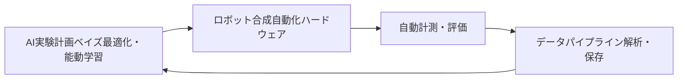

# 自動実験・Self-Driving Labs 入門

**自律実験による材料探索の加速**

新材料の開発には、着想から実用化まで従来 10〜20 年かかってきました。Self-Driving Lab（SDL、自律実験室）— 自らの実験を計画・実行・解析する閉ループの実験室 — は、この期間を一桁短縮することを目指しています。本シリーズでは、SDL の仕組み、実際に達成された成果、そして残された課題を解説します。

## シリーズ概要

SDL は 3 つの要素を閉ループで結合します:

1. **頭脳** — 次に行うべき実験を決める機械学習ベースの実験計画（ベイズ最適化・能動学習）
2. **身体** — 計画を実行するロボット合成装置と自動計測装置
3. **神経系** — 両者をつなぐオーケストレーションソフトウェアとデータ基盤

## 各章の内容

| 章 | タイトル | 学べること |
|---------|-------|---------------------|
| 1 | [Self-Driving Lab とは何か](chapter-1.html) | 閉ループ実験、DMTA サイクル、歴史と代表的システム |
| 2 | [頭脳: AI による実験計画](chapter-2.html) | SDL の頭脳としてのベイズ最適化と能動学習、バッチ計画・多目的計画 |
| 3 | [身体: 自動化とオーケストレーション](chapter-3.html) | ロボット合成、自動計測、ワークフローオーケストレーション |
| 4 | [実例研究](chapter-4.html) | A-Lab、移動型ロボット化学者、薄膜・ペロブスカイト SDL — 成果と論争 |
| 5 | [課題と展望](chapter-5.html) | 再現性、標準化、データ共有、人間の役割、世界の取り組み |

## 前提知識

- 機械学習の基礎概念（回帰、不確かさ）
- あると望ましい: [ベイズ最適化](../../PI/bayesian-optimization/index.html)・[能動学習](../active-learning-introduction/index.html)シリーズ

## 関連シリーズ

- [ベイズ最適化入門](../../PI/bayesian-optimization/index.html) — SDL で最もよく使われる「頭脳」
- [能動学習入門](../active-learning-introduction/index.html) — データ効率の高い実験選択
- [NIMO 入門](../nimo-introduction/index.html) — NIMS が開発するオーケストレーションツール
