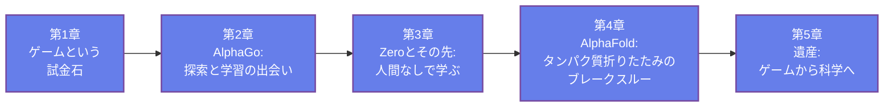

🌐 JP | [🇬🇧 EN](<../../../en/ML/alphago-to-alphafold/index.html>) | Last sync: 2026-08-19

[AI寺子屋トップ](<../../index.html>)›[機械学習道場](<../index.html>)›[AlphaGoからAlphaFoldへ](<index.html>)

[← 機械学習道場トップ](<../index.html>)

## 🎯 シリーズ概要

あるプログラムがボードゲームの打ち方を学びました。それから10年と経たないうちに、そのプログラムが始めた一連の研究がノーベル化学賞を分かち合いました。本シリーズは、それがどのように起きたのか、2つの問題のあいだで実際に何が引き継がれたのか、そして——大半の解説が飛ばしてしまう部分ですが——何がまったく解決されなかったのかを扱います。

道筋はゲームから科学へと貫かれています。**なぜゲームがAIの試金石だったのか**、そしてなぜ囲碁がチェスを打ち負かした手法に抵抗したのかを設定し、学習された評価と**モンテカルロ木探索（MCTS）**から **AlphaGo** を組み立てて、両者がどう互いの弱点を補い合うのかを見ます。続いて後継システムたちが**人間のデータを削除**し、さらにゲーム固有の機構までも削除しながら、引き算のたびに強くなっていく様子を追います。そして **AlphaFold** へ移ります。そこでは自己対局が不可能であり、正解データはまったく別の場所から調達しなければなりませんでした。最後は**遺産**——AlphaFoldデータベース、2024年のノーベル化学賞、材料科学への波及、そして未解決問題についての容赦なく率直な報告——で締めくくります。

本シリーズは実装コースではなく、**歴史と原理**のシリーズです。全体を貫く問いはただ1つ——*フィードバック信号はどこから来るのか?* ——であり、その答えこそが、2つのシステムの一見矛盾した軌跡を説明します。AlphaGoが人間の知識を捨てられたのは、囲碁のルールが無制限かつ無償の正解データを供給するからでした。一方AlphaFoldは、進化がすでに記録し終えていた正解データへの通り道を、自分で敷設しなければならなかったのです。

本シリーズは、**見出しの背後にある概念の背骨を知りたい機械学習の学習者**、そして**これらのシステムを自分の研究の比喩として繰り返し目にし、その比喩がどこまで通用するのかを知りたい材料科学・生命科学の研究者**に向けて書かれています。**機械学習道場**の中では、本シリーズが歴史として扱うアルゴリズムをきちんと構築する[強化学習入門](<../reinforcement-learning-introduction/index.html>)を補完し、あわせて[グラフニューラルネットワーク入門](<../gnn-introduction/index.html>)や[Transformer入門](<../transformer-introduction/index.html>)——それらのアーキテクチャの発想はAlphaFoldの物語の随所に現れます——とも響き合います。

> **誇張についての約束を、最初に述べておきます。** 本シリーズは、精確に述べられない結果には名前を与えず、論争のある数値は引用せず、ベンチマークでの勝利を「解決済みの科学」として記述することもしません。主張が争われている場合——たとえばAI駆動の材料探索パイプラインが発表した件数など——は、繰り返すのではなく「争われている」と報告します。システムが本当に見事である場合は、率直にそう述べます。ここでの価値基準は **旗色ではなく較正（calibration over allegiance）** です。あらゆる発表を「すべてが解決される途上の形式的な一歩」として扱うのでもなく、あらゆる結果を宣伝として扱うのでもありません。

### 学習パス

### 📋 学習目標

  * なぜゲームがAI研究の試金石として機能したのか、そしてすでにチェスを解決していた探索手法に囲碁が抵抗した理由は具体的に何だったのかを説明できる
  * AlphaGoが学習された評価とモンテカルロ木探索をどう組み合わせたのか、そしてなぜどちらの要素も単独では不十分だったのかを述べられる
  * 自己対局がどのようにして人間の訓練データを不要にするのか、そしてなぜその除去がゲームでは可能でタンパク質立体構造予測では不可能だったのかを説明できる
  * AlphaFoldが何を予測するのか、進化情報と幾何構造が何を寄与しているのか、そしてなぜCASPがその結果を「単なる主張」ではなく「信頼できるもの」にしたのかを述べられる
  * 科学におけるAIについての主張を、実際に測定されたものに照らして判断できる——ベンチマークの結果と解決された問題を区別し、安価で信頼できるフィードバック信号が存在する場所としない場所を見分けられる

### 📖 前提知識

**機械学習の基礎概念** が唯一の本当の要件です。ニューラルネットワークとは「データに当てはめられたパラメータをもつ関数」という水準での理解、訓練と汎化の意味、そして教師あり学習のおおまかな考え方です。入門的なML教材を1つでも通読していれば、それで十分です。

**Python** は各章に1つずつ、**NumPy** だけを使う短い自己完結のハンズオンとして登場します。実装を教えるためではなく、各章の議論を定量的にするために置かれています。走らせずに読み進めることもできますが、走らせたほうが説得力があります。

**ゲームAIの予備知識は必要ありません。** ミニマックス法、探索木、分岐因子、モンテカルロ木探索は、すべて最初から積み上げていきます。**生物学の予備知識も必要ありません。** アミノ酸、タンパク質の折りたたみ、マルチプル配列アラインメント、CASPによる評価は、必要になった時点で、生化学を実践するためではなく議論を追えるようにするための水準で導入します。

第1章

ゲームという試金石

なぜボードゲームが人工知能の標準的な試験場になったのかを理解します。何がチェスを扱いやすくし、何が囲碁を違うものにしていたのか——全探索を打ち負かす分岐因子と、誰も手で書き下せなかった局面評価の問題——を見て、なぜ囲碁が「最も長く持ちこたえるベンチマーク」と広く見なされていたのかを理解します。

ゲームAIの歴史 探索木 分岐因子 評価関数 なぜ囲碁は難しかったのか

⏱️ 20-25分

[第1章を読む →](<chapter-1.html>)

第2章

AlphaGo: 探索と学習の出会い

2つの半身がどう噛み合うのかを見ます。学習された方策が「考慮する価値のある手」を絞り込み、学習された価値関数が最後まで打たずに勝敗の見込みを推定する仕組み、そしてモンテカルロ木探索がその両方をどう使うのか——ネットワークが探索にどこを見るべきかを教え、探索がネットワークに何が重要だったかを教える——を学びます。

方策ネットワーク 価値ネットワーク モンテカルロ木探索 教師ありブートストラップ イ・セドル戦

⏱️ 25-30分

[第2章を読む →](<chapter-2.html>)

第3章

Zeroとその先: 人間なしで学ぶ

人間のデータが削除され——そしてシステムが強くなる様子を見届けます。人間の棋譜を一切使わない純粋な自己対局への移行、2つのネットワークの1つへの統合、手作り特徴量とロールアウトの除去、そして最後に囲碁を超えた一般化までを追い、そのすべてを可能にしたゲームの性質が何だったのかを正確に理解します。

自己対局 タブラ・ラサ学習 アーキテクチャの簡素化 ゲームを跨ぐ一般化 無償の検証器

⏱️ 25-30分

[第3章を読む →](<chapter-3.html>)

第4章

AlphaFold: タンパク質折りたたみのブレークスルー

自己対局が通用しない問題へ移ります。タンパク質立体構造予測が何を問うているのか、なぜ数十年の努力が足踏みしていたのか、マルチプル配列アラインメントの中の進化情報がどのようにして「ゲームのルールが無償で供給していた正解データ」の代わりを務めるのか、幾何と対称性がどうアーキテクチャに入ってくるのか、そしてCASPの結果が何を示し何を示さなかったのかを学びます。

タンパク質折りたたみ マルチプル配列アラインメント 幾何的推論 CASP 信頼度の推定

⏱️ 30-35分

[第4章を読む →](<chapter-4.html>)

第5章

遺産: ゲームから科学へ

2つの軌跡の見かけ上の矛盾を解消し、達成されたことの周囲に誠実な境界線を引きます。フィードバック信号についての議論を短いNumPyシミュレーションで定量化し、AlphaFoldデータベースとそれが実務に与えた影響を概観し、2024年ノーベル賞の分割を正しく押さえ、材料科学へ渡ったテンプレートをそれに値する慎重さとともに追い、「解決済み」が決してカバーしなかった未解決問題を検討します。

フィードバック信号 AlphaFoldデータベース 2024年ノーベル賞 材料スクリーニング 未解決問題

💻 NumPyハンズオン ⏱️ 25-30分

[第5章を読む →](<chapter-5.html>)

## 📚 推奨学習パス

### パターン1: 初学者 - フルツアー（5日間）

  * 1日目: 第1章（なぜゲームなのか、そしてなぜ囲碁は難しかったのか）
  * 2日目: 第2章（AlphaGo: 探索と学習の出会い）
  * 3日目: 第3章（自己対局と人間データの除去）
  * 4日目: 第4章（AlphaFoldとタンパク質の問題）
  * 5日目: 第5章（遺産と誠実な限界）＋ 復習

### パターン2: 中級者 - ファストトラック（3日間）

  * 1日目: 第1-2章（問題と最初のシステム）
  * 2日目: 第3-4章（事前知識の削除、そして構造の注入）
  * 3日目: 第5章（遺産、限界、そして全演習問題）

### パターン3: 研究者 - 議論に直行（1日）

  * 第1章は分岐因子と評価の問題だけ拾い読みする
  * 第3章を読み、自己対局が問題に何を要求するのかを掴む
  * 第4章を丁寧に読む（自己対局が使えないとき、正解データはどこから来るのか）
  * 第5章を全文読み、AI for scienceの結果を誰かに引用する前にシミュレーションを走らせる

## 🎯 全体の学習成果

本シリーズを修了すると、次のことができるようになります。

### 知識レベル

  * ✅ チェスを解決した探索手法に囲碁が抵抗した理由を説明できる
  * ✅ AlphaGoにおける方策ネットワーク、価値ネットワーク、木探索それぞれの役割と、それらが互いをどう強化し合うのかを述べられる
  * ✅ 自己対局が可能になるために問題が満たすべき条件を述べ、なぜタンパク質立体構造がそれを満たさないのかを説明できる
  * ✅ 2024年ノーベル化学賞が何を評価したのかを、賞の両方の半分を含めて述べ、CASPの結果が何を示し何を示さないのかを説明できる

### 実践スキル

  * ✅ 問題をフィードバックの体制——無償で厳密な検証器、配給制の厳密な検証器、安価な代理指標＋少ない予算——によって分類できる
  * ✅ 代理指標の質が、限られた検証予算で何を達成できるかをどう決めるのかを示す短いNumPyシミュレーションを実行・改変できる
  * ✅ 世界についての言明可能な事実を符号化しているドメイン事前知識と、単なるアーキテクチャの装飾とを区別できる
  * ✅ AI for scienceの発表を読み、予測されたものと独立に検証されたものを切り分けられる

### 応用力

  * ✅ AlphaGoあるいはAlphaFoldの比喩が、自分の分野の問題に本当に当てはまるのかを判断できる
  * ✅ 自分の仕事の中で最も安価で信頼できるフィードバック信号を見きわめ、その改善を工学的な目標として扱える
  * ✅ CASPのブラインドかつ独立評価の構造を手本に、自分のドメイン向けの評価を設計できる
  * ✅ 機械学習の結果を、較正された主張とともに伝えられる——ベンチマークが何を測り、何を省いているのかを明示して

## 🛠️ 使用技術・ツール

### 主なライブラリ

  * **numpy**

### 開発環境

  * **Python** : 3.8以上
  * **Jupyter Notebook** : 対話的な開発と可視化
  * **IDE** : VSCode、PyCharmなど

### 推奨ツール

  * Google Colab（クラウドベース、セットアップ不要）
  * Anaconda Distribution（完全な環境）
  * Git（演習のバージョン管理）

## 🚀 次のステップ

### 発展的な学習

この分野をさらに深く学ぶために:

  * モンテカルロ木探索と現代のプランニングアルゴリズム
  * 幾何的深層学習と同変アーキテクチャ
  * 評価の設計: ブラインドベンチマークと保留評価

### 関連シリーズ

関連トピックで知識を広げましょう:

  * [強化学習入門](<../reinforcement-learning-introduction/index.html>)（自己対局の背後にあるアルゴリズムを、きちんと構築する）
  * [グラフニューラルネットワーク入門](<../gnn-introduction/index.html>)（構造化された関係データ上での学習）
  * [Transformer入門](<../transformer-introduction/index.html>)（AlphaFoldの物語に繰り返し現れるアテンション機構）
  * [OERの計算化学](<../../MI/oer-computational-chemistry/index.html>)（1つの具体的な科学ドメインにおける「予測してから検証する」）
  * [触媒設計へのMI応用](<../../MI/catalyst-mi-application/index.html>)（その上に載るデータ駆動の層と、それ自身の誠実な限界）

### 実践プロジェクト

手を動かすプロジェクトでスキルを応用しましょう:

  * 自分の仕事の中の問題を1つ選び、第5章の3つのフィードバック体制に照らして監査し、それを1段階良い体制へ動かす変更を提案する
  * 第5章のシミュレーションを拡張し、代理指標が探索空間の一部でのみ信頼できる場合に優位性がどう変わるかを報告する
  * 公開されたAI駆動の科学的発見の発表を1つ選び、第5章の問いに照らして批判的に検討する

### 免責事項

  * 本コンテンツは教育・研究・情報提供のみを目的としており、専門的な助言(法律・会計・技術的保証など)を提供するものではありません。
  * 本コンテンツおよび付随するCode examplesは「現状有姿(AS IS)」で提供され、明示または黙示を問わず、商品性、特定目的適合性、権利非侵害、正確性・完全性、動作・安全性等いかなる保証もしません。
  * 外部リンク、第三者が提供するデータ・ツール・ライブラリ等の内容・可用性・安全性について、作成者および東北大学は一切の責任を負いません。
  * 本コンテンツの利用・実行・解釈により直接的・間接的・付随的・特別・結果的・懲罰的損害が生じた場合でも、適用法で許容される最大限の範囲で、作成者および東北大学は責任を負いません。
  * 本コンテンツの内容は、予告なく変更・更新・提供停止されることがあります。
  * 本コンテンツの著作権・ライセンスは明記された条件(例: CC BY 4.0)に従います。当該ライセンスは通常、無保証条項を含みます。
