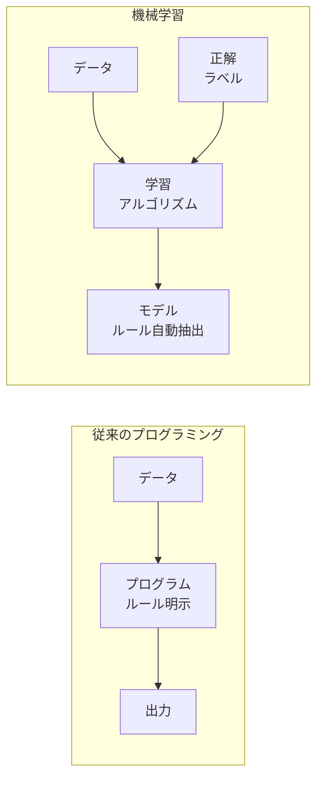
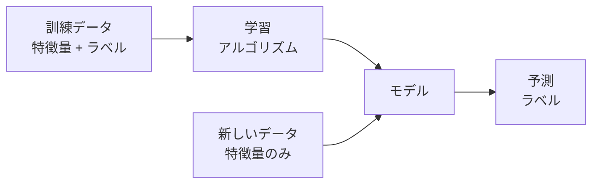
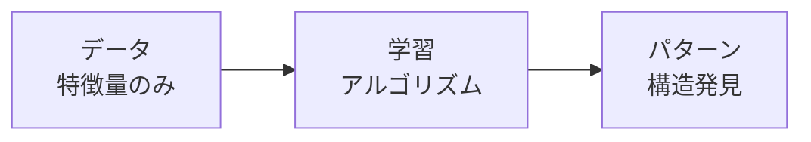
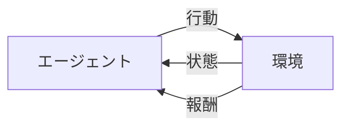
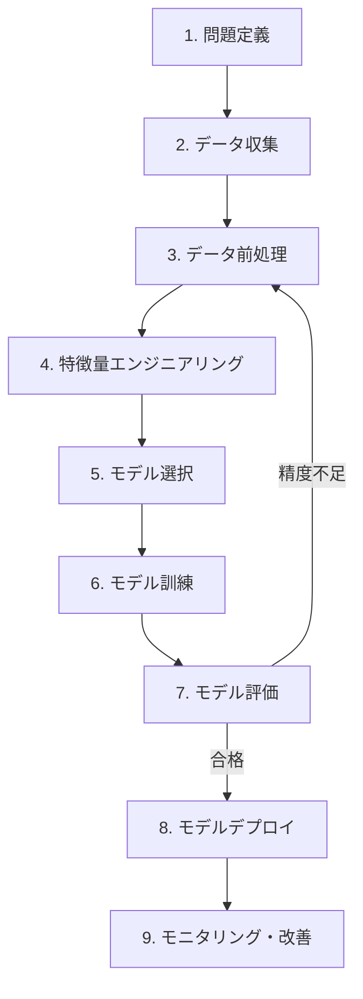
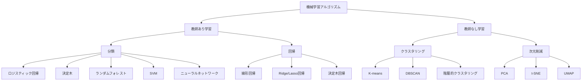

# Chapter 1: 機械学習の基礎

## 本章の概要

機械学習（Machine Learning, ML）は、コンピュータがデータから自動的にパターンを学習し、予測や意思決定を行う技術です。本章では、機械学習の基本概念、種類、ワークフロー、そして主要なアルゴリズムの概要を学びます。

### 学習目標

- ✅ 機械学習の定義と従来のプログラミングとの違いを理解する
- ✅ 教師あり学習、教師なし学習、強化学習の違いを説明できる
- ✅ 機械学習プロジェクトの標準的な流れを把握する
- ✅ 主要なアルゴリズムの特徴を理解する

---

## 1. 機械学習とは

### 1.1 定義

**機械学習（Machine Learning）** とは、明示的にプログラミングすることなく、コンピュータがデータから学習する能力を与える研究分野です。

Tom Mitchell（1997）の定義：
> "A computer program is said to learn from experience E with respect to some task T and some performance measure P, if its performance on T, as measured by P, improves with experience E."
>
> 「あるタスクTとパフォーマンス指標Pに関して、経験Eから学習するとは、タスクTにおけるパフォーマンスPが経験Eによって改善されることである。」

### 1.2 従来のプログラミング vs 機械学習



**従来のプログラミング:**
- プログラマーがルールを明示的に記述
- 例: `if age > 18: status = "adult"`

**機械学習:**
- データから自動的にルールを学習
- 例: 過去のデータから年齢と身長から大人か子供かを判定するパターンを学習

### 1.3 なぜ機械学習が必要か

#### 解決できる問題の例

| 問題タイプ | 従来の方法 | 機械学習の方法 |
|----------|-----------|--------------|
| **スパム判定** | キーワードリスト作成（更新が大変） | データから自動学習（新しいパターンに適応） |
| **音声認識** | 音素の規則を全て記述（不可能） | 大量の音声データから学習 |
| **画像認識** | 特徴を手動定義（困難） | 画像から自動的に特徴を抽出 |
| **推薦システム** | 全ユーザーの嗜好を予測（不可能） | 過去の行動から嗜好を学習 |

---

## 2. 機械学習の種類

機械学習は、学習の方法によって大きく3つに分類されます。

### 2.1 教師あり学習（Supervised Learning）

**定義**: 入力データ（特徴量）と正解ラベルのペアを使って学習



#### 主なタスク

**1. 分類（Classification）**
- **目的**: データをカテゴリに分類
- **例**:
  - メール分類（スパム or 正常）
  - 画像認識（犬 or 猫 or 鳥...）
  - 病気診断（陽性 or 陰性）

**2. 回帰（Regression）**
- **目的**: 連続値を予測
- **例**:
  - 住宅価格予測
  - 株価予測
  - 気温予測

#### 実例: アイリス分類

```python
from sklearn.datasets import load_iris
from sklearn.model_selection import train_test_split
from sklearn.tree import DecisionTreeClassifier
from sklearn.metrics import accuracy_score

# データ読み込み
iris = load_iris()
X, y = iris.data, iris.target

# 訓練データとテストデータに分割
X_train, X_test, y_train, y_test = train_test_split(
    X, y, test_size=0.3, random_state=42
)

# モデルの訓練
model = DecisionTreeClassifier(random_state=42)
model.fit(X_train, y_train)

# 予測と評価
y_pred = model.predict(X_test)
accuracy = accuracy_score(y_test, y_pred)
print(f"正解率: {accuracy:.2%}")  # 出力例: 正解率: 97.78%
```

### 2.2 教師なし学習（Unsupervised Learning）

**定義**: 正解ラベルなしで、データの構造やパターンを発見



#### 主なタスク

**1. クラスタリング（Clustering）**
- **目的**: データを似たもの同士でグループ化
- **例**:
  - 顧客セグメンテーション
  - 遺伝子グループ分類
  - 文書のトピック分類

**2. 次元削減（Dimensionality Reduction）**
- **目的**: 高次元データを低次元に圧縮
- **例**:
  - データ可視化
  - ノイズ除去
  - 計算量削減

**3. 異常検知（Anomaly Detection）**
- **目的**: 正常パターンから外れたデータを検出
- **例**:
  - 不正取引検知
  - システム障害検知

#### 実例: K-meansクラスタリング

```python
from sklearn.cluster import KMeans
from sklearn.datasets import make_blobs
import matplotlib.pyplot as plt

# サンプルデータ生成
X, _ = make_blobs(n_samples=300, centers=3, random_state=42)

# K-meansクラスタリング
kmeans = KMeans(n_clusters=3, random_state=42)
clusters = kmeans.fit_predict(X)

# 可視化
plt.figure(figsize=(8, 6))
plt.scatter(X[:, 0], X[:, 1], c=clusters, cmap='viridis', s=50, alpha=0.6)
plt.scatter(kmeans.cluster_centers_[:, 0],
           kmeans.cluster_centers_[:, 1],
           c='red', marker='X', s=200, label='重心')
plt.title('K-meansクラスタリング')
plt.xlabel('特徴量1')
plt.ylabel('特徴量2')
plt.legend()
plt.show()
```

### 2.3 強化学習（Reinforcement Learning）

**定義**: 環境との相互作用を通じて、報酬を最大化する行動を学習



#### 主な応用

- **ゲームAI**: 囲碁（AlphaGo）、チェス、Atari
- **ロボット制御**: 歩行、物体操作
- **自動運転**: 経路計画、障害物回避
- **推薦システム**: ユーザーエンゲージメント最大化

---

## 3. 機械学習のワークフロー

機械学習プロジェクトは、以下の標準的な流れに沿って進めます。



### 各ステップの詳細

#### 1. 問題定義
- **目的**: 何を予測・分類したいか明確化
- **例**: 「住宅価格を予測したい」「顧客の離脱を予測したい」

#### 2. データ収集
- **目的**: 学習に必要なデータを集める
- **ポイント**: データの量と質が重要

#### 3. データ前処理
- **欠損値処理**: 欠損データの補完または削除
- **外れ値処理**: 異常値の検出と対応
- **正規化/標準化**: スケールの統一

```python
import pandas as pd
from sklearn.preprocessing import StandardScaler

# データ読み込み
df = pd.read_csv('data.csv')

# 欠損値処理
df = df.dropna()  # または df.fillna(df.mean())

# 標準化
scaler = StandardScaler()
X_scaled = scaler.fit_transform(df[['age', 'income', 'score']])
```

#### 4. 特徴量エンジニアリング
- **特徴量選択**: 重要な特徴量の選択
- **特徴量生成**: 新しい特徴量の作成
- **エンコーディング**: カテゴリ変数の数値化

```python
# カテゴリ変数のエンコーディング
df_encoded = pd.get_dummies(df, columns=['gender', 'city'])

# 特徴量生成
df['age_income_ratio'] = df['age'] / df['income']
```

#### 5. モデル選択
- **問題タイプ**: 分類 or 回帰
- **データサイズ**: 小規模 or 大規模
- **解釈性**: モデルの説明可能性が必要か

#### 6. モデル訓練
```python
from sklearn.ensemble import RandomForestClassifier

# モデル作成
model = RandomForestClassifier(n_estimators=100, random_state=42)

# 訓練
model.fit(X_train, y_train)
```

#### 7. モデル評価
```python
from sklearn.metrics import classification_report, confusion_matrix

# 予測
y_pred = model.predict(X_test)

# 評価
print(classification_report(y_test, y_pred))
print(confusion_matrix(y_test, y_pred))
```

#### 8. モデルデプロイ
- **本番環境への展開**: APIサーバー、Webアプリ
- **バッチ予測**: 定期的な一括予測

#### 9. モニタリング・改善
- **性能監視**: 本番環境での精度追跡
- **再学習**: 新しいデータで定期的に更新

---

## 4. 主要なアルゴリズム概要

### 4.1 アルゴリズムマップ



### 4.2 アルゴリズム比較表

| アルゴリズム | タスク | 長所 | 短所 | 使いどころ |
|------------|------|------|------|----------|
| **線形回帰** | 回帰 | シンプル、解釈しやすい | 非線形関係に弱い | 単純な予測問題 |
| **ロジスティック回帰** | 分類 | 高速、確率が得られる | 非線形分離不可 | 2値分類 |
| **決定木** | 分類/回帰 | 解釈しやすい | 過学習しやすい | 説明性が重要な場合 |
| **ランダムフォレスト** | 分類/回帰 | 高精度、過学習に強い | 解釈が難しい | 汎用的な予測問題 |
| **SVM** | 分類/回帰 | 高次元に強い | 大規模データに遅い | 中規模データの分類 |
| **K-means** | クラスタリング | 高速、シンプル | クラスタ数事前指定 | 顧客セグメンテーション |
| **PCA** | 次元削減 | 計算が速い | 解釈が難しい場合あり | データ可視化 |

---

## 5. 機械学習の応用例

### 5.1 ビジネス分野

#### マーケティング
- **顧客セグメンテーション**: 顧客を類似性でグループ化
- **チャーン予測**: 解約しそうな顧客の予測
- **レコメンデーション**: 商品・コンテンツ推薦

#### 金融
- **信用スコアリング**: ローン審査の自動化
- **不正検知**: クレジットカード不正利用検出
- **アルゴリズム取引**: 株式取引の自動化

#### 製造業
- **予知保全**: 設備故障の予測
- **品質管理**: 不良品検出
- **需要予測**: 在庫最適化

### 5.2 社会分野

#### 医療
- **疾病診断**: 画像診断支援
- **創薬**: 新薬候補の発見
- **個別化医療**: 患者ごとの最適治療

#### 交通
- **自動運転**: 車両の自律制御
- **交通量予測**: 渋滞予測と回避
- **ルート最適化**: 配送経路の最適化

#### 環境
- **気候予測**: 天候・災害予測
- **エネルギー管理**: 電力需要予測
- **環境モニタリング**: 大気汚染検知

---

## 6. 機械学習の課題と限界

### 6.1 データの課題

**データの質**
- ✗ ノイズが多いデータ
- ✗ 偏ったデータ（バイアス）
- ✗ 欠損値が多いデータ

**データの量**
- ✗ サンプル数が少ない
- ✗ クラスの不均衡（Imbalanced Data）

### 6.2 モデルの課題

**過学習（Overfitting）**
- 訓練データに過度に適合し、新しいデータで性能が低下

**過少学習（Underfitting）**
- モデルが単純すぎて、データのパターンを捉えられない

**解釈性 vs 精度のトレードオフ**
- 高精度なモデル（深層学習等）は解釈が難しい
- 解釈しやすいモデル（線形回帰等）は精度が低い場合がある

### 6.3 倫理的課題

- **バイアスと公平性**: 訓練データのバイアスが差別を生む
- **プライバシー**: 個人データの適切な取り扱い
- **説明責任**: AIの判断に対する説明義務
- **雇用への影響**: 自動化による仕事の変化

---

## 7. まとめ

### 7.1 本章で学んだこと

✅ **機械学習の定義**
- データから自動的に学習するコンピュータプログラム
- 従来のプログラミングとの根本的な違い

✅ **3つの学習タイプ**
- 教師あり学習（分類・回帰）
- 教師なし学習（クラスタリング・次元削減）
- 強化学習（環境との相互作用）

✅ **機械学習のワークフロー**
- 問題定義 → データ収集 → 前処理 → モデル訓練 → 評価 → デプロイ

✅ **主要アルゴリズム**
- 各アルゴリズムの特徴と使いどころ

### 7.2 次のステップ

本章で機械学習の全体像を理解しました。次章では、教師あり学習の主要アルゴリズムを詳しく学びます。

---

## 8. 練習問題

### 問題1: 学習タイプの判定（基礎）

以下の問題はどの学習タイプに分類されるか答えてください。

a) メールをスパムか正常かに分類する
b) 顧客を購買パターンでグループ分けする
c) 囲碁で最適な次の一手を学習する

<details>
<summary>解答</summary>

**解答:**
a) **教師あり学習（分類）** - 正解ラベル（スパム or 正常）がある
b) **教師なし学習（クラスタリング）** - グループのラベルは事前に不明
c) **強化学習** - 勝敗という報酬を最大化する行動を学習

</details>

### 問題2: アルゴリズム選択（中級）

以下のシナリオに適したアルゴリズムを選んでください。

**シナリオ**:
住宅の面積、部屋数、築年数から住宅価格を予測したい。データは1000件あり、解釈しやすさも重要。

選択肢:
a) K-means
b) 線形回帰
c) PCA
d) ロジスティック回帰

<details>
<summary>解答</summary>

**解答: b) 線形回帰**

**理由:**
- **タスク**: 価格予測 = 回帰問題
- **解釈性**: 線形回帰は各特徴量の重みが明確で解釈しやすい
- **データ量**: 1000件は線形回帰に十分

不正解の理由:
- a) K-means: クラスタリングアルゴリズム（予測には不適）
- c) PCA: 次元削減（予測アルゴリズムではない）
- d) ロジスティック回帰: 分類アルゴリズム（回帰問題には不適）

</details>

### 問題3: 実装問題（応用）

scikit-learnを使って、タイタニックデータセットで生存予測モデルを作成してください。

```python
# 必要なライブラリのインポート
import pandas as pd
from sklearn.model_selection import train_test_split
from sklearn.tree import DecisionTreeClassifier
from sklearn.metrics import accuracy_score

# タイタニックデータ（簡易版）
data = {
    'Age': [22, 38, 26, 35, 35, 54, 2, 27, 14, 4],
    'Fare': [7.25, 71.28, 7.92, 53.1, 8.05, 51.86, 21.08, 11.13, 30.07, 16.7],
    'Sex': [1, 0, 0, 0, 1, 1, 1, 0, 0, 1],  # 1=male, 0=female
    'Survived': [0, 1, 1, 1, 0, 0, 0, 1, 1, 1]  # 1=生存, 0=死亡
}
df = pd.DataFrame(data)

# ここにコードを書いてください
```

<details>
<summary>解答例</summary>

```python
# 必要なライブラリのインポート
import pandas as pd
from sklearn.model_selection import train_test_split
from sklearn.tree import DecisionTreeClassifier
from sklearn.metrics import accuracy_score

# タイタニックデータ（簡易版）
data = {
    'Age': [22, 38, 26, 35, 35, 54, 2, 27, 14, 4],
    'Fare': [7.25, 71.28, 7.92, 53.1, 8.05, 51.86, 21.08, 11.13, 30.07, 16.7],
    'Sex': [1, 0, 0, 0, 1, 1, 1, 0, 0, 1],  # 1=male, 0=female
    'Survived': [0, 1, 1, 1, 0, 0, 0, 1, 1, 1]  # 1=生存, 0=死亡
}
df = pd.DataFrame(data)

# 特徴量とターゲットの分離
X = df[['Age', 'Fare', 'Sex']]
y = df['Survived']

# 訓練データとテストデータに分割（70:30）
X_train, X_test, y_train, y_test = train_test_split(
    X, y, test_size=0.3, random_state=42
)

# 決定木モデルの作成と訓練
model = DecisionTreeClassifier(max_depth=3, random_state=42)
model.fit(X_train, y_train)

# 予測
y_pred = model.predict(X_test)

# 評価
accuracy = accuracy_score(y_test, y_pred)
print(f"正解率: {accuracy:.2%}")

# 特徴量の重要度
feature_importance = pd.DataFrame({
    '特徴量': X.columns,
    '重要度': model.feature_importances_
}).sort_values('重要度', ascending=False)

print("\n特徴量の重要度:")
print(feature_importance)
```

**ポイント:**
- データの分割で`random_state`を固定して再現性を確保
- 決定木の深さを制限して過学習を防止
- 特徴量の重要度を確認して解釈性を向上

</details>

---

## 9. 参考文献

### 書籍
1. 「はじめてのパターン認識」平井有三（森北出版）
2. 「Pythonではじめる機械学習」Andreas C. Müller, Sarah Guido（オライリー）
3. "Hands-On Machine Learning" by Aurélien Géron

### オンラインリソース
- [scikit-learn公式チュートリアル](https://scikit-learn.org/stable/tutorial/index.html)
- [Coursera: Machine Learning by Andrew Ng](https://www.coursera.org/learn/machine-learning)
- [Kaggle Learn](https://www.kaggle.com/learn)

### データセット
- [UCI Machine Learning Repository](https://archive.ics.uci.edu/ml/index.php)
- [Kaggle Datasets](https://www.kaggle.com/datasets)
- [scikit-learn内蔵データセット](https://scikit-learn.org/stable/datasets.html)

---

**次へ**: [Chapter 2: 教師あり学習の基礎 →](chapter-2.html)

**前へ**: [← シリーズ目次](index.html)

**目次へ**: [↑ シリーズ目次](index.html)
