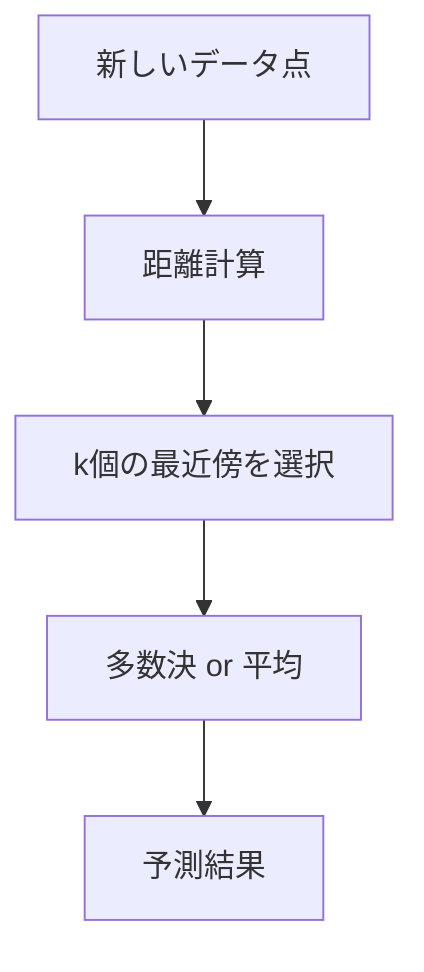
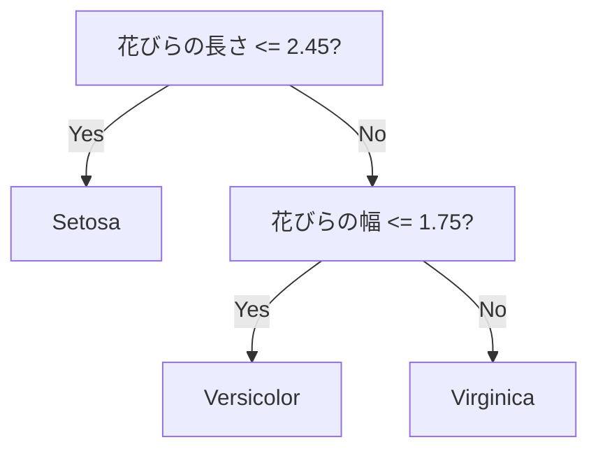

# Chapter 2: 教師あり学習の基礎

## 本章の概要

教師あり学習は、入力データ（特徴量）と正解ラベルのペアから学習し、新しいデータに対して予測を行う手法です。本章では、分類と回帰の代表的なアルゴリズムを学び、scikit-learnを使った実装方法を習得します。

### 学習目標

- ✅ 線形回帰とロジスティック回帰の違いを理解する
- ✅ k近傍法、決定木、SVMの仕組みを説明できる
- ✅ scikit-learnで各アルゴリズムを実装できる
- ✅ 問題に応じて適切なアルゴリズムを選択できる

---

## 1. 線形回帰（Linear Regression）

### 1.1 概要

**線形回帰**は、特徴量とターゲット変数の間に線形関係を仮定し、最適な直線（または超平面）を見つける回帰アルゴリズムです。

**数式:**
$$
y = w_0 + w_1 x_1 + w_2 x_2 + \cdots + w_n x_n
$$

- $y$: 予測値
- $x_i$: 特徴量
- $w_i$: 重み（係数）
- $w_0$: 切片（バイアス）

### 1.2 最小二乗法

線形回帰は、**最小二乗法**を使って最適な重みを求めます。

**目的関数（損失関数）:**
$$
J(w) = \frac{1}{2m} \sum_{i=1}^{m} (y_i - \hat{y}_i)^2
$$

- $m$: サンプル数
- $y_i$: 実際の値
- $\hat{y}_i$: 予測値

### 1.3 実装例

```python
import numpy as np
import matplotlib.pyplot as plt
from sklearn.linear_model import LinearRegression
from sklearn.model_selection import train_test_split
from sklearn.metrics import mean_squared_error, r2_score

# サンプルデータ生成
np.random.seed(42)
X = np.random.rand(100, 1) * 10
y = 2.5 * X + 5 + np.random.randn(100, 1) * 2

# 訓練・テストデータ分割
X_train, X_test, y_train, y_test = train_test_split(
    X, y, test_size=0.2, random_state=42
)

# モデル作成と訓練
model = LinearRegression()
model.fit(X_train, y_train)

# 予測
y_pred = model.predict(X_test)

# 評価
mse = mean_squared_error(y_test, y_pred)
r2 = r2_score(y_test, y_pred)

print(f"係数: {model.coef_[0][0]:.2f}")
print(f"切片: {model.intercept_[0]:.2f}")
print(f"MSE: {mse:.2f}")
print(f"R²スコア: {r2:.2f}")

# 可視化
plt.figure(figsize=(10, 6))
plt.scatter(X_test, y_test, color='blue', label='実際の値', alpha=0.6)
plt.plot(X_test, y_pred, color='red', linewidth=2, label='予測値')
plt.xlabel('X')
plt.ylabel('y')
plt.title('線形回帰')
plt.legend()
plt.show()
```

### 1.4 利点と欠点

**利点:**
- ✅ シンプルで解釈しやすい
- ✅ 計算が高速
- ✅ 過学習しにくい

**欠点:**
- ❌ 非線形関係をうまく捉えられない
- ❌ 外れ値に敏感
- ❌ 特徴量間の相関（多重共線性）に弱い

---

## 2. ロジスティック回帰（Logistic Regression）

### 2.1 概要

**ロジスティック回帰**は、分類問題に使われるアルゴリズムで、線形モデルの出力をシグモイド関数で0〜1の確率に変換します。

**シグモイド関数:**
$$
\sigma(z) = \frac{1}{1 + e^{-z}}
$$

### 2.2 決定境界

ロジスティック回帰は、特徴空間を2つのクラスに分ける**決定境界**を学習します。

### 2.3 実装例: アイリス分類（2クラス）

```python
from sklearn.datasets import load_iris
from sklearn.linear_model import LogisticRegression
from sklearn.metrics import accuracy_score, confusion_matrix, classification_report
import seaborn as sns

# データ読み込み（2クラスのみ使用）
iris = load_iris()
X = iris.data[iris.target != 2]  # setosaとversicolor
y = iris.target[iris.target != 2]

# 訓練・テストデータ分割
X_train, X_test, y_train, y_test = train_test_split(
    X, y, test_size=0.3, random_state=42
)

# モデル作成と訓練
model = LogisticRegression(random_state=42)
model.fit(X_train, y_train)

# 予測
y_pred = model.predict(X_test)
y_prob = model.predict_proba(X_test)  # 確率

# 評価
accuracy = accuracy_score(y_test, y_pred)
print(f"正解率: {accuracy:.2%}")
print("\n分類レポート:")
print(classification_report(y_test, y_pred, target_names=['setosa', 'versicolor']))

# 混同行列
cm = confusion_matrix(y_test, y_pred)
plt.figure(figsize=(6, 5))
sns.heatmap(cm, annot=True, fmt='d', cmap='Blues',
            xticklabels=['setosa', 'versicolor'],
            yticklabels=['setosa', 'versicolor'])
plt.ylabel('実際のラベル')
plt.xlabel('予測ラベル')
plt.title('混同行列')
plt.show()
```

### 2.4 多クラス分類

ロジスティック回帰は、**One-vs-Rest (OvR)** または **Multinomial** 方式で多クラス分類にも対応できます。

```python
# 多クラス分類（全3クラス）
iris = load_iris()
X, y = iris.data, iris.target

X_train, X_test, y_train, y_test = train_test_split(
    X, y, test_size=0.3, random_state=42
)

model = LogisticRegression(multi_class='multinomial', max_iter=200)
model.fit(X_train, y_train)

accuracy = model.score(X_test, y_test)
print(f"多クラス分類の正解率: {accuracy:.2%}")
```

---

## 3. k近傍法（k-Nearest Neighbors, k-NN）

### 3.1 概要

**k近傍法**は、新しいデータポイントに最も近い$k$個の訓練データを見つけ、それらの多数決（分類）または平均（回帰）で予測します。



### 3.2 距離の計算

**ユークリッド距離:**
$$
d(x, x') = \sqrt{\sum_{i=1}^{n} (x_i - x'_i)^2}
$$

### 3.3 実装例: 分類

```python
from sklearn.neighbors import KNeighborsClassifier
from sklearn.preprocessing import StandardScaler

# データ準備
iris = load_iris()
X, y = iris.data, iris.target

# 標準化（k-NNは距離ベースなのでスケールが重要）
scaler = StandardScaler()
X_scaled = scaler.fit_transform(X)

# 訓練・テストデータ分割
X_train, X_test, y_train, y_test = train_test_split(
    X_scaled, y, test_size=0.3, random_state=42
)

# kの値を変えて性能を比較
k_values = [1, 3, 5, 7, 9, 11]
accuracies = []

for k in k_values:
    model = KNeighborsClassifier(n_neighbors=k)
    model.fit(X_train, y_train)
    accuracy = model.score(X_test, y_test)
    accuracies.append(accuracy)
    print(f"k={k}: 正解率 {accuracy:.2%}")

# 最適なkの可視化
plt.figure(figsize=(10, 6))
plt.plot(k_values, accuracies, marker='o', linewidth=2)
plt.xlabel('k（近傍数）')
plt.ylabel('正解率')
plt.title('k値と性能の関係')
plt.xticks(k_values)
plt.grid(True)
plt.show()
```

### 3.4 利点と欠点

**利点:**
- ✅ シンプルで直感的
- ✅ 非線形な決定境界を学習可能
- ✅ 学習が不要（インスタンスベース）

**欠点:**
- ❌ 予測が遅い（全データとの距離計算が必要）
- ❌ 高次元データに弱い（次元の呪い）
- ❌ 不均衡データに弱い

---

## 4. 決定木（Decision Tree）

### 4.1 概要

**決定木**は、データを木構造で分岐させながら分類・回帰を行うアルゴリズムです。



### 4.2 分岐基準

**ジニ不純度（Gini Impurity）:**
$$
Gini = 1 - \sum_{i=1}^{C} p_i^2
$$

- $C$: クラス数
- $p_i$: クラス$i$の割合

**情報利得（Information Gain）:**
エントロピーの減少量を基準に分岐

### 4.3 実装例

```python
from sklearn.tree import DecisionTreeClassifier, plot_tree

# データ準備
iris = load_iris()
X, y = iris.data, iris.target

X_train, X_test, y_train, y_test = train_test_split(
    X, y, test_size=0.3, random_state=42
)

# 決定木モデル
model = DecisionTreeClassifier(
    max_depth=3,  # 深さを制限（過学習防止）
    random_state=42
)
model.fit(X_train, y_train)

# 評価
accuracy = model.score(X_test, y_test)
print(f"正解率: {accuracy:.2%}")

# 特徴量の重要度
feature_importance = pd.DataFrame({
    '特徴量': iris.feature_names,
    '重要度': model.feature_importances_
}).sort_values('重要度', ascending=False)

print("\n特徴量の重要度:")
print(feature_importance)

# 木構造の可視化
plt.figure(figsize=(20, 10))
plot_tree(model, feature_names=iris.feature_names,
         class_names=iris.target_names, filled=True, fontsize=10)
plt.title('決定木の可視化')
plt.show()
```

### 4.4 過学習の防止

決定木は過学習しやすいため、以下のパラメータで制御します：

```python
model = DecisionTreeClassifier(
    max_depth=5,           # 最大の深さ
    min_samples_split=20,  # 分岐に必要な最小サンプル数
    min_samples_leaf=10,   # 葉ノードの最小サンプル数
    max_features='sqrt'    # 各分岐で使用する特徴量数
)
```

---

## 5. サポートベクターマシン（SVM）

### 5.1 概要

**SVM**は、クラス間のマージン（余白）を最大化する決定境界を学習するアルゴリズムです。


### 5.2 カーネルトリック

SVMは**カーネルトリック**を使って、非線形な決定境界を学習できます。

**主なカーネル:**
- **線形（linear）**: 線形分離可能な場合
- **RBF（Gaussian）**: 一般的な非線形問題
- **多項式（poly）**: 多項式の決定境界
- **シグモイド（sigmoid）**: ニューラルネットワークに類似

### 5.3 実装例

```python
from sklearn.svm import SVC
from sklearn.preprocessing import StandardScaler

# データ準備と標準化
iris = load_iris()
X, y = iris.data, iris.target

scaler = StandardScaler()
X_scaled = scaler.fit_transform(X)

X_train, X_test, y_train, y_test = train_test_split(
    X_scaled, y, test_size=0.3, random_state=42
)

# 異なるカーネルで比較
kernels = ['linear', 'poly', 'rbf', 'sigmoid']

for kernel in kernels:
    model = SVC(kernel=kernel, random_state=42)
    model.fit(X_train, y_train)
    accuracy = model.score(X_test, y_test)
    print(f"{kernel}カーネル: 正解率 {accuracy:.2%}")
```

### 5.4 ハイパーパラメータ

**C（正則化パラメータ）:**
- 大きい値: マージンが狭い（過学習リスク）
- 小さい値: マージンが広い（過少学習リスク）

**gamma（RBFカーネルのパラメータ）:**
- 大きい値: 決定境界が複雑（過学習リスク）
- 小さい値: 決定境界が滑らか

```python
from sklearn.model_selection import GridSearchCV

# グリッドサーチでパラメータ最適化
param_grid = {
    'C': [0.1, 1, 10, 100],
    'gamma': ['scale', 'auto', 0.001, 0.01, 0.1],
    'kernel': ['rbf']
}

grid_search = GridSearchCV(SVC(), param_grid, cv=5)
grid_search.fit(X_train, y_train)

print(f"最適なパラメータ: {grid_search.best_params_}")
print(f"最良スコア: {grid_search.best_score_:.2%}")
```

---

## 6. アルゴリズム比較と選択

### 6.1 性能比較

```python
from sklearn.datasets import load_iris
from sklearn.model_selection import cross_val_score
import pandas as pd

# データ準備
iris = load_iris()
X, y = iris.data, iris.target

# 各アルゴリズムの交差検証スコア
models = {
    '線形回帰': LinearRegression(),  # 回帰なので不適切（参考）
    'ロジスティック回帰': LogisticRegression(max_iter=200),
    'k-NN (k=5)': KNeighborsClassifier(n_neighbors=5),
    '決定木': DecisionTreeClassifier(max_depth=5, random_state=42),
    'SVM (RBF)': SVC(kernel='rbf', random_state=42)
}

results = []
for name, model in models.items():
    if name != '線形回帰':  # 分類問題なのでスキップ
        scores = cross_val_score(model, X, y, cv=5)
        results.append({
            'アルゴリズム': name,
            '平均スコア': scores.mean(),
            '標準偏差': scores.std()
        })

df_results = pd.DataFrame(results)
print(df_results.sort_values('平均スコア', ascending=False))
```

### 6.2 選択ガイドライン

| 条件 | 推奨アルゴリズム | 理由 |
|------|----------------|------|
| データが線形分離可能 | ロジスティック回帰、線形SVM | シンプルで高速 |
| 非線形な関係 | 決定木、RBF-SVM、k-NN | 複雑なパターンを捉える |
| 解釈性が重要 | 決定木、線形回帰 | 視覚化・説明しやすい |
| 高次元データ | SVM、ロジスティック回帰 | 次元の呪いに強い |
| 小規模データ | SVM、k-NN | 少ないデータでも性能良好 |
| 大規模データ | ロジスティック回帰、決定木 | 計算が高速 |

---

## 7. まとめ

### 7.1 本章で学んだこと

✅ **5つの主要アルゴリズム**
- 線形回帰: 連続値予測
- ロジスティック回帰: 確率的分類
- k-NN: インスタンスベース学習
- 決定木: 木構造による分類・回帰
- SVM: マージン最大化

✅ **実装スキル**
- scikit-learnでの実装方法
- パラメータチューニング
- モデル評価と比較

✅ **選択基準**
- 問題とデータに応じたアルゴリズム選択

### 7.2 次のステップ

次章では、教師なし学習（クラスタリング・次元削減）を学びます。

---

## 8. 練習問題

### 問題1: ワイン品質予測（基礎）

ワインの特徴量から品質を予測するモデルを作成してください。

```python
from sklearn.datasets import load_wine

wine = load_wine()
X, y = wine.data, wine.target

# ここに実装
```

<details>
<summary>解答例</summary>

```python
from sklearn.datasets import load_wine
from sklearn.model_selection import train_test_split
from sklearn.ensemble import RandomForestClassifier
from sklearn.metrics import classification_report

wine = load_wine()
X, y = wine.data, wine.target

X_train, X_test, y_train, y_test = train_test_split(
    X, y, test_size=0.3, random_state=42
)

model = RandomForestClassifier(random_state=42)
model.fit(X_train, y_train)

y_pred = model.predict(X_test)
print(classification_report(y_test, y_pred))
```

</details>

---

**次へ**: [Chapter 3: 教師なし学習の基礎 →](chapter-3.html)

**前へ**: [← Chapter 1: 機械学習の基礎](chapter-1.html)

**目次へ**: [↑ シリーズ目次](index.html)
