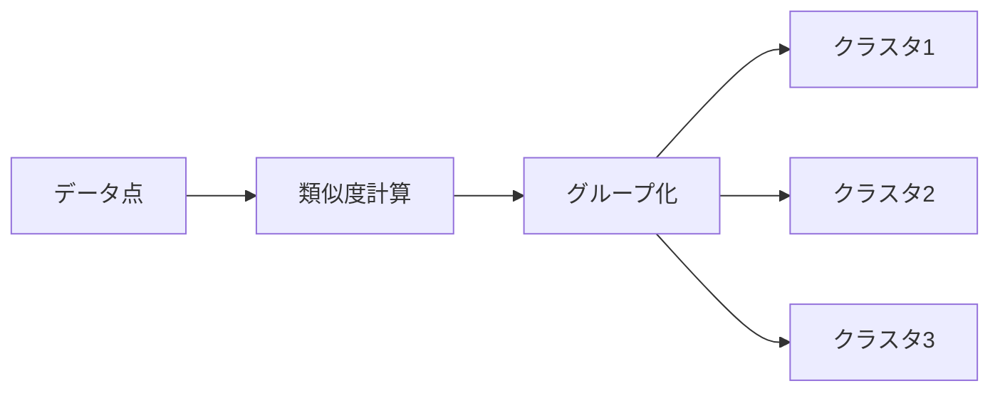

# Chapter 3: 教師なし学習の基礎

## 本章の概要

教師なし学習は、正解ラベルがないデータから、隠れたパターンや構造を発見する手法です。本章では、クラスタリングと次元削減の代表的なアルゴリズムを学び、データの探索的分析（EDA）に活用する方法を習得します。

### 学習目標

- ✅ クラスタリングアルゴリズムの仕組みを理解する
- ✅ 次元削減の目的と手法を理解する
- ✅ PCA, t-SNEでデータを可視化できる
- ✅ 適切なアルゴリズムを選択できる

---

## 1. クラスタリング入門

### 1.1 クラスタリングとは

**クラスタリング**は、データを似ているもの同士でグループ（クラスタ）に分ける教師なし学習の手法です。

**応用例:**
- 顧客セグメンテーション
- 画像セグメンテーション
- 文書分類
- 遺伝子発現解析



---

## 2. K-meansクラスタリング

### 2.1 アルゴリズム

**K-means**は、データをk個のクラスタに分割する最も一般的なクラスタリング手法です。

**手順:**
1. k個の重心をランダムに初期化
2. 各データ点を最も近い重心に割り当て
3. 各クラスタの重心を再計算
4. 収束するまで2-3を繰り返す

### 2.2 実装例: 顧客セグメンテーション

```python
import numpy as np
import pandas as pd
import matplotlib.pyplot as plt
from sklearn.cluster import KMeans
from sklearn.preprocessing import StandardScaler
from sklearn.datasets import make_blobs

# サンプルデータ生成（顧客の年齢と年収）
np.random.seed(42)
X, _ = make_blobs(n_samples=300, centers=4, cluster_std=0.60, random_state=42)

# データをDataFrameに変換
df = pd.DataFrame(X, columns=['年齢', '年収'])

# 標準化
scaler = StandardScaler()
X_scaled = scaler.fit_transform(df)

# K-meansクラスタリング
kmeans = KMeans(n_clusters=4, random_state=42, n_init=10)
clusters = kmeans.fit_predict(X_scaled)

# クラスタラベルを追加
df['クラスタ'] = clusters

# 可視化
plt.figure(figsize=(10, 6))
scatter = plt.scatter(df['年齢'], df['年収'], c=clusters, cmap='viridis', s=50, alpha=0.6)
plt.scatter(kmeans.cluster_centers_[:, 0],
           kmeans.cluster_centers_[:, 1],
           c='red', marker='X', s=200, label='重心')
plt.xlabel('年齢（標準化）')
plt.ylabel('年収（標準化）')
plt.title('顧客セグメンテーション（K-means）')
plt.colorbar(scatter, label='クラスタ')
plt.legend()
plt.show()

# 各クラスタの統計
print("各クラスタの統計:")
print(df.groupby('クラスタ').mean())
```

### 2.3 最適なk値の選択: エルボー法

```python
from sklearn.metrics import silhouette_score

# エルボー法
inertias = []
silhouette_scores = []
K = range(2, 11)

for k in K:
    kmeans = KMeans(n_clusters=k, random_state=42, n_init=10)
    kmeans.fit(X_scaled)
    inertias.append(kmeans.inertia_)
    silhouette_scores.append(silhouette_score(X_scaled, kmeans.labels_))

# 可視化
fig, (ax1, ax2) = plt.subplots(1, 2, figsize=(15, 5))

# エルボー曲線
ax1.plot(K, inertias, marker='o')
ax1.set_xlabel('クラスタ数 k')
ax1.set_ylabel('Inertia（クラスタ内分散）')
ax1.set_title('エルボー法')
ax1.grid(True)

# シルエット係数
ax2.plot(K, silhouette_scores, marker='o', color='orange')
ax2.set_xlabel('クラスタ数 k')
ax2.set_ylabel('シルエット係数')
ax2.set_title('シルエット係数法')
ax2.grid(True)

plt.tight_layout()
plt.show()
```

### 2.4 K-meansの利点と欠点

**利点:**
- ✅ シンプルで高速
- ✅ 大規模データに対応
- ✅ 実装が容易

**欠点:**
- ❌ クラスタ数kを事前に指定必要
- ❌ 球状クラスタのみ対応
- ❌ 外れ値に敏感

---

## 3. 階層的クラスタリング

### 3.1 概要

**階層的クラスタリング**は、データを階層的に結合または分割してクラスタを作成する手法です。

**2つのアプローチ:**
- **凝集型（Agglomerative）**: ボトムアップ（各点から開始）
- **分割型（Divisive）**: トップダウン（全体から分割）

### 3.2 デンドログラム

階層的クラスタリングの結果は、**デンドログラム**（樹形図）で可視化できます。

```python
from scipy.cluster.hierarchy import dendrogram, linkage
from sklearn.cluster import AgglomerativeClustering

# 階層的クラスタリング
linkage_matrix = linkage(X_scaled, method='ward')

# デンドログラム
plt.figure(figsize=(12, 6))
dendrogram(linkage_matrix, truncate_mode='level', p=5)
plt.xlabel('データ点のインデックス')
plt.ylabel('距離')
plt.title('デンドログラム（階層的クラスタリング）')
plt.show()

# AgglomerativeClusteringで実行
agg_clustering = AgglomerativeClustering(n_clusters=4, linkage='ward')
clusters = agg_clustering.fit_predict(X_scaled)

# 可視化
plt.figure(figsize=(10, 6))
plt.scatter(X[:, 0], X[:, 1], c=clusters, cmap='viridis', s=50, alpha=0.6)
plt.xlabel('特徴量1')
plt.ylabel('特徴量2')
plt.title('階層的クラスタリング結果')
plt.colorbar(label='クラスタ')
plt.show()
```

---

## 4. DBSCAN

### 4.1 概要

**DBSCAN（Density-Based Spatial Clustering of Applications with Noise）** は、密度ベースのクラスタリング手法で、任意の形状のクラスタを検出でき、ノイズ（外れ値）も識別できます。

**主要パラメータ:**
- **eps**: 近傍の半径
- **min_samples**: コア点となる最小サンプル数

### 4.2 実装例

```python
from sklearn.cluster import DBSCAN
from sklearn.datasets import make_moons

# 非線形なデータ生成
X_moons, _ = make_moons(n_samples=300, noise=0.05, random_state=42)

# DBSCAN
dbscan = DBSCAN(eps=0.3, min_samples=5)
clusters = dbscan.fit_predict(X_moons)

# 可視化
plt.figure(figsize=(10, 6))
unique_labels = set(clusters)
colors = plt.cm.Spectral(np.linspace(0, 1, len(unique_labels)))

for k, col in zip(unique_labels, colors):
    if k == -1:
        # ノイズ点は黒
        col = 'black'
        marker = 'x'
    else:
        marker = 'o'

    class_members = (clusters == k)
    plt.scatter(X_moons[class_members, 0],
               X_moons[class_members, 1],
               c=[col], marker=marker, s=50, alpha=0.6,
               label=f'クラスタ {k}' if k != -1 else 'ノイズ')

plt.xlabel('特徴量1')
plt.ylabel('特徴量2')
plt.title('DBSCAN（非線形クラスタ検出）')
plt.legend()
plt.show()

# ノイズ点の数
n_noise = list(clusters).count(-1)
print(f"ノイズ点の数: {n_noise}")
print(f"検出されたクラスタ数: {len(set(clusters)) - (1 if -1 in clusters else 0)}")
```

---

## 5. 主成分分析（PCA）

### 5.1 概要

**PCA（Principal Component Analysis）** は、高次元データを低次元に圧縮しながら、データの分散を最大限保持する次元削減手法です。

**用途:**
- データ可視化（3D → 2D）
- ノイズ除去
- 計算量削減
- 多重共線性の除去

### 5.2 数学的背景

PCAは、データの**共分散行列**の固有値分解により、主成分（Principal Components）を求めます。

**主成分:**
- 第1主成分: 分散が最大の方向
- 第2主成分: 第1主成分と直交し、分散が次に大きい方向

### 5.3 実装例: アイリスデータの可視化

```python
from sklearn.decomposition import PCA
from sklearn.datasets import load_iris

# データ読み込み
iris = load_iris()
X = iris.data
y = iris.target

# PCAで4次元→2次元に削減
pca = PCA(n_components=2)
X_pca = pca.fit_transform(X)

# 可視化
plt.figure(figsize=(10, 6))
colors = ['red', 'green', 'blue']
for i, color in enumerate(colors):
    plt.scatter(X_pca[y == i, 0], X_pca[y == i, 1],
               c=color, label=iris.target_names[i], s=50, alpha=0.6)

plt.xlabel(f'第1主成分（分散: {pca.explained_variance_ratio_[0]:.2%}）')
plt.ylabel(f'第2主成分（分散: {pca.explained_variance_ratio_[1]:.2%}）')
plt.title('PCAによるアイリスデータの可視化')
plt.legend()
plt.grid(True)
plt.show()

# 累積寄与率
print("各主成分の寄与率:")
for i, ratio in enumerate(pca.explained_variance_ratio_):
    print(f"  第{i+1}主成分: {ratio:.2%}")
print(f"累積寄与率: {sum(pca.explained_variance_ratio_):.2%}")
```

### 5.4 主成分数の選択

```python
# 全主成分で PCA
pca_full = PCA()
pca_full.fit(X)

# 累積寄与率のプロット
cumulative_variance = np.cumsum(pca_full.explained_variance_ratio_)

plt.figure(figsize=(10, 6))
plt.plot(range(1, len(cumulative_variance) + 1), cumulative_variance, marker='o')
plt.axhline(y=0.95, color='r', linestyle='--', label='95%閾値')
plt.xlabel('主成分数')
plt.ylabel('累積寄与率')
plt.title('累積寄与率と主成分数')
plt.grid(True)
plt.legend()
plt.show()

# 95%の分散を説明する主成分数
n_components_95 = np.argmax(cumulative_variance >= 0.95) + 1
print(f"95%の分散を説明する主成分数: {n_components_95}")
```

---

## 6. t-SNE

### 6.1 概要

**t-SNE（t-Distributed Stochastic Neighbor Embedding）** は、高次元データを2次元または3次元に可視化するための強力な次元削減手法です。

**PCA vs t-SNE:**
- **PCA**: 線形変換、グローバルな構造を保持
- **t-SNE**: 非線形変換、ローカルな構造（近傍関係）を保持

### 6.2 実装例

```python
from sklearn.manifold import TSNE
from sklearn.datasets import load_digits

# MNISTの数字データ（8x8ピクセル）
digits = load_digits()
X = digits.data
y = digits.target

# t-SNE（時間がかかる場合があります）
tsne = TSNE(n_components=2, random_state=42, perplexity=30)
X_tsne = tsne.fit_transform(X)

# 可視化
plt.figure(figsize=(12, 10))
scatter = plt.scatter(X_tsne[:, 0], X_tsne[:, 1], c=y, cmap='tab10', s=20, alpha=0.6)
plt.colorbar(scatter, label='数字')
plt.xlabel('t-SNE 成分1')
plt.ylabel('t-SNE 成分2')
plt.title('t-SNEによる手書き数字データの可視化')
plt.show()
```

### 6.3 パラメータチューニング

**perplexity（困惑度）:**
- 小さい値（5-20）: ローカルな構造を強調
- 大きい値（30-50）: グローバルな構造を重視

```python
# 異なるperplexityで比較
perplexities = [5, 30, 50]
fig, axes = plt.subplots(1, 3, figsize=(18, 5))

for ax, perp in zip(axes, perplexities):
    tsne = TSNE(n_components=2, random_state=42, perplexity=perp)
    X_tsne = tsne.fit_transform(X[:1000])  # サンプル数を制限

    scatter = ax.scatter(X_tsne[:, 0], X_tsne[:, 1], c=y[:1000], cmap='tab10', s=10, alpha=0.6)
    ax.set_title(f'perplexity = {perp}')
    ax.set_xlabel('成分1')
    ax.set_ylabel('成分2')

plt.tight_layout()
plt.show()
```

---

## 7. クラスタリング・次元削減の評価

### 7.1 クラスタリングの評価指標

#### シルエット係数

$$
s(i) = \frac{b(i) - a(i)}{\max(a(i), b(i))}
$$

- $a(i)$: クラスタ内距離の平均
- $b(i)$: 最も近い他クラスタまでの距離
- 範囲: -1〜1（1に近いほど良い）

```python
from sklearn.metrics import silhouette_score, silhouette_samples

# シルエット係数の計算
silhouette_avg = silhouette_score(X_scaled, clusters)
print(f"平均シルエット係数: {silhouette_avg:.3f}")

# 各サンプルのシルエット係数
sample_silhouette_values = silhouette_samples(X_scaled, clusters)

# 可視化
fig, ax = plt.subplots(figsize=(10, 6))
y_lower = 10

for i in range(len(set(clusters))):
    # クラスタiのシルエット係数を抽出
    ith_cluster_silhouette_values = sample_silhouette_values[clusters == i]
    ith_cluster_silhouette_values.sort()

    size_cluster_i = ith_cluster_silhouette_values.shape[0]
    y_upper = y_lower + size_cluster_i

    ax.fill_betweenx(np.arange(y_lower, y_upper),
                     0, ith_cluster_silhouette_values,
                     alpha=0.7, label=f'クラスタ {i}')
    y_lower = y_upper + 10

ax.axvline(x=silhouette_avg, color="red", linestyle="--", label='平均')
ax.set_xlabel('シルエット係数')
ax.set_ylabel('クラスタ')
ax.set_title('シルエット分析')
ax.legend()
plt.show()
```

### 7.2 次元削減の評価

**再構成誤差:**
PCAの場合、元のデータと復元したデータの差

```python
# PCAで圧縮・復元
pca = PCA(n_components=2)
X_reduced = pca.fit_transform(X)
X_reconstructed = pca.inverse_transform(X_reduced)

# 再構成誤差
reconstruction_error = np.mean((X - X_reconstructed) ** 2)
print(f"再構成誤差: {reconstruction_error:.4f}")
```

---

## 8. 実践例: 顧客分析パイプライン

```python
import pandas as pd
from sklearn.preprocessing import StandardScaler
from sklearn.cluster import KMeans
from sklearn.decomposition import PCA
import matplotlib.pyplot as plt

# サンプル顧客データ
np.random.seed(42)
n_customers = 500

customer_data = pd.DataFrame({
    '年齢': np.random.randint(20, 70, n_customers),
    '年収': np.random.randint(300, 1500, n_customers),
    '購入回数': np.random.randint(1, 50, n_customers),
    '平均購入額': np.random.randint(1000, 50000, n_customers),
    '会員年数': np.random.randint(1, 15, n_customers)
})

# 1. データ標準化
scaler = StandardScaler()
X_scaled = scaler.fit_transform(customer_data)

# 2. 最適なクラスタ数を決定（エルボー法）
inertias = []
K_range = range(2, 11)
for k in K_range:
    kmeans = KMeans(n_clusters=k, random_state=42, n_init=10)
    kmeans.fit(X_scaled)
    inertias.append(kmeans.inertia_)

plt.figure(figsize=(8, 5))
plt.plot(K_range, inertias, marker='o')
plt.xlabel('クラスタ数 k')
plt.ylabel('Inertia')
plt.title('エルボー法で最適なk値を決定')
plt.grid(True)
plt.show()

# 3. K-meansクラスタリング（k=4と仮定）
optimal_k = 4
kmeans = KMeans(n_clusters=optimal_k, random_state=42, n_init=10)
customer_data['クラスタ'] = kmeans.fit_predict(X_scaled)

# 4. PCAで2次元に削減して可視化
pca = PCA(n_components=2)
X_pca = pca.fit_transform(X_scaled)

plt.figure(figsize=(10, 6))
scatter = plt.scatter(X_pca[:, 0], X_pca[:, 1],
                     c=customer_data['クラスタ'], cmap='viridis', s=50, alpha=0.6)
plt.xlabel(f'PC1 ({pca.explained_variance_ratio_[0]:.1%})')
plt.ylabel(f'PC2 ({pca.explained_variance_ratio_[1]:.1%})')
plt.title('顧客セグメンテーション（PCA可視化）')
plt.colorbar(scatter, label='クラスタ')
plt.show()

# 5. 各クラスタの特徴分析
print("各クラスタの平均値:")
print(customer_data.groupby('クラスタ').mean().round(2))
```

---

## 9. まとめ

### 9.1 本章で学んだこと

✅ **クラスタリング手法**
- K-means: 高速・シンプル
- 階層的クラスタリング: デンドログラム可視化
- DBSCAN: 任意形状・ノイズ検出

✅ **次元削減手法**
- PCA: 線形・グローバル構造保持
- t-SNE: 非線形・ローカル構造保持

✅ **評価方法**
- エルボー法、シルエット係数
- 累積寄与率、再構成誤差

### 9.2 次のステップ

次章では、モデル評価と実践的なテクニックを学びます。

---

**次へ**: [Chapter 4: モデル評価と実践 →](chapter-4.html)

**前へ**: [← Chapter 2: 教師あり学習の基礎](chapter-2.html)

**目次へ**: [↑ シリーズ目次](index.html)
