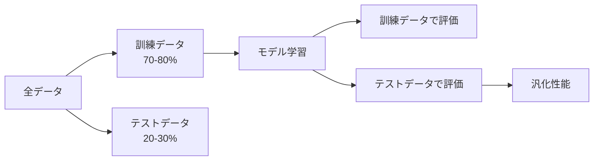
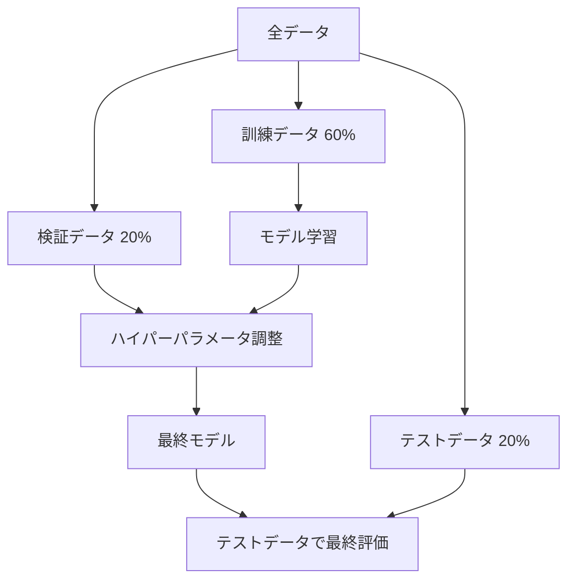
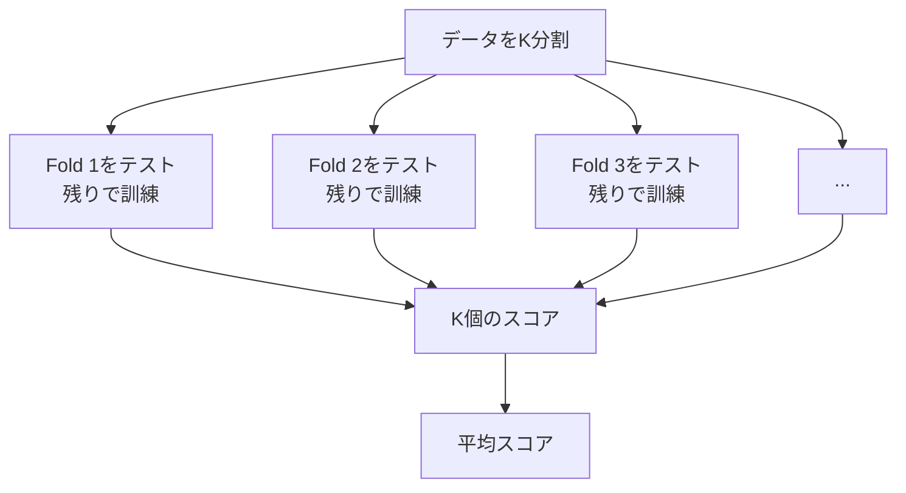
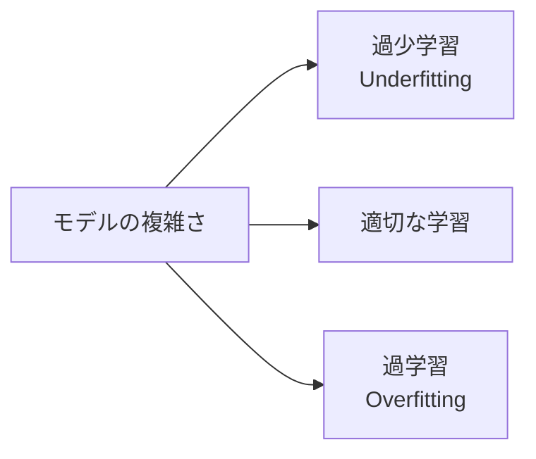

# Chapter 4: モデル評価と実践

## 本章の概要

機械学習モデルの真の価値は、新しいデータに対する性能で決まります。本章では、モデルを適切に評価し、過学習を防ぎ、性能を最適化するための実践的なテクニックを学びます。

### 学習目標

- ✅ 訓練・検証・テストデータの分割方法を理解する
- ✅ 交差検証でモデルの汎化性能を評価できる
- ✅ 適切な評価指標を選択できる
- ✅ 過学習を検出し、対策できる
- ✅ ハイパーパラメータチューニングを実践できる

---

## 1. データ分割の基礎

### 1.1 なぜデータを分割するのか

**目的**: モデルが未知のデータに対してどれだけうまく機能するかを評価



### 1.2 基本的な分割

```python
from sklearn.model_selection import train_test_split
from sklearn.datasets import load_iris

# データ読み込み
iris = load_iris()
X, y = iris.data, iris.target

# 訓練データ:テストデータ = 7:3に分割
X_train, X_test, y_train, y_test = train_test_split(
    X, y,
    test_size=0.3,     # テストデータの割合
    random_state=42,   # 再現性のため固定
    stratify=y         # クラス比率を保持
)

print(f"訓練データ数: {len(X_train)}")
print(f"テストデータ数: {len(X_test)}")
print(f"訓練データのクラス分布: {np.bincount(y_train)}")
print(f"テストデータのクラス分布: {np.bincount(y_test)}")
```

### 1.3 訓練・検証・テストの3分割

**ベストプラクティス:**



```python
# 3分割の実装
X_temp, X_test, y_temp, y_test = train_test_split(
    X, y, test_size=0.2, random_state=42, stratify=y
)

X_train, X_val, y_train, y_val = train_test_split(
    X_temp, y_temp, test_size=0.25, random_state=42, stratify=y_temp
)  # 0.25 * 0.8 = 0.2 (全体の20%)

print(f"訓練: {len(X_train)}, 検証: {len(X_val)}, テスト: {len(X_test)}")
```

---

## 2. 交差検証（Cross-Validation）

### 2.1 K-Fold交差検証

**K-Fold CV**は、データをK個に分割し、K回の訓練・評価を行う手法です。



### 2.2 実装例

```python
from sklearn.model_selection import cross_val_score
from sklearn.tree import DecisionTreeClassifier
import numpy as np

# モデル作成
model = DecisionTreeClassifier(max_depth=5, random_state=42)

# 5-Fold交差検証
scores = cross_val_score(model, X, y, cv=5)

print("各Foldのスコア:", scores)
print(f"平均スコア: {scores.mean():.3f} (+/- {scores.std():.3f})")
```

### 2.3 層化K-Fold交差検証

クラスの分布を各Foldで保持：

```python
from sklearn.model_selection import StratifiedKFold, cross_validate

# 層化K-Fold
skf = StratifiedKFold(n_splits=5, shuffle=True, random_state=42)

# 複数の評価指標
scoring = ['accuracy', 'precision_macro', 'recall_macro', 'f1_macro']

results = cross_validate(model, X, y, cv=skf, scoring=scoring)

for metric in scoring:
    scores = results[f'test_{metric}']
    print(f"{metric}: {scores.mean():.3f} (+/- {scores.std():.3f})")
```

### 2.4 Leave-One-Out交差検証（LOO）

データ数が少ない場合に有効：

```python
from sklearn.model_selection import LeaveOneOut

loo = LeaveOneOut()
scores = cross_val_score(model, X, y, cv=loo)

print(f"LOO平均スコア: {scores.mean():.3f}")
print(f"実行回数: {len(scores)}")  # サンプル数と同じ
```

---

## 3. 評価指標

### 3.1 分類問題の評価指標

#### 混同行列（Confusion Matrix）

```python
from sklearn.metrics import confusion_matrix, ConfusionMatrixDisplay
from sklearn.model_selection import train_test_split
from sklearn.tree import DecisionTreeClassifier

# データ準備
X_train, X_test, y_train, y_test = train_test_split(
    X, y, test_size=0.3, random_state=42
)

# モデル訓練と予測
model = DecisionTreeClassifier(max_depth=5, random_state=42)
model.fit(X_train, y_train)
y_pred = model.predict(X_test)

# 混同行列
cm = confusion_matrix(y_test, y_pred)
disp = ConfusionMatrixDisplay(confusion_matrix=cm,
                              display_labels=iris.target_names)
disp.plot(cmap='Blues')
plt.title('混同行列')
plt.show()

print("混同行列:")
print(cm)
```

#### 主要な評価指標

```python
from sklearn.metrics import (accuracy_score, precision_score,
                            recall_score, f1_score, classification_report)

# 各指標の計算
accuracy = accuracy_score(y_test, y_pred)
precision = precision_score(y_test, y_pred, average='macro')
recall = recall_score(y_test, y_pred, average='macro')
f1 = f1_score(y_test, y_pred, average='macro')

print(f"正解率（Accuracy）: {accuracy:.3f}")
print(f"適合率（Precision）: {precision:.3f}")
print(f"再現率（Recall）: {recall:.3f}")
print(f"F1スコア: {f1:.3f}")

# 詳細レポート
print("\n分類レポート:")
print(classification_report(y_test, y_pred, target_names=iris.target_names))
```

**各指標の意味:**

| 指標 | 定義 | 使いどころ |
|------|------|----------|
| **正解率（Accuracy）** | $\frac{TP + TN}{TP + TN + FP + FN}$ | バランスの取れたデータ |
| **適合率（Precision）** | $\frac{TP}{TP + FP}$ | 偽陽性を減らしたい場合 |
| **再現率（Recall）** | $\frac{TP}{TP + FN}$ | 偽陰性を減らしたい場合 |
| **F1スコア** | $2 \times \frac{Precision \times Recall}{Precision + Recall}$ | 適合率と再現率のバランス |

#### ROC曲線とAUC

```python
from sklearn.metrics import roc_curve, auc, RocCurveDisplay
from sklearn.preprocessing import label_binarize
from sklearn.multiclass import OneVsRestClassifier
from sklearn.linear_model import LogisticRegression

# 2値分類の例（簡略化のため2クラスのみ使用）
X_binary = X[y != 2]
y_binary = y[y != 2]

X_train, X_test, y_train, y_test = train_test_split(
    X_binary, y_binary, test_size=0.3, random_state=42
)

# ロジスティック回帰で確率予測
model = LogisticRegression(random_state=42)
model.fit(X_train, y_train)
y_score = model.predict_proba(X_test)[:, 1]

# ROC曲線
fpr, tpr, thresholds = roc_curve(y_test, y_score)
roc_auc = auc(fpr, tpr)

plt.figure(figsize=(8, 6))
plt.plot(fpr, tpr, color='darkorange', lw=2,
        label=f'ROC曲線 (AUC = {roc_auc:.2f})')
plt.plot([0, 1], [0, 1], color='navy', lw=2, linestyle='--', label='ランダム')
plt.xlim([0.0, 1.0])
plt.ylim([0.0, 1.05])
plt.xlabel('偽陽性率（FPR）')
plt.ylabel('真陽性率（TPR）')
plt.title('ROC曲線')
plt.legend(loc="lower right")
plt.grid(True)
plt.show()
```

### 3.2 回帰問題の評価指標

```python
from sklearn.metrics import mean_squared_error, mean_absolute_error, r2_score
from sklearn.linear_model import LinearRegression
from sklearn.datasets import fetch_california_housing

# 回帰データ
housing = fetch_california_housing()
X_reg, y_reg = housing.data, housing.target

X_train, X_test, y_train, y_test = train_test_split(
    X_reg, y_reg, test_size=0.3, random_state=42
)

# 線形回帰
model = LinearRegression()
model.fit(X_train, y_train)
y_pred = model.predict(X_test)

# 評価指標
mse = mean_squared_error(y_test, y_pred)
rmse = np.sqrt(mse)
mae = mean_absolute_error(y_test, y_pred)
r2 = r2_score(y_test, y_pred)

print(f"平均二乗誤差（MSE）: {mse:.3f}")
print(f"平均平方根誤差（RMSE）: {rmse:.3f}")
print(f"平均絶対誤差（MAE）: {mae:.3f}")
print(f"決定係数（R²）: {r2:.3f}")
```

**回帰指標の意味:**

| 指標 | 定義 | 特徴 |
|------|------|------|
| **MSE** | $\frac{1}{n}\sum (y_i - \hat{y}_i)^2$ | 外れ値に敏感 |
| **RMSE** | $\sqrt{MSE}$ | 元のスケールで解釈可能 |
| **MAE** | $\frac{1}{n}\sum |y_i - \hat{y}_i|$ | 外れ値に頑健 |
| **R²** | $1 - \frac{SS_{res}}{SS_{tot}}$ | モデルの説明力（0〜1） |

---

## 4. 過学習と正則化

### 4.1 過学習（Overfitting）とは

**過学習**は、モデルが訓練データに過度に適合し、新しいデータに対する性能が低下する現象です。



### 4.2 学習曲線による検出

```python
from sklearn.model_selection import learning_curve

# 学習曲線のプロット
def plot_learning_curve(estimator, X, y, cv=5):
    train_sizes, train_scores, val_scores = learning_curve(
        estimator, X, y, cv=cv,
        train_sizes=np.linspace(0.1, 1.0, 10),
        random_state=42
    )

    train_mean = np.mean(train_scores, axis=1)
    train_std = np.std(train_scores, axis=1)
    val_mean = np.mean(val_scores, axis=1)
    val_std = np.std(val_scores, axis=1)

    plt.figure(figsize=(10, 6))
    plt.plot(train_sizes, train_mean, label='訓練スコア', color='blue', marker='o')
    plt.fill_between(train_sizes, train_mean - train_std,
                     train_mean + train_std, alpha=0.15, color='blue')
    plt.plot(train_sizes, val_mean, label='検証スコア', color='red', marker='s')
    plt.fill_between(train_sizes, val_mean - val_std,
                     val_mean + val_std, alpha=0.15, color='red')

    plt.xlabel('訓練サンプル数')
    plt.ylabel('スコア')
    plt.title('学習曲線')
    plt.legend(loc='best')
    plt.grid(True)
    plt.show()

# 使用例
model = DecisionTreeClassifier(max_depth=10, random_state=42)
plot_learning_curve(model, X, y)
```

### 4.3 過学習の対策

#### 1. 正則化（Regularization）

**Ridge回帰（L2正則化）:**
$$
J(w) = MSE + \alpha \sum_{i=1}^{n} w_i^2
$$

**Lasso回帰（L1正則化）:**
$$
J(w) = MSE + \alpha \sum_{i=1}^{n} |w_i|
$$

```python
from sklearn.linear_model import Ridge, Lasso

# Ridge回帰
ridge = Ridge(alpha=1.0)
ridge.fit(X_train, y_train)
print(f"Ridge R²: {ridge.score(X_test, y_test):.3f}")

# Lasso回帰
lasso = Lasso(alpha=0.1)
lasso.fit(X_train, y_train)
print(f"Lasso R²: {lasso.score(X_test, y_test):.3f}")
```

#### 2. 早期停止（Early Stopping）

```python
from sklearn.ensemble import GradientBoostingClassifier

# 早期停止を使った勾配ブースティング
gb = GradientBoostingClassifier(
    n_estimators=1000,
    learning_rate=0.1,
    validation_fraction=0.2,
    n_iter_no_change=10,  # 10回改善しなければ停止
    random_state=42
)

gb.fit(X_train, y_train)
print(f"使用した推定器数: {gb.n_estimators_}")
```

#### 3. ドロップアウト（ニューラルネットワーク）

#### 4. データ拡張

#### 5. アンサンブル学習

---

## 5. ハイパーパラメータチューニング

### 5.1 グリッドサーチ（Grid Search）

全ての組み合わせを試す網羅的探索：

```python
from sklearn.model_selection import GridSearchCV
from sklearn.ensemble import RandomForestClassifier

# パラメータグリッド
param_grid = {
    'n_estimators': [50, 100, 200],
    'max_depth': [3, 5, 7, 10],
    'min_samples_split': [2, 5, 10],
    'min_samples_leaf': [1, 2, 4]
}

# グリッドサーチ
grid_search = GridSearchCV(
    RandomForestClassifier(random_state=42),
    param_grid,
    cv=5,
    scoring='f1_macro',
    n_jobs=-1,  # 並列実行
    verbose=1
)

grid_search.fit(X_train, y_train)

# 最適なパラメータ
print("最適なパラメータ:")
print(grid_search.best_params_)
print(f"\n最良スコア: {grid_search.best_score_:.3f}")

# テストデータで評価
best_model = grid_search.best_estimator_
test_score = best_model.score(X_test, y_test)
print(f"テストスコア: {test_score:.3f}")
```

### 5.2 ランダムサーチ（Random Search）

ランダムに組み合わせを試す効率的な探索：

```python
from sklearn.model_selection import RandomizedSearchCV
from scipy.stats import randint, uniform

# パラメータ分布
param_distributions = {
    'n_estimators': randint(50, 300),
    'max_depth': randint(3, 20),
    'min_samples_split': randint(2, 20),
    'min_samples_leaf': randint(1, 10),
    'max_features': uniform(0.1, 0.9)
}

# ランダムサーチ
random_search = RandomizedSearchCV(
    RandomForestClassifier(random_state=42),
    param_distributions,
    n_iter=100,  # 試行回数
    cv=5,
    scoring='f1_macro',
    random_state=42,
    n_jobs=-1
)

random_search.fit(X_train, y_train)

print("最適なパラメータ:")
print(random_search.best_params_)
print(f"最良スコア: {random_search.best_score_:.3f}")
```

### 5.3 ベイズ最適化（Bayesian Optimization）

より賢いハイパーパラメータ探索（Optunaなどのライブラリ使用）：

```python
# Optunaの例（別途インストール必要: pip install optuna）
try:
    import optuna
    from sklearn.ensemble import RandomForestClassifier

    def objective(trial):
        params = {
            'n_estimators': trial.suggest_int('n_estimators', 50, 300),
            'max_depth': trial.suggest_int('max_depth', 3, 20),
            'min_samples_split': trial.suggest_int('min_samples_split', 2, 20),
            'min_samples_leaf': trial.suggest_int('min_samples_leaf', 1, 10)
        }

        model = RandomForestClassifier(**params, random_state=42)
        score = cross_val_score(model, X_train, y_train, cv=5, scoring='f1_macro').mean()
        return score

    study = optuna.create_study(direction='maximize')
    study.optimize(objective, n_trials=50, show_progress_bar=True)

    print("最適なパラメータ:")
    print(study.best_params)
    print(f"最良スコア: {study.best_value:.3f}")

except ImportError:
    print("Optunaがインストールされていません")
```

---

## 6. 実践プロジェクト: タイタニック生存予測

完全なパイプラインの実装例：

```python
import pandas as pd
from sklearn.model_selection import train_test_split, GridSearchCV
from sklearn.preprocessing import StandardScaler
from sklearn.ensemble import RandomForestClassifier
from sklearn.metrics import classification_report, confusion_matrix

# データ準備（簡易版）
data = {
    'Age': [22, 38, 26, 35, 35, np.nan, 54, 2, 27, 14, 4, 58],
    'Fare': [7.25, 71.28, 7.92, 53.1, 8.05, 8.46, 51.86, 21.08, 11.13, 30.07, 16.7, 13.0],
    'Sex': [1, 0, 0, 0, 1, 1, 1, 1, 0, 0, 1, 0],  # 1=male, 0=female
    'Pclass': [3, 1, 3, 1, 3, 3, 1, 3, 2, 2, 3, 2],
    'Survived': [0, 1, 1, 1, 0, 0, 0, 0, 1, 1, 1, 1]
}
df = pd.DataFrame(data)

# 1. 欠損値処理
df['Age'].fillna(df['Age'].median(), inplace=True)

# 2. 特徴量とターゲットの分離
X = df[['Age', 'Fare', 'Sex', 'Pclass']]
y = df['Survived']

# 3. データ分割
X_train, X_test, y_train, y_test = train_test_split(
    X, y, test_size=0.3, random_state=42, stratify=y
)

# 4. スケーリング
scaler = StandardScaler()
X_train_scaled = scaler.fit_transform(X_train)
X_test_scaled = scaler.transform(X_test)

# 5. ハイパーパラメータチューニング
param_grid = {
    'n_estimators': [50, 100, 150],
    'max_depth': [3, 5, 7],
    'min_samples_split': [2, 5]
}

grid_search = GridSearchCV(
    RandomForestClassifier(random_state=42),
    param_grid,
    cv=3,
    scoring='accuracy'
)

grid_search.fit(X_train_scaled, y_train)

# 6. 最終モデルで予測
best_model = grid_search.best_estimator_
y_pred = best_model.predict(X_test_scaled)

# 7. 評価
print("分類レポート:")
print(classification_report(y_test, y_pred, target_names=['死亡', '生存']))

print("\n混同行列:")
print(confusion_matrix(y_test, y_pred))

print(f"\nテスト正解率: {best_model.score(X_test_scaled, y_test):.2%}")
```

---

## 7. まとめ

### 7.1 本章で学んだこと

✅ **データ分割**
- 訓練・検証・テストの3分割
- 層化サンプリング

✅ **交差検証**
- K-Fold、層化K-Fold、LOO
- モデルの汎化性能評価

✅ **評価指標**
- 分類: 正解率、適合率、再現率、F1、AUC
- 回帰: MSE, RMSE, MAE, R²

✅ **過学習対策**
- 正則化、早期停止、アンサンブル
- 学習曲線による検出

✅ **ハイパーパラメータチューニング**
- GridSearch, RandomSearch, ベイズ最適化

### 7.2 機械学習プロジェクトのチェックリスト

- [ ] データを訓練・検証・テストに分割
- [ ] 交差検証で性能を評価
- [ ] 適切な評価指標を選択
- [ ] 過学習を検出・対策
- [ ] ハイパーパラメータを最適化
- [ ] テストデータで最終評価
- [ ] モデルを保存・デプロイ

---

## 8. 練習問題

### 問題1: 評価指標の選択（基礎）

以下のシナリオに最適な評価指標を選んでください。

a) スパムメール検出（正常メールを誤ってスパムにしたくない）
b) がん検診（がんを見逃したくない）
c) バランスの取れた3クラス分類

<details>
<summary>解答</summary>

**解答:**
a) **適合率（Precision）** - 偽陽性（正常をスパムと誤判定）を減らす
b) **再現率（Recall）** - 偽陰性（がんを見逃す）を減らす
c) **F1スコア** - バランスの取れた評価

</details>

### 問題2: 交差検証の実装（中級）

アイリスデータセットで5-Fold交差検証を実装し、DecisionTreeとRandomForestの性能を比較してください。

<details>
<summary>解答例</summary>

```python
from sklearn.tree import DecisionTreeClassifier
from sklearn.ensemble import RandomForestClassifier
from sklearn.model_selection import cross_val_score

iris = load_iris()
X, y = iris.data, iris.target

models = {
    'DecisionTree': DecisionTreeClassifier(max_depth=5, random_state=42),
    'RandomForest': RandomForestClassifier(n_estimators=100, random_state=42)
}

for name, model in models.items():
    scores = cross_val_score(model, X, y, cv=5)
    print(f"{name}: {scores.mean():.3f} (+/- {scores.std():.3f})")
```

</details>

---

## 9. 次のステップ

機械学習入門シリーズを完了しました！次は：

1. **各アルゴリズムを深く学ぶ**: 線形回帰、決定木、SVM等の専門シリーズ
2. **データ前処理を学ぶ**: 実践的なデータ処理技術
3. **深層学習へ進む**: ニューラルネットワーク、CNN、RNN

---

**前へ**: [← Chapter 3: 教師なし学習の基礎](chapter-3.html)

**目次へ**: [↑ シリーズ目次](index.html)

---

**おめでとうございます！機械学習入門シリーズを完了しました！**
