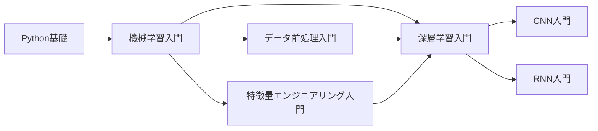

# 機械学習入門

## シリーズ概要

機械学習（Machine Learning, ML）は、コンピュータがデータから自動的にパターンを学習し、予測や意思決定を行う技術です。このシリーズでは、機械学習の基礎理論から実践的な応用まで、体系的に学習します。

### なぜ機械学習を学ぶのか？

現代社会では、あらゆる分野で機械学習が活用されています。機械学習を習得することで：

- **データから価値を抽出**できるようになります
- **自動化・効率化**を実現できます
- **予測・分類・推薦**などのシステムを構築できます
- **AIエンジニア・データサイエンティスト**としてのキャリアパスが開けます

### 学習の流れ

本シリーズは4つの章で構成されています：

## 📚 章立て

### [Chapter 1: 機械学習の基礎](chapter-1.html)
**学習時間: 25-30分 | 難易度: ★☆☆**

機械学習の基本概念と歴史を学びます。

**主なトピック:**
- 機械学習とは何か
- 機械学習の種類（教師あり・教師なし・強化学習）
- 機械学習のワークフロー
- 主要なアルゴリズム概要

**学習目標:**
- 機械学習の全体像を理解する
- 問題に応じた学習方法を選択できる
- 機械学習プロジェクトの流れを把握する

---

### [Chapter 2: 教師あり学習の基礎](chapter-2.html)
**学習時間: 30-35分 | 難易度: ★★☆**

分類と回帰の基本アルゴリズムを学びます。

**主なトピック:**
- 線形回帰
- ロジスティック回帰
- k近傍法（k-NN）
- 決定木
- サポートベクターマシン（SVM）

**学習目標:**
- 各アルゴリズムの仕組みを理解する
- 分類と回帰の違いを説明できる
- scikit-learnで実装できる

**実装ライブラリ:**
```python
from sklearn.linear_model import LinearRegression, LogisticRegression
from sklearn.neighbors import KNeighborsClassifier
from sklearn.tree import DecisionTreeClassifier
from sklearn.svm import SVC
```

---

### [Chapter 3: 教師なし学習の基礎](chapter-3.html)
**学習時間: 25-30分 | 難易度: ★★☆**

クラスタリングと次元削減を学びます。

**主なトピック:**
- K-meansクラスタリング
- 階層的クラスタリング
- DBSCAN
- 主成分分析（PCA）
- t-SNE

**学習目標:**
- クラスタリングの仕組みを理解する
- 次元削減の目的と手法を理解する
- データの可視化ができる

**ハンズオン例:**
- 顧客セグメンテーション
- 異常検知の基礎
- 高次元データの可視化

---

### [Chapter 4: モデル評価と実践](chapter-4.html)
**学習時間: 30-35分 | 難易度: ★★☆**

モデルの評価方法と実践的なテクニックを学びます。

**主なトピック:**
- 訓練データとテストデータの分割
- 交差検証（Cross-Validation）
- 評価指標（正解率、適合率、再現率、F1スコア）
- 過学習と正則化
- ハイパーパラメータチューニング

**学習目標:**
- 適切な評価指標を選択できる
- 過学習を防ぐ手法を実装できる
- モデルの性能を最適化できる

**実践例:**
- タイタニック生存予測
- アイリス分類
- ボストン住宅価格予測

---

## 🎯 このシリーズで習得できるスキル

### 理論面
- ✅ 機械学習の基本原理と用語
- ✅ 主要アルゴリズムの数学的背景
- ✅ モデル選択の考え方
- ✅ 評価と検証の理論

### 実践面
- ✅ scikit-learnを使った実装
- ✅ データ前処理と特徴量エンジニアリング
- ✅ モデルの訓練と評価
- ✅ ハイパーパラメータチューニング

### ツール・ライブラリ
```python
# データ処理
import numpy as np
import pandas as pd

# 可視化
import matplotlib.pyplot as plt
import seaborn as sns

# 機械学習
from sklearn.model_selection import train_test_split, cross_val_score
from sklearn.preprocessing import StandardScaler
from sklearn.metrics import accuracy_score, classification_report
```

---

## 📋 前提知識

### 必須
- **Python基礎**: 変数、関数、クラス、リスト操作
- **高校数学**: 基本的な代数、関数、確率

### 推奨（あると理解が深まる）
- NumPy, Pandas の基礎
- 簡単な統計学の知識
- Matplotlib での可視化経験

### 不要
- 深層学習の知識（別シリーズで扱います）
- 高度な数学（線形代数、微積分は本シリーズでは最小限）

---

## 🛣️ 学習パス

### このシリーズの位置づけ



### 推奨学習順序

1. **まずこのシリーズ**: 機械学習入門（全体像を把握）
2. **次に**: データ前処理入門（実践的なデータ処理）
3. **その後**: 各アルゴリズム特化シリーズ（線形回帰、決定木等）
4. **さらに**: 深層学習入門（ニューラルネットワーク）

---

## 🔗 関連シリーズ

### 基礎を固める
- [データ前処理入門](../data-preprocessing-introduction/) - データクリーニング・変換
- [特徴量エンジニアリング入門](../feature-engineering-introduction/) - 特徴量設計

### アルゴリズムを深める
- [線形回帰・ロジスティック回帰入門](../linear-regression-introduction/) - 回帰モデル詳解
- [決定木・ランダムフォレスト入門](../decision-tree-introduction/) - 木構造モデル
- [サポートベクターマシン入門](../svm-introduction/) - SVM詳解

### 応用分野
- [時系列予測入門](../time-series-introduction/) - 時系列データ分析
- [異常検知入門](../anomaly-detection-introduction/) - 異常パターンの検出
- [推薦システム入門](../recommendation-introduction/) - レコメンデーション

---

## 💡 効果的な学習方法

### 1. 順番に進める
各章は前章の内容を前提としています。Chapter 1から順番に学習してください。

### 2. コードを実際に動かす
読むだけでなく、必ずコード例を実行してください。Google Colabを使えば環境構築不要で始められます。

### 3. 自分のデータで試す
ハンズオン例を自分が興味のあるデータで試してみてください。

### 4. Kaggleで練習
学習した内容をKaggleのコンペティションで実践してみましょう。

---

## 🤝 コミュニティとサポート

### フィードバックをお待ちしています

- **誤りを発見**: [GitHubでIssueを開く](https://github.com/YusukeHashimotoLab/AI-Knowledge-Notes/issues)
- **改善提案**: より良い説明方法のアイデア
- **質問**: 理解が難しかった部分

### コントリビューション

このシリーズの改善にご協力ください：
- コード例の追加
- 誤字・脱字の修正
- 追加説明の提案

詳細は[CONTRIBUTING.md](../../../CONTRIBUTING.md)をご覧ください。

---

## 📚 推奨参考書

### 日本語
- 「はじめてのパターン認識」平井有三
- 「機械学習入門」大関真之
- 「Pythonではじめる機械学習」Andreas C. Müller, Sarah Guido（オライリー）

### 英語
- "Hands-On Machine Learning with Scikit-Learn, Keras, and TensorFlow" by Aurélien Géron
- "Pattern Recognition and Machine Learning" by Christopher Bishop
- "The Elements of Statistical Learning" by Hastie, Tibshirani, and Friedman

### オンラインリソース
- [Coursera: Machine Learning by Andrew Ng](https://www.coursera.org/learn/machine-learning)
- [scikit-learn公式ドキュメント](https://scikit-learn.org/)
- [Kaggle Learn](https://www.kaggle.com/learn)

---

## ⚠️ AI生成コンテンツについて

このシリーズはAI（Claude 3.5 Sonnet）の支援により作成されています。

**品質保証:**
- 専門家によるレビュー実施
- コード例は実行確認済み
- 参考文献で内容を検証

**フィードバックのお願い:**
技術的な誤りを発見した場合は、[こちら](https://github.com/YusukeHashimotoLab/AI-Knowledge-Notes/issues/new)からご報告ください。

---

## 📅 更新履歴

- **2025-10-20**: 初版公開（v1.0）

---

## 🚀 さあ、始めましょう！

準備ができたら、[Chapter 1: 機械学習の基礎](chapter-1.html)から学習を開始してください。

---

**次へ**: [Chapter 1: 機械学習の基礎 →](chapter-1.html)
