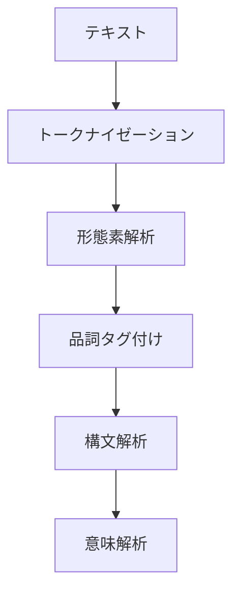
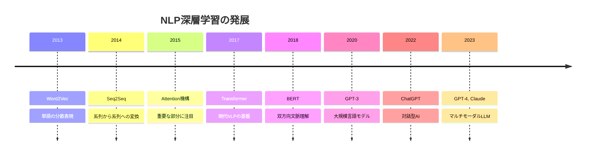
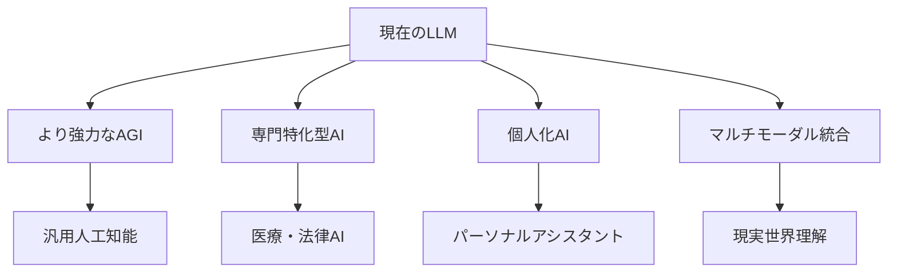

# Chapter 1: NLPの基礎と歴史

## イントロダクション

スマートフォンで音声アシスタントに話しかける、Google翻訳で外国語を理解する、SNSのコメント の感情を分析する——これらすべてに**自然言語処理（Natural Language Processing, NLP）**が使われています。

この章では、NLPとは何か、どのような歴史を経て現在の形になったのか、そして主にどのようなタスクがあるのかを学びます。

---

## 1. 自然言語処理とは

### 1.1 定義

**自然言語処理（NLP）**とは、人間が日常的に使用する言語（自然言語）をコンピュータで処理・理解・生成するための技術および研究分野です。


**自然言語 vs プログラミング言語:**

| 特徴 | 自然言語 | プログラミング言語 |
|------|----------|-------------------|
| 曖昧性 | 高い（文脈依存） | 低い（厳密な定義） |
| 変化 | 常に変化 | 安定 |
| 規則 | 例外が多い | 厳密なルール |
| 例 | 日本語、英語 | Python, Java |

### 1.2 なぜNLPは難しいのか？

人間の言語には、コンピュータが処理するうえで多くの困難があります：

**1. 曖昧性（Ambiguity）**
```
例: 「時計を見た人」
→ 時計を見ている人？
→ 時計という物体を見た人？
```

**2. 文脈依存性**
```
例: 「それ」「あれ」など の指示語
→ 前後の文脈から判断が必要
```

**3. 表現の多様性**
```
同じ意味でも無数の表現方法:
- 「ありがとう」
- 「感謝します」
- 「助かりました」
```

**4. 暗黙の知識**
```
「雨が降っているから傘を持っていく」
→ 「雨に濡れたくない」という常識が前提
```

---

## 2. NLPの主要タスク

NLPには様々なタスクがあります。主要なものを見ていきましょう。

### 2.1 基礎的なタスク



**1. トークナイゼーション（Tokenization）**
```
入力: 「今日は良い天気です」
出力: ['今日', 'は', '良い', '天気', 'です']
```

**2. 形態素解析（Morphological Analysis）**
```
「走る」→ 動詞、「走っ」（語幹）+「る」（活用語尾）
```

**3. 品詞タグ付け（POS Tagging）**
```
「猫/名詞 が/助詞 走る/動詞」
```

**4. 構文解析（Syntactic Parsing）**
```
文の構造を木構造で表現
```

**5. 固有表現抽出（Named Entity Recognition, NER）**
```
「東京/地名 の 気温/一般 は 25度/数値」
```

### 2.2 応用的なタスク

**1. テキスト分類（Text Classification）**
- スパム検出
- 感情分析（Positive/Negative）
- トピック分類

**2. 情報抽出（Information Extraction）**
- 関係抽出（AはBの社長、など）
- イベント抽出

**3. 質問応答（Question Answering）**
```
質問: 「富士山の高さは？」
回答: 「3,776メートルです」
```

**4. 機械翻訳（Machine Translation）**
```
入力: "Hello, world!"
出力: "こんにちは、世界！"
```

**5. テキスト生成（Text Generation）**
- 文章要約
- 自動応答
- 創作文生成

**6. 文書検索（Information Retrieval）**
- 検索エンジン
- 類似文書検索

---

## 3. NLPの歴史的発展

NLPは大きく3つの時代に分けられます。

### 3.1 ルールベース時代（1950年代〜1980年代）

**特徴:**
- 言語学者が手作業で文法規則を記述
- 決定論的なアプローチ
- ドメイン限定で高精度

**代表的な研究:**
- 1950年: チューリングテスト提案
- 1954年: ジョージタウン実験（初期の機械翻訳）
- 1960年代: ELIZA（初期の対話システム）

**メリット:**
- ✅ 規則が明確で説明可能
- ✅ 小規模なドメインでは高精度

**デメリット:**
- ❌ スケールしない（規則が膨大に）
- ❌ 例外処理が困難
- ❌ 新しいドメインへの適用が大変


### 3.2 統計的時代（1980年代〜2010年頃）

**特徴:**
- データから統計的にパターンを学習
- 確率モデルの利用
- 機械学習の導入

**主要技術:**
- **N-gram言語モデル**: 単語の出現確率を統計的にモデル化
- **隠れマルコフモデル（HMM）**: 品詞タグ付け等に利用
- **条件付き確率場（CRF）**: 系列ラベリングタスク
- **TF-IDF**: 文書の重要度計算

**代表的な成果:**
- 1990年代: 統計的機械翻訳の発展
- 2000年代: Googleの検索エンジン
- Naive Bayes, SVM等の機械学習手法の応用

**メリット:**
- ✅ 大量データから自動学習
- ✅ スケーラブル
- ✅ 新しいドメインへの適用が容易

**デメリット:**
- ❌ 大量のラベル付きデータが必要
- ❌ 特徴量設計が職人技
- ❌ 長距離依存関係の処理が困難

### 3.3 深層学習時代（2010年〜現在）

**特徴:**
- ニューラルネットワークによる表現学習
- End-to-Endの学習
- 大規模モデルの登場

**主要技術の発展:**



**重要なマイルストーン:**

**2013年: Word2Vec**
- 単語を密なベクトルで表現
- 「王 - 男 + 女 = 女王」のような意味演算が可能

**2014年: Seq2Seq**
- 機械翻訳の精度を大幅向上
- Encoder-Decoderアーキテクチャ

**2017年: Transformer**
- Attention機構のみで構成
- 並列処理が可能で高速
- 現代NLPの基盤技術

**2018年: BERT**
- 大規模事前学習 + ファインチューニング
- 多くのNLPタスクで SOTA達成

**2020年以降: 大規模言語モデル（LLM）**
- GPT-3（1750億パラメータ）
- Few-shot Learning能力
- ChatGPT, GPT-4, Claude等

**メリット:**
- ✅ 特徴量設計不要（表現学習）
- ✅ 複雑な依存関係を捉えられる
- ✅ 転移学習が効果的
- ✅ マルチタスク学習が可能

**デメリット:**
- ❌ 大量の計算資源が必要
- ❌ ブラックボックス化
- ❌ バイアスの問題
- ❌ 環境負荷（エネルギー消費）

---

## 4. 日本語NLPの特徴

日本語には、英語などのアルファベット言語とは異なる特徴があります。

### 4.1 形態素解析の重要性

**英語:**
```
単語の区切りが明確（スペース区切り）
"I love natural language processing"
→ 簡単にトークナイズ可能
```

**日本語:**
```
単語の区切りが不明確
「自然言語処理を愛しています」
→ どこで区切る？
「自然/言語/処理/を/愛して/い/ます」
「自然言語/処理/を/愛し/て/います」
```

そのため、日本語では**形態素解析**が極めて重要です。

### 4.2 主要な日本語NLPツール

| ツール | 特徴 | 辞書 |
|--------|------|------|
| **MeCab** | 高速、広く使われている | IPA辞書、NEologd |
| **Janome** | Pure Python、インストール容易 | IPA辞書 |
| **SudachiPy** | 新しい辞書、複数粒度の分割 | Sudachi辞書 |
| **Ginza** | spaCy拡張、依存構造解析も | |

### 4.3 日本語特有の課題

**1. 表記の揺れ:**
```
「コンピュータ」「コンピューター」「computer」
すべて同じ意味だが、表記が異なる
```

**2. 助詞の処理:**
```
「が」「は」「を」など、意味の違いが微妙
```

**3. 敬語・謙譲語:**
```
「言う」「申す」「おっしゃる」
文脈により使い分けが必要
```

---

## 5. NLPの現在と未来

### 5.1 現在のトレンド

**1. 大規模言語モデル（LLM）**
- ChatGPT, GPT-4, Claude, Gemini
- Few-shot Learning
- Prompt Engineering

**2. マルチモーダルAI**
- テキスト + 画像 + 音声
- CLIP, Flamingo等

**3. 効率化技術**
- モデル圧縮（Distillation）
- 低ランク適応（LoRA）
- 量子化

**4. 倫理とバイアス**
- 公平性の確保
- 有害コンテンツのフィルタリング
- 説明可能AI

### 5.2 今後の展望



**期待される発展:**
- 常識推論の向上
- 長文脈の理解（100万トークン超）
- マルチリンガル対応の強化
- リアルタイム処理の高速化

**課題:**
- 計算コストの削減
- バイアスと公平性
- プライバシー保護
- エネルギー消費

---

## 6. 練習問題

### 問題1: 基礎知識
次の文章について、NLPのどのタスクが関係しているか答えなさい。

1. 「このメールはスパムかどうか判定する」
2. 「文章を英語から日本語に変換する」
3. 「"Apple"が果物か企業か判断する」
4. 「文章から人名・地名を抽出する」

<details>
<summary>解答を見る</summary>

1. テキスト分類（スパムフィルタ）
2. 機械翻訳
3. 語義曖昧性解消（Word Sense Disambiguation）
4. 固有表現抽出（NER）
</details>

### 問題2: 歴史理解
以下の技術を登場順に並べなさい。

- Transformer
- Word2Vec
- ルールベース機械翻訳
- BERT
- 統計的機械翻訳

<details>
<summary>解答を見る</summary>

1. ルールベース機械翻訳（1950年代〜）
2. 統計的機械翻訳（1990年代〜）
3. Word2Vec（2013年）
4. Transformer（2017年）
5. BERT（2018年）
</details>

### 問題3: 日本語NLP
日本語NLPで形態素解析が重要な理由を説明しなさい。

<details>
<summary>解答を見る</summary>

日本語には単語の区切り（スペース）がないため、文をどこで区切るかを判断する形態素解析が必須です。例えば「自然言語処理」を「自然/言語/処理」と分割するには、辞書と文法規則を使った形態素解析が必要です。
</details>

---

## まとめ

この章では、NLPの基礎と歴史を学びました：

### 重要ポイント
- ✅ **NLPとは**: 人間の言語をコンピュータで処理する技術
- ✅ **主要タスク**: 分類、翻訳、質問応答、生成等
- ✅ **歴史**: ルールベース → 統計的 → 深層学習
- ✅ **現在**: 大規模言語モデル（LLM）の時代
- ✅ **日本語の特徴**: 形態素解析が重要

### 発展的なトピック


次章では、NLPの基本技術である**形態素解析と構文解析**について、実際のツールを使いながら学習します。

---

## 参考文献

1. Jurafsky, D., & Martin, J. H. (2023). "Speech and Language Processing" (3rd ed.)
2. 奥村学 (2010). 「自然言語処理の基礎」コロナ社
3. Bird, S., Klein, E., & Loper, E. (2009). "Natural Language Processing with Python"
4. Vaswani, A., et al. (2017). "Attention Is All You Need" NeurIPS
5. Devlin, J., et al. (2018). "BERT: Pre-training of Deep Bidirectional Transformers for Language Understanding"

---

**次へ**: [Chapter 2: 形態素解析・構文解析 →](chapter-2.html)

**戻る**: [シリーズ目次](index.html)
