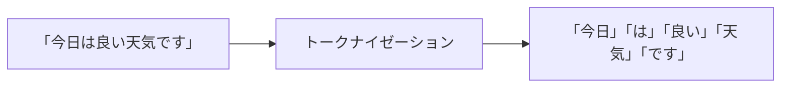
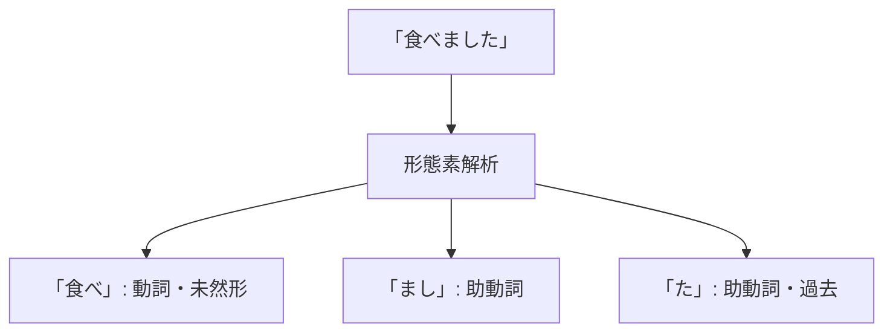

# Chapter 2: 形態素解析・構文解析

## イントロダクション

前章でNLPの全体像を学びました。この章では、NLPの最も基本的な処理である**形態素解析**と**構文解析**について、実際のツールを使いながら学習します。

テキストを分析するには、まず文を単語に分割し、それぞれの品詞や文法的役割を特定する必要があります。これがこの章の中心テーマです。

---

## 1. トークナイゼーション

### 1.1 トークナイゼーションとは

**トークナイゼーション（Tokenization）**は、テキストを意味のある単位（トークン）に分割する処理です。



### 1.2 英語のトークナイゼーション

英語は比較的簡単です：

```python
text = "I love natural language processing!"

# スペースで分割（最もシンプル）
tokens_simple = text.split()
print(tokens_simple)
# ['I', 'love', 'natural', 'language', 'processing!']

# NLTKを使用（句読点も分離）
import nltk
tokens_nltk = nltk.word_tokenize(text)
print(tokens_nltk)
# ['I', 'love', 'natural', 'language', 'processing', '!']
```

**課題:**
- 句読点の処理（"processing!" → "processing" + "!"）
- 短縮形（"don't" → "do" + "n't"）
- ハイフン付き単語（"state-of-the-art"）

### 1.3 日本語のトークナイゼーション

日本語は単語の境界が不明確なため、より複雑です：

```python
text = "自然言語処理を勉強しています"

# 単純な分割では不可能
# どこで区切る？
# ❌ "自然" "言語" "処理" "を" "勉強" "し" "て" "い" "ます"
# ✓ "自然言語処理" "を" "勉強" "し" "て" "い" "ます"
```

そのため、日本語では**形態素解析**が必須です。

---

## 2. 形態素解析

### 2.1 形態素解析とは

**形態素解析（Morphological Analysis）**は、文を形態素（意味を持つ最小単位）に分割し、それぞれの品詞や活用形を特定する処理です。



### 2.2 日本語形態素解析ツール

#### MeCab（メカブ）

**特徴:**
- 高速・高精度
- C++実装（Pythonバインディングあり）
- IPA辞書、NEologd辞書など

**インストール:**
```bash
# macOS
brew install mecab mecab-ipadic

# Python バインディング
pip install mecab-python3
```

**基本的な使い方:**
```python
import MeCab

# MeCabインスタンス作成
mecab = MeCab.Tagger()

# 形態素解析
text = "今日は良い天気です"
result = mecab.parse(text)
print(result)
```

**出力例:**
```
今日    名詞,副詞可能,*,*,*,*,今日,キョウ,キョー
は      助詞,係助詞,*,*,*,*,は,ハ,ワ
良い    形容詞,自立,*,*,形容詞・イ段,基本形,良い,ヨイ,ヨイ
天気    名詞,一般,*,*,*,*,天気,テンキ,テンキ
です    助動詞,*,*,*,特殊・デス,基本形,です,デス,デス
EOS
```

**構造化した出力:**
```python
def parse_mecab(text):
    """MeCabの出力を構造化"""
    mecab = MeCab.Tagger()
    node = mecab.parseToNode(text)

    words = []
    while node:
        if node.surface:  # 空文字列を除外
            features = node.feature.split(',')
            words.append({
                'surface': node.surface,      # 表層形
                'pos': features[0],           # 品詞
                'pos_detail': features[1],    # 品詞細分類
                'base_form': features[6],     # 基本形
                'reading': features[7] if len(features) > 7 else ''
            })
        node = node.next
    return words

result = parse_mecab("自然言語処理を学んでいます")
for word in result:
    print(f"{word['surface']:8s} | {word['pos']:6s} | {word['base_form']}")
```

**出力:**
```
自然言語処理 | 名詞    | 自然言語処理
を       | 助詞    | を
学ん     | 動詞    | 学ぶ
で       | 助詞    | で
い       | 動詞    | いる
ます     | 助動詞  | ます
```

#### Janome（ジャノメ）

**特徴:**
- Pure Python実装
- インストールが簡単（pip のみ）
- MeCabより遅いが使いやすい

**インストール:**
```bash
pip install janome
```

**基本的な使い方:**
```python
from janome.tokenizer import Tokenizer

tokenizer = Tokenizer()

text = "自然言語処理は面白い"
tokens = tokenizer.tokenize(text)

for token in tokens:
    print(token)
```

**出力:**
```
自然    名詞,一般,*,*,*,*,自然,シゼン,シゼン
言語    名詞,一般,*,*,*,*,言語,ゲンゴ,ゲンゴ
処理    名詞,サ変接続,*,*,*,*,処理,ショリ,ショリ
は      助詞,係助詞,*,*,*,*,は,ハ,ワ
面白い  形容詞,自立,*,*,形容詞・イ段,基本形,面白い,オモシロイ,オモシロイ
```

**単語のみを抽出:**
```python
def extract_words(text):
    """名詞・動詞・形容詞のみ抽出"""
    tokenizer = Tokenizer()
    words = []

    for token in tokenizer.tokenize(text):
        parts = str(token).split('\t')
        surface = parts[0]
        pos = parts[1].split(',')[0]

        # 名詞・動詞・形容詞のみ
        if pos in ['名詞', '動詞', '形容詞']:
            words.append(surface)

    return words

text = "今日は東京で会議があります"
words = extract_words(text)
print(words)
# ['今日', '東京', '会議', 'あり', 'ます']
```

#### SudachiPy（スダチパイ）

**特徴:**
- 複数粒度での分割（A/B/C）
- 新しい辞書体系
- 正規化機能

**インストール:**
```bash
pip install sudachipy sudachidict_core
```

**複数粒度での分割:**
```python
from sudachipy import tokenizer
from sudachipy import dictionary

# 辞書とトークナイザー作成
tokenizer_obj = dictionary.Dictionary().create()

text = "東京スカイツリー"

# A: 最短単位
mode = tokenizer.Tokenizer.SplitMode.A
print([token.surface() for token in tokenizer_obj.tokenize(text, mode)])
# ['東京', 'スカイ', 'ツリー']

# B: 中単位
mode = tokenizer.Tokenizer.SplitMode.B
print([token.surface() for token in tokenizer_obj.tokenize(text, mode)])
# ['東京', 'スカイツリー']

# C: 最長単位
mode = tokenizer.Tokenizer.SplitMode.C
print([token.surface() for token in tokenizer_obj.tokenize(text, mode)])
# ['東京スカイツリー']
```

### 2.3 形態素解析の応用

#### テキスト正規化

```python
from janome.tokenizer import Tokenizer

def normalize_text(text):
    """テキストを基本形に正規化"""
    tokenizer = Tokenizer()
    words = []

    for token in tokenizer.tokenize(text):
        parts = str(token).split('\t')
        features = parts[1].split(',')
        base_form = features[6]  # 基本形

        if base_form != '*':
            words.append(base_form)
        else:
            words.append(parts[0])

    return ' '.join(words)

text = "走っている人を見ました"
normalized = normalize_text(text)
print(normalized)
# '走る て いる 人 を 見る ます た'
```

#### ストップワード除去

```python
def remove_stopwords(text):
    """助詞・助動詞を除去"""
    tokenizer = Tokenizer()
    words = []

    stopword_pos = ['助詞', '助動詞', '記号']

    for token in tokenizer.tokenize(text):
        parts = str(token).split('\t')
        surface = parts[0]
        pos = parts[1].split(',')[0]

        if pos not in stopword_pos:
            words.append(surface)

    return words

text = "今日は東京で会議があります"
filtered = remove_stopwords(text)
print(filtered)
# ['今日', '東京', '会議', 'あり']
```

---

## 3. 品詞タグ付け

### 3.1 品詞タグとは

**品詞タグ付け（POS Tagging）**は、各単語の品詞を特定する処理です。

日本語の主な品詞：
- 名詞、動詞、形容詞、副詞
- 助詞、助動詞
- 接続詞、感動詞
- 記号

### 3.2 spaCy + Ginzaを使った品詞タグ付け

Ginzaは日本語に特化したspaCyモデルです。

**インストール:**
```bash
pip install spacy
pip install ginza ja-ginza
```

**基本的な使い方:**
```python
import spacy

# 日本語モデル読み込み
nlp = spacy.load("ja_ginza")

text = "今日は東京で会議があります"
doc = nlp(text)

# 品詞タグ付け結果
for token in doc:
    print(f"{token.text:10s} | {token.pos_:10s} | {token.tag_}")
```

**出力:**
```
今日        | NOUN       | 名詞-普通名詞-副詞可能
は          | ADP        | 助詞-係助詞
東京        | PROPN      | 名詞-固有名詞-地名-一般
で          | ADP        | 助詞-格助詞
会議        | NOUN       | 名詞-普通名詞-サ変可能
が          | ADP        | 助詞-格助詞
あり        | VERB       | 動詞-非自立可能
ます        | AUX        | 助動詞
```

---

## 4. 構文解析

### 4.1 構文解析とは

**構文解析（Syntactic Parsing）**は、文の文法的構造を明らかにする処理です。

主に2つのアプローチがあります：
1. **句構造解析**: 文を木構造で表現
2. **依存構造解析**: 単語間の依存関係を表現

### 4.2 依存構造解析

依存構造解析では、各単語が文中でどの単語に依存しているかを特定します。

```python
import spacy

nlp = spacy.load("ja_ginza")

text = "太郎が花子にプレゼントをあげた"
doc = nlp(text)

# 依存関係を表示
for token in doc:
    print(f"{token.text:10s} <- {token.dep_:10s} - {token.head.text}")
```

**出力:**
```
太郎        <- nsubj      - あげ
が          <- case       - 太郎
花子        <- obl        - あげ
に          <- case       - 花子
プレゼント  <- obj        - あげ
を          <- case       - プレゼント
あげ        <- ROOT       - あげ
た          <- aux        - あげ
```

**依存関係の意味:**
- `nsubj`: 主語（太郎が）
- `obl`: 斜格（花子に）
- `obj`: 目的語（プレゼントを）
- `ROOT`: 文の中心（あげた）
- `aux`: 助動詞（た）

### 4.3 依存構造の可視化

```python
from spacy import displacy

nlp = spacy.load("ja_ginza")
doc = nlp("太郎が花子にプレゼントをあげた")

# 依存構造を可視化（SVG形式）
svg = displacy.render(doc, style="dep", jupyter=False)

# HTMLファイルとして保存
with open("dependency.html", "w", encoding="utf-8") as f:
    f.write(svg)
```

**可視化イメージ:**
```
太郎 ──nsubj──> あげた
  │              ↑
  └─case─ が    │
                 │
花子 ──obl───────┘
  │
  └─case─ に

プレゼント ──obj──> あげた
  │                  ↑
  └─case─ を        │
                     │
た ──────aux─────────┘
```

### 4.4 句構造解析

句構造解析では、文をツリー構造で表現します。

```
        S (文)
       / \
      NP  VP
     /    / \
    N    NP  V
    |   /  \ |
   太郎 花子 に あげた
```

spaCyではデフォルトで依存構造解析を使用しますが、句構造が必要な場合はBerkeleyなどのパーサーを使用します。

---

## 5. 固有表現抽出（NER）

### 5.1 固有表現抽出とは

**固有表現抽出（Named Entity Recognition, NER）**は、テキストから人名・地名・組織名などの固有名詞を抽出する処理です。

主な固有表現のタイプ：
- **PERSON**: 人名
- **LOC**: 地名
- **ORG**: 組織名
- **DATE**: 日付
- **TIME**: 時刻
- **MONEY**: 金額
- **PERCENT**: パーセント

### 5.2 Ginzaを使ったNER

```python
import spacy

nlp = spacy.load("ja_ginza")

text = "昨日、東京の首相官邸で安倍首相が会見を開いた。"
doc = nlp(text)

# 固有表現を抽出
for ent in doc.ents:
    print(f"{ent.text:15s} | {ent.label_:10s}")
```

**出力:**
```
昨日            | DATE
東京            | GPE
首相官邸        | FAC
安倍            | PERSON
首相            | PERSON
```

**固有表現のラベル:**
- `PERSON`: 人名
- `GPE`: 地政学的実体（都市、国など）
- `FAC`: 施設
- `DATE`: 日付
- `ORG`: 組織

### 5.3 実践: ニュース記事からの情報抽出

```python
import spacy

def extract_entities(text):
    """ニュース記事から固有表現を抽出"""
    nlp = spacy.load("ja_ginza")
    doc = nlp(text)

    entities = {
        'persons': [],
        'locations': [],
        'organizations': [],
        'dates': []
    }

    for ent in doc.ents:
        if ent.label_ == 'PERSON':
            entities['persons'].append(ent.text)
        elif ent.label_ in ['GPE', 'LOC']:
            entities['locations'].append(ent.text)
        elif ent.label_ == 'ORG':
            entities['organizations'].append(ent.text)
        elif ent.label_ == 'DATE':
            entities['dates'].append(ent.text)

    return entities

# テスト
article = """
2023年10月15日、東京で開催されたAI技術カンファレンスに
Google、Microsoft、OpenAIの代表者が参加した。
CEOの山田太郎氏がキーノートスピーチを行った。
"""

result = extract_entities(article)
print("人物:", result['persons'])
print("場所:", result['locations'])
print("組織:", result['organizations'])
print("日付:", result['dates'])
```

**出力:**
```
人物: ['山田太郎', 'CEO']
場所: ['東京']
組織: ['Google', 'Microsoft', 'OpenAI', 'AI技術カンファレンス']
日付: ['2023年10月15日']
```

---

## 6. 実践: 総合的なテキスト分析

これまで学んだ技術を組み合わせて、包括的なテキスト分析を行います。

```python
import spacy
from collections import Counter

def analyze_text(text):
    """テキストの包括的分析"""
    nlp = spacy.load("ja_ginza")
    doc = nlp(text)

    # 1. トークン統計
    tokens = [token.text for token in doc]
    token_count = len(tokens)

    # 2. 品詞統計
    pos_counts = Counter([token.pos_ for token in doc])

    # 3. 名詞抽出
    nouns = [token.text for token in doc if token.pos_ == 'NOUN']

    # 4. 固有表現抽出
    entities = [(ent.text, ent.label_) for ent in doc.ents]

    # 5. 依存関係（主語-動詞-目的語）
    svo_triples = []
    for token in doc:
        if token.pos_ == 'VERB':
            subj = [child.text for child in token.children if child.dep_ == 'nsubj']
            obj = [child.text for child in token.children if child.dep_ == 'obj']
            if subj and obj:
                svo_triples.append((subj[0], token.text, obj[0]))

    return {
        'token_count': token_count,
        'pos_distribution': dict(pos_counts),
        'nouns': nouns,
        'entities': entities,
        'svo_triples': svo_triples
    }

# テスト
text = """
昨日、東京で開かれた会議で、山田部長が新プロジェクトを発表した。
このプロジェクトは来年4月に開始される予定である。
"""

result = analyze_text(text)

print("=== テキスト分析結果 ===")
print(f"トークン数: {result['token_count']}")
print(f"\n品詞分布:")
for pos, count in result['pos_distribution'].items():
    print(f"  {pos}: {count}")
print(f"\n名詞: {result['nouns']}")
print(f"\n固有表現: {result['entities']}")
print(f"\nSVOトリプル: {result['svo_triples']}")
```

---

## 7. 練習問題

### 問題1: 形態素解析
次のコードの出力を予想しなさい：

```python
from janome.tokenizer import Tokenizer
tokenizer = Tokenizer()

text = "速く走る"
for token in tokenizer.tokenize(text):
    print(token)
```

<details>
<summary>解答を見る</summary>

```
速く    副詞,一般,*,*,*,*,速く,ハヤク,ハヤク
走る    動詞,自立,*,*,五段・ラ行,基本形,走る,ハシル,ハシル
```
「速く」は副詞、「走る」は動詞として解析されます。
</details>

### 問題2: 品詞フィルタリング
以下のテキストから、名詞のみを抽出するコードを書きなさい：

```python
text = "今日は良い天気なので、公園で散歩します"
```

<details>
<summary>解答を見る</summary>

```python
from janome.tokenizer import Tokenizer

tokenizer = Tokenizer()
nouns = []

for token in tokenizer.tokenize(text):
    parts = str(token).split('\t')
    surface = parts[0]
    pos = parts[1].split(',')[0]

    if pos == '名詞':
        nouns.append(surface)

print(nouns)
# ['今日', '天気', '公園', '散歩']
```
</details>

### 問題3: 固有表現抽出
次のテキストから人名と地名を抽出しなさい：

```python
text = "田中さんは大阪から東京へ出張に行った"
```

<details>
<summary>解答を見る</summary>

```python
import spacy

nlp = spacy.load("ja_ginza")
doc = nlp(text)

persons = [ent.text for ent in doc.ents if ent.label_ == 'PERSON']
locations = [ent.text for ent in doc.ents if ent.label_ in ['GPE', 'LOC']]

print("人名:", persons)  # ['田中']
print("地名:", locations)  # ['大阪', '東京']
```
</details>

---

## まとめ

この章では、テキストを言語学的に分析する基本技術を学びました：

### 重要ポイント
- ✅ **トークナイゼーション**: テキストを単語に分割
- ✅ **形態素解析**: 日本語では必須（MeCab, Janome, SudachiPy）
- ✅ **品詞タグ付け**: 各単語の文法的役割を特定
- ✅ **構文解析**: 文の構造を解析（依存構造・句構造）
- ✅ **固有表現抽出**: 人名・地名・組織名などを抽出

### 主要ツール
```python
# 形態素解析
MeCab, Janome, SudachiPy

# 総合的NLP
spaCy + Ginza

# 依存構造解析・NER
spaCy, Ginza
```

### 次のステップ
これらの前処理技術を使って、次章では**実践的なテキスト分類**を実装します。

---

**次へ**: [Chapter 3: 実践 - テキスト分類 →](chapter-3.html)

**戻る**: [シリーズ目次](index.html)
