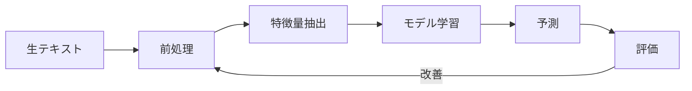

# Chapter 3: 実践 - テキスト分類

## 本章の概要

テキスト分類（Text Classification）は、NLPの最も実用的なタスクの1つです。感情分析、スパムフィルタ、ニュース記事のカテゴリ分類など、幅広い応用があります。

本章では、実際にテキスト分類モデルを構築する方法を、完全な実装例とともに学びます。

### 学習目標

- ✅ テキスト前処理パイプラインの実装
- ✅ Bag-of-Words と TF-IDF による特徴量抽出
- ✅ 機械学習アルゴリズムによる分類
- ✅ モデルの評価と改善手法
- ✅ 実際のデータセットでの実装経験

---

## 1. テキスト分類とは

### 1.1 定義と応用例

**テキスト分類（Text Classification）** とは、テキストを予め定義されたカテゴリに自動的に分類するタスクです。

#### 主な応用例

| 応用分野 | 具体例 | ビジネス価値 |
|---------|--------|-------------|
| **感情分析** | 商品レビューの Positive/Negative 判定 | 顧客満足度の把握 |
| **スパムフィルタ** | メールのスパム/非スパム分類 | セキュリティ向上 |
| **カテゴリ分類** | ニュース記事のジャンル分類 | コンテンツ推薦 |
| **意図推定** | 問い合わせの種類判定 | カスタマーサポート効率化 |
| **トピック分類** | 論文の研究分野分類 | 情報整理 |

### 1.2 テキスト分類の流れ



1. **前処理**: テキストのクリーニング、正規化
2. **特徴量抽出**: テキストを数値ベクトルに変換
3. **モデル学習**: 機械学習アルゴリズムで学習
4. **予測**: 新しいテキストを分類
5. **評価**: モデルの性能を測定

---

## 2. テキスト前処理パイプライン

### 2.1 なぜ前処理が重要か

生のテキストデータには以下の問題があります：

- **ノイズ**: URL、記号、絵文字など不要な情報
- **表記ゆれ**: "パソコン" vs "パーソナルコンピュータ"
- **大文字小文字**: "Apple" vs "apple"
- **活用形**: "走る", "走った", "走れば"

前処理によってこれらを統一し、モデルの学習効率を上げます。

### 2.2 基本的な前処理ステップ

#### 英語テキストの前処理

```python
import re
import string
from nltk.corpus import stopwords
from nltk.stem import PorterStemmer, WordNetLemmatizer
from nltk.tokenize import word_tokenize

class EnglishTextPreprocessor:
    """英語テキスト前処理クラス"""

    def __init__(self):
        self.stop_words = set(stopwords.words('english'))
        self.stemmer = PorterStemmer()
        self.lemmatizer = WordNetLemmatizer()

    def clean_text(self, text):
        """テキストのクリーニング"""
        # 小文字化
        text = text.lower()

        # URLの除去
        text = re.sub(r'http\S+|www\S+|https\S+', '', text, flags=re.MULTILINE)

        # メンション・ハッシュタグの除去（Twitter用）
        text = re.sub(r'@\w+|#\w+', '', text)

        # HTMLタグの除去
        text = re.sub(r'<.*?>', '', text)

        # 句読点の除去
        text = text.translate(str.maketrans('', '', string.punctuation))

        # 数字の除去（オプション）
        text = re.sub(r'\d+', '', text)

        # 余分な空白の除去
        text = ' '.join(text.split())

        return text

    def tokenize_and_filter(self, text):
        """トークン化とストップワード除去"""
        # トークン化
        tokens = word_tokenize(text)

        # ストップワード除去
        tokens = [word for word in tokens if word not in self.stop_words]

        # 短すぎる単語を除去（2文字未満）
        tokens = [word for word in tokens if len(word) > 2]

        return tokens

    def stem_tokens(self, tokens):
        """ステミング（語幹抽出）"""
        return [self.stemmer.stem(token) for token in tokens]

    def lemmatize_tokens(self, tokens):
        """レンマ化（見出し語化）"""
        return [self.lemmatizer.lemmatize(token) for token in tokens]

    def preprocess(self, text, use_lemmatization=True):
        """完全な前処理パイプライン"""
        # 1. クリーニング
        text = self.clean_text(text)

        # 2. トークン化とフィルタリング
        tokens = self.tokenize_and_filter(text)

        # 3. 正規化（ステミング or レンマ化）
        if use_lemmatization:
            tokens = self.lemmatize_tokens(tokens)
        else:
            tokens = self.stem_tokens(tokens)

        return ' '.join(tokens)

# 使用例
preprocessor = EnglishTextPreprocessor()

raw_text = """
This is AMAZING!!! Check out http://example.com
I absolutely love this product 😍 #happy @company
"""

processed_text = preprocessor.preprocess(raw_text)
print(f"元のテキスト: {raw_text}")
print(f"前処理後: {processed_text}")
# 出力例: "amazing absolutely love product happy company"
```

#### 日本語テキストの前処理

```python
import re
import MeCab
import unicodedata

class JapaneseTextPreprocessor:
    """日本語テキスト前処理クラス"""

    def __init__(self):
        self.mecab = MeCab.Tagger()

        # 日本語ストップワード（一部）
        self.stop_words = set([
            'の', 'は', 'を', 'が', 'に', 'で', 'と', 'た', 'し',
            'て', 'ます', 'です', 'ある', 'いる', 'この', 'その',
            'れる', 'られる', 'せる', 'させる', 'こと', 'もの'
        ])

        # 除外する品詞
        self.exclude_pos = set([
            '助詞', '助動詞', '接続詞', '記号', 'フィラー', '感動詞'
        ])

    def clean_text(self, text):
        """テキストのクリーニング"""
        # Unicode正規化（NFKCで半角・全角を統一）
        text = unicodedata.normalize('NFKC', text)

        # URLの除去
        text = re.sub(r'http\S+|www\S+|https\S+', '', text)

        # メンション・ハッシュタグの除去
        text = re.sub(r'@\w+|#\w+', '', text)

        # 改行・タブを空白に
        text = re.sub(r'[\n\t]', ' ', text)

        # 絵文字の除去（オプション）
        emoji_pattern = re.compile(
            "["
            "\U0001F600-\U0001F64F"  # 顔文字
            "\U0001F300-\U0001F5FF"  # 記号・絵文字
            "\U0001F680-\U0001F6FF"  # 乗り物・建物
            "\U0001F1E0-\U0001F1FF"  # 旗
            "]+", flags=re.UNICODE
        )
        text = emoji_pattern.sub('', text)

        # 余分な空白の除去
        text = ' '.join(text.split())

        return text

    def tokenize_with_filter(self, text):
        """MeCabでトークン化 + フィルタリング"""
        # MeCabで形態素解析
        node = self.mecab.parseToNode(text)

        words = []
        while node:
            if node.surface:
                features = node.feature.split(',')
                surface = node.surface
                pos = features[0]  # 品詞
                base_form = features[6] if len(features) > 6 else surface

                # フィルタリング条件
                if (pos not in self.exclude_pos and
                    surface not in self.stop_words and
                    len(surface) > 1):  # 1文字単語を除外

                    # 基本形を使用
                    words.append(base_form if base_form != '*' else surface)

            node = node.next

        return words

    def preprocess(self, text):
        """完全な前処理パイプライン"""
        # 1. クリーニング
        text = self.clean_text(text)

        # 2. トークン化とフィルタリング
        tokens = self.tokenize_with_filter(text)

        return ' '.join(tokens)

# 使用例
jp_preprocessor = JapaneseTextPreprocessor()

raw_jp_text = """
この商品は本当に素晴らしいです！！！😍
絶対におすすめします🎉 #最高
詳しくはこちら→ http://example.com
"""

processed_jp_text = jp_preprocessor.preprocess(raw_jp_text)
print(f"元のテキスト: {raw_jp_text}")
print(f"前処理後: {processed_jp_text}")
# 出力例: "商品 本当 素晴らしい 絶対 おすすめ 最高 詳しい"
```

---

## 3. 特徴量抽出

機械学習モデルは数値しか扱えません。テキストを数値ベクトルに変換する必要があります。

### 3.1 Bag-of-Words (BoW)

**Bag-of-Words** は最もシンプルな方法で、各文書を単語の出現回数で表現します。

#### 仕組み

```
文書1: "猫が好き"
文書2: "犬が好き"
文書3: "猫も犬も好き"

語彙: [猫, 犬, 好き, が, も]

BoW表現:
文書1: [1, 0, 1, 1, 0]  # 猫:1回, 犬:0回, 好き:1回, が:1回, も:0回
文書2: [0, 1, 1, 1, 0]
文書3: [1, 1, 1, 0, 2]
```

#### 実装

```python
from sklearn.feature_extraction.text import CountVectorizer

# サンプルデータ
documents = [
    "機械学習は面白い",
    "深層学習は難しい",
    "機械学習と深層学習は関連している",
    "自然言語処理も面白い"
]

# BoW変換
vectorizer = CountVectorizer()
bow_matrix = vectorizer.fit_transform(documents)

# 語彙の確認
print("語彙:", vectorizer.get_feature_names_out())
print("\nBoW行列:")
print(bow_matrix.toarray())
```

**出力:**
```
語彙: ['と' '深層' '機械' '自然' '言語' '処理' '関連' '難しい' '面白い' '学習']

BoW行列:
[[0 0 1 0 0 0 0 0 1 1]  # 機械学習は面白い
 [0 1 0 0 0 0 0 1 0 1]  # 深層学習は難しい
 [1 1 1 0 0 0 1 0 0 2]  # 機械学習と深層学習は関連している
 [0 0 0 1 1 1 0 0 1 0]] # 自然言語処理も面白い
```

#### 問題点

- **語順を無視**: "犬が猫を追いかける" と "猫が犬を追いかける" が同じ
- **文書長の影響**: 長い文書ほど値が大きくなる
- **重要度を考慮しない**: すべての単語が同等に扱われる

### 3.2 TF-IDF (Term Frequency-Inverse Document Frequency)

**TF-IDF** は、単語の重要度を考慮した特徴量抽出手法です。

#### 計算式

$$
\text{TF-IDF}(t, d) = \text{TF}(t, d) \times \text{IDF}(t)
$$

- **TF (Term Frequency)**: 文書内での単語の出現頻度
$$
\text{TF}(t, d) = \frac{\text{文書}d\text{における単語}t\text{の出現回数}}{\text{文書}d\text{の総単語数}}
$$

- **IDF (Inverse Document Frequency)**: 単語の希少性
$$
\text{IDF}(t) = \log \frac{\text{総文書数}}{\text{単語}t\text{を含む文書数}}
$$

#### 直感的理解

- **頻出する単語** (TF が高い) → 重要度が高い
- **多くの文書に出現する単語** (IDF が低い) → あまり重要ではない
- 例: "機械学習" は特定の文書に頻出 → TF-IDF 高い
- 例: "です", "ます" は全文書に出現 → TF-IDF 低い

#### 実装

```python
from sklearn.feature_extraction.text import TfidfVectorizer

# サンプルデータ
documents = [
    "機械学習は教師あり学習と教師なし学習に分類される",
    "深層学習はニューラルネットワークを用いた機械学習の手法",
    "自然言語処理は人間の言語をコンピュータで処理する技術",
    "画像認識には畳み込みニューラルネットワークが使われる"
]

# TF-IDF変換
tfidf_vectorizer = TfidfVectorizer()
tfidf_matrix = tfidf_vectorizer.fit_transform(documents)

# 語彙と TF-IDF 値
feature_names = tfidf_vectorizer.get_feature_names_out()
print("語彙:", feature_names)
print("\nTF-IDF行列の形状:", tfidf_matrix.shape)

# 最初の文書の TF-IDF 値を表示
doc_index = 0
feature_index = tfidf_matrix[doc_index].nonzero()[1]
tfidf_scores = zip(
    [feature_names[i] for i in feature_index],
    [tfidf_matrix[doc_index, i] for i in feature_index]
)

print(f"\n文書{doc_index+1}のTF-IDFスコア:")
for word, score in sorted(tfidf_scores, key=lambda x: x[1], reverse=True):
    print(f"  {word}: {score:.4f}")
```

**出力例:**
```
文書1のTF-IDFスコア:
  教師: 0.5774  # 他の文書にはない → IDF高い
  学習: 0.4082  # 複数文書に出現 → IDF中程度
  分類: 0.4082
  機械: 0.2887  # 2文書に出現 → IDF低め
```

### 3.3 N-gram

**N-gram** は連続するN個の単語を1つの特徴として扱います。

- **Unigram (1-gram)**: "機械", "学習"
- **Bigram (2-gram)**: "機械学習"
- **Trigram (3-gram)**: "機械学習の手法"

#### 実装

```python
from sklearn.feature_extraction.text import TfidfVectorizer

documents = [
    "機械 学習 は 面白い",
    "深層 学習 も 面白い",
    "機械 学習 と 深層 学習"
]

# Bigram + Unigram の TF-IDF
vectorizer = TfidfVectorizer(ngram_range=(1, 2))  # 1-gram と 2-gram
tfidf = vectorizer.fit_transform(documents)

print("特徴語（Unigram + Bigram）:")
print(vectorizer.get_feature_names_out())
```

**出力:**
```
['と' 'は' 'も' '学習' '学習 と' '学習 は' '学習 も' '機械' '機械 学習'
 '深層' '深層 学習' '面白い']
```

---

## 4. 機械学習による分類

### 4.1 Naive Bayes (ナイーブベイズ)

Naive Bayes はテキスト分類で最もよく使われるアルゴリズムの1つです。

#### 理論

ベイズの定理に基づき、各クラスの確率を計算：

$$
P(C|D) = \frac{P(D|C) \times P(C)}{P(D)}
$$

- $P(C|D)$: 文書 $D$ が与えられたときのクラス $C$ の確率
- $P(D|C)$: クラス $C$ における文書 $D$ の尤度
- $P(C)$: クラス $C$ の事前確率

#### 実装: スパムフィルタ

```python
from sklearn.naive_bayes import MultinomialNB
from sklearn.model_selection import train_test_split
from sklearn.metrics import classification_report, confusion_matrix
import pandas as pd

# サンプルデータセット（実際は大量のメールデータを使用）
emails = [
    "無料でiPhoneが当たります！今すぐクリック！",
    "会議の資料を送付します",
    "激安セール！本日限定50%オフ",
    "プロジェクトの進捗報告",
    "あなたに100万円が当たりました",
    "来週の予定について確認させてください",
    "限定オファー！今すぐ登録",
    "議事録を共有します"
]

labels = [1, 0, 1, 0, 1, 0, 1, 0]  # 1: スパム, 0: 正常

# 前処理（実際は日本語形態素解析を使用）
from sklearn.feature_extraction.text import TfidfVectorizer

vectorizer = TfidfVectorizer(max_features=100)
X = vectorizer.fit_transform(emails)
y = labels

# 訓練データとテストデータに分割
X_train, X_test, y_train, y_test = train_test_split(
    X, y, test_size=0.25, random_state=42
)

# Naive Bayes モデルの訓練
nb_model = MultinomialNB()
nb_model.fit(X_train, y_train)

# 予測
y_pred = nb_model.predict(X_test)

# 評価
print("分類レポート:")
print(classification_report(y_test, y_pred,
                          target_names=['正常メール', 'スパム']))

print("\n混同行列:")
print(confusion_matrix(y_test, y_pred))

# 新しいメールの予測
new_emails = [
    "会議室の予約をお願いします",
    "今すぐクリック！大金が手に入ります"
]
new_emails_vec = vectorizer.transform(new_emails)
predictions = nb_model.predict(new_emails_vec)

for email, pred in zip(new_emails, predictions):
    label = "スパム" if pred == 1 else "正常"
    print(f"'{email}' → {label}")
```

### 4.2 Support Vector Machine (SVM)

SVM は高次元データでも効果的な分類アルゴリズムです。

#### 実装: 感情分析

```python
from sklearn.svm import LinearSVC
from sklearn.pipeline import Pipeline
from sklearn.feature_extraction.text import TfidfVectorizer

# サンプルレビューデータ
reviews = [
    "この映画は最高でした！感動しました",
    "つまらない映画。時間の無駄",
    "素晴らしい演技と美しい映像",
    "退屈で眠くなった",
    "期待以上の作品！また観たい",
    "ストーリーが薄く、がっかり",
    "圧巻のラストシーン",
    "二度と観たくない"
]

sentiments = [1, 0, 1, 0, 1, 0, 1, 0]  # 1: Positive, 0: Negative

# パイプライン構築（前処理 → 特徴抽出 → モデル）
pipeline = Pipeline([
    ('tfidf', TfidfVectorizer(max_features=100)),
    ('svm', LinearSVC(random_state=42))
])

# 訓練
X_train, X_test, y_train, y_test = train_test_split(
    reviews, sentiments, test_size=0.25, random_state=42
)

pipeline.fit(X_train, y_train)

# 評価
y_pred = pipeline.predict(X_test)
print("正解率:", pipeline.score(X_test, y_test))

# 新しいレビューの感情予測
new_reviews = [
    "期待外れの作品",
    "感動的なストーリー"
]

for review in new_reviews:
    sentiment = pipeline.predict([review])[0]
    label = "Positive" if sentiment == 1 else "Negative"
    print(f"'{review}' → {label}")
```

### 4.3 完全な分類パイプライン

実際のプロジェクトで使える完全なパイプライン例：

```python
import pandas as pd
from sklearn.model_selection import train_test_split, GridSearchCV
from sklearn.feature_extraction.text import TfidfVectorizer
from sklearn.naive_bayes import MultinomialNB
from sklearn.svm import LinearSVC
from sklearn.linear_model import LogisticRegression
from sklearn.ensemble import RandomForestClassifier
from sklearn.metrics import classification_report, accuracy_score
import joblib

class TextClassifier:
    """テキスト分類器クラス"""

    def __init__(self, model_type='nb'):
        """
        Parameters:
        -----------
        model_type : str
            'nb': Naive Bayes
            'svm': Support Vector Machine
            'lr': Logistic Regression
            'rf': Random Forest
        """
        self.vectorizer = TfidfVectorizer(
            max_features=5000,
            ngram_range=(1, 2),
            min_df=2,
            max_df=0.8
        )

        # モデル選択
        if model_type == 'nb':
            self.model = MultinomialNB()
        elif model_type == 'svm':
            self.model = LinearSVC(random_state=42)
        elif model_type == 'lr':
            self.model = LogisticRegression(random_state=42, max_iter=1000)
        elif model_type == 'rf':
            self.model = RandomForestClassifier(random_state=42, n_estimators=100)
        else:
            raise ValueError(f"Unknown model type: {model_type}")

    def train(self, X_train, y_train):
        """モデルの訓練"""
        # TF-IDF変換
        X_train_vec = self.vectorizer.fit_transform(X_train)

        # モデル学習
        self.model.fit(X_train_vec, y_train)

    def predict(self, X_test):
        """予測"""
        X_test_vec = self.vectorizer.transform(X_test)
        return self.model.predict(X_test_vec)

    def evaluate(self, X_test, y_test):
        """評価"""
        y_pred = self.predict(X_test)

        print("正解率:", accuracy_score(y_test, y_pred))
        print("\n分類レポート:")
        print(classification_report(y_test, y_pred))

        return y_pred

    def save(self, filepath):
        """モデルの保存"""
        joblib.dump((self.vectorizer, self.model), filepath)

    def load(self, filepath):
        """モデルの読み込み"""
        self.vectorizer, self.model = joblib.load(filepath)

# 使用例
if __name__ == "__main__":
    # データ準備（実際はCSVファイルから読み込み）
    texts = [
        "素晴らしい商品です",
        "最悪の品質",
        "期待通りの性能",
        "二度と買いません",
        # ... 大量のデータ
    ]
    labels = [1, 0, 1, 0]  # 1: Positive, 0: Negative

    # 訓練・テスト分割
    X_train, X_test, y_train, y_test = train_test_split(
        texts, labels, test_size=0.2, random_state=42, stratify=labels
    )

    # 分類器の訓練
    classifier = TextClassifier(model_type='svm')
    classifier.train(X_train, y_train)

    # 評価
    y_pred = classifier.evaluate(X_test, y_test)

    # モデルの保存
    classifier.save('text_classifier.pkl')

    # 新しいテキストの予測
    new_texts = ["この商品は最高です", "がっかりしました"]
    predictions = classifier.predict(new_texts)
    print("\n新しいテキストの予測:")
    for text, pred in zip(new_texts, predictions):
        print(f"'{text}' → {'Positive' if pred == 1 else 'Negative'}")
```

---

## 5. モデルの評価

### 5.1 評価指標

#### 正解率 (Accuracy)

$$
\text{Accuracy} = \frac{\text{正しく分類されたサンプル数}}{\text{全サンプル数}}
$$

- **使いどころ**: クラスのバランスが取れている場合
- **注意点**: 不均衡データでは不適切

#### 適合率 (Precision)

$$
\text{Precision} = \frac{TP}{TP + FP}
$$

- **意味**: 「Positive と予測したもののうち、実際に Positive だった割合」
- **使いどころ**: 偽陽性を避けたい場合（スパムフィルタなど）

#### 再現率 (Recall)

$$
\text{Recall} = \frac{TP}{TP + FN}
$$

- **意味**: 「実際に Positive のもののうち、正しく Positive と予測できた割合」
- **使いどころ**: 偽陰性を避けたい場合（病気診断など）

#### F1スコア

$$
F1 = 2 \times \frac{\text{Precision} \times \text{Recall}}{\text{Precision} + \text{Recall}}
$$

- **意味**: Precision と Recall の調和平均
- **使いどころ**: バランスの取れた評価が必要な場合

### 5.2 混同行列 (Confusion Matrix)

```python
from sklearn.metrics import confusion_matrix
import seaborn as sns
import matplotlib.pyplot as plt

# 予測結果（例）
y_true = [0, 1, 0, 1, 0, 1, 1, 0]
y_pred = [0, 1, 0, 0, 0, 1, 1, 1]

# 混同行列
cm = confusion_matrix(y_true, y_pred)

# 可視化
plt.figure(figsize=(6, 5))
sns.heatmap(cm, annot=True, fmt='d', cmap='Blues',
            xticklabels=['Negative', 'Positive'],
            yticklabels=['Negative', 'Positive'])
plt.ylabel('実際のラベル')
plt.xlabel('予測ラベル')
plt.title('混同行列')
plt.show()

print("混同行列:")
print(cm)
print(f"\nTrue Negative: {cm[0,0]}")
print(f"False Positive: {cm[0,1]}")
print(f"False Negative: {cm[1,0]}")
print(f"True Positive: {cm[1,1]}")
```

### 5.3 交差検証 (Cross-Validation)

データを複数の fold に分け、より信頼性の高い評価を行います。

```python
from sklearn.model_selection import cross_val_score
from sklearn.naive_bayes import MultinomialNB
from sklearn.feature_extraction.text import TfidfVectorizer
from sklearn.pipeline import Pipeline

# パイプライン
pipeline = Pipeline([
    ('tfidf', TfidfVectorizer(max_features=1000)),
    ('nb', MultinomialNB())
])

# 5-fold 交差検証
scores = cross_val_score(
    pipeline,
    texts,  # 全テキストデータ
    labels,  # 全ラベル
    cv=5,  # 5分割
    scoring='f1'
)

print(f"各foldのF1スコア: {scores}")
print(f"平均F1スコア: {scores.mean():.4f} (+/- {scores.std():.4f})")
```

---

## 6. ハイパーパラメータチューニング

### 6.1 Grid Search

```python
from sklearn.model_selection import GridSearchCV
from sklearn.pipeline import Pipeline
from sklearn.feature_extraction.text import TfidfVectorizer
from sklearn.svm import LinearSVC

# パイプライン
pipeline = Pipeline([
    ('tfidf', TfidfVectorizer()),
    ('svm', LinearSVC())
])

# チューニングするパラメータ
param_grid = {
    'tfidf__max_features': [1000, 3000, 5000],
    'tfidf__ngram_range': [(1, 1), (1, 2), (1, 3)],
    'tfidf__min_df': [1, 2, 5],
    'svm__C': [0.1, 1, 10]
}

# Grid Search
grid_search = GridSearchCV(
    pipeline,
    param_grid,
    cv=5,
    scoring='f1',
    n_jobs=-1,  # 並列処理
    verbose=1
)

grid_search.fit(X_train, y_train)

# 最良のパラメータ
print("最良のパラメータ:")
print(grid_search.best_params_)
print(f"\n最良のF1スコア: {grid_search.best_score_:.4f}")

# 最良モデルで予測
best_model = grid_search.best_estimator_
y_pred = best_model.predict(X_test)
```

---

## 7. 実践例: 日本語感情分析システム

### 7.1 完全な実装

```python
import pandas as pd
import MeCab
from sklearn.model_selection import train_test_split
from sklearn.feature_extraction.text import TfidfVectorizer
from sklearn.svm import LinearSVC
from sklearn.metrics import classification_report
import pickle

class JapaneseSentimentAnalyzer:
    """日本語感情分析システム"""

    def __init__(self):
        self.mecab = MeCab.Tagger()
        self.vectorizer = None
        self.model = None

    def tokenize(self, text):
        """MeCabでトークン化"""
        node = self.mecab.parseToNode(text)
        tokens = []

        while node:
            if node.surface:
                features = node.feature.split(',')
                pos = features[0]

                # 名詞、動詞、形容詞のみ抽出
                if pos in ['名詞', '動詞', '形容詞']:
                    base_form = features[6] if len(features) > 6 else node.surface
                    if base_form != '*':
                        tokens.append(base_form)

            node = node.next

        return ' '.join(tokens)

    def prepare_data(self, texts):
        """データの前処理"""
        return [self.tokenize(text) for text in texts]

    def train(self, texts, labels):
        """モデルの訓練"""
        # トークン化
        tokenized_texts = self.prepare_data(texts)

        # TF-IDF ベクトル化
        self.vectorizer = TfidfVectorizer(
            max_features=3000,
            ngram_range=(1, 2),
            min_df=2
        )
        X = self.vectorizer.fit_transform(tokenized_texts)

        # SVM 訓練
        self.model = LinearSVC(C=1.0, random_state=42)
        self.model.fit(X, labels)

    def predict(self, texts):
        """感情予測"""
        tokenized_texts = self.prepare_data(texts)
        X = self.vectorizer.transform(tokenized_texts)
        return self.model.predict(X)

    def predict_proba(self, texts):
        """確率付き予測（SVMの決定関数を使用）"""
        tokenized_texts = self.prepare_data(texts)
        X = self.vectorizer.transform(tokenized_texts)
        decision = self.model.decision_function(X)
        return decision

    def save(self, filepath):
        """モデルの保存"""
        with open(filepath, 'wb') as f:
            pickle.dump((self.vectorizer, self.model), f)

    def load(self, filepath):
        """モデルの読み込み"""
        with open(filepath, 'rb') as f:
            self.vectorizer, self.model = pickle.load(f)

# データ準備
if __name__ == "__main__":
    # サンプルレビューデータ（実際は大規模データセットを使用）
    reviews = [
        "この商品は本当に素晴らしい。期待以上でした",
        "最悪の品質。二度と買いません",
        "値段の割には良い商品だと思います",
        "配送が遅く、商品も傷だらけ",
        "使いやすくて満足しています",
        "説明と違う商品が届いた",
        "コストパフォーマンスが高い",
        "期待外れでがっかり",
        "デザインが美しく、機能も充実",
        "壊れやすく、すぐに故障した"
    ]

    sentiments = [1, 0, 1, 0, 1, 0, 1, 0, 1, 0]  # 1: Positive, 0: Negative

    # 訓練・テスト分割
    X_train, X_test, y_train, y_test = train_test_split(
        reviews, sentiments, test_size=0.2, random_state=42
    )

    # 分析器の訓練
    analyzer = JapaneseSentimentAnalyzer()
    analyzer.train(X_train, y_train)

    # 評価
    y_pred = analyzer.predict(X_test)
    print("分類レポート:")
    print(classification_report(y_test, y_pred,
                              target_names=['Negative', 'Positive']))

    # 新しいレビューの感情分析
    new_reviews = [
        "とても良い買い物ができました",
        "お金を無駄にした",
        "普通の商品です"
    ]

    predictions = analyzer.predict(new_reviews)
    scores = analyzer.predict_proba(new_reviews)

    print("\n新しいレビューの感情分析:")
    for review, pred, score in zip(new_reviews, predictions, scores):
        sentiment = "Positive" if pred == 1 else "Negative"
        confidence = abs(score)
        print(f"'{review}'")
        print(f"  → {sentiment} (信頼度: {confidence:.2f})\n")

    # モデルの保存
    analyzer.save('sentiment_model.pkl')
```

---

## 8. まとめ

### 8.1 本章で学んだこと

✅ **テキスト前処理**
- クリーニング、トークン化、正規化の実装
- 日本語と英語の前処理の違い

✅ **特徴量抽出**
- Bag-of-Words (BoW) の仕組み
- TF-IDF による重み付け
- N-gram の活用

✅ **機械学習モデル**
- Naive Bayes による分類
- SVM による高次元データ分類
- パイプラインの構築

✅ **モデル評価**
- 正解率、適合率、再現率、F1スコア
- 混同行列の読み方
- 交差検証による信頼性向上

✅ **実践システム**
- 日本語感情分析システムの完全実装

### 8.2 次のステップ

本章で基礎的なテキスト分類を学びました。さらに発展させるには：

1. **深層学習の活用**: LSTM、Transformer などのモデル
2. **大規模データセット**: 実際のビジネスデータでの実験
3. **多クラス分類**: 3つ以上のカテゴリへの拡張
4. **リアルタイム分類**: Web API としてデプロイ

---

## 9. 練習問題

### 問題1: 前処理パイプライン（基礎）

次のテキストに対して、適切な前処理を実装してください。

```python
text = """
【速報】新製品発売！！！🎉
今なら50%OFF → http://example.com
#セール #お得 @公式アカウント
"""

# あなたの実装:
def preprocess(text):
    # ここにコードを書く
    pass

result = preprocess(text)
print(result)
```

<details>
<summary>解答例</summary>

```python
import re
import unicodedata

def preprocess(text):
    # Unicode正規化
    text = unicodedata.normalize('NFKC', text)

    # URL除去
    text = re.sub(r'http\S+', '', text)

    # メンション・ハッシュタグ除去
    text = re.sub(r'[@#]\S+', '', text)

    # 絵文字除去
    text = re.sub(r'[^\w\s]', '', text, flags=re.UNICODE)

    # 余分な空白除去
    text = ' '.join(text.split())

    return text

result = preprocess(text)
print(result)  # 出力: "速報 新製品発売 今なら50OFF"
```

</details>

### 問題2: TF-IDF 実装（中級）

以下の文書集合に対して、TF-IDF を計算し、各文書で最も重要な単語トップ3を抽出してください。

```python
documents = [
    "機械学習は人工知能の一分野",
    "深層学習はニューラルネットワークを使う",
    "自然言語処理はテキストを扱う人工知能技術",
    "画像認識は深層学習の応用例"
]

# あなたの実装
```

<details>
<summary>解答例</summary>

```python
from sklearn.feature_extraction.text import TfidfVectorizer

documents = [
    "機械学習は人工知能の一分野",
    "深層学習はニューラルネットワークを使う",
    "自然言語処理はテキストを扱う人工知能技術",
    "画像認識は深層学習の応用例"
]

vectorizer = TfidfVectorizer()
tfidf_matrix = vectorizer.fit_transform(documents)
feature_names = vectorizer.get_feature_names_out()

for doc_idx in range(len(documents)):
    print(f"\n文書{doc_idx+1}: {documents[doc_idx]}")

    # 各文書のTF-IDFスコアを取得
    feature_index = tfidf_matrix[doc_idx].nonzero()[1]
    tfidf_scores = [(feature_names[i], tfidf_matrix[doc_idx, i])
                    for i in feature_index]

    # スコア降順でソート
    tfidf_scores = sorted(tfidf_scores, key=lambda x: x[1], reverse=True)

    print("  重要単語トップ3:")
    for word, score in tfidf_scores[:3]:
        print(f"    {word}: {score:.4f}")
```

</details>

### 問題3: 感情分類システム（応用）

以下の仕様で感情分類システムを実装してください：

**仕様:**
- 入力: 日本語レビューテキスト
- 出力: Positive/Negative + 信頼度スコア
- モデル: Naive Bayes または SVM
- 評価指標: F1スコアを表示

<details>
<summary>解答例</summary>

```python
from sklearn.model_selection import train_test_split
from sklearn.feature_extraction.text import TfidfVectorizer
from sklearn.naive_bayes import MultinomialNB
from sklearn.metrics import classification_report, f1_score
import numpy as np

# データ準備
reviews = [
    "素晴らしい商品です", "最悪の品質", "期待通り",
    "がっかり", "大満足", "二度と買わない",
    "おすすめです", "価値がない"
]
labels = [1, 0, 1, 0, 1, 0, 1, 0]

# 訓練・テスト分割
X_train, X_test, y_train, y_test = train_test_split(
    reviews, labels, test_size=0.25, random_state=42
)

# TF-IDF + Naive Bayes
vectorizer = TfidfVectorizer()
X_train_vec = vectorizer.fit_transform(X_train)
X_test_vec = vectorizer.transform(X_test)

model = MultinomialNB()
model.fit(X_train_vec, y_train)

# 予測と評価
y_pred = model.predict(X_test_vec)
f1 = f1_score(y_test, y_pred)

print(f"F1スコア: {f1:.4f}")
print("\n分類レポート:")
print(classification_report(y_test, y_pred,
                          target_names=['Negative', 'Positive']))

# 新しいレビューの予測
new_review = ["この商品は最高です"]
new_vec = vectorizer.transform(new_review)
prediction = model.predict(new_vec)[0]
proba = model.predict_proba(new_vec)[0]

sentiment = "Positive" if prediction == 1 else "Negative"
confidence = proba[prediction]

print(f"\n'{new_review[0]}'")
print(f"→ {sentiment} (信頼度: {confidence:.2f})")
```

</details>

---

## 10. 参考文献

### 書籍
1. 「入門 自然言語処理」Steven Bird 他（オライリー・ジャパン）
2. 「scikit-learn と TensorFlow による実践機械学習」Aurélien Géron
3. 「Pythonではじめるテキストアナリティクス入門」佐藤 敏紀

### オンラインリソース
- [scikit-learn Text Feature Extraction](https://scikit-learn.org/stable/modules/feature_extraction.html#text-feature-extraction)
- [Kaggle: Sentiment Analysis Tutorial](https://www.kaggle.com/c/sentiment-analysis-on-movie-reviews)
- [日本語自然言語処理ライブラリまとめ](https://qiita.com/Hironsan/items/2466fe0f344115aff177)

### データセット
- [livedoor ニュースコーパス](https://www.rondhuit.com/download.html) - 日本語テキスト分類
- [日本語評判分析データセット](http://www.db.info.gifu-u.ac.jp/data/Data_5d832973308d57446583ed9f) - 感情分析
- [IMDB Movie Reviews](https://ai.stanford.edu/~amaas/data/sentiment/) - 英語感情分析

---

**次へ**: [Chapter 4: 実世界のNLP応用 →](chapter-4.html)

**前へ**: [← Chapter 2: 形態素解析・構文解析](chapter-2.html)

**目次へ**: [↑ シリーズ目次](index.html)
