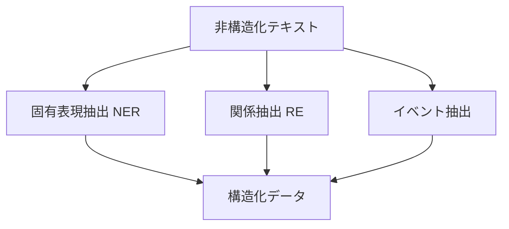
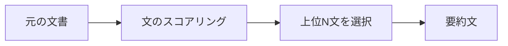
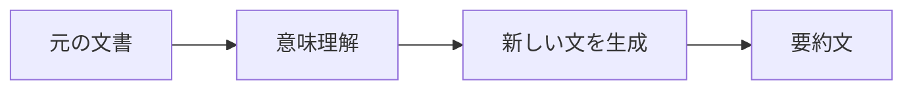
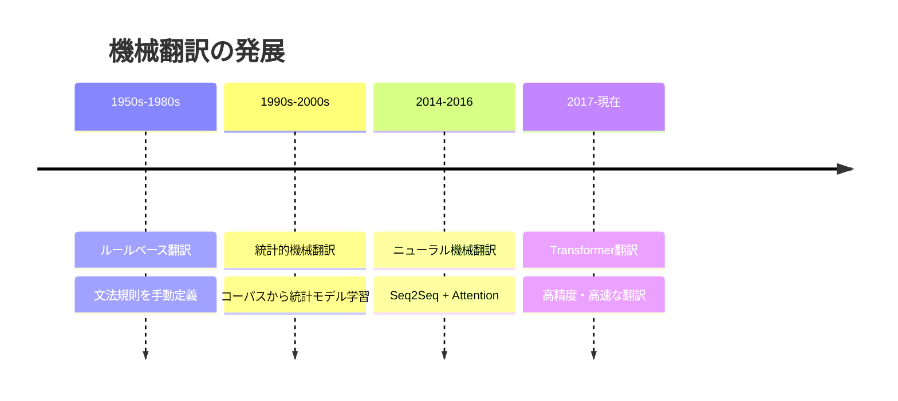
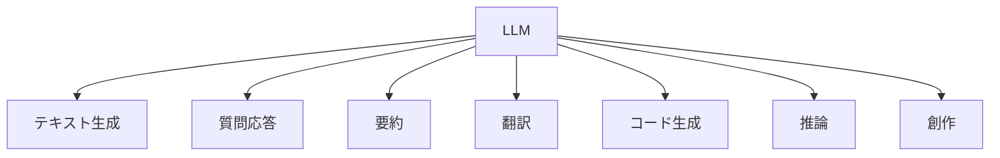
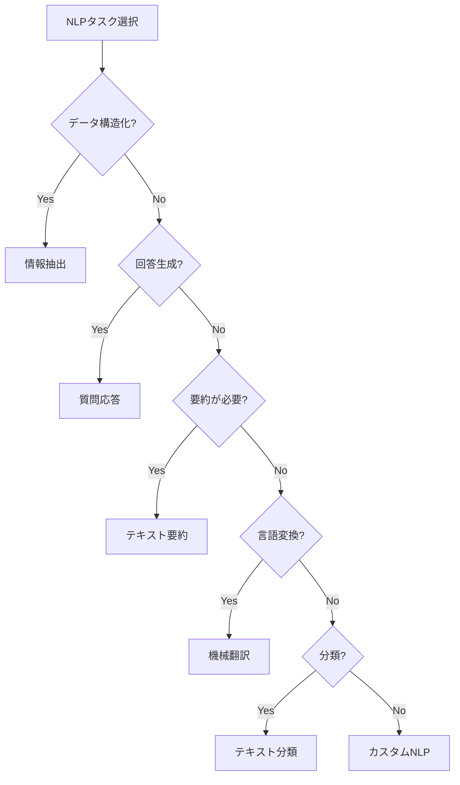
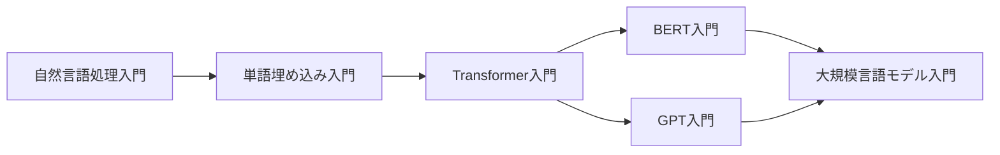

# Chapter 4: 実世界のNLP応用

## 本章の概要

これまで学んだNLP技術が、実際のビジネスや日常生活でどのように活用されているかを学びます。

本章では、情報抽出、質問応答、テキスト要約、機械翻訳などの実用的なNLPタスクと、最新の大規模言語モデル（LLM）の動向を扱います。

### 学習目標

- ✅ 実用的なNLPシステムの仕組みを理解する
- ✅ 各タスクの応用例とビジネス価値を把握する
- ✅ 最新のNLP技術動向（LLM、ChatGPT等）を知る
- ✅ 適切なNLPタスクを選択できるようになる

---

## 1. 情報抽出（Information Extraction）

### 1.1 情報抽出とは

**情報抽出（IE: Information Extraction）** は、非構造化テキストから構造化された情報を自動的に抽出するタスクです。

#### 主なタスク



| タスク | 説明 | 例 |
|-------|------|-----|
| **固有表現抽出 (NER)** | 人名、地名、組織名などを抽出 | "田中太郎さん" → PERSON |
| **関係抽出 (RE)** | エンティティ間の関係を抽出 | "田中太郎は東京大学を卒業" → (田中太郎, 卒業, 東京大学) |
| **イベント抽出** | 出来事とその参加者を抽出 | "Appleが新製品を発表" → (発表, 主体:Apple, 対象:新製品) |

### 1.2 実装: ニュース記事からの情報抽出

```python
import spacy
import re
from typing import List, Dict, Tuple

class NewsInfoExtractor:
    """ニュース記事からの情報抽出システム"""

    def __init__(self, model_name='ja_ginza'):
        """
        Parameters:
        -----------
        model_name : str
            spaCyモデル名（日本語: 'ja_ginza', 英語: 'en_core_web_sm'）
        """
        self.nlp = spacy.load(model_name)

    def extract_named_entities(self, text: str) -> Dict[str, List[str]]:
        """固有表現抽出"""
        doc = self.nlp(text)

        entities = {
            'PERSON': [],      # 人名
            'ORG': [],         # 組織名
            'GPE': [],         # 地名（国・都市）
            'DATE': [],        # 日付
            'MONEY': [],       # 金額
            'PRODUCT': [],     # 製品名
        }

        for ent in doc.ents:
            if ent.label_ in entities:
                # 重複を避ける
                if ent.text not in entities[ent.label_]:
                    entities[ent.label_].append(ent.text)

        return entities

    def extract_relationships(self, text: str) -> List[Tuple[str, str, str]]:
        """関係抽出（主語-述語-目的語）"""
        doc = self.nlp(text)
        relations = []

        for sent in doc.sents:
            # 主語を探す
            subject = None
            verb = None
            obj = None

            for token in sent:
                # 主語（名詞で、主格助詞「が」「は」が付く）
                if token.dep_ in ['nsubj', 'nsubjpass'] and token.pos_ in ['NOUN', 'PROPN']:
                    subject = token.text

                # 述語（動詞）
                if token.pos_ == 'VERB' and token.dep_ == 'ROOT':
                    verb = token.lemma_  # 基本形

                # 目的語（名詞で、対格助詞「を」が付く）
                if token.dep_ == 'obj' and token.pos_ in ['NOUN', 'PROPN']:
                    obj = token.text

            # 主語・述語・目的語が揃った場合
            if subject and verb and obj:
                relations.append((subject, verb, obj))

        return relations

    def extract_dates(self, text: str) -> List[str]:
        """日付表現の抽出"""
        # 日付パターン
        patterns = [
            r'\d{4}年\d{1,2}月\d{1,2}日',
            r'\d{1,2}/\d{1,2}/\d{4}',
            r'\d{4}-\d{2}-\d{2}',
        ]

        dates = []
        for pattern in patterns:
            matches = re.findall(pattern, text)
            dates.extend(matches)

        return dates

    def extract_money(self, text: str) -> List[str]:
        """金額表現の抽出"""
        # 金額パターン
        patterns = [
            r'\d+億円',
            r'\d+万円',
            r'\d+円',
            r'¥\d+',
            r'\$\d+'
        ]

        money = []
        for pattern in patterns:
            matches = re.findall(pattern, text)
            money.extend(matches)

        return money

    def analyze_news(self, text: str) -> Dict:
        """ニュース記事の総合分析"""
        return {
            'entities': self.extract_named_entities(text),
            'relationships': self.extract_relationships(text),
            'dates': self.extract_dates(text),
            'money': self.extract_money(text)
        }

# 使用例
if __name__ == "__main__":
    extractor = NewsInfoExtractor()

    news_text = """
    2025年10月20日、東京で開催された技術カンファレンスにて、
    株式会社テックイノベーションが新型AIチップを発表した。
    同社の田中太郎CEOは、「この製品は業界を変革する」と述べた。
    開発費は約100億円で、来年春に販売開始予定。
    """

    result = extractor.analyze_news(news_text)

    print("【固有表現】")
    for entity_type, entities in result['entities'].items():
        if entities:
            print(f"  {entity_type}: {', '.join(entities)}")

    print("\n【関係】")
    for subj, verb, obj in result['relationships']:
        print(f"  {subj} → {verb} → {obj}")

    print("\n【日付】")
    print(f"  {', '.join(result['dates'])}")

    print("\n【金額】")
    print(f"  {', '.join(result['money'])}")
```

**出力例:**
```
【固有表現】
  ORG: 株式会社テックイノベーション
  PERSON: 田中太郎
  GPE: 東京
  DATE: 2025年10月20日
  PRODUCT: AIチップ

【関係】
  株式会社テックイノベーション → 発表 → AIチップ
  田中太郎 → 述べる → 製品

【日付】
  2025年10月20日

【金額】
  100億円
```

### 1.3 応用例

#### カスタマーサポート自動化

```python
class SupportTicketExtractor:
    """問い合わせチケットからの情報抽出"""

    def __init__(self):
        self.nlp = spacy.load('ja_ginza')

        # 問い合わせカテゴリのキーワード
        self.category_keywords = {
            '配送': ['配送', '届かない', '遅い', '追跡'],
            '返金': ['返金', '返品', 'キャンセル'],
            '不具合': ['壊れた', '動かない', 'エラー', '不良品'],
            '使い方': ['使い方', '設定', '方法', 'やり方']
        }

    def extract_category(self, text: str) -> str:
        """問い合わせカテゴリの推定"""
        text_lower = text.lower()

        scores = {}
        for category, keywords in self.category_keywords.items():
            score = sum(1 for keyword in keywords if keyword in text_lower)
            scores[category] = score

        # 最高スコアのカテゴリを返す
        return max(scores, key=scores.get) if max(scores.values()) > 0 else '一般'

    def extract_product_name(self, text: str) -> str:
        """製品名の抽出"""
        doc = self.nlp(text)
        for ent in doc.ents:
            if ent.label_ == 'PRODUCT':
                return ent.text
        return None

    def analyze_ticket(self, text: str) -> Dict:
        """チケットの分析"""
        return {
            'category': self.extract_category(text),
            'product': self.extract_product_name(text),
            'entities': NewsInfoExtractor().extract_named_entities(text)
        }

# 使用例
extractor = SupportTicketExtractor()
ticket_text = "先週注文したノートPCが届きません。配送状況を教えてください。"

result = extractor.analyze_ticket(ticket_text)
print(f"カテゴリ: {result['category']}")
print(f"製品: {result['product']}")
```

---

## 2. 質問応答システム（Question Answering）

### 2.1 QAシステムの種類

| 種類 | 説明 | 例 |
|------|------|-----|
| **抽出型QA** | 文書から答えを抽出 | "創業者は誰？" → "スティーブ・ジョブズ" |
| **生成型QA** | 答えを生成 | "なぜ人気？" → "デザインが優れているため" |
| **オープンドメインQA** | 幅広い分野の質問 | Google検索のような汎用QA |
| **クローズドドメインQA** | 特定分野に特化 | 社内FAQシステム |

### 2.2 実装: 文書ベースQAシステム

```python
from sklearn.feature_extraction.text import TfidfVectorizer
from sklearn.metrics.pairwise import cosine_similarity
import numpy as np

class DocumentQASystem:
    """文書ベースの質問応答システム"""

    def __init__(self, documents: List[str]):
        """
        Parameters:
        -----------
        documents : List[str]
            知識ベースとなる文書のリスト
        """
        self.documents = documents
        self.vectorizer = TfidfVectorizer()
        self.doc_vectors = self.vectorizer.fit_transform(documents)

    def answer_question(self, question: str, top_k: int = 3) -> List[Tuple[str, float]]:
        """
        質問に対する回答を検索

        Parameters:
        -----------
        question : str
            質問文
        top_k : int
            上位何件を返すか

        Returns:
        --------
        List[Tuple[str, float]]
            (回答文, 類似度スコア) のリスト
        """
        # 質問をベクトル化
        question_vector = self.vectorizer.transform([question])

        # コサイン類似度を計算
        similarities = cosine_similarity(question_vector, self.doc_vectors)[0]

        # 類似度が高い順にソート
        top_indices = np.argsort(similarities)[::-1][:top_k]

        results = [
            (self.documents[idx], similarities[idx])
            for idx in top_indices
        ]

        return results

# 使用例
if __name__ == "__main__":
    # 知識ベース（FAQなど）
    knowledge_base = [
        "営業時間は平日9時から18時までです。",
        "返品は購入後30日以内であれば可能です。",
        "送料は全国一律500円です。5000円以上のご購入で無料になります。",
        "お支払い方法はクレジットカード、銀行振込、代金引換が利用できます。",
        "会員登録するとポイントが貯まり、次回購入時に使用できます。",
        "パスワードを忘れた場合は、ログイン画面の「パスワードを忘れた方」からリセットできます。",
    ]

    qa_system = DocumentQASystem(knowledge_base)

    # 質問
    questions = [
        "送料はいくらですか？",
        "返品できますか？",
        "何時まで営業していますか？"
    ]

    for question in questions:
        print(f"\n質問: {question}")
        answers = qa_system.answer_question(question, top_k=1)

        for answer, score in answers:
            print(f"回答: {answer}")
            print(f"スコア: {score:.4f}")
```

### 2.3 Transformer ベース QA（BERT）

```python
from transformers import pipeline

class BertQASystem:
    """BERTを使った抽出型QAシステム"""

    def __init__(self, model_name='deepset/bert-base-cased-squad2'):
        """
        Parameters:
        -----------
        model_name : str
            使用するBERTモデル
        """
        self.qa_pipeline = pipeline('question-answering', model=model_name)

    def answer(self, question: str, context: str) -> Dict:
        """
        質問に対する回答を抽出

        Parameters:
        -----------
        question : str
            質問文
        context : str
            文脈（答えが含まれる文書）

        Returns:
        --------
        Dict
            answer: 回答, score: 信頼度スコア
        """
        result = self.qa_pipeline({
            'question': question,
            'context': context
        })

        return {
            'answer': result['answer'],
            'score': result['score'],
            'start': result['start'],
            'end': result['end']
        }

# 使用例（英語の例）
if __name__ == "__main__":
    qa = BertQASystem()

    context = """
    Apple Inc. is an American multinational technology company
    headquartered in Cupertino, California. It was founded by
    Steve Jobs, Steve Wozniak, and Ronald Wayne in April 1976.
    """

    question = "Who founded Apple?"

    result = qa.answer(question, context)
    print(f"Question: {question}")
    print(f"Answer: {result['answer']}")
    print(f"Confidence: {result['score']:.4f}")
```

---

## 3. テキスト要約（Text Summarization）

### 3.1 要約の種類

#### 抽出型要約 (Extractive Summarization)

重要な文を抽出して要約を作成



#### 生成型要約 (Abstractive Summarization)

内容を理解して新しい文を生成



### 3.2 実装: 抽出型要約

```python
import numpy as np
from sklearn.feature_extraction.text import TfidfVectorizer
from sklearn.metrics.pairwise import cosine_similarity
import networkx as nx

class ExtractiveSummarizer:
    """抽出型テキスト要約システム"""

    def __init__(self):
        self.vectorizer = TfidfVectorizer()

    def text_rank_summarize(self, text: str, num_sentences: int = 3) -> str:
        """
        TextRankアルゴリズムによる要約

        Parameters:
        -----------
        text : str
            要約対象のテキスト
        num_sentences : int
            抽出する文の数

        Returns:
        --------
        str
            要約文
        """
        # 文に分割
        sentences = [s.strip() for s in text.split('。') if s.strip()]

        if len(sentences) <= num_sentences:
            return text

        # TF-IDFベクトル化
        tfidf_matrix = self.vectorizer.fit_transform(sentences)

        # 文間の類似度行列を計算
        similarity_matrix = cosine_similarity(tfidf_matrix, tfidf_matrix)

        # グラフを構築
        nx_graph = nx.from_numpy_array(similarity_matrix)

        # PageRankスコアを計算
        scores = nx.pagerank(nx_graph)

        # スコア順にソート
        ranked_sentences = sorted(
            ((scores[i], s) for i, s in enumerate(sentences)),
            reverse=True
        )

        # 上位N文を元の順序で抽出
        top_sentences = sorted(
            ranked_sentences[:num_sentences],
            key=lambda x: sentences.index(x[1])
        )

        summary = '。'.join([sentence for _, sentence in top_sentences]) + '。'
        return summary

    def tfidf_summarize(self, text: str, num_sentences: int = 3) -> str:
        """
        TF-IDFスコアによる要約

        Parameters:
        -----------
        text : str
            要約対象のテキスト
        num_sentences : int
            抽出する文の数

        Returns:
        --------
        str
            要約文
        """
        sentences = [s.strip() for s in text.split('。') if s.strip()]

        if len(sentences) <= num_sentences:
            return text

        # TF-IDFベクトル化
        tfidf_matrix = self.vectorizer.fit_transform(sentences)

        # 各文のTF-IDFスコア合計を計算
        sentence_scores = np.array(tfidf_matrix.sum(axis=1)).flatten()

        # スコアが高い順にインデックスを取得
        top_indices = np.argsort(sentence_scores)[::-1][:num_sentences]

        # 元の順序でソート
        top_indices = sorted(top_indices)

        # 要約文を生成
        summary = '。'.join([sentences[i] for i in top_indices]) + '。'
        return summary

# 使用例
if __name__ == "__main__":
    summarizer = ExtractiveSummarizer()

    long_text = """
    自然言語処理（NLP）は、人間が日常的に使う言語をコンピュータで処理する技術です。
    NLPには様々なタスクがあり、機械翻訳、感情分析、質問応答などが含まれます。
    近年、深層学習の発展により、NLPの精度が大きく向上しました。
    特に、Transformerアーキテクチャの登場は革命的でした。
    BERTやGPTといった大規模言語モデルが開発され、多くのタスクで人間に近い性能を実現しています。
    現在では、ChatGPTのような対話型AIが広く利用されています。
    今後もNLP技術の進化は続くと予想されます。
    """

    print("【TextRank要約】")
    summary1 = summarizer.text_rank_summarize(long_text, num_sentences=3)
    print(summary1)

    print("\n【TF-IDF要約】")
    summary2 = summarizer.tfidf_summarize(long_text, num_sentences=3)
    print(summary2)
```

### 3.3 生成型要約（Transformerベース）

```python
from transformers import pipeline

class AbstractiveSummarizer:
    """生成型テキスト要約システム"""

    def __init__(self, model_name='facebook/bart-large-cnn'):
        """
        Parameters:
        -----------
        model_name : str
            使用するモデル名
        """
        self.summarizer = pipeline('summarization', model=model_name)

    def summarize(self, text: str, max_length: int = 130,
                  min_length: int = 30) -> str:
        """
        テキストを要約

        Parameters:
        -----------
        text : str
            要約対象のテキスト
        max_length : int
            要約の最大長
        min_length : int
            要約の最小長

        Returns:
        --------
        str
            要約文
        """
        summary = self.summarizer(
            text,
            max_length=max_length,
            min_length=min_length,
            do_sample=False
        )

        return summary[0]['summary_text']

# 使用例（英語）
if __name__ == "__main__":
    summarizer = AbstractiveSummarizer()

    article = """
    Artificial intelligence (AI) is intelligence demonstrated by machines,
    in contrast to the natural intelligence displayed by humans and animals.
    Leading AI textbooks define the field as the study of "intelligent agents":
    any device that perceives its environment and takes actions that maximize
    its chance of successfully achieving its goals. Colloquially, the term
    "artificial intelligence" is often used to describe machines (or computers)
    that mimic "cognitive" functions that humans associate with the human mind,
    such as "learning" and "problem solving".
    """

    summary = summarizer.summarize(article)
    print("Summary:", summary)
```

---

## 4. 機械翻訳（Machine Translation）

### 4.1 機械翻訳の歴史



### 4.2 実装: Transformer ベース翻訳

```python
from transformers import MarianMTModel, MarianTokenizer

class NeuralTranslator:
    """ニューラル機械翻訳システム"""

    def __init__(self, src_lang: str = 'en', tgt_lang: str = 'ja'):
        """
        Parameters:
        -----------
        src_lang : str
            翻訳元言語コード
        tgt_lang : str
            翻訳先言語コード
        """
        model_name = f'Helsinki-NLP/opus-mt-{src_lang}-{tgt_lang}'

        try:
            self.tokenizer = MarianTokenizer.from_pretrained(model_name)
            self.model = MarianMTModel.from_pretrained(model_name)
        except Exception as e:
            print(f"モデル {model_name} が見つかりません: {e}")
            raise

    def translate(self, text: str) -> str:
        """
        テキストを翻訳

        Parameters:
        -----------
        text : str
            翻訳するテキスト

        Returns:
        --------
        str
            翻訳されたテキスト
        """
        # トークン化
        inputs = self.tokenizer(text, return_tensors='pt', padding=True)

        # 翻訳
        translated = self.model.generate(**inputs)

        # デコード
        translated_text = self.tokenizer.decode(
            translated[0],
            skip_special_tokens=True
        )

        return translated_text

    def batch_translate(self, texts: List[str]) -> List[str]:
        """複数テキストの一括翻訳"""
        inputs = self.tokenizer(texts, return_tensors='pt', padding=True)
        translated = self.model.generate(**inputs)

        return [
            self.tokenizer.decode(t, skip_special_tokens=True)
            for t in translated
        ]

# 使用例
if __name__ == "__main__":
    # 英語→日本語
    translator_en_ja = NeuralTranslator(src_lang='en', tgt_lang='ja')

    english_texts = [
        "Hello, how are you?",
        "Natural language processing is fascinating.",
        "Machine learning has revolutionized AI."
    ]

    print("【英語 → 日本語】")
    for eng, jpn in zip(english_texts, translator_en_ja.batch_translate(english_texts)):
        print(f"{eng} → {jpn}")
```

### 4.3 応用: 多言語対応チャットボット

```python
class MultilingualChatbot:
    """多言語対応チャットボット"""

    def __init__(self):
        # 各言語ペアの翻訳器
        self.translators = {
            ('en', 'ja'): NeuralTranslator('en', 'ja'),
            ('ja', 'en'): NeuralTranslator('ja', 'en'),
        }

        # QAシステム（英語ベース）
        self.qa_system = DocumentQASystem([
            "Our business hours are 9 AM to 6 PM on weekdays.",
            "Returns are possible within 30 days of purchase.",
            "Shipping is 500 yen nationwide. Free for purchases over 5000 yen."
        ])

    def answer_question(self, question: str, lang: str = 'ja') -> str:
        """
        質問に多言語で回答

        Parameters:
        -----------
        question : str
            質問文
        lang : str
            質問の言語コード

        Returns:
        --------
        str
            回答（質問と同じ言語）
        """
        # 日本語の質問を英語に翻訳
        if lang == 'ja':
            question_en = self.translators[('ja', 'en')].translate(question)
        else:
            question_en = question

        # 英語で回答を検索
        answers = self.qa_system.answer_question(question_en, top_k=1)
        answer_en = answers[0][0]

        # 回答を日本語に翻訳
        if lang == 'ja':
            answer_ja = self.translators[('en', 'ja')].translate(answer_en)
            return answer_ja
        else:
            return answer_en

# 使用例
chatbot = MultilingualChatbot()
print(chatbot.answer_question("送料はいくらですか？", lang='ja'))
```

---

## 5. 最新トレンド: 大規模言語モデル（LLM）

### 5.1 LLMとは

**大規模言語モデル（Large Language Model, LLM）** は、膨大なテキストデータで訓練された巨大なニューラルネットワークモデルです。

#### 主なLLM

| モデル | 開発元 | パラメータ数 | 特徴 |
|--------|--------|-------------|------|
| **GPT-4** | OpenAI | 非公開（推定1兆以上） | マルチモーダル、高精度 |
| **Claude** | Anthropic | 非公開 | 長文対応、安全性重視 |
| **Gemini** | Google | 非公開 | マルチモーダル |
| **LLaMA** | Meta | 7B-70B | オープンソース |
| **GPT-3.5** | OpenAI | 175B | ChatGPTのベース |

### 5.2 LLMの能力



#### ゼロショット学習

訓練データなしでタスクを実行

```python
# 例: GPT-3.5を使った感情分析（学習不要）
import openai

def zero_shot_sentiment(text: str) -> str:
    """ゼロショット感情分析"""
    prompt = f"""
    次のテキストの感情を「Positive」「Negative」「Neutral」で分類してください。

    テキスト: {text}
    感情:
    """

    response = openai.ChatCompletion.create(
        model="gpt-3.5-turbo",
        messages=[{"role": "user", "content": prompt}]
    )

    return response.choices[0].message.content.strip()
```

#### Few-Shot学習

少数の例から学習

```python
def few_shot_classification(text: str) -> str:
    """Few-Shot分類"""
    prompt = f"""
    以下の例を参考に、テキストをカテゴリ分類してください。

    例1:
    テキスト: 商品が届きません
    カテゴリ: 配送

    例2:
    テキスト: 返金してください
    カテゴリ: 返金

    例3:
    テキスト: 使い方がわかりません
    カテゴリ: 使い方

    新しいテキスト:
    テキスト: {text}
    カテゴリ:
    """

    response = openai.ChatCompletion.create(
        model="gpt-3.5-turbo",
        messages=[{"role": "user", "content": prompt}]
    )

    return response.choices[0].message.content.strip()
```

### 5.3 プロンプトエンジニアリング

LLMから最良の結果を得るための技術

#### 基本原則

1. **明確な指示**: 曖昧さを避ける
2. **文脈の提供**: 必要な背景情報を含める
3. **出力形式の指定**: JSON、箇条書きなど
4. **制約の設定**: 文字数制限、トーン指定

#### 実践例

```python
class PromptEngineer:
    """プロンプトエンジニアリングのベストプラクティス"""

    @staticmethod
    def create_structured_prompt(task: str, context: str,
                                 format: str, constraints: List[str]) -> str:
        """
        構造化されたプロンプトを作成

        Parameters:
        -----------
        task : str
            タスクの説明
        context : str
            文脈情報
        format : str
            出力形式
        constraints : List[str]
            制約条件

        Returns:
        --------
        str
            完成したプロンプト
        """
        prompt = f"""
## タスク
{task}

## 文脈
{context}

## 出力形式
{format}

## 制約条件
"""
        for i, constraint in enumerate(constraints, 1):
            prompt += f"{i}. {constraint}\n"

        return prompt

# 使用例
prompt = PromptEngineer.create_structured_prompt(
    task="製品レビューを分析し、改善点を提案してください",
    context="最新のスマートフォンに関する100件のレビュー",
    format="JSON形式で、カテゴリごとに改善点をリスト化",
    constraints=[
        "最大5つの改善点",
        "具体的で実行可能な提案",
        "肯定的なフィードバックも含める"
    ]
)

print(prompt)
```

### 5.4 RAG (Retrieval-Augmented Generation)

外部知識を活用してLLMの回答精度を向上

```python
from typing import List
import numpy as np
from sklearn.feature_extraction.text import TfidfVectorizer
from sklearn.metrics.pairwise import cosine_similarity

class RAGSystem:
    """RAG（検索拡張生成）システム"""

    def __init__(self, knowledge_base: List[str]):
        """
        Parameters:
        -----------
        knowledge_base : List[str]
            知識ベース（文書のリスト）
        """
        self.knowledge_base = knowledge_base
        self.vectorizer = TfidfVectorizer()
        self.doc_vectors = self.vectorizer.fit_transform(knowledge_base)

    def retrieve_relevant_docs(self, query: str, top_k: int = 3) -> List[str]:
        """
        クエリに関連する文書を検索

        Parameters:
        -----------
        query : str
            検索クエリ
        top_k : int
            取得する文書数

        Returns:
        --------
        List[str]
            関連文書のリスト
        """
        query_vector = self.vectorizer.transform([query])
        similarities = cosine_similarity(query_vector, self.doc_vectors)[0]

        top_indices = np.argsort(similarities)[::-1][:top_k]
        return [self.knowledge_base[i] for i in top_indices]

    def generate_answer(self, question: str) -> str:
        """
        RAGによる回答生成

        Parameters:
        -----------
        question : str
            質問

        Returns:
        --------
        str
            生成された回答
        """
        # 1. 関連文書を検索
        relevant_docs = self.retrieve_relevant_docs(question)

        # 2. 文脈を構築
        context = "\n".join(relevant_docs)

        # 3. LLMに質問と文脈を渡して回答生成
        prompt = f"""
以下の文脈を参考に、質問に答えてください。

【文脈】
{context}

【質問】
{question}

【回答】
"""

        # 実際にはここでLLM APIを呼び出す
        # response = openai.ChatCompletion.create(...)
        # return response.choices[0].message.content

        # デモ用の簡易実装
        return f"文脈に基づく回答（実際にはLLMが生成）\n関連情報: {relevant_docs[0][:100]}..."

# 使用例
knowledge_base = [
    "当社は1980年に東京で創業しました。",
    "主力製品は産業用ロボットです。",
    "従業員数は約5000人で、世界20カ国に拠点があります。",
    "年間売上高は約1000億円です。",
    "研究開発に売上の15%を投資しています。"
]

rag = RAGSystem(knowledge_base)
answer = rag.generate_answer("会社の創業年と場所を教えてください")
print(answer)
```

---

## 6. NLPの選択ガイド

### 6.1 タスク別の選択フローチャート



### 6.2 ビジネス応用マトリクス

| ビジネス課題 | 推奨NLPタスク | 期待効果 |
|-------------|-------------|---------|
| 顧客の声の分析 | 感情分析 + 情報抽出 | 満足度向上 |
| サポート自動化 | 質問応答 + 分類 | コスト削減 |
| 文書管理 | 要約 + 分類 | 業務効率化 |
| グローバル展開 | 機械翻訳 | 市場拡大 |
| 意思決定支援 | 情報抽出 + 要約 | 迅速な判断 |

---

## 7. まとめ

### 7.1 本シリーズで学んだこと

#### Chapter 1: NLPの基礎
- NLPの定義と主要タスク
- 歴史的発展（ルールベース→統計→深層学習）
- 日本語NLPの特徴

#### Chapter 2: 形態素解析・構文解析
- トークナイゼーション
- 形態素解析（MeCab, Janome）
- 構文解析と依存関係
- 固有表現抽出（NER）

#### Chapter 3: テキスト分類
- テキスト前処理パイプライン
- 特徴量抽出（BoW, TF-IDF）
- 機械学習モデル（Naive Bayes, SVM）
- モデル評価手法

#### Chapter 4: 実世界の応用
- 情報抽出システム
- 質問応答システム
- テキスト要約
- 機械翻訳
- 最新トレンド（LLM, RAG）

### 7.2 次のステップ

本シリーズでNLPの基礎を学びました。さらに深めるには：

#### 発展的なトピック

1. **深層学習NLP**
   - LSTM, GRU（再帰型ニューラルネットワーク）
   - Transformer詳細
   - BERT, GPTの内部構造

2. **実践的なスキル**
   - 大規模データセットの扱い
   - モデルのデプロイ（Web API化）
   - パフォーマンスチューニング

3. **専門分野**
   - ドメイン固有NLP（医療、法律、金融）
   - マルチモーダルAI（テキスト+画像）
   - 会話AI・対話システム

#### 推奨学習パス



### 7.3 実践プロジェクトのアイデア

1. **感情分析ダッシュボード**
   - Twitter APIで特定トピックのツイートを収集
   - 感情分析を実行
   - 時系列で可視化

2. **社内FAQ自動応答システム**
   - 過去の問い合わせデータを学習
   - QAシステムで自動回答
   - 精度を継続的に改善

3. **ニュース要約アプリ**
   - RSSフィードからニュース取得
   - 自動要約
   - カテゴリ分類とレコメンド

4. **多言語チャットボット**
   - 機械翻訳を活用
   - 複数言語で対応
   - RAGで知識ベース活用

---

## 8. 練習問題

### 問題1: 情報抽出（基礎）

次のニュース記事から、人名、組織名、日付を抽出してください。

```python
news = """
2025年11月1日、トヨタ自動車の豊田章男社長が新型電気自動車を発表した。
この発表は東京モーターショーで行われ、200名以上の報道関係者が参加した。
"""

# あなたの実装
```

<details>
<summary>解答例</summary>

```python
import spacy

nlp = spacy.load('ja_ginza')
doc = nlp(news)

entities = {
    'PERSON': [],
    'ORG': [],
    'DATE': []
}

for ent in doc.ents:
    if ent.label_ in entities:
        entities[ent.label_].append(ent.text)

print("人名:", entities['PERSON'])
print("組織名:", entities['ORG'])
print("日付:", entities['DATE'])
```

</details>

### 問題2: テキスト要約（中級）

次の長文を3文に要約してください（抽出型要約）。

```python
article = """
人工知能の発展は目覚ましく、様々な分野で活用されています。
特に自然言語処理の分野では、大規模言語モデルが登場し、
人間と同等以上の性能を発揮するようになりました。
機械翻訳の精度も大きく向上し、実用レベルに達しています。
また、チャットボットやバーチャルアシスタントも普及しています。
今後もAI技術の進化は続くと予想されます。
医療、教育、ビジネスなど、あらゆる分野でAIが活用されるでしょう。
"""

# あなたの実装
```

<details>
<summary>解答例</summary>

```python
from sklearn.feature_extraction.text import TfidfVectorizer
import numpy as np

# 文に分割
sentences = [s.strip() for s in article.split('。') if s.strip()]

# TF-IDFベクトル化
vectorizer = TfidfVectorizer()
tfidf_matrix = vectorizer.fit_transform(sentences)

# 各文のスコアを計算
scores = np.array(tfidf_matrix.sum(axis=1)).flatten()

# 上位3文を抽出
top_indices = np.argsort(scores)[::-1][:3]
top_indices = sorted(top_indices)

summary = '。'.join([sentences[i] for i in top_indices]) + '。'
print("要約:", summary)
```

</details>

### 問題3: RAGシステム（応用）

知識ベースを使って質問に答えるRAGシステムを実装してください。

**仕様:**
- 知識ベース: 会社情報の文書リスト
- 入力: 質問文
- 出力: 関連文書 + 回答

<details>
<summary>解答例</summary>

```python
from sklearn.feature_extraction.text import TfidfVectorizer
from sklearn.metrics.pairwise import cosine_similarity
import numpy as np

class SimpleRAG:
    def __init__(self, knowledge_base):
        self.kb = knowledge_base
        self.vectorizer = TfidfVectorizer()
        self.doc_vectors = self.vectorizer.fit_transform(knowledge_base)

    def answer(self, question, top_k=2):
        # 質問をベクトル化
        q_vector = self.vectorizer.transform([question])

        # 類似度計算
        similarities = cosine_similarity(q_vector, self.doc_vectors)[0]

        # 上位k件を取得
        top_indices = np.argsort(similarities)[::-1][:top_k]

        results = [(self.kb[i], similarities[i]) for i in top_indices]
        return results

# 知識ベース
kb = [
    "当社は2000年に設立されました",
    "主力製品はAIソフトウェアです",
    "従業員数は300名です",
    "本社は東京にあります"
]

rag = SimpleRAG(kb)
results = rag.answer("会社の設立年は？")

for doc, score in results:
    print(f"関連文書: {doc} (スコア: {score:.4f})")
```

</details>

---

## 9. 参考文献とリソース

### 書籍
1. 「自然言語処理の基礎」奥村学（コロナ社）
2. 「ゼロから作るDeep Learning ❷」斎藤康毅（オライリー・ジャパン）
3. 「Large Language Models」Jurafsky & Martin

### オンラインコース
- [Stanford CS224N: NLP with Deep Learning](http://web.stanford.edu/class/cs224n/)
- [Hugging Face Course](https://huggingface.co/course/)
- [fast.ai NLP Course](https://www.fast.ai/)

### ライブラリ・ツール
- [Hugging Face Transformers](https://huggingface.co/transformers/) - 最新のNLPモデル
- [spaCy](https://spacy.io/) - 産業用NLP
- [NLTK](https://www.nltk.org/) - 教育用NLP
- [Gensim](https://radimrehurek.com/gensim/) - トピックモデリング

### 最新動向
- [Papers with Code - NLP](https://paperswithcode.com/area/natural-language-processing)
- [ACL Anthology](https://aclanthology.org/) - NLP論文アーカイブ
- [arXiv cs.CL](https://arxiv.org/list/cs.CL/recent) - 最新論文

---

## 10. おわりに

自然言語処理は、AI技術の中でも特に急速に発展している分野です。本シリーズで学んだ基礎知識を土台に、ぜひ実際のプロジェクトに挑戦してください。

### さらなる学習のために

1. **実データで実験**: Kaggleのコンペティションに参加
2. **最新論文を読む**: arXivで最新研究をフォロー
3. **コミュニティ参加**: GitHub、Stack Overflow、勉強会
4. **自分のプロジェクト**: 興味のある分野でNLPアプリを開発

### 継続的な学習

NLPは進化が速い分野です。以下を定期的にチェックしましょう：

- ✅ 主要カンファレンス（ACL, EMNLP, NAACL）の論文
- ✅ OpenAI, Google AI, Meta AIのブログ
- ✅ Hugging Faceの最新モデル
- ✅ NLP系YouTubeチャンネル

---

**本シリーズを最後までお読みいただき、ありがとうございました！**

**前へ**: [← Chapter 3: 実践 - テキスト分類](chapter-3.html)

**目次へ**: [↑ シリーズ目次](index.html)

---

## フィードバックをお待ちしています

このシリーズの改善にご協力ください：

- **誤りを発見**: [GitHubでIssueを開く](https://github.com/YusukeHashimotoLab/AI-Knowledge-Notes/issues)
- **改善提案**: より良い説明方法のアイデア
- **質問**: 理解が難しかった部分

詳細は[CONTRIBUTING.md](../../../CONTRIBUTING.md)をご覧ください。
