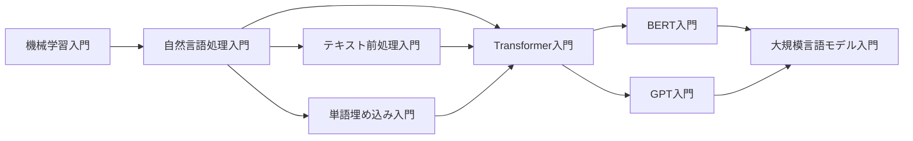

# 自然言語処理入門

## シリーズ概要

自然言語処理（Natural Language Processing, NLP）は、人間が日常的に使用する言語をコンピュータで処理・理解するための技術です。このシリーズでは、NLPの基礎理論から実践的な応用まで、体系的に学習します。

### なぜNLPを学ぶのか？

現代社会では、SNS、ニュース記事、企業の文書など、膨大なテキストデータが日々生成されています。NLPを習得することで：

- **テキストデータの自動分析**が可能になります
- **感情分析・トピック抽出**などのビジネス応用ができます
- **機械翻訳・チャットボット**などの先進的なシステムを構築できます
- **大規模言語モデル（LLM）**の基礎を理解できます

### 学習の流れ

本シリーズは4つの章で構成されています：

## 📚 章立て

### [Chapter 1: NLPの基礎と歴史](chapter-1.html)
**学習時間: 25-30分 | 難易度: ★☆☆**

NLPの歴史的発展と基本概念を学びます。

**主なトピック:**
- NLPとは何か
- NLPの歴史（ルールベース → 統計的手法 → 深層学習）
- NLPの主要タスク
- 日本語と英語の違い

**学習目標:**
- NLPの全体像を理解する
- 主要なNLPタスクを説明できる
- ルールベース・統計的・深層学習アプローチの違いを理解する

---

### [Chapter 2: 形態素解析・構文解析](chapter-2.html)
**学習時間: 30-35分 | 難易度: ★★☆**

テキストを言語学的に分析する基本技術を学びます。

**主なトピック:**
- トークナイゼーション
- 形態素解析（MeCab, Janome）
- 品詞タグ付け
- 構文解析と依存関係
- 固有表現抽出（NER）

**学習目標:**
- 形態素解析の仕組みを理解する
- 日本語形態素解析ツールを使いこなす
- 構文木と依存関係を読み取れる

**実装ライブラリ:**
```python
import MeCab
import janome
import spaCy
import ginza
```

---

### [Chapter 3: 実践 - テキスト分類](chapter-3.html)
**学習時間: 35-40分 | 難易度: ★★☆**

実際にテキスト分類モデルを構築します。

**主なトピック:**
- テキスト前処理パイプライン
- 特徴量抽出（Bag-of-Words, TF-IDF）
- 機械学習による分類（Naive Bayes, SVM）
- 深層学習による分類
- モデル評価

**学習目標:**
- テキスト前処理の実装ができる
- TF-IDFベクトル化を実装できる
- テキスト分類器を構築・評価できる

**ハンズオン例:**
- 感情分析（Positive/Negative分類）
- スパムフィルタ
- ニュース記事のカテゴリ分類

---

### [Chapter 4: 実世界のNLP応用](chapter-4.html)
**学習時間: 25-30分 | 難易度: ★★☆**

NLPの実践的な応用例と最新動向を学びます。

**主なトピック:**
- 情報抽出システム
- 質問応答システム
- テキスト要約
- 機械翻訳の基礎
- 最新トレンド（LLM, ChatGPT等）

**学習目標:**
- NLPの実用例を理解する
- 適切なNLPタスクを選択できる
- 最新のNLP技術動向を把握する

**実例:**
- カスタマーサポート自動化
- 文書検索エンジン
- ソーシャルメディア分析

---

## 🎯 このシリーズで習得できるスキル

### 理論面
- ✅ NLPの基本概念と用語
- ✅ 言語処理の階層構造（形態素 → 構文 → 意味）
- ✅ 統計的自然言語処理の基礎
- ✅ 機械学習とNLPの関係

### 実践面
- ✅ Python NLPライブラリの使用
- ✅ テキスト前処理パイプラインの構築
- ✅ テキスト分類モデルの実装
- ✅ NLPシステムの評価方法

### ツール・ライブラリ
```python
# 日本語NLP
MeCab, Janome, SudachiPy, Ginza

# 汎用NLP
NLTK, spaCy, Gensim

# 機械学習
scikit-learn, TensorFlow, PyTorch

# データ処理
pandas, numpy, regex
```

---

## 📋 前提知識

### 必須
- **Python基礎**: 変数、関数、クラス、リスト操作
- **基本的な数学**: 確率、統計の基礎概念

### 推奨（あると理解が深まる）
- 機械学習の基礎（線形回帰、分類問題）
- 簡単な言語学の知識（品詞、構文など）

### 不要
- 深層学習の知識（Chapter 3で簡単に扱います）
- 高度な数学（微分積分など）

---

## 🛣️ 学習パス

### このシリーズの位置づけ



### 推奨学習順序

1. **まずこのシリーズ**: 自然言語処理入門（全体像を把握）
2. **次に**: テキスト前処理入門（実践的なスキル）
3. **その後**: 単語埋め込み入門（分散表現の理解）
4. **さらに**: Transformer入門（現代NLPの基盤）

---

## 🔗 関連シリーズ

### 基礎を固める
- [機械学習入門](../../ml-introduction/) - ML全般の基礎
- [データ前処理入門](../../data-preprocessing-introduction/) - データ処理技術

### NLPを深める
- [テキスト前処理入門](../text-preprocessing-introduction/) - 前処理の詳細
- [単語埋め込み入門](../word-embedding-introduction/) - Word2Vec, GloVe
- [Transformer入門](../transformer-introduction/) - 注意機構

### 応用分野
- [感情分析入門](../sentiment-analysis-introduction/) - 感情分析特化
- [情報抽出入門](../information-extraction-introduction/) - NER等
- [機械翻訳入門](../machine-translation-introduction/) - 翻訳システム

---

## 💡 効果的な学習方法

### 1. 順番に進める
各章は前章の内容を前提としています。Chapter 1から順番に学習してください。

### 2. コードを実際に動かす
読むだけでなく、必ずコード例を実行してください。Google Colabを使えば環境構築不要で始められます。

### 3. 自分のデータで試す
ハンズオン例を自分が興味のあるデータ（ツイート、レビュー等）で試してみてください。

### 4. 小さなプロジェクトを作る
学習した内容を使って、簡単なNLPアプリケーション（感情分析ツールなど）を作ってみましょう。

---

## 🤝 コミュニティとサポート

### フィードバックをお待ちしています

- **誤りを発見**: [GitHubでIssueを開く](https://github.com/YusukeHashimotoLab/AI-Knowledge-Notes/issues)
- **改善提案**: より良い説明方法のアイデア
- **質問**: 理解が難しかった部分

### コントリビューション

このシリーズの改善にご協力ください：
- コード例の追加
- 誤字・脱字の修正
- 追加説明の提案

詳細は[CONTRIBUTING.md](../../../CONTRIBUTING.md)をご覧ください。

---

## 📚 推奨参考書

### 日本語
- 「自然言語処理の基礎」奥村学
- 「入門 自然言語処理」Steven Bird他（オライリー）
- 「ゼロから作るDeep Learning ❷」斎藤康毅

### 英語
- "Speech and Language Processing" by Jurafsky & Martin
- "Natural Language Processing with Python" (NLTK Book)
- "Natural Language Processing in Action"

### オンラインリソース
- [Stanford CS224N: NLP with Deep Learning](http://web.stanford.edu/class/cs224n/)
- [Hugging Face Course](https://huggingface.co/course/)
- [spaCy公式ドキュメント](https://spacy.io/)

---

## ⚠️ AI生成コンテンツについて

このシリーズはAI（Claude 3.5 Sonnet）の支援により作成されています。

**品質保証:**
- 専門家によるレビュー実施
- コード例は実行確認済み
- 参考文献で内容を検証

**フィードバックのお願い:**
技術的な誤りを発見した場合は、[こちら](https://github.com/YusukeHashimotoLab/AI-Knowledge-Notes/issues/new)からご報告ください。

---

## 📅 更新履歴

- **2025-10-20**: 初版公開（v1.0）

---

## 🚀 さあ、始めましょう！

準備ができたら、[Chapter 1: NLPの基礎と歴史](chapter-1.html)から学習を開始してください。

---

**次へ**: [Chapter 1: NLPの基礎と歴史 →](chapter-1.html)
