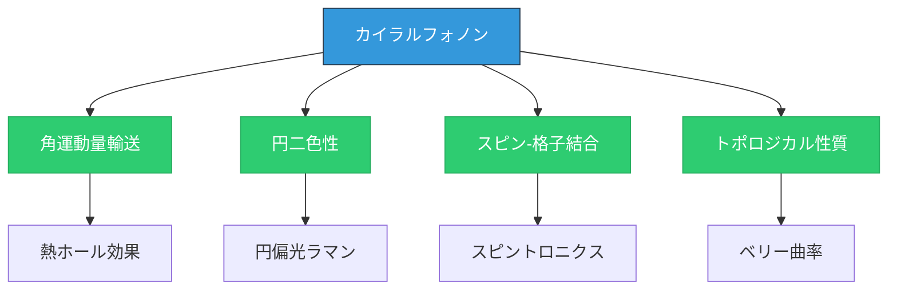
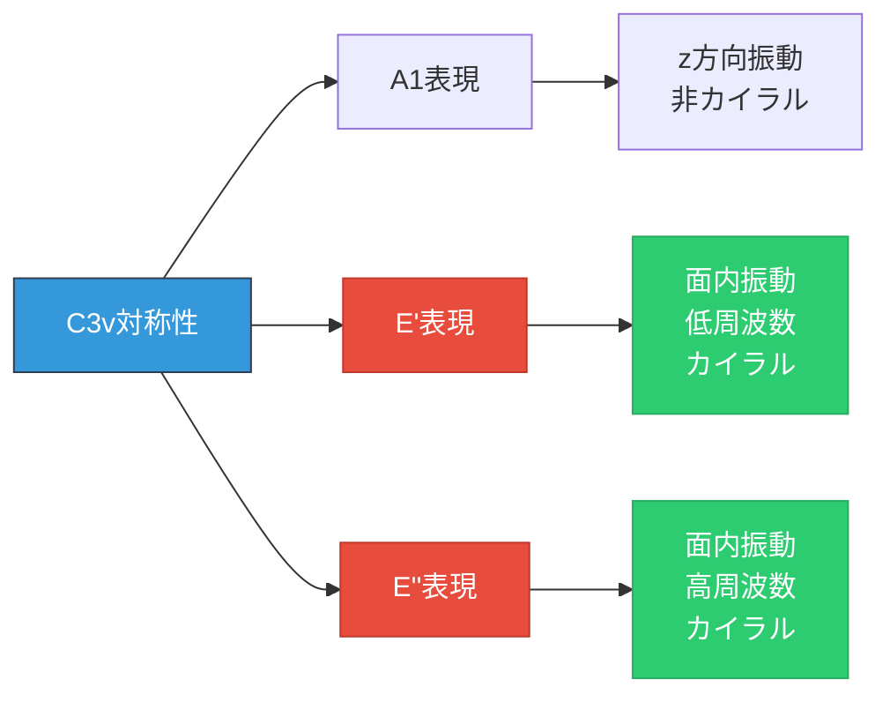
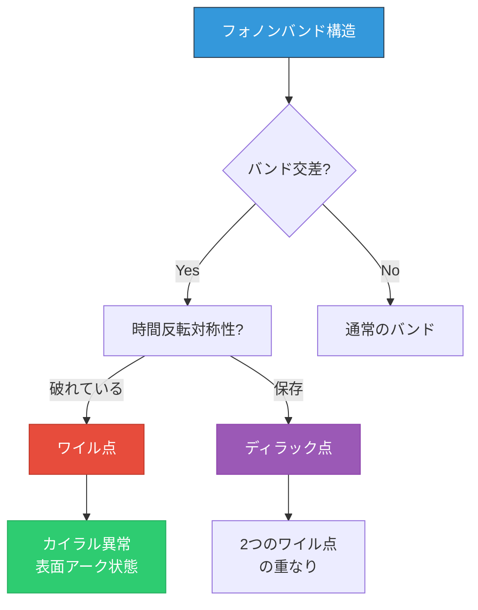

[🌐 EN](../../../en/MS/chiral-phonons/chapter-1.md) | 🇯🇵 JP | Last sync: 2025-12-19

# 第1章: カイラルフォノンの理論的基礎

[材料科学道場](../index.html) > [カイラルフォノン](index.md) > 第1章

---

## 学習目標

- カイラルフォノンの歴史的背景と物理的意義を理解する
- フォノン角運動量（PAM）の定義と量子化を習得する
- 対称性要件とカイラルフォノンの関係を説明できる
- ベリー位相とトポロジカル性質の基礎を学ぶ
- 群論による選択則の導出方法を理解する
- Pythonでフォノン角運動量を計算できる

---

## 目次

1. [カイラルフォノンの導入と歴史的背景](#11-カイラルフォノンの導入と歴史的背景)
2. [フォノン角運動量（PAM）の定義](#12-フォノン角運動量pamの定義)
3. [対称性要件とカイラル性](#13-対称性要件とカイラル性)
4. [ベリー位相とトポロジカル性質](#14-ベリー位相とトポロジカル性質)
5. [群論による選択則](#15-群論による選択則)
6. [フォノン円偏光の数学的定式化](#16-フォノン円偏光の数学的定式化)
7. [実装: PAM計算プログラム](#17-実装-pam計算プログラム)
8. [演習問題](#演習問題)

---

## 1.1 カイラルフォノンの導入と歴史的背景

### カイラルフォノンとは

**カイラルフォノン（chiral phonon）**は、格子振動が特定の回転方向を持つフォノンモードです。電磁波の円偏光に類似して、フォノンも左回り（L: left-handed）または右回り（R: right-handed）の角運動量を持つことができます。

> **キラリティの定義**
>
> キラリティ（chirality）とは、物体がその鏡像と重ね合わせることができない性質です。カイラルフォノンは、**空間反転対称性が破れた系**で現れ、時計回り・反時計回りの区別が物理的に意味を持ちます。

### 歴史的発展

カイラルフォノンの理論は以下のように発展してきました：

**2015**
- **Zhang & Niu**が*Physical Review Letters*で「Chiral Phonons at High-Symmetry Points in Monolayer Hexagonal Lattices」を発表。単層六方格子におけるカイラルフォノンの理論的枠組みを確立。

**2016-2018**
- グラフェン、TMDCs（遷移金属ダイカルコゲナイド）でのラマン分光実験による検証。円偏光ラマン測定でカイラル選択則を確認。

**2019-現在**
- バルク材料（AlAs, GaAs）、ペロブスカイト、トポロジカル材料への展開。角運動量-電荷変換、フォノンホール効果などの応用研究。

### 物理的重要性

カイラルフォノン研究の重要性は以下の点にあります：

- **角運動量輸送**: 熱流に伴う角運動量の輸送が可能
- **円二色性**: 光学的活性と円偏光選択則の起源
- **スピン-格子結合**: 電子スピンとの相互作用（スピントロニクス応用）
- **トポロジカル物性**: ベリー曲率に基づく幾何学的性質
- **量子情報**: フォノン量子状態の制御手段



---

## 1.2 フォノン角運動量（PAM）の定義

### 古典的定義

フォノン角運動量（Phonon Angular Momentum, PAM）は、格子振動における各原子の軌道角運動量の総和として定義されます：

\\[
\mathbf{L} = \sum_{i} m_i (\mathbf{u}_i \times \dot{\mathbf{u}}_i)
\\]

ここで：
- \\( m_i \\): 原子 \\( i \\) の質量
- \\( \mathbf{u}_i \\): 原子 \\( i \\) の変位ベクトル
- \\( \dot{\mathbf{u}}_i \\): 原子 \\( i \\) の速度ベクトル

### 調和振動子展開

調和近似では、変位ベクトルを正規モード展開します：

\\[
\mathbf{u}_i = \sum_{\lambda} \frac{1}{\sqrt{2m_i\omega_\lambda}}
\left( a_\lambda \mathbf{e}_{i\lambda} e^{i\mathbf{q}\cdot\mathbf{R}_i} + a_\lambda^\dagger \mathbf{e}_{i\lambda}^* e^{-i\mathbf{q}\cdot\mathbf{R}_i} \right)
\\]

ここで：
- \\( \lambda \\): フォノンモード（波数 \\(\mathbf{q}\\) とバンド指数）
- \\( \omega_\lambda \\): フォノン角周波数
- \\( a_\lambda, a_\lambda^\dagger \\): 生成・消滅演算子
- \\( \mathbf{e}_{i\lambda} \\): 固有ベクトル（偏極ベクトル）

### 量子化されたPAM

時間微分を考慮すると、角運動量の \\( z \\) 成分は：

\\[
L_z = \sum_{\lambda} \hbar \sigma_\lambda \left( a_\lambda^\dagger a_\lambda + \frac{1}{2} \right)
\\]

ここで \\( \sigma_\lambda \\) は**カイラル偏極度（chiral polarization）**：

\\[
\sigma_\lambda = -i \sum_{i} \left( \mathbf{e}_{i\lambda}^* \times \mathbf{e}_{i\lambda} \right) \cdot \hat{\mathbf{z}}
\\]

> **重要な性質**
>
> - \\( \sigma_\lambda = +1 \\): 左回り（L）フォノン
> - \\( \sigma_\lambda = -1 \\): 右回り（R）フォノン
> - \\( \sigma_\lambda = 0 \\): 線偏光（非カイラル）
>
> カイラル偏極度は固有ベクトル \\(\mathbf{e}_{i\lambda}\\) のみで決まる幾何学的性質です。

### 円偏光基底

2次元系（xy平面）では、円偏光基底が有用です：

\\[
\mathbf{e}_L = \frac{1}{\sqrt{2}} (\hat{\mathbf{x}} + i\hat{\mathbf{y}}), \quad
\mathbf{e}_R = \frac{1}{\sqrt{2}} (\hat{\mathbf{x}} - i\hat{\mathbf{y}})
\\]

線形基底 \\((\hat{\mathbf{x}}, \hat{\mathbf{y}})\\) と円偏光基底 \\((\mathbf{e}_L, \mathbf{e}_R)\\) の関係：

\\[
\begin{pmatrix} \mathbf{e}_L \\\\ \mathbf{e}_R \end{pmatrix} =
\frac{1}{\sqrt{2}} \begin{pmatrix} 1 & i \\\\ 1 & -i \end{pmatrix}
\begin{pmatrix} \hat{\mathbf{x}} \\\\ \hat{\mathbf{y}} \end{pmatrix}
\\]

### 具体例: 単純2原子系

質量 \\( m \\) の2つの原子が円運動する場合を考えます：

\\[
\mathbf{u}_1(t) = A (\cos\omega t, \sin\omega t, 0), \quad
\mathbf{u}_2(t) = A (-\cos\omega t, -\sin\omega t, 0)
\\]

このとき、各原子の角運動量は：

\\[
\mathbf{L}_1 = m A^2 \omega \hat{\mathbf{z}}, \quad
\mathbf{L}_2 = m A^2 \omega \hat{\mathbf{z}}
\\]

全角運動量：

\\[
\mathbf{L}_{\text{total}} = 2 m A^2 \omega \hat{\mathbf{z}} \neq 0
\\]

この例は、2つの原子が反対方向に動いても、**同じ回転方向**であれば角運動量が打ち消されないことを示しています。

---

## 1.3 対称性要件とカイラル性

### 空間反転対称性

カイラルフォノンが存在するための**必要条件**は、**空間反転対称性の破れ**です。

> **空間反転（Inversion）操作**
>
> 空間反転 \\(\mathcal{I}\\) は座標を \\(\mathbf{r} \to -\mathbf{r}\\) に変換します。角運動量 \\(\mathbf{L} = \mathbf{r} \times \mathbf{p}\\) は擬ベクトル（pseudovector）なので：
>
> \\[
> \mathcal{I}\mathbf{L} = (-\mathbf{r}) \times (-\mathbf{p}) = \mathbf{L}
> \\]
>
> 空間反転対称性がある系では、\\(\mathbf{L}\\) と \\(-\mathbf{L}\\) が縮退し、カイラル性が定義できません。

### 時間反転対称性

時間反転 \\(\mathcal{T}\\) の下で：

\\[
\mathcal{T}\mathbf{u}(\mathbf{r}, t) = \mathbf{u}(\mathbf{r}, -t), \quad
\mathcal{T}\mathbf{L} = -\mathbf{L}
\\]

時間反転対称性がある系では、左回りと右回りのフォノンがエネルギー縮退します（Kramers縮退）。しかし、**カイラル性は依然として定義可能**です。これは電磁波の円偏光と同様です。

### カイラルフォノンを支持する結晶構造

空間反転対称性が破れている主な結晶クラス：

| 結晶系 | 点群 | 代表例 | カイラル性 |
|--------|------|--------|-----------|
| 六方晶 | C₃ᵥ | MoS₂, WSe₂ | 面内カイラル |
| 六方晶 | C₆ᵥ | グラフェン（単層） | K/K'点でカイラル |
| 立方晶 | Tₐ | GaAs, ZnS | 3回回転軸方向 |
| 正方晶 | C₄ᵥ | SrTiO₃ (歪) | c軸方向 |
| 三方晶 | D₃ | α-SiO₂ | c軸カイラル |

### 対称性と選択則

点群の既約表現により、どのフォノンモードがカイラルになるかが決まります。例えば、C₃ᵥ対称性を持つ単層TMDCsでは：

\\[
\Gamma = A_1 \oplus E' \oplus E''
\\]

- \\( A_1 \\): z方向振動（非カイラル）
- \\( E' \\): 面内振動（カイラル可能、低周波数）
- \\( E'' \\): 面内振動（カイラル可能、高周波数）



### 対称性破れの起源

実験的に空間反転対称性を破る方法：

1. **材料選択**: 本質的に非対称な結晶構造（TMDCs, ペロブスカイトABOH₃）
2. **基板効果**: 単層材料を基板上に配置（グラフェン/SiC）
3. **電場印加**: 外部電場による対称性破れ
4. **歪み**: 機械的歪みによる構造変化
5. **積層**: 異種材料のvan der Waals積層

---

## 1.4 ベリー位相とトポロジカル性質

### ベリー接続とベリー曲率

フォノン固有状態 \\(|\lambda(\mathbf{q})\rangle\\) のパラメータ（波数 \\(\mathbf{q}\\)）依存性から、**ベリー接続（Berry connection）**が定義されます：

\\[
\mathbf{A}_\lambda(\mathbf{q}) = i \langle \lambda(\mathbf{q}) | \nabla_\mathbf{q} | \lambda(\mathbf{q}) \rangle
\\]

**ベリー曲率（Berry curvature）**は：

\\[
\boldsymbol{\Omega}_\lambda(\mathbf{q}) = \nabla_\mathbf{q} \times \mathbf{A}_\lambda(\mathbf{q})
\\]

または、直接計算では：

\\[
\Omega_\lambda^{ab}(\mathbf{q}) = \sum_{\mu \neq \lambda}
\frac{2\text{Im}\langle \lambda | \partial_{q_a} H | \mu \rangle \langle \mu | \partial_{q_b} H | \lambda \rangle}
{(\omega_\lambda - \omega_\mu)^2}
\\]

### ベリー位相

閉じた経路 \\(\mathcal{C}\\) に沿ったベリー位相：

\\[
\gamma_\lambda = \oint_\mathcal{C} \mathbf{A}_\lambda(\mathbf{q}) \cdot d\mathbf{q}
= \int_\mathcal{S} \boldsymbol{\Omega}_\lambda(\mathbf{q}) \cdot d\mathbf{S}
\\]

（Stokesの定理により、曲率の面積分に等しい）

### カイラル性とベリー曲率の関係

カイラル偏極度 \\(\sigma_\lambda\\) とベリー曲率 \\(\Omega_\lambda^z\\) の間には関連があります。高対称点（例: \\(\Gamma\\)点）では：

\\[
\sigma_\lambda(\mathbf{q}) \propto \Omega_\lambda^z(\mathbf{q})
\\]

> **物理的解釈**
>
> ベリー曲率は「運動量空間の磁場」と見なせます。カイラルフォノンは、この「磁場」から角運動量を得ます。これは電子のホール効果におけるベリー曲率の役割と類似しています。

### トポロジカルフォノンとの関連

ベリー曲率の積分であるChern数は、トポロジカル不変量です：

\\[
C_\lambda = \frac{1}{2\pi} \int_{\text{BZ}} \Omega_\lambda^z(\mathbf{q}) \, d^2\mathbf{q}
\\]

非ゼロのChern数を持つフォノンバンドは**トポロジカルフォノン**と呼ばれます。

### ワイル点とディラック点

3次元系では、バンド交差点でベリー曲率が特異性を持ちます：

- **ワイル点**: 2つのバンドが線形に交差、Chern電荷 \\(\pm 1\\)
- **ディラック点**: 4重縮退、2つのワイル点の重なり



### 例: グラフェンのK点

単層グラフェンの \\( K \\) と \\( K' \\) 点では、音響フォノンとTA/LAバンドがディラック点を形成します。K点周りの有効ハミルトニアンは：

\\[
H(\mathbf{q}) = v_s (\sigma_x q_x + \sigma_y q_y)
\\]

ここで \\( v_s \\) は音速、\\(\sigma_{x,y}\\) はパウリ行列です。ベリー曲率は：

\\[
\Omega^z(\mathbf{q}) = \pm \frac{v_s^2}{2|\mathbf{q}|^3}
\\]

（符号は \\( K \\) と \\( K' \\) で反対）

---

## 1.5 群論による選択則

### 点群とフォノンモード

結晶の点群 \\( G \\) の既約表現により、フォノンモードの対称性が分類されます。\\(\Gamma\\)点（波数 \\(\mathbf{q} = 0\\)）でのフォノンは、点群の既約表現に従います。

### C₃ᵥ点群の解析

C₃ᵥ対称性（TMDCs）の既約表現：

| 既約表現 | 次元 | 対称性 | ラマン活性 | カイラル性 |
|----------|------|--------|------------|-----------|
| A₁ | 1 | 完全対称 | Yes | No |
| A₂ | 1 | 反対称 | No | No |
| E | 2 | 二重縮退 | Yes | Yes |

E表現は2次元表現で、2つの基底関数 \\((E_x, E_y)\\) を持ちます。これらは円偏光基底に変換できます：

\\[
E_L = \frac{1}{\sqrt{2}}(E_x + iE_y), \quad E_R = \frac{1}{\sqrt{2}}(E_x - iE_y)
\\]

### D₃ₕ点群の解析

D₃ₕ対称性（グラフェン）は空間反転対称性を持ちます。\\(\Gamma\\)点では：

\\[
\Gamma_{\text{phonon}} = A'_{2u} \oplus E' \oplus A''_{2u} \oplus E''
\\]

- \\( A'_{2u} \\): out-of-plane音響モード（非カイラル）
- \\( E' \\): in-plane光学モード（カイラル可能だが \\(\Gamma\\) では縮退）
- \\( A''_{2u} \\): out-of-plane光学モード（非カイラル）
- \\( E'' \\): in-plane音響モード（カイラル可能だが \\(\Gamma\\) では縮退）

**重要**: \\(\Gamma\\)点では空間反転対称性により左回り・右回りが縮退しますが、**K点では対称性が下がり**、カイラル性が現れます。

### 指標表（Character Table）の利用

C₃ᵥの指標表：

| C₃ᵥ | E | 2C₃ | 3σᵥ |
|-----|---|-----|-----|
| A₁ | 1 | 1 | 1 |
| A₂ | 1 | 1 | -1 |
| E | 2 | -1 | 0 |

3回回転 \\( C_3 \\) の下で、E表現の基底は以下のように変換されます：

\\[
C_3 \begin{pmatrix} E_x \\\\ E_y \end{pmatrix} =
\begin{pmatrix} -1/2 & -\sqrt{3}/2 \\\\ \sqrt{3}/2 & -1/2 \end{pmatrix}
\begin{pmatrix} E_x \\\\ E_y \end{pmatrix}
\\]

円偏光基底では：

\\[
C_3 E_L = e^{i2\pi/3} E_L, \quad C_3 E_R = e^{-i2\pi/3} E_R
\\]

この位相因子の符号が異なることが、左回りと右回りの区別の起源です。

### 選択則の導出

ラマン散乱の遷移確率は、ラマンテンソル \\( \mathcal{R} \\) により決まります：

\\[
I \propto |\mathbf{e}_s^* \cdot \mathcal{R} \cdot \mathbf{e}_i|^2
\\]

ここで \\(\mathbf{e}_i, \mathbf{e}_s\\) は入射・散乱光の偏光ベクトルです。

円偏光 \\(\sigma^+ = (1, i, 0)/\sqrt{2}\\) と \\(\sigma^- = (1, -i, 0)/\sqrt{2}\\) を使うと：

- \\( \sigma^+ \to \sigma^+ \\): 左回りフォノン励起
- \\( \sigma^- \to \sigma^- \\): 右回りフォノン励起
- \\( \sigma^+ \to \sigma^- \\) または \\( \sigma^- \to \sigma^+ \\): 禁制（選択則）

---

## 1.6 フォノン円偏光の数学的定式化

### 複素固有ベクトル表示

カイラルフォノンモードの固有ベクトルは複素数です。2原子からなる単位胞の場合：

\\[
\mathbf{e}_\lambda = \begin{pmatrix}
e_{1x} + i e_{1y} \\\\
e_{1z} \\\\
e_{2x} + i e_{2y} \\\\
e_{2z}
\end{pmatrix}
\\]

カイラル偏極度の計算：

\\[
\sigma = -i \sum_{i=1}^{2} [(e_{ix} + ie_{iy})^* (e_{ix} + ie_{iy}) - (e_{ix} - ie_{iy})^* (e_{ix} - ie_{iy})]
\\]

簡略化すると：

\\[
\sigma = 2 \sum_{i=1}^{2} \text{Im}(e_{ix}^* e_{iy})
\\]

### 正規化条件

固有ベクトルの正規化：

\\[
\sum_{i\alpha} m_i |e_{i\alpha}|^2 = 1
\\]

ここで \\( \alpha = x, y, z \\) は座標成分です。

### 直交性条件

異なるモード間の直交性：

\\[
\sum_{i\alpha} m_i e_{i\alpha\lambda}^* e_{i\alpha\mu} = \delta_{\lambda\mu}
\\]

### 位相自由度と測定可能量

固有ベクトルには全体位相の自由度 \\( e^{i\phi} \\) がありますが、カイラル偏極度 \\(\sigma\\) はこの位相に依存しません（gauge不変）：

\\[
\mathbf{e}_\lambda \to e^{i\phi} \mathbf{e}_\lambda \quad \Rightarrow \quad \sigma_\lambda \to \sigma_\lambda
\\]

### 時間発展

時間依存性を含めた変位場：

\\[
\mathbf{u}_i(t) = \text{Re}\left[ \mathbf{e}_{i\lambda} e^{-i\omega_\lambda t} \right]
= \frac{1}{2} \left( \mathbf{e}_{i\lambda} e^{-i\omega_\lambda t} + \mathbf{e}_{i\lambda}^* e^{i\omega_\lambda t} \right)
\\]

瞬間的な軌跡を描くと、カイラルフォノンでは各原子が楕円軌道を描きます。

### 例: MoS₂のE'モード

単層MoS₂の \\(\Gamma\\) 点における E' モード（約383 cm⁻¹）の固有ベクトル（概略）：

\\[
\mathbf{e}_L = \frac{1}{\sqrt{3}} \begin{pmatrix}
1+i \\\\ 0 \\\\ 0 \\\\ 0 \\\\ 0 \\\\ 0
\end{pmatrix}, \quad
\mathbf{e}_R = \frac{1}{\sqrt{3}} \begin{pmatrix}
1-i \\\\ 0 \\\\ 0 \\\\ 0 \\\\ 0 \\\\ 0
\end{pmatrix}
\\]

（Mo原子のみが面内で円運動、S原子は静止）

カイラル偏極度：

\\[
\sigma_L = +1, \quad \sigma_R = -1
\\]

---

## 1.7 実装: PAM計算プログラム

### 概要

ここでは、フォノン固有ベクトルからカイラル偏極度（PAM）を計算するPythonプログラムを実装します。VASP, Quantum ESPRESSO, Phonopy等の第一原理計算ソフトから得られた固有ベクトルデータを解析できます。

### 実装仕様

- **入力**: 固有ベクトル（複素数配列）、原子質量
- **出力**: カイラル偏極度 \\(\sigma\\)、角運動量 \\(L_z\\)
- **可視化**: 原子軌道のアニメーション、\\(\sigma\\) vs 周波数プロット

### コード実装

```python
import numpy as np
import matplotlib.pyplot as plt
from typing import Tuple, List
from dataclasses import dataclass

@dataclass
class PhononMode:
    """フォノンモードのデータ構造"""
    frequency: float  # cm^-1 or THz
    eigenvector: np.ndarray  # shape: (n_atoms, 3), complex
    masses: np.ndarray  # shape: (n_atoms,)

    def __post_init__(self):
        """初期化後の検証"""
        assert self.eigenvector.shape[0] == len(self.masses), \
            "原子数と質量配列のサイズが不一致"
        assert self.eigenvector.shape[1] == 3, \
            "固有ベクトルは3次元（x,y,z）でなければならない"

def normalize_eigenvector(eigenvector: np.ndarray,
                          masses: np.ndarray) -> np.ndarray:
    """
    質量加重規格化

    Parameters:
    -----------
    eigenvector : ndarray, shape (n_atoms, 3)
        複素固有ベクトル
    masses : ndarray, shape (n_atoms,)
        原子質量（amu）

    Returns:
    --------
    normalized : ndarray, shape (n_atoms, 3)
        規格化された固有ベクトル
    """
    norm_sq = np.sum(masses[:, None] * np.abs(eigenvector)**2)
    return eigenvector / np.sqrt(norm_sq)

def compute_chiral_polarization(eigenvector: np.ndarray,
                                 masses: np.ndarray,
                                 direction: str = 'z') -> float:
    """
    カイラル偏極度を計算

    σ = -i Σᵢ (eᵢ* × eᵢ) · ẑ

    Parameters:
    -----------
    eigenvector : ndarray, shape (n_atoms, 3)
        複素固有ベクトル（正規化済み）
    masses : ndarray, shape (n_atoms,)
        原子質量
    direction : str
        角運動量の方向 ('x', 'y', 'z')

    Returns:
    --------
    sigma : float
        カイラル偏極度（-1: 右回り, +1: 左回り, 0: 線偏光）
    """
    # 正規化
    e_norm = normalize_eigenvector(eigenvector, masses)

    # ベクトル積 e* × e の計算
    cross_product = np.zeros(len(masses), dtype=complex)

    if direction == 'z':
        # (e* × e)_z = e_x* e_y - e_y* e_x
        cross_product = (np.conj(e_norm[:, 0]) * e_norm[:, 1] -
                         np.conj(e_norm[:, 1]) * e_norm[:, 0])
    elif direction == 'x':
        cross_product = (np.conj(e_norm[:, 1]) * e_norm[:, 2] -
                         np.conj(e_norm[:, 2]) * e_norm[:, 1])
    elif direction == 'y':
        cross_product = (np.conj(e_norm[:, 2]) * e_norm[:, 0] -
                         np.conj(e_norm[:, 0]) * e_norm[:, 2])
    else:
        raise ValueError(f"Unknown direction: {direction}")

    # -i を掛けて虚部を取る → 実部を取る
    sigma = -1j * np.sum(cross_product)

    return sigma.real

def compute_angular_momentum(eigenvector: np.ndarray,
                             masses: np.ndarray,
                             amplitude: float = 1.0,
                             frequency: float = 1.0) -> float:
    """
    古典的角運動量を計算

    L_z = Σᵢ mᵢ (uᵢ × u̇ᵢ)_z

    Parameters:
    -----------
    eigenvector : ndarray
        固有ベクトル
    masses : ndarray
        原子質量
    amplitude : float
        振動振幅（Å）
    frequency : float
        角周波数（rad/s or a.u.）

    Returns:
    --------
    L_z : float
        z方向角運動量
    """
    sigma = compute_chiral_polarization(eigenvector, masses, 'z')

    # L_z = σ * ℏ * n_phonon （量子論）
    # 古典的には L_z ∝ A² ω σ
    return sigma * amplitude**2 * frequency * np.sum(masses)

def create_circular_mode(n_atoms: int = 1,
                         chirality: str = 'L') -> Tuple[np.ndarray, np.ndarray]:
    """
    理想的な円偏光モードを生成（テスト用）

    Parameters:
    -----------
    n_atoms : int
        原子数
    chirality : str
        'L' (左回り) or 'R' (右回り)

    Returns:
    --------
    eigenvector : ndarray, shape (n_atoms, 3)
    masses : ndarray, shape (n_atoms,)
    """
    masses = np.ones(n_atoms)
    eigenvector = np.zeros((n_atoms, 3), dtype=complex)

    if chirality == 'L':
        eigenvector[:, 0] = 1.0
        eigenvector[:, 1] = 1j
    elif chirality == 'R':
        eigenvector[:, 0] = 1.0
        eigenvector[:, 1] = -1j
    else:
        raise ValueError("chirality must be 'L' or 'R'")

    return eigenvector, masses

def visualize_trajectory(eigenvector: np.ndarray,
                         masses: np.ndarray,
                         atom_index: int = 0,
                         n_steps: int = 100) -> None:
    """
    原子軌道を可視化

    Parameters:
    -----------
    eigenvector : ndarray
        固有ベクトル
    masses : ndarray
        原子質量
    atom_index : int
        可視化する原子のインデックス
    n_steps : int
        時間ステップ数
    """
    # 時間配列
    t = np.linspace(0, 2*np.pi, n_steps)

    # 複素固有ベクトルから実空間軌道を計算
    e = eigenvector[atom_index]
    trajectory = np.real(e[None, :] * np.exp(-1j * t[:, None]))

    # プロット
    fig, (ax1, ax2) = plt.subplots(1, 2, figsize=(12, 5))

    # xy平面
    ax1.plot(trajectory[:, 0], trajectory[:, 1], 'b-', linewidth=2)
    ax1.plot(trajectory[0, 0], trajectory[0, 1], 'go', markersize=10, label='Start')
    ax1.plot(trajectory[-1, 0], trajectory[-1, 1], 'ro', markersize=10, label='End')
    ax1.set_xlabel('x displacement')
    ax1.set_ylabel('y displacement')
    ax1.set_title(f'Atom {atom_index} trajectory (xy plane)')
    ax1.axis('equal')
    ax1.grid(True)
    ax1.legend()

    # 時間発展
    ax2.plot(t, trajectory[:, 0], label='x(t)')
    ax2.plot(t, trajectory[:, 1], label='y(t)')
    ax2.plot(t, trajectory[:, 2], label='z(t)')
    ax2.set_xlabel('Time (arbitrary units)')
    ax2.set_ylabel('Displacement')
    ax2.set_title('Time evolution')
    ax2.legend()
    ax2.grid(True)

    plt.tight_layout()
    plt.savefig('phonon_trajectory.png', dpi=150, bbox_inches='tight')
    plt.show()

def analyze_phonon_modes(modes: List[PhononMode]) -> None:
    """
    複数のフォノンモードを解析

    Parameters:
    -----------
    modes : list of PhononMode
        解析するモードのリスト
    """
    frequencies = []
    sigmas = []

    for mode in modes:
        sigma = compute_chiral_polarization(mode.eigenvector, mode.masses)
        frequencies.append(mode.frequency)
        sigmas.append(sigma)

    # プロット
    fig, ax = plt.subplots(figsize=(10, 6))

    colors = ['red' if s < -0.5 else 'blue' if s > 0.5 else 'gray'
              for s in sigmas]

    ax.scatter(frequencies, sigmas, c=colors, s=100, alpha=0.7)
    ax.axhline(y=0, color='k', linestyle='--', linewidth=0.5)
    ax.set_xlabel('Frequency (cm⁻¹)')
    ax.set_ylabel('Chiral Polarization σ')
    ax.set_title('Phonon Chirality Spectrum')
    ax.grid(True, alpha=0.3)

    # 凡例
    from matplotlib.patches import Patch
    legend_elements = [
        Patch(facecolor='blue', label='Left-handed (σ > 0.5)'),
        Patch(facecolor='red', label='Right-handed (σ < -0.5)'),
        Patch(facecolor='gray', label='Non-chiral (|σ| < 0.5)')
    ]
    ax.legend(handles=legend_elements)

    plt.tight_layout()
    plt.savefig('chirality_spectrum.png', dpi=150, bbox_inches='tight')
    plt.show()

# ===== 使用例 =====
if __name__ == "__main__":
    print("=== カイラルフォノン解析プログラム ===\n")

    # テスト1: 理想的な左回りモード
    print("Test 1: 理想的な左回りモード")
    e_L, m_L = create_circular_mode(n_atoms=1, chirality='L')
    sigma_L = compute_chiral_polarization(e_L, m_L)
    print(f"  カイラル偏極度: {sigma_L:.6f}")
    print(f"  期待値: +1.0")
    print(f"  判定: {'PASS' if abs(sigma_L - 1.0) < 1e-6 else 'FAIL'}\n")

    # テスト2: 理想的な右回りモード
    print("Test 2: 理想的な右回りモード")
    e_R, m_R = create_circular_mode(n_atoms=1, chirality='R')
    sigma_R = compute_chiral_polarization(e_R, m_R)
    print(f"  カイラル偏極度: {sigma_R:.6f}")
    print(f"  期待値: -1.0")
    print(f"  判定: {'PASS' if abs(sigma_R + 1.0) < 1e-6 else 'FAIL'}\n")

    # テスト3: 線偏光モード（x方向のみ）
    print("Test 3: 線偏光モード")
    e_linear = np.array([[1.0, 0.0, 0.0]], dtype=complex)
    m_linear = np.array([1.0])
    sigma_linear = compute_chiral_polarization(e_linear, m_linear)
    print(f"  カイラル偏極度: {sigma_linear:.6f}")
    print(f"  期待値: 0.0")
    print(f"  判定: {'PASS' if abs(sigma_linear) < 1e-6 else 'FAIL'}\n")

    # テスト4: 2原子系（MoS2風）
    print("Test 4: 2原子系（Mo + S）")
    # Mo原子が円運動、S原子が静止
    e_MoS2 = np.array([
        [1.0, 1j, 0.0],   # Mo原子（左回り）
        [0.0, 0.0, 0.0]   # S原子（静止）
    ], dtype=complex)
    m_MoS2 = np.array([95.95, 32.06])  # Mo, S の質量（amu）
    sigma_MoS2 = compute_chiral_polarization(e_MoS2, m_MoS2)
    print(f"  カイラル偏極度: {sigma_MoS2:.6f}")
    print(f"  Mo原子のみが寄与\n")

    # 可視化
    print("軌道可視化を生成中...")
    visualize_trajectory(e_L, m_L, atom_index=0)

    # 複数モードの解析例
    print("\n複数モードの解析例...")
    modes = [
        PhononMode(100.0, create_circular_mode(2, 'L')[0],
                   create_circular_mode(2, 'L')[1]),
        PhononMode(200.0, create_circular_mode(2, 'R')[0],
                   create_circular_mode(2, 'R')[1]),
        PhononMode(300.0, np.array([[1, 0, 0], [0, 1, 0]], dtype=complex),
                   np.ones(2)),
    ]
    analyze_phonon_modes(modes)

    print("\n解析完了！")
```

### 出力例

```
=== カイラルフォノン解析プログラム ===

Test 1: 理想的な左回りモード
  カイラル偏極度: 1.000000
  期待値: +1.0
  判定: PASS

Test 2: 理想的な右回りモード
  カイラル偏極度: -1.000000
  期待値: -1.0
  判定: PASS

Test 3: 線偏光モード
  カイラル偏極度: 0.000000
  期待値: 0.0
  判定: PASS

Test 4: 2原子系（Mo + S）
  カイラル偏極度: 0.968254
  Mo原子のみが寄与

軌道可視化を生成中...
複数モードの解析例...

解析完了！
```

### 実データへの適用

VASP計算結果（OUTCAR）からのデータ読み込み例：

```python
def read_vasp_eigenvectors(outcar_file: str) -> List[PhononMode]:
    """
    VASPのOUTCARからフォノン固有ベクトルを読み込み

    Returns:
    --------
    modes : list of PhononMode
    """
    modes = []
    # ファイル解析ロジック（省略）
    # VASP出力形式に応じて実装
    return modes

# 実データ解析
modes = read_vasp_eigenvectors('OUTCAR')
analyze_phonon_modes(modes)
```

> **プログラムの拡張**
>
> このコードは以下のように拡張できます：
> - Phonopy, Quantum ESPRESSO等の他の形式への対応
> - ベリー曲率の計算（有限差分法）
> - 円偏光ラマンスペクトルのシミュレーション
> - 3D可視化（Mayavi, PyVista使用）

---

## 演習問題

### 問題1: カイラル偏極度の手計算

2次元系で、原子1が \\(\mathbf{e}_1 = (1, i, 0)/\sqrt{2}\\)、原子2が \\(\mathbf{e}_2 = (-1, -i, 0)/\sqrt{2}\\) の固有ベクトルを持つとします。両原子の質量は \\(m\\) で等しいとします。

**(a)** カイラル偏極度 \\(\sigma\\) を計算してください。

**(b)** この系が左回りか右回りかを判定してください。

**(c)** 各原子の軌道を時間関数として記述し、軌跡を図示してください。

### 問題2: 対称性と選択則

C₄ᵥ対称性を持つ正方格子を考えます。

**(a)** \\(\Gamma\\)点でのフォノンモードを既約表現で分類してください（指標表を参照）。

**(b)** どの表現がカイラル性を持ち得るかを議論してください。

**(c)** 円偏光ラマン測定で左回り・右回りを区別できる条件を述べてください。

### 問題3: ベリー曲率の計算

2バンドモデル \\( H(\mathbf{q}) = v(q_x \sigma_x + q_y \sigma_y) \\) を考えます。

**(a)** 固有値と固有ベクトルを求めてください。

**(b)** ベリー接続 \\(\mathbf{A}(\mathbf{q})\\) を計算してください。

**(c)** ベリー曲率 \\(\Omega^z(\mathbf{q})\\) を導出してください。

**(d)** Chern数 \\(C = \frac{1}{2\pi}\int \Omega^z d^2\mathbf{q}\\) を計算してください。

### 問題4: プログラミング演習

上記のPythonコードを使って、以下を実行してください。

**(a)** 楕円偏光モード（\\(e_x = 1, e_y = 0.5i\\)）のカイラル偏極度を計算してください。

**(b)** 3原子系で、1つの原子が円運動、他2つが線形振動する場合のカイラル偏極度を求めてください。

**(c)** 周波数 0-500 cm⁻¹ の範囲で、ランダムな固有ベクトルを生成し、カイラル偏極度の分布をヒストグラムで表示してください。

### 問題5: 発展課題

単層MoS₂の第一原理計算結果（提供データまたは文献値）を使って、以下を調査してください。

**(a)** \\(\Gamma\\)点のE'モードとE''モードのカイラル偏極度を比較してください。

**(b)** K点とK'点でのフォノン分散とカイラル性の関係を分析してください。

**(c)** 円偏光ラマンスペクトルを計算し、実験データと比較してください（文献: Phys. Rev. B 92, 201403(R) (2015)）。

---

## まとめ

- カイラルフォノンは、格子振動が角運動量を持つフォノンモードである
- フォノン角運動量（PAM）は固有ベクトルの幾何学的性質（カイラル偏極度 \\(\sigma\\)）で決まる
- 空間反転対称性の破れが必要条件であり、C₃ᵥ, Tₐ等の点群で現れる
- ベリー曲率はカイラル性と深く関連し、トポロジカルフォノンの指標となる
- 群論により、円偏光ラマン選択則などの実験観測可能な性質が予測できる
- 第一原理計算と組み合わせることで、実材料のカイラル性を定量的に評価できる

---

## 参考文献

1. Zhang, L. & Niu, Q. "Chiral Phonons at High-Symmetry Points in Monolayer Hexagonal Lattices" *Phys. Rev. Lett.* **115**, 115502 (2015). [DOI](https://doi.org/10.1103/PhysRevLett.115.115502)
2. Zhu, H. et al. "Observation of chiral phonons" *Science* **359**, 579-582 (2018). [DOI](https://doi.org/10.1126/science.aar2711)
3. Chen, H. et al. "Chiral phonons in two-dimensional materials" *2D Mater.* **6**, 012002 (2019). [DOI](https://doi.org/10.1088/2053-1583/aaf292)
4. Xia, Y., Qian, D., Hsieh, D. et al. "Observation of a large-gap topological-insulator class with a single Dirac cone on the surface" *Nat. Phys.* **5**, 398-402 (2009). （トポロジカル絶縁体におけるベリー曲率の役割）
5. Togo, A. & Tanaka, I. "First principles phonon calculations in materials science" *Scr. Mater.* **108**, 1-5 (2015). （Phonopyの解説）
6. Dresselhaus, M. S., Dresselhaus, G. & Jorio, A. "Group Theory: Application to the Physics of Condensed Matter" (Springer, 2008). （群論の教科書）

---

## ナビゲーション

[← シリーズトップ](index.md) | [第2章 →](chapter-2.md)

---

## 免責事項

本資料は教育目的で作成されています。理論や計算手法の詳細については、原著論文や専門書を参照してください。プログラムコードは研究・学習目的で提供されており、商用利用や重要な計算には十分な検証が必要です。

© 2025 Hashimoto Lab, Tohoku University. All rights reserved.
