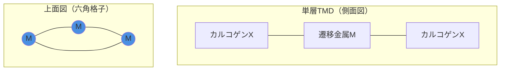
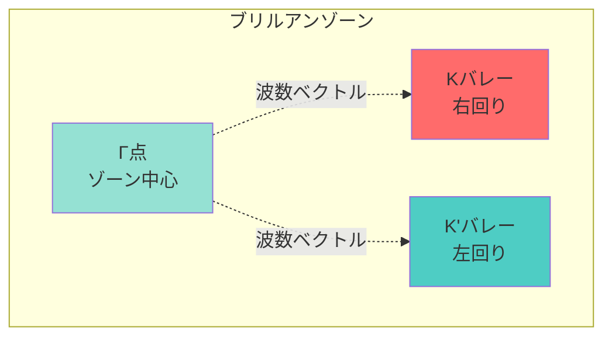
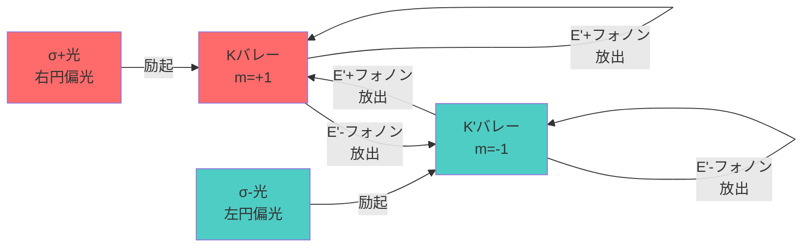

## ビデオ講義

<div class="video-container">
  <iframe
    width="560"
    height="315"
    src="https://www.youtube.com/embed/vbbjqY8Q4ko"
    title="カイラルフォノン 第2章: 材料"
    frameborder="0"
    allow="accelerometer; autoplay; clipboard-write; encrypted-media; gyroscope; picture-in-picture"
    allowfullscreen>
  </iframe>
</div>

> このビデオは以下のテキストと同じ内容をカバーしています。お好みの学習形式をお選びください。

---

[🌐 EN](../../../en/MS/chiral-phonons/chapter-2.md) | 🇯🇵 JP | Last sync: 2025-12-19

[材料科学道場](../index.html) > [カイラルフォノン](index.md) > 第2章

---

**学習目標**
- 2次元遷移金属ダイカルコゲナイド（TMD）の結晶構造とD₃ₕ対称性を理解する
- Γ点でのE'およびE''フォノンモードとそのカイラリティを把握する
- KおよびK'バレーとバレー-フォノン結合機構を説明できる
- 光学選択則（σ⁺とσ⁻）とバレー選択励起を理解する
- α-石英、テルル、セレンなど3次元カイラル結晶の特徴を学ぶ
- カイラリティを伴うフォノン分散と温度依存性を理解する

**レベル**: 📚 上級レベル | **所要時間**: ⏱️ 約90分 | **トピック**: 🎯 TMD・バレー物理・カイラル結晶

---

## 2.1 はじめに：カイラルフォノンの材料プラットフォーム

カイラルフォノンは2015年に理論的に予測され（Zhang & Niu, *Phys. Rev. Lett.* 115, 115502）、2018年に初めて広く報告された実験的観測がなされました（Zhu et al., *Science* 359, 579）。この発見は、格子振動が固有の角運動量を運べることを実証し、新たな研究分野を切り開きました。

本章では、カイラルフォノンを実現する材料系を体系的に学びます。2次元遷移金属ダイカルコゲナイド（TMD）単層から始め、バレー物理との結合を理解し、さらに3次元カイラル結晶における豊かなフォノンカイラリティへと進みます。材料の対称性とフォノンカイラリティの関係が中心テーマです。

## 2.2 2次元遷移金属ダイカルコゲナイド（TMD）

### 2.2.1 TMD単層の結晶構造

遷移金属ダイカルコゲナイド（TMD）は、MX₂（M = Mo, W; X = S, Se）の化学式を持つ層状材料です。単層TMDは**D₃ₕ点群対称性**を持ち、カイラルフォノンの理想的なプラットフォームとなります。

**単層TMDの構造特徴**

単層TMDは、三角格子をなす遷移金属原子層が、上下からカルコゲン原子層でサンドイッチされた構造です（X-M-X）。この構造は以下の対称性を持ちます：

- **3回回転軸（C₃）**: z軸周りの120°回転対称性
- **鏡映面（σₕ）**: 面内の鏡映対称性（なし、空間反転対称性の破れ）
- **鏡映面（σᵥ）**: 3つの垂直鏡映面

重要な点は、単層TMDには**空間反転対称性がない**ことです。これがバレー物理とカイラルフォノンの起源となります。



**代表的なTMD材料**

| 材料 | バンドギャップ (単層) | 格子定数 (Å) | 特徴 |
|------|---------------------|--------------|------|
| WSe₂ | 1.65 eV (直接) | 3.28 | カイラルフォノン初観測 |
| MoS₂ | 1.88 eV (直接) | 3.16 | 最も研究された2D材料 |
| MoSe₂ | 1.57 eV (直接) | 3.29 | 強いバレー分裂 |
| WS₂ | 2.05 eV (直接) | 3.15 | 高いエキシトン結合エネルギー |

### 2.2.2 Γ点におけるフォノンモード

単層TMDのフォノンモードは、D₃ₕ点群の既約表現に従って分類されます。特に重要なのは、**E'モード**と**E''モード**です。

**E'およびE''フォノンモード**

**E'モード（面内振動）**:
- 原子が面内方向に振動（x-y平面内）
- 2つの縮退した直交モード（E'ₓ, E'ᵧ）
- 線形結合により円偏光：E'₊ = (E'ₓ + iE'ᵧ)/√2
- フォノン角運動量：\\(\ell_z = \pm\hbar\\)

**E''モード（面外振動）**:
- 原子が面外方向に振動（z方向成分あり）
- 同様に円偏光モード形成可能
- 通常E'より高エネルギー

カイラルフォノンは、これらの縮退モードの円偏光線形結合として記述されます：

\\[
\begin{aligned}
E'_+ &= \frac{1}{\sqrt{2}}(E'_x + iE'_y) \quad &\text{(右回り、} \ell_z = +\hbar\text{)} \\\\
E'_- &= \frac{1}{\sqrt{2}}(E'_x - iE'_y) \quad &\text{(左回り、} \ell_z = -\hbar\text{)}
\end{aligned}
\\]

これらのモードは原子が円運動を行い、明確な回転方向（カイラリティ）を持ちます。

### 2.2.3 バレー自由度とK/K'点

単層TMDのもう一つの重要な特徴は、ブリルアンゾーン境界のKおよびK'点における**バレー自由度**です。これはカイラルフォノンと深く結びついています。

**KおよびK'バレー**

単層TMDの六角ブリルアンゾーンには、6つの等価な角（高対称点）があります。時間反転対称性により、これらは2つのグループに分かれます：

- **Kバレー**: 右回りの軌道角運動量（\\(m_\ell = +1\\)）
- **K'バレー**: 左回りの軌道角運動量（\\(m_\ell = -1\\)）

これらのバレーは時間反転で結ばれており、空間反転対称性の破れによりエネルギー縮退が解けます（バレー分裂）。



### 2.2.4 バレー-フォノン結合

カイラルフォノンとバレー自由度の結合は、TMD物理学の中心的テーマです。この結合により、**バレー選択的なフォノン散乱**が実現します。

**バレー-フォノン結合機構**

電子-フォノン相互作用ハミルトニアンは、運動量と角運動量の保存則を含みます：

\\[
H_{e-ph} = \sum_{\mathbf{k},\mathbf{q}} g_{\mathbf{k},\mathbf{q}}^{\lambda}
c_{\mathbf{k}+\mathbf{q}}^\dagger c_{\mathbf{k}}
(a_{\mathbf{q}}^{\lambda} + a_{-\mathbf{q}}^{\lambda\dagger})
\\]

ここで、\\(c^\dagger, c\\) は電子の生成・消滅演算子、\\(a^\dagger, a\\) はフォノンの生成・消滅演算子、\\(g_{\mathbf{k},\mathbf{q}}^{\lambda}\\) は結合定数、\\(\lambda\\) はフォノンモード（+または-のカイラリティ）を表します。

**選択則**:
- Kバレー電子 + E'₊フォノン → Kバレー内散乱（許容）
- Kバレー電子 + E'₋フォノン → K'バレー間散乱（許容）
- 角運動量保存：\\(m_{\ell,\text{初}} + \ell_{\text{phonon}} = m_{\ell,\text{終}}\\)

**バレー選択的散乱の例**

単層WSe₂において、Kバレーの励起子が E'₊ フォノン（右回り、\\(\ell_z = +\hbar\\)）を放出する場合：

- 初期状態：Kバレー励起子（\\(m_\ell = +1\\)）
- フォノン放出：E'₊（\\(\ell_z = +1\hbar\\)）
- 最終状態：Kバレー基底状態（\\(m_\ell = 0\\)）
- 角運動量保存：\\(+1 = 0 + (+1)\\) ✓

この選択則により、円偏光ラマン分光で異なるバレーからの異なるフォノン強度が観測されます。

### 2.2.5 バレー選択光励起

円偏光光を用いることで、特定のバレーを選択的に励起できます。これはカイラルフォノン研究の実験的基礎となります。

**光学選択則**

単層TMDの光学遷移は、以下の選択則に従います：

- **σ⁺偏光（右円偏光）**: Kバレーを励起
- **σ⁻偏光（左円偏光）**: K'バレーを励起

これは、光子の角運動量（スピン）が電子の軌道角運動量に移ることによります：

\\[
\begin{aligned}
\sigma^+ \text{光子} (\ell_z = +\hbar) &\rightarrow K\text{バレー励起} (m_\ell = +1) \\\\
\sigma^- \text{光子} (\ell_z = -\hbar) &\rightarrow K'\text{バレー励起} (m_\ell = -1)
\end{aligned}
\\]



## 2.3 3次元カイラル結晶

### 2.3.1 α-石英（SiO₂）：3次元初観測

2018年、Zhu et al.（*Science* 2018）は、α-石英においてカイラルフォノンを初めて3次元結晶で観測しました。これは、カイラルフォノンが2次元材料に限定された現象ではないことを示しました。

**α-石英の結晶構造**

α-石英（低温相、573°C以下）は、以下の特徴を持ちます：

- **空間群**: P3₁21または P3₂21（キラル）
- **点群**: 32（D₃）
- **らせん軸**: 3₁または3₂（右巻きまたは左巻き）
- **格子定数**: a = 4.913 Å, c = 5.405 Å（室温）

SiO₄四面体がらせん状に配列し、結晶全体がカイラリティを持ちます。これにより、フォノンも円偏光性質を獲得します。

**らせん軸対称性とカイラルフォノン**

らせん軸（screw axis）は、回転と並進の組み合わせです：

- **3₁軸**: 120°回転 + c/3並進（右巻き）
- **3₂軸**: 120°回転 + 2c/3並進（左巻き）

この対称性により、縮退したEモードの線形結合が円偏光フォノンを形成します。3₁と3₂は鏡像異性体（エナンチオマー）であり、フォノンカイラリティが逆転します。

**α-石英のカイラルフォノンモード**

代表的なカイラルフォノンモード（室温）：

- **E(LO)モード**: 128 cm⁻¹（最も顕著な円偏光応答）
- **E(TO)モード**: 264 cm⁻¹、354 cm⁻¹
- 円二色性信号：右巻き石英でσ⁺強度 > σ⁻強度

### 2.3.2 テルル（Te）とセレン（Se）

元素単体でカイラル結晶を形成する例として、テルル（Te）とセレン（Se）があります。これらはらせん鎖構造を持ち、豊かなカイラルフォノン物理を示します。

**テルルのらせん鎖構造**

**テルル（Te）**の結晶構造：

- **空間群**: P3₁21または P3₂21
- **構造**: らせん状1次元鎖が三角格子配列
- **らせんピッチ**: 3原子で1ピッチ
- **格子定数**: a = 4.456 Å, c = 5.921 Å

各Te原子は共有結合で隣接原子と結合し、らせん鎖を形成します。鎖同士はファンデルワールス力で結合しています。

**Teのカイラルフォノン特性**

- **A₁モード**: 鎖軸方向の伸縮振動（非カイラル）
- **Eモード**: 鎖に垂直な面内振動（カイラル）
- E₊とE₋は結晶のらせん性により分裂（カイラル分裂）
- 円偏光ラマンで顕著な強度非対称性

### 2.3.3 カイラル有機結晶

有機分子結晶もカイラルフォノンのプラットフォームとなります。特に、カイラル分子が規則配列した結晶では、分子内振動と格子振動の結合により複雑なカイラルフォノンスペクトルが現れます。

**カイラル有機結晶の例**

| 材料 | 空間群 | カイラル特徴 | 応用 |
|------|--------|--------------|------|
| L-アラニン | P2₁2₁2₁ | アミノ酸のカイラリティ | 生体材料モデル |
| 石英様MOF | P3₁21/P3₂21 | らせん骨格 | キラル触媒 |
| カイラルペロブスカイト | P2₁ | 有機-無機ハイブリッド | 円偏光LED |

## 2.4 カイラリティを伴うフォノン分散

Γ点から離れた波数ベクトル \\(\mathbf{q}\\) におけるフォノン分散関係も、結晶のカイラリティにより影響を受けます。

**カイラル分散関係**

カイラル結晶（空間反転対称性なし）では、\\(\mathbf{q}\\) と \\(-\mathbf{q}\\) における円偏光フォノンのエネルギーが異なる場合があります：

\\[
\omega_+(\mathbf{q}) \neq \omega_-(\mathbf{q})
\\]

ここで、+/-は右回り/左回りのカイラリティを表します。この分裂は、**カイラル波数分裂**または**カイラル分散非対称性**と呼ばれます。

物理的には、結晶のらせん構造が特定の回転方向の波動に選好性を与えることに起因します。


### 2.4.1 TMDにおけるバレー依存分散

単層TMDでは、KとK'バレー周りで異なるカイラルフォノンカップリングが生じます。これは光学フォノンだけでなく、音響フォノンにも現れます。

**バレー音響フォノン**

KとK'バレー近傍の長波長音響フォノンは、バレーごとに異なる電子-フォノン結合を持ちます：

- Kバレー：TAフォノン（横波音響）が右回り変位優先
- K'バレー：TAフォノンが左回り変位優先
- 変形ポテンシャル：バレー選択的散乱の原因

## 2.5 温度依存性

カイラルフォノンの特性は温度に依存します。これは材料設計と応用において重要です。

### 2.5.1 フォノンポピュレーションと温度

フォノンのボーズ-アインシュタイン分布により、温度上昇とともにカイラルフォノンのポピュレーションが増加します：

\\[
n(\omega, T) = \frac{1}{e^{\hbar\omega / k_B T} - 1}
\\]

これにより、以下の温度依存現象が生じます：

- **ラマン強度の温度依存性**: 高温でストークス/アンチストークス強度比変化
- **フォノン線幅の温度依存性**: 非調和効果による広がり
- **フォノンエネルギーシフト**: 熱膨張と非調和性による赤方偏移

### 2.5.2 相転移とカイラリティ変化

一部の材料では、温度による相転移でカイラリティが変化します。

**α-β石英転移**

石英は573°Cで相転移します：

- **α-石英（低温相）**: P3₁21/P3₂21（カイラル）
- **β-石英（高温相）**: P6₂22/P6₄22（より高対称）
- 転移により、一部のカイラルフォノンモードが消失または変化
- 円偏光ラマン信号の温度依存性でモニタリング可能

## 2.6 Python実装：バレー-フォノン結合モデル

簡単なバレー-フォノン結合モデルを実装し、カイラルフォノンによるバレー間散乱を可視化します。

**バレー-フォノン結合シミュレーション**

```python
import numpy as np
import matplotlib.pyplot as plt
from matplotlib import rcParams

# 日本語フォント設定
rcParams['font.sans-serif'] = ['Hiragino Sans', 'Yu Gothic', 'Meiryo', 'DejaVu Sans']
rcParams['axes.unicode_minus'] = False

# パラメータ設定
hbar = 1.0  # 規格化単位
omega_phonon = 50.0  # フォノンエネルギー (meV)
g_plus = 0.1  # E'+フォノン結合強度
g_minus = 0.08  # E'-フォノン結合強度
valley_splitting = 20.0  # バレー分裂エネルギー (meV)

# エネルギー範囲
E = np.linspace(0, 200, 500)

# バレー状態
def valley_states():
    """Kバレーとパーバレーの初期ポピュレーション"""
    K_valley = np.exp(-(E - 100)**2 / 400)  # Kバレー励起子
    Kp_valley = np.exp(-(E - 100 + valley_splitting)**2 / 400)  # K'バレー
    return K_valley, Kp_valley

# フォノン放出による散乱
def phonon_scattering(initial_pop, phonon_energy, coupling):
    """フォノン放出による状態間遷移"""
    scattered = np.zeros_like(initial_pop)
    for i in range(len(E)):
        # フォノンエネルギー分だけシフト
        target_E = E[i] - phonon_energy
        if target_E > 0:
            idx = np.argmin(np.abs(E - target_E))
            scattered[idx] += coupling * initial_pop[i]
    return scattered

# 初期状態
K_init, Kp_init = valley_states()

# E'+フォノン（右回り）によるバレー内散乱
K_intra = phonon_scattering(K_init, omega_phonon, g_plus)

# E'-フォノン（左回り）によるバレー間散乱
K_to_Kp = phonon_scattering(K_init, omega_phonon, g_minus)

# プロット
fig, axes = plt.subplots(2, 2, figsize=(12, 10))

# 初期状態
axes[0, 0].plot(E, K_init, 'r-', linewidth=2, label='Kバレー励起')
axes[0, 0].plot(E, Kp_init, 'b--', linewidth=2, label="K'バレー")
axes[0, 0].set_xlabel('エネルギー (meV)')
axes[0, 0].set_ylabel('ポピュレーション')
axes[0, 0].set_title('初期状態：Kバレー励起')
axes[0, 0].legend()
axes[0, 0].grid(True, alpha=0.3)

# E'+フォノン放出（バレー内）
axes[0, 1].plot(E, K_init, 'r:', linewidth=1, alpha=0.5, label='初期状態')
axes[0, 1].plot(E, K_intra, 'r-', linewidth=2, label="E'+ 放出後")
axes[0, 1].axvline(omega_phonon, color='orange', linestyle='--',
                   alpha=0.7, label=f'フォノンE = {omega_phonon} meV')
axes[0, 1].set_xlabel('エネルギー (meV)')
axes[0, 1].set_ylabel('ポピュレーション')
axes[0, 1].set_title("E'+ フォノン放出（バレー内散乱）")
axes[0, 1].legend()
axes[0, 1].grid(True, alpha=0.3)

# E'-フォノン放出（バレー間）
axes[1, 0].plot(E, K_init, 'r:', linewidth=1, alpha=0.5, label='初期K')
axes[1, 0].plot(E, K_to_Kp, 'b-', linewidth=2, label="E'- でK'へ")
axes[1, 0].axvline(omega_phonon, color='orange', linestyle='--',
                   alpha=0.7, label=f'フォノンE = {omega_phonon} meV')
axes[1, 0].set_xlabel('エネルギー (meV)')
axes[1, 0].set_ylabel('ポピュレーション')
axes[1, 0].set_title("E'- フォノン放出（バレー間散乱）")
axes[1, 0].legend()
axes[1, 0].grid(True, alpha=0.3)

# 角運動量保存則の図示
theta = np.linspace(0, 2*np.pi, 100)
x_circle = np.cos(theta)
y_circle = np.sin(theta)

axes[1, 1].plot(x_circle, y_circle, 'k-', linewidth=1, alpha=0.3)
axes[1, 1].arrow(0, 0, 0.7, 0, head_width=0.1, head_length=0.1,
                 fc='red', ec='red', linewidth=2)
axes[1, 1].text(0.85, 0, 'K (m=+1)', fontsize=12, color='red')
axes[1, 1].arrow(0, 0, -0.7, 0, head_width=0.1, head_length=0.1,
                 fc='blue', ec='blue', linewidth=2)
axes[1, 1].text(-1.2, 0, "K' (m=-1)", fontsize=12, color='blue')
# 円偏光フォノン
for i in range(5):
    angle = i * 2*np.pi/5
    x_start = 0.3 * np.cos(angle)
    y_start = 0.3 * np.sin(angle)
    x_end = 0.3 * np.cos(angle + np.pi/3)
    y_end = 0.3 * np.sin(angle + np.pi/3)
    axes[1, 1].arrow(x_start, y_start, x_end-x_start, y_end-y_start,
                     head_width=0.05, fc='orange', ec='orange',
                     alpha=0.6, linewidth=1)
axes[1, 1].text(0, -0.5, "E'+ (右回り, ℓ=+ℏ)", fontsize=11,
                ha='center', color='orange')
axes[1, 1].set_xlim(-1.5, 1.5)
axes[1, 1].set_ylim(-1.5, 1.5)
axes[1, 1].set_aspect('equal')
axes[1, 1].set_title('角運動量保存則')
axes[1, 1].axis('off')

plt.tight_layout()
plt.savefig('valley_phonon_coupling.png', dpi=150, bbox_inches='tight')
plt.show()

print("=== バレー-フォノン結合シミュレーション ===")
print(f"フォノンエネルギー: {omega_phonon} meV")
print(f"E'+ 結合強度: {g_plus}")
print(f"E'- 結合強度: {g_minus}")
print(f"バレー分裂: {valley_splitting} meV")
print("\n角運動量保存則:")
print("  K(m=+1) + E'+(ℓ=+1) → K(m=0)  [バレー内]")
print("  K(m=+1) + E'-(ℓ=-1) → K'(m=0) [バレー間]")
```

**カイラル分散関係の可視化**

```python
import numpy as np
import matplotlib.pyplot as plt

# パラメータ
a = 1.0  # 格子定数（規格化）
omega0 = 100.0  # ゾーン中心フォノン周波数 (cm^-1)
v_sound = 5000.0  # 音速 (m/s, 適当な値)
chiral_coupling = 10.0  # カイラル結合強度 (cm^-1)

# 波数ベクトル（ΓからK方向）
q = np.linspace(0, np.pi/a, 200)

# 光学フォノン分散（カイラル分裂あり）
def optical_dispersion(q, sign):
    """
    sign = +1: 右回りモード
    sign = -1: 左回りモード
    """
    # 簡単なモデル：ゾーン中心から波数依存で分裂
    omega_base = omega0 * (1 + 0.1 * (q*a/np.pi)**2)
    omega_chiral = omega_base + sign * chiral_coupling * np.sin(q*a)
    return omega_chiral

omega_plus = optical_dispersion(q, +1)
omega_minus = optical_dispersion(q, -1)

# 音響フォノン（線形分散、カイラリティなし）
omega_acoustic = v_sound * q / (100 * a)  # cm^-1単位に変換

# プロット
fig, axes = plt.subplots(1, 2, figsize=(14, 5))

# 光学フォノン分散
axes[0].plot(q*a/np.pi, omega_plus, 'r-', linewidth=2.5, label='右回り (E$\'+$)')
axes[0].plot(q*a/np.pi, omega_minus, 'b-', linewidth=2.5, label='左回り (E$\'-$)')
axes[0].fill_between(q*a/np.pi, omega_plus, omega_minus, alpha=0.2, color='gray',
                      label='カイラル分裂領域')
axes[0].axhline(omega0, color='k', linestyle=':', alpha=0.5, linewidth=1)
axes[0].set_xlabel('波数 (q / [π/a])', fontsize=13)
axes[0].set_ylabel('フォノン周波数 (cm$^{-1}$)', fontsize=13)
axes[0].set_title('カイラル光学フォノン分散', fontsize=14, fontweight='bold')
axes[0].legend(fontsize=11)
axes[0].grid(True, alpha=0.3)
axes[0].set_xlim(0, 1)

# カイラル分裂の波数依存性
splitting = omega_plus - omega_minus
axes[1].plot(q*a/np.pi, splitting, 'purple', linewidth=2.5)
axes[1].fill_between(q*a/np.pi, 0, splitting, alpha=0.3, color='purple')
axes[1].set_xlabel('波数 (q / [π/a])', fontsize=13)
axes[1].set_ylabel('カイラル分裂 Δω (cm$^{-1}$)', fontsize=13)
axes[1].set_title('カイラル分裂の波数依存性', fontsize=14, fontweight='bold')
axes[1].grid(True, alpha=0.3)
axes[1].set_xlim(0, 1)
axes[1].axhline(0, color='k', linestyle='-', linewidth=0.5)

plt.tight_layout()
plt.savefig('chiral_dispersion.png', dpi=150, bbox_inches='tight')
plt.show()

# 数値出力
print("=== カイラル分散関係 ===")
print(f"Γ点フォノン周波数: {omega0} cm⁻¹")
print(f"カイラル結合強度: {chiral_coupling} cm⁻¹")
print(f"最大分裂 (q = π/2a): {splitting[len(splitting)//2]:.2f} cm⁻¹")
print(f"ゾーン境界分裂 (q = π/a): {splitting[-1]:.2f} cm⁻¹")
```

## 2.7 演習問題

### 演習2.1：TMD対称性とフォノンモード

**問題**: 単層MoS₂の点群D₃ₕについて、以下の問いに答えなさい。

a) D₃ₕ点群の対称操作をすべて列挙しなさい。
b) Γ点におけるフォノンモードの既約表現を求め、どのモードがラマン活性か、赤外活性かを判定しなさい。
c) E'モードとE''モードの変位パターンの違いを図示しなさい。
d) なぜ単層TMDでE'モードが円偏光性を持つのか、対称性の観点から説明しなさい。

<details>
<summary>解答のヒント</summary>

(a) D₃ₕ = {E, 2C₃, 3C₂, σₕ, 2S₃, 3σᵥ}（12操作）
(b) 3原子系（M + 2X）→ 9自由度 = A'₁ + A''₂ + E' + E''（3音響モード差し引く）
(c) E': 面内円運動、E'': 面外楕円運動
(d) Eモードの2重縮退 → 線形結合で円偏光可能、C₃対称性が回転方向決定

</details>

### 演習2.2：バレー-フォノン結合の選択則

**問題**: 単層WSe₂において、以下の過程が角運動量保存則を満たすか判定しなさい。

a) Kバレー励起子（\\(m_\ell = +1\\)）が E'₊フォノン（\\(\ell_z = +\hbar\\)）を放出してKバレー基底状態（\\(m_\ell = 0\\)）へ遷移
b) K'バレー励起子（\\(m_\ell = -1\\)）が E'₊フォノンを放出してKバレー基底状態へ遷移
c) Kバレー励起子が E'₋フォノン（\\(\ell_z = -\hbar\\)）を吸収してK'バレー励起状態（\\(m_\ell = -1\\)）へ遷移

それぞれについて、角運動量保存則を式で表し、許容されるか判定しなさい。

<details>
<summary>解答</summary>

(a) \\(+1 = 0 + (+1)\\) → 保存 ✓ (許容)
(b) \\(-1 \neq 0 + (+1) = +1\\) → 非保存 ✗ (禁制)
(c) \\(+1 + (-(-1)) = +1 + 1 = +2 \neq -1\\) → 非保存 ✗ (禁制)
注：フォノン吸収は \\(-\ell_z\\) の角運動量を電子に与える

</details>

### 演習2.3：α-石英のらせん軸

**問題**: α-石英の3₁らせん軸について答えなさい。

a) 3₁操作を具体的に記述しなさい（回転角と並進量）。
b) 3₁らせん軸と3₂らせん軸はどのような関係にあるか。
c) なぜ3₁と3₂の石英でカイラルフォノンの円偏光応答が逆転するのか説明しなさい。
d) 3₁石英のEモードフォノンが右回りだとすると、3₂石英ではどうなるか。

<details>
<summary>解答のヒント</summary>

(a) 120°回転 + c/3並進（cはc軸格子定数）
(b) 鏡像関係（エナンチオマー）、互いに重ね合わせ不可能
(c) 結晶のらせん方向が逆 → フォノン変位パターンも鏡像反転
(d) 左回りになる（円偏光の向きが逆転）

</details>

### 演習2.4：カイラル分散の数値計算

**問題**: 以下の簡単なカイラルフォノン分散モデルを考えます。

\\[
\omega_\pm(q) = \omega_0 \sqrt{1 + \alpha(qa)^2} \pm \beta \sin(qa)
\\]

ここで、\\(\omega_0 = 200\\) cm⁻¹、\\(\alpha = 0.1\\)、\\(\beta = 15\\) cm⁻¹、格子定数 \\(a = 3.2\\) Åとします。

a) Pythonで \\(q = 0\\) から \\(q = \pi/a\\) までの分散関係をプロットしなさい。
b) \\(q = \pi/(2a)\\) におけるカイラル分裂 \\(\Delta\omega = \omega_+ - \omega_-\\) を計算しなさい。
c) \\(\beta\\) を 0, 10, 20 cm⁻¹と変化させたときの分散を同じグラフに描き、カイラル結合強度の影響を考察しなさい。

<details>
<summary>解答例（計算結果）</summary>

(b) \\(q = \pi/(2a)\\) のとき、\\(qa = \pi/2\\)、\\(\sin(\pi/2) = 1\\)
\\(\Delta\omega = 2\beta = 30\\) cm⁻¹
(c) \\(\beta\\) が大きいほど分裂が顕著、\\(\beta = 0\\) で縮退（カイラリティなし）

</details>

### 演習2.5：温度依存性の実験設計

**問題**: 単層MoS₂のカイラルフォノンE'モード（384 cm⁻¹）の温度依存性を円偏光ラマン分光で測定する実験を計画します。

a) 測定すべき物理量を3つ挙げなさい（例：ピーク位置、強度比など）。
b) 温度範囲を4 Kから600 Kとする場合、どのような温度依存性が予想されるか、各物理量について説明しなさい。
c) フォノンポピュレーション \\(n(\omega, T)\\) を用いて、ストークス/アンチストークス強度比の温度依存性を定式化しなさい。
d) 384 cm⁻¹のフォノンについて、室温（300 K）と77 K（液体窒素温度）での強度比を計算しなさい。（\\(k_B = 0.695\\) cm⁻¹/K を使用）

<details>
<summary>解答のヒント</summary>

(a) ピーク位置（ω）、線幅（Γ）、円偏光強度比（I<sub>σ+</sub>/I<sub>σ-</sub>）
(b) ω: 温度上昇で赤方偏移（熱膨張）、Γ: 増加（非調和散乱）、強度比: 温度で変化（ポピュレーション効果）
(c) I<sub>AS</sub>/I<sub>S</sub> = exp(-ℏω/k<sub>B</sub>T)
(d) 300 K: exp(-384/(0.695×300)) ≈ 0.098、77 K: exp(-384/(0.695×77)) ≈ 1.1×10⁻⁶

</details>

## 2.8 まとめ

**本章のポイント**

- **TMD単層**は D₃ₕ 対称性を持ち、E'およびE''モードがカイラルフォノンを形成する理想的なプラットフォームである
- **バレー自由度**（KとK'）は空間反転対称性の破れにより生じ、カイラルフォノンと角運動量選択則を通じて結合する
- **円偏光光**（σ⁺/σ⁻）により特定バレーを選択励起でき、バレー-フォノン結合を実験的に探査できる
- **3次元カイラル結晶**（α-石英、Te、Se）もカイラルフォノンを示し、らせん軸対称性が重要な役割を果たす
- **カイラル分散**: 波数依存でカイラルフォノンの分裂が生じ、結晶のカイラリティを反映する
- **温度依存性**: フォノンポピュレーション、エネルギーシフト、線幅、円偏光応答が温度で変化し、相転移でカイラリティが変化する場合もある

**次章の予告**

第3章では、カイラルフォノンの実験的検出手法に焦点を当てます。円偏光ラマン分光法の原理、測定セットアップ、選択則、データ解析方法を詳述し、さらに円二色性分光、超高速分光法などの先端技術も紹介します。実験から得られる情報とその物理的解釈を学びます。

---

**ナビゲーション**

[← 第1章](chapter-1.md) | [第3章 →](chapter-3.md)

---

## 免責事項

この教育コンテンツは、橋本研究室のナレッジベース用にAIの支援を受けて作成されました。正確性を期していますが、重要な情報については一次資料や査読済み文献で確認することをお勧めします。

---

&copy; 2025 東北大学 橋本研究室. All rights reserved.
