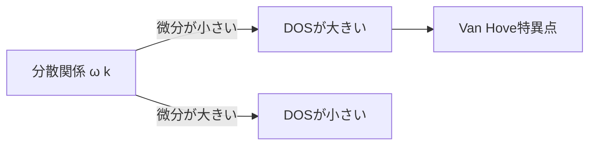
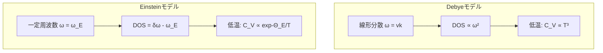
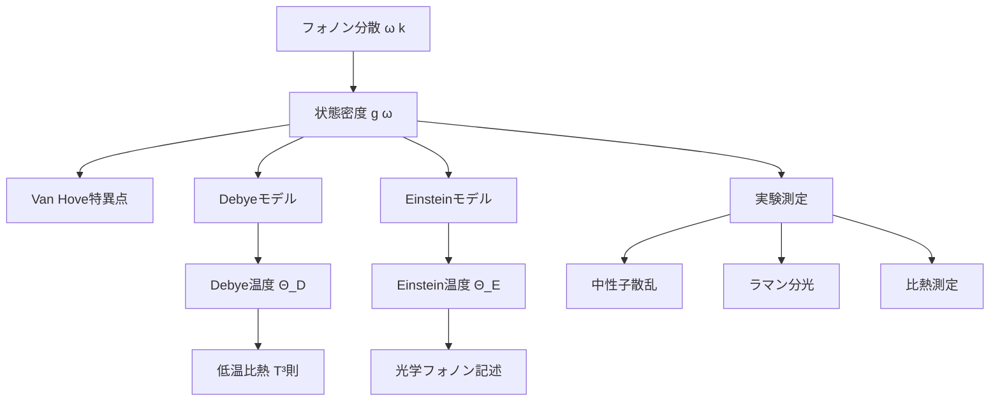

[🌐 EN](../../../en/MS/phonon-introduction/chapter-3.md) | 🇯🇵 JP | Last sync: 2025-12-20

[材料科学道場](../index.html) > [フォノン入門](index.md) > 第3章

---

## 学習目標

- フォノン状態密度(DOS)の定義と物理的意味を理解する
- DOSと分散関係の関係を説明できる
- Van Hove特異点の起源と意義を理解する
- Debyeモデルの仮定とDOSの導出を学ぶ
- Einsteinモデルとの比較を通じてモデルの適用範囲を理解する
- Pythonで実際のDOSを計算しプロットできる

---

## 1. 状態密度とは何か?

### 1.1 物理的イメージ

第2章で学んだフォノン分散関係 \\(\omega(\mathbf{k})\\) は、各波数ベクトル \\(\mathbf{k}\\) に対してどのような振動数のフォノンが存在するかを教えてくれます。しかし、材料の熱的性質を理解するには、「特定の振動数 \\(\omega\\) を持つフォノンモードがどれだけ存在するか」という情報が重要です。

**日常の例:楽器のアナロジー**

ピアノには88個の鍵盤があり、それぞれ異なる音の高さ(振動数)を出します。もし「どの音の高さが最も多く演奏可能か」を知りたい場合、鍵盤が周波数空間でどのように分布しているかを調べます。これが状態密度の概念に相当します。

### 1.2 フォノン状態密度の定義

フォノン状態密度(Density of States, DOS) \\(g(\omega)\\) は、単位周波数あたりに存在するフォノンモードの数として定義されます:

\\[
g(\omega) = \sum_{\mathbf{k}, s} \delta(\omega - \omega_s(\mathbf{k}))
\\]

ここで:
- \\(\mathbf{k}\\):波数ベクトル
- \\(s\\):フォノンブランチのインデックス(音響・光学モード)
- \\(\omega_s(\mathbf{k})\\):ブランチ \\(s\\)、波数 \\(\mathbf{k}\\) のフォノン振動数
- \\(\delta(x)\\):ディラックのデルタ関数

実際の計算では、ブリルアンゾーン内の \\(\mathbf{k}\\) 点を離散的にサンプリングし、積分形式に書き換えます:

\\[
g(\omega) = \frac{V}{(2\pi)^3} \sum_s \int_{\text{BZ}} \delta(\omega - \omega_s(\mathbf{k})) \, d\mathbf{k}
\\]

### 1.3 DOSと分散関係の関係

状態密度は分散関係の「逆関数」的な情報を含んでいます。分散が平坦な領域 (\\(\nabla_\mathbf{k} \omega \approx 0\\)) では、多くの \\(\mathbf{k}\\) 点が同じ振動数 \\(\omega\\) に対応するため、DOSが大きくなります。



### 1.4 規格化条件

全フォノンモード数は \\(3N\\) (\\(N\\) は単位胞あたりの原子数)に等しいため、DOSは次の規格化条件を満たします:

\\[
\int_0^{\omega_{\text{max}}} g(\omega) \, d\omega = 3N
\\]

---

## 2. Van Hove特異点

### 2.1 特異点の起源

Van Hove特異点は、分散関係が極値(最大値または最小値)を持つ点で発生します。これらの点では、\\(\nabla_\mathbf{k} \omega_s(\mathbf{k}) = 0\\) となり、状態密度が特異的に増大します。

### 2.2 3次元結晶における特異点の分類

3次元結晶では、以下の4種類のVan Hove特異点が存在します:

| タイプ | 特性 | DOSの振る舞い |
|--------|------|--------------|
| M₀ | 極小値 | \\(g(\omega) \propto \sqrt{\omega - \omega_0}\\) |
| M₁ | 鞍点(1方向極大) | \\(g(\omega)\\) は一定 |
| M₂ | 鞍点(2方向極大) | \\(g(\omega)\\) は一定 |
| M₃ | 極大値 | \\(g(\omega) \propto \sqrt{\omega_0 - \omega}\\) |

### 2.3 物理的重要性

Van Hove特異点は以下の現象に重要な役割を果たします:

- **比熱の温度依存性**: 特異点での状態密度の増大が比熱に寄与
- **中性子散乱実験**: 散乱強度がDOSに比例するため、特異点が顕著に観測される
- **フォノン-フォノン散乱**: 特異点近傍でフォノン寿命が変化

---

## 3. Debyeモデル

### 3.1 モデルの仮定

Debyeモデルは、1912年にPeter Debyeによって提案された、フォノンDOSを近似するための簡単なモデルです。以下の仮定に基づいています:

1. **線形分散近似**: すべてのフォノンモードが音速 \\(v\\) で線形に分散する
   \\[
   \omega = v|\mathbf{k}|
   \\]
2. **等方的媒質**: 音速はすべての方向で同じ
3. **単一音速**: 縦波と横波の音速を平均化(または3つの音響ブランチを考慮)
4. **カットオフ周波数**: 全モード数を \\(3N\\) に保つため、最大周波数 \\(\omega_D\\)(Debye周波数)を導入

### 3.2 Debye状態密度の導出

線形分散 \\(\omega = v k\\) を仮定すると、3次元での状態密度は:

\\[
g(\omega) = \frac{V}{2\pi^2} \frac{k^2}{v} \frac{dk}{d\omega}
\\]

\\(k = \omega/v\\) より \\(dk/d\omega = 1/v\\) なので:

\\[
g(\omega) = \frac{V}{2\pi^2 v^3} \omega^2 = \frac{9N}{\omega_D^3} \omega^2 \quad (\omega \leq \omega_D)
\\]

ここで、規格化条件から Debye周波数 \\(\omega_D\\) を決定します:

\\[
\int_0^{\omega_D} g(\omega) \, d\omega = 3N
\\]

これより:

\\[
\omega_D = v \left( 6\pi^2 \frac{N}{V} \right)^{1/3}
\\]

### 3.3 Debye温度

Debye周波数に対応する温度を**Debye温度** \\(\Theta_D\\) と呼びます:

\\[
\Theta_D = \frac{\hbar \omega_D}{k_B}
\\]

Debye温度は材料の固有の特性であり、以下の意味を持ちます:

- \\(T \ll \Theta_D\\):低温極限(量子効果が顕著)
- \\(T \gg \Theta_D\\):高温極限(古典的挙動)
- 比熱の温度依存性を決定する重要なパラメータ

**代表的な材料のDebye温度**

| 材料 | \\(\Theta_D\\) (K) | 特徴 |
|------|------------------|------|
| ダイヤモンド | 2230 | 非常に硬い、軽い原子 |
| アルミニウム | 428 | 軽い金属 |
| 鉛 | 105 | 重い金属、柔らかい |
| シリコン | 645 | 半導体 |

### 3.4 Debyeモデルの物理的解釈

Debyeモデルは、結晶を**等方的弾性体**として扱います。この近似は以下の場合に良く機能します:

- 低周波数(長波長)フォノン:分散が線形に近い
- 高温での比熱:細かいDOS構造が平均化される
- 単純な結晶構造(単原子基底)

一方、以下の場合には不適切です:

- 光学フォノンが重要な多原子系
- Van Hove特異点の影響が大きい場合
- 強い異方性を持つ結晶

---

## 4. Einsteinモデル

### 4.1 モデルの仮定

Einsteinモデルは、1907年にAlbert Einsteinによって提案された、さらに簡単な近似です。このモデルでは:

1. **単一周波数仮定**: すべてのフォノンモードが同じ周波数 \\(\omega_E\\) を持つ
2. **独立調和振動子**: 各原子が独立に振動する

この仮定の下では、状態密度は以下のように書けます:

\\[
g(\omega) = 3N \delta(\omega - \omega_E)
\\]

### 4.2 Einstein温度

Einstein周波数に対応する温度を**Einstein温度** \\(\Theta_E\\) と呼びます:

\\[
\Theta_E = \frac{\hbar \omega_E}{k_B}
\\]

### 4.3 物理的解釈と適用範囲

Einsteinモデルは、以下の状況で有用です:

- **光学フォノン**: 分散が平坦(\\(\omega \approx \text{const}\\))なモードの記述
- **高温極限**: 古典的振動子の挙動
- **局在振動**: 不純物や欠陥周辺の局在モード

しかし、低温での比熱を正しく記述できないという重大な欠点があります。実験的には、低温で \\(C_V \propto T^3\\) となる(Debyeの \\(T^3\\) 則)のに対し、Einsteinモデルは指数関数的に減衰する予測を与えます。

---

## 5. DebyeモデルとEinsteinモデルの比較

### 5.1 定性的比較

| 項目 | Debyeモデル | Einsteinモデル |
|------|------------|----------------|
| DOS形状 | \\(\omega^2\\) 依存(連続的) | デルタ関数(単一周波数) |
| 物理的描像 | 集団的な音波的運動 | 独立な局在振動 |
| 低温比熱 | \\(T^3\\) 依存(正確) | 指数関数的減衰(不正確) |
| 高温比熱 | Dulong-Petit則 | Dulong-Petit則 |
| 適用対象 | 音響フォノン | 光学フォノン |
| パラメータ | \\(\Theta_D\\)(Debye温度) | \\(\Theta_E\\)(Einstein温度) |

### 5.2 視覚的比較



### 5.3 実材料への適用:混合モデル

実際の材料では、DebyeモデルとEinsteinモデルを組み合わせることで、より良い近似が得られます:

\\[
g(\omega) = g_{\text{Debye}}(\omega) + \sum_i A_i \delta(\omega - \omega_{E,i})
\\]

ここで、\\(g_{\text{Debye}}(\omega)\\) は音響フォノンを記述し、デルタ関数の項は光学フォノンを表します。

---

## 6. 実際のDOSと近似モデルの比較

### 6.1 単原子結晶(例:FCC金属)

面心立方(FCC)構造を持つアルミニウムのような単原子結晶では、実際のDOSは以下の特徴を示します:

- 低周波数領域:Debye近似 \\(g(\omega) \propto \omega^2\\) に従う
- 中間領域:Van Hove特異点による鋭いピーク
- 高周波数端:分散が平坦になる領域で状態密度が増大

### 6.2 二原子結晶(例:NaCl型イオン結晶)

NaCl型構造を持つイオン結晶では:

- 音響フォノン:低周波数に3つのブランチ(1縦波、2横波)
- ギャップ:音響モードと光学モードの間に周波数ギャップ
- 光学フォノン:高周波数にピーク(Einstein的)

### 6.3 実DOSの計算方法

第一原理計算では、以下の手順でDOSを計算します:

1. 密度汎関数摂動論(DFPT)でフォノン分散 \\(\omega_s(\mathbf{k})\\) を計算
2. ブリルアンゾーン内で \\(\mathbf{k}\\) 点を密にサンプリング
3. 各 \\(\mathbf{k}\\) 点でのフォノン周波数をヒストグラム化
4. 適切な平滑化(Gaussian smearing など)を適用

---

## 7. PythonでフォノンDOSを計算する

### 7.1 Debye DOSのプロット

まず、Debyeモデルの状態密度を実装してみましょう。

```python
import numpy as np
import matplotlib.pyplot as plt

# パラメータ設定
N = 1000  # 原子数
omega_D = 20.0  # Debye周波数(THz)

# 周波数範囲
omega = np.linspace(0, omega_D * 1.5, 500)

# Debye DOS
def debye_dos(omega, omega_D, N):
    """
    Debyeモデルの状態密度

    Parameters:
    -----------
    omega : array
        周波数配列(THz)
    omega_D : float
        Debye周波数(THz)
    N : int
        原子数

    Returns:
    --------
    g : array
        状態密度
    """
    g = np.zeros_like(omega)
    mask = omega <= omega_D
    g[mask] = (9 * N / omega_D**3) * omega[mask]**2
    return g

# DOSを計算
g_debye = debye_dos(omega, omega_D, N)

# プロット
plt.figure(figsize=(10, 6))
plt.plot(omega, g_debye, linewidth=2, label='Debye model')
plt.axvline(omega_D, color='red', linestyle='--',
            label=f'$\\omega_D$ = {omega_D} THz')
plt.xlabel('Frequency ω (THz)', fontsize=12)
plt.ylabel('DOS g(ω) (states/THz)', fontsize=12)
plt.title('Debye Phonon Density of States', fontsize=14)
plt.legend(fontsize=11)
plt.grid(True, alpha=0.3)
plt.tight_layout()
plt.savefig('debye_dos.png', dpi=300, bbox_inches='tight')
plt.show()

# 規格化チェック
total_modes = np.trapz(g_debye, omega)
print(f"Total modes: {total_modes:.1f} (expected: {3*N})")
```

### 7.2 EinsteinモデルとDebyeモデルの比較

```python
import numpy as np
import matplotlib.pyplot as plt

# パラメータ
N = 1000
omega_D = 20.0  # Debye周波数
omega_E = 15.0  # Einstein周波数

omega = np.linspace(0, 30, 1000)

# Debye DOS
def debye_dos(omega, omega_D, N):
    g = np.zeros_like(omega)
    mask = omega <= omega_D
    g[mask] = (9 * N / omega_D**3) * omega[mask]**2
    return g

# Einstein DOS(Gaussianで近似)
def einstein_dos(omega, omega_E, N, sigma=0.5):
    """
    EinsteinモデルのDOS(Gaussian近似)

    Parameters:
    -----------
    sigma : float
        Gaussianの幅(THz)
    """
    return 3 * N / (sigma * np.sqrt(2 * np.pi)) * \
           np.exp(-0.5 * ((omega - omega_E) / sigma)**2)

# 計算
g_debye = debye_dos(omega, omega_D, N)
g_einstein = einstein_dos(omega, omega_E, N)

# プロット
fig, axes = plt.subplots(1, 2, figsize=(14, 5))

# 左:個別プロット
axes[0].plot(omega, g_debye, linewidth=2, label='Debye model')
axes[0].plot(omega, g_einstein, linewidth=2, label='Einstein model')
axes[0].axvline(omega_D, color='blue', linestyle='--', alpha=0.5)
axes[0].axvline(omega_E, color='orange', linestyle='--', alpha=0.5)
axes[0].set_xlabel('Frequency ω (THz)', fontsize=12)
axes[0].set_ylabel('DOS g(ω)', fontsize=12)
axes[0].set_title('Debye vs Einstein Models', fontsize=14)
axes[0].legend(fontsize=11)
axes[0].grid(True, alpha=0.3)

# 右:積分DOS(累積モード数)
cumulative_debye = np.array([np.trapz(g_debye[:i+1], omega[:i+1])
                               for i in range(len(omega))])
cumulative_einstein = np.array([np.trapz(g_einstein[:i+1], omega[:i+1])
                                 for i in range(len(omega))])

axes[1].plot(omega, cumulative_debye, linewidth=2, label='Debye')
axes[1].plot(omega, cumulative_einstein, linewidth=2, label='Einstein')
axes[1].axhline(3*N, color='red', linestyle='--',
                label=f'Total modes = {3*N}')
axes[1].set_xlabel('Frequency ω (THz)', fontsize=12)
axes[1].set_ylabel('Cumulative modes', fontsize=12)
axes[1].set_title('Integrated DOS', fontsize=14)
axes[1].legend(fontsize=11)
axes[1].grid(True, alpha=0.3)

plt.tight_layout()
plt.savefig('debye_vs_einstein.png', dpi=300, bbox_inches='tight')
plt.show()
```

### 7.3 実材料のDOS(単原子鎖モデル)

第2章で学んだ単原子鎖の分散関係から、実際のDOSを計算してみましょう。

```python
import numpy as np
import matplotlib.pyplot as plt

# パラメータ
M = 1.0      # 質量(任意単位)
K = 10.0     # バネ定数(任意単位)
a = 1.0      # 格子定数(任意単位)
N_atoms = 100  # 原子数

# 単原子鎖の分散関係
def monatomic_dispersion(k, K, M, a):
    """単原子鎖のフォノン分散"""
    return 2 * np.sqrt(K / M) * np.abs(np.sin(k * a / 2))

# ブリルアンゾーン内でk点をサンプリング
k_points = np.linspace(-np.pi/a, np.pi/a, 1000)
omega_k = monatomic_dispersion(k_points, K, M, a)

# DOSをヒストグラムで計算
omega_max = 2 * np.sqrt(K / M)
omega_bins = np.linspace(0, omega_max * 1.1, 200)
dos_hist, bin_edges = np.histogram(omega_k, bins=omega_bins, density=True)
omega_centers = 0.5 * (bin_edges[1:] + bin_edges[:-1])

# 規格化(全モード数 = N_atoms)
dos_normalized = dos_hist * N_atoms / np.trapz(dos_hist, omega_centers)

# 解析的DOS(1D単原子鎖)
def analytical_dos_1d(omega, omega_max, N):
    """
    1次元単原子鎖の解析的DOS
    g(ω) = N / (π√(ω_max² - ω²))
    """
    g = np.zeros_like(omega)
    mask = (omega > 0) & (omega < omega_max)
    g[mask] = N / (np.pi * np.sqrt(omega_max**2 - omega[mask]**2))
    return g

omega_analytical = np.linspace(0.01, omega_max * 0.99, 500)
dos_analytical = analytical_dos_1d(omega_analytical, omega_max, N_atoms)

# プロット
fig, axes = plt.subplots(1, 2, figsize=(14, 5))

# 左:分散関係
axes[0].plot(k_points * a / np.pi, omega_k, linewidth=2)
axes[0].set_xlabel('Wave vector ka/π', fontsize=12)
axes[0].set_ylabel('Frequency ω', fontsize=12)
axes[0].set_title('Phonon Dispersion (Monatomic Chain)', fontsize=14)
axes[0].grid(True, alpha=0.3)
axes[0].axhline(omega_max, color='red', linestyle='--', alpha=0.5,
                label=f'$\\omega_{{max}}$ = {omega_max:.2f}')
axes[0].legend()

# 右:DOS
axes[1].plot(omega_centers, dos_normalized, 'o-',
             label='Numerical (histogram)', markersize=3)
axes[1].plot(omega_analytical, dos_analytical, linewidth=2,
             label='Analytical', color='red', alpha=0.7)
axes[1].set_xlabel('Frequency ω', fontsize=12)
axes[1].set_ylabel('DOS g(ω)', fontsize=12)
axes[1].set_title('Phonon Density of States', fontsize=14)
axes[1].legend(fontsize=11)
axes[1].grid(True, alpha=0.3)

# Van Hove特異点(ω = ω_maxで発散)を強調
axes[1].axvline(omega_max, color='green', linestyle='--', alpha=0.5,
                label='Van Hove singularity')

plt.tight_layout()
plt.savefig('monatomic_chain_dos.png', dpi=300, bbox_inches='tight')
plt.show()

print(f"Maximum frequency: {omega_max:.4f}")
print(f"Total modes (numerical): {np.trapz(dos_normalized, omega_centers):.1f}")
```

**コードの解説**

このコードでは、単原子鎖の分散関係から数値的にDOSを計算し、解析解と比較しています。注目すべき点:

- \\(\omega \to \omega_{\text{max}}\\) でDOSが発散(Van Hove特異点)
- 1次元では \\(g(\omega) \propto 1/\sqrt{\omega_{\text{max}}^2 - \omega^2}\\)
- 分散が平坦な領域(ブリルアンゾーン端)で状態密度が大きい

---

## 8. DOSの実験的測定方法

### 8.1 非弾性中性子散乱(INS)

中性子散乱は、フォノンDOSを直接測定する最も強力な実験手法です。中性子が試料中のフォノンと相互作用し、エネルギーと運動量を交換します。

**測定原理**

入射中性子のエネルギー \\(E_i\\) と散乱後のエネルギー \\(E_f\\) の差が、フォノンのエネルギー \\(\hbar\omega\\) に対応します:

\\[
\hbar\omega = E_i - E_f
\\]

散乱強度 \\(S(\mathbf{Q}, \omega)\\) は、フォノンDOSに比例します。

### 8.2 ラマン分光

ラマン分光では、光がフォノンと相互作用してエネルギーを交換します。特に光学フォノンの測定に適しています。

### 8.3 比熱測定からの推定

比熱の温度依存性を測定し、逆問題を解くことでDOSを推定できます。特に低温での \\(C_V(T)\\) データから、低周波数DOSの情報が得られます。

### 8.4 測定方法の比較

| 手法 | 測定対象 | 利点 | 欠点 |
|------|---------|------|------|
| 中性子散乱 | 全フォノンDOS | 直接測定、\\(\mathbf{k}\\) 分解可能 | 大型施設が必要、高コスト |
| ラマン分光 | 光学フォノン | 実験室レベル、高分解能 | 選択則により限定的 |
| 比熱測定 | 間接的にDOS | 簡便、幅広い温度範囲 | 逆問題、一意性なし |
| 第一原理計算 | 全フォノンDOS | 詳細情報、予測可能 | 計算コスト、近似の影響 |

---

## まとめ

この章では、フォノン状態密度(DOS)の概念と計算方法を学びました。重要なポイントをまとめます:

### 核心概念

- **状態密度 \\(g(\omega)\\)**: 単位周波数あたりのフォノンモード数
- **Van Hove特異点**: 分散が極値を持つ点でDOSが特異的に増大
- **Debyeモデル**: 線形分散を仮定、\\(g(\omega) \propto \omega^2\\)、低温比熱を正確に記述
- **Einsteinモデル**: 単一周波数を仮定、光学フォノンや高温極限で有効

### 実用的知識

- Debye温度 \\(\Theta_D\\) は材料の固有特性で、熱的性質を決定
- 実材料のDOSは、DebyeモデルとEinsteinモデルの混合で近似可能
- 第一原理計算と実験測定を組み合わせて、正確なDOSを得る
- DOSから比熱、熱伝導率などの熱的性質を計算できる



---

## 演習問題

### 問題1:概念理解

以下の記述が正しいか誤りか答え、理由を説明してください。

(a) Debyeモデルは光学フォノンの記述に適している。
(b) Van Hove特異点は分散関係が極値を持つ点で発生する。
(c) Einstein温度が高い材料ほど、室温で大きな比熱を持つ。
(d) 1次元結晶では、DOSがブリルアンゾーン端で発散する。

<details>
<summary>解答例</summary>

(a) **誤り**。Debyeモデルは線形分散を仮定しており、音響フォノンの記述に適しています。光学フォノンは分散が平坦であるため、Einsteinモデルの方が適切です。

(b) **正しい**。Van Hove特異点は \\(\nabla_\mathbf{k} \omega = 0\\) となる点で発生し、状態密度が増大します。

(c) **誤り**。Einstein温度が高いほど、室温ではフォノンモードが十分に励起されず、比熱は小さくなります。高温極限(\\(T \gg \Theta_E\\))で初めてDulong-Petit則に従います。

(d) **正しい**。1次元では、分散が平坦になるブリルアンゾーン端で \\(g(\omega) \propto 1/\sqrt{\omega_{\text{max}}^2 - \omega^2}\\) となり、発散します。

</details>

### 問題2:Debye温度の計算

銅(Cu)の音速を \\(v = 3.9 \times 10^3\\) m/s、密度を \\(\rho = 8.96 \times 10^3\\) kg/m³、原子質量を \\(M = 63.5\\) u とします。銅のDebye温度 \\(\Theta_D\\) を計算してください。

**ヒント**: \\(\omega_D = v(6\pi^2 n)^{1/3}\\)、\\(n = N/V = \rho N_A / M\\)

<details>
<summary>解答例</summary>

まず、単位体積あたりの原子数密度を計算:

\\[
n = \frac{\rho N_A}{M} = \frac{8.96 \times 10^3 \times 6.022 \times 10^{23}}{63.5 \times 10^{-3}} = 8.49 \times 10^{28} \text{ m}^{-3}
\\]

Debye周波数:

\\[
\omega_D = v(6\pi^2 n)^{1/3} = 3.9 \times 10^3 \times (6\pi^2 \times 8.49 \times 10^{28})^{1/3} = 5.09 \times 10^{13} \text{ rad/s}
\\]

Debye温度:

\\[
\Theta_D = \frac{\hbar \omega_D}{k_B} = \frac{1.055 \times 10^{-34} \times 5.09 \times 10^{13}}{1.381 \times 10^{-23}} \approx 389 \text{ K}
\\]

(実験値:約343 K。差は音速の平均化に起因)

</details>

### 問題3:プログラミング課題

二原子鎖(質量 \\(M_1\\)、\\(M_2\\))の分散関係から、数値的にDOSを計算し、音響ブランチと光学ブランチの寄与を分離してプロットしてください。

**パラメータ**: \\(M_1 = 1.0\\)、\\(M_2 = 2.0\\)、\\(K = 10.0\\)、\\(a = 1.0\\)

<details>
<summary>解答例</summary>

```python
import numpy as np
import matplotlib.pyplot as plt

# パラメータ
M1, M2 = 1.0, 2.0
K = 10.0
a = 1.0

# 二原子鎖の分散関係
def diatomic_dispersion(k, K, M1, M2, a):
    """音響・光学ブランチの周波数を返す"""
    C = K * (1/M1 + 1/M2)
    D = K * np.sqrt((1/M1 + 1/M2)**2 - 4*np.sin(k*a/2)**2/(M1*M2))
    omega_optical = np.sqrt(C + D)
    omega_acoustic = np.sqrt(C - D)
    return omega_acoustic, omega_optical

# k点サンプリング
k = np.linspace(-np.pi/a, np.pi/a, 2000)
omega_ac, omega_op = diatomic_dispersion(k, K, M1, M2, a)

# DOSをヒストグラムで計算
omega_range = np.linspace(0, np.max(omega_op)*1.1, 300)
dos_ac, _ = np.histogram(omega_ac, bins=omega_range, density=True)
dos_op, _ = np.histogram(omega_op, bins=omega_range, density=True)
omega_centers = 0.5 * (omega_range[1:] + omega_range[:-1])

# プロット
fig, axes = plt.subplots(1, 2, figsize=(14, 5))

# 左:分散関係
axes[0].plot(k*a/np.pi, omega_ac, label='Acoustic', linewidth=2)
axes[0].plot(k*a/np.pi, omega_op, label='Optical', linewidth=2)
axes[0].set_xlabel('Wave vector ka/π', fontsize=12)
axes[0].set_ylabel('Frequency ω', fontsize=12)
axes[0].set_title('Diatomic Chain Dispersion', fontsize=14)
axes[0].legend()
axes[0].grid(True, alpha=0.3)

# 右:DOS
axes[1].fill_between(omega_centers, dos_ac, alpha=0.5,
                      label='Acoustic branch')
axes[1].fill_between(omega_centers, dos_op, alpha=0.5,
                      label='Optical branch')
axes[1].set_xlabel('Frequency ω', fontsize=12)
axes[1].set_ylabel('DOS (arbitrary units)', fontsize=12)
axes[1].set_title('Phonon Density of States', fontsize=14)
axes[1].legend()
axes[1].grid(True, alpha=0.3)

plt.tight_layout()
plt.savefig('diatomic_dos.png', dpi=300, bbox_inches='tight')
plt.show()
```

</details>

### 問題4:発展課題

第一原理計算ツール(例:Quantum ESPRESSOのmatdyn.x)を使って、実材料(例:シリコン)のフォノンDOSを計算し、以下を調べてください:

(a) Van Hove特異点の位置とその起源(分散関係のどの点に対応するか)
(b) Debyeモデルとの低周波数領域での比較
(c) 音響・光学モードの寄与の分離

**ヒント**: QEチュートリアルの`example07`(diamond)を参考にしてください。

---

## ナビゲーション

[← 第2章:フォノン分散関係](chapter-2.md) | [目次](index.md) | [第4章:固体の熱的性質 →](chapter-4.md)

---

## 免責事項

この教育コンテンツは、橋本研究室のナレッジベース用にAIの支援を受けて作成されました。正確性を期していますが、重要な情報については一次資料や教科書で確認することをお勧めします。

---

&copy; 2025 東北大学 橋本研究室. All rights reserved.
