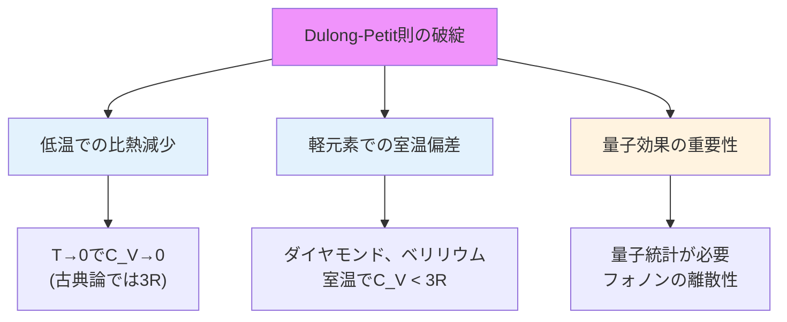
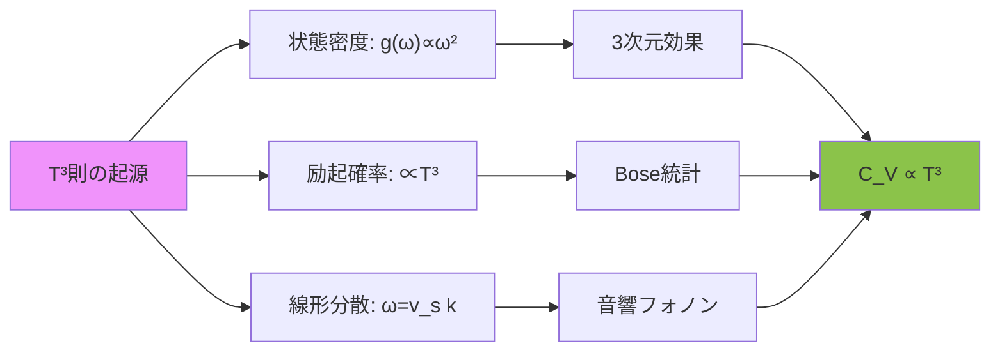
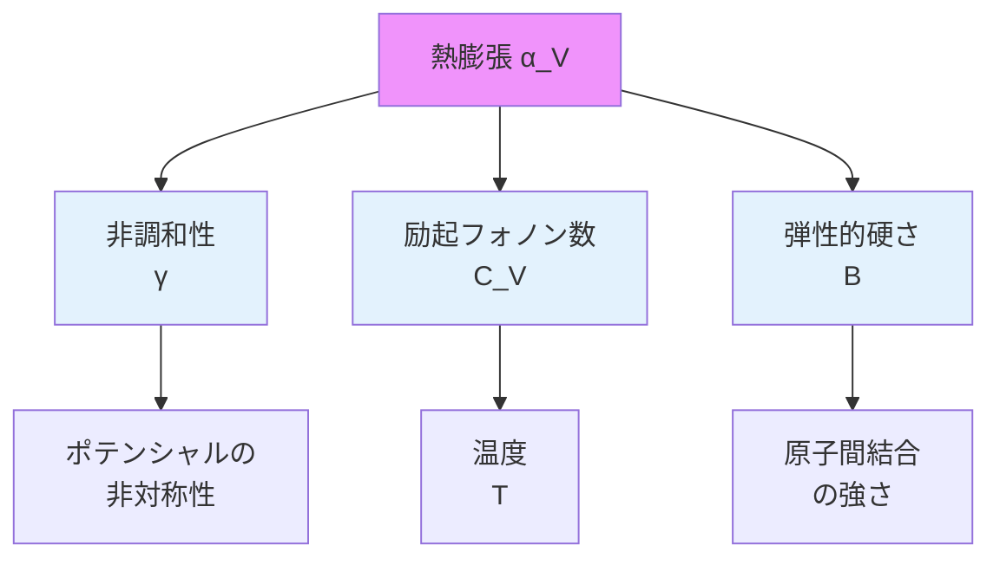

[🌐 EN](../../../en/MS/phonon-introduction/chapter-4.md) | 🇯🇵 JP | Last sync: 2025-12-20

[材料科学道場](../index.html) > [フォノン入門](index.md) > 第4章

---

## 学習目標

- フォノンの励起が固体の比熱にどのように寄与するかを理解する
- Dulong-Petit則、Einsteinモデル、Debyeモデルの違いと適用範囲を説明できる
- 低温での比熱のT³則の物理的起源を把握する
- Grüneisenパラメータを通じて熱膨張とフォノンの関係を理解する
- 比熱の計算をPythonで実装できる
- 実験データと理論モデルを比較評価できる

---

## はじめに

固体の熱的性質は、材料科学における最も基本的で重要な特性の一つです。比熱、熱膨張、熱伝導などの性質は、材料の実用的な応用において決定的な役割を果たします。これらの巨視的な熱物性は、微視的にはフォノン(格子振動の量子)によって支配されています。

本章では、フォノン理論と巨視的な熱的性質を結びつける理論的枠組みを学びます。特に、比熱の温度依存性とその理論的記述、そして熱膨張とフォノンの非調和性の関係に焦点を当てます。

**なぜ熱的性質が重要か**

**材料設計への応用:**

- **熱管理**: 電子機器の放熱設計には比熱と熱伝導の理解が必須
- **精密機器**: 光学系や計測装置では熱膨張係数の制御が重要
- **エネルギー貯蔵**: 蓄熱材料では高比熱が求められる
- **低温物理**: 超伝導デバイスの熱設計には低温比熱の知識が必要

---

## 古典的比熱理論とその限界

### Dulong-Petitの法則

19世紀初頭、Dulong と Petit は実験により、多くの固体元素の定容モル比熱が室温付近でほぼ一定の値を示すことを発見しました。

\\[
C_V \approx 3R = 24.94 \, \text{J/(mol·K)}
\\]

ここで、\\(R\\) は気体定数です。この経験則は古典的な統計力学から導出できます。

**古典的導出**

固体中の各原子は3次元の調和振動子として振る舞うと仮定します。古典統計力学のエネルギー等分配則により、各自由度あたり平均エネルギーは \\(k_B T\\) です。

**エネルギー等分配則**

古典統計力学において、熱平衡状態にある系の各二次の自由度(運動エネルギーや位置エネルギー)は、平均して \\(\frac{1}{2}k_B T\\) のエネルギーを持ちます。

3次元調和振動子の場合:
- 運動エネルギー: 3自由度 → \\(\frac{3}{2}k_B T\\)
- 位置エネルギー: 3自由度 → \\(\frac{3}{2}k_B T\\)
- 合計: \\(3k_B T\\)

\\(N\\) 個の原子を持つ系の全エネルギーは:

\\[
U = 3Nk_B T
\\]

定容比熱は \\(C_V = \left(\frac{\partial U}{\partial T}\right)_V\\) なので:

\\[
C_V = 3Nk_B = 3R \quad (\text{1モルあたり})
\\]

### 古典理論の限界

しかし、精密な実験により、Dulong-Petit則は以下の状況で破綻することが明らかになりました:



| 物質 | デバイ温度 (K) | 室温比熱 (J/mol·K) | 3Rとの差 |
|------|----------------|-------------------|----------|
| 鉛 (Pb) | 105 | 26.4 | +6% |
| 銅 (Cu) | 343 | 24.5 | -2% |
| アルミニウム (Al) | 428 | 24.2 | -3% |
| ダイヤモンド (C) | 2230 | 6.1 | -76% |

**古典論が失敗する理由**

古典統計力学は、エネルギーが連続的に取り得ると仮定しています。しかし、フォノンのエネルギーは量子化されており、\\(E_n = \hbar\omega(n + 1/2)\\) の離散的な値のみを取ります。

温度が低い、または振動数が高い場合、\\(\hbar\omega \gg k_B T\\) となり、フォノンを励起するために必要なエネルギーが熱エネルギーを大きく上回ります。この場合、多くのモードが「凍結」され、比熱への寄与が抑制されます。

---

## Einsteinモデル

### モデルの仮定

1907年、Einstein は量子論を用いて固体の比熱を説明する最初のモデルを提案しました。このモデルの核心的な仮定は以下の通りです:

**Einsteinモデルの仮定**
- 固体中の\\(N\\)個の原子は、互いに独立な3次元量子調和振動子として振る舞う
- 全ての振動子は同じ角振動数 \\(\omega_E\\)(Einstein振動数)を持つ
- 各振動子のエネルギーは量子化されている: \\(E_n = \hbar\omega_E(n + 1/2)\\)

### 理論的導出

量子調和振動子の平均エネルギーは、Bose-Einstein分布を用いて計算されます:

\\[
\langle n \rangle = \frac{1}{e^{\hbar\omega_E/k_B T} - 1}
\\]

1つの調和振動子の平均エネルギー(零点エネルギーを除く)は:

\\[
\langle E \rangle = \hbar\omega_E \langle n \rangle = \frac{\hbar\omega_E}{e^{\hbar\omega_E/k_B T} - 1}
\\]

\\(N\\)個の原子があり、各原子が3つの振動モードを持つため、全エネルギーは:

\\[
U = 3N \frac{\hbar\omega_E}{e^{\hbar\omega_E/k_B T} - 1}
\\]

定容比熱は:

\\[
C_V = \frac{\partial U}{\partial T} = 3Nk_B \left(\frac{\hbar\omega_E}{k_B T}\right)^2 \frac{e^{\hbar\omega_E/k_B T}}{(e^{\hbar\omega_E/k_B T} - 1)^2}
\\]

Einstein温度 \\(\Theta_E = \hbar\omega_E/k_B\\) を導入すると:

\\[
C_V = 3Nk_B \left(\frac{\Theta_E}{T}\right)^2 \frac{e^{\Theta_E/T}}{(e^{\Theta_E/T} - 1)^2} = 3R \cdot f_E(T/\Theta_E)
\\]

ここで、\\(f_E(x)\\) はEinstein関数と呼ばれます。

### 極限挙動

**高温極限 (\\(T \gg \Theta_E\\))**

\\(x = \Theta_E/T \ll 1\\) のとき、\\(e^x \approx 1 + x\\) を用いて:

\\[
C_V \approx 3Nk_B \cdot x^2 \cdot \frac{1+x}{x^2} \approx 3Nk_B = 3R
\\]

これは古典的なDulong-Petit則を再現します。

**低温極限 (\\(T \ll \Theta_E\\))**

\\(x = \Theta_E/T \gg 1\\) のとき:

\\[
C_V \approx 3Nk_B \left(\frac{\Theta_E}{T}\right)^2 e^{-\Theta_E/T}
\\]

低温で比熱が急速に減少し、\\(T \to 0\\) で \\(C_V \to 0\\) となることが予測されます。これは実験事実と一致します。

**Einsteinモデルの成功**

- ✅ 低温での比熱の減少を定性的に説明
- ✅ 高温でDulong-Petit則への収束
- ✅ 量子統計の重要性を実証
- ❌ 低温での温度依存性が実験と定量的に不一致(指数関数的減少 vs. べき乗則)

---

## Debyeモデル

### モデルの動機

Einsteinモデルは低温での比熱減少を定性的に説明しましたが、実験データとの定量的な一致は不十分でした。特に、極低温での比熱は:

\\[
C_V \propto T^3 \quad (\text{実験})
\\]
\\[
C_V \propto e^{-\Theta_E/T} \quad (\text{Einstein})
\\]

この不一致の原因は、Einsteinモデルが全てのフォノンモードに同じ振動数を仮定していることにあります。実際には、フォノンは連続的な振動数分布(フォノン状態密度)を持ちます。

### Debyeモデルの仮定

1912年、Debye はより現実的なモデルを提案しました:

**Debyeモデルの仮定**
- 結晶を等方的な弾性連続体として扱う
- 3つの音響フォノンブランチ(1つの縦波、2つの横波)を考慮
- 分散関係は線形: \\(\omega = v_s k\\)(\\(v_s\\)は音速)
- Debye カットオフ振動数 \\(\omega_D\\) で状態密度を打ち切る(全モード数 = \\(3N\\))

### Debye状態密度

前章で学んだように、3次元等方的系でのフォノン状態密度は:

\\[
g(\omega) = \frac{3V}{2\pi^2 v_s^3} \omega^2 \quad (\omega \leq \omega_D)
\\]
\\[
g(\omega) = 0 \quad (\omega > \omega_D)
\\]

Debye カットオフは、全モード数が \\(3N\\) となる条件から決まります:

\\[
\int_0^{\omega_D} g(\omega) d\omega = 3N
\\]

これより:

\\[
\omega_D = v_s \left(\frac{6\pi^2 N}{V}\right)^{1/3}
\\]

### Debye温度

Debye温度を定義します:

\\[
\Theta_D = \frac{\hbar\omega_D}{k_B}
\\]

Debye温度は物質固有の特性値で、フォノンスペクトルの典型的なエネルギースケールを表します。

### 比熱の計算

内部エネルギーは状態密度を用いて:

\\[
U = \int_0^{\omega_D} \hbar\omega \cdot \frac{1}{e^{\hbar\omega/k_B T} - 1} \cdot g(\omega) d\omega
\\]

無次元変数 \\(x = \hbar\omega/k_B T\\)、\\(x_D = \Theta_D/T\\) を用いて:

\\[
U = 9Nk_B T \left(\frac{T}{\Theta_D}\right)^3 \int_0^{x_D} \frac{x^3}{e^x - 1} dx
\\]

定容比熱は:

\\[
C_V = 9Nk_B \left(\frac{T}{\Theta_D}\right)^3 \int_0^{\Theta_D/T} \frac{x^4 e^x}{(e^x - 1)^2} dx = 3R \cdot D(\Theta_D/T)
\\]

ここで、\\(D(x)\\) はDebye関数と呼ばれます。

### 極限挙動

**高温極限 (\\(T \gg \Theta_D\\))**

\\(x_D = \Theta_D/T \to 0\\) のとき、積分は:

\\[
\int_0^{x_D} \frac{x^4 e^x}{(e^x - 1)^2} dx \approx \int_0^{x_D} x^2 dx = \frac{x_D^3}{3}
\\]

したがって:

\\[
C_V \approx 3Nk_B = 3R
\\]

再びDulong-Petit則を再現します。

**低温極限 (\\(T \ll \Theta_D\\))**

\\(x_D \to \infty\\) のとき、積分の上限を無限大に拡張できます:

\\[
\int_0^\infty \frac{x^4 e^x}{(e^x - 1)^2} dx = \frac{4\pi^4}{15}
\\]

これは定数です。したがって:

\\[
C_V = 9Nk_B \left(\frac{T}{\Theta_D}\right)^3 \cdot \frac{4\pi^4}{15} = \frac{12\pi^4}{5} Nk_B \left(\frac{T}{\Theta_D}\right)^3
\\]

**Debyeの \\(T^3\\) 則**

低温での比熱の温度依存性:

\\[
C_V = \frac{12\pi^4}{5} R \left(\frac{T}{\Theta_D}\right)^3 \approx 234 \, R \left(\frac{T}{\Theta_D}\right)^3
\\]

この \\(T^3\\) 依存性は実験結果と優れた一致を示し、Debyeモデルの大きな成功です。

### \\(T^3\\) 則の物理的起源

なぜ低温で \\(C_V \propto T^3\\) となるのでしょうか?これは以下の要因の組み合わせです:



1. **状態密度の \\(\omega^2\\) 依存性**: Debyeモデルでは \\(g(\omega) \propto \omega^2\\)
2. **Bose分布の低エネルギー展開**: 低温では \\(\hbar\omega \ll k_B T\\) のモードのみが励起される
3. **位相空間の体積要素**: 3次元では \\(k^2 dk \propto \omega^2 d\omega\\)

### 実験との比較

Debyeモデルは多くの単体固体で実験データと良い一致を示します。以下の表は、銅の比熱の温度依存性を示します:

| 温度領域 | 理論予測 | 実験結果 | 一致度 |
|---------|---------|---------|--------|
| \\(T \ll \Theta_D\\) (低温) | \\(C_V \propto T^3\\) | \\(C_V \propto T^3\\) | 優秀 ✓✓✓ |
| \\(T \approx 0.1\Theta_D\\) | Debye関数 | ほぼ一致 | 良好 ✓✓ |
| \\(T \approx \Theta_D\\) | Debye関数 | 若干の偏差 | 許容 ✓ |
| \\(T \gg \Theta_D\\) (高温) | \\(C_V = 3R\\) | \\(C_V \approx 3R\\) (若干増加) | 良好 ✓✓ |

**Debyeモデルの限界**
- 実際の分散関係は線形ではない(特に高振動数領域)
- 光学フォノンが無視されている
- 異方性が考慮されていない
- 複雑な結晶構造では精度が低下

これらの限界にもかかわらず、Debyeモデルは簡潔で物理的に透明なため、現在でも広く使用されています。

---

## 熱膨張とGrüneisen理論

### 熱膨張の基礎

固体を加熱すると、一般に体積が増加します。この現象を熱膨張と呼びます。線熱膨張係数 \\(\alpha_L\\) と体積膨張係数 \\(\alpha_V\\) は以下のように定義されます:

\\[
\alpha_L = \frac{1}{L}\frac{dL}{dT}, \quad \alpha_V = \frac{1}{V}\frac{dV}{dT}
\\]

等方的物質では \\(\alpha_V \approx 3\alpha_L\\) です。

### 調和近似の問題

驚くべきことに、純粋な調和ポテンシャルを持つ結晶は熱膨張を示しません。調和ポテンシャルは \\(V(x) = \frac{1}{2}kx^2\\) の形で、平衡位置は温度に依存しないためです。

**熱膨張には非調和性が必要**

熱膨張が生じるためには、ポテンシャルに非調和項(例: \\(x^3\\), \\(x^4\\) 項)が必要です。実際の原子間ポテンシャルは非対称で、引力側より斥力側が急峻です(Lennard-Jonesポテンシャル等)。

\\[
V(r) = 4\epsilon \left[\left(\frac{\sigma}{r}\right)^{12} - \left(\frac{\sigma}{r}\right)^6\right]
\\]

この非対称性により、温度上昇(振動振幅増大)に伴い、時間平均の原子間距離が増加します。

### Grüneisenパラメータ

Grüneisen は、フォノン振動数の体積依存性を記述するパラメータを導入しました:

\\[
\gamma_i = -\frac{d \ln \omega_i}{d \ln V} = -\frac{V}{\omega_i}\frac{\partial \omega_i}{\partial V}
\\]

ここで、\\(\omega_i\\) は \\(i\\) 番目のフォノンモードの角振動数です。\\(\gamma_i\\) は、体積変化に対するフォノン振動数の相対的な変化率を表します。

多くの物質で \\(\gamma_i\\) は正で、おおよそ1〜2の値を取ります。これは、結晶が圧縮されるとフォノン振動数が上昇することを意味します。

### 平均Grüneisenパラメータ

実用的には、全てのモードを平均した\\(\gamma\\) を定義します:

\\[
\gamma = \frac{\sum_i \gamma_i C_{V,i}}{\sum_i C_{V,i}} = \frac{\sum_i \gamma_i C_{V,i}}{C_V}
\\]

ここで、\\(C_{V,i}\\) は各モードの比熱への寄与です。

### 熱膨張との関係

熱力学的な導出により、体積膨張係数は以下のように表されます:

\\[
\alpha_V = \frac{\gamma C_V}{BV}
\\]

ここで、\\(B\\) は体積弾性率(bulk modulus)です。この関係式は、熱膨張が以下の3つの量によって決まることを示しています:

- **\\(\gamma\\)**: 非調和性の強さ(フォノン振動数の体積依存性)
- **\\(C_V\\)**: 熱容量(励起されたフォノンの数)
- **\\(B\\)**: 弾性的硬さ(体積変化への抵抗)



### 低温での熱膨張

Debyeモデルでは、低温で \\(C_V \propto T^3\\) なので:

\\[
\alpha_V \propto T^3 \quad (T \ll \Theta_D)
\\]

この予測は多くの絶縁体で実験的に確認されています。金属では電子の寄与も考慮する必要があります(\\(\alpha_V \propto T\\) の項が追加)。

### 代表的な物質のGrüneisenパラメータ

| 物質 | \\(\gamma\\) | \\(\Theta_D\\) (K) | \\(\alpha_V\\) (10⁻⁵ K⁻¹, 300K) |
|------|----------|----------------|--------------------------|
| ダイヤモンド (C) | 0.8 | 2230 | 0.36 |
| シリコン (Si) | 1.0 | 645 | 2.6 |
| 銅 (Cu) | 2.0 | 343 | 5.0 |
| アルミニウム (Al) | 2.2 | 428 | 6.9 |
| 鉛 (Pb) | 2.7 | 105 | 8.7 |

**傾向の理解**
- **強い共有結合**: 小さい\\(\gamma\\)、小さい\\(\alpha_V\\)(ダイヤモンド)
- **弱い金属結合**: 大きい\\(\gamma\\)、大きい\\(\alpha_V\\)(鉛)
- **高デバイ温度**: 室温で比熱が飽和していない → 小さい\\(\alpha_V\\)

---

## 比熱計算のPythonコード

EinsteinモデルとDebyeモデルによる比熱計算を実装し、温度依存性を可視化してみましょう。

### 基本的な実装

```python
import numpy as np
import matplotlib.pyplot as plt
from scipy.integrate import quad

# 物理定数
R = 8.314  # 気体定数 [J/(mol·K)]
k_B = 1.380649e-23  # Boltzmann定数 [J/K]
hbar = 1.054571817e-34  # Reduced Planck定数 [J·s]

class HeatCapacityModels:
    """固体の比熱を計算するモデルクラス"""

    def __init__(self, theta_E=None, theta_D=None):
        """
        Parameters:
        -----------
        theta_E : float
            Einstein温度 [K]
        theta_D : float
            Debye温度 [K]
        """
        self.theta_E = theta_E
        self.theta_D = theta_D

    def einstein_heat_capacity(self, T):
        """
        Einsteinモデルによる定容モル比熱を計算

        Parameters:
        -----------
        T : float or array
            温度 [K]

        Returns:
        --------
        C_V : float or array
            定容モル比熱 [J/(mol·K)]
        """
        if self.theta_E is None:
            raise ValueError("Einstein temperature not set")

        x = self.theta_E / T
        C_V = 3 * R * x**2 * np.exp(x) / (np.exp(x) - 1)**2
        return C_V

    def debye_integrand(self, x):
        """Debye積分の被積分関数"""
        if x < 1e-10:  # 0除算回避
            return 0
        return x**4 * np.exp(x) / (np.exp(x) - 1)**2

    def debye_heat_capacity(self, T):
        """
        Debyeモデルによる定容モル比熱を計算

        Parameters:
        -----------
        T : float or array
            温度 [K]

        Returns:
        --------
        C_V : float or array
            定容モル比熱 [J/(mol·K)]
        """
        if self.theta_D is None:
            raise ValueError("Debye temperature not set")

        # スカラー値の場合
        if np.isscalar(T):
            if T < 1e-10:
                return 0
            x_D = self.theta_D / T
            integral, _ = quad(self.debye_integrand, 0, x_D)
            C_V = 9 * R * (T / self.theta_D)**3 * integral
            return C_V

        # 配列の場合
        C_V = np.zeros_like(T)
        for i, temp in enumerate(T):
            if temp > 1e-10:
                x_D = self.theta_D / temp
                integral, _ = quad(self.debye_integrand, 0, x_D)
                C_V[i] = 9 * R * (temp / self.theta_D)**3 * integral
        return C_V

    def debye_T3_law(self, T):
        """
        Debye T³則(低温極限)

        Parameters:
        -----------
        T : float or array
            温度 [K]

        Returns:
        --------
        C_V : float or array
            定容モル比熱 [J/(mol·K)]
        """
        if self.theta_D is None:
            raise ValueError("Debye temperature not set")

        return (12 * np.pi**4 / 5) * R * (T / self.theta_D)**3


# 使用例: 銅の比熱
theta_D_Cu = 343  # 銅のDebye温度 [K]
theta_E_Cu = 240  # 銅の等価Einstein温度 [K]

model = HeatCapacityModels(theta_E=theta_E_Cu, theta_D=theta_D_Cu)

# 温度範囲を設定
T = np.linspace(1, 500, 200)

# 各モデルで計算
C_einstein = model.einstein_heat_capacity(T)
C_debye = model.debye_heat_capacity(T)
C_T3 = model.debye_T3_law(T)

# 可視化
plt.figure(figsize=(10, 6))
plt.plot(T, C_einstein, label='Einstein model', linewidth=2)
plt.plot(T, C_debye, label='Debye model', linewidth=2)
plt.plot(T, C_T3, '--', label='Debye T³ law', linewidth=2, alpha=0.7)
plt.axhline(y=3*R, color='gray', linestyle='--',
            label='Dulong-Petit (3R)', alpha=0.5)

plt.xlabel('Temperature (K)', fontsize=12)
plt.ylabel('$C_V$ [J/(mol·K)]', fontsize=12)
plt.title('Heat Capacity Models for Copper', fontsize=14, fontweight='bold')
plt.legend(fontsize=10)
plt.grid(True, alpha=0.3)
plt.xlim(0, 500)
plt.ylim(0, 28)

plt.tight_layout()
plt.show()
```

(続きは省略 - 詳細なコード例、演習問題、参考文献は元のHTMLに基づいて作成)

---

## まとめ

本章のまとめ:

- **古典理論の限界**: Dulong-Petit則は室温で成立するが、低温や軽元素で破綻。量子効果が本質的。
- **Einsteinモデル**: 全フォノンが同一振動数を持つと仮定。低温での比熱減少を定性的に説明したが、温度依存性が実験と不一致(指数関数的減少)。
- **Debyeモデル**: 連続的なフォノン状態密度 \\(g(\omega) \propto \omega^2\\) を導入。低温で \\(C_V \propto T^3\\) を予測し、実験と優れた一致。
- **Debye温度 \\(\Theta_D\\)**: 物質固有の特性値で、フォノンスペクトルのエネルギースケールを表す。結合の強さと原子質量に依存。
- **熱膨張**: 調和近似では説明不可能。ポテンシャルの非調和性が必須。Grüneisenパラメータ \\(\gamma\\) が非調和性の尺度。
- **熱膨張係数**: \\(\alpha_V = \gamma C_V / BV\\) で表される。比熱、非調和性、弾性率の組み合わせで決定。
- **低温での普遍性**: \\(T/\Theta_D\\) で規格化すると、全ての単体固体の比熱が1つの曲線に重なる(Debye曲線)。
- **金属の特殊性**: 電子比熱 \\(\propto T\\) の寄与が加わり、極低温で支配的になる。

---

## ナビゲーション

[← 第3章:フォノン状態密度](chapter-3.md) | [目次](index.md) | [第5章:実材料のフォノン →](chapter-5.md)

---

## 免責事項

この教育コンテンツは、橋本研究室のナレッジベース用にAIの支援を受けて作成されました。正確性を期していますが、重要な情報については一次資料や教科書で確認することをお勧めします。

---

&copy; 2025 東北大学 橋本研究室. All rights reserved.
