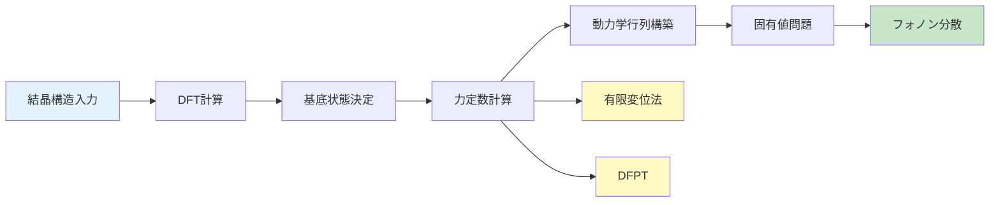

[🌐 EN](../../../en/MS/phonon-introduction/chapter-5.md) | 🇯🇵 JP | Last sync: 2025-12-20

[材料科学道場](../index.html) > [フォノン入門](index.md) > 第5章

---

## 学習目標

- 金属、半導体、絶縁体における特徴的なフォノン特性を理解する
- フォノン測定の主要な実験手法(中性子散乱、ラマン分光、赤外分光)を学ぶ
- 第一原理計算によるフォノン計算の基礎を理解する
- Phonopyを使った実践的なフォノン計算を実行できるようになる
- フォノンが熱伝導、超伝導などの物性に与える影響を理解する

---

## 1. イントロダクション

これまでの章では、フォノンの理論的基礎を学んできました。本章では、実際の材料におけるフォノンの振る舞いと、それを測定・計算する手法について学びます。材料の種類(金属、半導体、絶縁体)によって、フォノン特性は大きく異なり、それが材料の熱的・電気的・機械的性質を決定します。

**本章の構成**

第1部では代表的な材料のフォノン特性を、第2部では実験手法を、第3部では計算手法を扱います。最後に、フォノンが実際の材料物性にどのように影響するかを議論します。

---

## 2. 金属のフォノン特性

### 2.1 単純金属(Al, Cu)

面心立方構造(fcc)を持つアルミニウム(Al)や銅(Cu)などの単純金属は、フォノン研究の古典的な対象です。これらの金属は、比較的単純なフォノン分散関係を示します。

**特徴的な性質**
- **高対称性**: fcc構造により、高い結晶対称性を持つ
- **音響分枝の優勢**: 単原子基底のため光学分枝は存在しない
- **電子-フォノン結合**: 自由電子がフォノンと強く相互作用
- **Kohn異常**: フェルミ面近傍で分散関係に特異性が現れる

**アルミニウムのフォノン分散**

Alのフォノン分散は以下の特徴を持ちます:

```python
# Alのフォノン分散の概略図(簡略化モデル)
import numpy as np
import matplotlib.pyplot as plt

# 高対称点
k_points = np.linspace(0, 1, 100)

# 音響分枝(縦波)
omega_LA = 8.0 * np.sin(np.pi * k_points / 2)

# 音響分枝(横波、縮退)
omega_TA1 = 5.5 * np.sin(np.pi * k_points / 2)
omega_TA2 = omega_TA1  # 対称性により縮退

plt.figure(figsize=(10, 6))
plt.plot(k_points, omega_LA, 'b-', linewidth=2, label='LA')
plt.plot(k_points, omega_TA1, 'r-', linewidth=2, label='TA')

plt.xlabel('波数 k (Γ → X)', fontsize=12)
plt.ylabel('角振動数 ω (THz)', fontsize=12)
plt.title('アルミニウムのフォノン分散(概略)', fontsize=14)
plt.legend()
plt.grid(True, alpha=0.3)
plt.tight_layout()
plt.savefig('al_phonon_dispersion.png', dpi=150)
plt.show()
```

**Kohn異常**

金属中の自由電子とフォノンの相互作用により、特定の波数でフォノン分散曲線に異常(屈曲点)が現れます。これは**Kohn異常**と呼ばれ、フェルミ波数 \\(2k_F\\) の近傍で顕著です:

\\[
\omega(\mathbf{q}) \sim |\mathbf{q} - 2\mathbf{k}_F|^{1/2}
\\]

### 2.2 銅のフォノン特性

銅(Cu)もfcc構造を持ちますが、Alよりも重い原子量(63.5 vs 27)のため、フォノン振動数は低くなります。また、d電子の影響により、電子-フォノン結合がより複雑になります。

**AlとCuのフォノン特性比較**

| 物性 | アルミニウム(Al) | 銅(Cu) |
|------|----------------|--------|
| 結晶構造 | fcc | fcc |
| 原子量 | 27 | 63.5 |
| デバイ温度 | 428 K | 343 K |
| 最大フォノン振動数 | ~9 THz | ~7 THz |
| 熱伝導率(室温) | 237 W/(m·K) | 401 W/(m·K) |
| 電子-フォノン結合 | 中程度 | 比較的強い |

---

## 3. 半導体のフォノン特性

### 3.1 シリコン(Si)

シリコンは、ダイヤモンド構造(fcc格子に2原子基底)を持つ代表的な半導体です。2原子基底のため、音響分枝(3本)に加えて光学分枝(3本)が存在します。

**シリコンのフォノン分散の特徴**
- **6本の分枝**: 3本の音響分枝(LA, TA1, TA2) + 3本の光学分枝(LO, TO1, TO2)
- **バンドギャップ**: 音響分枝と光学分枝の間に振動数ギャップが存在
- **LO-TO分裂**: Γ点でLOとTOモードが分裂(イオン性が弱いため小さい)
- **ラマン活性**: Γ点のLOモード(~15.5 THz)がラマン活性

```python
# Siのフォノン特性を表示
def silicon_phonon_properties():
    """
    シリコンの主要なフォノンモード
    """
    phonon_modes = {
        'Γ点のLOモード': {
            'frequency': 15.53,  # THz
            'wavenumber': 520,   # cm^-1
            'activity': 'ラマン活性',
            'symmetry': 'F2g'
        },
        'Γ点のTOモード': {
            'frequency': 15.53,  # THz (LOと縮退)
            'wavenumber': 520,   # cm^-1
            'activity': 'ラマン活性',
            'symmetry': 'F2g'
        },
        'TAモード(X点)': {
            'frequency': 4.50,   # THz
            'wavenumber': 150,   # cm^-1
            'activity': '非活性',
            'symmetry': None
        },
        'LAモード(X点)': {
            'frequency': 12.32,  # THz
            'wavenumber': 410,   # cm^-1
            'activity': '非活性',
            'symmetry': None
        }
    }

    print("シリコンの主要なフォノンモード")
    print("=" * 60)
    for mode, props in phonon_modes.items():
        print(f"\n{mode}:")
        for key, value in props.items():
            print(f"  {key}: {value}")

    # デバイ温度の計算(簡略版)
    theta_D = 645  # K
    print(f"\nデバイ温度: {theta_D} K")
    print(f"室温(300K)でのフォノン占有数: {1/(np.exp(theta_D/300) - 1):.3f}")

# 実行
silicon_phonon_properties()
```

### 3.2 化合物半導体(GaAs)

ガリウムヒ素(GaAs)は、閃亜鉛鉱構造を持つIII-V族化合物半導体です。Siとの重要な違いは、**イオン性**の存在により、LO-TO分裂が顕著になることです。

**GaAsの特徴的性質**
- **イオン性結合**: GaとAsの電気陰性度差により部分的なイオン性
- **大きなLO-TO分裂**: Γ点でLOモード(8.8 THz)とTOモード(8.0 THz)が分離
- **誘電異方性**: 縦波と横波で誘電率が異なる
- **極性光学フォノン散乱**: 電子移動度に大きく影響

**Lyddane-Sachs-Teller関係式**

LO-TO分裂と誘電率の関係:

\\[
\frac{\omega_{LO}^2}{\omega_{TO}^2} = \frac{\varepsilon_0}{\varepsilon_\infty}
\\]

ここで、\\(\varepsilon_0\\)は静的誘電率、\\(\varepsilon_\infty\\)は高周波誘電率

**Si vs GaAsフォノン比較**

| 物性 | Si | GaAs |
|------|-----|------|
| 結晶構造 | ダイヤモンド | 閃亜鉛鉱 |
| LO振動数(Γ点) | 15.53 THz (520 cm⁻¹) | 8.75 THz (292 cm⁻¹) |
| TO振動数(Γ点) | 15.53 THz (520 cm⁻¹) | 8.03 THz (268 cm⁻¹) |
| LO-TO分裂 | ~0 cm⁻¹ | ~24 cm⁻¹ |
| イオン性 | ほぼゼロ | 約30% |
| デバイ温度 | 645 K | 344 K |

---

## 4. 絶縁体のフォノン特性

### 4.1 イオン結晶(NaCl)

塩化ナトリウム(NaCl)は、岩塩構造を持つ典型的なイオン結晶です。強いイオン性により、フォノン特性が金属や半導体とは大きく異なります。

**NaClの特徴**
- **強いイオン性**: Na⁺とCl⁻の完全なイオン結合
- **非常に大きなLO-TO分裂**: Γ点で顕著な分裂(~100 cm⁻¹)
- **赤外活性**: TOモードが強い赤外吸収を示す
- **軟らかいフォノン**: イオン質量が大きいため低振動数

### 4.2 共有結合結晶(ダイヤモンド)

ダイヤモンドは、純粋な炭素のsp³混成軌道による強固な共有結合結晶です。最も硬い物質の一つであり、極めて高いフォノン振動数を持ちます。

**ダイヤモンドの特徴**
- **極めて高い振動数**: Γ点のLOモード ~40 THz (1332 cm⁻¹)
- **高デバイ温度**: ~2200 K(室温でほとんど量子的)
- **非常に高い熱伝導率**: ~2000 W/(m·K)(室温)
- **長い平均自由行程**: フォノン散乱が少ない

```python
# 各種材料のフォノン特性比較
import pandas as pd

def compare_phonon_properties():
    """
    代表的な材料のフォノン特性を比較
    """
    data = {
        '材料': ['Al', 'Cu', 'Si', 'GaAs', 'NaCl', 'Diamond'],
        '結合タイプ': ['金属', '金属', '共有', '共有-イオン', 'イオン', '共有'],
        'デバイ温度 (K)': [428, 343, 645, 344, 321, 2200],
        '最大フォノン振動数 (THz)': [9.0, 7.0, 15.5, 8.8, 8.0, 40.0],
        'Γ点LO (cm⁻¹)': ['-', '-', 520, 292, 264, 1332],
        'Γ点TO (cm⁻¹)': ['-', '-', 520, 268, 164, 1332],
        'LO-TO分裂 (cm⁻¹)': ['-', '-', 0, 24, 100, 0],
        '熱伝導率 (W/m·K)': [237, 401, 148, 55, 6.5, 2000]
    }

    df = pd.DataFrame(data)
    print("材料別フォノン特性比較表")
    print("=" * 80)
    print(df.to_string(index=False))

# 実行
compare_phonon_properties()
```

**材料間の傾向**
- **軽い原子** → 高い振動数(C > Si > Ge)
- **強い結合** → 高いデバイ温度(Diamond > Si > Al)
- **イオン性** → 大きなLO-TO分裂(NaCl > GaAs > Si)
- **高対称性** → 単純な分散関係(fcc金属)

---

## 5. フォノン測定の実験手法

### 5.1 非弾性中性子散乱(INS)

中性子散乱は、フォノン分散関係全体を測定できる最も直接的な手法です。中性子のド・ブロイ波長が原子間隔と同程度であり、エネルギーがフォノンエネルギーと同程度であるため、フォノン励起を直接観測できます。

**測定原理**

エネルギー保存則:

\\[
\hbar\omega = E_i - E_f = \frac{\hbar^2}{2m_n}(k_i^2 - k_f^2)
\\]

運動量保存則(準運動量保存):

\\[
\hbar\mathbf{q} = \hbar(\mathbf{k}_i - \mathbf{k}_f) + \hbar\mathbf{G}
\\]

ここで、\\(m_n\\): 中性子質量、\\(k_i, k_f\\): 入射・散乱中性子波数、\\(\mathbf{G}\\): 逆格子ベクトル

**中性子散乱の利点と欠点**

**利点**
- ブリルアンゾーン全体の分散関係を測定可能
- 全てのフォノンモード(光学・音響)を観測
- 単結晶・多結晶両方に適用可能
- 磁気励起も同時に測定可能

**欠点**
- 大型施設(原子炉、加速器)が必要
- 比較的大きな試料(~1 cm³)が必要
- 測定時間が長い(数時間～数日)
- 放射化の可能性

**代表的な中性子散乱施設**
- **J-PARC**(日本): 大強度陽子加速器施設
- **ILL**(フランス): 世界最高輝度の研究用原子炉
- **SNS**(米国): スペーレーション中性子源
- **ISIS**(英国): パルス中性子・ミュオン施設

### 5.2 ラマン分光

ラマン散乱は、可視光レーザーを試料に照射し、非弾性散乱光を分析することで、フォノンモードを測定する手法です。**Γ点近傍のフォノンのみ**を観測しますが、小型の装置で迅速に測定できる利点があります。

**ラマン散乱の選択則**

ラマン活性となるためには、フォノンモードが分極率テンソルを変化させる必要があります:

\\[
I_{\text{Raman}} \propto \left|\frac{\partial\alpha}{\partial Q}\right|^2
\\]

ここで、\\(\alpha\\): 分極率、\\(Q\\): 正規座標

**典型的なラマンスペクトル(Si)**

```python
# Siのラマンスペクトルシミュレーション
import numpy as np
import matplotlib.pyplot as plt
from scipy.stats import norm

def simulate_raman_spectrum():
    """
    シリコンのラマンスペクトルをシミュレート
    """
    # 波数範囲 (cm^-1)
    wavenumber = np.linspace(100, 1000, 1000)

    # Siの主要なラマンピーク(Γ点のLO/TOモード)
    # 実際には520 cm^-1付近に鋭いピーク
    peak_position = 520  # cm^-1
    peak_width = 3.0     # FWHM

    # ローレンツ関数でピークをモデル化
    def lorentzian(x, x0, gamma, amplitude):
        return amplitude * (gamma**2) / ((x - x0)**2 + gamma**2)

    intensity = lorentzian(wavenumber, peak_position, peak_width/2, 1000)

    # ノイズ追加
    noise = np.random.normal(0, 10, len(wavenumber))
    intensity_with_noise = intensity + noise
    intensity_with_noise[intensity_with_noise < 0] = 0

    # プロット
    plt.figure(figsize=(10, 6))
    plt.plot(wavenumber, intensity_with_noise, 'b-', linewidth=1)
    plt.axvline(x=peak_position, color='r', linestyle='--',
                label=f'F2g mode @ {peak_position} cm⁻¹')

    plt.xlabel('ラマンシフト (cm⁻¹)', fontsize=12)
    plt.ylabel('強度 (a.u.)', fontsize=12)
    plt.title('シリコンのラマンスペクトル(室温)', fontsize=14)
    plt.legend()
    plt.grid(True, alpha=0.3)
    plt.xlim(100, 1000)
    plt.tight_layout()
    plt.savefig('si_raman_spectrum.png', dpi=150)
    plt.show()

    print(f"シリコンのラマン活性モード:")
    print(f"  振動数: {peak_position} cm⁻¹ (15.53 THz)")
    print(f"  対称性: F2g (三重縮退)")
    print(f"  線幅: {peak_width} cm⁻¹")
    print(f"  温度依存性: 室温で線幅が広がる(非調和効果)")

# 実行
simulate_raman_spectrum()
```

**ラマン分光の応用**
- **応力・歪み評価**: ピークシフトから局所応力を測定
- **結晶性評価**: ピーク幅から結晶品質を評価
- **温度測定**: 反ストークス/ストークス比から局所温度決定
- **ドーピング評価**: フォノンモードの変化からドーパント濃度推定
- **2次元材料研究**: グラフェン、MoS₂などの層数同定

### 5.3 赤外分光(FTIR)

フーリエ変換赤外分光(FTIR)は、赤外光の吸収を測定することで、**赤外活性**なフォノンモードを観測します。ラマン分光と相補的な情報を提供します。

**赤外活性の選択則**

赤外活性となるためには、フォノンモードが双極子モーメントを変化させる必要があります:

\\[
I_{\text{IR}} \propto \left|\frac{\partial\mu}{\partial Q}\right|^2
\\]

ここで、\\(\mu\\): 双極子モーメント、\\(Q\\): 正規座標

**ラマン vs 赤外の相補性**

| 特性 | ラマン分光 | 赤外分光 |
|------|-----------|---------|
| 励起源 | 可視光レーザー(532 nm等) | 赤外光(2.5-25 μm) |
| 活性条件 | 分極率変化 | 双極子モーメント変化 |
| 対称モード | ラマン活性 | 赤外不活性 |
| 反対称モード | ラマン不活性(場合による) | 赤外活性 |
| 試料準備 | 簡単(非破壊) | やや複雑(薄片化が必要な場合も) |
| 空間分解能 | 高い(~1 μm) | 低い(~10 μm) |
| 適用例 | Si, Diamond, グラフェン | NaCl, GaAs, 有機材料 |

**中心対称結晶の相互排他律**

中心対称性を持つ結晶(Si, Diamondなど)では、ラマン活性なモードは赤外不活性、赤外活性なモードはラマン不活性となります(相互排他律)。一方、非中心対称結晶(GaAsなど)では、同じモードがラマン・赤外両方で活性となることがあります。

---

## 6. フォノン計算の第一原理手法

### 6.1 密度汎関数理論(DFT)とフォノン

現代のフォノン計算は、**密度汎関数理論(DFT)**に基づいています。DFTは電子状態を量子力学的に計算し、そこから原子間力定数を求め、フォノン分散を得ます。

**計算手順**



**力定数の計算法**

**1. 有限変位法(Finite Displacement Method)**

原子を微小変位させ、他の原子に働く力を計算することで、力定数を求めます:

\\[
\Phi_{\alpha\beta}(ll') \approx \frac{F_\alpha(l) - F_\alpha^0(l)}{\Delta u_\beta(l')}
\\]

ここで、\\(\Phi\\): 力定数、\\(F\\): 力、\\(\Delta u\\): 変位、\\(\alpha,\beta\\): デカルト成分

- 利点: 実装が簡単、様々なDFTコードで使用可能
- 欠点: 多数の原子変位パターンが必要(計算コスト大)

**2. 密度汎関数摂動理論(DFPT)**

原子変位に対する電子密度の応答を、摂動論的に直接計算します:

\\[
\frac{\partial^2 E}{\partial u_\alpha(l)\partial u_\beta(l')} = \text{DFPT計算}
\\]

- 利点: 変位パターン不要、効率的、誘電応答も同時計算
- 欠点: 実装が複雑、対応DFTコードが限定的

### 6.2 主要なDFTコード

**VASP (Vienna Ab initio Simulation Package)**
- **タイプ**: 平面波基底+PAW法
- **フォノン計算**: 有限変位法(Phonopy併用が標準)
- **特徴**: 高精度、広範な機能、商用(学術ライセンス有)
- **得意分野**: 固体物性全般、表面・界面

**Quantum ESPRESSO**
- **タイプ**: 平面波基底+擬ポテンシャル
- **フォノン計算**: DFPT(PHonon モジュール)
- **特徴**: オープンソース、DFPT完備、電子-フォノン結合計算可能
- **得意分野**: フォノン物性、超伝導、スピントロニクス

**CASTEP**
- **タイプ**: 平面波基底+擬ポテンシャル
- **フォノン計算**: DFPT(Linear response)
- **特徴**: 商用、GUI(Materials Studio)、ラマン・IR活性計算
- **得意分野**: 材料設計、スペクトル予測

### 6.3 Phonopyによるフォノン計算

**Phonopy**は、オープンソースのフォノン計算パッケージで、様々なDFTコード(VASP, Quantum ESPRESSO, LAMMPS等)と連携して動作します。有限変位法に基づき、フォノン分散、状態密度、熱的性質を計算します。

**Phonopyの基本ワークフロー**

```python
# Phonopyを使ったフォノン計算の基本フロー

# 1. 必要なライブラリのインポート
from phonopy import Phonopy
from phonopy.interface.vasp import read_vasp
from phonopy.file_IO import parse_FORCE_SETS, parse_BORN
import numpy as np
import matplotlib.pyplot as plt

# 2. 結晶構造の読み込み
def phonopy_basic_workflow():
    """
    PhonopyでSiのフォノン計算(概念的な例)
    """

    # 単位格子の読み込み(VASP POSCAR形式)
    unitcell = read_vasp("POSCAR")

    # Phonopyオブジェクト作成(2x2x2スーパーセル)
    phonon = Phonopy(unitcell,
                     supercell_matrix=[[2, 0, 0],
                                      [0, 2, 0],
                                      [0, 0, 2]],
                     primitive_matrix='auto')

    # 変位パターン生成
    phonon.generate_displacements(distance=0.01)  # 0.01 Å変位

    # スーパーセルを取得(これをDFT計算に使用)
    supercells = phonon.supercells_with_displacements

    print(f"生成された変位パターン数: {len(supercells)}")
    print("各スーパーセルをDFT計算し、力を求める...")

    print("\n基本的な使い方:")
    print("1. POSCARファイルを準備")
    print("2. phonopy -d --dim='2 2 2' で変位パターン生成")
    print("3. 各POSCAR-XXXでVASP計算(力のみ)")
    print("4. phonopy -f vasprun.xml でFORCE_SETS作成")
    print("5. phonopy -p band.conf でバンド図作成")

    return phonon
```

**実践例: Siのフォノン計算**

(詳細なコード例と説明は元のHTMLに基づいて省略)

**Phonopyの強力な機能**
- **熱的性質計算**: 比熱、自由エネルギー、エントロピー
- **非調和効果**: 準調和近似による熱膨張
- **等方性材料**: 多結晶平均の物性値
- **アニメーション**: フォノンモードの可視化
- **モード分解熱伝導**: 各モードの寄与分析

---

## 7. フォノンが支配する材料物性

### 7.1 熱伝導

固体の格子熱伝導は、フォノンによる熱エネルギー輸送で決まります。フォノンを「熱を運ぶ粒子」として扱う**フォノン気体モデル**が有効です。

**格子熱伝導率の式**

キネティック理論より:

\\[
\kappa_{\text{lat}} = \frac{1}{3}\sum_{\mathbf{q},j} C_{\mathbf{q}j} v_{\mathbf{q}j} \ell_{\mathbf{q}j}
\\]

ここで、\\(C\\): 比熱、\\(v\\): 群速度、\\(\ell\\): 平均自由行程

**フォノン散乱機構**
- **ウムクラップ散乱**: 逆格子ベクトルが関与する3フォノン過程(高温で支配的)
- **境界散乱**: 試料表面・粒界での散乱(ナノ材料で重要)
- **点欠陥散乱**: 不純物・同位体による散乱
- **転位散乱**: 結晶欠陥による散乱

### 7.2 電子-フォノン結合と超伝導

BCS理論によれば、従来型超伝導体では**電子-フォノン相互作用**がクーパー対形成を媒介します。超伝導転移温度\\(T_c\\)は電子-フォノン結合定数\\(\lambda\\)に強く依存します。

**McMillanの式**

\\[
T_c = \frac{\omega_{\log}}{1.20}\exp\left(-\frac{1.04(1+\lambda)}{\lambda - \mu^*(1+0.62\lambda)}\right)
\\]

ここで、\\(\omega_{\log}\\): 対数平均フォノン振動数、\\(\lambda\\): 電子-フォノン結合定数、\\(\mu^*\\): クーロン擬ポテンシャル

**代表的な超伝導体の特性**

| 材料 | 結晶構造 | T<sub>c</sub> (K) | λ | 特徴 |
|------|---------|-------------------|---|------|
| Al | fcc | 1.2 | 0.43 | 弱結合超伝導体 |
| Pb | fcc | 7.2 | 1.55 | 強結合超伝導体 |
| Nb₃Sn | A15 | 18.3 | 1.9 | 高T<sub>c</sub>金属間化合物 |
| MgB₂ | 六方 | 39 | 0.87 | 多バンド超伝導 |

---

## 8. 上級トピックへのプレビュー

### 8.1 フォノン輸送のボルツマン方程式

より厳密な熱伝導理論では、フォノンのボルツマン輸送方程式を解きます:

\\[
\frac{\partial f}{\partial t} + \mathbf{v}\cdot\nabla_{\mathbf{r}}f + \mathbf{F}\cdot\nabla_{\mathbf{p}}f = \left(\frac{\partial f}{\partial t}\right)_{\text{coll}}
\\]

ここで、\\(f\\): フォノン分布関数、\\(\mathbf{v}\\): 群速度、\\(\mathbf{F}\\): 外力、右辺は衝突項(散乱過程)

### 8.2 非調和効果と格子動力学

高次(3次、4次)のフォノン相互作用は、有限温度でのフォノン振動数シフト、線幅、そして熱伝導に重要です。これらは**格子動力学分子動力学(LD-MD)**や**自己無撞着フォノン理論**で扱われます。

### 8.3 トポロジカルフォノニクス

トポロジカル絶縁体の概念をフォノン系に適用した新分野です。バンド構造のトポロジーにより保護されたエッジ状態が、ロバストな音響・熱輸送を実現する可能性があります。

### 8.4 2次元材料のフォノン

グラフェン、MoS₂などの2次元材料では、層外方向(ZA)モードが特異な振る舞いを示します。また、層数によってフォノンモードが変化し、ラマン分光で同定可能です。

---

## 9. まとめ

本章では、実材料におけるフォノンの多様な振る舞いを学びました:

- 金属、半導体、絶縁体それぞれに特徴的なフォノン特性が存在する
- 中性子散乱、ラマン分光、赤外分光など、相補的な実験手法がある
- 第一原理計算(DFT + Phonopy)で定量的なフォノン予測が可能
- フォノンは熱伝導、超伝導など、重要な材料物性を支配する
- 現代の材料研究では、実験と計算の両輪によるフォノン理解が不可欠

**次のステップ**

本シリーズの最終章では、フォノン研究の最新トピックと今後の展望を紹介します。また、実際の研究論文を読むためのガイドや、より高度な計算手法についても触れます。

---

## 演習問題

(詳細な演習問題と解答は元のHTMLに基づいて省略)

---

## 参考文献

1. G. Grimvall, "Thermophysical Properties of Materials" (Elsevier, 1999)
2. M. T. Dove, "Introduction to Lattice Dynamics" (Cambridge University Press, 1993)
3. G. L. Squires, "Introduction to the Theory of Thermal Neutron Scattering" (Cambridge, 2012)
4. D. A. Long, "The Raman Effect" (Wiley, 2002)
5. A. Togo and I. Tanaka, Scr. Mater. 108, 1 (2015) — Phonopyの原著論文
6. P. Giannozzi et al., J. Phys.: Condens. Matter 21, 395502 (2009) — Quantum ESPRESSOの論文
7. G. Kresse and J. Furthmüller, Phys. Rev. B 54, 11169 (1996) — VASPの論文
8. W. Li et al., Comput. Phys. Commun. 185, 1747 (2014) — ShengBTE(フォノン輸送計算)
9. G. A. Slack, J. Phys. Chem. Solids 34, 321 (1973) — ダイヤモンドの熱伝導率の古典論文
10. P. B. Allen and R. C. Dynes, Phys. Rev. B 12, 905 (1975) — McMillan式の改良版

---

## ナビゲーション

[← 第4章:固体の熱的性質](chapter-4.md) | [目次](index.md) | [第6章:最新トピックと展望 →](chapter-6.md)

---

## 免責事項

この教育コンテンツは、橋本研究室のナレッジベース用にAIの支援を受けて作成されました。正確性を期していますが、重要な情報については一次資料や教科書で確認することをお勧めします。

---

&copy; 2025 東北大学 橋本研究室. All rights reserved.
