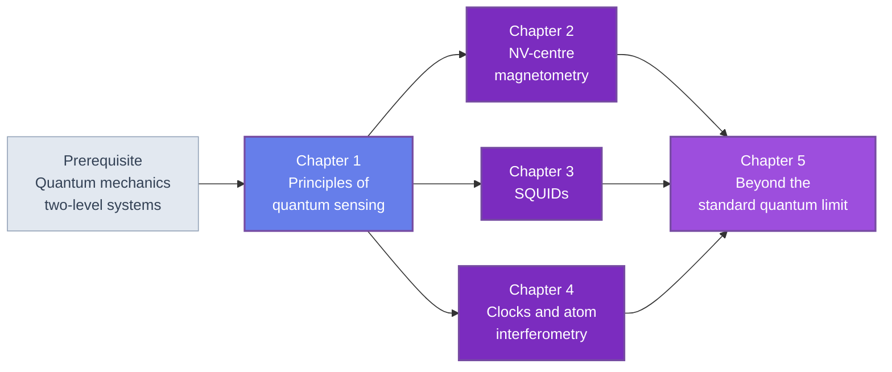

🌐 JP | [🇬🇧 EN](<../../../en/MS/quantum-sensing-introduction/index.html>) | Last sync: 2026-08-13

[AI寺子屋トップ](<../../index.html>)›[材料科学基礎道場](<../index.html>)›[量子センシング入門](<index.html>)

[← 材料科学基礎道場トップ](<../index.html>)

## 🎯 シリーズ概要

量子センシングは量子技術の第三の柱であり、そしてすでに機能している柱です。量子コンピューティングがエラー閾値を論じ、量子通信が中継器を論じている間、量子センサは何十年も実験室に座り、他の何にもできない測定を行ってきました。そしてその測定のかなりの割合が材料の測定です。

だから本コースは量子系の道場ではなく材料科学基礎道場に置かれています。ここでのダイヤモンド中の窒素-空孔（NV）中心は、まず量子ビットの候補ではありません。数十ナノメートルの分解能をもつ磁場顕微鏡であり、磁壁、2次元磁性体、反強磁性テクスチャ、そして動作中デバイスの電流分布を写すために使われます。SQUIDはまず超伝導回路ではありません。磁性の研究室がすでに所有している磁化率計であり磁束顕微鏡です。原子時計はまず周波数標準ではありません。測定の安定度をどう特性評価するかを他のすべての分野に教えた計測器です。こう読めば量子センシングは[X線回折](<../xrd-analysis-introduction/index.html>)、[分光](<../spectroscopy-introduction/index.html>)、[電子顕微鏡](<../electron-microscopy-introduction/index.html>)、[電気・磁気測定](<../electrical-magnetic-testing-introduction/index.html>)と並ぶ特性評価手法の一群であり、しかも他のどれも答えない問いに答えるものです。すなわち*試料に触れず、試料全体を平均することもなく、いまここの局所的な場は何か*という問いです。

本コースは1つの観察の周りに組み立てられています。ここに登場するあらゆる方式 — NV磁気計測、dc SQUID、光時計、原子干渉計、そして最後のもつれプローブの方式 — は、ハードウェアが違うだけの同じ干渉計です。第1章がそのテンプレートを確立し、コース全体のために感度 $\eta$ を一度定義し、射影ノイズ限界を導出して数値的に検証し、後続の4章がすべて呼び出す安定度とフィルター関数の機構を構築します。第2章・第3章・第4章はその3つの実例であり、どの順序でも読めます。ただし第3章・第4章の比較の箇所をそのまま受け取るには第2章が先である方が自然です。第5章はエンタングルメントが何を加えるかを問い、誠実に答えます。

この5章のあらゆる数値は、明記した式からNumPy・SciPy・Matplotlibで計算されています。計測器のSDKもベンダーのソフトウェアもハードウェアへのアクセスも一切ありません。

### 学習パス

第1章は最初に必須です。以降のコースが再説明せずに再利用する記法・感度の定義・数値の道具箱を固定するからです。第2章・第3章・第4章はそのあとおおむね並列です。3つの異なる方式系統を扱い、物理はそれぞれ独立に展開され、共有される導出は第1章のものだけです。ただし完全に自己完結ではありません。第3章は自分の数値を第2章のAC感度（§2.3）・$T_1$ リラクソメトリの帯域（§2.4）・漏れ磁場モデル（§2.5）と比較し、演習2つはそれらの結果を直接使います。第4章は §3.2 の磁束ロックループとSQUIDの動作温度に立ち戻ります。順に読めばこれらは比較として機能し、順序を変えて読めば、辿ってもよいし飛ばしてもよい前方参照になります。第5章は3つすべてを前提とします。エンタングルメントがそのいずれに何を加えるかが、まさにその論点だからです。

### 📋 学習目標

本シリーズを修了すると、以下のことができるようになります。

  * 任意の量子センシングのプロトコルをRamsey干渉計として書き、ビームスプリッタ・蓄積位相・読み出しを同定し、構造の共有が感度の式の共有について何を含意するかを説明できる
  * 感度 $\eta$ を「単位ルートヘルツあたりの信号」として定義し、射影ノイズから導出し、正しく使える — それが有効な外挿である平均時間と、そうでない平均時間を知ることを含めて
  * Allan偏差を計算し、その傾きから白色・フリッカー・ドリフトの各領域を同定し、測定をより長く平均すべきか代わりに変調すべきかを判断できる
  * 窒素-空孔中心の準位構造を説明し、ODMRスペクトルをシミュレートし、DC・AC・緩和の各プロトコルの感度を射影ノイズを含めて計算できる
  * 抵抗分岐接合（RSJ）モデルから dc SQUID の $V$-$\Phi$ 特性を導出し、磁束ノイズを磁場感度に換算し、ピックアップコイルの形状がすべてを決める理由を説明できる
  * 光格子時計と光パルス原子干渉計の動作原理を説明し、それぞれの位相感度を計算できる
  * 標準量子限界が何を禁じ何を禁じていないかを述べ、エンタングルメントによる利得を定量化し、デコヒーレンスがそれをどれほど速く消すかを数値的に実証できる
  * 任意の計測課題を「感度対空間分解能」の地図の上に置き、スケーリング則だけから量子センサが正しい計測器か誤った計測器かを判断できる

### 📖 前提知識

**必須。** 2準位系のレベルの量子力学: 重ね合わせ、Bloch球、RabiとRamseyのダイナミクス、そして測定の公理。馴染みがなければ[量子コンピューティング入門](<../../FM/quantum-computing-introduction/index.html>)の第1章と第2章がまさにこれを扱っています。

**強く推奨。** [量子ハードウェア入門](<../../FM/quantum-hardware-introduction/index.html>)、特に[その第1章](<../../FM/quantum-hardware-introduction/chapter-1.html>)。あの章が $T_1$、$T_2$、$T_2^\ast$、ノイズパワースペクトル密度、Ramsey系列とエコー系列、そしてフィルター関数の形式を定義しており、本コースはそのすべてを同じ意味・同じ記号で再導出せずに用います。2つのコースの関係は厳密です。ハードウェア編は2準位系に環境を気づかせない方法を問い、本コースは気づいた内容をどう読み出すかを問います。

**第3章に有用。** 磁束量子化とジョセフソン効果について[超伝導入門](<../superconductivity-introduction/index.html>)。第3章は必要な内容を復習しますが、その復習は駆け足です。

**第2章の応用に有用。** 磁区・磁壁・電流誘起テクスチャについて[スピントロニクス入門](<../spintronics-introduction/index.html>) — 走査磁気計測が写す対象そのものです。

**必要な環境。** Python 3.8以降、NumPy・SciPy・Matplotlib。それ以外は不要です。

* * *

## 📚 章構成

### 第1章: 量子センシングの原理

量子系が良い計測器になる理由。離散遷移は再現する周波数基準であり、重ね合わせの位相はそれを摂動したものの時間積分です。続いてテンプレート — 分割、蓄積、再結合、読み出し — を本コースの4方式について並べて書き出し、感度の式を一度だけ導出できるようにします。二項統計からの射影ノイズ、$N$ の6桁にわたるモンテカルロで検証した標準量子限界 $\delta\phi = 1/(C\sqrt{N})$、そして単位と3つの典型的な誤用とともに定義される感度 $\eta$。最適干渉時間 $\tau = T_2/2$ とデッドタイム補正。そして安定度: Allan偏差、その白色・フリッカー・ランダムウォークの各領域の数値的再現、そして安定度曲線なしに引用された感度が仕様の半分である理由。最後にフィルター関数を3通りに読み — デカップリングとして、ロックインアンプとして、そしてホスト材料の分光として — 残りのコースが航行に使う「感度対分解能」の地図を作ります。

**主要トピック** : 基準かつ変換器としての2準位系 · 万能テンプレートとしてのRamseyプロトコル · 射影ノイズ · 標準量子限界 · 感度 $\eta$ · 最適干渉時間 · デッドタイムとデューティ比 · Allan偏差 · フィルター関数 · AC感度 · 感度-分解能のトレードオフ

💻 コード例6個 ⏱️ 40-45分 📊 中級

[第1章を読む →](<chapter-1.html>)

### 第2章: NVセンター磁気計測

材料欠陥が計測器になる事例。窒素-空孔中心の準位構造、そのスピン依存蛍光、そして光検出磁気共鳴（ODMR） — 単一スピンを室温で読み出せるようにする機構です。CW-ODMRとRamseyによるDC磁気計測、そして第1章の感度の式を実際の準位構造に対して評価し数値的に確認します。AC磁気計測と動的デカップリング: HahnエコーからXY8まで、$T_2$ を延ばすのと同じパルス列がなぜ測定帯域も選択するのか、そしてフィルター関数の2つの読み方が同じ実験の中でどう使われるか。ギガヘルツのノイズのプローブとしての $T_1$ リラクソメトリ — どんなパルス系列もフィルターできない周波数に届く唯一の方式です。そしてイメージング: 走査NV顕微鏡と広視野磁気計測を磁区、2次元磁性体、反強磁性体、電流分布に適用します。

**主要トピック** : NVの準位構造 · ゼロ磁場分裂 · スピン依存蛍光 · ODMR · CWおよびパルスDC磁気計測 · XY8と動的デカップリング · AC感度 · $T_1$ リラクソメトリ · 走査および広視野イメージング · 温度計測とひずみ計測

💻 コード例7個 ⏱️ 45-50分 📊 中級

[第2章を読む →](<chapter-2.html>)

### 第3章: SQUID — 超伝導量子干渉計

史上最も感度の高い磁力計であり、腕がパルスではなく超伝導体でできた干渉計。磁束量子化とジョセフソン関係を第3章が必要とするレベルで復習します。dc SQUID: 抵抗分岐接合モデルから導く $V$-$\Phi$ 特性、磁束-電圧の伝達関数、そして磁束ロックループが付属品ではなく測定の一部である理由。感度を制限するもの — 磁束ノイズ、そして超伝導量子ビットを制限するのと同じ2準位系と表面欠陥からの $1/f$ 寄与であり、ここでこの章は材料論になります。そして磁性の研究室が実際に使う応用: 磁化率測定、走査SQUID顕微鏡、磁束イメージング、そしてこの方式における感度-分解能のトレードオフを決めるピックアップコイルのスケーリングです。

**主要トピック** : 磁束量子化 · ジョセフソン効果 · dc SQUIDとRSJモデル · $V$-$\Phi$ 特性 · 磁束ロックループ · 磁束ノイズと $1/f$ ノイズ · 表面スピンと2準位系 · ピックアップコイル設計とスケーリング · 磁化率測定 · 走査SQUID顕微鏡

💻 コード例5個 ⏱️ 45-50分 📊 中級

[第3章を読む →](<chapter-3.html>)

### 第4章: 原子時計と原子干渉計

Ramseyプロトコルが最高精度に達する場所、そして安定度の語彙が発明された場所。基準となる測定としての時間と周波数: 分数安定度、時計をその本来の応用としたAllan偏差の再訪、そして時計の仕事が要求する系統誤差の作法。量子ハードウェア編がすでに確立した物理から組み立てる光格子時計とイオン時計。光パルス原子干渉計: ビームスプリッタとしてのレーザーパルス、重力位相とSagnac位相、そして慣性測定の感度の式。そして時計の共同体の外で最も重要な設計上の取引 — 光ポンピングされスピン交換緩和フリー（SERF）領域で動作する蒸気セル磁力計であり、極低温をまったく使わずに並外れた感度に達します。

**主要トピック** : 時間標準としてのRamsey · 分数周波数安定度 · 系統誤差の見積もり · 光格子時計とイオン時計 · 光パルスビームスプリッタ · Mach-Zehnder原子干渉計 · 重力計測と回転計測 · 光ポンピング · 蒸気セル磁力計 · SERF領域

💻 コード例6個 ⏱️ 40-45分 📊 上級

[第4章を読む →](<chapter-4.html>)

### 第5章: 量子限界を超える

エンタングルメントが何を買い、何を要求し、そして何が残るか。スピンスクイージングとエンタングルメント増強干渉計: $1/\sqrt{N}$ の標準量子限界から $1/N$ のHeisenberg限界へ向かう道筋を、スローガンではなく物理として述べます。そして誠実な評価 — スクイーズド状態やもつれ状態を準備し保持する実装コストと、現実的なデコヒーレンスの下でその優位がどれほど速く蒸発するかを示す数値実験です。脆さを伴わずに報告された脆い利得は結果ではないからです。*量子データ*としてのセンサ出力は、[量子機械学習入門](<../../MI/quantum-machine-learning-introduction/index.html>)第5章が開いたままにした展望の具体的な形です。そして材料研究のロードマップ: どの計測課題に量子センサが現実的に効くか — ナノスケール磁性、デバイスの自己発熱、電池内部の電流 — を発表ではなく原理から評価します。最後に量子シリーズ全体を総括します。

**主要トピック** : スピンスクイージング · エンタングルメント増強計量 · Heisenberg限界 · N00N状態と損失への脆弱性 · デコヒーレンスと消える優位 · 量子データ · 材料研究ロードマップ · シリーズ総括

💻 コード例5個 ⏱️ 45-50分 📊 上級

[第5章を読む →](<chapter-5.html>)

* * *

## 🔤 記法と共通規約

第1章で固定し変更せずに用いるので、どの章の式もどの章と一緒に読めます。

| 記号 | 意味 |
| --- | --- |
| $\gamma$ | 角回転比、rad s$^{-1}$ T$^{-1}$。数値として引用するのは $\gamma/2\pi$（Hz/T） |
| $\phi$ | 蓄積された干渉位相、$\phi = \int_0^\tau \delta\omega\,dt$ |
| $\tau$ | 1ショットの干渉（自由歳差）時間 |
| $t_d$ | 1ショットあたりのデッドタイム: 初期化と読み出し |
| $T$ | 総測定時間。到達する分解能は $\eta/\sqrt{T}$ |
| $C$ | 縞のコントラスト $0 < C \le 1$。あらゆる不完全性を吸収する |
| $N$ | 1ショットで読み出す独立なプローブ数 |
| $\eta$ | 感度、$\eta = \delta X_\mathrm{min}\sqrt{T}$、単位は「信号 / $\sqrt{\mathrm{Hz}}$」 |
| $\sigma_y(\tau)$ | 平均時間 $\tau$ におけるAllan偏差 |
| $\lvert\tilde{s}(f,\tau)\rvert^2$ | パルス系列のフィルター関数 |
| $T_1, T_2, T_2^\ast$ | [量子ハードウェア編第1章](<../../FM/quantum-hardware-introduction/chapter-1.html>)1.4節の定義そのまま、再定義しない |
| $\Phi_0$ | 磁束量子 $h/2e$ |

**感度は振幅スペクトル密度です。** $\eta$ の単位は「信号 / ルートヘルツ」であり、その*2乗*がパワースペクトル密度です。文献には両方の規約が現れ、それらは2乗だけ違うので、本コースの比較はすべてどちらの意味かを明記します。

**角周波数と循環周波数。** $\Omega$、$\Delta$、$\gamma$ は角量であり、数値として引用するのは循環量で、$2\pi$ を明示して書きます。コード中の $2\pi$ の因子をすべて明示しているのはこのためです。

**性能指標は $N T_2$ です。** 第1章は、射影ノイズ律速の感度がプローブ数とコヒーレンス時間の積だけに依存すること — そしてデッドタイムがその対称性を破ること — を示します。本コースのあらゆる方式比較は、各方式がその積をどう使うかの比較です。

* * *

## 🔍 本シリーズの範囲

**本シリーズは** 物理と手法のコースです。あらゆる式が導出され、あらゆる数値が本文中に印字したコードによって式から計算され、あらゆるスケーリング則が断言ではなく数値的に検証されています。

**感度レコードの表ではありません。** どの章も、いずれかの技術が達成した最良の感度を述べません。そのような数値はこの分野で最も速く動く量であり、読まれる前に陳腐化しており — そしてより重要なことに — 説明的ではありません。代わりに述べるのはスケーリングです。$\eta \propto 1/\sqrt{N T_2}$、$\eta_B \propto d^{-3/2}$、$B \propto z^{-3}$。これらは古びず、そして野外で出会った主張を評価させてくれるのはこちらです。

**装置カタログではありません。** ベンダーも製品名も型番も購買の助言もありません。どの計測器を買うべきかを知りたい読者は誤った文書を読んでおり、ある種類の任意の計測器が*何をでき何をできないか、そしてそれはなぜか*を知りたい読者は正しい文書を読んでいます。

**量子コンピューティングのコースではありません。** 物理の重なりは大きく、目的の重なりは零です。2準位系の物理が必要になる場所では、本コースは再導出せずに[量子ハードウェア入門](<../../FM/quantum-hardware-introduction/index.html>)を引用し、2つを並べて読めるように同じ記号を用います。

**従来手法の代替でもありません。** 第1章の地図には量子センサが誤った選択である場合も含まれており、第5章もその誠実さを保ちます。バルクの磁化率測定や電子顕微鏡がその問いにより良く答える場合には、そう述べます。

## 📚 推奨学習パス

### パターン1: 完全習得コース（5〜6日）

  * 1日目: 第1章 1.1〜1.5節 — テンプレート、感度、安定度、地図
  * 2日目: 第1章 1.6節 — 6つの例をすべて実行し、$1/\sqrt{N}$ とAllanの結果を自分で再現する
  * 3日目: 第2章 — NV中心、準位構造からイメージングまで
  * 4日目: 第3章 — SQUID、磁束量子化から走査顕微鏡まで
  * 5日目: 第4章 — 時計、原子干渉計、蒸気セル
  * 6日目: 第5章と演習 — スクイージング、その脆さ、そしてロードマップ

### パターン2: 磁気イメージングコース（2日）

  * 第1章 1.2節・1.3節・1.5節 — テンプレート、$\eta$、分解能のトレードオフ
  * 第2章を通読 — これがイメージングの章です
  * 第3章 3.4節以降 — 比較のための走査SQUID顕微鏡
  * 第5章 5.4節 — ナノスケール磁気計測の行き先

### パターン3: 計測科学コース（1日）

  * 第1章 1.3節・1.4節 — 感度、Allan偏差、フィルター関数
  * 第4章 4.1節・4.2節 — 安定度と系統誤差の見積もりを本式で
  * 第1章 演習1〜4 — 計測科学者が暗算でできるべき4つの計算

## 🎯 全体的な学習成果

### 知識レベル

  * ✅ Ramseyのテンプレートを述べ、物理的に無関係な4つの計測器の中にそれを見出せる
  * ✅ $\eta$、$C$、$N T_2$、$\sigma_y(\tau)$ を定義し、それぞれが何を指定し何を指定しないかを説明できる
  * ✅ 感度-分解能のトレードオフの物理的な起源と、それを工学で回避できない理由を説明できる
  * ✅ 標準量子限界が何を禁じ、何を禁じていないかを述べられる

### 実践スキル

  * ✅ 射影ノイズ・コントラスト・デッドタイムを含めてパルス系列の感度を計算できる
  * ✅ データ記録からAllan偏差を計算し、その傾きから領域を読み取れる
  * ✅ フィルター関数を厳密に評価し、目標周波数帯に合わせたパルス系列を設計できる
  * ✅ ODMRスペクトル、SQUIDの $V$-$\Phi$ 曲線、原子干渉計の縞をシミュレートできる

### 応用力

  * ✅ スケーリング則だけから、計測課題に走査探針・広視野アンサンブル・ピックアップコイル・蒸気セルのどれが必要かを選べる
  * ✅ 量子センシングの論文を読み、その感度の定義・平均時間・欠けている安定度曲線を特定できる
  * ✅ 従来の特性評価手法のほうが良い計測器である場合を認識できる
  * ✅ コヒーレンス測定をホスト材料中の欠陥についての主張に変換できる

## 🛠️ 使用技術・ツール

### 主要ライブラリ

  * **numpy** — あらゆるシミュレーション、フィルター関数、Allan偏差
  * **scipy** — 積分、根の探索、最適化、特殊関数
  * **matplotlib** — 縞、スペクトル、安定度曲線、感度の地図

### 開発環境

  * **Python** : 3.8以上
  * **Jupyter Notebook** : 各章が1つの連続したセッションとして書かれているため推奨
  * Google Colabですべての例が動きます。GPUも計測器もアカウントも不要です

## 🚀 次のステップ

### さらに深く学ぶ

  * 量子計量理論: 量子Fisher情報量、Cramér-Rao限界、そしてエンタングルメントが証明可能に効く条件
  * ノイズ分光: コヒーレンス曲線の族をスペクトル密度に反転する手法と、それが欠陥集団について明らかにすること
  * 浅い欠陥中心によるナノスケールNMRと単一分子検出
  * オプトメカニカル・フォトニックセンサ: プローブがスピンではなく光の場である場合

### 関連シリーズ

  * [量子ハードウェア入門](<../../FM/quantum-hardware-introduction/index.html>) — 姉妹コースであり、本コースのコヒーレンス語彙の出所
  * [量子コンピューティング入門](<../../FM/quantum-computing-introduction/index.html>) — 2準位系の形式についての前提
  * [量子機械学習入門](<../../MI/quantum-machine-learning-introduction/index.html>) — これらのセンサが生む量子データが消費される場所
  * [超伝導入門](<../superconductivity-introduction/index.html>) — 第3章の背後にある物理
  * [スピントロニクス入門](<../spintronics-introduction/index.html>) — 第2章の顕微鏡が向けられる対象
  * [電気・磁気測定入門](<../electrical-magnetic-testing-introduction/index.html>) — 本コースが並び立つ従来の磁気特性評価

### 実践プロジェクト

  * 公表された感度の主張を1つ取り、第1章の式から再構成し、著者がどのパラメータを最適化したかを特定する
  * ゆっくりドリフトする実験室の信号を記録してAllan偏差を計算し、次に何かを平均する前に最適平均時間を見つける
  * 実際に気にしているノイズ帯域に対してCPMG系列を設計し、スペクトルの残りをどれだけ排除できるかを計算する
  * 自分の計測課題を第1章の地図の上に置き、スケーリング則だけで量子センサの是非を論じる

### ⚠️ 免責事項

  * 本コンテンツは教育・研究・情報提供のみを目的としており、専門的な助言(法律・会計・技術的保証など)を提供するものではありません。
  * 本コンテンツおよび付随するCode examplesは「現状有姿(AS IS)」で提供され、明示または黙示を問わず、商品性、特定目的適合性、権利非侵害、正確性・完全性、動作・安全性等いかなる保証もしません。
  * 本コースの感度の数値はすべて、明記した式と明記した仮定から計算したものです。数値はスケーリング則を例示するためのものであり、測定値・仕様・特定の計測器についての主張ではありません。
  * 外部リンク、第三者が提供するデータ・ツール・ライブラリ等の内容・可用性・安全性について、作成者および東北大学は一切の責任を負いません。
  * 本コンテンツの利用・実行・解釈により直接的・間接的・付随的・特別・結果的・懲罰的損害が生じた場合でも、適用法で許容される最大限の範囲で、作成者および東北大学は責任を負いません。
  * 本コンテンツの内容は、予告なく変更・更新・提供停止されることがあります。
  * 本コンテンツの著作権・ライセンスは明記された条件(例: CC BY 4.0)に従います。当該ライセンスは通常、無保証条項を含みます。
