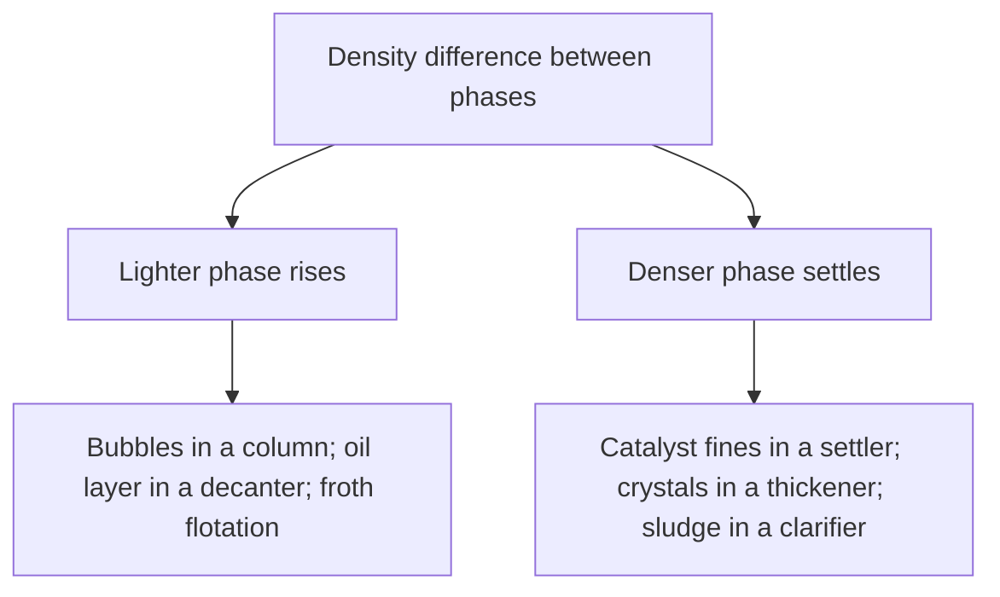

## ビデオ講義

<div class="video-container">
  <iframe
    width="560"
    height="315"
    src="https://www.youtube.com/embed/lfGMREF-V-c"
    title="化学工学流体力学 第1章: 流体、圧力、そして静力学"
    frameborder="0"
    allow="accelerometer; autoplay; clipboard-write; encrypted-media; gyroscope; picture-in-picture"
    allowfullscreen>
  </iframe>
</div>

> このビデオは以下のテキストと同じ内容をカバーしています。お好みの学習形式をお選びください。

---

# 第1章：流体、圧力、そして静力学

本章では、化学工学における流体力学（fluid mechanics）の土台を築きます。流体を流体たらしめているものは何か、この分野全体がどの 2 つの物性の上に成り立っているのか、静止した流体の中で圧力はどう分布するのか、そして配管に対する質量収支がどのようにして連続の式（continuity equation）になるのかを見ていきます。

**密度、粘度、そして圧力場**

## 学習目標

本章を修了すると、以下ができるようになります:

  * ✅ 流体をせん断（shear）に対する応答によって定義し、ニュートンの粘性法則を述べられる
  * ✅ 液体と気体の密度・粘度をオーダーで言え、妥当性チェックに使える
  * ✅ $\Delta P = \rho g h$ で静水圧（hydrostatic pressure）を計算し、Pa・bar・atm を相互に換算できる
  * ✅ ゲージ圧（gauge pressure）と絶対圧（absolute pressure）を区別し、その取り違えがなぜ高くつくのかを説明できる
  * ✅ 浮力（buoyancy）を説明し、密度差がどのように重力分離装置を駆動するのかを説明できる
  * ✅ 連続の式 $\dot{m} = \rho v A$ と、その非圧縮形 $v_1 A_1 = v_2 A_2$ を適用できる

**読了時間**: 20-25分 **コード例**: 1 **演習**: 3

* * *

## 1.1 なぜ流体力学がプラントを動かしているのか

化学プラントを歩いて、止まっているものを数えてみてください。ほとんど何もありません。供給液はポンプで送られ、ガスは圧縮され、蒸留塔では蒸気が上がる一方で液が流れ落ち、冷却水は熱交換器を巡り、製品はパイプラインで出て行きます。プラントとは機械的に見れば、流体を動かしながらその途中で何か有用なことを起こすための機械です。それは 3 つの通貨で支払われます:

1. **圧力損失はお金である。** 配管 1 メートルごと、ベンドやバルブ 1 つごとに圧力が削り取られ、ポンプや圧縮機がそれを戻します — プラントの寿命が尽きるまで、電気代として。そのコストは流速とともに急峻に増大します。[第4章](chapter-4.html)がそれを定量化します。
2. **流れの様式が性能を決める。** 流れが滑らかで層状なのか、それとも混ざり合う乱雑なものなのか（[第3章](chapter-3.html)）で、熱伝達係数は 1 桁変わり、反応物がそもそも出会えるかどうかも決まります。
3. **安全はここに宿る。** 過圧、ウォーターハンマー、キャビテーションを起こすポンプ、閉じ込められたライン — これらはまず流体力学の問題です。

[入門シリーズ第1章](../chemical-engineering-introduction/chapter-1.html)では**移動現象（transport phenomena）**を導入しました — 運動量、熱、物質のいずれもが *流束 = 係数 × 駆動力* という形の法則に従う、というものです。本シリーズはその表の 1 行目、**運動量移動（momentum transport）**を展開します。熱と物質は今後のシリーズで扱います。運動量が最初に来るのは、その駆動力である速度勾配が、目に見えるものだからです。

## 1.2 流体とは何か

**固体**は、せん断応力 — 表面に平行にはたらく力 — を受けると、決まった量だけ変形して止まります。**流体**にはそれができません。どんなに小さくてもせん断応力を加えれば、その応力が続くかぎり変形し続けます。その連続的な変形が流れであり、それが定義です: *流体はせん断のもとで連続的に変形する。* 液体も気体もこれに当てはまり、主な違いは圧縮性にあります。

ここではほぼすべての重みを 2 つの物性が担っています。**密度（density）** $\rho$、単位体積あたりの質量で単位は kg/m³ は、流体の重さ、その柱が生む圧力、そして流れが運ぶ運動量の量を決めます。**粘度（viscosity）** $\mu$、せん断に対する抵抗で単位は Pa·s は、流体を動かし続けるのに必要な力を決めます。

| 流体（約 20 °C） | 密度 $\rho$ [kg/m³] | 粘度 $\mu$ [Pa·s] |
|---|---|---|
| **水** | ≈ 998 | ≈ 0.001（1 mPa·s） |
| **軽質の有機液体** | ≈ 650–900 | ≈ 0.0003–0.001 |
| **空気（1 atm）** | ≈ 1.2 | ≈ 0.000018 |
| **グリセロール** | ≈ 1260 | ≈ 1.4 |
| **蜂蜜** | ≈ 1400 | ≈ 10（オーダー） |

この表は桁数ではなく比として読んでください。液体の密度は水の 2 倍以内に収まって固まっており、常温常圧の気体はおよそ 1000 倍軽くなっています。粘度の幅ははるかに広く、気体は水のおよそ 50 分の 1、蜂蜜は 1 万倍です。温度はこの 2 つに逆向きに作用します: **液体**を加熱するとさらさらになり、**気体**を加熱するとわずかに粘くなります。

### ニュートンの粘性法則

平行な 2 枚の板の間に流体があり、下の板は固定され、上の板が一定の速さで横に引かれている様子を思い浮かべてください。それぞれの板に接する層は板とともに動きます — **すべりなし条件（no-slip condition）**、この分野全体を支える実験事実です — その結果、隙間を横切って直線的な速度分布ができます。それを支えるせん断応力 $\tau$ は

$$ \tau = \mu \frac{dv}{dy} $$

これは移動現象の表を具体化したものです: **運動量流束**（$\tau$、単位は N/m²、同じことですが単位面積・単位時間あたりの運動量）が、**係数**（$\mu$）と**駆動力**（速度勾配）の積に等しい、というわけです。熱が高温から低温へ拡散するのとまったく同じように、運動量は速い層から遅い層へ拡散します。

$\mu$ が一定でこの法則に従う流体を**ニュートン流体（Newtonian fluid）**と呼びます: 水、空気、たいていの溶媒です。工業的な流体の多くはそうではありません。**シアシニング（ずり流動化、shear-thinning）**の物質 — 高分子溶液、塗料、多くのスラリー — は、強くせん断するほどさらさらになります。攪拌中のスラリーが、静止時の粘さから想像されるよりも楽に送液できるのはそのためです。他方、逆に粘くなるものや、動き出す前に降伏応力を要するものもあります。本シリーズは全体を通してニュートン流体を扱うので、非ニュートン流体を見抜くことが重要になります: 後に出てくる相関式は、書かれたままの形ではそれらに適用できません。

## 1.3 圧力と静水圧場

**圧力**は垂直応力です。すなわち表面に垂直にはたらく単位面積あたりの力で、単位はパスカル（1 Pa = 1 N/m²）です。静止した流体の中では**等方的**です — ある点においてどの向きにも同じ大きさなので、センサーの向きは問題になりません。それを変える唯一のものは深さです。というのも、下方の流体は上方の流体の重さを支えなければならないからです:

$$ \Delta P = \rho g h $$

ここで $\rho$ は kg/m³、$g = 9.81$ m/s²、$h$ は鉛直方向の深さ（メートル）です。何が*入っていない*かに注目してください: 容器の形状、断面積、そして液の総量です — 細い立て管と広いタンクを同じ高さまで満たせば、底で読まれる圧力は同じになります。

### 例題：10 メートルの水柱

20 °C の水（$\rho = 998$ kg/m³）で、10 m 下では:

$$ \Delta P = 998 \times 9.81 \times 10 = 97{,}904\ \text{Pa} \approx 0.979\ \text{bar} \approx 0.966\ \text{atm} $$

ここから実用的な**目安**が得られます: *水 10 メートルはおよそ 1 気圧、およそ 1 bar。* 厳密には、1 atm 分の水頭は 10.35 m、1 bar 分は 10.21 m なので、この目安の精度は約 3.5% です — 暗算による見積もりに必要な範囲には十分収まっており、覚えておく価値があります。

### ゲージ圧と絶対圧

$$ P_{\text{abs}} = P_{\text{gauge}} + P_{\text{atm}} $$

プラントの圧力計器はほぼすべて**ゲージ**圧 — 現地の大気圧との差 — を読み、barg、kPag、psig として報告されます。「0」を示している容器は大気圧であって、真空ではありません。一方、**絶対**圧を要求する計算もあります: 理想気体の法則、圧縮機の仕事、蒸気圧の比較、そして大気圧以下のあらゆる系です。この取り違えは実際の誤りの慢性的な原因です — 2 barg を 2 bara と読めば、気体の絶対圧で 50% の誤りとなり、したがってその密度と、そこから計算される圧縮機の負荷にも同じ誤りが伝わります。自分が書くすべての計算で、どちらの規約かを明示してください。

### マノメータと差圧による液位測定

日常的な使い方が 2 つ、ここから導かれます。**マノメータ（manometer）**は圧力差を液柱の読み取り可能な高さの差に変換します、$\Delta P = \rho g \Delta h$。同じ関係を逆向きに使えば、たいていの**タンク液位**が測れます: 差圧（DP）伝送器が容器の底部と上部の気相空間とを比較し、$h = \Delta P / (\rho g)$ を報告するのです。落とし穴は式の中にあります — 読み値は、仮定した密度の精度までしか正確になりません。つまり温度、組成、あるいは同伴ガスが変われば、実際の液位はそのままでも指示液位が動いてしまいます。

```python
G = 9.81  # m/s^2

FLUIDS = {"water": 998.0, "organic": 800.0, "brine": 1200.0}  # kg/m^3


def hydrostatic_dp(rho, h):
    """Pressure difference [Pa] across a static column of height h [m]."""
    return rho * G * h


def level_from_dp(rho, dp):
    """Liquid level [m] implied by a differential-pressure reading dp [Pa]."""
    return dp / (rho * G)


print(f"{'fluid':>8} {'rho':>6} {'dP over 10 m':>14} {'in bar':>8} {'in atm':>8}")
for name, rho in FLUIDS.items():
    dp = hydrostatic_dp(rho, 10.0)
    print(f"{name:>8} {rho:6.0f} {dp:14.0f} {dp/1e5:8.3f} {dp/101325:8.3f}")

print()
print(f"{'fluid':>8} {'dP = 50 kPa -> level':>22}")
for name, rho in FLUIDS.items():
    print(f"{name:>8} {level_from_dp(rho, 50_000):19.2f} m")

#    fluid    rho   dP over 10 m   in bar   in atm
#    water    998          97904    0.979    0.966
#  organic    800          78480    0.785    0.775
#    brine   1200         117720    1.177    1.162
#
#    fluid   dP = 50 kPa -> level
#    water                5.11 m
#  organic                6.37 m
#    brine                4.25 m
```

2 番目のブロックが警告です: **同じ** 50 kPa の読み値が、水なら 5.11 m、軽質の有機液体なら 6.37 m、ブラインなら 4.25 m になります。誤った流体で伝送器を校正すれば、20% 以上ずれた液位を自信たっぷりに報告することになります。

## 1.4 浮力と二相系への帰結

圧力は深さとともに増大するので、水没した物体は上からより下から強く押され、その不均衡が上向きの力になります。**アルキメデスの原理**はその大きさを与えます: 浮力は排除された流体の重さに等しい、$F_b = \rho_{\text{fluid}} g V$。周囲の流体より密度が大きければ物体は沈み、小さければ浮き上がります。このたった 1 つの比較が、装置のカテゴリーまるごとを説明します:



**重力分離**は存在するなかで最も安価な分離です — 滞留時間以外にエネルギーを要しません — そのため、密度の異なる 2 つの相を分けたい場面ならどこにでも、デカンター、セトラー、クラリファイヤー、ノックアウトドラムが現れます。浮選はこの手口を反転させます: 除去したい粒子に気泡を付着させれば、その複合体は沈む代わりに浮上します。

*どれだけ速く*動くかは 3 つの力から決まります — 下向きの重力、上向きの浮力、そして運動に逆らう抗力です。抗力は速さとともに増大するので、これらは速やかに釣り合い、粒子は一定の**終端速度（terminal velocity）**で移動します。ゆっくり動く小さな粒子には、**ストークス領域（Stokes regime）**と呼ばれる低速の極限が当てはまり、ここで重要なのはその依存性です: 終端速度は**密度差**と**粒径の 2 乗**とともに増大し、連続相の**粘度**が上がると低下します。粒径を 2 倍にすれば沈降はおよそ 4 倍速くなります — 遅い分離を直すのに、たいてい効くのが大きなセトラーではなく上流の晶析や凝集である理由がこれです。

## 1.5 連続の式

*入門*シリーズでは、あらゆる収支を *蓄積 = 入 − 出 + 生成 − 消費* という形で書きました。配管を流れる質量については、生成も消費もなく、**定常状態**では蓄積もないので、入ったものは出て行かなければなりません:

$$ \dot{m} = \rho v A = \text{constant} $$

ここで $\dot{m}$ は質量流量（kg/s）、$v$ は断面平均速度（m/s）、$A$ は流路断面積（m²）です。これが**連続の式** — 流体力学における質量収支です。**非圧縮性**の流体 — あらゆる液体、およびライン沿いの圧力変化がわずかにとどまる気体 — では $\rho$ が両端で等しく、消去されます:

$$ v_1 A_1 = v_2 A_2 $$

**ミニ例題。** 液体を 2 m/s で運ぶ配管が、内径 100 mm から 50 mm へ絞られます。断面積は直径の 2 乗に比例するので、$D$ を半分にすると $A$ は 4 分の 1 になり、連続の式は速度が 4 倍、すなわち **8 m/s** になることを要求します — 何かを送り込んだり加えたりしたわけではなく、幾何形状だけでそうなるのです。[第2章](chapter-2.html)はその代償を示します: こうして得た速度は、圧力から支払われます。

### 設計流速の目安

配管サイズの決定は、鋼材とポンプ動力とのトレードオフです: 太い配管は初期費用が高くつく代わりに、流速が低く圧力損失も小さくなります。経済的な最適はおなじみの範囲に落ち着きます — これは物理法則ではなく、**一般的な設計指針**です:

| 用途 | 典型的な流速 |
|---|---|
| **プロセス配管中の液体** | ≈ 1–3 m/s |
| **ポンプ吸込ライン** | より低く ≈ 0.5–1.5 m/s、キャビテーションを避けるため |
| **気体・蒸気** | ≈ 15–30 m/s |

気体がおよそ 10 倍速く流れるのは、密度がおよそ 1000 分の 1 であり、単位長さあたりの圧力損失が $\rho v^2$ に依存するからです。これらは検算に使ってください: 15 m/s と計算された液体ラインには、どこかに誤りがあるか、さもなければよほどの理由があります。

## 1.6 本章のまとめ

- **流体**は、いかなるせん断応力のもとでも連続的に変形する。本シリーズは**密度** $\rho$（水 ≈ 998 kg/m³、気体は常温常圧で ≈ 1 kg/m³）と**粘度** $\mu$（水 ≈ 0.001 Pa·s、気体 ≈ 0.00002 Pa·s、蜂蜜 ≈ 10 Pa·s）の上に成り立っている
- **ニュートンの粘性法則** $\tau = \mu\,dv/dy$ は、流束 = 係数 × 勾配 の形をした運動量移動である。**ニュートン流体**は $\mu$ が一定であり、シアシニングする高分子溶液やスラリーはそうではない
- 圧力は深さだけで決まる**等方的な垂直応力**であり、$\Delta P = \rho g h$。10 m の水柱は $998 \times 9.81 \times 10 = 97{,}904$ Pa ≈ 0.979 bar ≈ 0.966 atm を与える — **目安**として水 10 m ≈ 1 atm ≈ 1 bar、精度は約 3.5%
- **ゲージ圧と絶対圧**: $P_{\text{abs}} = P_{\text{gauge}} + P_{\text{atm}}$。計器はゲージ圧を読み、気体の状態式や圧縮機の計算には絶対圧が要る
- **差圧**による液位測定 $h = \Delta P/(\rho g)$ は、仮定した密度の精度までしか正確でない: 50 kPa は水なら 5.11 m だが、ブラインなら 4.25 m である
- **浮力**（$F_b = \rho_{\text{fluid}} g V$）は密度差をデカンター、セトラー、浮選の駆動力にする。**ストークス領域**の終端速度は密度差と直径の 2 乗とともに増大し、粘度とともに低下する
- **連続の式**: 定常状態では $\dot{m} = \rho v A$ が一定、非圧縮なら $v_1 A_1 = v_2 A_2$ — 直径を半分にすると断面積は 4 分の 1、速度は 4 倍になる。指針では液体は 1–3 m/s 付近、気体は 15–30 m/s 付近に置かれる

**次章**: 連続の式は質量を勘定しますが、それを動かすのに何がかかるかは勘定しません。ここにエネルギーを加えると**ベルヌーイの式と機械的エネルギー収支**（[第2章](chapter-2.html)）が得られ、圧力・速度・高さが結び付き、ポンプの仕事がどこへ行くのかが見えてきます。

## 演習問題

1. **概念 — 形状、ゲージ圧、そして深さ**: タンク A は直径 3 m の円筒で、水が 8 m まで入っている。タンク B は直径 0.2 m の細い立て管で、こちらも水が 8 m まで入っている。(a) 底部の圧力が高いのはどちらで、それはなぜか。(b) タンク A の底部の圧力計が 0.78 bar を示している。大気圧を 1.013 bar として、そこでの絶対圧はいくらか。(c) いまタンク A を密閉し、その気相空間を 2 barg に加圧した。底部の圧力計は何を示すか。
   *ヒント*: $\Delta P = \rho g h$ に現れる変数と、現れない変数を書き出せ。
   *解答*: (a) **同じです。** 静水圧は $\rho$、$g$、深さだけで決まり、直径、体積、液の総重量は現れません。どちらの底部も、同じ大気に開放された自由表面の 8 m 下にあるので、どちらも $998 \times 9.81 \times 8 = 78{,}323$ Pa ≈ 0.78 barg を示します。これは静水圧のパラドックスと呼ばれることがありますが、式を注意深く読めば逆説的なところは何もありません。(b) $P_{\text{abs}} = 0.78 + 1.013 =$ **1.79 bara**。(c) 表面に加えられた圧力は流体全体に減衰せずに伝わるので、底部はいま $2 + 0.78 =$ **2.78 barg**、すなわち 3.79 bara を示します。

2. **定量 — タンク底部の圧力と液位**: 縦型タンクに密度 **1200 kg/m³** のブラインが深さ **6 m** まで入っており、大気に開放されている。(a) 底部のゲージ圧を Pa と bar で計算せよ。(b) このタンクの DP 液位伝送器が、誤って水（$\rho = 998$ kg/m³）用に校正されていた。ブラインの真の液位が 6 m のとき、伝送器は液位をいくらと報告するか。(c) 読み値は何パーセント誤っているか。
   *ヒント*: (a) では $\Delta P = \rho g h$ を使い、(b) ではその同じ $\Delta P$ を*誤った*密度とともに $h = \Delta P/(\rho g)$ に戻して通せ。
   *解答*: (a) $\Delta P = 1200 \times 9.81 \times 6 =$ **70,632 Pa ≈ 0.71 bar ゲージ**（0.706 bar）。(b) 伝送器は 70,632 Pa を見て、それを水の値で割ります: $h = 70{,}632/(998 \times 9.81) =$ **7.21 m**。(c) $(7.21 - 6.00)/6.00 =$ **+20.2%** で、これは密度比 $1200/998 = 1.202$ と同じです。8 m 定格のタンクは、ブラインが 6 m しか入っていないのにほとんど満杯に見えることになります — 計器の故障ではなく、校正の誤りです。

3. **議論 — 連続の式と配管サイズ**: あるプラントが、現在 100 mm 配管を 2 m/s で流れている既設の液ラインについて、配管を交換せずに処理量を 2 倍にしたいと考えている。(a) どのような流速になり、連続の式は質量流量について何と言うか。(b) 1.5 節の設計指針は、なぜこれを問題視するか。(c) 代わりにラインを更新する場合、2 倍の流量で流速を 2 m/s に保つには直径をいくらにすればよいか。
   *ヒント*: (a) では $A$ を固定して $\dot{m} = \rho v A$ を使え。(c) では $A$ が 2 倍になることを要求し、$A \propto D^2$ を思い出せ。
   *解答*: (a) 断面積が固定で密度が一定なら、$\dot{m}$ を 2 倍にすると流速は 2 倍の **4 m/s** になります。(b) それはプロセス液体に対する ≈ 1–3 m/s という指針の帯域を超えています。圧力損失は流速とともに急激に増大し — [第4章](chapter-4.html)が示すように、およそ $v^2$ に比例します — 送液コストはおよそ 4 倍になり、そもそも既設ポンプが追加の揚程を出せない可能性もあります。エロージョンや騒音も悪化します。(c) 流速一定で流量を 2 倍にするには断面積が 2 倍必要なので、$D_2 = D_1\sqrt{2} = 100 \times 1.414 =$ **141 mm**、実務上は 1 つ上の標準サイズ（呼び径 150 mm）になります。トレードオフは一般的なもので、太い配管とは、一度きり多く払う設備費と引き換えに、プラントの寿命が続くかぎり毎時間の送液エネルギーを減らすということです。
