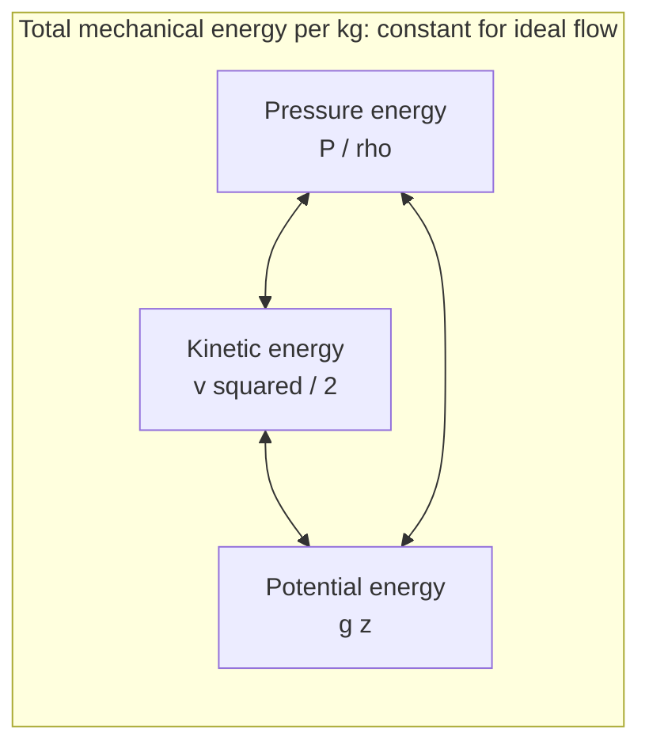
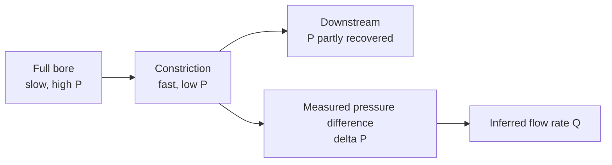

## ビデオ講義

<div class="video-container">
  <iframe
    width="560"
    height="315"
    src="https://www.youtube.com/embed/lfGMREF-V-c?start=765"
    title="化学工学流体力学 第2章: ベルヌーイと機械的エネルギー収支"
    frameborder="0"
    allow="accelerometer; autoplay; clipboard-write; encrypted-media; gyroscope; picture-in-picture"
    allowfullscreen>
  </iframe>
</div>

> このビデオは以下のテキストと同じ内容をカバーしています。お好みの学習形式をお選びください。

---

# 第2章：ベルヌーイと機械的エネルギー収支

第1章では流体を静止させたままにしていました。本章ではそれを動かし、そのエネルギーを追いかけます: 圧力、速さ、高さがどのように互いを埋め合わせるのか、そのやり取りがどうやって流量測定になるのか、そして摩擦が永久に奪っていくものは何かを見ていきます。

**流れのエネルギーはどこへ行くのか**

## 学習目標

本章を修了すると、以下ができるようになります:

  * ✅ ベルヌーイの式（Bernoulli equation）を 1 キログラムあたりのエネルギー収支として書き、その背後の仮定を述べられる
  * ✅ 圧力エネルギー、運動エネルギー、位置エネルギーの三者間のやり取りを説明できる
  * ✅ トリチェリの結果 $v = \sqrt{2gh}$ を導き、排出中のタンクに適用し、実際の噴流がそれより遅い理由を述べられる
  * ✅ ベンチュリ流量計（venturi meter）、オリフィス板、ピトー管（pitot tube）が圧力差をどのように流量に変換するのかを説明できる
  * ✅ ベルヌーイの式を、摩擦損失（friction loss）とポンプ仕事を含む機械的エネルギー収支（mechanical energy balance）へ拡張できる
  * ✅ キャビテーション（cavitation）を引き起こす条件と、それがなぜポンプ吸込配管を制約するのかを認識できる

**読了時間**: 20-25分 **コード例**: 1 **演習**: 3

* * *

## 2.1 動いている流体のエネルギー収支

*化学工学熱力学*シリーズは、流れる流体に対する第一法則 $\Delta H = Q - W_s$（[熱力学第1章](../chemical-engineering-thermodynamics/chapter-1.html)）から始まり、運動エネルギー項と位置エネルギー項を無視できるものとして意図的に落としていました。流体力学では、まさにその項こそが関心の的であり、脇へ置くのは熱的な項の方です。密度が一定で、熱のやり取りがなく、軸仕事もなく、そして — 今のところ — 摩擦もない流体を取れば、残るのは**機械的**エネルギーだけの収支です。流体 1 キログラムあたり、3 つの量がそれを保持できます:

$$ \frac{P}{\rho} + \frac{v^2}{2} + gz = \text{constant} $$

これが**ベルヌーイの式**です。どの項も単位は J/kg であり、この共通の通貨こそが要点です: 3 つの形態は相互に変換可能で、流れはそれらの間でエネルギーを自由に移し替えます。

| 項 | 名称 | 何を表すか | 典型的な条件の水での値 |
|---|---|---|---|
| $P/\rho$ | **圧力エネルギー**（流動仕事） | 加圧されていることによって流体が運ぶエネルギー | 1 bar → $10^5/998 = 100$ J/kg |
| $v^2/2$ | **運動エネルギー** | 運動のエネルギー | 2 m/s → 2.0 J/kg |
| $gz$ | **位置エネルギー** | 選んだ基準面からの高さのエネルギー | 10 m → 98.1 J/kg |

右端の列は注意深く読んでください。ここから先のシリーズ全体の直感がこれで決まるからです。1–3 m/s という通常の配管流速では、運動エネルギー項は**ごく小さい** — 1 キログラムあたり数ジュール、約 0.02 bar です。高さははるかに大きく、水 10 m でおよそ 1 bar に相当します。ポンプで送る系では圧力が支配的であり、運動エネルギーが興味深くなるのは流体が意図的に加速される場所だけです — それはまさにノズル、オリフィス、あるいは漏れているフランジがやっていることです。

その和が流線に沿って一定であるため、**どれか 1 つの項の増加は、他の項から支払われます**。流体を速くすればその圧力は下がり、持ち上げれば、速さが一定なら圧力は $\rho g z$ だけ下がります。何も創り出されてはおらず、帳簿の付け替えが起きているだけです。



仮定は厳しく、声に出して述べておく価値があります。というのも、現実の応用はどれも少なくとも 1 つを破っているからです: **定常流、密度一定、摩擦なし、軸仕事なし、単一の流線に沿って。** したがってベルヌーイの式は思考の道具であり最初の見積もりであって、設計方程式ではありません。2.4 節がそれを修復します。

## 2.2 トリチェリとタンクの排出

古典的な応用は、側面に穴の開いた通気タンクです — ドレンとして、ノズルとして、あるいは漏れとして、どのプラントにもある状況です。

自由液面（点 1）と穴から出て行く噴流（点 2）の間にベルヌーイの式を適用します。どちらも大気に開放されているので圧力項は打ち消し合い、タンクは穴に比べて広いので液面はゆっくり下がり $v_1 \approx 0$ です。穴を基準面に取ると $z_1 = h$、$z_2 = 0$ となり:

$$ gh = \frac{v^2}{2} \qquad \Longrightarrow \qquad v = \sqrt{2gh} $$

これが**トリチェリの結果**です。穴より $h = 5$ m 高い液位に対して:

$$ v = \sqrt{2 \times 9.81 \times 5} = \sqrt{98.1} = 9.9\ \text{m/s} $$

これは同じ高さから落とした物体の速さと同一であり、理由も同じです — 途中で何も取られることなく、位置エネルギーが運動エネルギーへ変換されるからです。ここでも何が*入っていない*かに注目してください: 密度です。理想的な排出は、水でもケロシンでも水銀でも同じ速さです。

現実は 2 つの理由で遅くなります。穴の縁および流体内部での**摩擦**が、いくらかのエネルギーを散逸させます。そして流線は鋭い角を瞬時に曲がることができないので、噴流は壁を離れた後も収縮を続け、少し下流で最も細い断面 — **縮流部（vena contracta）** — に達します。そこは、出てきた穴よりも細くなっています。

この 2 つの効果は**流出係数（discharge coefficient）** $C_d$ にまとめられます。これは理想的な予測を観測される流量へ変換する経験的な乗数（無次元で、つねに 1 未満）です:

$$ Q = C_d\, A \sqrt{2gh} $$

薄板に開けた鋭い縁のオリフィスでは、$C_d$ は**典型的には 0.6–0.65 程度**です。したがって、液面の 5 m 下にある 25 mm のドレン穴は、理想流量が $4.909 \times 10^{-4} \times 9.9 = 4.86 \times 10^{-3}$ m³/s、すなわち 17.5 m³/h ですが — $C_d = 0.62$ では実際には **10.9 m³/h** 近くしか出ません。丸みを付けてなだらかにテーパーしたノズルなら収縮をほとんど完全に避けられ、$C_d$ は 0.95 を超えます。穴は、その大きさよりも形の方が効くのです。

## 2.3 圧力差による流量測定

ベルヌーイの式は計装においてその真価を発揮します。配管を絞れば、**連続の式**（密度一定で $A_1 v_1 = A_2 v_2$）が、狭くなった断面を通るときに流体を速くさせます。するとベルヌーイの式は、その代償として圧力が下がらねばならないと言います。その低下を測れば、流れの中に可動部を一切入れることなく流量を推定できたことになります。



断面積 $A_2$ の絞りについてこの 2 つの関係を組み合わせると、あらゆる差圧式流量計が用いる実用式が得られます:

$$ Q = C_d\, A_2 \sqrt{\frac{2\,\Delta P}{\rho}} $$

この書き方では**接近速度係数** $1/\sqrt{1-\beta^4}$ が落とされています。ここで $\beta$ は絞り口径と配管径の比です — 口径が配管に比べてはるかに小さいときには許容でき、以下の例題もそれを前提にしていますが、実際の流量計の計算では明示的に持ち込まれる補正です。

| 機器 | 動作原理 | 永久圧力損失 | コストと用途 |
|---|---|---|---|
| **オリフィス板** | フランジ間に挟み込む、穴を開けた板 | 大きい — 測定 $\Delta P$ の**典型的に 50–80%** | 安価で交換も容易、圧倒的に最も一般的 |
| **ベンチュリ** | ゆるやかな収縮部、スロート、そして長くなだらかなディフューザ | 小さい — **典型的に 10–20%** | 高価でかさばる。送液コストや利用可能な揚程が問題になる場面で使う |
| **ピトー管** | 流れに正対させた細い管 | 無視できる | 1 点における*局所*流速を測るのであって、全流量ではない |

オリフィスかベンチュリかという選択は、設備費と運転費のトレードオフの縮図です。どちらも絞り部で圧力を速度に変換します。違いはその後に起こることです。ベンチュリの長いテーパー出口は流れをなめらかに減速させ、圧力の大部分を**回復**させます。オリフィスはその噴流を急拡大部へ放り出し、そこで流体は撹拌され、その圧力の大部分は二度と戻りません — その損失は、プラントの寿命が続くかぎり、ポンプが払い続けます。

**ピトー管**は同じ原理を逆向きに適用します: 向かってくる流れに正対させることで先端の流体を静止させ、その停滞圧と乱されていない静圧との差が $\rho v^2/2$ となり、$v = \sqrt{2\Delta P/\rho}$ が直接得られます。

これらの機器こそが、[入門シリーズ第3章](../chemical-engineering-introduction/chapter-3.html)の流量制御ループを物理的に可能にしているものです: 流量コントローラーは動作する前に測定値を必要とし、たいていのプラントにおいてその測定値とは、オリフィス板とその両側に取り付けた差圧伝送器なのです。

```python
import math

RHO = 998.0        # kg/m3, water at ~20 C
CD = 0.62          # discharge coefficient, typical sharp-edged orifice plate
D_ORIFICE = 0.050  # m, orifice bore

A = math.pi * D_ORIFICE**2 / 4.0   # m2

print(f"orifice bore = {D_ORIFICE*1000:.0f} mm, area = {A*1e4:.2f} cm2, Cd = {CD}")
print(f"{'dP [kPa]':>9} {'dP [mbar]':>10} {'v_th [m/s]':>11} {'Q [m3/h]':>9} {'mdot [kg/s]':>12}")
for dp_kpa in [1, 2, 5, 10, 20, 50, 100]:
    dp = dp_kpa * 1000.0                 # Pa
    v_th = math.sqrt(2 * dp / RHO)       # m/s, ideal throat velocity
    q = CD * A * v_th                    # m3/s
    print(f"{dp_kpa:9.0f} {dp_kpa*10:10.0f} {v_th:11.2f} {q*3600:9.2f} {q*RHO:12.2f}")

# orifice bore = 50 mm, area = 19.63 cm2, Cd = 0.62
#  dP [kPa]  dP [mbar]  v_th [m/s]  Q [m3/h]  mdot [kg/s]
#         1         10        1.42      6.20         1.72
#         2         20        2.00      8.77         2.43
#         5         50        3.17     13.87         3.85
#        10        100        4.48     19.62         5.44
#        20        200        6.33     27.75         7.69
#        50        500       10.01     43.87        12.16
#       100       1000       14.16     62.04        17.20
```

この表は、あらゆる差圧式流量計に特有の弱点を露わにします: **関係は線形ではなく平方根である。** $\Delta P$ を 5 から 20 kPa へ 4 倍にしても、流量は 13.87 から 27.75 m³/h へ 2 倍になるだけです。レンジの下端付近では $\Delta P$ の大きな比率の誤差が $Q$ の大きな誤差になります。オリフィス流量計（orifice meter）が通常、**ターンダウン（turndown）** — 最大流量と最小流量の使用可能な比 — としてわずか 3:1 から 4:1 程度までしか信頼されないのはこのためです。設計流量をはるかに下回って運転すれば、そのプラントの流量測定は静かに信頼できないものになります。

## 2.4 現実の流体：摩擦の登場

ベルヌーイの摩擦のない流体は存在しません。実際の流れは配管壁と、そして自分自身とこすれ合い、そのこすれ合いが収支から機械的エネルギーを取り去ります。損失項 $h_f$ と、ポンプが供給する仕事 $w_{\text{pump}}$ を加えると、本シリーズの残りが土台とする式、**機械的エネルギー収支**が得られます:

$$ \frac{P_1}{\rho} + \frac{v_1^2}{2} + gz_1 + w_{\text{pump}} = \frac{P_2}{\rho} + \frac{v_2^2}{2} + gz_2 + h_f $$

すべての項は J/kg です。2 つの非対称性に注目すべきです。**$w_{\text{pump}}$ は左辺にしか現れません** — ポンプは機械的エネルギーを加えるものであり、この式の中でそれができる唯一のものです。**$h_f$ は右辺にしか現れず、つねに正**で、流体がどちらへ流れようと決して負にはなりません。流れの向きを逆にしても、摩擦はやはり取り分を取っていきます。

その一方向性は、配管の中に現れた第二法則です。摩擦によって取り去られたエネルギーは消滅したわけではありません: それは**内部エネルギー**として再び現れ、流体を 1 度の何分の 1 か温めます。第一法則はきっちり満たされています。しかしこの変換は一方向にしか進みません — 温まった水が自発的に組み直されて圧力になることはありません — つまり摩擦は機械的エネルギーを内部エネルギーへ変換します: 第二法則のはたらきです。[熱力学第2章](../chemical-engineering-thermodynamics/chapter-2.html)はこれを失われた仕事の潜在能力と呼び、実際のあらゆる流れはエントロピーを生成します。摩擦はエネルギーの量を保存しながら、その*質*を劣化させるのです。

実務的には、$h_f$ がポンプのサイズを決め、電気代を決めます。収支の中の他のものはすべて、その仕事内容によって固定されています — タンクはそこにあり、圧力はプロセスが必要とする値です。設計の選択によって決まるのは $h_f$ だけです: 配管径、長さ、継手、そして粗さです。**[第4章](chapter-4.html)はまるごとその計算に充てられており**、[第5章](chapter-5.html)はその支払いに充てられています。

## 2.5 キャビテーションの予告

機械的エネルギー収支は、ある特定の故障についても警告します。ポンプ吸込へ向かうラインに沿って圧力を追ってみてください: 高さによる損失、摩擦、そして配管への加速のすべてが、そこから差し引かれます。もし局所圧力がどこかで液の**蒸気圧（vapor pressure）** $P_{sat}$ — その温度で液が沸騰する圧力、[熱力学第3章](../chemical-engineering-thermodynamics/chapter-3.html)より — まで下がれば、液体は*その場で*蒸発します。蒸気の泡が生じ、羽根車のより高圧の領域へ運ばれ、そこで激しく崩壊します。

その崩壊が**キャビテーション**です。ケーシングの中で砂利が鳴るような音がし、羽根車の金属を侵食し、軸受とシールを損ない、ポンプの吐出揚程を失わせます — プラントにおけるポンプ故障の主要な原因です。

この収支から 2 つの設計則が直接導かれ、いずれも**吸込**側に関するものです:

- **短く**: 配管長が短いほど、流体が羽根車に達する前に差し引かれる $h_f$ が小さくなります。
- **太く**: 径が大きいほど流速が低くなり、摩擦損失と、圧力項から引き出される $v^2/2$ の両方が減ります。

ゆえに、吸込ラインは吐出ラインより 1 サイズ大きくするという配管の慣習があります。温度はその余裕をさらに狭めます: 25 °C の水は約 3.2 kPa 絶対で沸騰するのでほぼ 1 気圧分の余裕がありますが、80 °C ではその蒸気圧がおよそ 47 kPa になるため、大気圧の開放容器では液がフラッシュするまでに使える水頭が 6 m 未満しか残りません。高温の液体は、ほとんどつねに高所の容器からポンプへ供給されます。[第5章](chapter-5.html)はこれを **NPSH**（正味吸込ヘッド）として定量化します。

## 2.6 本章のまとめ

- **ベルヌーイの式** $P/\rho + v^2/2 + gz = \text{constant}$（J/kg）は、理想的な流れの 1 キログラムあたりの機械的エネルギーを釣り合わせる。3 つの項は相互に変換可能なので、1 つの増加は他の項によって支払われる
- 大きさが直感を決める: 1 bar ≈ 100 J/kg、高さ 10 m ≈ 98 J/kg であるのに対し、2 m/s は ≈ わずか 2 J/kg — **運動エネルギーが効くのは、流体が意図的に加速される場所だけである**
- 仮定 — 定常、非圧縮、摩擦なし、軸仕事なし、流線に沿って — が、ベルヌーイの式を設計方程式ではなく思考の道具にしている
- **トリチェリ**: 5 m の水頭のもとで排出するタンクは $v = \sqrt{2 \times 9.81 \times 5} = 9.9$ m/s を与え、密度によらない。実際の噴流は摩擦と**縮流部**によってそれより遅く、両者は鋭い縁のオリフィスで典型的に **0.6–0.65** の**流出係数**にまとめられる
- 絞り + 連続の式 + ベルヌーイの式から $Q = C_d A \sqrt{2\Delta P/\rho}$ が得られる — **オリフィス板**（安価、永久損失 50–80%）、**ベンチュリ**（高価、10–20%）、**ピトー管**（局所流速）の基礎である。平方根の形は、こうした流量計をおよそ **3:1 から 4:1 のターンダウン**に制限する
- **機械的エネルギー収支**が現実を加える: $P_1/\rho + v_1^2/2 + gz_1 + w_{\text{pump}} = P_2/\rho + v_2^2/2 + gz_2 + h_f$。ここで $h_f$ はつねに正である。摩擦が機械的エネルギーを内部エネルギーへ劣化させるからで — 配管の中の、第二法則が言う失われた仕事である
- **キャビテーション**は局所圧力が蒸気圧まで下がったときに起こる。吸込ラインは**短く太く**保たれ、高温の液体は余裕がはるかに少ない

**次章**: 流体が実際にどう動いているのかがわからなければ、$h_f$ は計算できません。**[第3章](chapter-3.html)**では層流と乱流、そしてその 2 つを見分ける**レイノルズ数**を導入します — 摩擦がきれいな式に従うのか、それとも経験的な線図に従うのかを決める、ただ 1 つの無次元数です。

## 演習問題

1. **概念 — 圧力はどこへ行ったのか**: 水平配管が口径 100 mm から 50 mm へ狭まり、その後また 100 mm へ広がっている。水が定常的にそこを流れている。(a) 狭い部分で流速はどうなり、その倍率はいくらか。(b) そこで圧力はどうなり、なぜそれはエネルギー保存に反しないのか。(c) 拡大部の下流で、圧力は元の値に戻っているか。
   *ヒント*: まず連続の式を、次にベルヌーイの式を適用せよ。その上で、2.4 節がベルヌーイの式に何を付け加えたかを問え。
   *解答*: (a) 連続の式より $A_1 v_1 = A_2 v_2$ であり、直径を半分にすると断面積は 4 分の 1 になるので、流速は **4** 倍に上がります。(b) 圧力は**下がります**。何も反していません — ベルヌーイの式によれば運動項 $v^2/2$ が増大し、それは圧力項 $P/\rho$ から支払われたのです。エネルギーは保存されており、変わったのはその形態だけです。(c) **完全にではありません。** 理想的なベルヌーイの式は完全な回復を予測しますが、実際の拡大は撹拌をともなう散逸的な過程であり、$h_f$ に寄与します。なだらかなベンチュリのディフューザは圧力の大部分を回復します（永久損失は 10–20%）が、急なオリフィス型の拡大は 50–80% を失います。この 2 つの違いは、ひとえに出口の形状にあります。

2. **定量 — 給水塔**: ある給水塔は、地上の蛇口より **20 m** 高いところに自由液面を保っている。$\rho = 998$ kg/m³、$g = 9.81$ m/s² とし、摩擦は無視する。(a) 蛇口を閉じているときのゲージ圧はいくらか。(b) 蛇口を大気へ開放したとき、理想的な噴流の速さはいくらか。(c) それぞれの条件について、1 キログラムあたりの位置エネルギーと運動エネルギーを比較せよ。
   *ヒント*: 蛇口を閉じているときは流体は静止しているので、第1章の静水圧の結果を使え。開けているときは、位置エネルギーがすべて運動エネルギーに変換される。
   *解答*: (a) $P = \rho g h = 998 \times 9.81 \times 20 = 195{,}808$ Pa ≈ **1.96 bar ゲージ**。(b) $v = \sqrt{2gh} = \sqrt{2 \times 9.81 \times 20} = \sqrt{392.4} = $ **19.8 m/s**。(c) 位置エネルギー項はどちらの場合も $gz = 9.81 \times 20 = 196.2$ J/kg です。蛇口を閉じた場合: それはすべて圧力エネルギーとして現れ、$P/\rho = 195{,}808/998 = 196.2$ J/kg、運動エネルギーはゼロです。蛇口を開けた場合: それはすべて運動エネルギーとして現れ、$v^2/2 = 19.8^2/2 = 196$ J/kg、ゲージ圧はゼロです。**同じ 196 J/kg が、2 つの異なる形態で** — これこそがベルヌーイの式の伝えたいことのすべてです。実際の蛇口では、配管内の摩擦がその一部を消費し、噴流は目に見えて遅くなります。

3. **議論 — 流量計を仕様決定する**: 24 時間稼働する 200 m³/h の冷却水ラインに流量計を付けなければならない。同僚は、ベンチュリの何分の 1 かのコストで済むという理由でオリフィス板を提案しており、プラントは設計流量の 25% で運転されることもあると指摘している。(a) オリフィスの隠れたコストは何か。(b) 25% の流量で測ることの何が問題か。(c) どのような状況であれば、それでもオリフィスを受け入れるか。
   *ヒント*: 永久圧力損失を継続的な送液負荷として考えよ。そして 2.3 節の平方根のふるまいを読み直せ。
   *解答*: (a) オリフィスは測定 $\Delta P$ の **50–80%** を永久に失わせます。ベンチュリの 10–20% に対してです。その損失は機械的エネルギー収支において追加の $h_f$ 項となり、プラントが生きているかぎり毎時間、ポンプがそれを供給しなければなりません — 設備費は一度だけ節約され、電気代は永遠に払い続けることになります。(b) 設計流量の 25% では、$Q \propto \sqrt{\Delta P}$ であるため、差圧は設計値のおよそ **1/16** にしかなりません。それはオリフィスが信頼されるおよそ 3:1 から 4:1 のターンダウンの外側であり、運転員がプラントの状態をいちばん知りたいときに限って測定が信頼できなくなります。(c) オリフィスが正しい選択となるのは、そのラインに**潤沢な利用可能揚程**がある場合（重力供給や余裕のあるポンプは、永久損失を実質的に無償にします）、流量が設計流量の近くにとどまる場合、あるいはその測定値が、正確な絶対流量を報告するのではなく設定値を保つだけでよい制御ループに入力される場合です。広いターンダウンが本当に重要なのであれば、どちらの機器も理想的ではありません — 圧力損失がなく応答が線形な電磁式流量計やコリオリ式流量計が、正直な答えです。
