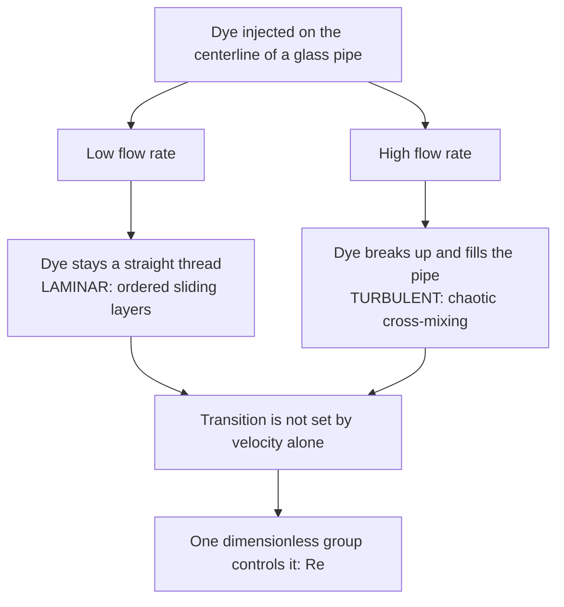

## ビデオ講義

<div class="video-container">
  <iframe
    width="560"
    height="315"
    src="https://www.youtube.com/embed/lfGMREF-V-c?start=1495"
    title="化学工学流体力学 第3章: 層流、乱流、そしてレイノルズ数"
    frameborder="0"
    allow="accelerometer; autoplay; clipboard-write; encrypted-media; gyroscope; picture-in-picture"
    allowfullscreen>
  </iframe>
</div>

> このビデオは以下のテキストと同じ内容をカバーしています。お好みの学習形式をお選びください。

---

# 第3章：層流、乱流、そしてレイノルズ数

第2章では流線に沿って機械エネルギーの収支を取り、ひとつの項だけをわざと曖昧なままにしておきました。摩擦損失（friction loss）です。この損失に数値を与える前に、流れを分類しなければなりません — そしてその分類は、たったひとつの無次元数に依っています。

**2つの流動状態と、1つの無次元数**

## 学習目標

本章を修了すると、以下ができるようになります:

  * ✅ レイノルズの1883年の色素実験が何を明らかにしたのかを説明できる
  * ✅ $Re = \rho v D/\mu$ を計算し、それが無次元であることを示せる
  * ✅ 管内流れを層流、遷移域、乱流に分類できる
  * ✅ ハーゲン・ポアズイユの式と、層流の放物線状の速度分布を適用できる
  * ✅ 流量一定のもとでの $D^{-4}$ の圧力損失スケーリングを導ける
  * ✅ 産業がなぜ乱流で運転するのかを説明し、層流が残る領域を挙げられる
  * ✅ $Re$ を槽、充填層、粒子へと一般化できる

**読了時間**: 20-25分 **コード例**: 1 **演習**: 3

* * *

## 3.1 レイノルズの実験

1883年、オズボーン・レイノルズは水槽から水をまっすぐなガラス管へ流し、中心線上に細い色素の噴流を注入しました。流量が小さいうちは、色素は管の全長にわたって**まっすぐで鋭い一本の筋**を描きました。水は秩序だった層をなして動いており、それぞれの層は横方向に物質をやり取りすることなく互いに滑り合っていたのです。

バルブをさらに開いても何も変わりませんでした — ところが、まったく突然に、すべてが変わりました。ある流量を超えると筋は揺らぎ、崩れ、**管径の数倍の距離のうちに断面全体へ拡散した**のです。彼は一方の状態をもう一方へとぼかしたのではありません。質的に異なる2つの運動状態のあいだにある閾値を越えたのです。



決定的な結果は、その次に来ました。彼は管径を変え、温度を変え — これは粘度を変化させます — さらに液体そのものを変えて実験を繰り返しましたが、筋が崩れる速度は大きくばらつきました。ところが、それら4つの変数を**ひとつの無次元数**にまとめたとき、遷移（transition）はつねにその同じ値の近くで起こったのです。その数は、いまや彼の名を冠しています。

## 3.2 レイノルズ数

$$ Re = \frac{\rho v D}{\mu} $$

ここで $\rho$ は密度（kg/m³）、$v$ は平均流速（m/s）、$D$ は管の内径（m）、$\mu$ は粘度（Pa·s）です。この数は**慣性力と粘性力の比**です。分子は流体が今の運動を続けようとする傾向を、分母は内部摩擦によって擾乱を減衰させる能力を測っています。粘性が勝てば擾乱は消えて層は秩序を保ち、慣性が勝てば擾乱は流れ自身の運動量を糧にして成長し、秩序は崩壊します。

$Re$ が本当に**無次元**であることを一度確かめておく価値はあります。それこそが、ひとつの閾値を実験室の細管にも製油所の配管にも通用させているものだからです。Pa·s = kg/(m·s) を用いると:

$$ [Re] = \frac{(\text{kg/m}^3)(\text{m/s})(\text{m})}{\text{kg/(m}\cdot\text{s)}} = \frac{\text{kg/(m}\cdot\text{s)}}{\text{kg/(m}\cdot\text{s)}} = 1 $$

**円管内の流れ**については、標準的な教科書の目安は次のとおりです:

| $Re$ の範囲 | 流動状態 | 特徴 |
|---|---|---|
| およそ **2,100** 未満 | **層流（laminar flow）** | 秩序だった層、色素の筋が保たれる |
| およそ **2,100 – 4,000** | **遷移域（transitional）** | 断続的、予測不能、設計では避けられる |
| およそ **4,000** 超 | **乱流（turbulent flow）** | 完全に無秩序、強い横方向混合 |

これらは工学的な目安であって物理定数ではありません — 下限値は 2,100 とも 2,300 とも引用され、きわめて滑らかで振動のない装置ではそれをはるかに超えて層流が維持されたこともあります。設計者は、流れが2つの状態のあいだで揺らぎうる遷移域の帯に配管サイズを設定することを避けます。

**例題1 — 水**、$\rho = 998$ kg/m³、$\mu = 0.001$ Pa·s、$v = 2$ m/s、$D = 0.05$ m:

$$ Re = \frac{998 \times 2 \times 0.05}{0.001} = 99{,}800 \approx 1.0 \times 10^5 $$

乱流であり、閾値の25倍 — これが産業界の標準です。水のような流体は、ふつうの配管をふつうの流速で流れれば乱流であり、そうでなくするには意図的な努力が要ります。

**例題2 — 粘性の高い油**、$\rho = 900$ kg/m³、$\mu = 0.1$ Pa·s（水の100倍）、$v = 0.5$ m/s、$D = 0.05$ m:

$$ Re = \frac{900 \times 0.5 \times 0.05}{0.1} = 225 $$

層流であり、しかも際どいところではありません。重質油、シロップ、ポリマー溶融体、濃厚スラリーは、恒久的にここに住んでいます。

```python
def reynolds(rho, v, D, mu):
    """Re = rho*v*D/mu  [kg/m3 * m/s * m / (Pa s)] -> dimensionless"""
    return rho * v * D / mu

def regime(Re):
    if Re < 2100:
        return "laminar"
    if Re < 4000:
        return "transitional"
    return "turbulent"

# (name, density kg/m3, viscosity Pa s) at roughly 20-25 C
FLUIDS = [
    ("water",        998.0, 0.001),
    ("air",            1.2, 1.8e-5),
    ("light oil",    900.0, 0.05),
    ("heavy oil",    900.0, 0.10),
    ("glycerol",    1260.0, 1.0),
]

CASES = [(0.5, 0.05), (2.0, 0.05), (2.0, 0.10)]  # (velocity m/s, diameter m)

hdr = f"{'fluid':>10} {'v [m/s]':>8} {'D [m]':>6} {'Re':>12}  regime"
print(hdr)
print("-" * len(hdr))
for name, rho, mu in FLUIDS:
    for v, D in CASES:
        Re = reynolds(rho, v, D, mu)
        print(f"{name:>10} {v:8.1f} {D:6.2f} {Re:12,.0f}  {regime(Re)}")

#      fluid  v [m/s]  D [m]           Re  regime
# -----------------------------------------------
#      water      0.5   0.05       24,950  turbulent
#      water      2.0   0.05       99,800  turbulent
#      water      2.0   0.10      199,600  turbulent
#        air      0.5   0.05        1,667  laminar
#        air      2.0   0.05        6,667  turbulent
#        air      2.0   0.10       13,333  turbulent
#  light oil      0.5   0.05          450  laminar
#  light oil      2.0   0.05        1,800  laminar
#  light oil      2.0   0.10        3,600  transitional
#  heavy oil      0.5   0.05          225  laminar
#  heavy oil      2.0   0.05          900  laminar
#  heavy oil      2.0   0.10        1,800  laminar
#   glycerol      0.5   0.05           32  laminar
#   glycerol      2.0   0.05          126  laminar
#   glycerol      2.0   0.10          252  laminar
```

水はどの行でも乱流で、ゆったりとした 0.5 m/s でさえそうです。空気は、水のおよそ15倍の動粘度（kinematic viscosity）を持つ*にもかかわらず*（$\nu_{\text{air}} \approx 1.5 \times 10^{-5}$ m²/s に対して水は $1.0 \times 10^{-6}$ m²/s）、ほとんどの行で乱流です。というのも、空気は密度がおよそ832分の1である一方、粘度はおよそ56分の1にすぎないからで — **本当に決めているのは $\mu/\rho$ の比、すなわち動粘度**であり、空気のほうが大きいのです。その大きい $\nu$ こそが、上の表で空気だけが 0.5 m/s で層流の行に落ちる理由です。そして軽質油は、大きいほうの管径で遷移域の帯に着地します。まさに設計者が避けるところです。

## 3.3 層流の世界

ここでは流体は同心円筒状の殻となって互いに滑り合い、分子が殻のあいだを渡るのは遅い拡散によってのみです。壁は隣接する層の速度をゼロに保ち（**すべりなし条件（no-slip condition）**）、各層は粘性によって次の層を引きずり、その結果が**放物線状の速度分布（velocity profile）**です。壁でゼロ、軸上で最大となります。円管では中心線の速度はちょうど**平均の2倍**です — ここでは導出は示しません。したがって中心線の流体は平均の半分の時間で出口に達し、壁近くの流体は這うように進むので、層流の管型反応器では滞留時間の分布が広くなります。

層流の管内流れを維持する圧力損失が、**ハーゲン・ポアズイユの式**です:

$$ \Delta P = \frac{32\,\mu\,L\,v}{D^2} $$

ここで $L$ は管長です。何が欠けているかに注目してください。密度と、粗さです。層流の摩擦は純粋な粘性せん断です。**この式が有効なのは層流域に限られます** — 乱流に適用するのはよくある誤りで、値をひどく過小評価します。

### 細い配管が容赦なく高くつく理由

$D^2$ は管を細くすることの罰としては控えめに見えますが、これは真実を言い足りていません。本当の比較は流速一定ではなく、**体積流量 $Q$ 一定**のもとで行われるからです。同じ $Q$ を細い管に通すということは、流体が速くなるということです:

$$ v = \frac{Q}{A} = \frac{4Q}{\pi D^2} \quad \Rightarrow \quad v \propto D^{-2} $$

これを代入すると、2つの効果が重なります:

$$ \Delta P = \frac{32\mu L}{D^2}\cdot\frac{4Q}{\pi D^2} = \frac{128\,\mu\,L\,Q}{\pi\,D^4} \quad \Rightarrow \quad \Delta P \propto \frac{Q}{D^4} $$

**流量一定のもとで管径を半分にすると流速は4倍、圧力損失は $2^4 = 16$ 倍になります**。3分の1にすれば $\Delta P$ は81倍です。ポンプ動力は $\Delta P \times Q$ なので、運転コストも同じ4乗に従います。基準を取り違えないでください。*流速*一定なら式は $D^{-2}$、すなわち4倍しか与えません — 16倍ではなくそちらを引用するのが避けるべき誤りであり、それは細い管では流れも速くなることを忘れたところから生じます。

この4乗則こそ、配管における設備投資と運転費のトレードオフがこれほど一方に偏る理由であり、管の内径を半減させるようなファウリングが厄介事ではなく破局である理由であり、そして — プラントの外に出れば — 動脈の狭窄がこれほど危険である理由です。

## 3.4 乱流の世界

乱流には**渦（eddy）**が含まれます。広い範囲の大きさを持つ渦巻く流体塊であり、大きな渦は平均流からエネルギーを引き出してより小さな渦へと砕け、最後は粘性がそれを熱として散逸させます。任意の固定点では、速度は平均のまわりで絶えず変動します。渦は分子粘性よりもはるかに効果的に運動量を管の断面方向へ運ぶので、平均の速度分布は**平坦化**されます。中心部ではほぼ一様で、速度変化のすべてが壁近くの薄い層に圧縮されるのです。中心線の速度が平均を上回るのはわずか20%程度（$v_{max}/v_{avg} \approx 1.2$）で、層流の2倍とは対照的です。

| | **層流** | **乱流** |
|---|---|---|
| **管内の $Re$** | 約 2,100 未満 | 約 4,000 超 |
| **運動** | 秩序だって滑り合う層 | 多様なスケールにわたる渦 |
| **速度分布** | 放物線状、$v_{max} = 2 v_{avg}$ | 平坦な中心部、$v_{max} \approx 1.2\,v_{avg}$ |
| **半径方向の混合** | 分子拡散のみ | 活発な渦輸送 |
| **壁面粗さ** | 無関係 | 強く関係する |
| **摩擦** | $\Delta P \propto v$ | $\Delta P$ はおおよそ $\propto v^{1.8-2}$ |

産業は、選択としてほとんど乱流で運転します。**混合**には断面方向の輸送が必要ですが、層流にはそれが実質的にありません。壁での**伝熱**は、壁の流体がどれだけ速く主流へと掃き出されるかに依存し、渦はこれを熱伝導より桁違いに速く行います — 遷移を越えると熱伝達係数が跳ね上がるのはそのためです（[化学工学伝熱](../chemical-engineering-heat-transfer/index.html) シリーズで扱うテーマです）。**物質移動** — 溶解、吸収、抽出 — も同じ論理に従います（[化学工学物質移動と分離](../chemical-engineering-mass-transfer/index.html)）。乱流こそが、プロセス機器をコンパクトにしているものです。その代償が摩擦です。乱流の圧力損失は流速に比例するのではなく、おおよそその2乗で増大するので、ポンプの請求書は処理量よりも速く膨らみます。第4章がそれに数値を与えます。

層流にも確かな居場所は残っています。**マイクロ流体**は $Re$ が1のオーダーあるいはそれ以下で動作し、そこでは2つの流れが1本の流路の中を並んで流れ、拡散によってしか混ざりません — 設計上は回避すべき厄介事にもなれば、拡散を利用したアッセイでは活かすべき特長にもなります。**高粘性流体** — ポリマー溶融体、グリース、食品ペースト — は実用的などんな流速でも乱流に達しえないので、層流のまま輸送し、機械的に混合しなければなりません。**層流反応器**やコーティング操作は、この秩序だった速度分布を意図的に利用します。

## 3.5 配管を越えて

$Re$ の背後にある論理には、管に固有のものは何もありません。この数は慣性と粘性を比べるものであり、それを作るには、その形状にふさわしい**代表長さ**と代表速度さえあれば足ります。移し替えられ*ない*のは数値の閾値のほうです。「その」長さの定義がそれぞれの場合で異なるからです。

| 形状 | レイノルズ数 | 代表長さ | おおまかな領域の目安 |
|---|---|---|---|
| **管内流れ** | $\rho v D/\mu$ | 管内径 $D$ | 層流 < 2,100、乱流 > 4,000 |
| **撹拌槽** | $\rho N D_i^2/\mu$ | 撹拌翼径 $D_i$（$N$ = 回転数/s） | 層流 < 約 10、乱流 > 約 10,000 |
| **充填層** | $\rho v_s d_p/\mu$ | 粒子径 $d_p$（$v_s$ = 空塔速度: 体積流量を、充填物がないものとしたときの全断面積で割ったもの） | 粘性支配 < 約 10、慣性支配 > 約 1,000 |
| **粒子まわりの流れ** | $\rho v d_p/\mu$ | 粒子径 $d_p$ | ストークスの法則は 約 0.1–1 未満で有効 |
| **平板境界層** | $\rho v x/\mu$ | 前縁からの距離 $x$ | 遷移は 約 5 × 10⁵ 付近 |

粒子の行は第1章へとつながります。終末沈降速度はストークスの法則から得られましたが、ストークスの法則は**低レイノルズ数の結果**です — 粘性が支配的で慣性が完全に落ちてしまうことを前提としています。沈降速度を計算したら、つねに粒子の $Re$ を確認してください。おおよそ1を超えれば答えは無効で、抗力係数の相関式が必要になります。そして、どの $Re$ を指しているのかをつねに明示してください。「Re = 500」は、堅実に層流の管内流れと、よく混ざった乱流の撹拌槽とを、同時に言い表してしまうのです。

## 3.6 本章のまとめ

- レイノルズの1883年の色素実験が示したのは、緩やかなぼやけではなく**2つの明確に異なる流動状態**だった: まっすぐな色素の筋（**層流**）が、突然に崩れて管全体への拡散（**乱流**）に変わる
- 遷移を決めるのはひとつの無次元数である: $Re = \rho v D/\mu$、すなわち**慣性力と粘性力の比**。すべての単位が打ち消し合い、だからこそひとつの閾値が実験室にもプラントにも等しく通用する
- 管内の目安: **約 2,100 未満で層流**、**約 4,000 超で完全な乱流**、その間が遷移域 — 設計者が避ける帯である
- 水（$998$、$0.001$、2 m/s、0.05 m）では $Re = 99{,}800 \approx 1.0\times10^5$ で、乱流かつ典型的。粘性の高い油（$900$、$0.1$、0.5 m/s、0.05 m）では $Re = 225$ で層流
- 層流は**放物線状の速度分布**を持ち、$v_{max} = 2v_{avg}$ で、**ハーゲン・ポアズイユ**の式 $\Delta P = 32\mu L v/D^2$ に従う — 密度も粗さも現れず、層流域に限られる
- **体積流量一定**のもとでは $v \propto D^{-2}$ なので $\Delta P = 128\mu L Q/(\pi D^4) \propto D^{-4}$: **管径を半分にすると圧力損失は16倍**であり、4倍ではない
- 乱流は速度分布を平坦にし（$v_{max} \approx 1.2 v_{avg}$）、激しく混合する。産業が乱流で運転するのは**混合、伝熱、物質移動**のすべてが改善するからであり、その代金を摩擦で払っている。層流の居場所は、マイクロ流体、高粘性ポリマー、層流反応器
- $Re$ は**代表長さ**を通じて一般化される — 撹拌翼径や粒子径、平板に沿った距離 — が、形状ごとに固有の閾値を持つので、どの $Re$ を指しているのかをつねに述べること

**次章**: ある流れが乱流だと分かっても、それを押し流すのにいくらかかるかはまだ分かりません。**管内流れと圧力損失**（[第4章](chapter-4.html)）では、摩擦係数、ムーディ線図、ダルシー・ワイスバッハ式を導入し、流動状態というラベルを、第2章の機械エネルギー収支に欠けていた数値へと変えます。

## 演習問題

1. **概念 — なぜ1つの数で足りるのか**: レイノルズの遷移速度は、管径を変えたり水を温めたりすると動きましたが、遷移はつねに同じ $\rho v D/\mu$ の近くで起こりました。(a) 液体を温めると遷移速度はどうなるか。(b) パイロット装置が 10 mm の管、実機が 100 mm の管で、どちらも水を使う場合、$Re$ を一致させるには流速をどう変えなければならないか。(c) ここで無次元であることがなぜ本質的なのか。
   *ヒント*: 液体では温度が上がると粘度が下がる。そのうえで、$D$ を変えながら $\rho v D/\mu$ を一定に保て。
   *解答*: (a) 加熱は $\mu$ を**下げる**ので、どの流速でも $Re$ が上がり、臨界 $Re$ に到達する流速が**低く**なります — つまり遷移速度は**下がります**。これこそ、流速だけでは遷移を特徴づけられない理由です。(b) $\rho$ と $\mu$ が同じなら、$Re$ を一定に保つには $vD$ を一定にする必要があるので、管径が10倍になれば**流速は10分の1**にしなければなりません（2 m/s なら 0.2 m/s）。(c) 無次元数はそれ自体にスケールを内蔵していないので、その値は装置が数ミリなのか数メートルなのかの記憶をまったく持ちません。「0.3 m/s で遷移」は、その1本の管、その流体、その温度でしか成り立たないでしょう。

2. **定量 — グリセリン様の流体**: $\rho = 1260$ kg/m³、$\mu = 1.0$ Pa·s の流体が、$D = 0.08$ m の管を $v = 1$ m/s で流れています。(a) $Re$ を計算し、流れを分類せよ。(b) $Re = 2{,}100$ に達するのはどの流速か。(c) それはプロセス配管における粘性流体について何を意味するか。(d) 管長 20 m について、1 m/s での $\Delta P$ を求めよ。
   *ヒント*: $Re = \rho v D/\mu$ を適用し、次に $v$ について解け。(d) では、式を選ぶ前に流動状態を確認せよ。
   *解答*: (a) $Re = 1260 \times 1 \times 0.08/1.0 = 100.8 \approx \mathbf{101}$ — **層流**であり、閾値の20分の1以下です。(b) $v = Re\,\mu/(\rho D) = 2100 \times 1.0/(1260 \times 0.08) = 2100/100.8 = \mathbf{20.8}$ **m/s**。(c) 非現実的です。液体の配管は 1–3 m/s あたりで設計され、20.8 m/s では途方もない圧力損失、エロージョン、騒音を招きます。**粘性流体が管内で乱流になることは事実上ありません** — 恒久的に層流の系として設計しなければならず、混合と伝熱は乱流以外の何かで供給する必要があります。(d) 層流なのでハーゲン・ポアズイユが適用できます: $\Delta P = 32 \times 1.0 \times 20 \times 1/(0.08)^2 = 640/0.0064 = \mathbf{100{,}000}$ **Pa = 1.0 bar**、わずか 20 m でこれだけです。

3. **議論 — 提案された配管変更**: 設備投資を削るため、同僚が 50 mm の層流の油配管を、**同じ体積流量**のまま 25 mm の配管に取り替えることを提案し、$\Delta P = 32\mu L v/D^2$ なのだから断面積を4分の1にしても圧力損失は4倍になるだけだと主張しています。(a) 誤りを指摘せよ。(b) 正しい倍率を示せ。(c) 流動状態は変わるか。(d) ポンプ動力はどうなるか。
   *ヒント*: 2本の管で流速は同じではない。代入する前に、$Q$ 一定のもとでの $v(D)$ を求めよ。
   *解答*: (a) 彼らは**流速**を一定に保ちましたが、仕様が固定しているのは**体積流量**です。$Q$ 一定では $v = 4Q/(\pi D^2) \propto D^{-2}$ なので、$D$ を半分にすれば流速は**4倍**になります — これも式に持ち込まなければなりません。(b) 両方の効果を合わせると $\Delta P = 128\mu L Q/(\pi D^4) \propto D^{-4}$ となり、管径を半分にすると圧力損失は $2^4 = \mathbf{16}$ 倍、主張の4倍も悪くなります。(c) $v$ が4倍、$D$ が2分の1になるので、$Re$ は**2倍**になります。堅実に層流だった配管なら、たいていはなお層流のままですが、確認は必要です。新しい $Re$ が 2,100 と 4,000 のあいだに着地すれば、その配管は遷移域の帯に入り、ハーゲン・ポアズイユはもはや適用できません。(d) 動力は $\Delta P \times Q$ なので、$Q$ 一定ではこちらも**16倍**に増えます。配管の節約は一度きりの設備費ですが、罰金はプラントが動いているあいだ毎時間、電気代として発生します。しかも既設のポンプに、16倍の揚程を賄うだけの余裕がある見込みは薄いでしょう。
