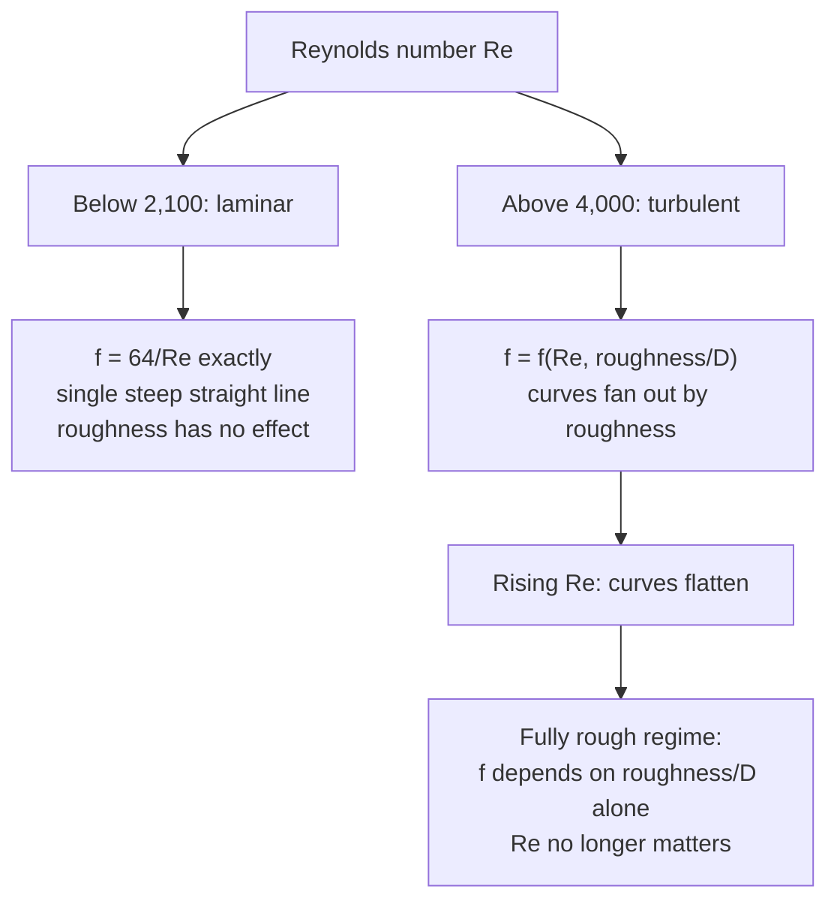

## ビデオ講義

<div class="video-container">
  <iframe
    width="560"
    height="315"
    src="https://www.youtube.com/embed/lfGMREF-V-c?start=2266"
    title="化学工学流体力学 第4章: 管内流れと圧力損失"
    frameborder="0"
    allow="accelerometer; autoplay; clipboard-write; encrypted-media; gyroscope; picture-in-picture"
    allowfullscreen>
  </iframe>
</div>

> このビデオは以下のテキストと同じ内容をカバーしています。お好みの学習形式をお選びください。

---

# 第4章：管内流れと圧力損失

本章では、[第2章](chapter-2.html)が記号のまま残した摩擦項を数値に変えます。ダルシー・ワイスバッハ式と摩擦係数（friction factor）があれば、ある配管系統を送液するのにいくらかかるかを計算できます。そしてその答えは管径に対して非常に急峻にスケールするので、フローシート上のほぼすべての配管のサイズを決めてしまうのです。

**摩擦係数と、流体を動かすコスト**

## 学習目標

本章を修了すると、以下ができるようになります:

  * ✅ 摩擦による圧力損失が、プラントの生涯にわたって繰り返し発生する運転コストである理由を説明できる
  * ✅ ダルシー・ワイスバッハ式を適用し、ダルシー（ムーディ）摩擦係数とファニング摩擦係数を区別できる
  * ✅ 層流の結果 $f = 64/Re$ が、姿を変えたハーゲン・ポアズイユの法則であることを示せる
  * ✅ ムーディ線図を概念的に読み取れる: レイノルズ数と相対粗さの役割
  * ✅ 配管系統の圧力損失とポンプ動力を計算し、それらが管径に対してどうスケールするかを予測できる
  * ✅ 相当長さ法と $K$ 係数法を用いて、継手とバルブを勘定に入れられる

**読了時間**: 20-25分 **コード例**: 1 **演習**: 3

* * *

## 4.1 圧力損失は運転コストである

[第2章](chapter-2.html)の機械エネルギー収支は、$h_f$ と書かれた項 — 摩擦損失 — と、それはいずれ仮定ではなく計算されるという約束で終わっていました。この項は帳簿上の厄介事ではありません。請求書です。

摩擦は機械エネルギーを、二度と戻ってこない熱へと変えます。流体が管壁に対して失ったぶんは、ポンプが入れ直さなければならず、そのポンプを駆動するモーターは、プラントが動いているあいだ毎時間、電力を引きます。0.5 kW を無駄にする配管1本は、連続運転では年間およそ 4,400 kWh のコストになります — 何千本もの配管を持つプラントの、たった1本でです。配管の設備費は一度きりですが、その摩擦は永久に払い続けます。

この捉え方が、設計上の問いを立ち上げます。太い管は同じ流量をより低い流速で運び、低い流速は摩擦を劇的に減らします — しかし太い管は、鋼材も、支持も、溶接も余計にかかります。細い管は買うのは安く、動かすのは高くつきます。その和を最小にする管径がどこかにあり、それを見つけるには摩擦の定量的なモデル、すなわち摩擦係数が必要です。

## 4.2 ダルシー摩擦係数

まっすぐな円管区間における摩擦圧力損失の実用式が、**ダルシー・ワイスバッハ式**です:

$$ \Delta P = f \, \frac{L}{D} \, \frac{\rho v^2}{2} $$

$h_f = \Delta P/\rho$ は同じ損失を J/kg（第2章の単位）で表したもの、$\Delta P/(\rho g)$ はヘッド（m）として表したものです。

ここで $L$ は管長、$D$ は内径、$\rho$ は流体密度、$v$ は平均流速、$f$ は無次元の**摩擦係数**です。計算に入る前にその構造を読み取ってください。圧力損失は長さに比例し、管径に反比例し、**速度ヘッド** $\rho v^2/2$ に比例します — ベルヌーイの式を貫いていたのと同じ運動エネルギーの項です。$f$ が一定なら流速を2倍にすると損失は4倍になります — 実際には $f$ は $Re$ とともにわずかに下がっていくので、[第3章](chapter-3.html)で触れた $v^{1.8-2}$ の挙動になります。

> ⚠️ **約束事の注意 — ダルシーかファニングか?** 2つの摩擦係数が流通しており、両者は4倍だけ異なります: $f_{\text{Darcy}} = 4 f_{\text{Fanning}}$。**本シリーズでは一貫してダルシー（ムーディとも呼ばれる）摩擦係数を用います**。層流の結果が $f = 64/Re$ となるほうです。化学工学の教科書のなかにはファニング係数を使うものもあり、そちらでは層流の結果が $f = 16/Re$ で、式には明示的な 4 が付きます。両者を混同するのは古典的な誤りで、圧力損失が4倍ずれた答えを生みます。線図、相関式、ソフトウェアが何を返しているのかをつねに確認してください — もっとも手早い判定は層流の直線です。64 ならダルシー、16 ならファニングです。

**層流では**、$f$ はまったく経験的な量ではなく、厳密です:

$$ f = \frac{64}{Re} $$

これは[第3章](chapter-3.html)のハーゲン・ポアズイユの法則を書き換えたものです。あの法則は $\Delta P = 32\mu L v / D^2$ を与えます。これをダルシー・ワイスバッハ式に代入して $f$ について解くと $f = \frac{32\mu L v}{D^2}\cdot\frac{D}{L}\cdot\frac{2}{\rho v^2} = \frac{64\mu}{\rho v D} = \frac{64}{Re}$ となります。同じ物理を2通りの表記で書いただけです — そして、層流の圧力損失が流速の2乗ではなく流速に比例するのは、ダルシー・ワイスバッハ式の $v^2$ が $f$ の中に隠れた $1/v$ によって打ち消されるからだ、という点に注意してください。

**乱流では**、そのような導出は存在しません。摩擦係数は、2つの無次元数 — レイノルズ数と、**相対粗さ** $\varepsilon/D$、すなわち壁面の凹凸の高さを管径で割ったもの — における実験的な相関式になります。0.05 mm の凸起は 10 mm の細管では効きますが、1 m のヘッダーでは見えません。だからこそ、絶対的な高さではなく比が支配するのです。

| 配管材質 | 絶対粗さ $\varepsilon$ |
|---|---|
| **引抜管（銅、ガラス）** | ≈ 0.0015 mm — 事実上滑らか |
| **市販鋼管 / 錬鉄** | **≈ 0.045 mm** — 標準的な設計値 |
| **亜鉛めっき鉄** | ≈ 0.15 mm |
| **コンクリート** | ≈ 0.3–3 mm |

プロセス配管に典型的なレイノルズ数（$10^4$ から $10^6$）における市販管では、$f$ はふつう **0.02 から 0.04** の範囲に収まります — 大口径で滑らかで流速の速い配管では下限寄り、小口径や粗い配管ではより高くなります。清浄な鋼管に対して $f \approx 0.02$ を頭の中の既定値として持っておけば、桁のオーダーの圧力損失は暗算でできるようになります。

## 4.3 ムーディ線図

$f$ を得る古典的な方法が**ムーディ線図**です。摩擦係数をレイノルズ数に対して両対数で描いた図で、それぞれ相対粗さ $\varepsilon/D$ の値がラベルされた曲線群を伴っています。その形は[第3章](chapter-3.html)の流動状態を符号化しています。



レイノルズ数が低いところでは、線図は**1本の急な直線**を示します — すべての管がその上に乗ります。層流では流体が壁の肌理をまったく感じないからです。遷移領域を過ぎると曲線は**相対粗さによって扇状に広がり**、それから**右へ向かって平坦になります**。その平坦な、**完全粗管**の領域では、摩擦係数はレイノルズ数への依存をすっかりやめ、$\varepsilon/D$ だけで決まります。実務上の帰結もあります。粗い管を高流量で流す場合、圧力損失は単純に $v^2$ に比例する形に戻るのです。

いまや産業界で紙の線図から $f$ を読む人はいません。ソフトウェアが相関式を評価し、乱流に対する基準となる相関式は**コールブルック式**です。これは陰形式で、反復して解かなければなりません。陽な近似式はその反復を避けます — **スワミー・ジェイン**の式がもっとも広く使われており、実用範囲でコールブルック式を約1%以内で再現します。それでも線図は頭の中の地図として残り続けます。自分が層流の直線の上にいるのか、粗さに敏感な中間域にいるのか、それとも $\varepsilon/D$ だけが効く平坦域に出ているのかを、一目で教えてくれるからです。

## 4.4 設計の例題

$\rho = 998$ kg/m³ の水が、$D = 0.05$ m の市販鋼管を $v = 2$ m/s で、$L = 100$ m にわたって流れているとします。[第3章](chapter-3.html)の定義から $Re = \rho v D/\mu \approx 998 \times 2 \times 0.05 / 10^{-3} \approx 1.0 \times 10^5$ — 堅実に乱流です — そして典型値 $f = 0.02$ を取ります（スワミー・ジェインの相関式はここで 0.022 を与えますが、きれいな手計算のために 0.02 に丸めます — $\Delta P$ を約10%過小評価することになります）。

$$ \Delta P = 0.02 \times \frac{100}{0.05} \times \frac{998 \times 2^2}{2} = 0.02 \times 2000 \times 1996 = 79{,}840\ \text{Pa} \approx 0.80\ \text{bar} $$

これを金額に換算しましょう。体積流量は $Q = vA = 2 \times (\pi \times 0.05^2/4) = 2 \times 0.001963 = 0.003927$ m³/s であり、**水力動力** — 流体が実際に吸収する機械的動力 — は、流量と、克服される圧力損失との積です:

$$ P_{\text{hyd}} = Q\,\Delta P = 0.003927 \times 79{,}840 = 313.5\ \text{W} \approx 0.31\ \text{kW} $$

ポンプはこれをただで供給してはくれません。ポンプとモーターを合わせた効率を典型的な65%とすると、電気の消費は $0.313/0.65 \approx 0.48$ kW — 連続運転では年間およそ 4,200 kWh を、水を管の中で動かすためだけに使うことになります。

次に、流量を一定に保ったまま管径を変えてみます。$Q$ 一定では流速は $D^{-2}$ でスケールし（断面積が $D^2$ で変わるため）、したがって $v^2 \propto D^{-4}$ です。これをダルシー・ワイスバッハ式の明示的な $1/D$ と組み合わせると、

$$ \Delta P \propto \frac{1}{D}\cdot\frac{1}{D^4} = D^{-5} \qquad \text{(fixed } Q,\ \text{fixed } f) $$

となり、$Q$ が一定なのでポンプ動力も同じようにスケールします。**管径を半分にすると、ポンプ動力は32倍になります。**

```python
import math

RHO = 998.0     # kg/m3, water at ~20 C
Q   = 0.003927  # m3/s, fixed volumetric flow (= 2 m/s in a 0.05 m pipe)
L   = 100.0     # m, pipe length
F   = 0.02      # Darcy friction factor, held fixed to isolate the D dependence
ETA = 0.65      # pump + motor efficiency, typical

print(f"{'D [m]':>7} {'v [m/s]':>8} {'dP [kPa]':>10} {'P_hyd [kW]':>11} {'P_elec [kW]':>12}")
for D in [0.025, 0.040, 0.050, 0.065, 0.080, 0.100]:
    A  = math.pi * D**2 / 4
    v  = Q / A
    dP = F * (L / D) * (RHO * v**2 / 2)   # Darcy-Weisbach, Pa
    Ph = Q * dP                            # hydraulic power, W
    print(f"{D:7.3f} {v:8.2f} {dP/1e3:10.1f} {Ph/1e3:11.3f} {Ph/ETA/1e3:12.3f}")

# scaling check: dP ratio between 0.05 m and 0.10 m against the D^-5 law
print(f"\nD^-5 law: halving D raises dP by {(0.10/0.05)**5:.0f}x")

#   D [m]  v [m/s]   dP [kPa]  P_hyd [kW]  P_elec [kW]
#   0.025     8.00     2554.9      10.033       15.435
#   0.040     3.13      243.7       0.957        1.472
#   0.050     2.00       79.8       0.314        0.482
#   0.065     1.18       21.5       0.084        0.130
#   0.080     0.78        7.6       0.030        0.046
#   0.100     0.50        2.5       0.010        0.015
#
# D^-5 law: halving D raises dP by 32x
```

この表の両端を読んでください。25 mm では、この配管は 15 kW を超える電力を要求します。100 mm では 15 W です。管径は4倍、1メートルあたりの費用はおそらく6倍から8倍になり、そして運転コストを1000分の1に削りました。これが、プロセス工学において5乗が他のほとんどどの指数よりも重要である理由です — そして同時に、誰も単純に入手できる最大の管を指定したりはしない理由でもあります。設備費は際限なく上がっていくのに対して、動力の節約の絶対量はやがて無視できるほど小さくなるからです。

## 4.5 継手、バルブ、相当長さ

現実の配管は曲がり、分岐し、拡大し、縮小し、バルブを通ります。そのいずれもが圧力を消費します。等価な2つの勘定方法が使われています。

**$K$ 係数（損失係数）**法（速度ヘッド法とも呼ばれます）は、各継手に無次元の損失係数を割り当て、それを速度ヘッドに対して課します:

$$ \Delta P_{\text{fitting}} = K \, \frac{\rho v^2}{2} $$

**相当長さ**法は代わりに、各継手を同じ損失を生じる直管の長さとして表し — たとえばエルボを「管径30個ぶんに等しい」といった具合に — それを $L$ に加えてから、ダルシー・ワイスバッハ式を一度だけ適用します。両者は同じ主張を書き換えたものにすぎず（$L_{\text{eq}}/D = K/f$）、どちらを選ぶかは習慣の問題です。

| 継手 | 損失 | 備考 |
|---|---|---|
| **ロングラジアスエルボ** | 小 | 緩やかに曲がる。ショートラジアスエルボは目に見えて高くつく |
| **ティー、直進側の流れ** | 小 | まっすぐ通り抜ける経路はほぼただ |
| **ティー、分岐側の流れ** | 中 | 角を曲がることこそが代金になる |
| **仕切弁、全開** | 小 | 遮断のための設計: 開口が大きく、障害が最小 |
| **玉形弁、全開** | **大** | 内部経路が入り組んでいる — 仕切弁の数十倍になることも多い |
| **調節弁、運転中** | **設計上、大** | 以下を参照 |

最後の行は、一見すると工学の失敗のように見えます。*化学工学入門*シリーズの調節弁（[第3章](../chemical-engineering-introduction/chapter-3.html)）は、ほぼすべてのフィードバックループの終端にあり、それらはまさに**絞ること**によって — 圧力損失を消費することによって — 機能します。全開時にほとんど圧力損失を取らないバルブは、動いたときに流量を変える能力もほとんど持たないでしょう。回路の残りの部分が支配的になってしまうからです。制御技術者はこれを**調節弁オーソリティ**と呼び、よくある経験則では系の動的な圧力損失の4分の1から3分の1をバルブに割り当てます。**制御性はエネルギーで買うもの**であり、しかも永続的に払い続けます — 正当な買い物ですが、配管径と同じ貸借対照表に載るべきものです。

そこから、[第1章](chapter-1.html)の**経済流速**という経験則、液体配管でおおよそ 1–3 m/s に戻ってきます。この範囲は流体力学の定数ではありません。コストの最小点が観測される場所です。それより下では要らない鋼材を買っていることになり、それより上では $D^{-5}$ の法則が主導権を握り、何十年も電気代を払うことになります。これはまさに、*入門*シリーズで**還流比**を決めているのと同じトレードオフです（[第4章](../chemical-engineering-introduction/chapter-4.html)）: 機器を一度買うか、ユーティリティを20年間毎時間払うか。

## 4.6 本章のまとめ

- 摩擦による圧力損失は**モデル上の細部ではなく、運転コスト**である: 失われたエネルギーをプラント稼働中は毎時間ポンプが補充するので、配管の設備費は一度きり、摩擦は永久に払い続ける
- **ダルシー・ワイスバッハ**: $\Delta P = f (L/D)(\rho v^2/2)$ — 長さに比例、管径に反比例、速度ヘッドに比例。本シリーズは**ダルシー（ムーディ）**係数を用いる。$f_{\text{Darcy}} = 4 f_{\text{Fanning}}$ であり、混同すると答えが4倍ずれる。層流の直線を確認せよ: 64 ならダルシー、16 ならファニング
- **層流**: $f = 64/Re$ が厳密に成り立つ — 代数的にハーゲン・ポアズイユと同一であり、粗さは無関係。**乱流**: $f = f(Re, \varepsilon/D)$ で経験的、プロセスのレイノルズ数域における市販鋼管（$\varepsilon \approx 0.045$ mm）では典型的に **0.02–0.04**
- **ムーディ線図**は、相対粗さの族ごとに $f$ を $Re$ に対して描いた地図である: 急な層流の直線、粗さによって扇状に広がる曲線、そして $\varepsilon/D$ だけが効く完全粗管の平坦域。いまやソフトウェアは**コールブルック**（あるいは陽な**スワミー・ジェイン**近似）を用いるが、線図は頭の中の地図として残る
- 例題 — 水、$v = 2$ m/s、$D = 0.05$ m、$L = 100$ m、$f = 0.02$: $\Delta P = $ **79,840 Pa ≈ 0.80 bar**、$Q = 0.003927$ m³/s、水力動力 **≈ 0.31 kW**、典型的な65%の効率では電力 **≈ 0.48 kW**
- **流量一定**のもとでは $v \propto D^{-2}$ なので $\Delta P \propto D^{-5}$: 管径を半分にするとポンプ動力は **32** 倍になる
- 継手は **$K$ 係数**（$\Delta P = K\rho v^2/2$）または**相当長さ**（$L_{\text{eq}}/D = K/f$）で勘定する。仕切弁は開いていれば安く、玉形弁は高く、**調節弁は意図的に絞られている** — 調節弁オーソリティは圧力損失で買うものだからである
- **経済流速** 1–3 m/s は、設備費と動力費の最小点を示す — 蒸留の還流比とまったく同じ形のトレードオフである

**次章**: 本章は請求書を計算しました。**[第5章](chapter-5.html)：ポンプと配管システム**では、それを支払う機械を紹介します — ポンプ特性曲線、システム曲線、両者が交わる運転点、そして NPSH、すなわちポンプがそもそも動くのか、それともキャビテーションで自らを壊してしまうのかを決める制約です。

## 演習問題

1. **概念 — どちらの係数か?** 同僚の表計算が管の圧力損失を計算し、$Re = 1000$ の層流の場合について摩擦係数 0.016 を返しています。(a) この表計算はどちらの約束事を使っているか。(b) その数値を本章に書かれたとおりのダルシー・ワイスバッハ式に入れると、圧力損失は何倍、どちらの向きに誤るか。(c) この層流の計算に相対粗さがどこにも現れないのはなぜか。
   *ヒント*: 何かを決める前に、$Re = 1000$ で層流の両方の式を評価せよ。
   *解答*: (a) $64/1000 = 0.064$、$16/1000 = 0.016$ なので、この表計算が返しているのは**ファニング**係数です。(b) ここに書かれたダルシー・ワイスバッハ式は $f_{\text{Darcy}} = 4f_{\text{Fanning}}$ を期待しているので、0.016 をそのまま使うと圧力損失は**4分の1に小さく**出ます — ポンプが過小サイズになるため、危険な向きの誤りです。0.064 を使うか、明示的に4倍を入れてください。(c) 層流では流体は秩序だった層をなして動き、壁の凹凸は壁近くの粘性領域の内側に収まっています。それらと相互作用する乱流の渦が存在しないのです。滑らかであれ粗いであれ、すべての管が同じ層流の直線に乗ります。

2. **定量 — 管径の法則**: 例題では、水（$\rho = 998$ kg/m³）$Q = 0.003927$ m³/s を $D = 0.05$ m、$L = 100$ m、$f = 0.02$ で流し、$\Delta P = 79{,}840$ Pa を得ました。**同じ体積流量**、同じ $f$ のまま $D = 0.10$ m について計算を繰り返し、結果を $D^{-5}$ の法則と照合せよ。
   *ヒント*: まず $Q = vA$ から新しい流速を求めよ — 流速をスケールさせるのは管径ではなく断面積である。
   *解答*: 断面積は4倍になり（$A = \pi \times 0.10^2/4 = 0.007854$ m²）、したがって $v = 0.003927/0.007854 = $ **0.5 m/s** です。すると $\Delta P = 0.02 \times (100/0.10) \times (998 \times 0.5^2/2) = 0.02 \times 1000 \times 124.75 = $ **2,495 Pa ≈ 0.025 bar**。比は $79{,}840 / 2{,}495 = $ **32.0** で、$D^{-5}$ の法則が予測する $2^5 = 32$ にぴたりと一致します。水力動力は 313.5 W から $0.003927 \times 2495 = $ **9.8 W** へ下がります。（実際には改善はこれよりわずかに小さくなります。$D$ を2倍にすると $Re$ は半分に、$\varepsilon/D$ も半分になるので、真の $f$ は少しずれます — もっとも、5乗のスケーリングはそうした補正のいずれをも圧倒します。）

3. **議論 — 配管サイズを決める**: 新しい冷却水配管のサイズを決めている若手技術者が、エロージョン限界を下回る範囲で流速を保てる最小の管を提案し、それがコストを最小にすると主張しています。(a) 彼らが最小化しているのはどのコストで、何を無視しているか。(b) この配管が20年間 24時間稼働する場合と、月に数時間しか使わない場合とで、答えはどう変わるか。(c) 配管に調節弁を追加すると、なぜ圧力損失の予算がわざと大きくなるのか、そしてそれは無駄なのか。
   *ヒント*: 一度きりのコストと繰り返し発生するコストを分け、そのうえで制御器が制御するために何を必要とするかを問え。
   *解答*: (a) 彼らが最小化しているのは**設備費** — 配管、継手、支持、断熱、据付工事 — であり、無視しているのは送液の**運転コスト**です。これは流量一定のもとで $D^{-5}$ でスケールします。管径をわずかに大きくするだけで、設備費の何割かの増加と引き換えにポンプ動力を1桁削れることがあり、だからこそ経済的な最適点はエロージョン限界ではなく 1–3 m/s の近くに位置するのです。(b) **稼働率が最適点を変えます。** 連続運転では動力の項が20年間積み上がり、より太い管へと押します。間欠的な配管ではエネルギーコストはほとんど積み上がらないので、最適点は機械的・水力的に許容できる最小の管のほうへ戻ります。サイジングの経験則は連続運転を前提としています。(c) 調節弁は**絞ること**によって — 圧力損失を消費することによって — 流量を調節するので、圧力損失が無視できるバルブは**オーソリティ**も無視できるほど小さくなります。動かしても流量はほとんど変わりません。配管の固定抵抗が支配的になるからです。動的な圧力損失のかなりの割合をバルブに割り当てるのは、無駄ではなく制御性の代価です。それは実在する永続的なエネルギーコストであり、制御が不要なところ（あるいは可変速駆動が絞りを代替できるところ）では、払うべきではありません。
