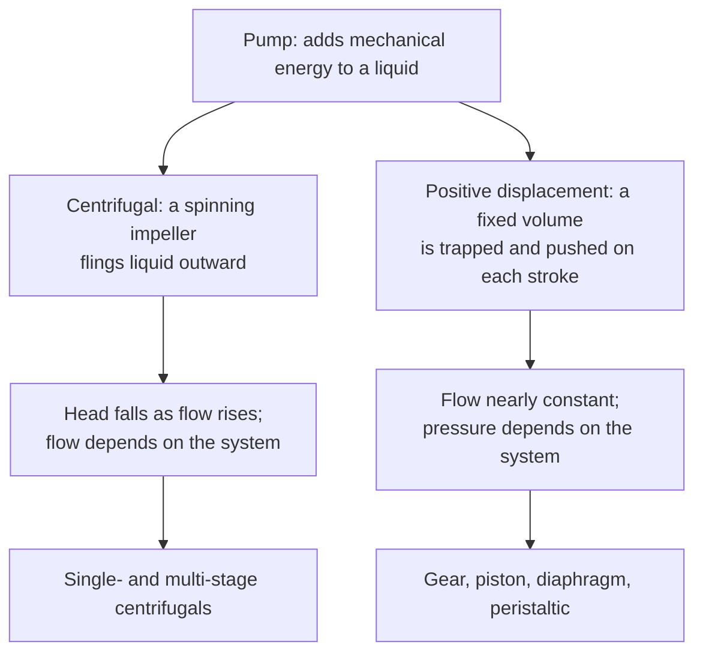

## ビデオ講義

<div class="video-container">
  <iframe
    width="560"
    height="315"
    src="https://www.youtube.com/embed/lfGMREF-V-c?start=3065"
    title="化学工学流体力学 第5章: ポンプと配管システム"
    frameborder="0"
    allow="accelerometer; autoplay; clipboard-write; encrypted-media; gyroscope; picture-in-picture"
    allowfullscreen>
  </iframe>
</div>

> このビデオは以下のテキストと同じ内容をカバーしています。お好みの学習形式をお選びください。

---

# 第5章：ポンプと配管システム

本章は、その代金を支払う機械とともに本シリーズを締めくくります。第 4 章では、流体を配管に通すための費用を数えました。ここでは、それを供給するポンプに出会い、ポンプと配管系が一致するただ 1 つの流量を見つける方法を学び、流量を制御する 2 つのやり方 — 一方は安価で無駄が多く、他方は高価で効率的 — を見ていきます。

**機械を配管回路に合わせる**

## 学習目標

本章を修了すると、以下ができるようになります:

  * ✅ ポンプが機械的エネルギー収支に何を供給するのかを説明できる: 高さ、圧力、そして摩擦
  * ✅ **揚程（head）** をメートル単位で定義し、$\Delta P = \rho g H$ によって圧力に換算できる
  * ✅ 遠心ポンプと容積式ポンプを区別し、それぞれがどのようなときに選ばれるかを述べられる
  * ✅ ポンプ曲線とシステム曲線が交わる **運転点（operating point）** を求め、絞りと回転数の変更がそれをどう動かすかを予測できる
  * ✅ **相似則（affinity laws）** を述べ、可変速駆動がなぜ省エネになるのかを説明できる
  * ✅ $\text{NPSH}_a > \text{NPSH}_r$ を用いて吸込配管のキャビテーションリスクを確認できる

**読了時間**: 20-25分 **コード例**: 1 **演習**: 3

* * *

## 5.1 ポンプの仕事

[第2章](chapter-2.html)は、機械的エネルギー収支を軸仕事の項 $w_{\text{pump}}$ とともに書き下し、それを約束のまま残しておきました。続く [第4章](chapter-4.html) は、その約束を高くつくものにしました: 配管、継手、バルブにおける摩擦は機械的エネルギーを絶えず消費し、何かがそれを補い続けなければなりません。その何かがポンプであり、その仕事はちょうど 3 つに分かれます。

ポンプは液体を重力に逆らって **持ち上げ** なければなりません — 吸込タンクから、より高い吐出点へ。ポンプは圧力に逆らって **押し込ま** なければなりません — ある圧力の容器から、より高い圧力の容器へ。そしてポンプは、第 4 章で計算した **摩擦の請求書を支払わ** なければなりません — 流量のおよそ 2 乗で増大する損失です。液体を 10 m 持ち上げるだけでよいポンプが、配管摩擦に打ち勝つためだけに、さらに 15 m 分のエネルギーを供給していることは十分にありえます。長い移送配管では、摩擦が支配的な項になります。

産業界は、そのエネルギーをジュールで、あるいは結果として生じる上昇をパスカルで表しません。表すのは **揚程（head）**、記号 $H$、単位は **メートル** です:

$$ H = \frac{w_{\text{pump}}}{g} $$

**揚程は、流体の単位質量あたりではなく単位重量あたりのエネルギーです**。だからこそ、キログラムあたりの仕事を $g$ で割ると長さが残るのです。「30 m の揚程を出す」ポンプは、摩擦がなければ *どんな* 液体でも 30 m 持ち上げます — 水でも、ガソリンでも、硫酸でも同じです。この流体によらないという性質こそが、この単位が生き残った理由のすべてです: 銘板の 1 つの数値が、中身ではなく機械そのものを記述するのです。

圧力はそうではありません。ポンプが生み出す圧力上昇は、[第1章](chapter-1.html)の静水圧の関係から導かれます:

$$ \Delta P = \rho g H $$

したがって、*同じ* 30 m の揚程でも、液体ごとに密度に比例して異なる圧力上昇になります。**揚程はポンプの性質であり、圧力はポンプと流体を合わせた性質です。** この 2 つを混同することはポンプ実務で最も多い単位の誤りであり、演習 2 でその違いを具体的に扱います。

必要な動力は揚程と流量から決まります。有効な水力動力は $\rho g Q H$ であり、軸で実際に消費される動力は、効率 $\eta$ の分だけそれより大きくなります。$\eta$ は適切に選定された遠心ポンプで通常 0.6〜0.8 です:

$$ \dot{W}_{\text{shaft}} = \frac{\rho g Q H}{\eta} $$

## 5.2 2 つの系統

化学プラントのほぼすべてのポンプは、エネルギーを *どのように* 加えるかによって区別される 2 つの系統のいずれかに属します。



**遠心ポンプ（centrifugal pump）** は、回転する羽根車（impeller）で液体を外向きに加速し、その速度を圧力に変換します。これが圧倒的な主力です: 単純で、安価で、バルブを持たず、固体分に強く、連続運転できます。その特徴的な挙動は、**流量が増えると揚程が下がる** ことです — 吐出弁をより大きく開ければ、ポンプはより低い揚程でより多くの流量を出します。

**容積式ポンプ（positive-displacement pump、PD ポンプ）** は、一定の体積の液体を閉じ込め、機械的に押し出します — 歯車のかみ合い、ピストン、たわむダイヤフラムによって。その特徴的な挙動はちょうど鏡像です: **打ち勝つべき圧力によらず、流量がほぼ一定なのです。** これは強力であり、同時に危険でもあります。閉じた吐出弁に対して運転される PD ポンプは「失速」しません。自らの体積を押し出そうとし続け、何かが屈するまで圧力が上がっていきます。**PD ポンプは、吐出配管に逃がし装置（relief device）を設けずに、閉じたバルブに対して運転してはなりません** — これは高度な工夫ではなく、標準的な実務です。

| | **遠心式** | **容積式** |
|---|---|---|
| **流量と圧力の関係** | 揚程が上がると流量が下がる | 流量は圧力にほぼ依存しない |
| **得意な用途** | 低〜中粘度、大流量 | 粘性液、定量供給、高圧 |
| **流れの安定性** | 滑らか | 脈動しやすい（ピストン、ダイヤフラム） |
| **吐出弁を閉じたとき** | 短時間なら耐えるが過熱する | 逃がし装置がなければ破壊的に故障する |
| **典型的な用途** | 移送、循環、還流、冷却水 | 定量注入、ポリマーやスラリーの移送、均質化 |

標準的な選定の実務は短いものです: **粘性のある用途、定量供給の用途、高圧の用途は容積式へ。それ以外のほぼすべては遠心式へ。** 例外はプラントの用途のうち少数派なので、遠心ポンプが既定の選択になります。

## 5.3 運転点

遠心ポンプは「ある流量」を持っているわけではありません。持っているのは **ポンプ曲線（pump curve）** — 右下がりの、揚程対流量の曲線 — であり、配管の側には **システム曲線（system curve、管路抵抗曲線）** があります: 打ち勝つべき実揚程（静揚程）に、[第4章](chapter-4.html)の摩擦損失を揚程として表したものを足したもので、およそ $Q^2$ で増大します。ポンプは *両方* の曲線上にある組み合わせしか出せないので、プラントはその唯一の交点、すなわち **運転点（operating point）** で運転されます。

運転点を動かす方法は 2 つあります。吐出弁を **絞る（throttling）** と摩擦が加わり、システム曲線が急になって、運転点は左へ、より低い流量へと滑っていきます。これは単純で、即座に効き、[化学工学入門 第3章](../chemical-engineering-introduction/chapter-3.html)の制御弁が行っていることそのものです。同時に無駄でもあります: ポンプは相変わらず高い揚程を出しており、その余剰はバルブで熱として破壊されます。

一方 **可変速駆動（variable-speed drive、インバータ、VSD）** は、*ポンプ* 曲線のほうを下げます。そのスケーリングを捉えるのが **相似則（affinity laws）** であり、遠心ポンプの性能を回転数 $N$ に結びつける比例関係です:

- 流量は回転数に比例: $Q \propto N$
- 揚程は回転数の 2 乗に比例: $H \propto N^2$
- 動力は回転数の 3 乗に比例: $P \propto N^3$

動力にかかる 3 乗こそが、可変速ポンプ運転の経済的な論拠のすべてです: 回転数を 20% 下げると、軸動力はおよそ半分になります。これらは理想化された関係であり — 幾何学的相似と、効率が変わらないことを仮定しています — したがって、保証ではなく最初の見積もりとして扱ってください。

以下のコードは、2 次のポンプ曲線 $H = a s^2 - bQ^2$ とシステム曲線 $H = H_{\text{static}} + kQ^2$ を交差させて運転点を求めます。ここで $a$ は **締切揚程（shutoff head）**（流量ゼロにおける揚程）であり、$s$ は回転数比です。これは **簡略化された教科書的な扱い** です: 相似則によるスケーリングを、実測の曲線ではなく理想的な 2 次曲線に適用しています。実際の選定で用いられるのは、まさにその実測の曲線のほうです。

```python
import math

RHO = 998.0      # kg/m3, water
G = 9.81         # m/s2

A = 40.0         # m, pump shutoff head at full speed
B = 0.0015       # m per (m3/h)^2, pump curve droop
H_STATIC = 12.0  # m, static lift between the two tank levels
K = 0.0012       # m per (m3/h)^2, friction coefficient of the open piping

def operating_point(k, s=1.0):
    """Pump curve H = A*s^2 - B*Q^2 meets system curve H = H_STATIC + k*Q^2."""
    q2 = (A * s**2 - H_STATIC) / (B + k)          # solve the two curves for Q^2
    q = math.sqrt(q2)                             # m3/h
    h = H_STATIC + k * q2                         # m
    p_fluid = RHO * G * (q / 3600.0) * h / 1000.0 # kW delivered to the liquid
    p_valve = RHO * G * (q / 3600.0) * ((k - K) * q2) / 1000.0  # kW burned in the valve
    return q, h, p_fluid, p_valve

cases = [("full speed, valve open", K, 1.0),
         ("throttled (k doubled)", 2 * K, 1.0),
         ("speed reduced to 80%", K, 0.8)]

print(f"{'case':>23} {'Q [m3/h]':>9} {'H [m]':>7} {'P_fluid [kW]':>13} {'P_valve [kW]':>13}")
for label, k, s in cases:
    q, h, pf, pv = operating_point(k, s)
    print(f"{label:>23} {q:9.1f} {h:7.2f} {pf:13.2f} {pv:13.2f}")

#                    case  Q [m3/h]   H [m]  P_fluid [kW]  P_valve [kW]
#  full speed, valve open     101.8   24.44          6.77          0.00
#   throttled (k doubled)      84.7   29.23          6.74          1.99
#    speed reduced to 80%      71.0   18.04          3.48          0.00
```

2 つの制御方式を突き合わせて読んでみましょう。絞りは流量を 17%、101.8 から 84.7 m³/h へと減らします — そして液体に伝えられる動力はほとんど変わらず、6.77 から 6.74 kW です。ポンプが自らの曲線をより高い揚程へと登っていくだけだからです。いまや 2.0 kW 近く、ポンプの出力のおよそ 30% が、バルブで破壊されています。ポンプを 80% の回転数まで落とすと、流量は 30%、流体動力は 49% 減り、バルブで焼き捨てられるものは何もありません。また、流量が相似則だけから示唆されるより大きく下がること（$0.8 \times 101.8 = 81.5$ ではなく 71.0 m³/h）にも注目してください: 相似則はポンプを記述するものであり、一方の実揚程はシステムに属していて、まったくスケールしないのです。

## 5.4 NPSH とキャビテーション

第 2 章は、ベルヌーイが不可避にした 1 つの破綻を予告していました: 液体を十分に加速すると、その圧力は自らの蒸気圧まで下がり、そこで沸騰します。ポンプでは、これは速度が最も高く圧力が最も低い羽根車の入口で起こり、それには名前と数値があります。

**NPSH（有効吸込ヘッド、Net Positive Suction Head）** とは、ポンプ吸込部で利用できる **絶対** 圧力と、運転温度における液体の飽和蒸気圧 $P^{sat}$（これも絶対圧）との間の余裕を、揚程のメートルで表したものです — この物性は [化学工学熱力学 第3章](../chemical-engineering-thermodynamics/chapter-3.html) で導入されました。この比較にゲージ圧の読みを入れてしまうと、まるまる 1 気圧 — 水頭でおよそ 10 m — が余裕から音もなく消えます: [第1章](chapter-1.html)のゲージ圧と絶対圧の教訓が、それを忘れると最も危険になる場所に現れるのです。**有効 NPSH（NPSH available）** はプラント側から計算されます: 吸込容器の圧力、液面、そして吸込配管の摩擦です。**必要 NPSH（NPSH required）** はポンプの性質であり、そのデータシートに記載されています。規則は容赦がありません:

$$ \text{NPSH}_a > \text{NPSH}_r $$

しかも設計上の余裕をもって、一般には 0.5〜1 m 以上です。これを破ると、低圧領域で蒸気の泡が発生し、数ミリメートル先の圧力が回復するところで激しく崩壊します。それが **キャビテーション（cavitation）** です: ポンプに砂利を入れたような騒音、振動、揚程の低下、そして羽根車の金属が点食で削り取られていくこと。

実際的な対策はどれも、左辺を上げるか右辺を下げるかのいずれかです:

| 対策 | 仕組み |
|---|---|
| 吸込タンクを高くする、またはポンプを下げる | 吸込側の実揚程が増える |
| 液を冷却する | $P^{sat}$ が急激に下がる |
| 吸込配管を短く、まっすぐに、または太くする | 羽根車の手前での摩擦損失が減る |
| ポンプの回転数を下げる | $\text{NPSH}_r$ が下がる |

典型的な犠牲者は、**すでに沸点にある液体** を扱うポンプで、そこでは余裕が最初からほぼゼロです: リボイラーの循環ポンプ、復水ポンプ、そして飽和状態の容器から吸い込むあらゆるポンプです。そうした用途では、対策はたいてい配置上のものになります — 容器を単純にポンプよりずっと高い位置に設置するのです。

## 5.5 気体: 送風機、ブロワ、圧縮機

液体ではなく気体を動かす場合、仕事は同じですが流体は圧縮性であり、それが下流のすべてを変えます。機械は圧力上昇の大きさで格付けされます: 換気規模の圧力には **送風機（fan）**、中程度の昇圧には **ブロワ（blower）**、本格的な圧力比には **圧縮機（compressor）** です。気体を圧縮すると温度が上がるため — [化学工学熱力学 第1章](../chemical-engineering-thermodynamics/chapter-1.html) の第一法則です — 圧縮機は高温の気体を送り出し、それは次の段の前に冷却が必要になることがあります。またその仕事は正真正銘の軸仕事、本シリーズの第 2 章がこだわった貴重な資源です。したがって大きな用途は、**間に中間冷却（intercooling）を挟んだ複数の段** に分割されます。発熱反応器における段間冷却を支配するのと同じ、段に分けて冷やすという論理です。その結果、同じ圧力比に対してより少ない仕事で済み、材料も耐えられるものになります。

## 5.6 シリーズのまとめ

5 つの章を、1 章 1 文で。**第 1 章** は、流体の物性と、何かが動き出す前から存在する圧力を確立しました。**第 2 章** は、エネルギー保存を機械的エネルギー収支とベルヌーイの式 — 圧力・速度・高さを互いに変換する道具 — に変えました。**第 3 章** は、レイノルズ数と、どの相関式が適用できるかを決める層流・乱流の分かれ目を導入しました。**第 4 章** は、配管と継手における摩擦に値段を付け、その費用を管径がどれほど鋭く支配するかを示しました。**第 5 章** は、その代金を支払う機械を用意し、それを配管回路に整合させました。

この流れはここで終わりません。本シリーズのどの章も、**流束 = 係数 × 駆動力** という 1 つのパターンの一例でした。そして同じ構造は、[化学工学伝熱](../chemical-engineering-heat-transfer/index.html) シリーズ — そこでの駆動力は温度差です — へ、さらに [化学工学物質移動と分離](../chemical-engineering-mass-transfer/index.html) シリーズ — そこでは濃度差です — へと、そのまま引き継がれます。ここで学んだ摩擦係数には、そこでも名前の違う、論理の同じ対応物があります。

次に進む先: これらの流れが支える単位操作については *化学工学入門* シリーズへ、蒸気圧と圧縮仕事の背後にある物性モデルについては *化学工学熱力学* へ、そしてそれらすべての上に築かれるデータの層については *プロセス・インフォマティクス入門* へ。

最後までお読みいただきありがとうございました。

## 演習問題

1. **概念 — 系統を選ぶ**: 2 台のポンプを仕様決定しなければなりません。(a) 250 m³/h の冷却水循環ループ、30 °C の水。(b) 加圧された反応器へ 4 L/h で注入される触媒添加剤、精度は ±2% が要求されます。それぞれについて遠心式と容積式のどちらかを選び、その根拠を述べ、後者が備えなければならない保護装置を 1 つ挙げなさい。
   *ヒント*: それぞれの用途で、大きく安定した流量と正確な流量のどちらがより重要かを問うこと。
   *解答*: **(a) 遠心式。** 大流量、低粘度、控えめな揚程、そして精度の要求がない — 遠心ポンプが最も安価で、最も単純で、最も信頼できる、まさに既定の用途です。(b) **容積式**、具体的には定量（ダイヤフラムまたはピストン）ポンプです。その流量はストロークと回転数で決まり、吐出圧力にほとんど依存しないので、反応器の圧力が変動しても注入量を保ちます。遠心ポンプなら、システム曲線が許すだけの量を送り、その流量は反応器圧力とともに揺れてしまうでしょう。保護装置は **吐出配管に設ける圧力安全弁**（または内蔵の逃がし機構）です: 吐出を塞がれた PD ポンプは、配管、シール、あるいはケーシングが壊れるまで圧力を上げていきます。

2. **定量 — 揚程は圧力ではない**: あるポンプが **30 m の揚程** を出します。それが生み出す圧力上昇を、(a) 水 $\rho = 998$ kg/m³、(b) 有機溶媒 $\rho = 800$ kg/m³ について計算しなさい。$g = 9.81$ m/s² とします。(c) この比較は、ポンプの銘板を読むことについて何を教えていますか。
   *ヒント*: $\Delta P = \rho g H$、SI 単位を入れれば Pa で出ます。1 bar = 10⁵ Pa。
   *解答*: (a) $\Delta P = 998 \times 9.81 \times 30 = \mathbf{293{,}711\ Pa \approx 2.94\ bar}$。(b) $\Delta P = 800 \times 9.81 \times 30 = \mathbf{235{,}440\ Pa \approx 2.35\ bar}$ — およそ **20% 小さく**、密度比 $800/998 = 0.802$ のとおりです。(c) **揚程はどちらの場合も同じ** です。揚程は液体ではなく機械の性質だからです。一方 **圧力上昇は同じではありません**。したがって、銘板の揚程はそのまま新しい用途へ移せますが、それに添えて示された圧力の数値は、それが示された流体に対してのみ有効です。同じ論理は逆向きにも効きます: 水から高密度のブラインへ移されたポンプは、同じ揚程を出しますがより高い圧力を生み、より多くの動力を消費します。$\dot{W} = \rho g Q H/\eta$ もまた密度に比例するからです。

3. **討論 — 流量が多すぎる**: 移送配管上の遠心ポンプが、プロセスに必要な量より多くの流量を送っています。運転員は吐出弁を絞ることを提案し、技術者は可変速駆動を取り付けることを提案しています。(a) それぞれが曲線と運転点に何をするかを説明しなさい。(b) 回転数を 20% 下げたときの動力の節約を見積もり、実際の節約がそれより小さい理由を述べなさい。(c) 3 人目の同僚は、代わりに *吸込* 弁を絞ることを提案しました — それの何が問題ですか。
   *ヒント*: 一方の選択肢はシステム曲線を、他方はポンプ曲線を変えます。(c) は 5.4 節の話です。
   *解答*: (a) **絞りは摩擦を加えてシステム曲線を急にします**。交点は左へ滑って流量は下がりますが、揚程は *上がり*、余剰の揚程はバルブで熱として破壊されます。5.3 節の例では、流量は 17% 下がった一方で、液体に伝えられる動力は実質的に変わらず、そのおよそ 30% がバルブで焼かれていました。**VSD はポンプ曲線を下げます**（$H \propto N^2$）。システム曲線は変わらないまま、より低い揚程でより低い流量に到達し、無駄になるものはありません。(b) 相似則 $P \propto N^3$ からは $0.8^3 = 0.512$、すなわち理想化された **50% 近く** の節約が得られ、計算した事例では 6.77 → 3.48 kW、流体動力で 49% の低下でした。2 つ目の数値を 1 つ目の裏付けとして読んでは **いけません**。相似則は、幾何学的に相似な運転状態をたどる経路に沿って成り立つものであり、純粋に摩擦だけの系はその経路を与えます。しかしこの系には **12 m の実揚程** があるため、運転点は別の経路をたどり、流体動力 $\rho g Q H$ は $N^3$ にまったく従いません — ここで 49% が 51.2% にこれほど近く落ち着いたのは偶然です。残るのは結論のほうです: VSD はバルブで何も破壊せずに低い流量に到達し、したがって絞りよりはるかに大きく節約します。実際の節約はさらに小さくなります。**最高効率点（BEP）**（ポンプのエネルギー浪費が最も小さい流量）から離れるとポンプ効率が落ち、駆動装置自体にも数パーセントの損失があり、そして **実揚程は回転数とともにスケールしない** からです — これはまた、流量が $Q \propto N$ だけから予測される 81.5 m³/h ではなく 71.0 まで下がった理由でもあります。ほとんどが静的な持ち上げである系では、VSD の節約はずっと小さく、$a s^2$ が実揚程を下回れば送液そのものが止まってしまいます。(c) **吸込側は決して絞ってはいけません。** 吐出側の絞りはエネルギーを費やしますが、吸込側の絞りは羽根車に届く圧力を下げ、$\text{NPSH}_a$ を直接削って、ポンプを **キャビテーション** へと追い込みます — 騒音、振動、揚程の喪失、そして侵食された羽根車です。流量制御は吐出側に属するものです。
