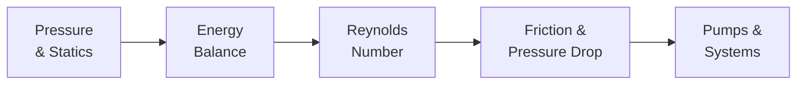

## ビデオ講義

  <iframe
    width="560"
    height="315"
    src="https://www.youtube.com/embed/lfGMREF-V-c"
    title="化学工学流体力学 - 全章"
    frameborder="0"
    allow="accelerometer; autoplay; clipboard-write; encrypted-media; gyroscope; picture-in-picture"
    allowfullscreen>
  </iframe>

> シリーズ全体を1本の動画にまとめています。各章ページのビデオは、その章の頭から再生されます。

---

# 化学工学流体力学

**圧力、流動状態、摩擦、そして流体を動かす機械**

化学プラントにあるもののほとんどは、動かされている流体です — 原料はポンプで送られ、気体は圧縮され、製品は配管を流れます。圧力損失は費用であり、流動状態は、下流のすべてがどれだけよく混ざり、熱を伝え、反応するかを決めます。本コースは、化学工学カリキュラムにおける輸送現象の流れを開くものです: まず運動量移動を扱い、**化学工学伝熱** シリーズへ続き、**化学工学物質移動と分離** シリーズで完結します。

## シリーズ概要

1. **保つ** — 流体の物性と静水圧の圧力場
2. **交換する** — ベルヌーイと機械的エネルギー収支: 圧力・速度・高さの取引
3. **仕分ける** — レイノルズ数があらゆる流れを層流か乱流に分ける
4. **支払う** — 摩擦係数が流れを運転費用に変える
5. **駆動する** — 配管システムに整合させたポンプと圧縮機

## 各章の内容

| 章 | タイトル | 学べること |
|---------|-------|---------------------|
| 1 | [流体、圧力、静力学](chapter-1.html) | 密度と粘度、静水圧、ゲージ圧と絶対圧、連続の式 |
| 2 | [ベルヌーイと機械的エネルギー収支](chapter-2.html) | 圧力・速度・高さの取引、トリチェリ、流量計測、摩擦とポンプ仕事 |
| 3 | [層流、乱流、そしてレイノルズ数](chapter-3.html) | レイノルズの実験、Re と流動状態、ハーゲン–ポアズイユ、産業がなぜ乱流で運転するのか |
| 4 | [管内流れと圧力損失](chapter-4.html) | ダルシーの摩擦係数、ムーディ線図、ポンプ費用の設計計算例、継手 |
| 5 | [ポンプと配管システム](chapter-5.html) | 遠心式と容積式、運転点、NPSH とキャビテーション、圧縮機 |

## 本シリーズの対象読者

- **学生** — 化学工学入門シリーズと熱力学シリーズから、輸送現象の中核へ進む方
- **エンジニア・研究者** — 配管をサイジングし、ポンプを選定し、流れの問題を解決する立場にあり、相関式の背後にある論理を知りたい方
- **データサイエンティスト** — プラントの流量・圧力・動力データを扱い、それらの信号が従う物理を必要とする方

推奨される予備知識: 化学工学入門。エネルギーと蒸気圧のつながりには熱力学シリーズが役立ちます。数学は代数の範囲にとどまり、いくつかの計算例が加わります。

## 関連シリーズ

**化学工学入門** および **化学工学熱力学** とともに、古典的な基礎のトラックを構成します。輸送現象の流れは **化学工学伝熱** シリーズへと続き、**化学工学物質移動と分離** で完結します。データ駆動の姉妹シリーズは **プロセス・インフォマティクス入門** と **プロセスモニタリング・制御入門** です。
