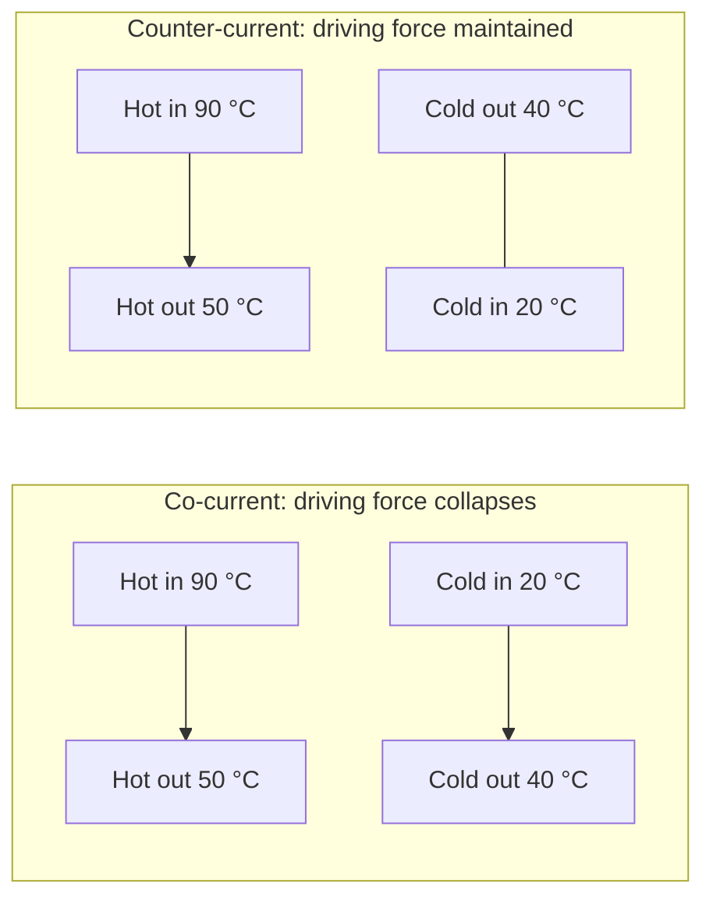

## ビデオ講義

<div class="video-container">
  <iframe
    width="560"
    height="315"
    src="https://www.youtube.com/embed/fpjFV6KX1hc?start=778"
    title="化学工学伝熱 第2章: 熱交換器と対数平均温度差（LMTD）"
    frameborder="0"
    allow="accelerometer; autoplay; clipboard-write; encrypted-media; gyroscope; picture-in-picture"
    allowfullscreen>
  </iframe>
</div>

> このビデオは以下のテキストと同じ内容をカバーしています。お好みの学習形式をお選びください。

---

# 第2章：熱交換器と対数平均温度差（LMTD）

[第1章](chapter-1.html)では、境膜の熱抵抗、壁の伝導、汚れをまとめて 1 つにした数値 — 総括伝熱係数 $U$ — を組み立てました。本章はそれを使います。2 つの流体と 1 つの熱負荷が与えられたとき、どれだけ大きな熱交換器を買えばよいのでしょうか。

**プロセス熱の主力機器をサイジングする**

## 学習目標

本章を修了すると、以下ができるようになります:

  * ✅ 熱交換器（heat exchanger）がフローシートに対して何をするのか、そして熱統合（heat integration）がなぜ二重に得なのかを説明できる
  * ✅ 多管式（シェルアンドチューブ、shell-and-tube）の構造と、それが業界標準であり続けている理由を述べられる
  * ✅ 並流（co-current）と向流（counter-current）を対比し、向流が優れている理由を述べられる
  * ✅ 対数平均温度差（LMTD）を計算し、なぜその平均が対数的なのかを説明できる
  * ✅ 汚れと $F$ 補正係数（correction factor）を含めて、$Q = U A \Delta T_{lm}$ により熱交換器を一通りサイジングできる
  * ✅ 与えられた問題に対して LMTD 法と ε-NTU 法のどちらを使うかを選べる

**読了時間**: 20-25分 **コード例**: 1 **演習**: 3

* * *

## 2.1 熱交換器の仕事

熱交換器は、2 つの流体を混ぜることなく一方から他方へ熱を移します。そう言ってしまうと配管工事のように聞こえますが、経済性はまったく配管工事のようなものではありません。冷却を必要とするあらゆる高温流体は、誰かが冷却水にお金を払って冷やしている高温流体であり、加熱を必要とするあらゆる低温流体は、ユーティリティ請求書に載る蒸気です。両者を組み合わせれば、1 台の装置が両方の費用を一度に消し去ります。それが**熱統合**であり、[入門シリーズ第4章](../chemical-engineering-introduction/chapter-4.html)がその体系的な形を示しました: ピンチ解析（pinch analysis）です。これはネットワークを描く*前に*、可能な最小の高温・低温ユーティリティを計算します。熱交換器は、その目標を実現するハードウェアです。

この仕事の大半をこなす装置が**多管式熱交換器**です: 一方の流体を運ぶ管の束を、他方の流体を運ぶ円筒形の胴（シェル）に封入し、シェル側にはバッフルを渡して外側の流体が管をまっすぐ通り過ぎるのではなくジグザグに横切るように仕向けたものです。これは 1 世紀にわたって標準であり続けてきましたが、その理由は華々しいものではありません。金属に費用をかけられる範囲であれば実質どんな圧力と温度にも耐え、機械的に頑丈で、清掃のために管束を引き抜くことができ、その設計は **TEMA** 規格によって成文化されているため、仕様書はどの製作者にとっても同じ意味を持ちます。業界の標準的な慣行のもとでは、何か別のものを選ぶ理由がないかぎり、手にするのは多管式です。

理由はあります。**プレート式熱交換器**（plate exchanger） — ガスケット付きの波形プレートをフレームに積層したもの — は、清浄で中程度の圧力の用途において、はるかに小さな容積ではるかに高い $U$ を達成し、清掃のために平らに開くことができます。[第5章](chapter-5.html)ではこれをプロセス強化のもとで扱います。空冷器、二重管式、スパイラル式もそれぞれの適所を占めています。以下のサイジングの論理はそれらすべてで同一であり、変わるのは $U$ と幾何形状だけです。

## 2.2 流れの配置

2 つの流体は同じ向きにも逆向きにも流せますが、その選択は見た目の問題ではありません。

**並流**（parallel flow）では、両方が同じ端から入ります。温度差は大きく始まり — 高温側入口と低温側入口の対比 — 2 つの流体が共通の中間温度へ収束するにつれて潰れていきます。**向流**では、両者は反対の端から入るので、高温側入口は低温側*出口*と、高温側出口は低温側*入口*と向き合います。2 つの流体の差の減衰ははるかに緩やかで — ちょうど一定になるのは、2 つの熱容量流量が一致するときだけです。

| | 並流 | 向流 |
|---|---|---|
| **入口** | 同じ端 | 反対の端 |
| **長さ方向の駆動力** | 入口で大きく、出口に向かって潰れる | 維持され、より均一 |
| **低温側出口と高温側出口** | 低温側出口は高温側出口より低くとどまるほかない | 低温側出口が高温側出口を**上回りうる** |
| **所定の熱負荷に必要な面積** | 大きい | 小さい |
| **管壁の応力** | 入口端で急峻な勾配 | より緩やかで、分散している |

3 行目が決定的です。並流では、低温流体を高温流体の出口温度より上に引き上げることは決してできません — 両者は同じ出発点から互いに近づいており、いったん出会えば熱の流れは止まります。向流にはそうした限界がありません: 低温側出口が高温側*入口*と向き合うので、低温流体は高温流体の出口温度より高温で出て行くことができます。これが**温度クロス**であり、並流では単純に得られないものです。より大きな平均駆動力と併せて、これこそが向流が既定の配置である理由であり、以下の各節が向流を前提とする理由です。



向流のブロックは、低温流体については右から左へ読んでください: 低温流体は高温流体が 50 °C で*出て行く*場所に 20 °C で入り、高温流体が 90 °C で*入って来る*場所から 40 °C で出て行きます。70 K と 10 K という組み合わせではなく、30 K と 50 K という 2 つのアプローチ温度差になるのです。

## 2.3 対数平均温度差

サイジングの式は、標準的な形をした移動の法則 — 流束は係数かける駆動力であり、それを面積にわたって積分したもの — です:

$$ Q = U A \Delta T_{lm} $$

ここで $Q$ は**熱負荷**（単位時間あたりに移動する熱量、単位は W）、$U$ は総括伝熱係数で単位は W/(m²·K)、$A$ は伝熱面積で単位は m²、$\Delta T_{lm}$ は 2 つの流体の間の実効的な平均温度差です。厄介なのは、この温度差が 1 つの数値ではないことです: それは熱交換器に沿って連続的に変化します。では、正しい平均とは何でしょうか。

算術平均ではありません。熱が壁を横切るにつれて、各流体の温度は吸収した、あるいは手放した熱に比例して変化するので、両者の隔たりは面積に対して直線的にではなく指数的に縮んで — あるいは広がって — いきます。$U$ が一定、比熱が一定、周囲への熱損失が無視できるという条件で、向流の熱交換器に沿って $dQ = U\,\Delta T\,dA$ を積分すると、**対数平均温度差**が得られます:

$$ \Delta T_{lm} = \frac{\Delta T_1 - \Delta T_2}{\ln(\Delta T_1 / \Delta T_2)} $$

ここで $\Delta T_1$ と $\Delta T_2$ は両端におけるアプローチ温度差です。

### 例題

熱水が 90 °C から 50 °C へ冷却され、冷水が 20 °C から 40 °C へ加熱される向流の場合。各端を正しく組み合わせてください — 高温側入口と低温側出口、高温側出口と低温側入口です:

$$ \Delta T_1 = 90 - 40 = 50\ \text{K}, \qquad \Delta T_2 = 50 - 20 = 30\ \text{K} $$

$$ \Delta T_{lm} = \frac{50 - 30}{\ln(50/30)} = \frac{20}{0.5108} = 39.2\ \text{K} $$

算術平均なら 40 K で、約 2.2% の過大評価になります。$A$ は $\Delta T$ に反比例するので、それを使えば熱交換器を約 2% 過小に設計することになります。ここではそれは許容範囲ですが、この誤差は一定ではありません。対数平均はつねに 2 つのうち*小さい*ほうであり、両端が不揃いになるほどその差は開きます。10:1 の開きでは算術平均が 40% を超えて上振れし、それは所定の熱負荷を決して出せない熱交換器を意味します。対数平均を使ってください。

## 2.4 完全なサイジング

$c_p = 4.18$ kJ/(kg·K) の水 2 kg/s が 40 K 冷却される場合を取り上げます。熱負荷は片方の流体についてのエネルギー収支から求まります:

$$ Q = \dot{m} c_p \Delta T = 2 \times 4.18 \times 40 = 334.4\ \text{kW} $$

水－水の多管式装置では、清浄時の総括伝熱係数の**代表値**は 500 W/(m²·K) 前後です。先ほどの 39.2 K の駆動力を使うと:

$$ A = \frac{Q}{U \Delta T_{lm}} = \frac{334{,}400}{500 \times 39.2} = 17.1\ \text{m}^2 $$

その数値と発注書との間には、2 つの現実確認が立ちはだかります。

**汚れ。** 500 W/(m²·K) は清浄時の値です。運転中はスケール、生物膜、腐食生成物が[第1章](chapter-1.html)の汚れ熱抵抗を加え、$U$ は下がります — 冷却水の用途ではしばしば 3 分の 1 以上も。清浄時にぴったり合わせてサイジングされた熱交換器は、試運転の日には所定の熱負荷を満たしても、その後は満たせません。そこで設計者は汚れ余裕を加え、実質的に汚れた $U$ に対してサイジングします。

**多パスの幾何形状。** 実際の多管式装置が純粋な向流で運転されることはまれです。**多パス**の熱交換器は、流速のためにも、また小型化のためにも、管側流体をシェルの中で 1 往復以上させます — 2 パス、4 パス、あるいは 6 パス。するとそれらのパスのいくつかは並流になり、駆動力を損ないます。標準的な手当ては**補正係数** $F$ で、これは所定のパス配置に対して公表された線図から読み取る 1 未満の無次元数であり、$Q = U A F \Delta T_{lm}$ を与えます — ここで $\Delta T_{lm}$ は上で計算した**向流**の対数平均であり、$F$ が実際に作られた配置に合わせてそれを割り引くのです。設計者は $F$ をおよそ 0.8 より上に保ちます。それを下回ると、その配置は敏感すぎて信頼できず、答えはシェルを直列に増やすことになります。線図そのものは本章の範囲を超えます — 用語を認識し、多パスの装置は向流の理想よりつねに多くの面積を必要とすることを知っておいてください。

```python
import math

CP_WATER = 4.18  # kJ/(kg*K)


def duty(m_dot, cp, delta_T):
    """Heat duty [kW] for a stream of m_dot [kg/s] changed by delta_T [K]."""
    return m_dot * cp * delta_T


def lmtd(dT1, dT2):
    """Log-mean temperature difference [K] from the two end approaches."""
    if abs(dT1 - dT2) < 1e-9:
        return dT1
    return (dT1 - dT2) / math.log(dT1 / dT2)


def area(Q_kW, U, dT_lm):
    """Heat-transfer area [m^2] from Q = U * A * dT_lm, with U in W/(m^2*K)."""
    return Q_kW * 1000.0 / (U * dT_lm)


# Hot water 90 -> 50 C against cold water 20 -> 40 C, counter-current
dT1, dT2 = 90 - 40, 50 - 20
dT_lm = lmtd(dT1, dT2)
Q = duty(2.0, CP_WATER, 40.0)

print(f"dT1 = {dT1} K, dT2 = {dT2} K")
print(f"LMTD          = {dT_lm:.2f} K")
print(f"arithmetic dT = {(dT1 + dT2) / 2:.2f} K "
      f"(+{100 * ((dT1 + dT2) / 2 / dT_lm - 1):.1f}%)")
print(f"duty Q        = {Q:.1f} kW\n")

print(f"{'U [W/(m2.K)]':>13} {'area [m2]':>10}")
for U in (300, 500, 800):
    print(f"{U:>13} {area(Q, U, dT_lm):10.1f}")

# dT1 = 50 K, dT2 = 30 K
# LMTD          = 39.15 K
# arithmetic dT = 40.00 K (+2.2%)
# duty Q        = 334.4 kW
#
#  U [W/(m2.K)]  area [m2]
#           300       28.5
#           500       17.1
#           800       10.7
```

この振り分けが教訓です: 面積は $U$ に反比例します。300 W/(m²·K) の汚れた装置は 28.5 m² を要し、清浄時の 17.1 m² より 3 分の 2 だけ多くの鋼材を使いますが、800 W/(m²·K) の高性能な伝熱面なら 10.7 m² で済みます。$U$ の不確かさはそのまま設備費へ伝播し、だからこそ第 1 章の係数の見積もりは、あれだけの手間をかける価値があるのです。

駆動力も同じように振る舞い、そこにこそ設計者のてこがあります。2 つの流体の間のアプローチ温度差を詰めようとすれば — より多くの熱を回収し、ユーティリティ請求書を削る — $\Delta T_{lm}$ は縮み、必要な面積はアプローチがゼロに近づくにつれて無限大へと登っていきます。したがって熱回収は決して無料ではありません。それは金属で買われるのです。一般的な実務は**最小アプローチ温度差**でこの議論に決着をつけます。液体の用途では通常 10 K 前後で、これはまさにピンチ解析が入力として取るパラメータです。

## 2.5 ε-NTU 法

上のサイジングがうまくいったのは、4 つの端点温度がすべて分かっていたからです。分かっていないことも少なくありません。代わりに「この熱交換器とこの 2 つの入口流体があるとき、何が出てくるか」と問われると、LMTD 法は行き詰まります: $\Delta T_{lm}$ には出口温度が必要で、出口温度には熱負荷が必要だからです。推定し、解き、反復することになります。

**温度効率-NTU**（ε-NTU）法は、問いを言い換えることでこの反復を取り除きます。**温度効率（effectiveness）** $\varepsilon$ は、実際の熱負荷を熱力学的に最大の熱負荷で割ったものです — 無限に大きな向流熱交換器が移動させるであろう熱量で、熱容量流量 $\dot{m} c_p$ の小さいほうの流体によって制限されます:

$$ \varepsilon = \frac{Q_{\text{actual}}}{Q_{\max}}, \qquad Q_{\max} = (\dot{m} c_p)_{\min} (T_{h,in} - T_{c,in}) $$

**移動単位数（number of transfer units）**は熱交換器の無次元の大きさです:

$$ \text{NTU} = \frac{UA}{(\dot{m} c_p)_{\min}} $$

流れの配置ごとに既知の関係 $\varepsilon(\text{NTU}, C_r)$ があり、ここで**熱容量流量比**は $C_r = C_{\min}/C_{\max} \le 1$、すなわち 2 つの熱容量流量 $\dot{m}c_p$ のうち小さいほうを大きいほうで割ったものです。ハードウェアと入口条件が与えられれば、NTU と $C_r$ を計算し、$\varepsilon$ を読み取れば、出口温度は 1 回で求まります — 反復はありません。関係式そのものはどの伝熱の教科書にも表として載っており、ここでは意図的に省きます。このレベルで重要なのは、その問題がどちらの道具を要求しているかを知ることです。

| 状況 | 使うもの |
|---|---|
| 4 つの端点温度がすべて既知で、面積を求める | **LMTD** |
| 指定された熱負荷に対する新規装置の設計 | **LMTD** |
| 出口温度が未知で、ハードウェアが決まっている | **ε-NTU** |
| 既存の熱交換器を新しいサービスで評価する | **ε-NTU** |
| 装置が熱力学的限界にどれだけ近いかを確認する | **ε-NTU** |

$\varepsilon$ がもたらすものがもう 1 つあります: それは単なる解法の技巧ではなく、性能の指標でもあるということです。$\varepsilon = 0.9$ の熱交換器はすでに利用可能な熱の 90% を取り出しており、面積を 2 倍にしてもそれ以上大きくは得られません。その判断は LMTD の枠組みではほとんど見えません。

## 2.6 本章のまとめ

1. 熱交換器は流体を混ぜることなくそれらの間で熱を移す。高温と低温のプロセス流体を組み合わせること — **熱統合** — は、蒸気の請求書と冷却水の請求書を同時に削る
2. **多管式**は標準的な慣行のもとでの業界の主力機器である: あらゆる圧力に対応し、機械的に頑丈で、清掃でき、TEMA によって標準化されている。プレート式熱交換器は清浄な用途において、より小さな容積でより高い $U$ を与える（[第5章](chapter-5.html)）
3. **向流**は並流に勝る: 長さ方向にわたって駆動力を維持し、低温流体が高温流体の出口温度より高温で出て行く温度クロスを許す — これは並流では不可能である
4. 正しい平均駆動力は**対数平均** $\Delta T_{lm} = (\Delta T_1 - \Delta T_2)/\ln(\Delta T_1/\Delta T_2)$ である。流体間の隔たりが面積に対して指数的に減衰するからである。90→50 °C と 20→40 °C の場合: $\Delta T_1 = 50$ K、$\Delta T_2 = 30$ K、$\Delta T_{lm} = 20/0.5108 = 39.2$ K であり、これに対して算術平均 40 K は 2.2% 過大評価する
5. **サイジング**: $Q = \dot{m} c_p \Delta T = 2 \times 4.18 \times 40 = 334.4$ kW、次いで水－水の代表的な $U$ である 500 W/(m²·K) のもとで $A = Q/(U\Delta T_{lm}) = 334{,}400/(500 \times 39.2) = 17.1$ m²。面積は $1/U$ に比例する: 300 では 28.5 m²、800 では 10.7 m²
6. その数値と購入との間には 2 つの補正がある: 運転中に $U$ が劣化するための**汚れ余裕**と、純粋な向流ではない多パス配置に対する**補正係数** $F < 1$ である — $F$ はおよそ 0.8 より上に保つこと
7. **ε-NTU** は出口温度が未知のときに LMTD に取って代わる: $\varepsilon = Q_{\text{actual}}/Q_{\max}$ と $\text{NTU} = UA/(\dot{m}c_p)_{\min}$ が反復なしに答えを与え、$\varepsilon$ は装置が熱力学的な上限にどれだけ近いかの指標も兼ねる

**次章**: 上のすべての式は、各流体の $c_p$ が一定で、熱を吸収するにつれて温度が変化することを前提としていました。流体を沸騰させたり凝縮させたりすると、その前提は崩れます — 流体は*一定の*温度で膨大な熱を吸収し、係数は 1 桁跳ね上がります。[第3章](chapter-3.html)は**沸騰、凝縮、そして蒸発缶**に取り組みます。

## 演習問題

1. **概念 — なぜ向流なのか**: あるプロセス流体を、95 °C で利用でき 60 °C で出て行く高温流体を使って 30 °C から 85 °C まで加熱しなければならない。(a) この熱負荷は並流の熱交換器で達成可能か。(b) 向流ではどうか。(c) 向流の場合の両端のアプローチ温度差はいくらで、小さいほうは必要面積について何を意味するか。
   *ヒント*: 並流では両方の流体が同じ端から共通の温度へ向かって進む。低温流体が高温流体の出口温度より上に到達しうるかを問え。
   *解答*: (a) **不可能です。** 並流では 2 つの流体が収束するので、低温側出口が高温側出口を上回ることは決してありません。ここでは低温流体が 85 °C に達しなければならないのに高温流体は 60 °C で出て行きます — 25 K の**温度クロス**であり、その配置では熱力学的に到達不能です。(b) **可能です。** 向流は低温側出口を高温側*入口*（95 °C）と組み合わせるので、85 °C はどこにおいても局所の高温側温度より十分に低くなります。(c) 高温側入口の端で $\Delta T_1 = 95 - 85 = 10$ K、低温側入口の端で $\Delta T_2 = 60 - 30 = 30$ K です。10 K のアプローチが制約です: 駆動力は $A = Q/(U \Delta T_{lm})$ の分母に現れるので、詰めたアプローチは面積を対価として熱的性能を買うことになります。ここでは $\Delta T_{lm} = 20/\ln(3) = 18.2$ K であり、算術平均の 20 K を十分に下回ります。

2. **定量 — 油冷却器の LMTD**: 高温の油が **120 °C から 70 °C へ**冷却され、冷却水が **25 °C から 45 °C へ**加熱される向流の場合。(a) 両端のアプローチ温度差を計算せよ。(b) $\Delta T_{lm}$ を計算せよ。(c) 2.3 節の水－水の例題の LMTD と比較し、$\ln(\Delta T_1/\Delta T_2)$ の値について論評せよ。
   *ヒント*: 高温側入口は低温側出口と、高温側出口は低温側入口と組み合わせる。その上で $\Delta T_{lm} = (\Delta T_1 - \Delta T_2)/\ln(\Delta T_1/\Delta T_2)$ に代入せよ。
   *解答*: (a) $\Delta T_1 = 120 - 45 =$ **75 K**、$\Delta T_2 = 70 - 25 =$ **45 K**。(b) $\Delta T_{lm} = (75-45)/\ln(75/45) = 30/0.5108 =$ **58.7 K**。(c) 対数は 2.3 節と**同じ 0.5108** であり、それは偶然ではありません: $75/45$ も $50/30$ もどちらも $5{:}3$ の比に約分され、対数に入るのはアプローチの*比*だけだからです。分子は異なる（ここでは 30 K、あちらでは 20 K）ので LMTD は異なります — 58.7 K に対して 39.2 K です。どちらの算術平均（60 K と 40 K）もそれぞれの対数平均より約 2.2% 上にあり（同じことを言い換えれば、対数平均のほうが約 2.1% 下にあり）、これが一般的な結果です: パーセントでの差は比だけで決まります。

3. **議論 — サイジングとその補正**: ある技術者が、$U = 500$ W/(m²·K) と $\Delta T_{lm} = 39.2$ K のもとで 334.4 kW の水－水熱交換器をサイジングして 17.1 m² を得、ちょうどその通りに発注した。(a) 設置された装置の性能を不足させる要因を 2 つ挙げよ。(b) 2 管パス設計では $F = 0.85$ となる。そのとき必要な面積はいくらか。(c) さらに汚れによって運転中に $U$ が 350 W/(m²·K) へ下がるとしたら、汚れた状態で所定の熱負荷を満たしたのはどれだけの面積か。またその比較は設計実務について何を語るか。
   *ヒント*: 両方の補正を $Q = U A F \Delta T_{lm}$ に入れ、そのつど $A$ について解け。
   *解答*: (a) **汚れ**（何か月もの運転にわたって熱抵抗を加え $U$ を下げる、[第1章](chapter-1.html)）と、**多パスの補正係数** $F < 1$ です。2 パスの装置は純粋な向流ではなく、LMTD が示唆するよりも小さな実効駆動力しか持たないからです。(b) $A = Q/(U F \Delta T_{lm}) = 334{,}400/(500 \times 0.85 \times 39.2) =$ **20.1 m²**、理想の数値より約 18% 大きくなります。(c) $U = 350$ かつ $F = 0.85$ では: $A = 334{,}400/(350 \times 0.85 \times 39.2) =$ **28.7 m²** で、当初の 17.1 m² よりおよそ 68% 大きい値です。発注されたままの熱交換器は、清浄なときには所定の熱負荷を満たしますが、1 回の清掃サイクルのうちに不足に陥ります。したがって標準的な実務は、$F$ を含めた上で**汚れた**係数に基づいてサイジングすることです — 余分な面積は一度きり買えば済むのに対し、過小な熱交換器は、取り替えられるまで毎日プラントの能力を絞り続けるからです。
